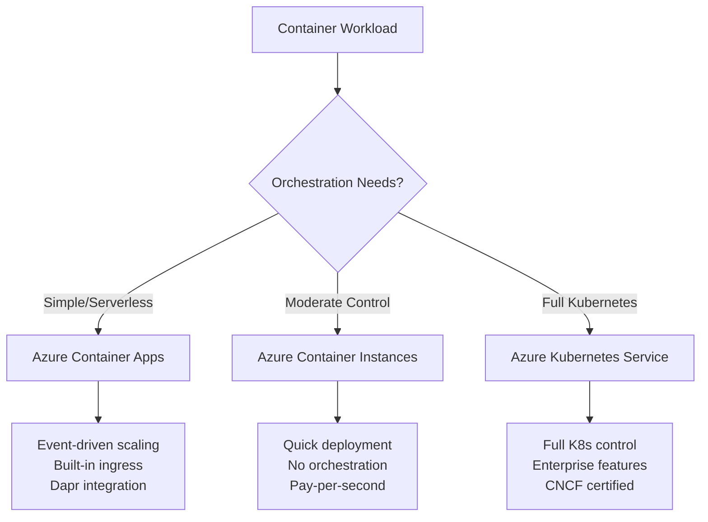
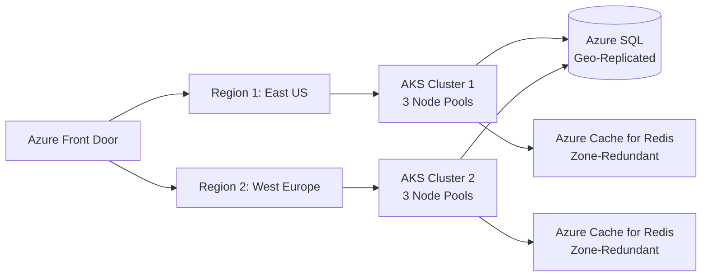
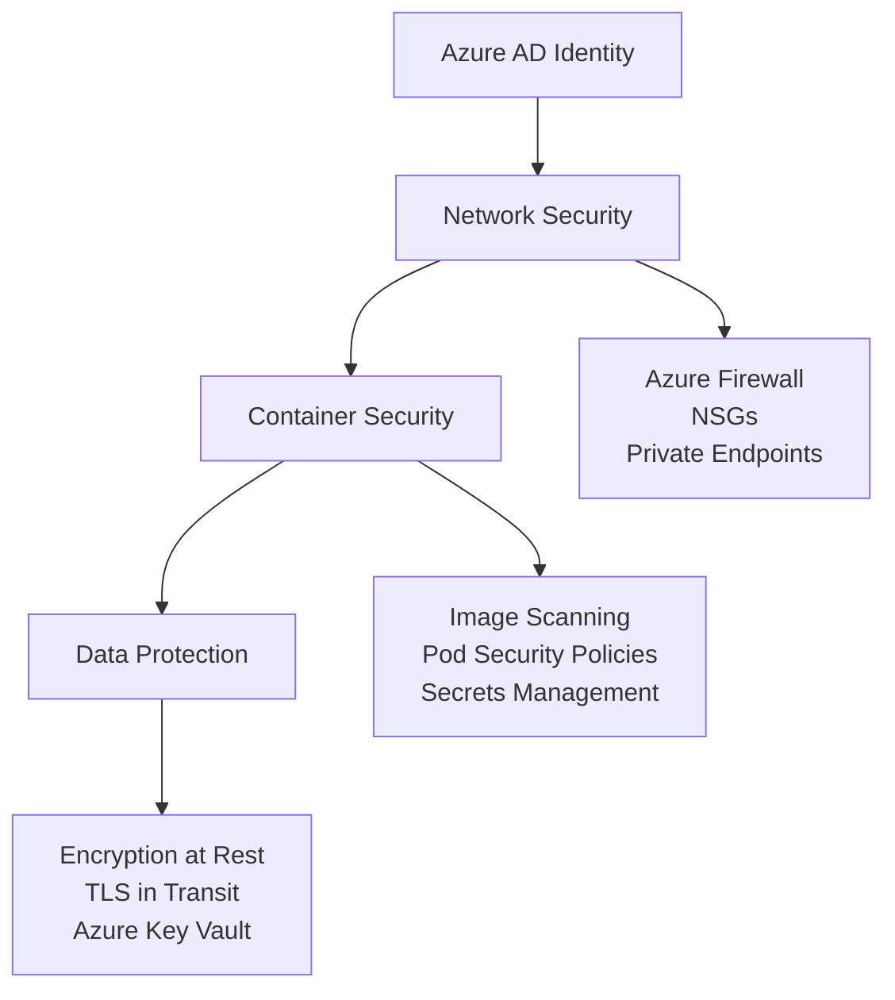
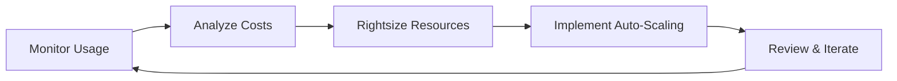
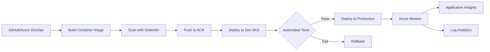
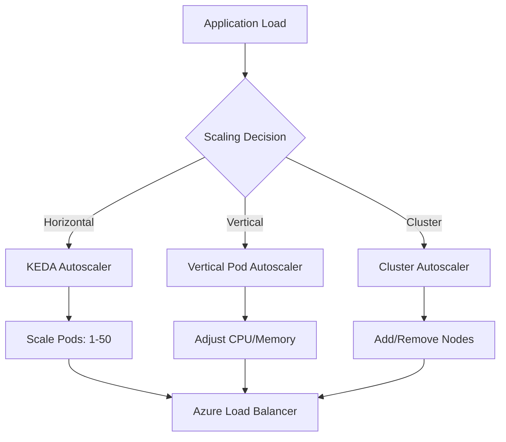
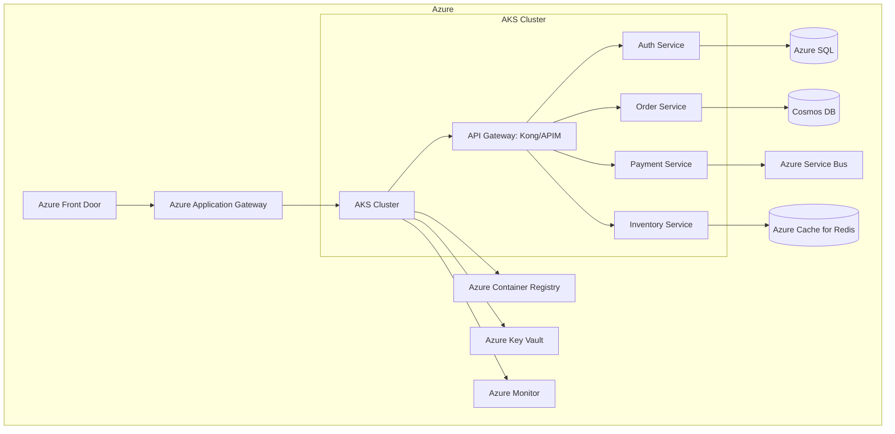
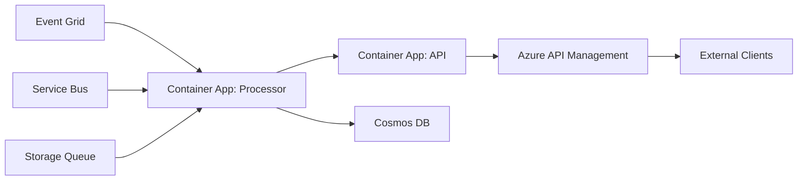

# Azure Well-Architected Framework: A Comprehensive Guide for Container-Based Applications

**Author:** Randy Bordeaux  
**Date:** January 2026  
**Version:** 1.0  
**Azure Services:** Azure Kubernetes Service (AKS), Azure Container Apps, Azure Container Instances, Azure Monitor, Azure Policy, Azure Cost Management, Azure Key Vault, Azure Virtual Networks

## Executive Summary

The Azure Well-Architected Framework provides a structured approach to designing, deploying, and operating reliable, secure, cost-effective, and efficient cloud applications on Microsoft Azure. This whitepaper focuses on applying the framework's five pillars—**Reliability, Security, Cost Optimization, Operational Excellence, and Performance Efficiency**—to containerized workloads using Azure Container Apps, Azure Kubernetes Service (AKS), and Azure Container Instances.

Organizations adopting container-based architectures can leverage Azure's comprehensive platform services to achieve:
- **99.95% SLA** for production workloads
- **30-40% cost reduction** through rightsizing and auto-scaling
- **Improved deployment velocity** with CI/CD integration
- **Enhanced security posture** through defense-in-depth strategies

This whitepaper provides actionable guidance, architecture diagrams, real-world examples, and Azure Policy recommendations to accelerate your cloud-native journey.

---

## Table of Contents

1. [Introduction](#introduction)
2. [Azure Well-Architected Framework Overview](#framework-overview)
3. [Container Services on Azure](#container-services)
4. [Pillar 1: Reliability](#reliability)
5. [Pillar 2: Security](#security)
6. [Pillar 3: Cost Optimization](#cost-optimization)
7. [Pillar 4: Operational Excellence](#operational-excellence)
8. [Pillar 5: Performance Efficiency](#performance-efficiency)
9. [Reference Architectures](#reference-architectures)
10. [Azure Policy Recommendations](#azure-policy)
11. [Real-World Examples](#examples)
12. [Resources and Further Reading](#resources)

---

## 1. Introduction {#introduction}

Modern applications demand agility, scalability, and resilience. Containers have become the de facto standard for packaging and deploying microservices, enabling organizations to innovate faster while maintaining operational consistency.

**Key Benefits of Containers on Azure:**
- Platform-agnostic deployment models
- Efficient resource utilization
- Rapid scaling and self-healing capabilities
- Simplified dependency management

---

## 2. Azure Well-Architected Framework Overview {#framework-overview}

The Azure Well-Architected Framework consists of five pillars:

| Pillar | Focus Area | Key Question |
|--------|-----------|--------------|
| **Reliability** | Resiliency & Availability | Can your application withstand failures? |
| **Security** | Confidentiality & Integrity | Is your application protected from threats? |
| **Cost Optimization** | Resource Efficiency | Are you maximizing ROI? |
| **Operational Excellence** | DevOps & Monitoring | Can you deploy and monitor effectively? |
| **Performance Efficiency** | Scalability & Responsiveness | Does your application meet performance requirements? |

---

## 3. Container Services on Azure {#container-services}

### Service Comparison



| Service | Use Case | Management Level |
|---------|----------|------------------|
| **Azure Container Apps** | Microservices, APIs, event-driven apps | Managed (PaaS) |
| **Azure Container Instances (ACI)** | Batch jobs, burst scaling, dev/test | Serverless |
| **Azure Kubernetes Service (AKS)** | Complex orchestration, stateful apps | Managed Kubernetes |

---

## 4. Pillar 1: Reliability {#reliability}

### Design Principles

**Multi-Region Deployment Architecture**



### Best Practices

- **Availability Zones**: Deploy AKS nodes across 3 availability zones
- **Pod Disruption Budgets**: Define minimum available pods during maintenance
- **Health Probes**: Configure liveness and readiness probes
- **Auto-Healing**: Enable AKS cluster auto-repair

**Example: Kubernetes Deployment with HA**

```yaml
apiVersion: apps/v1
kind: Deployment
metadata:
  name: webapp
spec:
  replicas: 3
  strategy:
  type: RollingUpdate
  rollingUpdate:
    maxUnavailable: 1
    maxSurge: 1
  template:
  spec:
    affinity:
    podAntiAffinity:
      requiredDuringSchedulingIgnoredDuringExecution:
      - labelSelector:
        matchExpressions:
        - key: app
        operator: In
        values:
        - webapp
      topologyKey: topology.kubernetes.io/zone
    containers:
    - name: webapp
    livenessProbe:
      httpGet:
      path: /health/live
      port: 8080
      initialDelaySeconds: 30
      periodSeconds: 10
    readinessProbe:
      httpGet:
      path: /health/ready
      port: 8080
      initialDelaySeconds: 5
      periodSeconds: 5
```

---

## 5. Pillar 2: Security {#security}

### Defense-in-Depth Strategy



### Best Practices

- **Managed Identity**: Use Azure AD Workload Identity for AKS
- **Network Policies**: Implement Calico or Azure Network Policy
- **Image Security**: Scan with Microsoft Defender for Containers
- **Secrets Management**: Store secrets in Azure Key Vault, inject via CSI driver

**Example: Workload Identity Configuration**

```yaml
apiVersion: v1
kind: ServiceAccount
metadata:
  name: workload-identity-sa
  annotations:
  azure.workload.identity/client-id: "12345678-1234-1234-1234-123456789012"
---
apiVersion: apps/v1
kind: Deployment
metadata:
  name: secure-app
spec:
  template:
  metadata:
    labels:
    azure.workload.identity/use: "true"
  spec:
    serviceAccountName: workload-identity-sa
    containers:
    - name: app
    image: myregistry.azurecr.io/secure-app:v1
    env:
    - name: AZURE_CLIENT_ID
      value: "12345678-1234-1234-1234-123456789012"
```

---

## 6. Pillar 3: Cost Optimization {#cost-optimization}

### Cost Management Strategies

**Resource Optimization Workflow**



### Best Practices

- **Node Pool Optimization**: Use spot instances for fault-tolerant workloads (70% savings)
- **Cluster Autoscaler**: Scale nodes based on pod resource requests
- **Horizontal Pod Autoscaler (HPA)**: Scale pods based on CPU/memory/custom metrics
- **Azure Reservations**: Commit to 1 or 3-year terms for predictable workloads

**Example: Cost-Optimized AKS Configuration**

```bash
# Create AKS cluster with spot node pool
az aks create \
  --resource-group production-rg \
  --name cost-optimized-aks \
  --node-count 2 \
  --enable-cluster-autoscaler \
  --min-count 2 \
  --max-count 10 \
  --vm-set-type VirtualMachineScaleSets

# Add spot node pool for batch workloads
az aks nodepool add \
  --resource-group production-rg \
  --cluster-name cost-optimized-aks \
  --name spotnodepool \
  --priority Spot \
  --eviction-policy Delete \
  --spot-max-price -1 \
  --enable-cluster-autoscaler \
  --min-count 0 \
  --max-count 5 \
  --node-taints kubernetes.azure.com/scalesetpriority=spot:NoSchedule
```

---

## 7. Pillar 4: Operational Excellence {#operational-excellence}

### CI/CD Pipeline Architecture



### Best Practices

- **GitOps**: Use Flux or Argo CD for declarative deployments
- **Observability**: Implement distributed tracing with Application Insights
- **Monitoring**: Enable Azure Monitor Container Insights
- **Alerting**: Configure actionable alerts with Azure Monitor

**Example: Azure DevOps Pipeline for AKS**

```yaml
trigger:
  branches:
  include:
  - main

pool:
  vmImage: 'ubuntu-latest'

variables:
  acrServiceConnection: 'acr-connection'
  imageRepository: 'webapp'
  containerRegistry: 'myregistry.azurecr.io'
  tag: '$(Build.BuildId)'

stages:
- stage: Build
  jobs:
  - job: BuildAndPush
  steps:
  - task: Docker@2
    inputs:
    command: buildAndPush
    repository: $(imageRepository)
    containerRegistry: $(acrServiceConnection)
    tags: |
      $(tag)
      latest
  
  - task: AzureCLI@2
    displayName: 'Scan Image with Defender'
    inputs:
    azureSubscription: 'azure-connection'
    scriptType: 'bash'
    scriptLocation: 'inlineScript'
    inlineScript: |
      az security assessment create \
      --name $(imageRepository):$(tag) \
      --status-code Healthy

- stage: Deploy
  dependsOn: Build
  jobs:
  - deployment: DeployToAKS
  environment: 'production'
  strategy:
    runOnce:
    deploy:
      steps:
      - task: KubernetesManifest@0
      inputs:
        action: 'deploy'
        manifests: |
        manifests/deployment.yaml
        manifests/service.yaml
        containers: |
        $(containerRegistry)/$(imageRepository):$(tag)
```

---

## 8. Pillar 5: Performance Efficiency {#performance-efficiency}

### Scaling Architecture



### Best Practices

- **KEDA**: Scale based on Azure Service Bus queue length, HTTP traffic
- **CDN Integration**: Use Azure Front Door for static content caching
- **Connection Pooling**: Configure database connection pooling
- **Resource Limits**: Define CPU/memory requests and limits

**Example: KEDA Autoscaling with Service Bus**

```yaml
apiVersion: keda.sh/v1alpha1
kind: ScaledObject
metadata:
  name: servicebus-scaledobject
spec:
  scaleTargetRef:
  name: message-processor
  minReplicaCount: 1
  maxReplicaCount: 50
  triggers:
  - type: azure-servicebus
  metadata:
    queueName: orders
    namespace: myservicebus
    messageCount: "10"
  authenticationRef:
    name: servicebus-auth
---
apiVersion: v1
kind: Secret
metadata:
  name: servicebus-auth
data:
  connectionString: <base64-encoded-connection-string>
```

---

## 9. Reference Architectures {#reference-architectures}

### Microservices on AKS



### Container Apps Event-Driven Architecture



---

## 10. Azure Policy Recommendations {#azure-policy}

### Required Policies for Production AKS

```json
{
  "properties": {
  "displayName": "AKS Production Security Baseline",
  "policyDefinitions": [
    {
    "policyDefinitionId": "/providers/Microsoft.Authorization/policyDefinitions/95edb821-ddaf-4404-9732-666045e056b4",
    "parameters": {},
    "policyDefinitionReferenceId": "AKS_EnablePrivateCluster"
    },
    {
    "policyDefinitionId": "/providers/Microsoft.Authorization/policyDefinitions/040732e8-d947-40b8-95d6-854c95024bf8",
    "parameters": {},
    "policyDefinitionReferenceId": "AKS_EnableAzurePolicy"
    },
    {
    "policyDefinitionId": "/providers/Microsoft.Authorization/policyDefinitions/a8eff44f-8c92-45c3-a3fb-9880802d67a7",
    "parameters": {},
    "policyDefinitionReferenceId": "AKS_EnableManagedIdentity"
    },
    {
    "policyDefinitionId": "/providers/Microsoft.Authorization/policyDefinitions/41425d9f-d1a5-499a-9932-f8ed8453932c",
    "parameters": {},
    "policyDefinitionReferenceId": "ACR_EnableDefender"
    }
  ]
  }
}
```

### Policy Assignment Examples

| Policy | Purpose | Effect |
|--------|---------|--------|
| **Authorized IP ranges** | Restrict AKS API server access | Deny |
| **Require HTTPS** | Enforce encrypted ingress traffic | Audit/Deny |
| **Container CPU/memory limits** | Prevent resource exhaustion | Deny |
| **Privileged containers** | Block privileged container execution | Deny |
| **Host network/ports** | Prevent host network access | Deny |

**Deploy Policy via Azure CLI**

```bash
# Assign built-in policy initiative
az policy assignment create \
  --name 'aks-security-baseline' \
  --display-name 'AKS Security Baseline' \
  --scope '/subscriptions/<subscription-id>/resourceGroups/production-rg' \
  --policy-set-definition '/providers/Microsoft.Authorization/policySetDefinitions/a8640138-9b0a-4a28-b8cb-1666c838647d'

# Create custom policy for container registries
az policy definition create \
  --name 'require-acr-quarantine' \
  --display-name 'Require ACR Quarantine Pattern' \
  --description 'Ensures all ACR instances enable quarantine' \
  --rules '{
  "if": {
    "allOf": [
    {"field": "type", "equals": "Microsoft.ContainerRegistry/registries"},
    {"field": "Microsoft.ContainerRegistry/registries/quarantinePolicy.status", "notEquals": "enabled"}
    ]
  },
  "then": {"effect": "deny"}
  }'
```

---

## 11. Real-World Examples {#examples}

### Example 1: E-Commerce Platform Migration

**Company**: Global Retailer  
**Challenge**: Monolithic application with peak traffic 10x during Black Friday  
**Solution**: Migrated to AKS with KEDA autoscaling

**Architecture**:
- 50-node AKS cluster across 3 availability zones
- KEDA scaling based on Azure Monitor metrics
- Azure Cache for Redis for session state
- Cosmos DB with 99.999% SLA

**Results**:
- **99.99% uptime** during peak events
- **60% cost reduction** using spot instances for background jobs
- **5-minute deployments** with blue-green strategy

### Example 2: Healthcare Data Processing

**Company**: Medical Device Manufacturer  
**Challenge**: Process 500GB of IoT telemetry daily with HIPAA compliance  
**Solution**: Azure Container Apps with event-driven scaling

**Architecture**:
- Container Apps consuming Azure Event Hubs
- Private endpoints for all services
- Customer-managed encryption keys (BYOK)
- Azure Private Link for data egress

**Results**:
- **100% HIPAA compliance** validated
- **Processing time reduced by 80%** (24h → 4h)
- **Minimal operational overhead** with serverless model

### Example 3: Financial Services API Platform

**Company**: Fintech Startup  
**Challenge**: PCI-DSS compliant API with sub-100ms latency  
**Solution**: AKS with Azure API Management

**Architecture**:
- Private AKS cluster with Azure CNI
- Azure Front Door with WAF
- Certificate management via Key Vault
- Distributed tracing with Application Insights

**Results**:
- **p95 latency: 45ms**
- **PCI-DSS Level 1 certified**
- **1M+ API calls/day** handled seamlessly

---

## 12. Resources and Further Reading {#resources}

### Official Microsoft Documentation

- **Azure Well-Architected Framework**  
  https://learn.microsoft.com/azure/well-architected/

- **Azure Kubernetes Service (AKS)**  
  https://learn.microsoft.com/azure/aks/

- **Azure Container Apps**  
  https://learn.microsoft.com/azure/container-apps/

- **Azure Container Registry**  
  https://learn.microsoft.com/azure/container-registry/

- **Microsoft Defender for Containers**  
  https://learn.microsoft.com/azure/defender-for-cloud/defender-for-containers-introduction

### Architecture Center

- **Microservices architecture on AKS**  
  https://learn.microsoft.com/azure/architecture/reference-architectures/containers/aks-microservices/aks-microservices

- **CI/CD pipeline for container-based workloads**  
  https://learn.microsoft.com/azure/architecture/guide/aks/aks-cicd-github-actions-and-gitops

- **Baseline architecture for AKS**  
  https://learn.microsoft.com/azure/architecture/reference-architectures/containers/aks/baseline-aks

### Tools & Utilities

- **Azure Policy for AKS**  
  https://learn.microsoft.com/azure/governance/policy/concepts/policy-for-kubernetes

- **KEDA - Kubernetes Event-driven Autoscaling**  
  https://keda.sh/

- **Azure Workload Identity**  
  https://azure.github.io/azure-workload-identity/

- **Azure Cost Management**  
  https://learn.microsoft.com/azure/cost-management-billing/

### Training & Certification

- **AZ-305: Azure Solutions Architect Expert**  
  https://learn.microsoft.com/certifications/azure-solutions-architect/

- **AKS Workshop**  
  https://learn.microsoft.com/azure/aks/learn/quick-kubernetes-deploy-portal

- **Cloud Adoption Framework**  
  https://learn.microsoft.com/azure/cloud-adoption-framework/

### Community Resources

- **Azure Architecture Blog**  
  https://techcommunity.microsoft.com/t5/azure-architecture-blog/bg-p/AzureArchitectureBlog

- **AKS Roadmap**  
  https://github.com/Azure/AKS/projects

- **Azure Updates**  
  https://azure.microsoft.com/updates/?category=containers

---

## Conclusion

Implementing the Azure Well-Architected Framework for containerized workloads requires a holistic approach that balances reliability, security, cost, operations, and performance. By following the guidance in this whitepaper, organizations can:

✅ Build resilient, self-healing applications  
✅ Implement comprehensive security controls  
✅ Optimize costs while maintaining performance  
✅ Establish robust operational practices  
✅ Scale efficiently to meet business demands  

**Next Steps**:
1. Conduct a Well-Architected Review of your current workloads
2. Implement Azure Policies aligned with your governance requirements
3. Establish observability with Azure Monitor and Application Insights
4. Adopt GitOps practices for infrastructure and application deployment
5. Continuously iterate based on metrics and business outcomes

For personalized guidance, engage with Microsoft FastTrack or Azure architecture consultants.

---

**Document Version**: 1.0  
**Last Updated**: 2026  
**Authors**: Randy Bordeaux  

