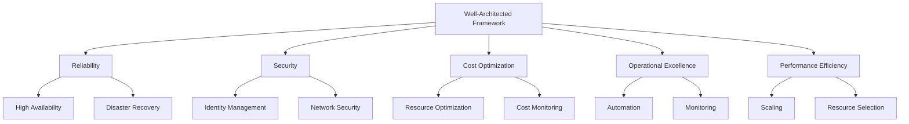
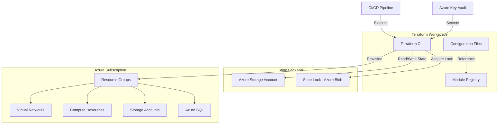
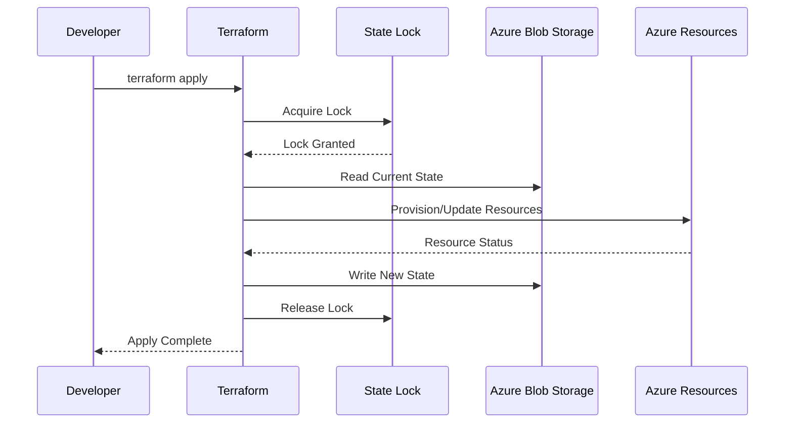
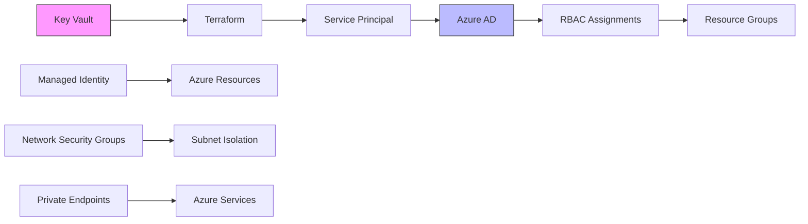
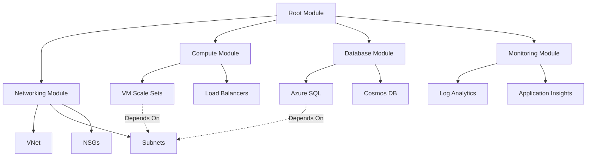
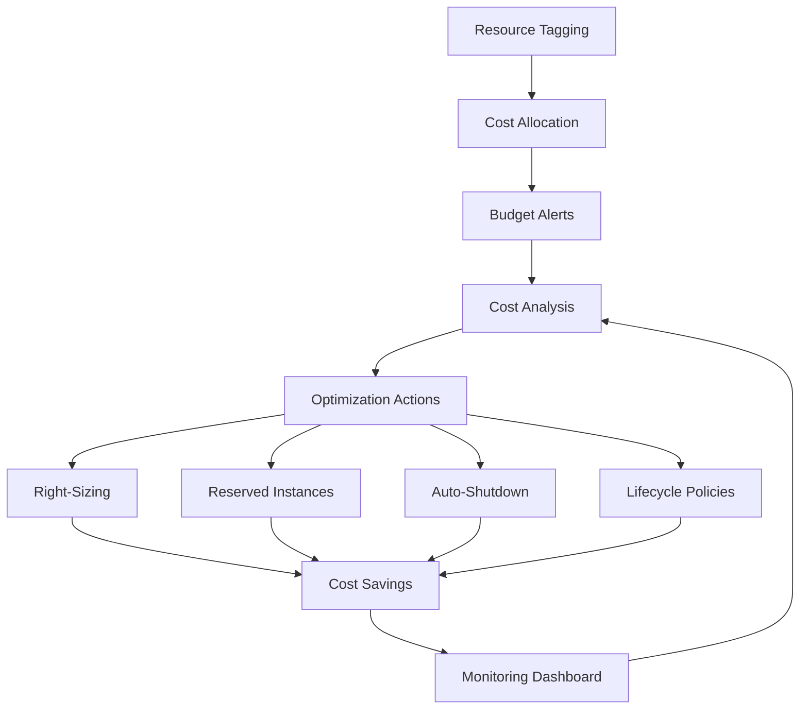
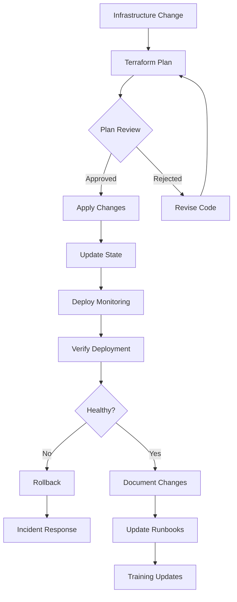
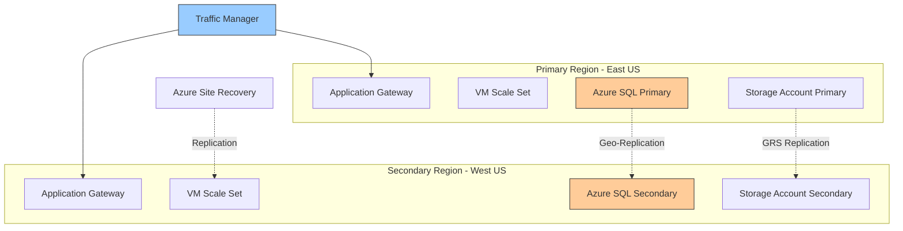
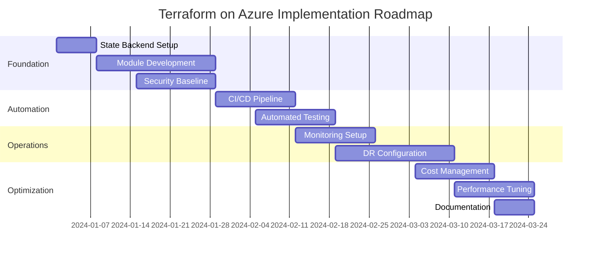

# Well-Architected Terraform on Microsoft Azure

## Executive Summary

This whitepaper provides comprehensive guidance on implementing infrastructure as code (IaC) using Terraform on Microsoft Azure, following well-architected principles. Organizations adopting cloud infrastructure require reliable, scalable, and maintainable deployment practices. Terraform, as a leading IaC tool, combined with Azure's robust cloud platform, enables teams to provision and manage infrastructure efficiently while maintaining best practices in security, reliability, performance, and cost optimization.

**Key Takeaways:**
- Structured approach to organizing Terraform code for Azure workloads
- Best practices for state management, security, and operational excellence
- Patterns for multi-environment deployments and disaster recovery
- Cost optimization strategies through infrastructure as code
- Security hardening techniques for Azure resources via Terraform

---

## Table of Contents

1. [Introduction](#1-introduction)
2. [Well-Architected Framework Pillars](#2-well-architected-framework-pillars)
3. [Terraform Architecture Patterns](#3-terraform-architecture-patterns)
4. [State Management](#4-state-management)
5. [Security Best Practices](#5-security-best-practices)
6. [Module Design and Reusability](#6-module-design-and-reusability)
7. [CI/CD Integration](#7-cicd-integration)
8. [Cost Optimization](#8-cost-optimization)
9. [Operational Excellence](#9-operational-excellence)
10. [Disaster Recovery and Business Continuity](#10-disaster-recovery-and-business-continuity)
11. [Conclusion](#11-conclusion)

---

## 1. Introduction

Infrastructure as Code (IaC) has transformed how organizations deploy and manage cloud resources. Terraform, developed by HashiCorp, provides a declarative approach to infrastructure management that is cloud-agnostic yet deeply integrated with Azure's services.

### 1.1 Why Terraform on Azure?

- **Declarative Syntax**: Define desired state rather than procedural steps
- **Provider Ecosystem**: Native Azure provider (azurerm) with comprehensive resource coverage
- **State Management**: Track infrastructure changes over time
- **Multi-Cloud Capability**: Consistent workflow across cloud providers
- **Community Support**: Extensive modules and documentation

---

## 2. Well-Architected Framework Pillars

The Azure Well-Architected Framework provides five pillars for cloud excellence:



### 2.1 Applying Pillars to Terraform

| Pillar | Terraform Implementation |
|--------|-------------------------|
| **Reliability** | Multi-region deployments, backend redundancy, state locking |
| **Security** | Secret management, RBAC, network segmentation, encryption |
| **Cost Optimization** | Tagging strategy, resource sizing, lifecycle policies |
| **Operational Excellence** | Modular code, CI/CD pipelines, automated testing |
| **Performance Efficiency** | Appropriate SKU selection, caching, CDN implementation |

---

## 3. Terraform Architecture Patterns

### 3.1 Repository Structure

```
terraform-azure/
├── environments/
│   ├── dev/
│   │   ├── main.tf
│   │   ├── variables.tf
│   │   ├── terraform.tfvars
│   │   └── backend.tf
│   ├── staging/
│   └── production/
├── modules/
│   ├── networking/
│   │   ├── main.tf
│   │   ├── variables.tf
│   │   └── outputs.tf
│   ├── compute/
│   ├── database/
│   └── monitoring/
├── shared/
│   ├── locals.tf
│   └── data.tf
└── policies/
    └── azure-policy.tf
```

### 3.2 Architecture Diagram



### 3.3 Deployment Patterns

#### Pattern 1: Environment-Based Structure
- Separate directories per environment
- Shared modules across environments
- Environment-specific variable files

#### Pattern 2: Workspace-Based Structure
- Single codebase with Terraform workspaces
- Conditional logic for environment differences
- Centralized configuration management

---

## 4. State Management

### 4.1 Remote State Configuration

```hcl
terraform {
  backend "azurerm" {
    resource_group_name  = "terraform-state-rg"
    storage_account_name = "tfstatexxxxx"
    container_name       = "tfstate"
    key                  = "prod.terraform.tfstate"
    
    # Enable state locking
    use_azuread_auth     = true
  }
}
```

### 4.2 State Architecture



### 4.3 Best Practices

- **State Locking**: Prevent concurrent modifications using Azure Blob leases
- **State Encryption**: Enable encryption at rest for storage accounts
- **State Backup**: Configure blob versioning and soft delete
- **Access Control**: Implement RBAC on state storage accounts
- **State Segmentation**: Separate state files by environment and workload

---

## 5. Security Best Practices

### 5.1 Secret Management

```hcl
# Reference Key Vault for sensitive values
data "azurerm_key_vault" "main" {
  name                = "kv-${var.environment}-${var.region}"
  resource_group_name = "rg-security-${var.environment}"
}

data "azurerm_key_vault_secret" "db_password" {
  name         = "database-admin-password"
  key_vault_id = data.azurerm_key_vault.main.id
}

resource "azurerm_sql_server" "main" {
  administrator_login_password = data.azurerm_key_vault_secret.db_password.value
  # ... other configuration
}
```

### 5.2 Security Architecture



### 5.3 Security Checklist

- [ ] Use Azure Key Vault for secrets
- [ ] Implement service principals with least privilege
- [ ] Enable Azure Policy for compliance
- [ ] Configure Network Security Groups
- [ ] Use Private Endpoints for PaaS services
- [ ] Enable Azure Defender
- [ ] Implement encryption at rest and in transit
- [ ] Configure diagnostic logging

---

## 6. Module Design and Reusability

### 6.1 Module Structure

```hcl
# modules/networking/main.tf
resource "azurerm_virtual_network" "main" {
  name                = var.vnet_name
  location            = var.location
  resource_group_name = var.resource_group_name
  address_space       = var.address_space
  
  tags = merge(
    var.tags,
    {
      "ManagedBy" = "Terraform"
    }
  )
}

resource "azurerm_subnet" "subnets" {
  for_each = var.subnets
  
  name                 = each.key
  resource_group_name  = var.resource_group_name
  virtual_network_name = azurerm_virtual_network.main.name
  address_prefixes     = each.value.address_prefixes
}

# modules/networking/outputs.tf
output "vnet_id" {
  value       = azurerm_virtual_network.main.id
  description = "The ID of the virtual network"
}

output "subnet_ids" {
  value = {
    for k, v in azurerm_subnet.subnets : k => v.id
  }
  description = "Map of subnet names to IDs"
}
```

### 6.2 Module Composition



---

## 7. CI/CD Integration

### 7.1 Pipeline Architecture

```mermaid
graph LR
    A[Git Commit] --> B[PR Created]
    B --> C[Terraform Validate]
    C --> D[Terraform Plan]
    D --> E[Security Scan]
    E --> F[Code Review]
    F --> G[Merge to Main]
    G --> H[Terraform Apply]
    H --> I[Deployment Tests]
    I --> J[Notification]
    
    style E fill:#f99,stroke:#333
    style H fill:#9f9,stroke:#333
```



### 7.2 Azure DevOps Pipeline Example

```yaml
trigger:
  branches:
    include:
    - main
    - develop

stages:
- stage: Validate
  jobs:
  - job: TerraformValidate
    steps:
    - task: TerraformInstaller@0
      inputs:
        terraformVersion: '1.6.0'
    
    - task: TerraformTaskV4@4
      inputs:
        command: 'init'
        workingDirectory: '$(System.DefaultWorkingDirectory)/environments/$(environment)'
        backendServiceArm: 'Azure-Subscription'
        backendAzureRmResourceGroupName: 'terraform-state-rg'
        backendAzureRmStorageAccountName: 'tfstate$(storageAccountSuffix)'
        backendAzureRmContainerName: 'tfstate'
        backendAzureRmKey: '$(environment).terraform.tfstate'
    
    - task: TerraformTaskV4@4
      inputs:
        command: 'validate'
        workingDirectory: '$(System.DefaultWorkingDirectory)/environments/$(environment)'

- stage: Plan
  dependsOn: Validate
  jobs:
  - job: TerraformPlan
    steps:
    - task: TerraformTaskV4@4
      inputs:
        command: 'plan'
        workingDirectory: '$(System.DefaultWorkingDirectory)/environments/$(environment)'
        environmentServiceNameAzureRM: 'Azure-Subscription'

- stage: Apply
  dependsOn: Plan
  condition: and(succeeded(), eq(variables['Build.SourceBranch'], 'refs/heads/main'))
  jobs:
  - deployment: TerraformApply
    environment: '$(environment)'
    strategy:
      runOnce:
        deploy:
          steps:
          - task: TerraformTaskV4@4
            inputs:
              command: 'apply'
              workingDirectory: '$(System.DefaultWorkingDirectory)/environments/$(environment)'
              environmentServiceNameAzureRM: 'Azure-Subscription'
```

---

## 8. Cost Optimization

### 8.1 Tagging Strategy

```hcl
locals {
  common_tags = {
    Environment    = var.environment
    ManagedBy      = "Terraform"
    CostCenter     = var.cost_center
    Owner          = var.owner
    Project        = var.project_name
    DataClass      = var.data_classification
    BackupPolicy   = var.backup_required ? "Required" : "NotRequired"
    DeploymentDate = timestamp()
  }
}

resource "azurerm_resource_group" "main" {
  name     = "rg-${var.project_name}-${var.environment}"
  location = var.location
  tags     = local.common_tags
}
```

### 8.2 Cost Management Flow



### 8.3 Cost Optimization Techniques

| Technique | Terraform Implementation |
|-----------|-------------------------|
| **Auto-Shutdown** | Use Azure Automation with VM schedules |
| **Right-Sizing** | Use appropriate VM SKUs in variables |
| **Storage Tiers** | Implement lifecycle management policies |
| **Reserved Capacity** | Document in comments, purchase via portal |
| **Budget Alerts** | Deploy Azure budgets via Terraform |

---

## 9. Operational Excellence

### 9.1 Monitoring Configuration

```hcl
resource "azurerm_log_analytics_workspace" "main" {
  name                = "law-${var.environment}-${var.region}"
  location            = var.location
  resource_group_name = azurerm_resource_group.main.name
  sku                 = "PerGB2018"
  retention_in_days   = var.log_retention_days
  
  tags = local.common_tags
}

resource "azurerm_monitor_diagnostic_setting" "vnet" {
  name                       = "diag-vnet"
  target_resource_id         = azurerm_virtual_network.main.id
  log_analytics_workspace_id = azurerm_log_analytics_workspace.main.id
  
  enabled_log {
    category = "VMProtectionAlerts"
  }
  
  metric {
    category = "AllMetrics"
    enabled  = true
  }
}
```

### 9.2 Operational Workflow



---

## 10. Disaster Recovery and Business Continuity

### 10.1 Multi-Region Architecture



### 10.2 DR Configuration

```hcl
# Primary region resources
module "primary_region" {
  source = "../../modules/full-stack"
  
  region              = "eastus"
  environment         = var.environment
  enable_dr           = true
  paired_region       = "westus"
}

# Secondary region resources (DR)
module "secondary_region" {
  source = "../../modules/full-stack"
  
  region              = "westus"
  environment         = var.environment
  enable_dr           = true
  paired_region       = "eastus"
  is_secondary        = true
}

# Traffic Manager for failover
resource "azurerm_traffic_manager_profile" "main" {
  name                   = "tm-${var.project_name}-${var.environment}"
  resource_group_name    = azurerm_resource_group.main.name
  traffic_routing_method = "Priority"
  
  dns_config {
    relative_name = "tm-${var.project_name}"
    ttl           = 30
  }
  
  monitor_config {
    protocol                     = "HTTPS"
    port                         = 443
    path                         = "/health"
    interval_in_seconds          = 30
    timeout_in_seconds           = 10
    tolerated_number_of_failures = 3
  }
}
```

### 10.3 RTO and RPO Targets

| Service | RTO Target | RPO Target | Terraform Strategy |
|---------|-----------|-----------|-------------------|
| **Web Apps** | < 15 min | < 5 min | Multi-region deployment with Traffic Manager |
| **Databases** | < 30 min | < 5 min | Geo-replication with automatic failover groups |
| **Storage** | < 1 hour | < 15 min | GRS or GZRS replication |
| **VMs** | < 1 hour | < 15 min | Azure Site Recovery configuration |

---

## 11. Conclusion

### 11.1 Key Recommendations

1. **Adopt Modular Design**: Create reusable modules for common Azure patterns
2. **Implement GitOps**: Treat infrastructure code with same rigor as application code
3. **Automate Everything**: Use CI/CD pipelines for all infrastructure changes
4. **Secure by Default**: Implement security best practices from the start
5. **Monitor Continuously**: Deploy comprehensive monitoring and alerting
6. **Plan for DR**: Design multi-region architectures for critical workloads
7. **Optimize Costs**: Implement tagging, budgets, and regular reviews
8. **Document Thoroughly**: Maintain runbooks and architecture diagrams

### 11.2 Implementation Roadmap



### 11.3 Success Metrics

- **Deployment Frequency**: Measure how often infrastructure changes are deployed
- **Lead Time**: Time from code commit to production deployment
- **Change Failure Rate**: Percentage of deployments causing incidents
- **Mean Time to Recovery**: Average time to restore service after failure
- **Cost Efficiency**: Month-over-month cost trends and optimization savings
- **Security Compliance**: Percentage of resources meeting security policies

### 11.4 Next Steps

1. Assess current infrastructure state
2. Define naming conventions and tagging strategy
3. Set up remote state backend
4. Create core networking modules
5. Implement CI/CD pipeline
6. Deploy pilot workload
7. Establish operational procedures
8. Scale to production workloads

---

## Appendix A: Additional Resources

- [Azure Provider Documentation](https://registry.terraform.io/providers/hashicorp/azurerm/latest/docs)
- [Terraform Best Practices](https://www.terraform-best-practices.com/)
- [Azure Well-Architected Framework](https://learn.microsoft.com/azure/architecture/framework/)
- [Azure Naming Conventions](https://learn.microsoft.com/azure/cloud-adoption-framework/ready/azure-best-practices/naming-and-tagging)

## Appendix B: Sample Terraform Configurations

Available in the companion repository: `https://github.com/yourorg/terraform-azure-patterns`

---

**Document Version**: 1.0  
**Last Updated**: 2024  
**Author**: Cloud Architecture Team  
**Review Cycle**: Quarterly
