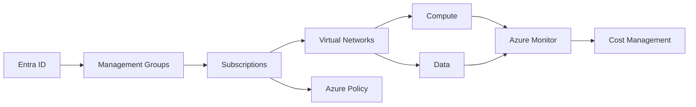

# Cost-Aware Azure Architecture for Enterprise Workloads

**Author:** Principal Azure Cloud Architect  
**Date:** 2026-01-18  
**Version:** 1.0  
**Azure Services:** Azure Resource Manager, Azure Monitor, Azure Cost Management, Azure Policy, Azure Advisor, Azure Storage, Azure Virtual Machines, Azure App Service, Azure Kubernetes Service

## Executive Summary

Enterprise Azure environments frequently experience uncontrolled cost growth due to inconsistent architectural decisions, lack of enforced standards, and limited visibility into consumption drivers. These issues are amplified in multi-subscription, multi-environment deployments where teams independently select SKUs, enable diagnostics indiscriminately, and deploy resources without lifecycle or ownership metadata.

This whitepaper presents a cost-aware Azure architecture that embeds financial governance directly into platform design. The approach uses Azure-native services combined with Terraform-based infrastructure provisioning to enforce standardized resource configurations, cost controls, and observability from deployment through operations. Cost is treated as a first-class architectural concern alongside availability, security, and performance.

Terraform is central to this design, enabling deterministic infrastructure, policy enforcement, and environment parity while preventing configuration drift. Security and cost controls are implemented together through identity boundaries, network isolation, policy-as-code, and monitored usage patterns to ensure that optimization efforts do not introduce risk.

## Table of Contents

- [Executive Summary](#executive-summary)
- [Introduction](#introduction)
- [Problem Statement](#problem-statement)
- [Solution Overview](#solution-overview)
- [Technical Architecture](#technical-architecture)
- [Implementation Guide](#implementation-guide)
- [Best Practices](#best-practices)
- [Security Considerations](#security-considerations)
- [Cost Optimization](#cost-optimization)
- [Monitoring and Maintenance](#monitoring-and-maintenance)
- [Conclusion](#conclusion)
- [References](#references)
- [Appendices](#appendices)

## Introduction

### Background

Azure provides flexible consumption-based services that enable rapid scaling and experimentation. Without architectural guardrails, this flexibility leads to over-provisioning, inefficient SKUs, and uncontrolled data ingestion costs. Cost optimization is often addressed reactively rather than as part of platform design.

### Scope

This document focuses on Azure Commercial environments using Terraform for all infrastructure deployment. It covers platform-level cost governance and workload architecture patterns but does not address application-level code optimization.

### Target Audience

Senior Azure engineers, platform architects, and cloud governance teams responsible for designing and operating enterprise Azure environments.

### Prerequisites

- Experience with Azure architecture and Azure Resource Manager
- Working knowledge of Terraform and CI/CD pipelines
- Familiarity with Azure networking and identity concepts

## Problem Statement

Enterprise Azure workloads often lack consistent cost governance, resulting in unpredictable spend and operational friction.

### Current Challenges

- Inconsistent SKU selection across teams and environments
- Excessive diagnostic logging and data ingestion
- Lack of ownership and lifecycle metadata on resources

### Business Impact

Uncontrolled costs reduce budget predictability, delay delivery, and erode trust in cloud platforms. Engineering teams spend time reacting to budget overruns instead of improving reliability and performance.

## Solution Overview

The proposed solution embeds cost governance into Azure architecture using standardized Terraform modules, enforced Azure Policy, and centralized monitoring.

### Key Benefits

- Predictable and explainable Azure spend
- Reduced operational overhead from reactive cost management
- Alignment between engineering decisions and financial controls

### Success Criteria

- Cost anomalies detected within operational alerting windows
- Consistent resource configurations across environments
- Demonstrable reduction in wasteful resource consumption

## Technical Architecture

### Architecture Diagram



### Components

#### Component 1: Identity and Governance
- **Purpose:** Centralized access control and policy enforcement
- **Azure Service:** Entra ID, Management Groups, Azure Policy
- **Configuration:** Least-privilege RBAC and policy-as-code via Terraform

#### Component 2: Compute Platforms
- **Purpose:** Host application workloads
- **Azure Service:** Virtual Machines, App Service, AKS
- **Configuration:** Approved SKUs, autoscaling, enforced diagnostics

#### Component 3: Monitoring and Cost Management
- **Purpose:** Visibility into usage and spend
- **Azure Service:** Azure Monitor, Cost Management
- **Configuration:** Centralized Log Analytics with capped ingestion

## Implementation Guide

### Prerequisites

- Terraform 1.x
- AzureRM provider
- Contributor access to target subscriptions
- CI/CD pipeline with secure credential storage

### Required Permissions

- Management Group Contributor
- User Access Administrator (limited scope)
- Log Analytics Contributor

### State Management Considerations

Terraform state must be stored in a dedicated Azure Storage account with:
- Private endpoint access only
- Blob versioning enabled
- Customer-managed keys

### Environment Separation

Each environment (dev, test, prod) must use:
- Separate state files
- Separate subscriptions
- Parameterized Terraform variables

### Illustrative Terraform Snippet

```hcl
resource "azurerm_monitor_diagnostic_setting" "example" {
  name                       = "diag-core"
  target_resource_id         = azurerm_virtual_machine.vm.id
  log_analytics_workspace_id = azurerm_log_analytics_workspace.law.id

  enabled_log {
    category = "Administrative"
  }
}
```

## Best Practices

### Design Principles

1. **Cost as a Design Constraint:** Evaluate cost impact during architecture decisions.
2. **Standardization:** Limit SKU and service options via policy.
3. **Automation First:** Eliminate manual provisioning paths.

### Terraform Best Practices

- Remote state with locking
- Reusable, versioned modules
- Mandatory tagging enforced via policy

### Operational Best Practices

- Regular cost reviews tied to architecture changes
- Enforced diagnostics categories only
- Automated cleanup of unused resources

### Performance Optimization

Balance autoscaling thresholds with cost ceilings and avoid over-aggressive scaling policies.

## Security Considerations

### Identity and Access Management

- Entra ID-based authentication
- Role assignments via Terraform
- Privileged Identity Management for elevated roles

### Network Security

- Private endpoints for all PaaS services
- Centralized egress through firewalls
- NSGs scoped to workload tiers

### Data Protection

- Encryption at rest using platform-managed or customer-managed keys
- TLS enforced for all data in transit

### Logging and Auditing

- Centralized logs with retention limits
- Activity logs retained separately from workload logs

### Compliance Alignment

Architecture aligns with control families found in NIST 800-171 related to access control, auditability, and system integrity.

## Cost Optimization

### Cost Factors

- Compute SKUs and uptime
- Log Analytics ingestion
- Data egress

### Optimization Strategies

1. **SKU Rationalization:** Restrict allowed SKUs through policy.
2. **Logging Controls:** Limit verbose diagnostic categories.
3. **Lifecycle Automation:** Enforce shutdown and cleanup schedules.

### Cost Monitoring

Budgets and alerts configured per subscription and workload group.

## Monitoring and Maintenance

### Key Metrics

- Log ingestion volume
- Compute utilization
- Budget threshold breaches

### Alerting

- Budget alerts at 70%, 85%, and 95%
- Log ingestion spikes
- Autoscaling anomalies

### Maintenance Tasks

- Quarterly SKU reviews
- Policy compliance audits
- Terraform drift detection

### Troubleshooting

Common failure modes include mis-scoped diagnostics, orphaned resources, and state misalignment.

## Conclusion

Cost-aware Azure architecture requires deliberate design, enforced standards, and continuous visibility. Embedding cost controls into Terraform-managed infrastructure enables engineering teams to operate efficiently without sacrificing security or reliability.

### Key Takeaways

- Cost governance must be architectural, not reactive
- Terraform enables enforceable and repeatable controls
- Monitoring and security are inseparable from cost management

### Next Steps

Extend this architecture with automated cost anomaly detection and workload-level chargeback models.

## References

1. Azure Architecture Center
2. Azure Well-Architected Framework
3. Azure Cost Management Documentation

## Appendices

### Appendix A: Tagging Schema

Standard tags include environment, owner, costcenter, and workload.

### Appendix B: Policy Examples

Policies enforcing SKU restrictions and mandatory tags.
