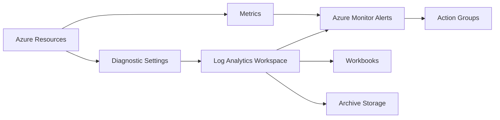

# Operationalizing Azure Monitoring and Observability

**Author:** Randy Bordeaux  
**Date:** January 2026  
**Version:** 1.0  
**Azure Services:** Azure Monitor, Log Analytics, Application Insights, Azure Managed Grafana, Azure Managed Prometheus, Azure Workbooks, Azure Data Explorer  
**Azure Services:** Azure Monitor, Log Analytics, Application Insights, Azure Resource Graph, Azure Policy, Azure Storage, Azure Event Hub

## Executive Summary

Enterprise Azure environments frequently collect large volumes of telemetry without achieving meaningful observability. Logs, metrics, and traces are often enabled indiscriminately, resulting in excessive cost, noisy alerts, and limited diagnostic value during incidents. This leads to delayed recovery, incomplete root cause analysis, and reduced confidence in platform reliability.

This whitepaper defines a structured, cost-aware approach to operationalizing monitoring and observability in Azure Commercial environments. The architecture establishes standardized telemetry pipelines, controlled data ingestion, and actionable alerting aligned to how experienced engineers actually troubleshoot systems. Observability is treated as a platform capability rather than a per-application afterthought.

Terraform is used as the enforcement mechanism for consistency, ensuring diagnostic settings, retention policies, alert rules, and access controls are deployed deterministically across environments. Security and cost controls are embedded throughout the monitoring stack to prevent observability tooling from becoming an operational or financial liability.

## Table of Contents

- [Executive Summary](#executive-summary)
- [Introduction](#introduction)
- [Problem Statement](#problem-statement)
- [Solution Overview](#solution-overview)
- [Technical Architecture](#technical-architecture)
- [Implementation Guide](#implementation-guide)
- [Best Practices](#best-practices)
- [Security Considerations](#security-considerations)
- [Cost Optimization](#cost-optimization)
- [Monitoring and Maintenance](#monitoring-and-maintenance)
- [Conclusion](#conclusion)
- [References](#references)
- [Appendices](#appendices)

## Introduction

### Background

Azure-native monitoring provides deep visibility into platform and workload behavior, but without architectural discipline it becomes fragmented and expensive. Many environments conflate data collection with observability, leading to unbounded log ingestion and alert fatigue.

### Scope

This document focuses on platform-level monitoring and observability using Azure Monitor and related services. Application code instrumentation patterns are out of scope.

### Target Audience

Senior Azure engineers, SREs, and platform architects responsible for operating and supporting enterprise Azure environments.

### Prerequisites

- Strong understanding of Azure resource architecture
- Experience with Kusto Query Language (KQL)
- Terraform and CI/CD pipeline familiarity

## Problem Statement

Azure environments often fail to deliver actionable observability despite extensive telemetry collection.

### Current Challenges

- Excessive diagnostic logging causing daily cap exhaustion
- Alerts based on symptoms rather than failure signals
- Inconsistent diagnostic configuration across environments

### Business Impact

Operational incidents take longer to resolve, costs increase unpredictably, and engineering teams lose trust in monitoring systems during outages.

## Solution Overview

The solution establishes a centralized, policy-driven observability architecture using Azure-native services and Terraform-based enforcement.

### Key Benefits

- Actionable telemetry aligned to operational workflows
- Predictable monitoring costs
- Consistent diagnostics and alerting across environments

### Success Criteria

- Reduction in mean time to detect (MTTD) and mean time to recover (MTTR)
- Elimination of daily log ingestion cap events
- Alert volumes aligned to on-call capacity

## Technical Architecture

### Architecture Diagram



### Components

#### Component 1: Telemetry Sources
- **Purpose:** Emit logs and metrics from Azure resources
- **Azure Service:** Native Azure resource providers
- **Configuration:** Explicit diagnostic category selection

#### Component 2: Centralized Analytics
- **Purpose:** Query and analyze telemetry
- **Azure Service:** Log Analytics Workspace
- **Configuration:** Daily caps, retention tiers, access controls

#### Component 3: Alerting and Visualization
- **Purpose:** Detect and surface operational issues
- **Azure Service:** Azure Monitor, Workbooks
- **Configuration:** Signal-based alert rules with scoped action groups

## Implementation Guide

### Prerequisites

- Terraform >= 1.5
- AzureRM provider
- CI/CD pipeline with federated identity authentication

### Required Permissions

- Monitoring Contributor
- Log Analytics Contributor
- Reader on monitored subscriptions

### State Management Considerations

Terraform state must be isolated per environment and stored in Azure Storage with:
- Private endpoints enabled
- Soft delete and versioning
- Restricted RBAC access

### Environment Separation

Each environment must maintain:
- Independent Log Analytics workspaces
- Environment-specific alert thresholds
- Separate Terraform state backends

### Illustrative Terraform Snippet

```hcl
resource "azurerm_monitor_metric_alert" "cpu_high" {
  name                = "cpu-high"
  resource_group_name = azurerm_resource_group.monitoring.name
  scopes              = [azurerm_linux_virtual_machine.vm.id]

  criteria {
    metric_namespace = "Microsoft.Compute/virtualMachines"
    metric_name      = "Percentage CPU"
    aggregation      = "Average"
    operator         = "GreaterThan"
    threshold        = 80
  }
}
```

## Best Practices

### Design Principles

1. **Signals Over Volume:** Collect only telemetry that drives decisions.
2. **Centralization:** Aggregate logs and metrics for correlation.
3. **Environment Parity:** Maintain identical monitoring baselines.

### Terraform Best Practices

- Explicit diagnostic category definitions
- Version-controlled alert rule sets
- Policy enforcement for mandatory diagnostics

### Operational Best Practices

- Periodic alert tuning reviews
- Retention tiering based on data value
- Use KQL-based workbooks for incident response

### Performance Optimization

Avoid high-cardinality logs and unbounded custom dimensions in Application Insights.

## Security Considerations

### Identity and Access Management

- Entra ID-based access to Log Analytics
- Role separation between readers and contributors
- PIM for elevated monitoring roles

### Network Security

- Private endpoints for Log Analytics ingestion
- Restricted public network access
- Controlled egress paths

### Data Protection

- Encryption at rest by default
- TLS enforced for ingestion and query traffic

### Logging and Auditing

- Activity logs retained independently
- Audit access to monitoring data

### Compliance Alignment

Observability controls align with audit and monitoring requirements found in NIST 800-171.

## Cost Optimization

### Cost Factors

- Log Analytics ingestion volume
- Retention duration
- Cross-region data movement

### Optimization Strategies

1. **Category Filtering:** Disable non-actionable diagnostic categories.
2. **Daily Caps:** Enforce workspace ingestion limits.
3. **Archival Storage:** Move long-term logs to Azure Storage.

### Cost Monitoring

Cost Management budgets applied to monitoring resource groups.

## Monitoring and Maintenance

### Key Metrics

- Ingested GB per table
- Alert firing frequency
- Query performance

### Alerting

- Ingestion spike alerts
- Alert suppression for flapping conditions
- Health alerts on action group delivery

### Maintenance Tasks

- Quarterly diagnostic reviews
- Alert rule validation
- Terraform drift detection

### Troubleshooting

Common issues include misconfigured diagnostic scopes, excessive informational logs, and alert rule overlap.

## Conclusion

Effective observability in Azure requires architectural intent, disciplined data collection, and enforced standards. By operationalizing monitoring through Terraform and Azure-native services, organizations gain reliable insight without uncontrolled cost or noise.

### Key Takeaways

- Observability must be designed, not accumulated
- Terraform ensures consistency and enforcement
- Cost, security, and monitoring are inseparable

### Next Steps

Extend the platform with service-specific workbooks and automated anomaly detection.

## References

1. Azure Monitor Documentation  
2. Azure Well-Architected Framework  
3. Azure Architecture Center  

## Appendices

### Appendix A: Diagnostic Category Baselines

Document approved diagnostic categories per resource type.

### Appendix B: Alert Taxonomy

Standardized alert severity and response mapping.
