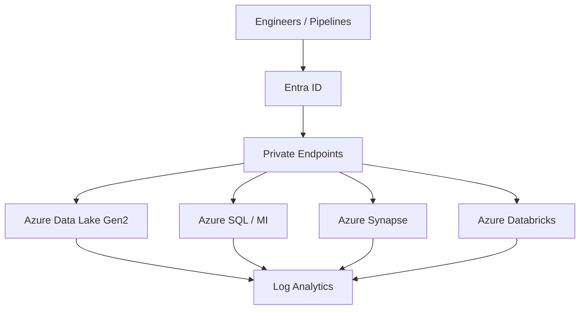
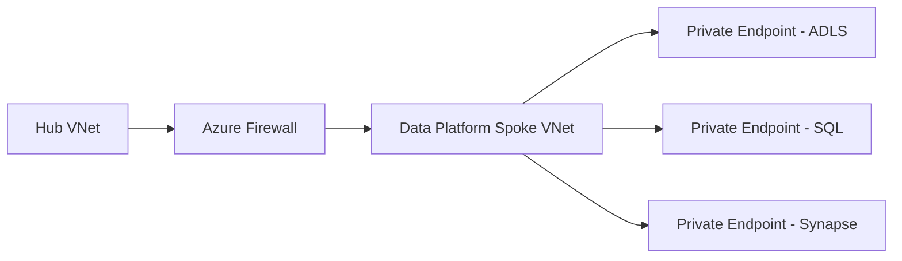
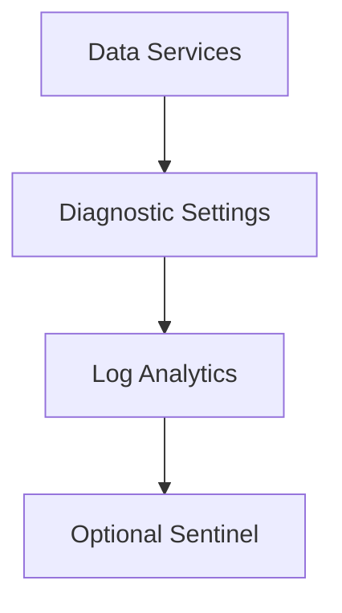

# Securing Data Platforms in Azure Commercial

**Author:** Randy Bordeaux  
**Date:** January 2026  
**Version:** 1.0  
**Azure Services:** Azure Data Lake Storage Gen2, Azure Synapse Analytics, Azure Databricks, Azure SQL Database, Azure Key Vault, Azure Private Link, Azure Firewall, Microsoft Entra ID, Log Analytics

## Executive Summary
This whitepaper provides an implementation-focused reference architecture for securing Azure-native data platforms in Azure Commercial environments. It addresses identity, network isolation, data protection, platform hardening, and auditability using Azure-native controls and Terraform-based infrastructure as code. The guidance assumes experienced Azure engineers operating production and regulated workloads and emphasizes defense-in-depth, least privilege, and policy-driven enforcement.

## Table of Contents
- [Securing Data Platforms in Azure Commercial](#securing-data-platforms-in-azure-commercial)
  - [Executive Summary](#executive-summary)
  - [Table of Contents](#table-of-contents)
  - [1. Scope and Assumptions](#1-scope-and-assumptions)
  - [2. Architectural Principles](#2-architectural-principles)
  - [3. Reference Architecture Overview](#3-reference-architecture-overview)
  - [4. Identity and Access Control](#4-identity-and-access-control)
    - [Key Practices](#key-practices)
  - [5. Network Security Architecture](#5-network-security-architecture)
  - [6. Data Protection and Key Management](#6-data-protection-and-key-management)
  - [7. Platform Hardening by Service](#7-platform-hardening-by-service)
    - [Azure Data Lake Storage Gen2](#azure-data-lake-storage-gen2)
    - [Azure Synapse](#azure-synapse)
    - [Azure Databricks](#azure-databricks)
  - [8. Monitoring, Logging, and Auditability](#8-monitoring-logging-and-auditability)
  - [9. Azure Policy and Guardrails](#9-azure-policy-and-guardrails)
  - [10. Terraform Implementation Considerations](#10-terraform-implementation-considerations)
  - [11. Tradeoffs and Limitations](#11-tradeoffs-and-limitations)
  - [12. Conclusion](#12-conclusion)

## 1. Scope and Assumptions
- Azure Commercial only  
- Terraform (AzureRM provider) is the authoritative IaC mechanism  
- CI/CD-based Terraform execution  
- All data services deployed with private connectivity  
- Centralized identity via Microsoft Entra ID  
- Centralized logging via Log Analytics  

## 2. Architectural Principles
- Zero Trust by default  
- Least privilege across control plane and data plane  
- Explicit network boundaries  
- Encryption everywhere  
- Policy-driven prevention over detection  

## 3. Reference Architecture Overview



## 4. Identity and Access Control
- Entra ID authentication only; shared keys disabled  
- System-assigned managed identities for all services  
- Separation of Azure RBAC and data-plane permissions  
- Privileged roles gated via PIM  
- No cross-environment role reuse  

### Key Practices
- Use `Storage Blob Data Contributor` only where required  
- Avoid Owner/Contributor at subscription scope  
- Enforce just-in-time elevation  

## 5. Network Security Architecture



- Hub-and-spoke topology  
- Forced tunneling through Azure Firewall  
- Private DNS zones linked to VNets  
- Public network access disabled  

## 6. Data Protection and Key Management
- Encryption at rest enabled by default  
- Customer-managed keys where supported  
- TLS enforced for all data services  
- Key Vault used for key lifecycle management  

```hcl
resource "azurerm_key_vault" "kv" {
  name                = local.kv_name
  location            = azurerm_resource_group.rg.location
  resource_group_name = azurerm_resource_group.rg.name
  tenant_id           = data.azurerm_client_config.current.tenant_id
  sku_name            = "standard"
}
```

## 7. Platform Hardening by Service
### Azure Data Lake Storage Gen2
- Disable shared key access  
- Enforce hierarchical namespace  
- Restrict via private endpoint only  

### Azure Synapse
- Disable public endpoints  
- Managed identity for ADLS access  
- Separate workspaces per environment  

### Azure Databricks
- VNet injection required  
- No public IPs  
- Secret scopes backed by Key Vault  

## 8. Monitoring, Logging, and Auditability



- Diagnostic settings on every service  
- Retention aligned with compliance requirements  
- Control plane and data plane logs captured  

## 9. Azure Policy and Guardrails
- Deny public network access  
- Require private endpoints  
- Audit missing diagnostic settings  
- Enforce tagging standards  

```hcl
resource "azurerm_policy_assignment" "deny_public" {
  name                 = "deny-public-data-services"
  policy_definition_id = data.azurerm_policy_definition.deny_public.id
  scope                = azurerm_subscription.current.id
}
```

## 10. Terraform Implementation Considerations
- Remote state with restricted access  
- Separate state per environment  
- No secrets in state files  
- Naming and tagging via locals  

## 11. Tradeoffs and Limitations
- Private endpoints increase DNS complexity  
- CMK introduces operational overhead  
- Some services have partial data-plane RBAC support  

## 12. Conclusion
A secure Azure data platform requires intentional design across identity, networking, encryption, and policy enforcement. Terraform enables repeatable, auditable deployments when combined with Azure-native security controls and disciplined operational practices.
