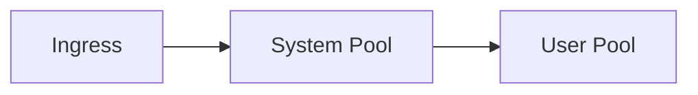

# Azure Kubernetes Service (AKS) Production Readiness Guide

## Executive Summary
This document provides implementation-focused guidance for operating AKS in production within Azure Commercial environments using Terraform as the authoritative IaC mechanism. Security, reliability, and cost controls are embedded throughout.

## Table of Contents
- Architecture and Node Pools
- Networking Models
- Identity and RBAC
- Security Hardening
- Monitoring and Observability
- Cost Optimization

## Architecture and Node Pool Design
Use multiple node pools for system, user, and GPU workloads. Enforce node taints and labels.

## Networking Models (kubenet vs Azure CNI)
Azure CNI is recommended for enterprise scenarios requiring VNet IP visibility and Private Endpoints.

## Identity and RBAC Integration
Integrate AKS with Entra ID and enforce Azure RBAC for Kubernetes authorization.

## Security Hardening and Policy Enforcement
Apply Azure Policy for AKS, restrict API server access, and use private clusters.

## Monitoring, Logging, and Observability
Centralize logs in Log Analytics and enable Container Insights.

## Cost Optimization Strategies
Use autoscaling, Spot node pools, and rightsizing based on metrics.
