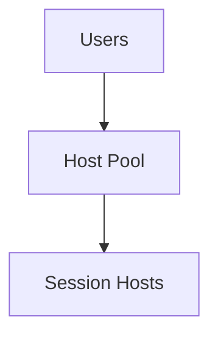

# Azure Virtual Desktop (AVD) Enterprise Deployment

## Executive Summary
This whitepaper outlines enterprise deployment patterns for Azure Virtual Desktop with a focus on identity, networking, and security.

## Table of Contents
- Host Pool Design
- Identity and Authentication
- FSLogix
- Networking
- Image Management
- Security and Compliance

## Multi-session vs Single-session Host Pools
Choose multi-session for task workers and single-session for power users.

## Identity and Authentication Strategies
Use Entra ID joined session hosts with Conditional Access.

## FSLogix Profile Management
Store profiles on Azure Files with private endpoints.

## Network Design and Optimization
Deploy AVD into hub-and-spoke VNets with centralized egress.

## Image Management and Automation
Use Azure Image Builder and shared image galleries.

## Security and Compliance Considerations
Apply least privilege RBAC and log all access.
