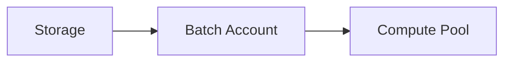

# Azure Batch for High-Performance Computing (HPC)

## Executive Summary
This document describes how to run HPC workloads using Azure Batch with cost-aware scaling and secure data access.

## Table of Contents
- Batch Accounts and Pools
- Job Scheduling
- Auto-scaling
- Storage Integration
- Cost Optimization
- Monitoring

## Batch Account and Pool Configuration
Configure pools with VMSS-backed nodes.

## Job Scheduling and Task Management
Use task dependencies and priority queues.

## Auto-scaling Strategies
Scale pools based on pending task count.

## Integration with Azure Storage
Use managed identities to access Blob Storage.

## Cost Optimization for Compute-intensive Workloads
Leverage low-priority nodes and deallocate idle pools.

## Monitoring and Performance Tuning
Send metrics to Azure Monitor and Log Analytics.
