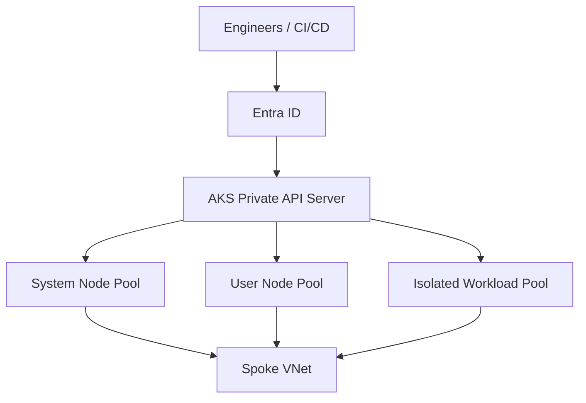
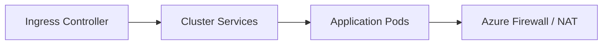
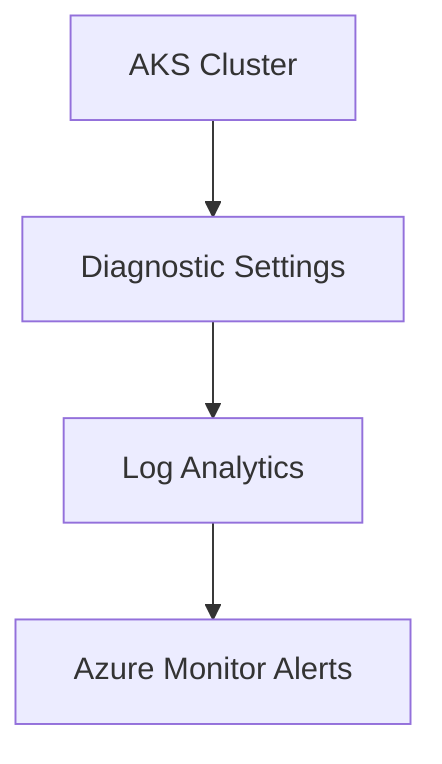

# Cluster Architecture and Node Pool Design (Azure Kubernetes Service)

**Author:** Randy Bordeaux  
**Date:** January 2026  
**Version:** 1.0  
**Azure Services:** Azure Kubernetes Service (AKS), Azure Virtual Machine Scale Sets, Azure Virtual Networks, Azure Monitor, Azure Container Registry, Azure Managed Identities

## Executive Summary
This whitepaper provides an implementation-focused guide to designing Azure Kubernetes Service (AKS) cluster architecture and node pool strategies in Azure Commercial environments. It emphasizes security-by-default, workload isolation, scalability, and operational resilience using Terraform as the authoritative infrastructure-as-code mechanism. The guidance assumes experienced Azure engineers operating production-grade Kubernetes platforms.

## Table of Contents
1. Scope and Assumptions  
2. Architectural Design Principles  
3. AKS Cluster Topology  
4. Node Pool Design Strategies  
5. Networking and Traffic Flow  
6. Identity, Access, and Secrets  
7. Security Hardening  
8. Scaling, Availability, and Resiliency  
9. Monitoring and Observability  
10. Azure Policy and Guardrails  
11. Terraform Implementation Considerations  
12. Tradeoffs and Limitations  
13. Conclusion  

## 1. Scope and Assumptions
- Azure Commercial only  
- Azure Kubernetes Service (AKS)  
- Terraform (AzureRM provider) required  
- Private AKS clusters only  
- CI/CD-driven Terraform execution  
- No in-cluster manual configuration  

## 2. Architectural Design Principles
- Control plane isolation  
- Least-privilege access  
- Workload separation via node pools  
- Immutable infrastructure patterns  
- Explicit scaling boundaries  

## 3. AKS Cluster Topology



- Single cluster per environment  
- System node pool isolated and tainted  
- Multiple user node pools per workload class  

## 4. Node Pool Design Strategies

### System Node Pool
- Hosts system components only  
- Minimal VM size  
- Auto-upgrade enabled  
- No application workloads  

### User Node Pools
- Workload-aligned pools (stateless, stateful, batch)  
- Independent scaling profiles  
- Dedicated VM SKUs per workload  

### Isolation Techniques
- Kubernetes taints and tolerations  
- Node selectors and affinities  
- Separate node pools for regulated workloads  

## 5. Networking and Traffic Flow



- Azure CNI required  
- User-defined routing (UDR) for egress  
- No outbound public IPs on nodes  
- Private endpoints for Azure dependencies  

## 6. Identity, Access, and Secrets
- Entra ID–integrated Kubernetes RBAC  
- Managed identities for node pools  
- Workload Identity preferred over secrets  
- Azure Key Vault CSI driver  

## 7. Security Hardening
- Private API server  
- Disable local accounts  
- Pod Security Standards enforced  
- Image pull via private registries only  
- Regular node image upgrades  

## 8. Scaling, Availability, and Resiliency
- Horizontal Pod Autoscaler (HPA)  
- Cluster Autoscaler per node pool  
- Zonal node pools for production  
- Surge upgrade strategies  

## 9. Monitoring and Observability



- Control plane and node metrics enabled  
- Container Insights for baseline telemetry  
- Alerting on node pressure and pod evictions  

## 10. Azure Policy and Guardrails
- Enforce private clusters  
- Deny public load balancers  
- Require multiple node pools  
- Audit missing monitoring  

```hcl
resource "azurerm_kubernetes_cluster" "aks" {
  name                = local.aks_name
  location            = azurerm_resource_group.rg.location
  resource_group_name = azurerm_resource_group.rg.name
  private_cluster_enabled = true
}
```

## 11. Terraform Implementation Considerations
- Separate state per environment  
- Node pools managed declaratively  
- No `kubectl` in pipelines  
- Explicit version pinning  

## 12. Tradeoffs and Limitations
- Single-cluster multi-workload designs increase blast radius  
- More node pools increase operational complexity  
- Azure CNI has IP planning constraints  

## 13. Conclusion
Well-architected AKS clusters rely on deliberate node pool design and strict separation of concerns. By combining Terraform-managed infrastructure, Azure-native security controls, and Kubernetes scheduling primitives, teams can operate scalable and secure container platforms in Azure Commercial environments.
