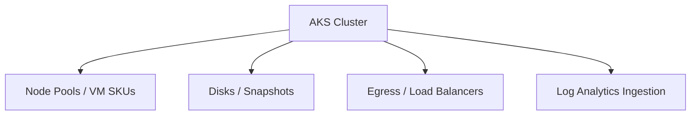
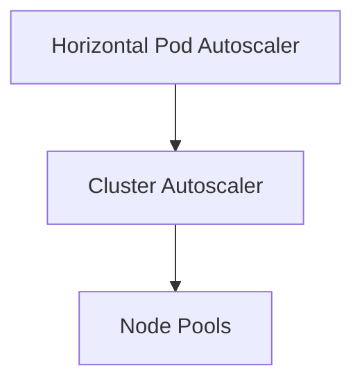

# Cost Optimization Strategies for Azure Kubernetes Service

## Executive Summary
This whitepaper provides an implementation-focused guide to cost optimization for Azure Kubernetes Service (AKS) in Azure Commercial environments. It focuses on structural cost drivers, architectural decisions, and enforceable controls across compute, networking, storage, and observability. Guidance is opinionated, prevention-first, and implemented via Terraform and Azure Policy. The intended audience is experienced Azure and Kubernetes engineers operating production platforms.

## Table of Contents
- [Cost Optimization Strategies for Azure Kubernetes Service](#cost-optimization-strategies-for-azure-kubernetes-service)
  - [Executive Summary](#executive-summary)
  - [Table of Contents](#table-of-contents)
  - [1. Scope and Assumptions](#1-scope-and-assumptions)
  - [2. Cost Architecture Principles](#2-cost-architecture-principles)
  - [3. Primary AKS Cost Drivers](#3-primary-aks-cost-drivers)
  - [4. Node Pool Right-Sizing and VM Selection](#4-node-pool-right-sizing-and-vm-selection)
  - [5. Autoscaling and Capacity Management](#5-autoscaling-and-capacity-management)
  - [6. Spot Instances and Workload Segmentation](#6-spot-instances-and-workload-segmentation)
  - [7. Networking and Egress Cost Control](#7-networking-and-egress-cost-control)
  - [8. Storage and Persistent Volume Optimization](#8-storage-and-persistent-volume-optimization)
  - [9. Observability Cost Management](#9-observability-cost-management)
  - [10. Governance, Budgets, and Policy Guardrails](#10-governance-budgets-and-policy-guardrails)
  - [11. Terraform Implementation Patterns](#11-terraform-implementation-patterns)
  - [12. Tradeoffs and Limitations](#12-tradeoffs-and-limitations)
  - [13. Conclusion](#13-conclusion)

## 1. Scope and Assumptions
- Azure Commercial only  
- Azure Kubernetes Service (AKS)  
- Terraform (AzureRM provider) required  
- Private AKS clusters only  
- Cost optimization enforced structurally, not manually  
- CI/CD-managed infrastructure  

## 2. Cost Architecture Principles
- Optimize architecture before tuning workloads  
- Align cost domains to ownership boundaries  
- Prefer elasticity over static capacity  
- Enforce limits to prevent runaway spend  
- Make cost visible at the team and workload level  

## 3. Primary AKS Cost Drivers



- Node pool VM hours dominate baseline spend  
- Egress and NAT traffic are common blind spots  
- Log ingestion grows non-linearly with scale  

## 4. Node Pool Right-Sizing and VM Selection
- Use workload-specific node pools  
- Avoid over-provisioned general-purpose SKUs  
- Prefer memory-optimized SKUs only where justified  
- Right-size system node pools aggressively  
- Eliminate unused node pools  

## 5. Autoscaling and Capacity Management



- Enable Cluster Autoscaler per node pool  
- Enforce pod resource requests and limits  
- Avoid fixed-size pools in non-production  
- Separate scale characteristics by workload  

## 6. Spot Instances and Workload Segmentation
- Use spot node pools for fault-tolerant workloads  
- Explicit taints and tolerations required  
- No stateful or control-plane-adjacent workloads  
- Expect and design for eviction  

## 7. Networking and Egress Cost Control
- Prefer internal load balancers  
- Centralize egress through firewall/NAT  
- Avoid unnecessary cross-zone traffic  
- Minimize public load balancer usage  
- Monitor SNAT and outbound data volume  

## 8. Storage and Persistent Volume Optimization
- Match disk SKU to IOPS requirements  
- Avoid over-sized managed disks  
- Clean up orphaned PVCs  
- Snapshot and backup retention limits enforced  

## 9. Observability Cost Management
- Table-level Log Analytics retention  
- Filter noisy container logs  
- Avoid per-pod alerting  
- Separate security logs from application telemetry  

## 10. Governance, Budgets, and Policy Guardrails
- Azure budgets at subscription and resource group scope  
- Cost anomaly alerts  
- Policy to deny unsupported VM SKUs  
- Enforce tagging for cost allocation  

## 11. Terraform Implementation Patterns

```hcl
resource "azurerm_kubernetes_cluster_node_pool" "spot" {
  name                  = "spotnp"
  kubernetes_cluster_id = azurerm_kubernetes_cluster.aks.id
  vm_size               = "Standard_D4s_v5"
  priority              = "Spot"
  eviction_policy       = "Delete"
  node_count            = 1
}
```

## 12. Tradeoffs and Limitations
- Aggressive autoscaling can impact latency  
- Spot instances require workload resilience  
- Reduced log retention limits forensic depth  

## 13. Conclusion
Cost optimization in AKS is an architectural discipline, not a post-facto exercise. By aligning node pools to workloads, enforcing autoscaling, controlling egress and telemetry, and codifying guardrails with Terraform and Azure Policy, teams can operate cost-efficient AKS platforms without sacrificing reliability or security.
