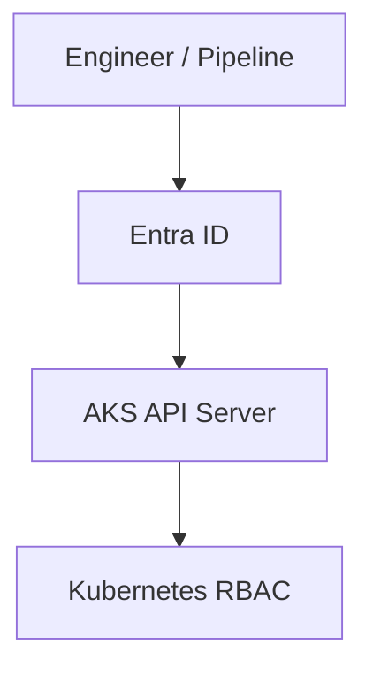
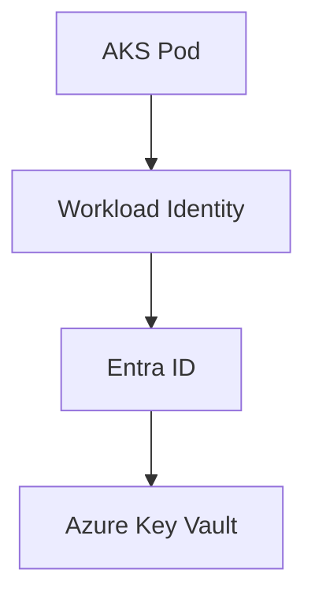

# Identity and RBAC Integration in Azure Kubernetes Service

## Executive Summary
This whitepaper provides an implementation-focused guide to identity and role-based access control (RBAC) integration for Azure Kubernetes Service (AKS) in Azure Commercial environments. It covers Microsoft Entra ID integration, Kubernetes RBAC design, Azure RBAC interactions, workload identity, and Terraform-based enforcement patterns. The guidance is intended for experienced Azure and Kubernetes engineers operating production and regulated AKS platforms.

## Table of Contents
- [1. Scope and Assumptions](#1-scope-and-assumptions)
- [2. Identity Architecture Principles](#2-identity-architecture-principles)
- [3. Control Plane Authentication Model](#3-control-plane-authentication-model)
- [4. Azure RBAC vs Kubernetes RBAC](#4-azure-rbac-vs-kubernetes-rbac)
- [5. Entra ID Integration Patterns](#5-entra-id-integration-patterns)
- [6. Privileged Access Management (PIM)](#6-privileged-access-management-pim)
- [7. Workload Identity and Pod Authentication](#7-workload-identity-and-pod-authentication)
- [8. Secrets and Key Vault Integration](#8-secrets-and-key-vault-integration)
- [9. Auditing and Access Visibility](#9-auditing-and-access-visibility)
- [10. Azure Policy and Guardrails](#10-azure-policy-and-guardrails)
- [11. Terraform Configuration Patterns](#11-terraform-configuration-patterns)
- [12. Tradeoffs and Limitations](#12-tradeoffs-and-limitations)
- [13. Conclusion](#13-conclusion)

## 1. Scope and Assumptions
- Azure Commercial only  
- Azure Kubernetes Service (AKS)  
- Terraform (AzureRM provider) required  
- Private AKS clusters only  
- Entra ID used for all human authentication  
- CI/CD-managed infrastructure and access  

## 2. Identity Architecture Principles
- Centralized identity via Entra ID  
- Least privilege by default  
- Separation of control plane and workload access  
- Just-in-time elevation for privileged roles  
- No static credentials  

## 3. Control Plane Authentication Model



- AKS API server integrated with Entra ID  
- Local accounts disabled  
- kubectl access gated by Entra ID groups  

## 4. Azure RBAC vs Kubernetes RBAC
- Azure RBAC controls access to AKS resource and API endpoint  
- Kubernetes RBAC controls in-cluster authorization  
- Avoid overloading Azure RBAC for in-cluster permissions  
- Entra ID groups mapped to Kubernetes roles  

## 5. Entra ID Integration Patterns
- Use Entra ID groups, not individual users  
- Separate admin, operator, and read-only groups  
- Map groups to ClusterRoleBindings  
- Avoid cluster-admin except for break-glass  

## 6. Privileged Access Management (PIM)
- PIM enforced for AKS admin roles  
- Time-bound elevation  
- Approval workflows for production  
- Break-glass identities excluded from PIM but monitored  

## 7. Workload Identity and Pod Authentication



- Replace legacy AAD Pod Identity  
- Federated credentials per workload  
- No secrets stored in Kubernetes  

## 8. Secrets and Key Vault Integration
- Azure Key Vault as source of truth  
- CSI driver for secret injection  
- No plaintext secrets in manifests  
- Separate Key Vaults per environment  

## 9. Auditing and Access Visibility
- AKS audit logs enabled  
- Entra ID sign-in logs retained  
- Log Analytics for centralized review  
- Correlate API calls to user identity  

## 10. Azure Policy and Guardrails
- Enforce Entra ID integration  
- Deny local accounts  
- Audit cluster-admin bindings  
- Require workload identity  

## 11. Terraform Configuration Patterns

```hcl
resource "azurerm_kubernetes_cluster" "aks" {
  name                = local.aks_name
  location            = azurerm_resource_group.rg.location
  resource_group_name = azurerm_resource_group.rg.name

  azure_active_directory_role_based_access_control {
    managed                = true
    azure_rbac_enabled     = false
  }

  local_account_disabled = true
}
```

## 12. Tradeoffs and Limitations
- Dual RBAC model increases cognitive load  
- Misconfigured group mappings can block access  
- Workload identity requires app registration governance  

## 13. Conclusion
Strong identity integration is foundational to securing AKS. By combining Entra ID authentication, disciplined RBAC design, workload identity, and Terraform-based enforcement, teams can achieve auditable, least-privilege access without relying on static credentials or manual processes.
