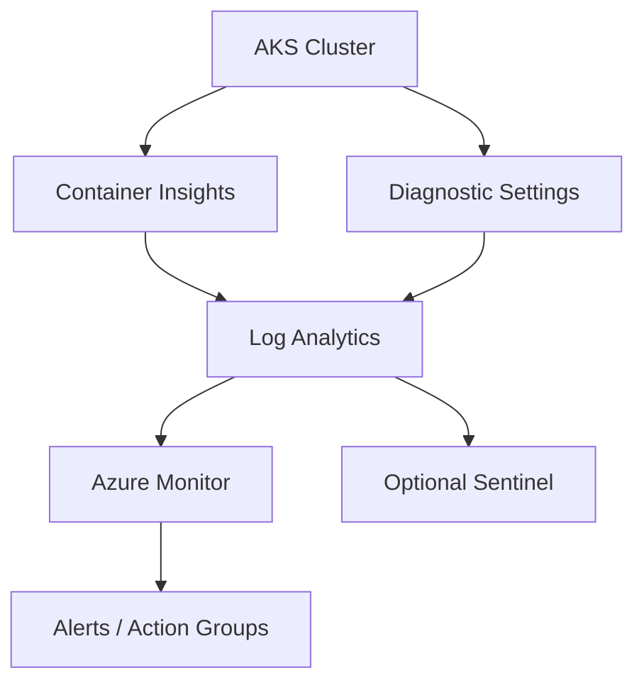
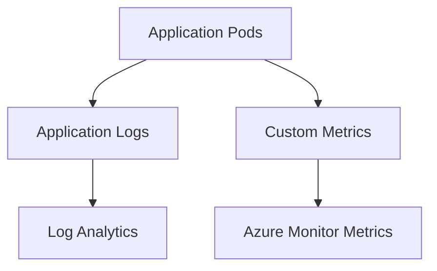

# Monitoring, Logging, and Observability in Azure Kubernetes Service

**Author:** Randy Bordeaux  
**Date:** January 2026  
**Version:** 1.0  
**Azure Services:** Azure Kubernetes Service (AKS), Azure Monitor, Container Insights, Log Analytics, Application Insights, Azure Managed Prometheus, Azure Managed Grafana

## Executive Summary
This whitepaper provides an implementation-focused guide to monitoring, logging, and observability for Azure Kubernetes Service (AKS) in Azure Commercial environments. It defines a layered telemetry architecture covering control plane visibility, node and workload metrics, application logs, security signals, and audit evidence. The guidance assumes experienced Azure and Kubernetes engineers and uses Terraform as the authoritative infrastructure-as-code mechanism.

## Table of Contents
- [Monitoring, Logging, and Observability in Azure Kubernetes Service](#monitoring-logging-and-observability-in-azure-kubernetes-service)
  - [Executive Summary](#executive-summary)
  - [Table of Contents](#table-of-contents)
  - [1. Scope and Assumptions](#1-scope-and-assumptions)
  - [2. Observability Architecture Principles](#2-observability-architecture-principles)
  - [3. Telemetry Architecture Overview](#3-telemetry-architecture-overview)
  - [4. Control Plane Visibility](#4-control-plane-visibility)
  - [5. Node and Cluster Metrics](#5-node-and-cluster-metrics)
  - [6. Workload and Application Telemetry](#6-workload-and-application-telemetry)
  - [7. Logging Strategy and Retention](#7-logging-strategy-and-retention)
  - [8. Security Signals and Auditability](#8-security-signals-and-auditability)
  - [9. Alerting and SLO-Based Monitoring](#9-alerting-and-slo-based-monitoring)
  - [10. Azure Policy and Guardrails](#10-azure-policy-and-guardrails)
  - [11. Terraform Implementation Patterns](#11-terraform-implementation-patterns)
  - [12. Tradeoffs and Limitations](#12-tradeoffs-and-limitations)
  - [13. Conclusion](#13-conclusion)

## 1. Scope and Assumptions
- Azure Commercial only  
- Azure Kubernetes Service (AKS)  
- Terraform (AzureRM provider) required  
- Private AKS clusters only  
- Centralized Log Analytics workspace  
- CI/CD-managed infrastructure and configuration  

## 2. Observability Architecture Principles
- Telemetry by default, not on-demand  
- Separation of metrics, logs, and traces  
- Central aggregation with environment isolation  
- Actionable alerts over raw signal volume  
- Evidence-ready audit trails  

## 3. Telemetry Architecture Overview



- Single Log Analytics workspace per environment  
- Diagnostic settings enabled on all supported resources  
- Optional SIEM integration without coupling  

## 4. Control Plane Visibility
- AKS control plane logs enabled via diagnostic settings  
- API server audit logs retained centrally  
- Correlate API calls to Entra ID identities  
- No reliance on ephemeral portal views  

## 5. Node and Cluster Metrics
- Container Insights enabled for baseline metrics  
- Node CPU, memory, disk, and network pressure  
- Kubelet and scheduler metrics captured  
- Zonal health monitored independently  

## 6. Workload and Application Telemetry



- Application logs forwarded to Log Analytics  
- Custom metrics exposed for autoscaling and alerting  
- Tracing integrated at the application layer where required  

## 7. Logging Strategy and Retention
- Centralized ingestion into Log Analytics  
- Separate tables for control plane, workload, and security logs  
- Retention aligned with compliance requirements  
- Cost controls via table-level retention and filtering  

## 8. Security Signals and Auditability
- AKS audit logs retained and queryable  
- Azure Policy compliance logs captured  
- Entra ID sign-in and audit logs correlated  
- Support for incident reconstruction and forensics  

## 9. Alerting and SLO-Based Monitoring
- Alert on symptoms, not noise  
- SLO-driven thresholds for availability and latency  
- Action groups integrated with incident tooling  
- Avoid per-pod alerting in favor of service-level signals  

## 10. Azure Policy and Guardrails
- Require diagnostic settings on AKS and dependencies  
- Audit missing Container Insights  
- Enforce Log Analytics workspace linkage  
- Deny clusters without monitoring enabled  

## 11. Terraform Implementation Patterns

```hcl
resource "azurerm_monitor_diagnostic_setting" "aks" {
  name                       = "aks-diag"
  target_resource_id         = azurerm_kubernetes_cluster.aks.id
  log_analytics_workspace_id = azurerm_log_analytics_workspace.law.id

  enabled_log {
    category = "kube-audit"
  }

  metric {
    category = "AllMetrics"
    enabled  = true
  }
}
```

## 12. Tradeoffs and Limitations
- High log volume requires retention discipline  
- Container Insights has cost implications at scale  
- Application-level tracing requires developer buy-in  

## 13. Conclusion
Effective observability in AKS requires deliberate architecture across metrics, logs, and audit signals. By standardizing telemetry collection, centralizing analysis, and enforcing monitoring via Terraform and Azure Policy, teams can operate reliable, secure, and supportable Kubernetes platforms in Azure Commercial environments.
