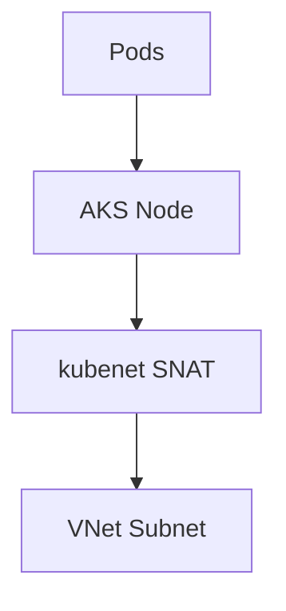
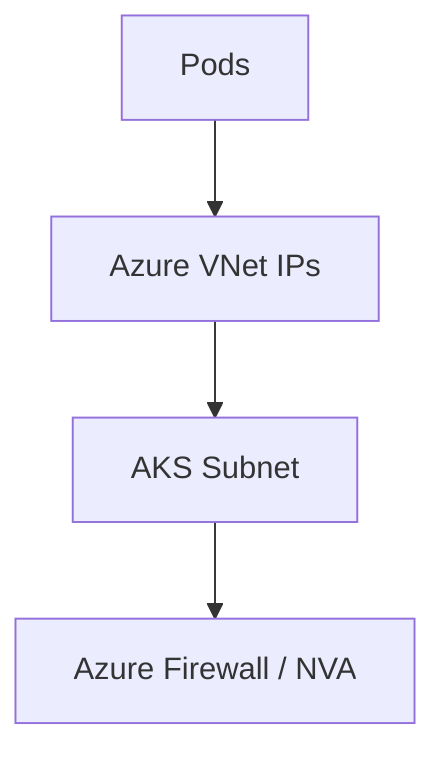

# Networking Models in Azure Kubernetes Service (kubenet vs Azure CNI)

## Executive Summary
This whitepaper provides a detailed, implementation-focused comparison of Kubernetes networking models in Azure Kubernetes Service (AKS), specifically **kubenet** and **Azure CNI**. It evaluates architectural differences, security implications, scalability constraints, and operational tradeoffs, with Terraform as the authoritative infrastructure-as-code mechanism. The guidance is intended for experienced Azure and Kubernetes engineers designing production-grade AKS platforms in Azure Commercial environments.

## Table of Contents
- [Networking Models in Azure Kubernetes Service (kubenet vs Azure CNI)](#networking-models-in-azure-kubernetes-service-kubenet-vs-azure-cni)
  - [Executive Summary](#executive-summary)
  - [Table of Contents](#table-of-contents)
  - [1. Scope and Assumptions](#1-scope-and-assumptions)
  - [2. Networking Design Principles](#2-networking-design-principles)
  - [3. kubenet Architecture](#3-kubenet-architecture)
  - [4. Azure CNI Architecture](#4-azure-cni-architecture)
  - [5. Security Implications](#5-security-implications)
  - [6. Network Policy and Traffic Control](#6-network-policy-and-traffic-control)
  - [7. IP Address Management and Scale](#7-ip-address-management-and-scale)
  - [8. Operational Considerations](#8-operational-considerations)
  - [9. Terraform Configuration Patterns](#9-terraform-configuration-patterns)
  - [10. Azure Policy and Guardrails](#10-azure-policy-and-guardrails)
  - [11. Tradeoffs and Decision Matrix](#11-tradeoffs-and-decision-matrix)
  - [12. Conclusion](#12-conclusion)

## 1. Scope and Assumptions
- Azure Commercial only  
- Azure Kubernetes Service (AKS)  
- Terraform (AzureRM provider) required  
- Private AKS clusters only  
- CI/CD-based Terraform execution  
- No manual post-deployment configuration  

## 2. Networking Design Principles
- Explicit IP ownership and routing  
- Deterministic traffic flow  
- Least-privilege network access  
- Policy-enforced segmentation  
- Predictable scaling behavior  

## 3. kubenet Architecture



- Pods receive IPs from an overlay CIDR  
- Nodes perform SNAT for outbound traffic  
- Limited integration with Azure-native network controls  
- Reduced IP consumption in the VNet  

## 4. Azure CNI Architecture



- Pods receive routable IPs from the VNet  
- Native integration with NSGs, UDRs, and firewalls  
- Required for most enterprise security architectures  

## 5. Security Implications
- kubenet limits NSG visibility at the pod level  
- Azure CNI enables granular east-west and north-south controls  
- Private endpoints and forced tunneling align naturally with Azure CNI  
- kubenet introduces opaque SNAT paths that complicate auditing  

## 6. Network Policy and Traffic Control
- Azure Network Policy Manager supported only with Azure CNI  
- Calico policy support differs by mode  
- Azure CNI enables consistent enforcement with Azure Policy add-on  

## 7. IP Address Management and Scale
- kubenet conserves VNet IP space  
- Azure CNI requires careful subnet sizing  
- Large clusters demand proactive IP planning  

## 8. Operational Considerations
- kubenet is simpler but less observable  
- Azure CNI increases complexity but improves control  
- Migration between models requires cluster rebuild  

## 9. Terraform Configuration Patterns

```hcl
resource "azurerm_kubernetes_cluster" "aks" {
  name                = local.aks_name
  location            = azurerm_resource_group.rg.location
  resource_group_name = azurerm_resource_group.rg.name

  network_profile {
    network_plugin = "azure"
    network_policy = "azure"
  }
}
```

## 10. Azure Policy and Guardrails
- Deny kubenet for production clusters  
- Enforce Azure CNI for regulated environments  
- Audit subnet IP capacity  
- Require network policy enablement  

## 11. Tradeoffs and Decision Matrix
- kubenet favors small, low-complexity clusters  
- Azure CNI favors enterprise and regulated workloads  
- Security and observability requirements usually outweigh IP cost  

## 12. Conclusion
For most production and regulated AKS deployments in Azure Commercial, **Azure CNI** is the preferred networking model. While kubenet reduces IP pressure, it introduces visibility and control gaps that conflict with enterprise security and compliance requirements. Terraform-based enforcement ensures consistent and auditable networking configurations across environments.
