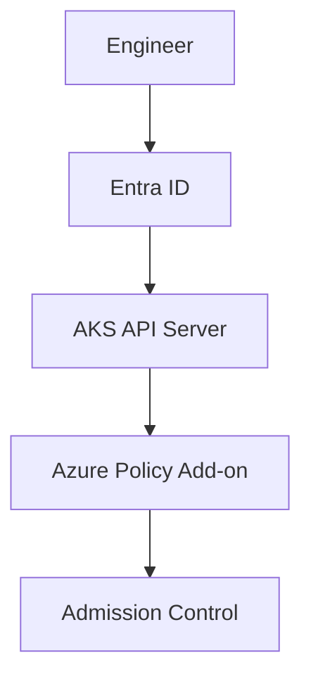
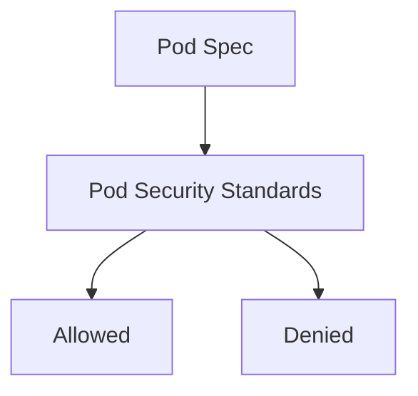
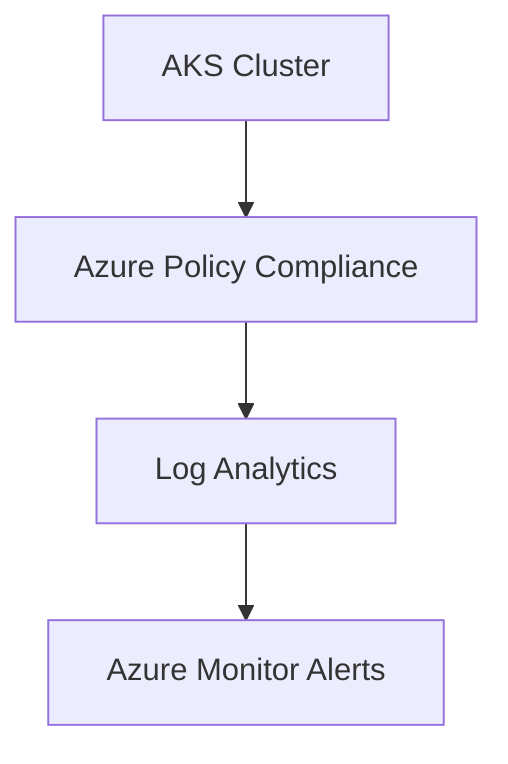

# Security Hardening and Policy Enforcement in Azure Kubernetes Service

**Author:** Randy Bordeaux  
**Date:** January 2026  
**Version:** 1.0  
**Azure Services:** Azure Kubernetes Service (AKS), Microsoft Entra ID, Azure Policy, Azure Key Vault, Azure Container Registry, Azure Defender for Containers, Azure Private Link

## Executive Summary
This whitepaper provides an implementation-focused reference for security hardening and policy enforcement in Azure Kubernetes Service (AKS) within Azure Commercial environments. It covers cluster-level hardening, workload security controls, Azure Policy enforcement, and Terraform-based guardrails. The guidance is intended for experienced Azure and Kubernetes engineers operating production and regulated AKS platforms where preventive controls and auditable enforcement are mandatory.

## Table of Contents
- [Security Hardening and Policy Enforcement in Azure Kubernetes Service](#security-hardening-and-policy-enforcement-in-azure-kubernetes-service)
  - [Executive Summary](#executive-summary)
  - [Table of Contents](#table-of-contents)
  - [1. Scope and Assumptions](#1-scope-and-assumptions)
  - [2. Security Hardening Principles](#2-security-hardening-principles)
  - [3. Cluster-Level Hardening](#3-cluster-level-hardening)
  - [4. Node and OS Security](#4-node-and-os-security)
  - [5. Workload and Pod Security](#5-workload-and-pod-security)
  - [6. Network Security Enforcement](#6-network-security-enforcement)
  - [7. Image Security and Supply Chain Controls](#7-image-security-and-supply-chain-controls)
  - [8. Azure Policy for AKS](#8-azure-policy-for-aks)
  - [9. Policy Assignment and Scope Design](#9-policy-assignment-and-scope-design)
  - [10. Monitoring, Alerting, and Drift Detection](#10-monitoring-alerting-and-drift-detection)
  - [11. Terraform Implementation Patterns](#11-terraform-implementation-patterns)
  - [12. Tradeoffs and Limitations](#12-tradeoffs-and-limitations)
  - [13. Conclusion](#13-conclusion)

## 1. Scope and Assumptions
- Azure Commercial only  
- Azure Kubernetes Service (AKS)  
- Terraform (AzureRM provider) required  
- Private AKS clusters only  
- Azure Policy add-on enabled  
- CI/CD-managed infrastructure  

## 2. Security Hardening Principles
- Preventive controls over detective controls  
- Least privilege at every layer  
- Explicit deny for insecure configurations  
- Immutable infrastructure assumptions  
- Continuous enforcement, not point-in-time checks  

## 3. Cluster-Level Hardening



- Private API server enabled  
- Local accounts disabled  
- Azure AD–backed authentication only  
- Azure Policy add-on required  
- Disable legacy features and preview flags  

## 4. Node and OS Security
- Ephemeral OS disks where supported  
- Regular node image upgrades  
- No SSH access to nodes  
- Minimal VM SKUs for system node pools  
- Separate node pools for privileged workloads  

## 5. Workload and Pod Security



- Enforce Pod Security Standards (baseline/restricted)  
- No privileged containers  
- Read-only root filesystems  
- Explicit resource requests and limits  
- No hostPath volumes without exception  

## 6. Network Security Enforcement
- Azure CNI required  
- Network policies enforced via Azure Policy  
- Deny public load balancers  
- Restrict egress via UDRs and firewall  
- East-west traffic explicitly controlled  

## 7. Image Security and Supply Chain Controls
- Private container registries only  
- Disable anonymous image pulls  
- Image scanning integrated into CI/CD  
- Enforce trusted registries via policy  
- Tag immutability for production images  

## 8. Azure Policy for AKS
- Built-in AKS policy initiatives as baseline  
- Custom policies for organizational standards  
- Mix of Deny, Audit, and Modify effects  
- Policy-driven admission control  

## 9. Policy Assignment and Scope Design
- Assign policies at subscription or management group scope  
- Separate policy sets per environment  
- Production uses Deny where non-prod may Audit  
- Exceptions handled via scoped assignments only  

## 10. Monitoring, Alerting, and Drift Detection



- Policy compliance continuously evaluated  
- Alerts on non-compliant resources  
- Drift detected via Terraform plan output  
- No manual remediation in production  

## 11. Terraform Implementation Patterns

```hcl
resource "azurerm_kubernetes_cluster" "aks" {
  name                = local.aks_name
  location            = azurerm_resource_group.rg.location
  resource_group_name = azurerm_resource_group.rg.name

  azure_policy_enabled = true
  local_account_disabled = true
}
```

## 12. Tradeoffs and Limitations
- Deny policies increase deployment friction  
- Policy exceptions require governance maturity  
- Some controls require coordination with application teams  

## 13. Conclusion
Effective AKS security requires layered hardening and continuous policy enforcement. By combining Azure-native controls, Kubernetes security standards, and Terraform-managed guardrails, teams can operate secure, compliant, and repeatable AKS platforms without relying on manual reviews or post-deployment fixes.
