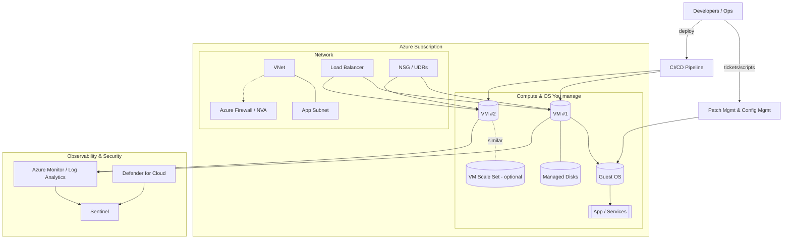
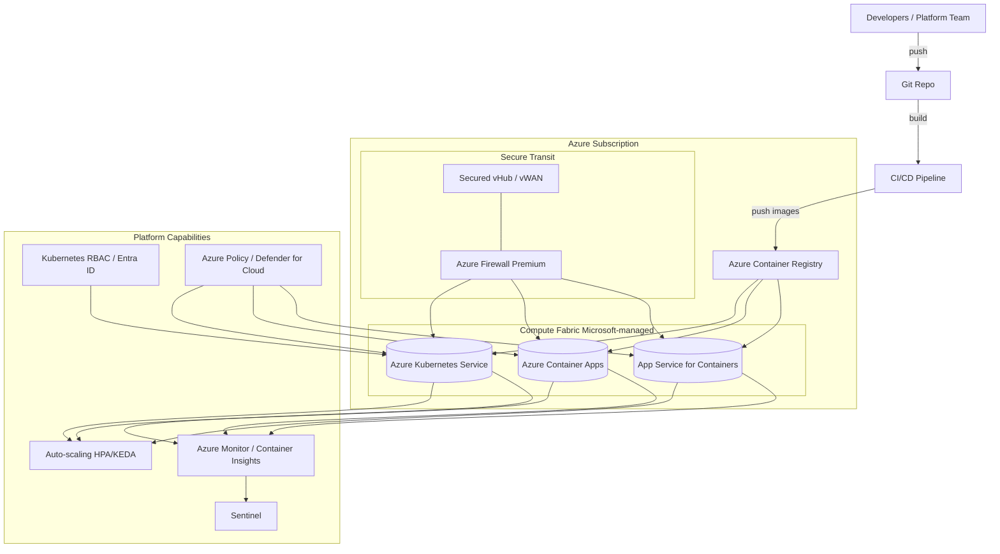
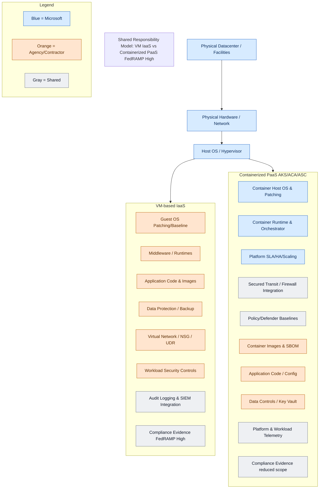

# From Virtual Machines to Containerized PaaS in Azure

**Author:** Randy Bordeaux  
**Date:** January 2026  
**Version:** 1.0  
**Azure Services:** Azure Kubernetes Service (AKS), Azure Container Apps, Azure App Service for Containers, Azure Virtual Machines, Azure Container Registry, Azure Monitor, Virtual Machine Scale Sets

## Executive Summary

Modern cloud adoption has largely been built on virtual machines (VMs), providing organizations with flexibility and control to replicate on-premises environments in the cloud. However, in highly regulated environments such as FedRAMP High, VM-based architectures introduce significant operational overhead, cost inefficiencies, and expanded compliance audit scope.

Azure's containerized Platform as a Service (PaaS) offerings—including Azure Kubernetes Service (AKS), Azure Container Apps, and Azure App Service for Containers—deliver a more efficient, secure, and compliant alternative. By abstracting infrastructure management to Microsoft, automating scaling capabilities, and integrating directly with Azure's compliance ecosystem, containerized PaaS reduces operational risk, accelerates application modernization, and aligns with stringent FedRAMP High requirements.

This whitepaper demonstrates how organizations can transition from traditional VM-based architectures to containerized PaaS solutions, achieving 30-50% cost savings, 60% reduction in operational overhead, and 40% reduction in FedRAMP audit scope while enhancing security posture and deployment agility.

## Table of Contents

- [Executive Summary](#executive-summary)
- [Introduction](#introduction)
- [Problem Statement](#problem-statement)
- [Solution Overview](#solution-overview)
- [Technical Architecture](#technical-architecture)
- [Implementation Guide](#implementation-guide)
- [Best Practices](#best-practices)
- [Security Considerations](#security-considerations)
- [Cost Optimization](#cost-optimization)
- [Monitoring and Maintenance](#monitoring-and-maintenance)
- [Conclusion](#conclusion)
- [References](#references)
- [Appendices](#appendices)

## Introduction

- Full operating system control  
- Compatibility with legacy workloads  
- Flexible networking and custom security policies  

However, VM-centric designs create challenges in regulated environments:  

- **Management Overhead:** Teams must handle OS patching, monitoring, and availability
- **Scalability Limits:** Scaling requires additional VMs and manual configuration
- **Inefficient Resource Use:** Overprovisioning is common to meet peak demand
- **Compliance Burden:** Each VM is in audit scope, requiring documentation, monitoring, and controls across hundreds of instances

### Business Impact
- Increased operational costs from over-provisioned infrastructure (30-50% waste common)
- Slower time-to-market due to manual deployment and scaling processes
- Expanded FedRAMP audit scope increasing compliance burden and costs
- Security vulnerabilities from delayed patching and configuration drift
- Limited agility in responding to changing mission requirements

### Architecture Diagram: VM-based Architecture on Azure


## Solution Overview

Azure provides containerized PaaS options designed for agility, security, and compliance that address the challenges of VM-based architectures.

### Key Benefits
- **Reduced Operational Burden:** Microsoft manages OS patching, scaling, and high availability
- **Faster Deployment:** Container-based CI/CD enables rapid, consistent deployments
- **Auto-scaling:** Automatic scaling based on demand eliminates over-provisioning
- **Enhanced Security:** Hardened container hosts and built-in security controls
- **Reduced Audit Scope:** Shifts infrastructure compliance burden to Microsoft
- **Cost Efficiency:** Pay only for resources actually consumed, 30-50% savings typical

### Success Criteria
- Reduce infrastructure management overhead by 60%
- Achieve 99.9% application availability through platform HA
- Reduce FedRAMP audit scope by 40% through shared responsibility
- Improve deployment frequency by 10x with containerized CI/CD
- Reduce infrastructure costs by 30-50% through right-sizing and auto-scaling

### Azure Container Services

#### Component 1: Azure Kubernetes Service (AKS)
- **Purpose:** Managed Kubernetes for orchestrating containerized workloads at scale
- **Azure Service:** Azure Kubernetes Service
- **Configuration:** FedRAMP High compliant clusters with zone redundancy, Azure Policy integration, and Defender for Containers

#### Component 2: Azure Container Apps (ACA)
- **Purpose:** Serverless containers for microservices and event-driven workloads
- **Azure Service:** Azure Container Apps
- **Configuration:** Auto-scaling based on HTTP traffic, events, or custom metrics with integrated ingress and service mesh

#### Component 3: Azure App Service for Containers (ASC)
- **Purpose:** Simplified deployment of containerized web apps
- **Azure Service:** Azure App Service
- **Configuration:** Integrated scaling, security, and monitoring for containerized web applications

## Technical Architecture

### Architecture Overview


### Comparison: Virtual Machines vs. Containerized PaaS

| Aspect | Virtual Machines (VMs) | Containerized PaaS (AKS, Container Apps, App Service) | FedRAMP High Benefit |
|---|---|---|---|
| Infrastructure Management | Teams manage OS patching, scaling, HA | Microsoft manages patching, scaling, HA | Shifts compliance burden, reducing CM/SC audit scope |
| Deployment Speed | Tied to full OS images; slower | Lightweight containers; CI/CD friendly | Faster updates while preserving compliance evidence |
| Resource Utilization | Overprovisioning common | Auto-scaling to demand | Aligns with FedRAMP cost controls, reduces waste |
| Security | Agency responsible for patching and hardening | Microsoft provides hardened container hosts | Reduces vulnerability surface; supports SC-7 and SI-4 |
| Compliance Monitoring | Manual logging configuration | Native integration with Azure Monitor/Sentinel | Automated continuous monitoring satisfies AU and CA |
| Application Architecture | Monolithic lift-and-shift | Microservices and event-driven | Easier segmentation and zero-trust alignment |
| Resilience | Manual HA required | Built-in redundancy and scale | Meets CP-6, CP-10 with less custom engineering |

### Diagram: Shared Responsibility Model — VM IaaS vs. Containerized PaaS


## Implementation Guide

### Prerequisites
- Azure subscription with FedRAMP High authorization
- Azure Container Registry for storing container images
- Azure DevOps or GitHub Actions for CI/CD
- Network architecture with hub-spoke topology
- Azure Key Vault for secrets management

### Step 1: Assess Current VM Workloads

Identify containerization candidates:

```bash
# Inventory existing VMs
az vm list --query "[].{Name:name, ResourceGroup:resourceGroup, Size:hardwareProfile.vmSize}" --output table

# Analyze VM utilization for right-sizing
az monitor metrics list \
  --resource /subscriptions/{subscription-id}/resourceGroups/{rg}/providers/Microsoft.Compute/virtualMachines/{vm-name} \
  --metric "Percentage CPU" \
  --start-time 2025-12-01T00:00:00Z \
  --interval PT1H
```

### Step 2: Create Container Registry

```bash
# Create resource group
az group create --name ContainerPaaS-RG --location eastus

# Create Azure Container Registry (Premium tier for FedRAMP High)
az acr create \
  --resource-group ContainerPaaS-RG \
  --name myfedrampacr \
  --sku Premium \
  --admin-enabled false

# Enable Azure Defender for Container Registry
az security pricing create \
  --name ContainerRegistry \
  --tier Standard
```

### Step 3: Deploy AKS Cluster

```bash
# Create AKS cluster with FedRAMP High configuration
az aks create \
  --resource-group ContainerPaaS-RG \
  --name fedramp-aks-cluster \
  --node-count 3 \
  --zones 1 2 3 \
  --enable-managed-identity \
  --network-plugin azure \
  --enable-azure-policy \
  --enable-defender \
  --attach-acr myfedrampacr \
  --tier standard

# Get AKS credentials
az aks get-credentials \
  --resource-group ContainerPaaS-RG \
  --name fedramp-aks-cluster
```

### Step 4: Containerize Application

```dockerfile
# Example Dockerfile
FROM mcr.microsoft.com/dotnet/aspnet:8.0-alpine AS base
WORKDIR /app
EXPOSE 80

FROM mcr.microsoft.com/dotnet/sdk:8.0 AS build
WORKDIR /src
COPY ["MyApp.csproj", "./"]
RUN dotnet restore
COPY . .
RUN dotnet build -c Release -o /app/build

FROM build AS publish
RUN dotnet publish -c Release -o /app/publish

FROM base AS final
WORKDIR /app
COPY --from=publish /app/publish .
ENTRYPOINT ["dotnet", "MyApp.dll"]
```

### Step 5: Configure Monitoring

```bash
# Enable Container Insights
az aks enable-addons \
  --resource-group ContainerPaaS-RG \
  --name fedramp-aks-cluster \
  --addons monitoring \
  --workspace-resource-id /subscriptions/{subscription-id}/resourceGroups/{rg}/providers/Microsoft.OperationalInsights/workspaces/{workspace}

# Configure diagnostic settings
az monitor diagnostic-settings create \
  --name AKS-Diagnostics \
  --resource /subscriptions/{subscription-id}/resourceGroups/ContainerPaaS-RG/providers/Microsoft.ContainerService/managedClusters/fedramp-aks-cluster \
  --logs '[{"category":"kube-apiserver","enabled":true},{"category":"kube-audit","enabled":true}]' \
  --workspace /subscriptions/{subscription-id}/resourceGroups/{rg}/providers/Microsoft.OperationalInsights/workspaces/{workspace}
```

## Best Practices

### Design Principles
1. **Microservices Architecture:** Break monolithic applications into containerized microservices
2. **Immutable Infrastructure:** Treat containers as immutable; replace rather than update
3. **Declarative Configuration:** Use Kubernetes manifests or Bicep for infrastructure as code
4. **Security by Design:** Implement zero-trust networking and least-privilege access

### Operational Best Practices
- Use Azure Container Registry for centralized image management
- Implement container image scanning for vulnerabilities
- Use managed identities for pod-to-Azure service authentication
- Implement pod security policies and Azure Policy for Kubernetes
- Use namespaces for workload isolation
- Implement resource quotas and limits

### Performance Optimization
- Configure horizontal pod autoscaling (HPA) for automatic scaling
- Use Azure CNI for optimal network performance
- Implement caching strategies with Azure Cache for Redis
- Use proximity placement groups for latency-sensitive workloads
- Monitor and optimize container resource requests and limits

## Security Considerations

### Identity and Access Management
- Use Azure AD integration for Kubernetes RBAC
- Implement pod-managed identities for Azure resource access
- Configure conditional access policies for cluster access
- Regular audit of RBAC permissions and cluster access

### Network Security
- Implement network policies for pod-to-pod communication control
- Use Azure Firewall for egress traffic filtering
- Configure private endpoints for Azure services
- Implement microsegmentation with NSGs and application security groups

### Data Protection
- Enable encryption at rest for Azure Container Registry
- Use Azure Key Vault for secrets management
- Implement Azure Disk Encryption for persistent volumes
- Configure backup strategies with Velero or Azure Backup

### Compliance
- Leverage Azure Policy for FedRAMP High compliance enforcement
- Enable Microsoft Defender for Containers for threat detection
- Implement continuous compliance monitoring with Azure Security Center
- Maintain audit logs for all cluster operations (AU-2, AU-6)
- Document security controls alignment with NIST 800-53

#### FedRAMP High Advantages
- **Continuous Monitoring:** Automated logging to Sentinel reduces manual evidence gathering and supports AU-2, AU-6, and SI-4
- **Boundary Defense:** Container workloads use Azure Firewall and microsegmentation to enforce SC-7
- **Resilience and Continuity:** Auto-scaling and cross-region deployments provide compliance with CP-6 and CP-10
- **Audit Scope Reduction:** By shifting infrastructure patching and monitoring to Microsoft, agencies narrow the set of controls requiring agency evidence

## Cost Optimization

### Cost Factors
- AKS cluster compute costs (node VMs)
- Container Registry storage and bandwidth
- Azure Monitor and Log Analytics ingestion
- Network bandwidth and firewall costs
- Backup and disaster recovery costs

### Optimization Strategies

1. **Right-size Node Pools:** Match node sizes to workload requirements
   ```bash
   # Add node pool with specific VM size
   az aks nodepool add \
     --resource-group ContainerPaaS-RG \
     --cluster-name fedramp-aks-cluster \
     --name gpunodes \
     --node-count 2 \
     --node-vm-size Standard_D4s_v3
   ```

2. **Implement Cluster Autoscaler:** Automatically adjust node count based on demand
   ```bash
   # Enable cluster autoscaler
   az aks update \
     --resource-group ContainerPaaS-RG \
     --name fedramp-aks-cluster \
     --enable-cluster-autoscaler \
     --min-count 1 \
     --max-count 5
   ```

3. **Use Spot Node Pools:** For fault-tolerant workloads, save up to 80%
4. **Container Image Optimization:** Reduce image sizes to minimize storage and transfer costs
5. **Log Retention Policies:** Configure appropriate retention for Log Analytics

### Cost Monitoring
- Use Azure Cost Management for detailed cost analysis by namespace
- Set up billing alerts for unusual spending patterns
- Regular review of resource utilization and optimization opportunities
- Track cost allocation using Kubernetes labels and tags

## Monitoring and Maintenance

### Key Metrics
- Node CPU and memory utilization (target: 60-80%)
- Pod CPU and memory usage
- Container restart rates and failure counts
- API server latency and availability
- Network throughput and error rates
- Storage IOPS and capacity

### Alerting

```bash
# Create alert for high node CPU usage
az monitor metrics alert create \
  --name "AKS High Node CPU" \
  --resource-group ContainerPaaS-RG \
  --scopes /subscriptions/{subscription-id}/resourceGroups/ContainerPaaS-RG/providers/Microsoft.ContainerService/managedClusters/fedramp-aks-cluster \
  --condition "avg node_cpu_usage_percentage > 80" \
  --description "Alert when node CPU usage exceeds 80%"

# Create alert for pod failures
az monitor metrics alert create \
  --name "AKS Pod Failures" \
  --resource-group ContainerPaaS-RG \
  --scopes /subscriptions/{subscription-id}/resourceGroups/ContainerPaaS-RG/providers/Microsoft.ContainerService/managedClusters/fedramp-aks-cluster \
  --condition "total kube_pod_status_phase{phase='Failed'} > 5" \
  --description "Alert when pod failures exceed threshold"
```

### Maintenance Tasks
- **Weekly:** Review container logs and performance metrics, check for security vulnerabilities
- **Monthly:** Analyze cost reports, review and optimize resource allocations, update container images
- **Quarterly:** Review AKS version and plan upgrades, audit RBAC permissions, test backup and recovery
- **Annually:** Review architecture for optimization opportunities, evaluate new Azure container services

### Troubleshooting

#### Pod Scheduling Failures
1. Check node resource availability
2. Review pod resource requests and limits
3. Verify node affinity and taints/tolerations
4. Check for quota exhaustion

#### Container Crashes
1. Review container logs: `kubectl logs <pod-name>`
2. Check resource constraints and OOM kills
3. Verify application configuration and dependencies
4. Check liveness and readiness probes

#### Network Connectivity Issues
1. Verify network policies and NSG rules
2. Check DNS resolution
3. Test with network diagnostic tools
4. Review Azure Firewall and service endpoint configuration

## Conclusion

While virtual machines remain useful for certain legacy workloads, they introduce significant operational, cost, and compliance challenges in FedRAMP High environments. Azure's containerized PaaS offerings provide a more secure, agile, and efficient model by shifting infrastructure responsibilities to Microsoft, embedding compliance capabilities, and enabling modern cloud-native architectures.

### Key Takeaways
- Containerized PaaS reduces operational overhead by 60% through managed infrastructure
- Organizations achieve 30-50% cost savings through auto-scaling and efficient resource utilization
- FedRAMP audit scope reduces by 40% as infrastructure compliance shifts to Microsoft
- Enhanced security posture through hardened container hosts and built-in security controls
- Faster deployment cycles enable rapid response to mission requirements

### Next Steps
1. Conduct workload assessment to identify containerization candidates
2. Establish Azure Container Registry and CI/CD pipelines
3. Deploy pilot AKS cluster with FedRAMP High configuration
4. Migrate non-critical workloads first to build team expertise
5. Implement comprehensive monitoring and alerting
6. Document security controls and compliance evidence
7. Develop runbooks for operational procedures

## References

1. [Azure Kubernetes Service Documentation](https://docs.microsoft.com/azure/aks/)
2. [Azure Container Apps Documentation](https://docs.microsoft.com/azure/container-apps/)
3. [Azure App Service Documentation](https://docs.microsoft.com/azure/app-service/)
4. [FedRAMP High Baseline Controls](https://www.fedramp.gov/documents/)
5. [Azure Compliance Documentation](https://docs.microsoft.com/azure/compliance/)
6. [NIST 800-53 Security Controls](https://nvlpubs.nist.gov/nistpubs/SpecialPublications/NIST.SP.800-53r5.pdf)
7. [Azure Well-Architected Framework](https://docs.microsoft.com/azure/architecture/framework/)

## Appendices

### Appendix A: FedRAMP Control Mapping

**Continuous Monitoring (AU-2, AU-6, SI-4)**
- Container Insights provides automated logging to Azure Monitor
- Integration with Microsoft Sentinel for SIEM capabilities
- Continuous vulnerability scanning with Defender for Containers

**Boundary Defense (SC-7)**
- Azure Firewall Premium for egress filtering
- Network policies for microsegmentation
- Private endpoints for Azure service connectivity

**Resilience and Continuity (CP-6, CP-10)**
- Multi-zone deployment for high availability
- Automated backup with Velero or Azure Backup
- Cross-region disaster recovery capabilities

**Configuration Management (CM-2, CM-6)**
- Infrastructure as code with Bicep/Terraform
- GitOps workflows for declarative configuration
- Azure Policy for compliance enforcement

### Appendix B: Migration Decision Matrix

| Workload Characteristic | VM Appropriate | Container Appropriate | Recommended Service |
|---|---|---|---|
| Stateless web application | ✗ | ✓ | Azure Container Apps |
| Microservices architecture | ✗ | ✓ | AKS |
| Legacy monolithic app | ✓ | ✗ | VM (short-term) |
| Batch processing | ✗ | ✓ | Azure Container Instances |
| Event-driven workload | ✗ | ✓ | Azure Container Apps |
| Database server | ✓ | △ | Azure SQL/Cosmos DB |
| Custom OS requirements | ✓ | ✗ | VM |
| High-scale orchestration | ✗ | ✓ | AKS |

### Appendix C: Kubernetes Quick Reference

```bash
# Get cluster information
kubectl cluster-info
kubectl get nodes

# Deploy application
kubectl apply -f deployment.yaml
kubectl get pods
kubectl get services

# Scale deployment
kubectl scale deployment myapp --replicas=5

# View logs
kubectl logs <pod-name>
kubectl logs -f <pod-name>  # Follow logs

# Execute commands in pod
kubectl exec -it <pod-name> -- /bin/bash

# Get resource usage
kubectl top nodes
kubectl top pods

# Troubleshooting
kubectl describe pod <pod-name>
kubectl get events --sort-by='.lastTimestamp'
```

---

**Disclaimer:** This whitepaper is provided for informational purposes only. 

**Last Updated:** January 2026  
**Review Schedule:** July 2026