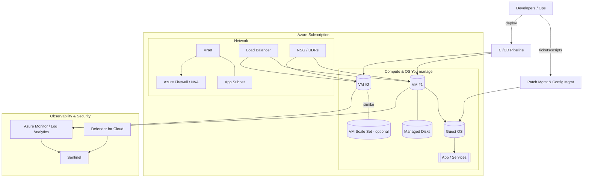
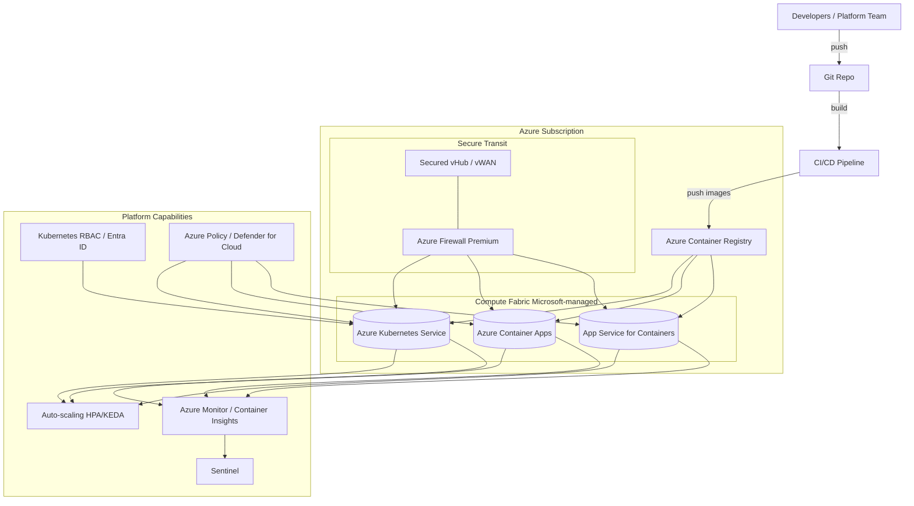

# Whitepaper  
**From Virtual Machines to Containerized PaaS in Azure**  
*Unlocking Agility, Efficiency, and Compliance in FedRAMP High Environments*  

---

## Executive Summary  
For many organizations, virtual machines (VMs) have been the foundation of cloud adoption. They provided flexibility and control, allowing agencies and contractors to replicate on-premises environments in the cloud. Yet in highly regulated environments such as FedRAMP High, VMs present significant challenges: operational overhead, inefficiencies, and expanded audit scope.  

Azure’s containerized Platform as a Service (PaaS) offerings — including Azure Kubernetes Service (AKS), Azure Container Apps, and Azure App Service for Containers — provide a more efficient, secure, and compliant alternative. By abstracting infrastructure management, automating scaling, and integrating directly with Azure’s compliance ecosystem, containerized PaaS reduces risk, accelerates modernization, and aligns with FedRAMP High requirements.  

---

## Virtual Machines in Azure: Strengths and Challenges  
Virtual Machines (VMs) were essential during the early stages of cloud migration. They allowed agencies to “lift and shift” applications with minimal architectural changes. VMs provide:  

- Full operating system control  
- Compatibility with legacy workloads  
- Flexible networking and custom security policies  

However, VM-centric designs create challenges in regulated environments:  

- Management Overhead: Teams must handle OS patching, monitoring, and availability.  
- Scalability Limits: Scaling requires additional VMs and manual configuration.  
- Inefficient Resource Use: Overprovisioning is common to meet peak demand.  
- Compliance Burden: Each VM is in audit scope, requiring documentation, monitoring, and controls across hundreds of instances.  

---

### Diagram: VM-based Architecture on Azure


---

## Containerized PaaS in Azure
Azure provides containerized PaaS options designed for agility, security, and compliance:

- Azure Kubernetes Service (AKS): Managed Kubernetes for orchestrating containerized workloads at scale.  
- Azure Container Apps (ACA): Serverless containers for microservices and event-driven workloads.  
- Azure App Service for Containers (ASC): Simplifies deployment of containerized web apps with integrated scaling and security.

These services remove the need for agencies to manage OS patching, VM scaling, and high availability design, while embedding compliance-ready monitoring and security features.

### Diagram: Containerized PaaS Architecture


---

## Comparison: Virtual Machines vs. Containerized PaaS

| Aspect | Virtual Machines (VMs) | Containerized PaaS (AKS, Container Apps, App Service) | FedRAMP High Benefit |
|---|---|---|---|
| Infrastructure Management | Teams manage OS patching, scaling, HA | Microsoft manages patching, scaling, HA | Shifts compliance burden, reducing CM/SC audit scope |
| Deployment Speed | Tied to full OS images; slower | Lightweight containers; CI/CD friendly | Faster updates while preserving compliance evidence |
| Resource Utilization | Overprovisioning common | Auto-scaling to demand | Aligns with FedRAMP cost controls, reduces waste |
| Security | Agency responsible for patching and hardening | Microsoft provides hardened container hosts | Reduces vulnerability surface; supports SC-7 and SI-4 |
| Compliance Monitoring | Manual logging configuration | Native integration with Azure Monitor/Sentinel | Automated continuous monitoring satisfies AU and CA |
| Application Architecture | Monolithic lift-and-shift | Microservices and event-driven | Easier segmentation and zero-trust alignment |
| Resilience | Manual HA required | Built-in redundancy and scale | Meets CP-6, CP-10 with less custom engineering |

### Diagram: Shared Responsibility Model — VM IaaS vs. Containerized PaaS
```mermaid
flowchart TB
    classDef ms fill:#d7ebff,stroke:#1e63c3,stroke-width:1px,color:#0a2b59;
    classDef agency fill:#ffe5cf,stroke:#b85c00,stroke-width:1px,color:#5a2c00;
    classDef shared fill:#eef0f3,stroke:#6b7280,stroke-width:1px,color:#111827;

    title[Shared Responsibility Model: VM IaaS vs Containerized PaaS (FedRAMP High)]

    subgraph Legend[Legend]
        MLegend[Blue = Microsoft]:::ms
        ALegend[Orange = Agency/Contractor]:::agency
        SLegend[Gray = Shared]:::shared
    end

    PDC[Physical Datacenter / Facilities]:::ms
    PHW[Physical Hardware / Network]:::ms
    HYP[Host OS / Hypervisor]:::ms

    subgraph IaaS[VM-based (IaaS)]
        GOS_I[Guest OS Patching/Baseline]:::agency
        MW_I[Middleware / Runtimes]:::agency
        APP_I[Application Code & Images]:::agency
        DATA_I[Data Protection / Backup]:::agency
        NET_I[Virtual Network / NSG / UDR]:::agency
        SEC_I[Workload Security Controls]:::agency
        LOG_I[Audit Logging & SIEM Integration]:::shared
        CMP_I[Compliance Evidence (FedRAMP High)]:::shared
    end

    subgraph PaaS[Containerized PaaS (AKS/ACA/ASC)]
        HOST_P[Container Host OS & Patching]:::ms
        CRT_P[Container Runtime & Orchestrator]:::ms
        PLT_P[Platform SLA/HA/Scaling]:::ms
        NET_P[Secured Transit / Firewall Integration]:::shared
        POL_P[Policy/Defender Baselines]:::shared
        IMG_P[Container Images & SBOM]:::agency
        APP_P[Application Code / Config]:::agency
        DATA_P[Data Controls / Key Vault]:::agency
        LOG_P[Platform & Workload Telemetry]:::shared
        CMP_P[Compliance Evidence (reduced scope)]:::shared
    end

    PDC --> PHW --> HYP --> IaaS
    HYP --> PaaS
```

---

## FedRAMP High Advantages
- Continuous Monitoring: Automated logging to Sentinel reduces manual evidence gathering and supports AU-2, AU-6, and SI-4.  
- Boundary Defense: Container workloads use Azure Firewall and microsegmentation to enforce SC-7.  
- Resilience and Continuity: Auto-scaling and cross-region deployments provide compliance with CP-6 and CP-10.  
- Audit Scope Reduction: By shifting infrastructure patching and monitoring to Microsoft, agencies narrow the set of controls requiring agency evidence.  

---

## Conclusion
While virtual machines remain useful for certain legacy workloads, they introduce significant operational, cost, and compliance challenges in FedRAMP High environments. Azure’s containerized PaaS offerings provide a more secure, agile, and efficient model by shifting infrastructure responsibilities to Microsoft, embedding compliance capabilities, and enabling modern cloud-native architectures.  

By moving from VMs to containerized PaaS, agencies and contractors reduce audit scope, strengthen their security posture, and unlock the agility needed to meet mission demands. The result is not simply a technical upgrade — it is a strategic enabler for compliance, efficiency, and innovation.