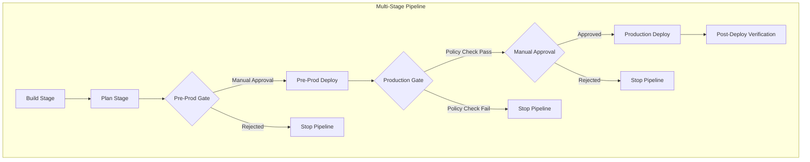
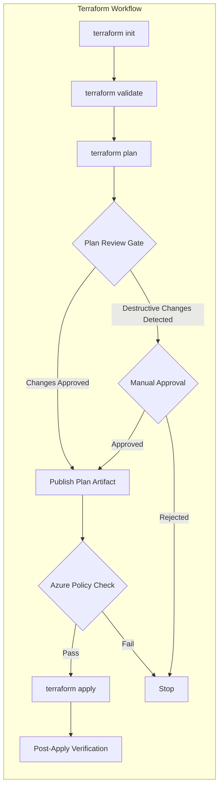
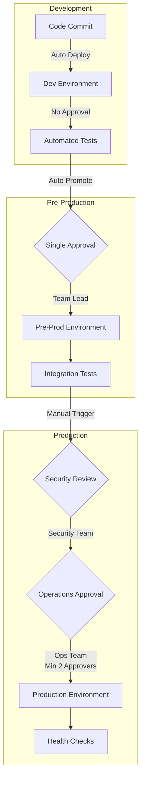
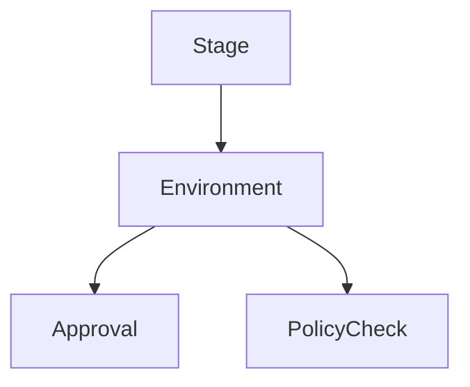
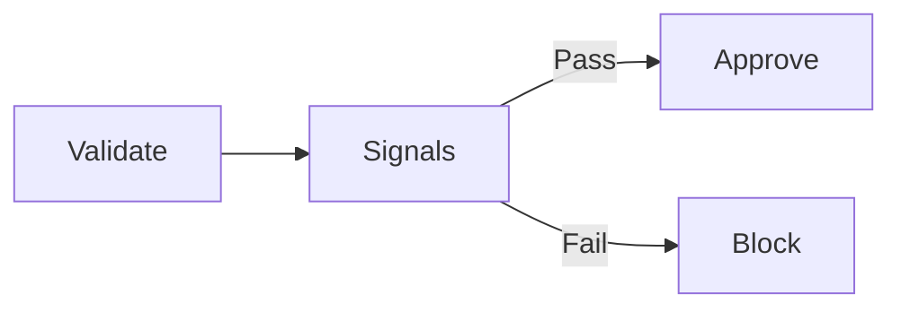
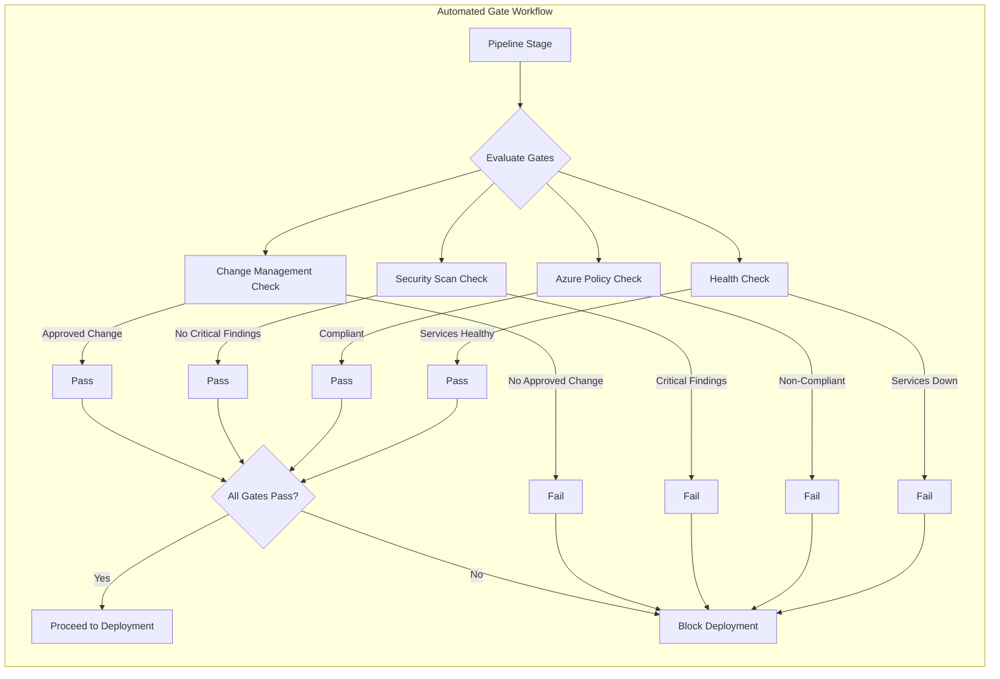
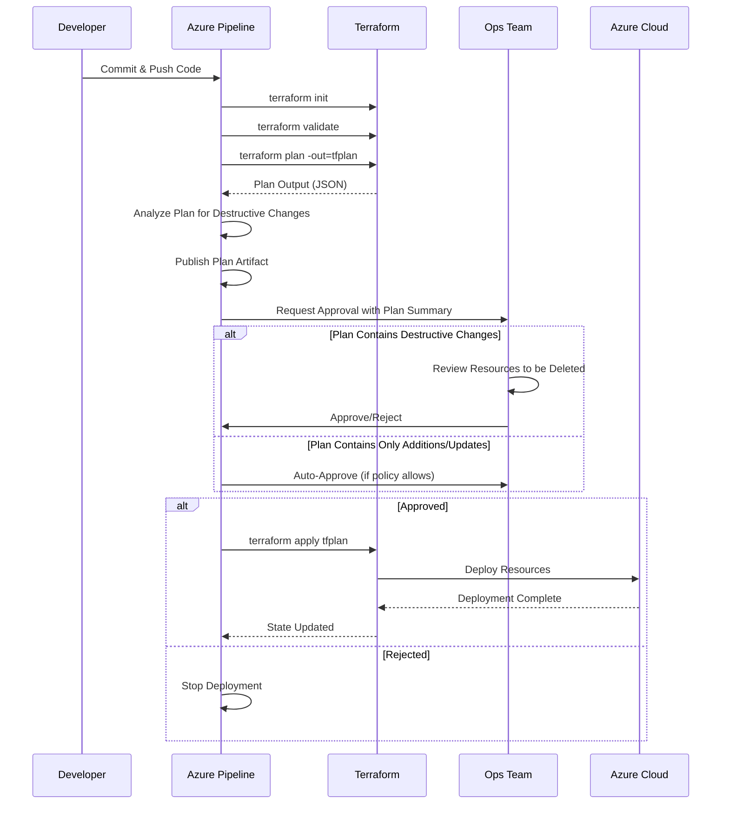

# Deployment Gates and Approvals in Azure Pipelines

**Author:** Randy Bordeaux  
**Version:** 1.0  
**Date:** January 2026  
**Azure Services:** Azure DevOps, Azure Pipelines, Azure Policy, Azure Monitor, Azure Key Vault

---

## Executive Summary

This whitepaper provides comprehensive, production-ready guidance for implementing **enterprise-grade deployment gates and approval workflows** in Azure DevOps and GitHub Actions pipelines. It addresses the critical challenge of balancing deployment velocity with safety, compliance, and auditability in regulated and high-risk environments.

Deployment gates and approvals are **control-plane mechanisms** that enforce separation of duties, prevent unauthorized changes, and ensure policy compliance before infrastructure modifications reach production. This document presents battle-tested patterns for multi-stage pipeline orchestration with Terraform as the authoritative infrastructure-as-code (IaC) mechanism.

**Key Outcomes:**
- Implement multi-layered approval workflows with automated and manual gates
- Configure Azure DevOps Environments with approval checks, branch policies, and timeout controls
- Integrate Azure Policy validation, security scanning, and change management systems
- Establish audit trails for compliance with NIST 800-171, SOC 2, and internal governance frameworks
- Prevent common anti-patterns that compromise control objectives

This guidance targets experienced Azure DevOps engineers and SREs managing production workloads in **Azure Commercial** environments where change control and auditability are mandatory requirements.

---

## Table of Contents

- [Deployment Gates and Approvals in Azure Pipelines](#deployment-gates-and-approvals-in-azure-pipelines)
  - [Executive Summary](#executive-summary)
  - [Table of Contents](#table-of-contents)
  - [Scope and Control Objectives](#scope-and-control-objectives)
    - [Purpose and Scope](#purpose-and-scope)
    - [Control Objectives](#control-objectives)
    - [Compliance Alignment](#compliance-alignment)
  - [Deployment Gate Architecture](#deployment-gate-architecture)
    - [Gate Types and Orchestration](#gate-types-and-orchestration)
    - [Gate Classification](#gate-classification)
    - [Gate Positioning Strategy](#gate-positioning-strategy)
    - [Terraform-Specific Gate Architecture](#terraform-specific-gate-architecture)
  - [Approval Models and Promotion Strategy](#approval-models-and-promotion-strategy)
    - [Manual Approval Configuration](#manual-approval-configuration)
      - [Azure DevOps Environment Approval Setup](#azure-devops-environment-approval-setup)
      - [Approval Workflow in Pipeline](#approval-workflow-in-pipeline)
    - [Separation of Duties](#separation-of-duties)
      - [Entra ID Group Configuration](#entra-id-group-configuration)
      - [Environment Permission Model](#environment-permission-model)
    - [Multi-Tier Approval Strategies](#multi-tier-approval-strategies)
  - [Azure DevOps Environments and Checks](#azure-devops-environments-and-checks)
  - [Automated Gates and Signal-Based Controls](#automated-gates-and-signal-based-controls)
  - [Terraform-Specific Approval Patterns](#terraform-specific-approval-patterns)
  - [Security, Compliance, and Auditability](#security-compliance-and-auditability)
    - [Audit Requirements](#audit-requirements)
    - [Compliance Alignment](#compliance-alignment-1)
  - [Failure Handling and Exception Management](#failure-handling-and-exception-management)
    - [Rejection Handling](#rejection-handling)
    - [Emergency Changes](#emergency-changes)
  - [Anti-Patterns and Common Misuse](#anti-patterns-and-common-misuse)
  - [Tradeoffs and Design Limitations](#tradeoffs-and-design-limitations)
    - [Tradeoffs](#tradeoffs)
    - [Benefits](#benefits)
  - [Conclusion](#conclusion)

---

## Scope and Control Objectives

### Purpose and Scope

This whitepaper addresses deployment gates and approvals as **mandatory control mechanisms** for enterprise Azure environments. The scope includes:

- **Multi-stage YAML pipelines** in Azure DevOps and GitHub Actions
- **Terraform-based infrastructure deployments** to Azure Commercial cloud
- **Production and pre-production environments** requiring change control
- **Compliance-driven workflows** aligned with industry frameworks
- **Integration with external validation systems** (Azure Policy, security scanners, ITSM tools)

**Out of Scope:**
- Classic pipelines (deprecated)
- Non-Azure cloud platforms
- Application code deployments without infrastructure changes
- Azure Government or sovereign cloud-specific requirements

### Control Objectives

Deployment gates and approvals enforce the following control objectives:

| Objective | Description | Implementation |
|-----------|-------------|----------------|
| **Authorization** | Explicit approval required for production changes | Manual approval gates with named approvers |
| **Separation of Duties** | Authors cannot approve their own changes | Enforced via Entra ID groups and environment permissions |
| **Policy Validation** | Compliance checked before deployment | Azure Policy checks, security scans, Terraform plan analysis |
| **Auditability** | Complete audit trail of approvals and rejections | Pipeline run history, Azure Activity Logs, change tickets |
| **Blast Radius Control** | Failed deployments isolated to single environment | Environment-specific failure handling and rollback |
| **Predictability** | Consistent promotion process across all changes | Standardized gate configurations and templates |

### Compliance Alignment

Gate enforcement supports alignment with:

- **NIST 800-171**: Change control and configuration management (3.4.x controls)
- **SOC 2 Type II**: Change management and separation of duties
- **ISO 27001**: Access control and change management (A.9, A.12)
- **PCI DSS**: Change control procedures for cardholder data environments (6.4.x)
- **Internal governance frameworks**: Custom approval policies and risk thresholds  

---

## Deployment Gate Architecture

### Gate Types and Orchestration

Deployment gates sit **between pipeline stages** and block promotion until required conditions are met. Gates operate as **synchronous control points** in the deployment workflow.



### Gate Classification

| Gate Type | Purpose | Execution | Best For |
|-----------|---------|-----------|----------|
| **Manual Approval** | Human authorization | Synchronous block | Production deployments, regulatory changes |
| **Automated Policy Check** | Compliance validation | Synchronous validation | Azure Policy, security baseline checks |
| **External System Check** | Third-party validation | Async API call | Change management systems, security scanners |
| **Time-Based Gate** | Scheduled deployment window | Time evaluation | Maintenance windows, business hour restrictions |
| **Health Check Gate** | Service availability verification | Health probe | Pre-deployment environment validation |
| **Composite Gate** | Multiple gate combination | Sequential or parallel | High-risk production deployments |

### Gate Positioning Strategy

```yaml
# Azure DevOps Pipeline - Strategic gate placement
trigger:
  branches:
    include:
    - main

stages:
# Stage 1: Build and validate (no gates)
- stage: Build
  jobs:
  - job: BuildInfrastructure
    steps:
    - script: terraform init
    - script: terraform validate
    - task: PublishPipelineArtifact@1
      inputs:
        targetPath: '$(Build.SourcesDirectory)'
        artifact: 'terraform-code'

# Stage 2: Plan with automated gates
- stage: Plan
  dependsOn: Build
  jobs:
  - job: TerraformPlan
    steps:
    - task: DownloadPipelineArtifact@2
    - script: |
        terraform init
        terraform plan -out=tfplan
    - task: PublishPipelineArtifact@1
      inputs:
        targetPath: 'tfplan'
        artifact: 'terraform-plan'

# Stage 3: Pre-production deployment with basic approval
- stage: DeployPreProd
  dependsOn: Plan
  jobs:
  - deployment: DeployToPreProd
    environment: pre-production  # Environment with approval check
    strategy:
      runOnce:
        deploy:
          steps:
          - script: terraform apply tfplan

# Stage 4: Production deployment with composite gates
- stage: DeployProduction
  dependsOn: DeployPreProd
  jobs:
  - deployment: DeployToProduction
    environment: production  # Environment with multiple checks
    strategy:
      runOnce:
        deploy:
          steps:
          - task: AzurePolicy@1  # Automated policy gate
          - script: |
              # Manual plan review required before this executes
              terraform apply tfplan
          - task: AzureMonitor@1  # Post-deployment health check
```

### Terraform-Specific Gate Architecture

Terraform deployments require specialized gate patterns due to state management and destructive change risks:



---

## Approval Models and Promotion Strategy

### Manual Approval Configuration

Manual approvals require explicit human authorization before deployment proceeds. Azure DevOps Environments provide first-class support for approval gates.

#### Azure DevOps Environment Approval Setup

```bash
# Azure CLI - Create environment with approvals
az devops service-endpoint create \
  --org "https://dev.azure.com/myorg" \
  --project "myproject" \
  --name "production" \
  --service-endpoint-type "azurerm"

# Configure approval check (via Azure DevOps UI or REST API)
# POST https://dev.azure.com/{org}/{project}/_apis/pipelines/checks/configurations?api-version=7.1
```

**Environment Configuration (via Azure DevOps Portal):**
1. Navigate to **Pipelines > Environments**
2. Create environment named `production`
3. Add **Approvals and checks**
4. Configure approvers and settings:

```yaml
# Environment approval configuration
approvals:
  - approver: "ops-team@company.com"
    minRequired: 2
    timeout: 4h
    instructions: |
      Review the Terraform plan artifact before approval.
      Verify:
      1. No unintended resource deletions
      2. All changes align with change ticket XYZ-123
      3. Security scanning passed with no critical findings
  - approver: "security-team@company.com"
    minRequired: 1
    timeout: 2h
```

#### Approval Workflow in Pipeline

```yaml
# azure-pipelines-production.yml
stages:
- stage: Production_Deployment
  jobs:
  - deployment: DeployInfrastructure
    displayName: 'Deploy to Production'
    environment: production  # Triggers approval gate
    variables:
      - group: prod-variables
    strategy:
      runOnce:
        deploy:
          steps:
          - checkout: self
          
          # Download pre-approved Terraform plan
          - task: DownloadPipelineArtifact@2
            inputs:
              artifact: 'terraform-plan'
              path: '$(Pipeline.Workspace)/tfplan'
          
          # Apply approved plan (no modifications allowed)
          - task: AzureCLI@2
            displayName: 'Apply Terraform Plan'
            inputs:
              azureSubscription: 'prod-service-connection'
              scriptType: 'bash'
              scriptLocation: 'inlineScript'
              inlineScript: |
                cd $(Pipeline.Workspace)/tfplan
                terraform init
                terraform apply -auto-approve "tfplan.binary"
          
          # Verify deployment health
          - task: AzureCLI@2
            displayName: 'Post-Deployment Verification'
            inputs:
              azureSubscription: 'prod-service-connection'
              scriptType: 'bash'
              scriptLocation: 'inlineScript'
              inlineScript: |
                # Verify resources deployed successfully
                az resource list --resource-group "rg-prod-eastus2" --output table
                
                # Check Azure Policy compliance
                az policy state list \
                  --resource-group "rg-prod-eastus2" \
                  --filter "complianceState eq 'NonCompliant'" \
                  --output table
```

### Separation of Duties

Separation of duties prevents conflicts of interest and unauthorized changes by enforcing role-based access control.

#### Entra ID Group Configuration

```hcl
# Terraform - Configure Entra ID groups for separation of duties
data "azuread_client_config" "current" {}

# Developers - Can commit code but cannot approve production deployments
resource "azuread_group" "developers" {
  display_name     = "DevOps-Developers"
  description      = "Development team - code contributors"
  security_enabled = true
  
  owners = [data.azuread_client_config.current.object_id]
}

# Production Approvers - Can approve but do not commit code
resource "azuread_group" "prod_approvers" {
  display_name     = "DevOps-Production-Approvers"
  description      = "Operations team - production deployment approvers"
  security_enabled = true
  
  owners = [data.azuread_client_config.current.object_id]
}

# Security Reviewers - Independent security validation
resource "azuread_group" "security_reviewers" {
  display_name     = "DevOps-Security-Reviewers"
  description      = "Security team - compliance and security validation"
  security_enabled = true
  
  owners = [data.azuread_client_config.current.object_id]
}

# Azure DevOps project-level permissions
resource "azuredevops_group_membership" "dev_contributors" {
  group = azuredevops_group.project_contributors.id
  members = [
    azuread_group.developers.object_id
  ]
}

resource "azuredevops_group_membership" "prod_approvers_membership" {
  group = azuredevops_group.environment_approvers.id
  members = [
    azuread_group.prod_approvers.object_id,
    azuread_group.security_reviewers.object_id
  ]
}
```

#### Environment Permission Model

```yaml
# Environment: production
permissions:
  # Developers can view but cannot deploy
  - identity: "DevOps-Developers"
    role: "Reader"
    
  # Operations team can deploy with approval
  - identity: "DevOps-Production-Approvers"
    role: "Administrator"
    permissions:
      - manage-environment
      - approve-deployments
      - view-deployments
      
  # Security team provides secondary approval
  - identity: "DevOps-Security-Reviewers"
    role: "Approver"
    permissions:
      - approve-deployments
      - view-deployments
```

### Multi-Tier Approval Strategies

Different environments require different approval rigor:



**Approval Matrix:**

| Environment | Approvers Required | Approval Timeout | Auto-Rejection | Change Ticket Required |
|-------------|-------------------|------------------|----------------|----------------------|
| Development | 0 (auto-deploy) | N/A | N/A | No |
| QA/Test | 1 (any team member) | 24 hours | No | No |
| Pre-Production | 1 (team lead) | 4 hours | Yes | Yes (for infrastructure) |
| Production | 2 (ops + security) | 2 hours | Yes | Yes (mandatory) |  

---

## Azure DevOps Environments and Checks

Azure DevOps **Environments** provide first-class deployment control.

Capabilities used:

- Approval checks  
- Azure Policy checks  
- Branch control  
- Timeout enforcement  



Each environment maps to a **single Azure subscription and identity boundary**.

---

## Automated Gates and Signal-Based Controls

Automated gates validate external signals before deployment.

Examples:

- Azure Policy compliance results  
- Terraform plan diff analysis  
- Security scan results  
- Change management system integration  



Automated gates reduce human error and approval fatigue.

---

## Terraform-Specific Approval Patterns

Terraform introduces unique risks that gates must address.

Required controls:

- `terraform plan` reviewed before apply  
- Plan artifacts immutable and retained  
- Explicit confirmation of destructive changes  

Recommended pattern:

- Dev/Test: automated apply  
- Prod: plan review + manual approval  

No production apply should execute without a reviewed plan.

---

## Security, Compliance, and Auditability

### Audit Requirements

- All approvals logged with identity and timestamp  
- Gate outcomes retained with pipeline run history  
- Azure Activity Logs enabled for deployed resources  

### Compliance Alignment

Gate enforcement supports alignment with:

- NIST 800-171 change control objectives  
- SOC-style separation of duties  
- Internal risk management frameworks  

---

## Failure Handling and Exception Management

### Rejection Handling

- Rejections halt promotion immediately  
- No auto-retry of failed approvals  
- Code or configuration changes required to reattempt  

### Emergency Changes

Emergency paths must:

- Be explicitly documented  
- Use elevated approval workflows  
- Trigger post-deployment review  

Break-glass procedures are audited and time-bound.

---

## Anti-Patterns and Common Misuse

Avoid the following:

- Auto-approving production deployments  
- Shared approver groups without accountability  
- Approval logic embedded in YAML conditionals  
- Skipping gates for speed  

These patterns undermine control objectives.

---

## Tradeoffs and Design Limitations

### Tradeoffs

- Slower deployment velocity  
- Increased operational overhead  

### Benefits

- Reduced blast radius  
- Strong audit posture  
- Predictable and controlled releases  

---

## Conclusion

Deployment gates and approvals are **mandatory control mechanisms** in enterprise Azure environments. When correctly designed, they balance automation with accountability, enabling safe and auditable delivery at scale.

---

*End of Document*

---

## Azure DevOps Environments and Checks

### Environment Configuration

Azure DevOps **Environments** provide first-class deployment control with built-in approval, branch protection, and policy integration.

```mermaid
graph TB
    subgraph "Azure DevOps Environment"
        Env[Environment: production] --> Approval[Approval Checks]
        Env --> BranchControl[Branch Control]
        Env --> Timeout[Timeout Settings]
        Env --> PolicyCheck[Policy Validation]
        
        Approval --> Approver1[Operations Team]
        Approval --> Approver2[Security Team]
        
        BranchControl --> MainBranch[Only 'main' branch]
        
        Timeout --> Approval Timeout[2 hour approval window]
        Timeout --> DeploymentTimeout[1 hour deployment limit]
        
        PolicyCheck --> AzurePolicy[Azure Policy Check]
        PolicyCheck --> SecurityScan[Security Scan Gate]
    end
```

### Terraform - Create Environments via API

```hcl
# Terraform - Azure DevOps environment with approval checks
resource "azuredevops_environment" "production" {
  project_id = azuredevops_project.project.id
  name       = "production"
  description = "Production environment with multi-stage approval gates"
}

resource "azuredevops_check_approval" "prod_approval" {
  project_id           = azuredevops_project.project.id
  target_resource_id   = azuredevops_environment.production.id
  target_resource_type = "environment"

  approvers = [
    azuread_group.prod_approvers.object_id,
    azuread_group.security_reviewers.object_id
  ]
  
  minimum_required_approvers = 2
  timeout                    = 7200  # 2 hours in seconds
  
  instructions = <<-EOT
    Review checklist before approval:
    1. Terraform plan reviewed and understood
    2. Change ticket approved and documented
    3. Security scan passed (no critical/high findings)
    4. Rollback plan documented and tested
    5. Deployment occurs during approved maintenance window
  EOT
}

resource "azuredevops_check_branch_control" "prod_branch_protection" {
  project_id           = azuredevops_project.project.id
  target_resource_id   = azuredevops_environment.production.id
  target_resource_type = "environment"
  
  allowed_branches = ["refs/heads/main"]
  verify_branch_protection = true
}
```

### Azure Policy Check Integration

```yaml
# Pipeline template with Azure Policy gate
parameters:
- name: environment
  type: string
- name: resourceGroup
  type: string

stages:
- stage: Deploy_${{ parameters.environment }}
  jobs:
  - deployment: DeployInfrastructure
    environment: ${{ parameters.environment }}
    strategy:
      runOnce:
        preDeploy:
          steps:
          # Pre-deployment Azure Policy compliance check
          - task: AzureCLI@2
            displayName: 'Validate Azure Policy Compliance'
            inputs:
              azureSubscription: 'prod-service-connection'
              scriptType: 'bash'
              scriptLocation: 'inlineScript'
              inlineScript: |
                # Get policy compliance state
                COMPLIANCE=$(az policy state list \
                  --resource-group "${{ parameters.resourceGroup }}" \
                  --filter "complianceState eq 'NonCompliant'" \
                  --query "length(@)")
                
                if [ "$COMPLIANCE" -gt 0 ]; then
                  echo "##vso[task.logissue type=error]Azure Policy non-compliance detected"
                  echo "Non-compliant resources found. Deployment blocked."
                  exit 1
                fi
                
                echo "Azure Policy compliance verified successfully"
        
        deploy:
          steps:
          - script: terraform apply -auto-approve
            displayName: 'Deploy Infrastructure'
        
        postRouting:
          steps:
          # Post-deployment compliance verification
          - task: AzureCLI@2
            displayName: 'Post-Deployment Compliance Check'
            inputs:
              azureSubscription: 'prod-service-connection'
              scriptType: 'bash'
              scriptLocation: 'inlineScript'
              inlineScript: |
                # Wait for policy evaluation (may take up to 10 minutes)
                sleep 120
                
                # Check compliance of newly deployed resources
                az policy state trigger-scan \
                  --resource-group "${{ parameters.resourceGroup }}"
                
                # Verify no new non-compliant resources
                NEW_VIOLATIONS=$(az policy state list \
                  --resource-group "${{ parameters.resourceGroup }}" \
                  --filter "timestamp gt $DEPLOYMENT_START_TIME and complianceState eq 'NonCompliant'" \
                  --query "length(@)")
                
                if [ "$NEW_VIOLATIONS" -gt 0 ]; then
                  echo "##vso[task.logissue type=warning]New policy violations detected post-deployment"
                  # Log details but don't fail (already deployed)
                fi
```

### Branch Protection Requirements

```yaml
# Enforce branch protection at environment level
environment:
  name: production
  checks:
    - type: branchControl
      settings:
        allowedBranches:
          - refs/heads/main
          - refs/heads/release/*
        verifyBranchProtection: true
        
# Branch protection rules required:
# - Require pull request reviews (minimum 2 reviewers)
# - Require status checks to pass before merging
# - Require conversation resolution before merging
# - Require signed commits
# - Include administrators (no bypass)
# - Do not allow force pushes
# - Do not allow deletions
```

### Timeout Configuration

```yaml
# Environment timeout settings
stages:
- stage: Production
  jobs:
  - deployment: Deploy
    environment: production
    timeoutInMinutes: 60  # Maximum deployment duration
    strategy:
      runOnce:
        deploy:
          steps:
          - script: terraform apply
            timeoutInMinutes: 45  # Task-level timeout
```

**Timeout Strategy:**

| Timeout Type | Development | Pre-Production | Production | Rationale |
|--------------|-------------|----------------|------------|-----------|
| Approval Timeout | N/A | 24 hours | 2 hours | Urgency increases with criticality |
| Deployment Timeout | 30 min | 45 min | 60 min | Complex prod deployments need time |
| Task Timeout | 15 min | 20 min | 30 min | Individual operations must complete |
| Gate Evaluation | 5 min | 5 min | 10 min | External system checks allowed time |

---

## Automated Gates and Signal-Based Controls

### External System Integration

Automated gates validate external signals before allowing deployment. Common integrations include:

- **Change Management Systems** (ServiceNow, Jira)
- **Security Scanning Platforms** (Aqua, Prisma Cloud, Snyk)
- **Azure Policy Compliance**
- **Monitoring Systems** (Azure Monitor, Datadog)
- **Testing Frameworks** (Selenium, JMeter)



### ServiceNow Change Management Integration

```yaml
# Azure Pipeline with ServiceNow approval gate
stages:
- stage: Production_Deployment
  jobs:
  - deployment: Deploy
    environment: production
    strategy:
      runOnce:
        preDeploy:
          steps:
          # Validate approved change request exists
          - task: PowerShell@2
            displayName: 'Validate ServiceNow Change Request'
            inputs:
              targetType: 'inline'
              script: |
                $changeNumber = "$(CHANGE_REQUEST_NUMBER)"
                $serviceNowUrl = "$(SERVICENOW_INSTANCE_URL)"
                $authToken = "$(SERVICENOW_API_TOKEN)"
                
                # Query ServiceNow for change request
                $headers = @{
                  "Authorization" = "Bearer $authToken"
                  "Content-Type" = "application/json"
                }
                
                $response = Invoke-RestMethod -Uri "$serviceNowUrl/api/now/table/change_request/$changeNumber" `
                  -Headers $headers -Method Get
                
                # Validate change is approved and within implementation window
                $state = $response.result.state
                $startTime = [DateTime]::Parse($response.result.start_date)
                $endTime = [DateTime]::Parse($response.result.end_date)
                $now = [DateTime]::Now
                
                if ($state -ne "Authorized" -and $state -ne "Scheduled") {
                  Write-Error "Change request $changeNumber is not in approved state: $state"
                  exit 1
                }
                
                if ($now -lt $startTime -or $now -gt $endTime) {
                  Write-Error "Current time is outside change implementation window"
                  exit 1
                }
                
                Write-Host "Change request $changeNumber validated successfully"
                Write-Host "Implementation window: $startTime to $endTime"
```

### Security Scanning Gate

```yaml
# Terraform plan security analysis
stages:
- stage: SecurityValidation
  jobs:
  - job: ScanTerraformPlan
    steps:
    # Download Terraform plan artifact
    - task: DownloadPipelineArtifact@2
      inputs:
        artifact: 'terraform-plan'
    
    # Convert plan to JSON for scanning
    - script: |
        terraform show -json tfplan.binary > tfplan.json
      displayName: 'Convert Plan to JSON'
    
    # Scan with Checkov (IaC security scanner)
    - script: |
        pip install checkov
        checkov -f tfplan.json \
          --framework terraform_plan \
          --output cli \
          --output junitxml \
          --output-file-path $(Build.ArtifactStagingDirectory)
      displayName: 'Scan Terraform Plan with Checkov'
      continueOnError: false
    
    # Publish security scan results
    - task: PublishTestResults@2
      inputs:
        testResultsFormat: 'JUnit'
        testResultsFiles: '$(Build.ArtifactStagingDirectory)/results_junitxml.xml'
        failTaskOnFailedTests: true
    
    # Check for critical/high severity findings
    - script: |
        CRITICAL=$(cat $(Build.ArtifactStagingDirectory)/results_cli.txt | grep "Critical" | wc -l)
        HIGH=$(cat $(Build.ArtifactStagingDirectory)/results_cli.txt | grep "High" | wc -l)
        
        if [ $CRITICAL -gt 0 ] || [ $HIGH -gt 0 ]; then
          echo "##vso[task.logissue type=error]Security scan failed: $CRITICAL critical, $HIGH high severity findings"
          exit 1
        fi
        
        echo "Security scan passed: No critical or high severity findings"
      displayName: 'Evaluate Security Findings'
```

### Pre-Deployment Health Check Gate

```yaml
# Validate target environment health before deployment
stages:
- stage: Deploy_Production
  jobs:
  - deployment: Deploy
    environment: production
    strategy:
      runOnce:
        preDeploy:
          steps:
          # Check Azure resource health
          - task: AzureCLI@2
            displayName: 'Pre-Deployment Health Check'
            inputs:
              azureSubscription: 'prod-service-connection'
              scriptType: 'bash'
              scriptLocation: 'inlineScript'
              inlineScript: |
                # Check resource group exists
                if ! az group exists --name "rg-prod-eastus2"; then
                  echo "##vso[task.logissue type=error]Target resource group does not exist"
                  exit 1
                fi
                
                # Check AKS cluster health
                CLUSTER_STATE=$(az aks show \
                  --resource-group "rg-prod-eastus2" \
                  --name "aks-prod-eastus2" \
                  --query "provisioningState" -o tsv)
                
                if [ "$CLUSTER_STATE" != "Succeeded" ]; then
                  echo "##vso[task.logissue type=error]AKS cluster not in healthy state: $CLUSTER_STATE"
                  exit 1
                fi
                
                # Check Application Gateway health
                AG_HEALTH=$(az network application-gateway show-backend-health \
                  --resource-group "rg-prod-eastus2" \
                  --name "agw-prod-eastus2" \
                  --query "backendAddressPools[0].backendHttpSettingsCollection[0].servers[0].health" -o tsv)
                
                if [ "$AG_HEALTH" != "Healthy" ]; then
                  echo "##vso[task.logissue type=warning]Application Gateway backend health: $AG_HEALTH"
                fi
                
                echo "Pre-deployment health checks passed"
```

---

## Terraform-Specific Approval Patterns

### Plan Review and Approval Workflow

Terraform's declarative model and state management require special approval patterns to prevent unintended changes and state corruption.



### Destructive Change Detection

```yaml
# Automated destructive change detection
stages:
- stage: Plan
  jobs:
  - job: TerraformPlan
    steps:
    - script: |
        terraform init
        terraform plan -out=tfplan.binary
        terraform show -json tfplan.binary > tfplan.json
      displayName: 'Generate Terraform Plan'
    
    # Analyze plan for destructive changes
    - task: PowerShell@2
      displayName: 'Detect Destructive Changes'
      inputs:
        targetType: 'inline'
        script: |
          $plan = Get-Content tfplan.json | ConvertFrom-Json
          $resourceChanges = $plan.resource_changes
          
          $toDelete = @()
          $toReplace = @()
          
          foreach ($change in $resourceChanges) {
            $actions = $change.change.actions
            
            if ($actions -contains "delete") {
              $toDelete += $change.address
            }
            if ($actions -contains "create" -and $actions -contains "delete") {
              $toReplace += $change.address
            }
          }
          
          # Generate change summary
          $summary = @{
            deletions = $toDelete.Count
            replacements = $toReplace.Count
            toDelete = $toDelete
            toReplace = $toReplace
          }
          
          $summary | ConvertTo-Json | Out-File "$(Build.ArtifactStagingDirectory)/plan-summary.json"
          
          # Set pipeline variables
          Write-Host "##vso[task.setvariable variable=HAS_DELETIONS]$($toDelete.Count -gt 0)"
          Write-Host "##vso[task.setvariable variable=HAS_REPLACEMENTS]$($toReplace.Count -gt 0)"
          
          # Display summary
          Write-Host "Terraform Plan Summary:"
          Write-Host "  Resources to delete: $($toDelete.Count)"
          Write-Host "  Resources to replace: $($toReplace.Count)"
          
          if ($toDelete.Count -gt 0) {
            Write-Host "  Resources being deleted:"
            $toDelete | ForEach-Object { Write-Host "    - $_" }
          }
    
    # Require manual approval if destructive changes detected
    - task: PowerShell@2
      displayName: 'Require Approval for Destructive Changes'
      condition: or(eq(variables['HAS_DELETIONS'], 'True'), eq(variables['HAS_REPLACEMENTS'], 'True'))
      inputs:
        targetType: 'inline'
        script: |
          Write-Host "##vso[task.logissue type=warning]Destructive changes detected - manual approval required"
          Write-Host "##vso[build.addbuildtag]destructive-changes"
    
    - task: PublishPipelineArtifact@1
      inputs:
        targetPath: '$(Build.ArtifactStagingDirectory)'
        artifact: 'terraform-plan-analysis'
```

### Immutable Plan Artifact Pattern

```yaml
# Ensure plan artifact immutability
stages:
- stage: Plan
  jobs:
  - job: GeneratePlan
    steps:
    - script: |
        terraform init
        terraform plan -out=tfplan.binary
        
        # Generate checksum of plan
        sha256sum tfplan.binary > tfplan.sha256
        
        # Sign plan with timestamp
        echo "Plan generated at: $(date -u +%Y-%m-%dT%H:%M:%SZ)" > tfplan.metadata
        echo "Build ID: $(Build.BuildId)" >> tfplan.metadata
        echo "Commit SHA: $(Build.SourceVersion)" >> tfplan.metadata
      displayName: 'Generate Immutable Plan'
    
    - task: PublishPipelineArtifact@1
      inputs:
        targetPath: '$(Build.SourcesDirectory)'
        artifact: 'terraform-plan-$(Build.BuildId)'

- stage: Apply
  dependsOn: Plan
  jobs:
  - deployment: ApplyPlan
    environment: production
    strategy:
      runOnce:
        deploy:
          steps:
          # Download exact plan artifact
          - task: DownloadPipelineArtifact@2
            inputs:
              artifact: 'terraform-plan-$(Build.BuildId)'
              path: '$(Pipeline.Workspace)/tfplan'
          
          # Verify plan integrity
          - script: |
              cd $(Pipeline.Workspace)/tfplan
              sha256sum -c tfplan.sha256
              
              if [ $? -ne 0 ]; then
                echo "##vso[task.logissue type=error]Plan artifact integrity check failed"
                exit 1
              fi
              
              echo "Plan artifact verified successfully"
            displayName: 'Verify Plan Integrity'
          
          # Apply verified plan
          - script: |
              cd $(Pipeline.Workspace)/tfplan
              terraform init
              terraform apply -auto-approve tfplan.binary
            displayName: 'Apply Verified Plan'
```

### Terraform State Locking During Approval

```hcl
# Terraform backend with state locking
terraform {
  backend "azurerm" {
    resource_group_name  = "rg-terraform-state"
    storage_account_name = "sttfstateprod"
    container_name       = "tfstate"
    key                  = "production.tfstate"
    
    # State locking prevents concurrent modifications
    use_azuread_auth = true
  }
}

# Azure Storage Account with state locking
resource "azurerm_storage_account" "tfstate" {
  name                     = "sttfstateprod"
  resource_group_name      = azurerm_resource_group.tfstate.name
  location                 = "eastus2"
  account_tier             = "Standard"
  account_replication_type = "GRS"
  
  # Enable blob versioning for state history
  blob_properties {
    versioning_enabled = true
    
    delete_retention_policy {
      days = 30
    }
  }
  
  # Network isolation
  network_rules {
    default_action = "Deny"
    ip_rules       = ["1.2.3.4"]  # Pipeline agent IPs
    bypass         = ["AzureServices"]
  }
}

# State locking table
resource "azurerm_storage_container" "tfstate" {
  name                  = "tfstate"
  storage_account_name  = azurerm_storage_account.tfstate.name
  container_access_type = "private"
}
```


---

## GitHub Actions Approval Workflows

### Environment Protection Rules

GitHub Actions provides environment protection rules equivalent to Azure DevOps environments.

```yaml
# .github/workflows/deploy-production.yml
name: Production Deployment

on:
  workflow_dispatch:
    inputs:
      change_ticket:
        description: 'Change management ticket number'
        required: true
        type: string

jobs:
  plan:
    runs-on: ubuntu-latest
    steps:
      - uses: actions/checkout@v4
      
      - name: Setup Terraform
        uses: hashicorp/setup-terraform@v3
      
      - name: Terraform Plan
        env:
          ARM_CLIENT_ID: ${{ secrets.AZURE_CLIENT_ID }}
          ARM_TENANT_ID: ${{ secrets.AZURE_TENANT_ID }}
          ARM_SUBSCRIPTION_ID: ${{ secrets.AZURE_SUBSCRIPTION_ID }}
        run: |
          terraform init
          terraform plan -out=tfplan
          terraform show -json tfplan > tfplan.json
      
      - name: Upload Plan Artifact
        uses: actions/upload-artifact@v4
        with:
          name: terraform-plan
          path: |
            tfplan
            tfplan.json

  deploy-production:
    needs: plan
    runs-on: ubuntu-latest
    environment:
      name: production  # Triggers environment protection rules
      url: https://app.contoso.com
    steps:
      - uses: actions/checkout@v4
      
      - name: Download Plan
        uses: actions/download-artifact@v4
        with:
          name: terraform-plan
      
      - name: Apply Terraform
        env:
          ARM_CLIENT_ID: ${{ secrets.AZURE_CLIENT_ID }}
          ARM_TENANT_ID: ${{ secrets.AZURE_TENANT_ID }}
          ARM_SUBSCRIPTION_ID: ${{ secrets.AZURE_SUBSCRIPTION_ID }}
        run: |
          terraform init
          terraform apply -auto-approve tfplan
```

### GitHub Environment Configuration

```bash
# GitHub CLI - Configure environment protection
gh api repos/{owner}/{repo}/environments/production/deployment_protection_rules \
  --method POST \
  --field type='required_reviewers' \
  --field reviewers[]='ops-team' \
  --field reviewers[]='security-team'

# Set environment secrets
gh secret set AZURE_CLIENT_ID --env production --body "$CLIENT_ID"
gh secret set AZURE_TENANT_ID --env production --body "$TENANT_ID"
gh secret set AZURE_SUBSCRIPTION_ID --env production --body "$SUBSCRIPTION_ID"
```

**Environment Settings (via GitHub UI):**
- Navigate to **Settings > Environments > production**
- Enable **Required reviewers**: ops-team, security-team (minimum 2)
- Set **Wait timer**: 0 minutes (no delay)
- Enable **Deployment branches**: Only protected branches (main)

---

## Security, Compliance, and Auditability

### Audit Trail Configuration

```hcl
# Terraform - Enable comprehensive audit logging
resource "azurerm_monitor_diagnostic_setting" "pipeline_auditing" {
  name               = "pipeline-audit-logs"
  target_resource_id = azurerm_log_analytics_workspace.monitoring.id

  log_analytics_workspace_id = azurerm_log_analytics_workspace.central_audit.id

  enabled_log {
    category = "AuditEvent"
  }

  enabled_log {
    category = "PipelineRun"
  }

  enabled_log {
    category = "ApprovalDecision"
  }

  metric {
    category = "AllMetrics"
    enabled  = true
  }
}

# Log Analytics workspace for audit data
resource "azurerm_log_analytics_workspace" "central_audit" {
  name                = "law-audit-prod"
  location            = "eastus2"
  resource_group_name = azurerm_resource_group.monitoring.name
  sku                 = "PerGB2018"
  retention_in_days   = 730  # 2 years retention for compliance
  
  # Immutable logs prevent tampering
  daily_quota_gb = -1  # No quota limit for audit logs
}
```

### Approval Audit Queries

```kusto
// KQL - Query approval decisions
ADOPipelineApprovals
| where TimeGenerated > ago(30d)
| where Environment == "production"
| extend ApprovalOutcome = case(
    Approved == true, "Approved",
    Rejected == true, "Rejected",
    "Pending"
)
| project
    TimeGenerated,
    PipelineName,
    BuildNumber,
    Approver,
    ApprovalOutcome,
    ApprovalComments,
    ApprovalDurationMinutes = datetime_diff('minute', ApprovalTime, RequestTime)
| order by TimeGenerated desc
```

```kusto
// KQL - Identify approval violations (same person author and approver)
let Deployments = ADOPipelineRuns
| where TimeGenerated > ago(90d)
| where StageName == "Production"
| project RunId, Author = RequestedFor;
ADOPipelineApprovals
| where TimeGenerated > ago(90d)
| where Environment == "production"
| join kind=inner Deployments on RunId
| where Approver == Author  // Violation: self-approval
| project
    TimeGenerated,
    PipelineName,
    RunId,
    Author,
    Approver,
    Violation = "Self-Approval Detected"
| order by TimeGenerated desc
```

### Compliance Reporting

```yaml
# Generate monthly compliance report
schedules:
- cron: "0 0 1 * *"  # First day of each month
  displayName: Monthly Compliance Report
  branches:
    include:
    - main
  always: true

stages:
- stage: ComplianceReporting
  jobs:
  - job: GenerateReport
    steps:
    - task: AzureCLI@2
      displayName: 'Generate Approval Compliance Report'
      inputs:
        azureSubscription: 'monitoring-service-connection'
        scriptType: 'bash'
        scriptLocation: 'inlineScript'
        inlineScript: |
          # Query Log Analytics for approval data
          QUERY='ADOPipelineApprovals
          | where TimeGenerated > ago(30d)
          | where Environment == "production"
          | summarize
              TotalDeployments = count(),
              ApprovedDeployments = countif(Approved == true),
              RejectedDeployments = countif(Rejected == true),
              AverageApprovalTime = avg(datetime_diff("minute", ApprovalTime, RequestTime))
          | extend ComplianceRate = (ApprovedDeployments * 100.0) / TotalDeployments'
          
          az monitor log-analytics query \
            --workspace "law-audit-prod" \
            --analytics-query "$QUERY" \
            --output json > compliance-report.json
          
          # Generate HTML report
          python generate_report.py compliance-report.json > compliance-report.html
    
    - task: PublishPipelineArtifact@1
      inputs:
        targetPath: 'compliance-report.html'
        artifact: 'compliance-report-$(Build.BuildNumber)'
```

---

## Monitoring and Alerting

### Approval Metrics Dashboard

```hcl
# Terraform - Azure Workbook for approval metrics
resource "azurerm_application_insights_workbook" "approval_metrics" {
  name                = "wb-approval-metrics"
  resource_group_name = azurerm_resource_group.monitoring.name
  location            = "eastus2"
  display_name        = "Deployment Approval Metrics"
  
  data_json = jsonencode({
    version = "Notebook/1.0"
    items = [
      {
        type = "text"
        content = {
          json = "# Deployment Approval Metrics\nReal-time visibility into approval workflows"
        }
      },
      {
        type = "metrics"
        content = {
          query = <<-QUERY
            ADOPipelineApprovals
            | where TimeGenerated > ago(7d)
            | summarize count() by bin(TimeGenerated, 1h), Environment
          QUERY
        }
      }
    ]
  })
}
```

### Alert Rules

```hcl
# Terraform - Alert on approval timeouts
resource "azurerm_monitor_scheduled_query_rules_alert_v2" "approval_timeout" {
  name                = "alert-approval-timeout"
  resource_group_name = azurerm_resource_group.monitoring.name
  location            = "eastus2"
  
  evaluation_frequency = "PT15M"
  window_duration      = "PT1H"
  scopes               = [azurerm_log_analytics_workspace.monitoring.id]
  severity             = 2  # Warning
  
  criteria {
    query = <<-QUERY
      ADOPipelineApprovals
      | where TimeGenerated > ago(1h)
      | where Environment == "production"
      | where Approved == false and Rejected == false
      | where datetime_diff('hour', now(), RequestTime) > 2
      | summarize PendingApprovals = count()
    QUERY

    time_aggregation_method = "Count"
    threshold               = 1
    operator                = "GreaterThan"
  }

  action {
    action_groups = [azurerm_monitor_action_group.devops_alerts.id]
  }
}

# Alert on rejected deployments
resource "azurerm_monitor_scheduled_query_rules_alert_v2" "deployment_rejected" {
  name                = "alert-deployment-rejected"
  resource_group_name = azurerm_resource_group.monitoring.name
  location            = "eastus2"
  
  evaluation_frequency = "PT5M"
  window_duration      = "PT15M"
  scopes               = [azurerm_log_analytics_workspace.monitoring.id]
  severity             = 3  # Informational
  
  criteria {
    query = <<-QUERY
      ADOPipelineApprovals
      | where TimeGenerated > ago(15m)
      | where Environment == "production"
      | where Rejected == true
      | project
          TimeGenerated,
          PipelineName,
          Approver,
          RejectionReason
    QUERY

    time_aggregation_method = "Count"
    threshold               = 1
    operator                = "GreaterThan"
  }

  action {
    action_groups = [azurerm_monitor_action_group.devops_notifications.id]
  }
}
```

---

## Failure Handling and Exception Management

### Approval Rejection Workflow

```yaml
# Handle approval rejection gracefully
stages:
- stage: Deploy_Production
  jobs:
  - deployment: Deploy
    environment: production
    strategy:
      runOnce:
        on:
          failure:
            steps:
            # Log rejection details
            - task: AzureCLI@2
              displayName: 'Log Rejection to Change Management'
              inputs:
                azureSubscription: 'monitoring-service-connection'
                scriptType: 'bash'
                scriptLocation: 'inlineScript'
                inlineScript: |
                  # Update ServiceNow change request
                  curl -X PATCH "$SERVICENOW_URL/api/now/table/change_request/$CHANGE_NUMBER" \
                    -H "Authorization: Bearer $SERVICENOW_TOKEN" \
                    -H "Content-Type: application/json" \
                    -d '{
                      "state": "Cancelled",
                      "close_notes": "Deployment approval rejected in pipeline",
                      "closed_at": "'$(date -u +%Y-%m-%dT%H:%M:%SZ)'"
                    }'
            
            # Notify team
            - task: PowerShell@2
              displayName: 'Notify Team of Rejection'
              inputs:
                targetType: 'inline'
                script: |
                  $webhookUrl = "$(TEAMS_WEBHOOK_URL)"
                  $message = @{
                    title = "Production Deployment Rejected"
                    text = "Pipeline: $(Build.DefinitionName)`nBuild: $(Build.BuildNumber)`nRequested by: $(Build.RequestedFor)"
                    themeColor = "FF0000"
                  }
                  
                  Invoke-RestMethod -Uri $webhookUrl -Method Post -Body ($message | ConvertTo-Json) -ContentType "application/json"
```

### Emergency Change Procedures

```yaml
# Emergency bypass workflow (elevated privileges required)
parameters:
- name: emergencyChange
  displayName: 'Emergency Change (requires VP approval)'
  type: boolean
  default: false

stages:
- stage: Emergency_Production_Deploy
  condition: eq('${{ parameters.emergencyChange }}', true)
  jobs:
  - deployment: EmergencyDeploy
    environment: production-emergency  # Separate environment with VP approvers
    strategy:
      runOnce:
        preDeploy:
          steps:
          # Validate emergency approval
          - task: PowerShell@2
            displayName: 'Validate Emergency Authorization'
            inputs:
              targetType: 'inline'
              script: |
                # Verify emergency change ticket exists
                $emergencyTicket = "$(EMERGENCY_TICKET_NUMBER)"
                
                if ([string]::IsNullOrEmpty($emergencyTicket)) {
                  Write-Error "Emergency ticket number required for bypass"
                  exit 1
                }
                
                # Log emergency deployment
                Write-Host "##vso[build.addbuildtag]emergency-deployment"
                Write-Host "Emergency deployment authorized via ticket: $emergencyTicket"
        
        deploy:
          steps:
          - script: terraform apply -auto-approve
        
        postRouting:
          steps:
          # Schedule post-deployment review
          - task: AzureCLI@2
            displayName: 'Schedule Post-Deployment Review'
            inputs:
              azureSubscription: 'monitoring-service-connection'
              scriptType: 'bash'
              scriptLocation: 'inlineScript'
              inlineScript: |
                # Create follow-up task in Azure DevOps
                az boards work-item create \
                  --type "Task" \
                  --title "Post-Emergency Deployment Review - Build $(Build.BuildNumber)" \
                  --description "Review emergency deployment bypass and update procedures" \
                  --assigned-to "ops-manager@company.com" \
                  --area "Operations" \
                  --iteration "Current"
```

---

## Anti-Patterns and Common Misuse

### Patterns to Avoid

| Anti-Pattern | Description | Risk | Correct Approach |
|--------------|-------------|------|------------------|
| **Auto-Approval Scripts** | Scripts that automatically approve deployments | Bypasses control objectives | Remove auto-approval, require human authorization |
| **Shared Approver Groups** | Large groups like "Everyone" as approvers | No accountability | Named individuals or small, specific groups |
| **Conditional Gate Logic in YAML** | `condition: eq(variables['skipGate'], 'true')` | Gates can be bypassed | Gates enforced by environment, not YAML |
| **Post-Deployment Approvals** | Approving after deployment completes | Approval is meaningless | Approval before deployment execution |
| **Same Person Author and Approver** | Developer approves own changes | No separation of duties | Enforce different identities via RBAC |
| **Approval Timeout = 0** | No timeout, approval never expires | Stale approvals | Set reasonable timeout (2-4 hours) |
| **Generic Approval Comments** | "Looks good" or "Approved" | No context for audit | Require detailed justification |
| **Skipping Gates in Non-Prod** | No gates in dev/test | Inconsistent testing | Gates in all environments (auto-approve in dev) |

### Detection and Remediation

```kusto
// KQL - Detect anti-patterns in approval workflows
// Pattern 1: Self-approvals
ADOPipelineApprovals
| where TimeGenerated > ago(30d)
| where Approver == RequestedBy
| project TimeGenerated, PipelineName, Approver, Issue = "Self-Approval"

union

// Pattern 2: Approvals with generic comments
ADOPipelineApprovals
| where TimeGenerated > ago(30d)
| where ApprovalComments in ("ok", "approved", "lgtm", "looks good")
| project TimeGenerated, PipelineName, Approver, Issue = "Generic Approval Comment"

union

// Pattern 3: Approval duration < 1 minute (likely automated)
ADOPipelineApprovals
| where TimeGenerated > ago(30d)
| where datetime_diff('second', ApprovalTime, RequestTime) < 60
| project TimeGenerated, PipelineName, Approver, Issue = "Suspiciously Fast Approval"

| order by TimeGenerated desc
```

---

## Operational Management

### Approval Workflow Maintenance

```bash
#!/bin/bash
# Weekly approval workflow health check

ORG="https://dev.azure.com/myorg"
PROJECT="myproject"

echo "=== Approval Workflow Health Check ==="
echo "Date: $(date)"

# Check environment configurations
ENVIRONMENTS=$(az devops invoke \
  --org "$ORG" \
  --route-parameters project="$PROJECT" \
  --http-method GET \
  --api-version "7.1" \
  --area pipelines \
  --resource environments \
  --query "value[].name" -o tsv)

for ENV in $ENVIRONMENTS; do
  echo "Checking environment: $ENV"
  
  # Verify approvers are still valid
  APPROVERS=$(az devops invoke \
    --org "$ORG" \
    --route-parameters project="$PROJECT" environmentName="$ENV" \
    --http-method GET \
    --api-version "7.1" \
    --area pipelines \
    --resource checks \
    --query "value[?type=='Approval'].settings.approvers[].displayName" -o tsv)
  
  echo "  Approvers: $APPROVERS"
done

# Check for pending approvals
PENDING=$(az pipelines runs list \
  --org "$ORG" \
  --project "$PROJECT" \
  --status inProgress \
  --query "[?contains(stages[].jobs[].steps[].name, 'Approval')].{Pipeline:pipeline.name, Build:buildNumber}" \
  --output table)

echo "Pending Approvals:"
echo "$PENDING"
```

### Azure CLI Operations

```bash
# Query approval history
az devops invoke \
  --org "https://dev.azure.com/myorg" \
  --route-parameters project="myproject" \
  --http-method GET \
  --api-version "7.1" \
  --area pipelines \
  --resource approvals \
  --query-parameters status="approved" top=50

# Cancel pending approval
az devops invoke \
  --org "https://dev.azure.com/myorg" \
  --route-parameters project="myproject" approvalId="{approvalId}" \
  --http-method PATCH \
  --api-version "7.1" \
  --area pipelines \
  --resource approvals \
  --in-file cancel-approval.json

# cancel-approval.json
{
  "status": "canceled",
  "comment": "Cancelled due to emergency change"
}
```

---

## References

### Microsoft Documentation

- [Azure Pipelines Environments](https://learn.microsoft.com/azure/devops/pipelines/process/environments)
- [Deployment Jobs](https://learn.microsoft.com/azure/devops/pipelines/process/deployment-jobs)
- [Approvals and Checks](https://learn.microsoft.com/azure/devops/pipelines/process/approvals)
- [GitHub Actions Environments](https://docs.github.com/en/actions/deployment/targeting-different-environments/using-environments-for-deployment)
- [Azure Policy for Pipelines](https://learn.microsoft.com/azure/devops/pipelines/policies/permissions)
- [Terraform State Locking](https://developer.hashicorp.com/terraform/language/state/locking)

### Compliance Frameworks

- [NIST 800-171 Change Control](https://csrc.nist.gov/publications/detail/sp/800-171/rev-2/final)
- [SOC 2 Trust Service Criteria](https://www.aicpa.org/resources/landing/soc-2-compliance)
- [ISO 27001:2013 - Change Management](https://www.iso.org/standard/54534.html)

---

## Appendices

### Appendix A: Approval Checklist Template

**Pre-Approval Review Checklist:**

- [ ] Change ticket number: _______________
- [ ] Terraform plan reviewed and understood
- [ ] No unintended resource deletions
- [ ] Security scan passed (no critical/high findings)
- [ ] Azure Policy compliance verified
- [ ] Rollback plan documented and tested
- [ ] Deployment window approved: _______________
- [ ] Database backup completed (if applicable)
- [ ] Notification sent to stakeholders
- [ ] Post-deployment verification plan defined

**Approver Sign-Off:**

- Approver Name: _______________
- Date/Time: _______________
- Comments: _______________

### Appendix B: Environment Configuration Matrix

| Environment | Manual Approval | Approvers Required | Timeout | Branch Restrictions | Policy Checks | Security Scans |
|-------------|----------------|-------------------|---------|-------------------|---------------|----------------|
| Development | No | 0 | N/A | Any branch | Optional | Yes |
| QA/Test | Optional | 1 | 24h | feature/*, develop | Yes | Yes |
| Pre-Production | Yes | 1 (team lead) | 4h | main, release/* | Yes | Yes |
| Production | Yes | 2 (ops + security) | 2h | main only | Yes (blocking) | Yes (blocking) |

### Appendix C: Troubleshooting Guide

**Problem:** Approval never triggers

**Solutions:**
1. Verify environment name matches pipeline YAML
2. Check environment permissions for deployment identity
3. Ensure approvers have valid email addresses
4. Review environment checks configuration

**Problem:** Terraform apply fails after approval

**Solutions:**
1. Verify plan artifact was downloaded correctly
2. Check state lock is not held by another process
3. Ensure service principal has sufficient permissions
4. Validate backend configuration

**Problem:** Approval times out

**Solutions:**
1. Extend timeout in environment settings
2. Enable approval notifications
3. Add backup approvers
4. Consider time zone differences for approval windows

---

**Document Version**: 1.0  
**Last Updated**: January 2026  
**Maintained By**: Randy Bordeaux  
**Review Cycle**: Quarterly

