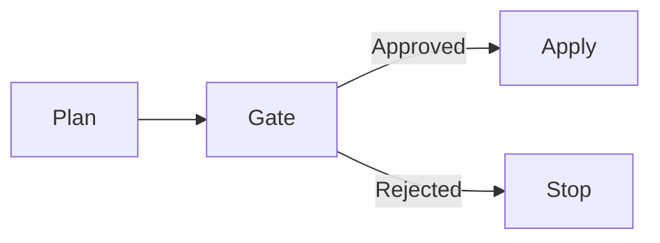
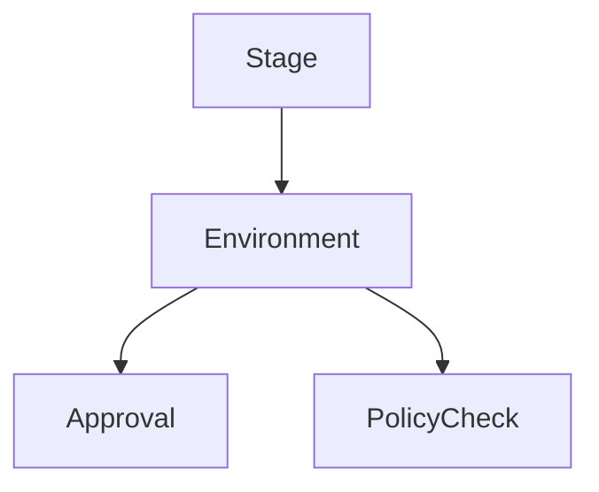
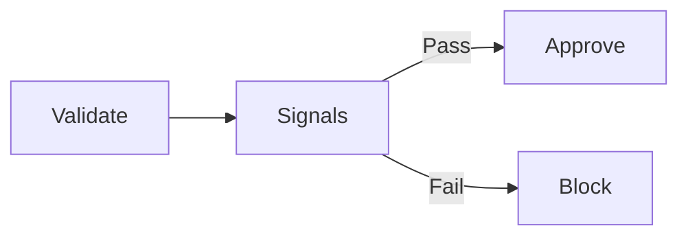

# Deployment Gates and Approvals in Azure Pipelines

**Author:** Randy Bordeaux  
**Version:** 1.0  
**Date:** 2026-01-22

---

## Executive Summary

This whitepaper defines **enterprise-grade patterns for deployment gates and approval workflows** in Azure CI/CD pipelines. It focuses on enforcing **controlled promotion, policy validation, and risk reduction** across multi-stage YAML pipelines using **Azure DevOps environments and checks**.

The guidance assumes Terraform as the authoritative infrastructure-as-code (IaC) mechanism and targets experienced Azure engineers operating production workloads in **Azure Commercial** environments. Gates and approvals are treated as **control-plane mechanisms**, not optional safeguards.

---

## Table of Contents

1. Scope and Control Objectives  
2. Deployment Gate Architecture  
3. Approval Models and Promotion Strategy  
4. Azure DevOps Environments and Checks  
5. Automated Gates and Signal-Based Controls  
6. Terraform-Specific Approval Patterns  
7. Security, Compliance, and Auditability  
8. Failure Handling and Exception Management  
9. Anti-Patterns and Common Misuse  
10. Tradeoffs and Design Limitations  

---

## Scope and Control Objectives

This document addresses:

- Preventing unauthorized or unsafe deployments  
- Enforcing separation of duties  
- Integrating automated validation with human approval  
- Ensuring auditable promotion to production  

Control objectives include:

- Explicit authorization for production changes  
- Policy and security validation before apply  
- Immutable audit trails for approvals  

---

## Deployment Gate Architecture

Deployment gates sit **between stages** and block promotion until required conditions are met.

Gates may be **manual**, **automated**, or **composite**. Production deployments should always use composite gates.

---

## Approval Models and Promotion Strategy

### Manual Approvals

Manual approvals are required when:

- Deploying to production  
- Modifying shared or regulated resources  
- Escalating permissions or network exposure  

Best practices:

- Named approvers (no broad groups)  
- Time-bound approvals  
- Justification required  

### Separation of Duties

- Authors cannot approve their own production deployments  
- Production approvers do not commit code  
- Identities are enforced via Entra ID groups  

---

## Azure DevOps Environments and Checks

Azure DevOps **Environments** provide first-class deployment control.

Capabilities used:

- Approval checks  
- Azure Policy checks  
- Branch control  
- Timeout enforcement  

Each environment maps to a **single Azure subscription and identity boundary**.

---

## Automated Gates and Signal-Based Controls

Automated gates validate external signals before deployment.

Examples:

- Azure Policy compliance results  
- Terraform plan diff analysis  
- Security scan results  
- Change management system integration  

Automated gates reduce human error and approval fatigue.

---

## Terraform-Specific Approval Patterns

Terraform introduces unique risks that gates must address.

Required controls:

- `terraform plan` reviewed before apply  
- Plan artifacts immutable and retained  
- Explicit confirmation of destructive changes  

Recommended pattern:

- Dev/Test: automated apply  
- Prod: plan review + manual approval  

No production apply should execute without a reviewed plan.

---

## Security, Compliance, and Auditability

### Audit Requirements

- All approvals logged with identity and timestamp  
- Gate outcomes retained with pipeline run history  
- Azure Activity Logs enabled for deployed resources  

### Compliance Alignment

Gate enforcement supports alignment with:

- NIST 800-171 change control objectives  
- SOC-style separation of duties  
- Internal risk management frameworks  

---

## Failure Handling and Exception Management

### Rejection Handling

- Rejections halt promotion immediately  
- No auto-retry of failed approvals  
- Code or configuration changes required to reattempt  

### Emergency Changes

Emergency paths must:

- Be explicitly documented  
- Use elevated approval workflows  
- Trigger post-deployment review  

Break-glass procedures are audited and time-bound.

---

## Anti-Patterns and Common Misuse

Avoid the following:

- Auto-approving production deployments  
- Shared approver groups without accountability  
- Approval logic embedded in YAML conditionals  
- Skipping gates for speed  

These patterns undermine control objectives.

---

## Tradeoffs and Design Limitations

### Tradeoffs

- Slower deployment velocity  
- Increased operational overhead  

### Benefits

- Reduced blast radius  
- Strong audit posture  
- Predictable and controlled releases  

---

## Conclusion

Deployment gates and approvals are **mandatory control mechanisms** in enterprise Azure environments. When correctly designed, they balance automation with accountability, enabling safe and auditable delivery at scale.

---

*End of Document*
