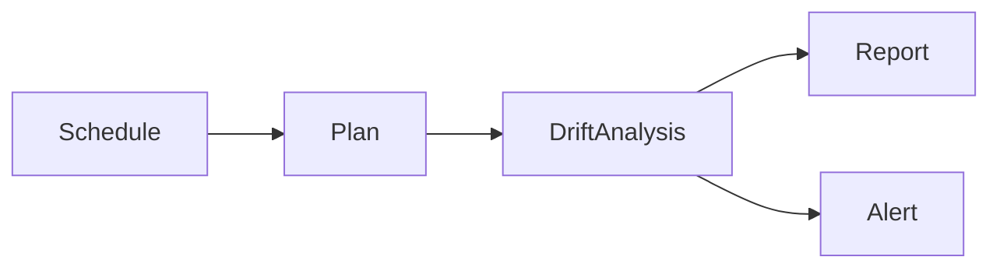
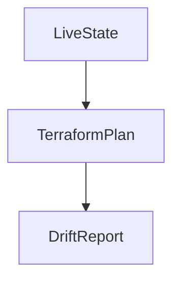
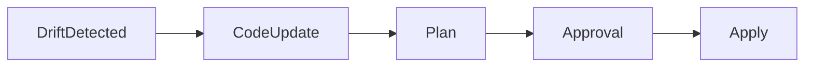

# Drift Detection and Remediation Strategies in Azure Terraform Pipelines

**Author:** Randy Bordeaux  
**Version:** 1.0  
**Date:** 2026-01-22  

---

## Executive Summary

This whitepaper defines **enterprise-grade strategies for detecting, analyzing, and remediating infrastructure drift** in Azure environments managed with Terraform. Drift is treated as an **expected operational condition**, not an anomaly, and must be continuously detected, assessed, and corrected through controlled pipelines.

The guidance targets experienced Azure engineers operating **Azure Commercial** environments at scale. Terraform remains the authoritative infrastructure-as-code (IaC) mechanism, and drift remediation is executed exclusively through CI/CD pipelines with embedded governance and security controls.

---

## Table of Contents

1. Scope and Drift Control Objectives  
2. Understanding Drift in Azure Environments  
3. Drift Detection Architecture  
4. Terraform-Based Drift Detection Pipelines  
5. Signal Analysis and Risk Classification  
6. Remediation Strategies and Promotion Controls  
7. Security, Compliance, and Auditability  
8. Operational Playbooks and Incident Handling  
9. Anti-Patterns and Common Failures  
10. Tradeoffs and Design Considerations  

---

## Scope and Drift Control Objectives

This document addresses:

- Continuous detection of infrastructure drift  
- Classification of drift by risk and intent  
- Controlled remediation using Terraform  
- Auditability of drift and corrective actions  

Control objectives include:

- Early detection before production impact  
- No out-of-band remediation  
- Explicit approval for production corrections  

---

## Understanding Drift in Azure Environments

Drift occurs when deployed resources diverge from declared Terraform state.

Common causes:

- Manual changes in the Azure Portal  
- Emergency break-glass operations  
- Platform-managed changes  
- Provider or API evolution  

Drift does **not** automatically imply misconfiguration, but it always requires investigation.

---

## Drift Detection Architecture

Drift detection is implemented as a **non-mutating control pipeline**.

Key characteristics:

- No `terraform apply`  
- Read-only permissions  
- Scheduled or event-driven execution  

---

## Terraform-Based Drift Detection Pipelines

### Detection Mechanism

- `terraform init` against live state  
- `terraform plan` without apply  
- Plan output parsed for changes  

Terraform plans are treated as **diagnostic artifacts**.

### Execution Frequency

- Dev/Test: daily or per-commit  
- Production: scheduled (e.g., nightly)  

---

## Signal Analysis and Risk Classification

Detected drift must be classified.

| Drift Type | Risk Level | Action |
|----------|-----------|--------|
| Tag changes | Low | Review |
| Scaling changes | Medium | Approval |
| Network / IAM changes | High | Immediate escalation |

Automated classification reduces noise and focuses human attention.

---

## Remediation Strategies and Promotion Controls

### Remediation Principles

- No direct portal fixes  
- Fix-forward via Terraform code  
- Same promotion and approval model as deployments  

### Production Controls

- Manual approval required  
- Plan diff reviewed explicitly  
- Emergency paths audited  

Drift remediation is treated as a **change event**, not maintenance.

---

## Security, Compliance, and Auditability

### Security Controls

- Read-only identities for detection  
- No state modification during detection  
- Secure storage of drift artifacts  

### Audit Requirements

- Drift reports retained  
- Remediation actions traceable  
- Identity and timestamp recorded  

Supports alignment with NIST 800-171 change control objectives.

---

## Operational Playbooks and Incident Handling

Recommended playbooks:

- Low-risk drift: batch remediation  
- High-risk drift: incident response  
- Unknown drift: freeze and investigate  

Drift involving IAM, networking, or encryption is escalated as a security incident.

---

## Anti-Patterns and Common Failures

Avoid:

- Auto-applying drift corrections  
- Ignoring persistent drift  
- Manual state edits  
- Disabling detection pipelines  

These practices erode trust in IaC.

---

## Tradeoffs and Design Considerations

### Tradeoffs

- Increased pipeline execution cost  
- Operational overhead  

### Benefits

- Early issue detection  
- Strong audit posture  
- Predictable infrastructure state  

---

## Conclusion

Drift detection and remediation are **continuous governance functions**. When implemented correctly, they preserve Terraform as the single source of truth while enabling safe, auditable correction of real-world changes in Azure environments.

---

*End of Document*
