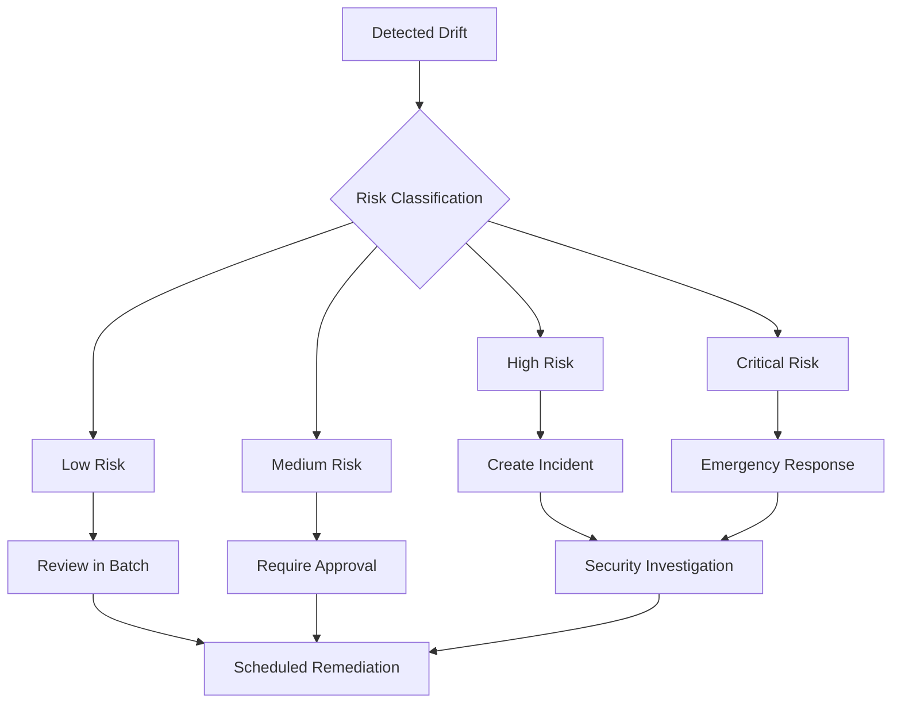
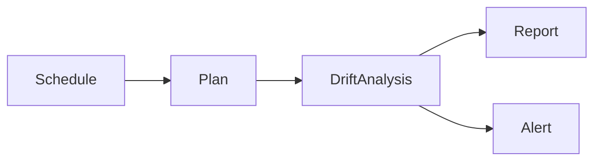
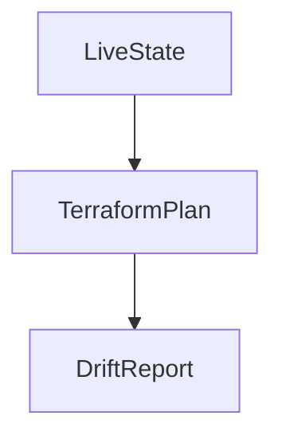
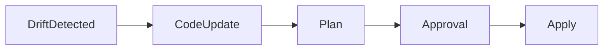
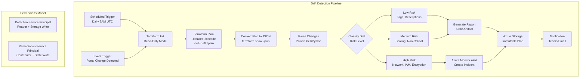
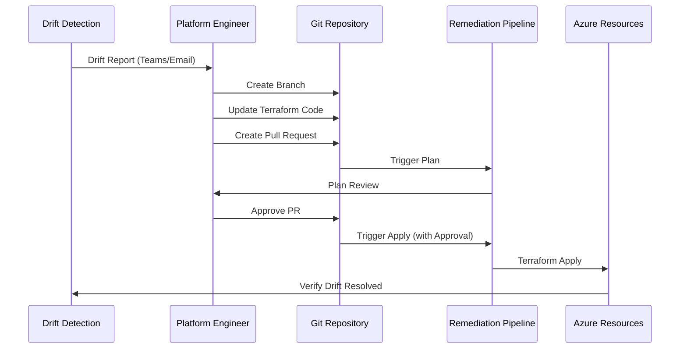

## Table of Contents

1. Scope and Drift Control Objectives  
2. Understanding Drift in Azure Environments  
3. Drift Detection Architecture  
4. Terraform-Based Drift Detection Pipelines  
5. Signal Analysis and Risk Classification  
6. Remediation Strategies and Promotion Controls  
7. Security, Compliance, and Auditability  
8. Operational Playbooks and Incident Handling  
## Scope and Drift Control Objectives

### Purpose and Scope

This document addresses infrastructure drift in Azure environments where Terraform is the authoritative source of truth. **Drift** is defined as any divergence between deployed Azure resources and their declared Terraform state.

**In Scope:**
- Continuous automated drift detection across all environments
- Risk-based classification of drift signals
- Controlled remediation through CI/CD pipelines
- Audit logging and compliance reporting
- Integration with incident management systems

**Out of Scope:**
- Manual Azure Portal corrections (explicitly prohibited)
- Drift in non-Terraform-managed resources
- Application-level configuration drift
- Kubernetes workload drift (covered separately)

### Control Objectives

| Objective | Description | Implementation |
## Understanding Drift in Azure Environments

### What Is Infrastructure Drift?

**Drift** occurs when the actual state of Azure resources diverges from the expected state declared in Terraform configuration files. This divergence can be detected by comparing `terraform plan` output against the current Terraform state and live Azure resources.

### Common Drift Causes

| Cause | Frequency | Risk Level | Example |
|-------|-----------|------------|---------|
| **Manual Portal Changes** | High | High | Developer adds NSG rule via Portal |
| **Emergency Break-Glass Operations** | Low | Critical | Security team blocks IP during incident |
| **Azure Platform Updates** | Medium | Low | Azure adds default tags to resources |
| **Terraform Provider Evolution** | Low | Medium | Provider updates default values |
| **Auto-Scaling Events** | High | Low | VMSS scales up/down based on metrics |
| **Azure Policy Remediation** | Medium | Medium | Policy adds required tags automatically |
| **Backup Service Changes** | Medium | Low | Azure Backup modifies retention policies |
| **Managed Identity Assignments** | Low | High | Application adds role assignments |

### Drift Does Not Imply Misconfiguration

**Critical Distinction:** Not all drift is bad. Some drift is:
- **Expected**: Auto-scaling, platform-managed updates
- **Authorized**: Emergency break-glass with proper documentation
- **Harmless**: Cosmetic changes like tag formatting

**All drift requires investigation** to determine intent, risk, and appropriate response.

### Drift Impact Categories


- **ISO 27001 A.12.1.2**: "Change management ensures changes are implemented in a controlled manner"
Control objectives include:

- Early detection before production impact  
- No out-of-band remediation  
- Explicit approval for production corrections  

---

## Understanding Drift in Azure Environments

Drift occurs when deployed resources diverge from declared Terraform state.

Common causes:

- Manual changes in the Azure Portal  
- Emergency break-glass operations  
- Platform-managed changes  
- Provider or API evolution  

Drift does **not** automatically imply misconfiguration, but it always requires investigation.

---

## Drift Detection Architecture

Drift detection is implemented as a **non-mutating control pipeline**.



Key characteristics:

- No `terraform apply`  
- Read-only permissions  
- Scheduled or event-driven execution  

---

## Terraform-Based Drift Detection Pipelines

### Detection Mechanism

- `terraform init` against live state  
- `terraform plan` without apply  
- Plan output parsed for changes  

Terraform plans are treated as **diagnostic artifacts**.



### Execution Frequency

- Dev/Test: daily or per-commit  
- Production: scheduled (e.g., nightly)  

---

## Signal Analysis and Risk Classification

Detected drift must be classified.

| Drift Type | Risk Level | Action |
|----------|-----------|--------|
| Tag changes | Low | Review |
| Scaling changes | Medium | Approval |
| Network / IAM changes | High | Immediate escalation |

Automated classification reduces noise and focuses human attention.

---

## Remediation Strategies and Promotion Controls

### Remediation Principles

- No direct portal fixes  
- Fix-forward via Terraform code  
- Same promotion and approval model as deployments  



### Production Controls

- Manual approval required  
- Plan diff reviewed explicitly  
- Emergency paths audited  

Drift remediation is treated as a **change event**, not maintenance.

---

## Security, Compliance, and Auditability

### Security Controls

- Read-only identities for detection  
- No state modification during detection  
- Secure storage of drift artifacts  

### Audit Requirements

- Drift reports retained  
- Remediation actions traceable  
- Identity and timestamp recorded  

Supports alignment with NIST 800-171 change control objectives.

---

## Operational Playbooks and Incident Handling

Recommended playbooks:

- Low-risk drift: batch remediation  
- High-risk drift: incident response  
- Unknown drift: freeze and investigate  

Drift involving IAM, networking, or encryption is escalated as a security incident.

---

## Anti-Patterns and Common Failures

Avoid:

- Auto-applying drift corrections  
- Ignoring persistent drift  
- Manual state edits  
- Disabling detection pipelines  

These practices erode trust in IaC.

---

## Tradeoffs and Design Considerations

### Tradeoffs

- Increased pipeline execution cost  
- Operational overhead  

### Benefits

- Early issue detection  
- Strong audit posture  
- Predictable infrastructure state  

---

## Conclusion

Drift detection and remediation are **continuous governance functions**. When implemented correctly, they preserve Terraform as the single source of truth while enabling safe, auditable correction of real-world changes in Azure environments.

---

*End of Document*

---

## Drift Detection Architecture

### Detection Pipeline Architecture

Drift detection is implemented as a **non-mutating control pipeline** that runs independently from deployment pipelines.



**Key Architectural Principles:**

1. **Read-Only Execution**: Detection pipeline has no write permissions to Azure resources
2. **State Isolation**: Detection uses read-only state backend access
3. **Artifact Preservation**: All drift plans stored as immutable artifacts
4. **Separate Identity**: Detection and remediation use different service principals
5. **No Auto-Remediation**: Human approval always required for production

### Service Principal Configuration

```hcl
# Terraform - Configure detection service principal
resource "azuread_application" "drift_detection" {
  display_name = "terraform-drift-detection"
  owners       = [data.azuread_client_config.current.object_id]
}

resource "azuread_service_principal" "drift_detection" {
  client_id = azuread_application.drift_detection.client_id
  owners    = [data.azuread_client_config.current.object_id]
}

resource "azuread_application_password" "drift_detection" {
  application_id = azuread_application.drift_detection.id
  display_name   = "Drift Detection Pipeline"
  end_date       = timeadd(timestamp(), "8760h")  # 1 year
}

# Read-only access to Azure resources
resource "azurerm_role_assignment" "drift_detection_reader" {
  scope                = data.azurerm_subscription.primary.id
  role_definition_name = "Reader"
  principal_id         = azuread_service_principal.drift_detection.object_id
}

# Write access to drift report storage
resource "azurerm_role_assignment" "drift_detection_storage" {
  scope                = azurerm_storage_account.drift_reports.id
  role_definition_name = "Storage Blob Data Contributor"
  principal_id         = azuread_service_principal.drift_detection.object_id
}

# Read-only access to Terraform state
resource "azurerm_role_assignment" "drift_detection_state" {
  scope                = azurerm_storage_account.tfstate.id
  role_definition_name = "Storage Blob Data Reader"
  principal_id         = azuread_service_principal.drift_detection.object_id
}
```

---

## Terraform-Based Drift Detection Pipelines

### Azure DevOps Drift Detection Pipeline

```yaml
# azure-pipelines-drift-detection.yml
name: Drift Detection - $(Date:yyyyMMdd)$(Rev:.r)

trigger: none  # No CI/CD trigger

schedules:
- cron: "0 2 * * *"  # Daily at 2AM UTC
  displayName: Daily Drift Detection
  branches:
    include:
    - main
  always: true  # Run even if no code changes

variables:
  terraformVersion: '1.7.0'
  workingDirectory: '$(System.DefaultWorkingDirectory)/terraform'

stages:
- stage: DriftDetection
  displayName: 'Detect Infrastructure Drift'
  jobs:
  - job: DetectDrift
    displayName: 'Run Terraform Plan and Analyze'
    pool:
      vmImage: 'ubuntu-latest'
    
    steps:
    # Checkout code
    - checkout: self
      displayName: 'Checkout Terraform Code'
    
    # Install Terraform
    - task: TerraformInstaller@1
      displayName: 'Install Terraform $(terraformVersion)'
      inputs:
        terraformVersion: '$(terraformVersion)'
    
    # Azure authentication (read-only SP)
    - task: AzureCLI@2
      displayName: 'Authenticate to Azure'
      inputs:
        azureSubscription: 'drift-detection-readonly'
        scriptType: 'bash'
        scriptLocation: 'inlineScript'
        addSpnToEnvironment: true
        inlineScript: |
          echo "##vso[task.setvariable variable=ARM_CLIENT_ID]$servicePrincipalId"
          echo "##vso[task.setvariable variable=ARM_CLIENT_SECRET;issecret=true]$servicePrincipalKey"
          echo "##vso[task.setvariable variable=ARM_TENANT_ID]$tenantId"
          echo "##vso[task.setvariable variable=ARM_SUBSCRIPTION_ID]$(az account show --query id -o tsv)"
    
    # Terraform init
    - script: |
        cd $(workingDirectory)
        terraform init -backend=true -lock=false
      displayName: 'Terraform Init (Read-Only)'
      env:
        ARM_CLIENT_ID: $(ARM_CLIENT_ID)
        ARM_CLIENT_SECRET: $(ARM_CLIENT_SECRET)
        ARM_TENANT_ID: $(ARM_TENANT_ID)
        ARM_SUBSCRIPTION_ID: $(ARM_SUBSCRIPTION_ID)
    
    # Terraform plan with drift detection
    - script: |
        cd $(workingDirectory)
        
        # Run terraform plan with detailed exit code
        # Exit code 0 = no changes, 1 = error, 2 = changes detected
        set +e
        terraform plan -detailed-exitcode -out=drift.tfplan -no-color
        PLAN_EXIT_CODE=$?
        set -e
        
        echo "##vso[task.setvariable variable=PLAN_EXIT_CODE]$PLAN_EXIT_CODE"
        
        if [ $PLAN_EXIT_CODE -eq 0 ]; then
          echo "No drift detected"
        elif [ $PLAN_EXIT_CODE -eq 2 ]; then
          echo "##vso[task.logissue type=warning]Drift detected - changes found"
          echo "##vso[task.setvariable variable=DRIFT_DETECTED]true"
        else
          echo "##vso[task.logissue type=error]Terraform plan failed"
          exit 1
        fi
      displayName: 'Terraform Plan - Drift Detection'
      env:
        ARM_CLIENT_ID: $(ARM_CLIENT_ID)
        ARM_CLIENT_SECRET: $(ARM_CLIENT_SECRET)
        ARM_TENANT_ID: $(ARM_TENANT_ID)
        ARM_SUBSCRIPTION_ID: $(ARM_SUBSCRIPTION_ID)
    
    # Convert plan to JSON
    - script: |
        cd $(workingDirectory)
        if [ "$(DRIFT_DETECTED)" == "true" ]; then
          terraform show -json drift.tfplan > drift.json
          echo "Plan converted to JSON for analysis"
        fi
      displayName: 'Convert Plan to JSON'
      condition: eq(variables['DRIFT_DETECTED'], 'true')
    
    # Analyze drift and classify risk
    - task: PowerShell@2
      displayName: 'Analyze Drift and Classify Risk'
      condition: eq(variables['DRIFT_DETECTED'], 'true')
      inputs:
        targetType: 'inline'
        workingDirectory: '$(workingDirectory)'
        script: |
          $driftJson = Get-Content drift.json | ConvertFrom-Json
          
          $lowRisk = @()
          $mediumRisk = @()
          $highRisk = @()
          $criticalRisk = @()
          
          foreach ($change in $driftJson.resource_changes) {
              if ($change.change.actions -contains "no-op") { continue }
              
              $resource = @{
                  Type = $change.type
                  Name = $change.name
                  Address = $change.address
                  Actions = $change.change.actions -join ", "
              }
              
              # High-risk resources (security-sensitive)
              if ($change.type -match "azurerm_network_security_|azurerm_role_assignment|azurerm_key_vault|azurerm_firewall") {
                  $criticalRisk += $resource
              }
              # Medium-risk resources (scaling, performance)
              elseif ($change.type -match "azurerm_virtual_machine|azurerm_app_service|azurerm_kubernetes") {
                  $mediumRisk += $resource
              }
              # Low-risk resources (tags, non-functional)
              else {
                  $lowRisk += $resource
              }
          }
          
          # Generate report
          $report = @{
              Timestamp = (Get-Date).ToUniversalTime().ToString("yyyy-MM-ddTHH:mm:ssZ")
              BuildNumber = "$(Build.BuildNumber)"
              TotalChanges = $lowRisk.Count + $mediumRisk.Count + $highRisk.Count + $criticalRisk.Count
              LowRisk = $lowRisk
              MediumRisk = $mediumRisk
              HighRisk = $highRisk
              CriticalRisk = $criticalRisk
          }
          
          $report | ConvertTo-Json -Depth 10 | Out-File drift-report.json
          
          # Set pipeline variables
          Write-Host "##vso[task.setvariable variable=CRITICAL_COUNT]$($criticalRisk.Count)"
          Write-Host "##vso[task.setvariable variable=HIGH_COUNT]$($highRisk.Count)"
          Write-Host "##vso[task.setvariable variable=MEDIUM_COUNT]$($mediumRisk.Count)"
          Write-Host "##vso[task.setvariable variable=LOW_COUNT]$($lowRisk.Count)"
          
          Write-Host "Drift Classification:"
          Write-Host "  Critical: $($criticalRisk.Count)"
          Write-Host "  High: $($highRisk.Count)"
          Write-Host "  Medium: $($mediumRisk.Count)"
          Write-Host "  Low: $($lowRisk.Count)"
    
    # Publish drift artifacts
    - task: PublishPipelineArtifact@1
      displayName: 'Publish Drift Artifacts'
      condition: eq(variables['DRIFT_DETECTED'], 'true')
      inputs:
        targetPath: '$(workingDirectory)'
        artifact: 'drift-detection-$(Build.BuildNumber)'
        publishLocation: 'pipeline'
    
    # Upload to Azure Storage (immutable)
    - task: AzureCLI@2
      displayName: 'Upload Drift Report to Storage'
      condition: eq(variables['DRIFT_DETECTED'], 'true')
      inputs:
        azureSubscription: 'drift-detection-readonly'
        scriptType: 'bash'
        scriptLocation: 'inlineScript'
        inlineScript: |
          TIMESTAMP=$(date -u +%Y%m%d-%H%M%S)
          CONTAINER="drift-reports"
          BLOB_NAME="drift-${TIMESTAMP}-$(Build.BuildNumber).json"
          
          az storage blob upload \
            --account-name driftstorageacct \
            --container-name $CONTAINER \
            --name $BLOB_NAME \
            --file $(workingDirectory)/drift-report.json \
            --auth-mode login
          
          echo "Drift report uploaded to: $BLOB_NAME"
    
    # Create Azure Monitor alert for critical drift
    - task: AzureCLI@2
      displayName: 'Create Azure Monitor Alert'
      condition: and(succeeded(), gt(variables['CRITICAL_COUNT'], 0))
      inputs:
        azureSubscription: 'monitoring-service-connection'
        scriptType: 'bash'
        scriptLocation: 'inlineScript'
        inlineScript: |
          # Log custom metric to Azure Monitor
          az monitor metrics emit \
            --resource-group rg-monitoring \
            --resource tfstate-monitor \
            --namespace "Terraform/Drift" \
            --metric-name "CriticalDriftDetected" \
            --value $(CRITICAL_COUNT) \
            --dimension Environment=Production
          
          echo "##vso[task.logissue type=error]Critical drift detected: $(CRITICAL_COUNT) resources"
    
    # Notify team via Teams webhook
    - task: PowerShell@2
      displayName: 'Notify Teams Channel'
      condition: eq(variables['DRIFT_DETECTED'], 'true')
      inputs:
        targetType: 'inline'
        script: |
          $webhookUrl = "$(TEAMS_WEBHOOK_URL)"
          
          $color = "0078D4"  # Blue
          if ([int]$(CRITICAL_COUNT) -gt 0) { $color = "D13438" }  # Red
          elseif ([int]$(HIGH_COUNT) -gt 0) { $color = "FF8C00" }  # Orange
          
          $message = @{
              themeColor = $color
              title = "Infrastructure Drift Detected"
              text = "Environment: Production`nBuild: $(Build.BuildNumber)"
              sections = @(
                  @{
                      facts = @(
                          @{ name = "Critical"; value = "$(CRITICAL_COUNT)" }
                          @{ name = "High"; value = "$(HIGH_COUNT)" }
                          @{ name = "Medium"; value = "$(MEDIUM_COUNT)" }
                          @{ name = "Low"; value = "$(LOW_COUNT)" }
                      )
                  }
              )
              potentialAction = @(
                  @{
                      "@type" = "OpenUri"
                      name = "View Pipeline"
                      targets = @(
                          @{ os = "default"; uri = "$(System.TeamFoundationCollectionUri)$(System.TeamProject)/_build/results?buildId=$(Build.BuildId)" }
                      )
                  }
              )
          }
          
          Invoke-RestMethod -Uri $webhookUrl -Method Post -Body ($message | ConvertTo-Json -Depth 10) -ContentType "application/json"
```

---

## Signal Analysis and Risk Classification

### Automated Risk Scoring

Drift signals are automatically classified based on resource type, change type, and impact scope.

**Risk Classification Matrix:**

| Resource Type | Change Type | Risk Level | Approval Required | Response Time |
|---------------|-------------|------------|-------------------|---------------|
| NSG Rules | Create/Delete | Critical | VP + Security | Immediate |
| Role Assignments | Any | Critical | Security Team | < 2 hours |
| Key Vault Policies | Any | Critical | Security + Compliance | < 4 hours |
| Firewall Rules | Any | Critical | Network + Security | Immediate |
| VM SKU Changes | Update | Medium | Team Lead | < 24 hours |
| App Service Plans | Scale | Medium | Team Lead | < 24 hours |
| Storage Account | Configuration | Medium | Ops Team | < 48 hours |
| Resource Tags | Any | Low | Batch Review | Weekly |
| Resource Descriptions | Any | Low | Batch Review | Weekly |

### Drift Analysis Script

```powershell
# PowerShell - Comprehensive drift analysis
function Analyze-TerraformDrift {
    param(
        [Parameter(Mandatory=$true)]
        [string]$DriftJsonPath
    )
    
    $drift = Get-Content $DriftJsonPath | ConvertFrom-Json
    
    # Initialize counters
    $analysis = @{
        TotalResources = 0
        ChangedResources = 0
        CreatedResources = 0
        UpdatedResources = 0
        DeletedResources = 0
        ReplacedResources = 0
        RiskBreakdown = @{
            Critical = @()
            High = @()
            Medium = @()
            Low = @()
        }
    }
    
    # High-risk resource patterns
    $criticalPatterns = @(
        'azurerm_network_security_group',
        'azurerm_network_security_rule',
        'azurerm_role_assignment',
        'azurerm_role_definition',
        'azurerm_key_vault_access_policy',
        'azurerm_firewall',
        'azurerm_firewall_policy',
        'azurerm_private_endpoint'
    )
    
    $mediumPatterns = @(
        'azurerm_virtual_machine',
        'azurerm_linux_virtual_machine',
        'azurerm_windows_virtual_machine',
        'azurerm_kubernetes_cluster',
        'azurerm_app_service',
        'azurerm_function_app',
        'azurerm_sql_database'
    )
    
    foreach ($change in $drift.resource_changes) {
        $actions = $change.change.actions
        
        # Skip no-op changes
        if ($actions -contains 'no-op') { continue }
        
        $analysis.TotalResources++
        
        # Count by action type
        if ($actions -contains 'create') { $analysis.CreatedResources++ }
        if ($actions -contains 'update') { $analysis.UpdatedResources++ }
        if ($actions -contains 'delete') { $analysis.DeletedResources++ }
        if ($actions -contains 'create' -and $actions -contains 'delete') { 
            $analysis.ReplacedResources++ 
        }
        
        # Build change object
        $changeDetail = @{
            Address = $change.address
            Type = $change.type
            Name = $change.name
            Actions = $actions -join ', '
            Before = $change.change.before
            After = $change.change.after
        }
        
        # Classify risk
        $isCritical = $criticalPatterns | Where-Object { $change.type -match $_ }
        $isMedium = $mediumPatterns | Where-Object { $change.type -match $_ }
        
        if ($isCritical) {
            $analysis.RiskBreakdown.Critical += $changeDetail
        }
        elseif ($isMedium) {
            $analysis.RiskBreakdown.Medium += $changeDetail
        }
        else {
            $analysis.RiskBreakdown.Low += $changeDetail
        }
    }
    
    # Generate summary
    Write-Host "=== Drift Analysis Summary ===" -ForegroundColor Cyan
    Write-Host "Total Resources Changed: $($analysis.TotalResources)"
    Write-Host "  Created: $($analysis.CreatedResources)"
    Write-Host "  Updated: $($analysis.UpdatedResources)"
    Write-Host "  Deleted: $($analysis.DeletedResources)"
    Write-Host "  Replaced: $($analysis.ReplacedResources)"
    Write-Host ""
    Write-Host "Risk Breakdown:" -ForegroundColor Yellow
    Write-Host "  Critical: $($analysis.RiskBreakdown.Critical.Count)" -ForegroundColor Red
    Write-Host "  High: $($analysis.RiskBreakdown.High.Count)" -ForegroundColor DarkYellow
    Write-Host "  Medium: $($analysis.RiskBreakdown.Medium.Count)" -ForegroundColor Yellow
    Write-Host "  Low: $($analysis.RiskBreakdown.Low.Count)" -ForegroundColor Green
    
    return $analysis
}

# Usage
$analysis = Analyze-TerraformDrift -DriftJsonPath "drift.json"
$analysis | ConvertTo-Json -Depth 10 | Out-File "drift-analysis.json"
```

---

## Automated Drift Analysis and Parsing

### Python Drift Parser

```python
#!/usr/bin/env python3
"""
Terraform Drift Analysis Tool
Parses terraform plan JSON output and classifies drift by risk level
"""

import json
import sys
from datetime import datetime
from typing import Dict, List, Any

class DriftAnalyzer:
    def __init__(self, plan_json_path: str):
        with open(plan_json_path, 'r') as f:
            self.plan = json.load(f)
        
        self.critical_resources = [
            'azurerm_network_security_group',
            'azurerm_network_security_rule',
            'azurerm_role_assignment',
            'azurerm_key_vault_access_policy',
            'azurerm_firewall',
            'azurerm_private_endpoint'
        ]
        
        self.high_resources = [
            'azurerm_virtual_network',
            'azurerm_subnet',
            'azurerm_storage_account',
            'azurerm_key_vault'
        ]
        
        self.medium_resources = [
            'azurerm_virtual_machine',
            'azurerm_app_service',
            'azurerm_kubernetes_cluster',
            'azurerm_sql_database'
        ]
    
    def analyze(self) -> Dict[str, Any]:
        """Analyze drift and classify by risk level"""
        
        results = {
            'timestamp': datetime.utcnow().isoformat(),
            'total_changes': 0,
            'critical': [],
            'high': [],
            'medium': [],
            'low': [],
            'statistics': {
                'creates': 0,
                'updates': 0,
                'deletes': 0,
                'replaces': 0
            }
        }
        
        resource_changes = self.plan.get('resource_changes', [])
        
        for change in resource_changes:
            actions = change['change']['actions']
            
            # Skip no-op
            if actions == ['no-op']:
                continue
            
            results['total_changes'] += 1
            
            # Count action types
            if 'create' in actions:
                results['statistics']['creates'] += 1
            if 'update' in actions:
                results['statistics']['updates'] += 1
            if 'delete' in actions:
                results['statistics']['deletes'] += 1
            if 'create' in actions and 'delete' in actions:
                results['statistics']['replaces'] += 1
            
            # Build change detail
            detail = {
                'address': change['address'],
                'type': change['type'],
                'name': change['name'],
                'actions': actions,
                'provider': change.get('provider_name', 'unknown')
            }
            
            # Classify risk
            resource_type = change['type']
            
            if any(pattern in resource_type for pattern in self.critical_resources):
                results['critical'].append(detail)
            elif any(pattern in resource_type for pattern in self.high_resources):
                results['high'].append(detail)
            elif any(pattern in resource_type for pattern in self.medium_resources):
                results['medium'].append(detail)
            else:
                results['low'].append(detail)
        
        return results
    
    def generate_report(self) -> str:
        """Generate human-readable report"""
        
        analysis = self.analyze()
        
        report = []
        report.append("=" * 60)
        report.append("TERRAFORM DRIFT DETECTION REPORT")
        report.append("=" * 60)
        report.append(f"Timestamp: {analysis['timestamp']}")
        report.append(f"Total Changes Detected: {analysis['total_changes']}")
        report.append("")
        report.append("STATISTICS:")
        report.append(f"  Creates:  {analysis['statistics']['creates']}")
        report.append(f"  Updates:  {analysis['statistics']['updates']}")
        report.append(f"  Deletes:  {analysis['statistics']['deletes']}")
        report.append(f"  Replaces: {analysis['statistics']['replaces']}")
        report.append("")
        report.append("RISK CLASSIFICATION:")
        report.append(f"  🔴 Critical: {len(analysis['critical'])}")
        report.append(f"  🟠 High:     {len(analysis['high'])}")
        report.append(f"  🟡 Medium:   {len(analysis['medium'])}")
        report.append(f"  🟢 Low:      {len(analysis['low'])}")
        report.append("")
        
        # Critical details
        if analysis['critical']:
            report.append("CRITICAL DRIFT (Immediate Action Required):")
            report.append("-" * 60)
            for item in analysis['critical']:
                report.append(f"  • {item['address']}")
                report.append(f"    Type: {item['type']}")
                report.append(f"    Actions: {', '.join(item['actions'])}")
                report.append("")
        
        # High details
        if analysis['high']:
            report.append("HIGH RISK DRIFT (Review Required):")
            report.append("-" * 60)
            for item in analysis['high']:
                report.append(f"  • {item['address']}")
                report.append(f"    Actions: {', '.join(item['actions'])}")
                report.append("")
        
        report.append("=" * 60)
        return "\n".join(report)

# Usage
if __name__ == "__main__":
    if len(sys.argv) < 2:
        print("Usage: drift_analyzer.py <plan.json>")
        sys.exit(1)
    
    analyzer = DriftAnalyzer(sys.argv[1])
    
    # Generate report
    report = analyzer.generate_report()
    print(report)
    
    # Save JSON analysis
    analysis = analyzer.analyze()
    with open('drift-analysis.json', 'w') as f:
        json.dump(analysis, f, indent=2)
    
    # Exit with error code if critical drift detected
    if analysis['critical']:
        sys.exit(2)
    elif analysis['high']:
        sys.exit(1)
    else:
        sys.exit(0)
```


---

## Remediation Strategies and Promotion Controls

### Remediation Principles

**Core Principle**: All drift remediation must flow through Terraform code changes and standard CI/CD pipelines. Direct Portal corrections are prohibited.



### Remediation Workflow

```yaml
# azure-pipelines-drift-remediation.yml
name: Drift Remediation - $(Date:yyyyMMdd)$(Rev:.r)

trigger:
  branches:
    include:
    - main
  paths:
    include:
    - terraform/**

variables:
  terraformVersion: '1.7.0'
  workingDirectory: '$(System.DefaultWorkingDirectory)/terraform'

stages:
- stage: Plan
  displayName: 'Terraform Plan'
  jobs:
  - job: TerraformPlan
    pool:
      vmImage: 'ubuntu-latest'
    steps:
    - checkout: self
    
    - task: TerraformInstaller@1
      inputs:
        terraformVersion: '$(terraformVersion)'
    
    - task: AzureCLI@2
      displayName: 'Terraform Init & Plan'
      inputs:
        azureSubscription: 'terraform-service-connection'
        scriptType: 'bash'
        scriptLocation: 'inlineScript'
        addSpnToEnvironment: true
        inlineScript: |
          cd $(workingDirectory)
          
          export ARM_CLIENT_ID=$servicePrincipalId
          export ARM_CLIENT_SECRET=$servicePrincipalKey
          export ARM_TENANT_ID=$tenantId
          export ARM_SUBSCRIPTION_ID=$(az account show --query id -o tsv)
          
          terraform init
          terraform plan -out=remediation.tfplan
          terraform show -json remediation.tfplan > remediation.json
    
    - task: PublishPipelineArtifact@1
      inputs:
        targetPath: '$(workingDirectory)'
        artifact: 'terraform-plan'

- stage: ApproveRemediation
  displayName: 'Approve Drift Remediation'
  dependsOn: Plan
  jobs:
  - deployment: ApproveRemediationJob
    displayName: 'Manual Approval Gate'
    environment: 'production-drift-remediation'
    strategy:
      runOnce:
        deploy:
          steps:
          - download: current
            artifact: 'terraform-plan'
          
          - task: PowerShell@2
            displayName: 'Display Remediation Plan'
            inputs:
              targetType: 'inline'
              script: |
                Write-Host "=== DRIFT REMEDIATION PLAN ===" -ForegroundColor Cyan
                Write-Host ""
                Write-Host "Review the terraform plan artifact before approving."
                Write-Host ""
                Write-Host "Approval checklist:" -ForegroundColor Yellow
                Write-Host "  [ ] Plan reviewed and understood"
                Write-Host "  [ ] Changes align with drift report"
                Write-Host "  [ ] No unintended resource deletions"
                Write-Host "  [ ] Rollback plan documented"
                Write-Host "  [ ] Change ticket created: ___________"

- stage: Apply
  displayName: 'Apply Remediation'
  dependsOn: ApproveRemediation
  condition: succeeded()
  jobs:
  - job: TerraformApply
    pool:
      vmImage: 'ubuntu-latest'
    steps:
    - download: current
      artifact: 'terraform-plan'
    
    - task: TerraformInstaller@1
      inputs:
        terraformVersion: '$(terraformVersion)'
    
    - task: AzureCLI@2
      displayName: 'Terraform Apply'
      inputs:
        azureSubscription: 'terraform-service-connection'
        scriptType: 'bash'
        scriptLocation: 'inlineScript'
        addSpnToEnvironment: true
        inlineScript: |
          cd $(Pipeline.Workspace)/terraform-plan
          
          export ARM_CLIENT_ID=$servicePrincipalId
          export ARM_CLIENT_SECRET=$servicePrincipalKey
          export ARM_TENANT_ID=$tenantId
          export ARM_SUBSCRIPTION_ID=$(az account show --query id -o tsv)
          
          terraform init
          terraform apply -auto-approve remediation.tfplan
          
          echo "Drift remediation completed successfully"
    
    - task: AzureCLI@2
      displayName: 'Log Remediation to Audit Storage'
      inputs:
        azureSubscription: 'monitoring-service-connection'
        scriptType: 'bash'
        scriptLocation: 'inlineScript'
        inlineScript: |
          TIMESTAMP=$(date -u +%Y%m%d-%H%M%S)
          
          # Create audit record
          cat > remediation-audit.json << EOF
          {
            "timestamp": "$TIMESTAMP",
            "buildNumber": "$(Build.BuildNumber)",
            "approver": "$(Build.RequestedFor)",
            "type": "drift-remediation",
            "status": "completed"
          }
          EOF
          
          # Upload to audit storage
          az storage blob upload \
            --account-name auditstorageacct \
            --container-name remediation-logs \
            --name "remediation-${TIMESTAMP}.json" \
            --file remediation-audit.json \
            --auth-mode login
```

### Emergency Drift Remediation

For critical security incidents requiring immediate correction:

```yaml
# Emergency remediation with elevated approval
parameters:
- name: emergencyRemediation
  displayName: 'Emergency Remediation (requires VP approval)'
  type: boolean
  default: false

- name: incidentTicket
  displayName: 'Incident Ticket Number'
  type: string
  default: ''

stages:
- stage: EmergencyApproval
  condition: eq('${{ parameters.emergencyRemediation }}', true)
  jobs:
  - deployment: EmergencyApprove
    environment: 'production-emergency'
    strategy:
      runOnce:
        preDeploy:
          steps:
          - script: |
              if [ -z "${{ parameters.incidentTicket }}" ]; then
                echo "##vso[task.logissue type=error]Incident ticket required for emergency remediation"
                exit 1
              fi
              
              echo "Emergency remediation authorized"
              echo "Incident: ${{ parameters.incidentTicket }}"
              echo "##vso[build.addbuildtag]emergency-remediation"
        
        deploy:
          steps:
          - task: TerraformInstaller@1
            inputs:
              terraformVersion: '1.7.0'
          
          - task: AzureCLI@2
            displayName: 'Emergency Terraform Apply'
            inputs:
              azureSubscription: 'terraform-service-connection'
              scriptType: 'bash'
              scriptLocation: 'inlineScript'
              addSpnToEnvironment: true
              inlineScript: |
                export ARM_CLIENT_ID=$servicePrincipalId
                export ARM_CLIENT_SECRET=$servicePrincipalKey
                export ARM_TENANT_ID=$tenantId
                export ARM_SUBSCRIPTION_ID=$(az account show --query id -o tsv)
                
                terraform init
                terraform apply -auto-approve
        
        postRouting:
          steps:
          - task: AzureCLI@2
            displayName: 'Schedule Post-Remediation Review'
            inputs:
              azureSubscription: 'monitoring-service-connection'
              scriptType: 'bash'
              scriptLocation: 'inlineScript'
              inlineScript: |
                # Create follow-up work item
                az boards work-item create \
                  --type "Task" \
                  --title "Post-Emergency Remediation Review - ${{ parameters.incidentTicket }}" \
                  --description "Review emergency drift remediation and update procedures" \
                  --assigned-to "ops-manager@company.com"
```

---

## State Management and Backend Configuration

### Terraform Backend Configuration

```hcl
# Terraform backend with state locking for drift detection
terraform {
  backend "azurerm" {
    resource_group_name  = "rg-terraform-state"
    storage_account_name = "tfstatestorage"
    container_name       = "tfstate"
    key                  = "production.terraform.tfstate"
    
    # State locking prevents concurrent modifications
    use_azuread_auth = true
    
    # Snapshot isolation for drift detection
    snapshot = false
  }
  
  required_providers {
    azurerm = {
      source  = "hashicorp/azurerm"
      version = "~> 3.80"
    }
  }
}

# Storage account for Terraform state
resource "azurerm_storage_account" "tfstate" {
  name                     = "tfstatestorage"
  resource_group_name      = azurerm_resource_group.tfstate.name
  location                 = "eastus2"
  account_tier             = "Standard"
  account_replication_type = "GRS"
  
  # Versioning for state history
  blob_properties {
    versioning_enabled = true
    
    delete_retention_policy {
      days = 30
    }
  }
  
  # Immutable storage for compliance
  immutability_policy {
    allow_protected_append_writes = true
    state                         = "Unlocked"
    period_since_creation_in_days = 7
  }
  
  # Network isolation
  network_rules {
    default_action = "Deny"
    ip_rules       = ["40.71.11.0/24"]  # Azure DevOps IP range
    bypass         = ["AzureServices"]
  }
  
  tags = {
    Purpose = "Terraform State Backend"
    ManagedBy = "Terraform"
  }
}

# Separate storage for drift reports
resource "azurerm_storage_account" "drift_reports" {
  name                     = "driftstorageacct"
  resource_group_name      = azurerm_resource_group.tfstate.name
  location                 = "eastus2"
  account_tier             = "Standard"
  account_replication_type = "GRS"
  
  blob_properties {
    versioning_enabled = true
    
    # Immutable blobs prevent tampering
    immutability_policy {
      allow_protected_append_writes = false
      state                         = "Locked"
      period_since_creation_in_days = 365  # 1 year retention
    }
  }
  
  tags = {
    Purpose = "Drift Detection Reports"
    Compliance = "Immutable Audit Trail"
  }
}

# Container for drift reports
resource "azurerm_storage_container" "drift_reports" {
  name                  = "drift-reports"
  storage_account_name  = azurerm_storage_account.drift_reports.name
  container_access_type = "private"
}
```

---

## Integration with Azure Monitor and Alerting

### Custom Metrics for Drift Detection

```hcl
# Terraform - Azure Monitor workspace for drift metrics
resource "azurerm_log_analytics_workspace" "drift_monitoring" {
  name                = "law-drift-monitoring"
  location            = "eastus2"
  resource_group_name = azurerm_resource_group.monitoring.name
  sku                 = "PerGB2018"
  retention_in_days   = 90
}

# Application Insights for custom metrics
resource "azurerm_application_insights" "drift_metrics" {
  name                = "appi-drift-metrics"
  location            = "eastus2"
  resource_group_name = azurerm_resource_group.monitoring.name
  workspace_id        = azurerm_log_analytics_workspace.drift_monitoring.id
  application_type    = "other"
}

# Alert rule for critical drift
resource "azurerm_monitor_scheduled_query_rules_alert_v2" "critical_drift" {
  name                = "alert-critical-drift-detected"
  resource_group_name = azurerm_resource_group.monitoring.name
  location            = "eastus2"
  
  evaluation_frequency = "PT15M"
  window_duration      = "PT1H"
  scopes               = [azurerm_log_analytics_workspace.drift_monitoring.id]
  severity             = 1  # Critical
  
  criteria {
    query = <<-QUERY
      customMetrics
      | where name == "CriticalDriftDetected"
      | where timestamp > ago(1h)
      | summarize DriftCount = sum(value) by Environment = tostring(customDimensions.Environment)
      | where DriftCount > 0
    QUERY

    time_aggregation_method = "Count"
    threshold               = 1
    operator                = "GreaterThan"
    
    failing_periods {
      minimum_failing_periods_to_trigger_alert = 1
      number_of_evaluation_periods             = 1
    }
  }

  action {
    action_groups = [
      azurerm_monitor_action_group.security_team.id,
      azurerm_monitor_action_group.ops_team.id
    ]
  }
  
  description = "Critical infrastructure drift detected in production environment"
}

# Action group for security team
resource "azurerm_monitor_action_group" "security_team" {
  name                = "ag-security-drift"
  resource_group_name = azurerm_resource_group.monitoring.name
  short_name          = "secu-drift"
  
  email_receiver {
    name          = "Security Team"
    email_address = "security@company.com"
  }
  
  sms_receiver {
    name         = "On-Call Security"
    country_code = "1"
    phone_number = "5551234567"
  }
  
  webhook_receiver {
    name        = "Teams Webhook"
    service_uri = var.teams_webhook_url
  }
}
```

### KQL Queries for Drift Analysis

```kusto
// KQL - Query drift detection metrics
customMetrics
| where name in ("CriticalDriftDetected", "HighDriftDetected", "MediumDriftDetected")
| where timestamp > ago(30d)
| extend Environment = tostring(customDimensions.Environment)
| summarize 
    TotalDriftIncidents = count(),
    CriticalCount = sumif(value, name == "CriticalDriftDetected"),
    HighCount = sumif(value, name == "HighDriftDetected"),
    MediumCount = sumif(value, name == "MediumDriftDetected")
    by bin(timestamp, 1d), Environment
| order by timestamp desc

// Drift detection pipeline success rate
traces
| where message contains "Drift Detection"
| where timestamp > ago(30d)
| extend Status = case(
    message contains "No drift detected", "Success",
    message contains "Drift detected", "DriftFound",
    message contains "failed", "Failed",
    "Unknown"
)
| summarize 
    TotalRuns = count(),
    DriftDetected = countif(Status == "DriftFound"),
    Failed = countif(Status == "Failed")
    by bin(timestamp, 1d)
| extend SuccessRate = (TotalRuns - Failed) * 100.0 / TotalRuns
| project timestamp, TotalRuns, DriftDetected, Failed, SuccessRate
| order by timestamp desc

// Most frequently drifting resource types
customEvents
| where name == "DriftAnalysis"
| extend ResourceType = tostring(customDimensions.ResourceType)
| extend RiskLevel = tostring(customDimensions.RiskLevel)
| summarize DriftCount = count() by ResourceType, RiskLevel
| order by DriftCount desc
| take 20
```

---

## Security, Compliance, and Auditability

### Audit Trail Requirements

All drift detection and remediation activities must be logged to immutable storage for compliance and forensic analysis.

**Audit Log Components:**

| Component | Data Captured | Retention | Purpose |
|-----------|---------------|-----------|---------|
| **Detection Logs** | Timestamp, drift details, classification | 2 years | Compliance reporting |
| **Plan Artifacts** | Terraform plan JSON, analysis results | 1 year | Forensic investigation |
| **Remediation Logs** | Approver, changes applied, timestamp | 2 years | Change control audit |
| **Access Logs** | Service principal usage, API calls | 90 days | Security monitoring |

### Compliance Reporting

```powershell
# PowerShell - Generate monthly drift compliance report
param(
    [Parameter(Mandatory=$true)]
    [string]$Month,  # Format: 2026-01
    
    [Parameter(Mandatory=$true)]
    [string]$WorkspaceId,
    
    [Parameter(Mandatory=$true)]
    [string]$OutputPath
)

# Query Log Analytics for drift data
$query = @"
union customMetrics, traces
| where timestamp >= datetime($Month-01) and timestamp < datetime_add('month', 1, datetime($Month-01))
| where name contains "Drift" or message contains "Drift"
| extend EventType = case(
    name == "CriticalDriftDetected", "Critical",
    name == "HighDriftDetected", "High",
    name == "MediumDriftDetected", "Medium",
    name == "LowDriftDetected", "Low",
    "Detection"
)
| summarize 
    TotalDetectionRuns = countif(message contains "Drift Detection"),
    TotalDriftIncidents = countif(EventType != "Detection"),
    CriticalIncidents = countif(EventType == "Critical"),
    HighIncidents = countif(EventType == "High"),
    MediumIncidents = countif(EventType == "Medium"),
    LowIncidents = countif(EventType == "Low"),
    AvgDetectionTime = avgif(duration, message contains "completed")
| extend ComplianceRate = (TotalDetectionRuns - TotalDriftIncidents) * 100.0 / TotalDetectionRuns
"@

$result = az monitor log-analytics query `
    --workspace $WorkspaceId `
    --analytics-query $query `
    --output json | ConvertFrom-Json

# Generate HTML report
$html = @"
<!DOCTYPE html>
<html>
<head>
    <title>Drift Detection Compliance Report - $Month</title>
    <style>
        body { font-family: Arial, sans-serif; margin: 20px; }
        h1 { color: #0078D4; }
        table { border-collapse: collapse; width: 100%; margin-top: 20px; }
        th, td { border: 1px solid #ddd; padding: 12px; text-align: left; }
        th { background-color: #0078D4; color: white; }
        .critical { color: #D13438; font-weight: bold; }
        .high { color: #FF8C00; font-weight: bold; }
        .metric { font-size: 24px; font-weight: bold; color: #0078D4; }
    </style>
</head>
<body>
    <h1>Infrastructure Drift Compliance Report</h1>
    <p><strong>Period:</strong> $Month</p>
    <p><strong>Generated:</strong> $(Get-Date -Format 'yyyy-MM-dd HH:mm:ss UTC')</p>
    
    <h2>Summary Metrics</h2>
    <table>
        <tr>
            <th>Metric</th>
            <th>Value</th>
        </tr>
        <tr>
            <td>Total Detection Runs</td>
            <td class="metric">$($result.TotalDetectionRuns)</td>
        </tr>
        <tr>
            <td>Total Drift Incidents</td>
            <td class="metric">$($result.TotalDriftIncidents)</td>
        </tr>
        <tr>
            <td class="critical">Critical Incidents</td>
            <td class="metric critical">$($result.CriticalIncidents)</td>
        </tr>
        <tr>
            <td class="high">High Risk Incidents</td>
            <td class="metric high">$($result.HighIncidents)</td>
        </tr>
        <tr>
            <td>Compliance Rate</td>
            <td class="metric">$([math]::Round($result.ComplianceRate, 2))%</td>
        </tr>
    </table>
    
    <h2>Compliance Assessment</h2>
    <p>
        $(if ($result.ComplianceRate -gt 95) {
            "✅ <strong>Excellent</strong> - Infrastructure drift is well-controlled"
        } elseif ($result.ComplianceRate -gt 90) {
            "⚠️ <strong>Good</strong> - Minor drift detected, review recommended"
        } else {
            "❌ <strong>Action Required</strong> - Significant drift detected, immediate review required"
        })
    </p>
</body>
</html>
"@

$html | Out-File -FilePath $OutputPath -Encoding UTF8

Write-Host "Compliance report generated: $OutputPath"
```

---

## Operational Playbooks and Incident Handling

### Drift Response Playbook

**Playbook: Critical Drift Detected**

**Trigger**: Azure Monitor alert for critical drift (NSG, IAM, encryption changes)

**Response Steps:**

1. **Immediate Assessment (< 15 minutes)**
   ```bash
   # Retrieve drift report
   az storage blob download \
     --account-name driftstorageacct \
     --container-name drift-reports \
     --name <drift-report-blob> \
     --file drift-report.json
   
   # Analyze critical changes
   cat drift-report.json | jq '.CriticalRisk[]'
   ```

2. **Security Review (< 30 minutes)**
   - Review Azure Activity Log for unauthorized changes
   - Identify who made the change (user/service principal)
   - Determine if change was authorized (emergency break-glass)

3. **Risk Assessment (< 1 hour)**
   - Classify intent: malicious, accidental, or emergency
   - Assess blast radius (affected resources, environments)
   - Determine rollback vs fix-forward approach

4. **Remediation Decision (< 2 hours)**
   - **Unauthorized**: Revert immediately via emergency pipeline
   - **Authorized Emergency**: Document in change ticket, schedule remediation
   - **Accidental**: Create remediation PR with standard approval

5. **Post-Incident Actions**
   - Update RBAC to prevent recurrence
   - Document lessons learned
   - Update drift detection rules if needed

### Operational Scripts

```bash
#!/bin/bash
# Drift incident response toolkit

DRIFT_REPORT=$1

if [ -z "$DRIFT_REPORT" ]; then
    echo "Usage: drift-response.sh <drift-report.json>"
    exit 1
fi

echo "=== Drift Incident Response ==="
echo ""

# Parse critical resources
CRITICAL_COUNT=$(jq '.CriticalRisk | length' $DRIFT_REPORT)

if [ $CRITICAL_COUNT -gt 0 ]; then
    echo "⚠️  CRITICAL DRIFT DETECTED: $CRITICAL_COUNT resources"
    echo ""
    echo "Affected Resources:"
    jq -r '.CriticalRisk[] | "  - \(.Address) (\(.Type))"' $DRIFT_REPORT
    echo ""
    
    # Check Azure Activity Log for recent changes
    echo "Retrieving Azure Activity Log..."
    az monitor activity-log list \
        --start-time $(date -u -d '1 hour ago' '+%Y-%m-%dT%H:%M:%SZ') \
        --query "[?level=='Critical' || level=='Error'].{Time:eventTimestamp, Caller:caller, Operation:operationName.localizedValue}" \
        --output table
    
    echo ""
    echo "Next Steps:"
    echo "1. Review Activity Log for unauthorized changes"
    echo "2. Determine if change was emergency break-glass"
    echo "3. Create incident ticket"
    echo "4. Initiate emergency remediation if necessary"
else
    echo "✅ No critical drift detected"
fi
```


---

## Anti-Patterns and Common Failures

### Patterns to Avoid

| Anti-Pattern | Description | Impact | Correct Approach |
|--------------|-------------|--------|------------------|
| **Auto-Apply Drift Corrections** | Automatically applying terraform changes without human approval | Unreviewed changes to production, potential outages | Always require manual approval for production |
| **Ignoring Persistent Drift** | Not investigating resources that drift repeatedly | Root cause remains unfixed, recurring incidents | Track drift frequency, investigate patterns |
| **Manual State Edits** | Using `terraform state rm` or manual state manipulation | State corruption, lost tracking | Use proper Terraform import/remove workflows |
| **Disabling Detection Pipelines** | Turning off drift detection to reduce noise | Blind to infrastructure changes, compliance violations | Tune classification rules, don't disable detection |
| **Portal-Based Remediation** | Fixing drift directly in Azure Portal | Terraform state divergence, undocumented changes | Always remediate through Terraform code |
| **Shared Detection/Remediation Identity** | Same service principal for detection and remediation | Privilege escalation risk, no separation of duties | Use separate SPs with minimal permissions |
| **No Drift Baseline** | Not establishing expected drift patterns | False positives overwhelm team | Document expected drift (auto-scaling, platform updates) |
| **Batch Remediations Without Review** | Applying multiple drift fixes without individual review | Compound errors, difficult rollback | Review and remediate drift incrementally |

### Detection Patterns for Anti-Patterns

```kusto
// KQL - Detect anti-pattern: Same identity for detection and remediation
AzureActivity
| where TimeGenerated > ago(7d)
| where OperationNameValue contains "terraform"
| extend Action = case(
    ActivityStatus == "Succeeded" and OperationNameValue contains "write", "Remediation",
    ActivityStatus == "Succeeded" and OperationNameValue contains "read", "Detection",
    "Unknown"
)
| where Action in ("Detection", "Remediation")
| summarize 
    DetectionCount = countif(Action == "Detection"),
    RemediationCount = countif(Action == "Remediation")
    by Caller
| where DetectionCount > 0 and RemediationCount > 0
| project Caller, Issue = "Same identity used for detection and remediation"

// Anti-pattern: Frequent drift on same resources
customEvents
| where name == "DriftDetected"
| extend ResourceAddress = tostring(customDimensions.ResourceAddress)
| where timestamp > ago(30d)
| summarize DriftCount = count() by ResourceAddress
| where DriftCount > 5
| order by DriftCount desc
| project ResourceAddress, DriftCount, Issue = "Recurring drift - investigate root cause"
```

---

## GitHub Actions Drift Detection

### GitHub Actions Workflow

```yaml
# .github/workflows/drift-detection.yml
name: Terraform Drift Detection

on:
  schedule:
    - cron: '0 2 * * *'  # Daily at 2 AM UTC
  workflow_dispatch:  # Manual trigger

env:
  ARM_CLIENT_ID: ${{ secrets.AZURE_CLIENT_ID }}
  ARM_TENANT_ID: ${{ secrets.AZURE_TENANT_ID }}
  ARM_SUBSCRIPTION_ID: ${{ secrets.AZURE_SUBSCRIPTION_ID }}
  TERRAFORM_VERSION: '1.7.0'

jobs:
  detect-drift:
    name: 'Detect Infrastructure Drift'
    runs-on: ubuntu-latest
    permissions:
      contents: read
      id-token: write  # For OIDC authentication
    
    steps:
    - name: Checkout Code
      uses: actions/checkout@v4
    
    - name: Setup Terraform
      uses: hashicorp/setup-terraform@v3
      with:
        terraform_version: ${{ env.TERRAFORM_VERSION }}
    
    - name: Azure Login (OIDC)
      uses: azure/login@v1
      with:
        client-id: ${{ secrets.AZURE_CLIENT_ID }}
        tenant-id: ${{ secrets.AZURE_TENANT_ID }}
        subscription-id: ${{ secrets.AZURE_SUBSCRIPTION_ID }}
    
    - name: Terraform Init
      working-directory: ./terraform
      run: |
        terraform init -backend=true -lock=false
    
    - name: Terraform Plan (Drift Detection)
      id: plan
      working-directory: ./terraform
      run: |
        set +e
        terraform plan -detailed-exitcode -out=drift.tfplan -no-color
        EXIT_CODE=$?
        set -e
        
        echo "exit_code=$EXIT_CODE" >> $GITHUB_OUTPUT
        
        if [ $EXIT_CODE -eq 0 ]; then
          echo "✅ No drift detected"
        elif [ $EXIT_CODE -eq 2 ]; then
          echo "⚠️ Drift detected - changes found"
          echo "drift_detected=true" >> $GITHUB_OUTPUT
        else
          echo "❌ Terraform plan failed"
          exit 1
        fi
    
    - name: Convert Plan to JSON
      if: steps.plan.outputs.drift_detected == 'true'
      working-directory: ./terraform
      run: |
        terraform show -json drift.tfplan > drift.json
    
    - name: Analyze Drift with Python
      if: steps.plan.outputs.drift_detected == 'true'
      working-directory: ./terraform
      run: |
        python3 ../scripts/drift_analyzer.py drift.json > drift-report.txt
        
        # Capture exit code for risk level
        EXIT_CODE=$?
        echo "risk_level=$EXIT_CODE" >> $GITHUB_OUTPUT
      id: analyze
    
    - name: Upload Drift Artifacts
      if: steps.plan.outputs.drift_detected == 'true'
      uses: actions/upload-artifact@v4
      with:
        name: drift-detection-${{ github.run_number }}
        path: |
          terraform/drift.tfplan
          terraform/drift.json
          terraform/drift-report.txt
        retention-days: 90
    
    - name: Upload to Azure Storage
      if: steps.plan.outputs.drift_detected == 'true'
      run: |
        TIMESTAMP=$(date -u +%Y%m%d-%H%M%S)
        BLOB_NAME="drift-${TIMESTAMP}-${{ github.run_number }}.json"
        
        az storage blob upload \
          --account-name driftstorageacct \
          --container-name drift-reports \
          --name $BLOB_NAME \
          --file terraform/drift.json \
          --auth-mode login
    
    - name: Create Issue for Critical Drift
      if: steps.analyze.outputs.risk_level == '2'
      uses: actions/github-script@v7
      with:
        script: |
          const fs = require('fs');
          const report = fs.readFileSync('terraform/drift-report.txt', 'utf8');
          
          await github.rest.issues.create({
            owner: context.repo.owner,
            repo: context.repo.repo,
            title: `🔴 Critical Infrastructure Drift Detected - Run #${context.runNumber}`,
            body: `## Critical Drift Detected\n\n` +
                  `**Workflow Run**: [#${context.runNumber}](${context.serverUrl}/${context.repo.owner}/${context.repo.repo}/actions/runs/${context.runId})\n\n` +
                  `**Drift Report:**\n\`\`\`\n${report}\n\`\`\`\n\n` +
                  `**Action Required**: Review drift report and create remediation PR.`,
            labels: ['infrastructure', 'drift', 'critical']
          });
    
    - name: Send Teams Notification
      if: steps.plan.outputs.drift_detected == 'true'
      run: |
        RISK_LEVEL="${{ steps.analyze.outputs.risk_level }}"
        
        if [ "$RISK_LEVEL" == "2" ]; then
          COLOR="D13438"  # Red
          TITLE="🔴 Critical Infrastructure Drift"
        elif [ "$RISK_LEVEL" == "1" ]; then
          COLOR="FF8C00"  # Orange
          TITLE="🟠 High Risk Infrastructure Drift"
        else
          COLOR="0078D4"  # Blue
          TITLE="ℹ️ Infrastructure Drift Detected"
        fi
        
        curl -X POST "${{ secrets.TEAMS_WEBHOOK_URL }}" \
          -H "Content-Type: application/json" \
          -d "{
            \"themeColor\": \"$COLOR\",
            \"title\": \"$TITLE\",
            \"text\": \"Workflow Run: #${{ github.run_number }}\",
            \"sections\": [{
              \"activityTitle\": \"Drift Detection Results\",
              \"facts\": [{
                \"name\": \"Repository\",
                \"value\": \"${{ github.repository }}\"
              }, {
                \"name\": \"Branch\",
                \"value\": \"${{ github.ref_name }}\"
              }]
            }],
            \"potentialAction\": [{
              \"@type\": \"OpenUri\",
              \"name\": \"View Workflow Run\",
              \"targets\": [{
                \"os\": \"default\",
                \"uri\": \"${{ github.server_url }}/${{ github.repository }}/actions/runs/${{ github.run_id }}\"
              }]
            }]
          }"

  remediate-drift:
    name: 'Remediate Drift (Manual Approval)'
    needs: detect-drift
    if: needs.detect-drift.outputs.drift_detected == 'true'
    runs-on: ubuntu-latest
    environment:
      name: production-drift-remediation
    
    steps:
    - name: Checkout Code
      uses: actions/checkout@v4
    
    - name: Download Drift Plan
      uses: actions/download-artifact@v4
      with:
        name: drift-detection-${{ github.run_number }}
        path: terraform
    
    - name: Setup Terraform
      uses: hashicorp/setup-terraform@v3
      with:
        terraform_version: ${{ env.TERRAFORM_VERSION }}
    
    - name: Azure Login
      uses: azure/login@v1
      with:
        client-id: ${{ secrets.AZURE_CLIENT_ID }}
        tenant-id: ${{ secrets.AZURE_TENANT_ID }}
        subscription-id: ${{ secrets.AZURE_SUBSCRIPTION_ID }}
    
    - name: Terraform Apply
      working-directory: ./terraform
      run: |
        terraform init
        terraform apply -auto-approve drift.tfplan
        
        echo "✅ Drift remediation completed"
```

---

## References and Resources

### Microsoft Documentation

- [Terraform on Azure](https://learn.microsoft.com/azure/developer/terraform/)
- [Azure Storage - Immutable Blob Storage](https://learn.microsoft.com/azure/storage/blobs/immutable-storage-overview)
- [Azure Monitor - Custom Metrics](https://learn.microsoft.com/azure/azure-monitor/essentials/metrics-custom-overview)
- [Azure DevOps Pipelines - Scheduled Triggers](https://learn.microsoft.com/azure/devops/pipelines/process/scheduled-triggers)
- [Azure RBAC for Service Principals](https://learn.microsoft.com/azure/role-based-access-control/overview)

### Terraform Documentation

- [Terraform Plan - Detailed Exit Code](https://developer.hashicorp.com/terraform/cli/commands/plan#detailed-exitcode)
- [Terraform State Locking](https://developer.hashicorp.com/terraform/language/state/locking)
- [Terraform Backend Configuration](https://developer.hashicorp.com/terraform/language/settings/backends/azurerm)
- [Terraform JSON Output Format](https://developer.hashicorp.com/terraform/internals/json-format)

### Compliance Frameworks

- [NIST 800-171 R2 - Configuration Management](https://csrc.nist.gov/publications/detail/sp/800-171/rev-2/final)
- [SOC 2 Trust Service Criteria - Change Management](https://www.aicpa.org/resources/landing/soc-2-compliance)
- [ISO 27001:2013 - Control A.12.1.2](https://www.iso.org/standard/54534.html)

---

## Appendices

### Appendix A: Drift Detection Checklist

**Pre-Implementation Checklist:**

- [ ] Service principal created with Reader permissions
- [ ] Separate service principal for remediation with Contributor permissions
- [ ] Azure Storage account configured for drift reports (immutable blobs)
- [ ] Azure Storage account configured for Terraform state (versioning enabled)
- [ ] Log Analytics workspace created for drift metrics
- [ ] Azure Monitor alert rules configured
- [ ] Teams webhook configured for notifications
- [ ] Scheduled pipeline trigger configured (daily)
- [ ] Python/PowerShell analysis scripts tested
- [ ] Drift classification rules defined
- [ ] Approval environment configured in Azure DevOps
- [ ] Documentation updated with drift response procedures

### Appendix B: Resource Type Risk Matrix

| Azure Resource Type | Default Risk Level | Rationale |
|---------------------|-------------------|-----------|
| `azurerm_network_security_group` | Critical | Security boundary control |
| `azurerm_network_security_rule` | Critical | Firewall rule changes |
| `azurerm_role_assignment` | Critical | Access control |
| `azurerm_role_definition` | Critical | Permission definitions |
| `azurerm_key_vault_access_policy` | Critical | Secret access control |
| `azurerm_firewall` | Critical | Network security |
| `azurerm_firewall_policy` | Critical | Firewall configuration |
| `azurerm_private_endpoint` | Critical | Network isolation |
| `azurerm_virtual_network` | High | Network topology |
| `azurerm_subnet` | High | Network segmentation |
| `azurerm_storage_account` | High | Data storage configuration |
| `azurerm_key_vault` | High | Secrets management |
| `azurerm_virtual_machine` | Medium | Compute resources |
| `azurerm_linux_virtual_machine` | Medium | Compute resources |
| `azurerm_windows_virtual_machine` | Medium | Compute resources |
| `azurerm_kubernetes_cluster` | Medium | Container orchestration |
| `azurerm_app_service` | Medium | Application hosting |
| `azurerm_function_app` | Medium | Serverless compute |
| `azurerm_sql_database` | Medium | Database configuration |
| `azurerm_resource_group` | Low | Logical container |
| Tags (all resources) | Low | Metadata |
| Descriptions | Low | Documentation |

### Appendix C: Common Drift Scenarios and Responses

**Scenario 1: Developer Adds NSG Rule via Portal**

```
Detection: Critical drift detected - NSG rule added
Root Cause: Developer troubleshooting connectivity issue
Response:
1. Immediate assessment - verify rule is not malicious
2. Document rule in Terraform code
3. Create PR with rule definition
4. Obtain approval from security team
5. Apply via pipeline
6. RBAC review to prevent portal access
Time to Remediation: 2-4 hours
```

**Scenario 2: Auto-Scaling Event**

```
Detection: Medium drift detected - VM count changed
Root Cause: VMSS auto-scaled based on CPU metrics
Response:
1. Verify auto-scaling is configured correctly
2. Update Terraform to ignore 'instances' attribute
3. Document expected drift pattern
4. No remediation required
Time to Remediation: N/A (expected drift)
```

**Scenario 3: Azure Platform Update**

```
Detection: Low drift detected - default tags added
Root Cause: Azure added platform-managed tags
Response:
1. Verify tags are Azure-managed (e.g., ms-resource-usage)
2. Update Terraform to ignore platform tags
3. Use lifecycle ignore_changes block
4. Document in drift baseline
Time to Remediation: Documentation only
```

**Scenario 4: Emergency Break-Glass Change**

```
Detection: Critical drift detected - firewall rule modified
Root Cause: Security incident response - blocking malicious IP
Response:
1. Validate incident ticket exists
2. Confirm change was authorized
3. Schedule remediation after incident closure
4. Update Terraform with permanent rule if needed
5. Document in change management system
Time to Remediation: Scheduled (post-incident)
```

### Appendix D: Terraform Lifecycle Rules for Expected Drift

```hcl
# Ignore Azure-managed tags
resource "azurerm_resource_group" "example" {
  name     = "rg-example"
  location = "eastus2"
  
  lifecycle {
    ignore_changes = [
      tags["ms-resource-usage"],
      tags["hidden-link"],
    ]
  }
}

# Ignore auto-scaling changes
resource "azurerm_virtual_machine_scale_set" "example" {
  name                = "vmss-example"
  resource_group_name = azurerm_resource_group.example.name
  location            = azurerm_resource_group.example.location
  sku                 = "Standard_DS1_v2"
  
  lifecycle {
    ignore_changes = [
      instances  # Auto-scaling will modify this
    ]
  }
}

# Ignore Azure Backup modifications
resource "azurerm_recovery_services_vault" "example" {
  name                = "rsv-example"
  resource_group_name = azurerm_resource_group.example.name
  location            = azurerm_resource_group.example.location
  sku                 = "Standard"
  
  lifecycle {
    ignore_changes = [
      tags["AzureBackup"],  # Azure Backup adds tags
    ]
  }
}
```

---

**Document Version**: 1.0  
**Last Updated**: January 2026  
**Maintained By**: Randy Bordeaux  
**Review Cycle**: Quarterly

