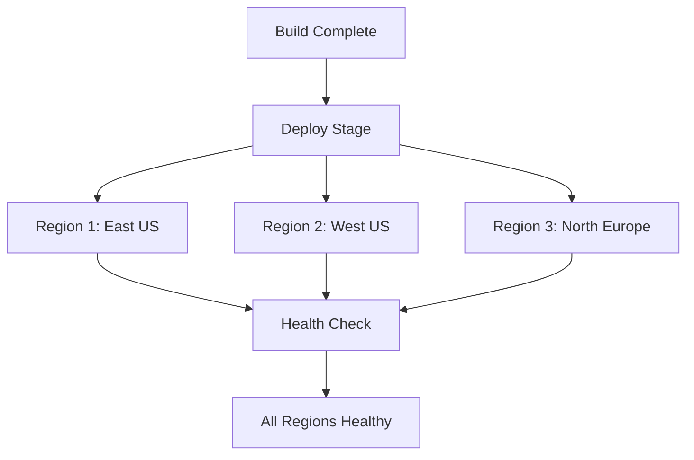
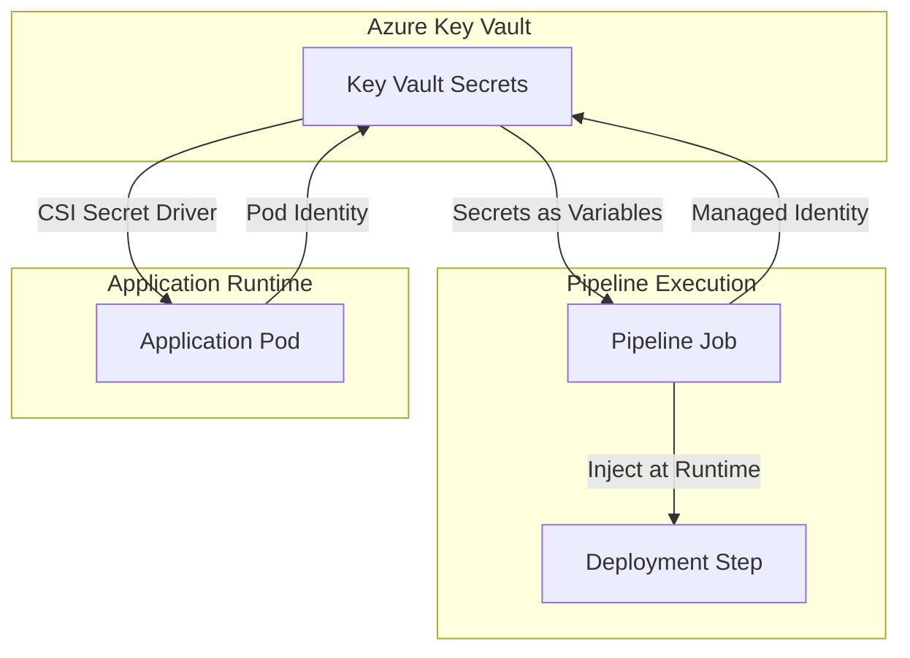
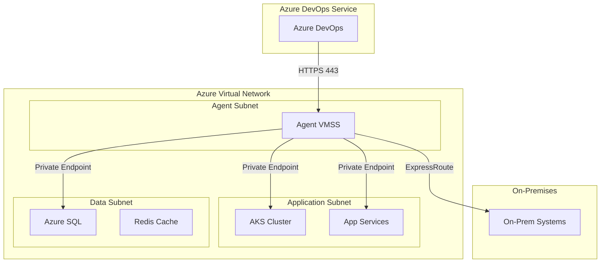
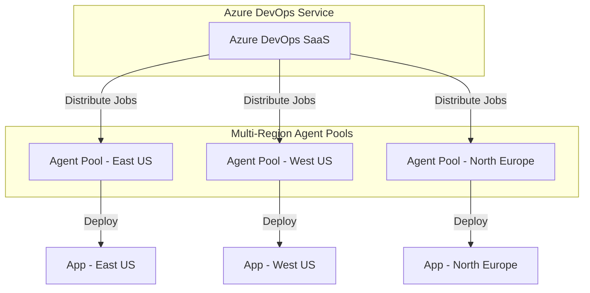

# Multi-Stage Pipeline Design and Orchestration in Azure DevOps

## Executive Summary

This whitepaper provides comprehensive architectural guidance for designing, implementing, and operating enterprise-grade multi-stage CI/CD pipelines in Azure using Azure DevOps Pipelines and GitHub Actions. The document focuses on YAML-based pipeline orchestration, environment promotion strategies, security controls, artifact management, and operational observability for complex application and infrastructure deployments.

Multi-stage pipelines enable organizations to implement controlled, auditable, and repeatable deployment processes across development, test, staging, and production environments. By implementing proper stage gates, approval workflows, and automated validation, enterprises can achieve both deployment velocity and operational stability while maintaining security and compliance requirements.

This whitepaper targets cloud architects, DevOps engineers, platform engineers, and technical leaders responsible for designing and implementing CI/CD infrastructure at enterprise scale. All guidance focuses on Azure Commercial cloud, incorporates Azure Well-Architected Framework principles, and provides production-ready code examples using Terraform for infrastructure-as-code, Azure CLI for operational tasks, KQL for monitoring, and Mermaid diagrams for architectural visualization.

**Key Outcomes:**
- Design scalable multi-stage pipeline architectures for complex applications
- Implement secure promotion workflows with automated gates and manual approvals
- Manage pipeline artifacts, dependencies, and state across environments
- Integrate security scanning, policy validation, and compliance checks
- Monitor pipeline performance and troubleshoot deployment failures
- Optimize pipeline execution time and cost

## Table of Contents

- [Multi-Stage Pipeline Design and Orchestration in Azure DevOps](#multi-stage-pipeline-design-and-orchestration-in-azure-devops)
  - [Executive Summary](#executive-summary)
  - [Table of Contents](#table-of-contents)
  - [Introduction and Use Cases](#introduction-and-use-cases)
    - [The Need for Multi-Stage Pipelines](#the-need-for-multi-stage-pipelines)
    - [Enterprise Use Cases](#enterprise-use-cases)
      - [Use Case 1: Multi-Region Application Deployment](#use-case-1-multi-region-application-deployment)
      - [Use Case 2: Infrastructure and Application Co-Deployment](#use-case-2-infrastructure-and-application-co-deployment)
      - [Use Case 3: Microservices Orchestration](#use-case-3-microservices-orchestration)
      - [Use Case 4: Compliance-Driven Deployments](#use-case-4-compliance-driven-deployments)
      - [Use Case 5: Database Schema and Application Synchronization](#use-case-5-database-schema-and-application-synchronization)
    - [Key Benefits](#key-benefits)
  - [Architecture Overview](#architecture-overview)
    - [Multi-Stage Pipeline Topology](#multi-stage-pipeline-topology)
    - [Pipeline Orchestration Patterns](#pipeline-orchestration-patterns)
      - [Pattern 1: Sequential Promotion](#pattern-1-sequential-promotion)
      - [Pattern 2: Parallel Deployment with Regional Stages](#pattern-2-parallel-deployment-with-regional-stages)
      - [Pattern 3: Canary/Progressive Deployment](#pattern-3-canaryprogressive-deployment)
    - [Key Architectural Components](#key-architectural-components)
  - [Design Considerations and Planning](#design-considerations-and-planning)
    - [Stage Design Principles](#stage-design-principles)
      - [Environment Isolation](#environment-isolation)
      - [Artifact Promotion Strategy](#artifact-promotion-strategy)
    - [Approval and Gate Strategy](#approval-and-gate-strategy)
      - [Manual Approvals](#manual-approvals)
      - [Automated Gates](#automated-gates)
    - [Pipeline Concurrency and Locking](#pipeline-concurrency-and-locking)
    - [Variable and Secret Management](#variable-and-secret-management)
      - [Variable Hierarchy](#variable-hierarchy)
      - [Secret Management with Azure Key Vault](#secret-management-with-azure-key-vault)
    - [Terraform State Management for IaC Pipelines](#terraform-state-management-for-iac-pipelines)
  - [Implementation Guide](#implementation-guide)
    - [Complete Multi-Stage Pipeline Example](#complete-multi-stage-pipeline-example)
      - [Azure DevOps YAML Pipeline](#azure-devops-yaml-pipeline)
    - [GitHub Actions Multi-Stage Workflow](#github-actions-multi-stage-workflow)
  - [Security and Compliance](#security-and-compliance)
    - [Service Principal and Managed Identity Configuration](#service-principal-and-managed-identity-configuration)
    - [Federated Identity with OIDC (GitHub Actions)](#federated-identity-with-oidc-github-actions)
    - [Secret Management Architecture](#secret-management-architecture)
    - [Security Scanning Integration](#security-scanning-integration)
      - [Static Application Security Testing (SAST)](#static-application-security-testing-sast)
      - [Container Image Scanning](#container-image-scanning)
      - [Dynamic Application Security Testing (DAST)](#dynamic-application-security-testing-dast)
      - [Dependency Scanning](#dependency-scanning)
    - [Policy as Code Enforcement](#policy-as-code-enforcement)
      - [Azure Policy Compliance Check](#azure-policy-compliance-check)
      - [Open Policy Agent (OPA) / Gatekeeper](#open-policy-agent-opa--gatekeeper)
    - [Audit Logging and Compliance](#audit-logging-and-compliance)
    - [Compliance Frameworks](#compliance-frameworks)
  - [Network Architecture and Connectivity](#network-architecture-and-connectivity)
    - [Self-Hosted Agent Network Design](#self-hosted-agent-network-design)
      - [Self-Hosted Agent Pool Configuration](#self-hosted-agent-pool-configuration)
    - [Private Endpoint Integration](#private-endpoint-integration)
  - [Identity and Access Management](#identity-and-access-management)
    - [Service Connection Configuration](#service-connection-configuration)
    - [Pipeline Permissions and RBAC](#pipeline-permissions-and-rbac)
    - [Approval Policies](#approval-policies)
  - [High Availability and Disaster Recovery](#high-availability-and-disaster-recovery)
    - [Pipeline High Availability](#pipeline-high-availability)
    - [Agent Pool Redundancy](#agent-pool-redundancy)
    - [Disaster Recovery for Pipeline Infrastructure](#disaster-recovery-for-pipeline-infrastructure)
    - [Rollback Strategies](#rollback-strategies)
      - [Application Rollback](#application-rollback)
      - [Infrastructure Rollback](#infrastructure-rollback)
  - [Monitoring, Logging, and Observability](#monitoring-logging-and-observability)
    - [Pipeline Telemetry Architecture](#pipeline-telemetry-architecture)
      - [Azure DevOps Analytics Queries](#azure-devops-analytics-queries)
    - [Monitoring Agent Pool Health](#monitoring-agent-pool-health)
    - [Alert Configuration for Pipeline Failures](#alert-configuration-for-pipeline-failures)
  - [Performance Optimization and Scalability](#performance-optimization-and-scalability)
    - [Pipeline Performance Optimization Strategies](#pipeline-performance-optimization-strategies)
      - [Parallelization](#parallelization)
      - [Caching and Artifact Reuse](#caching-and-artifact-reuse)
      - [Agent Pool Scaling](#agent-pool-scaling)
    - [Pipeline Execution Time Optimization](#pipeline-execution-time-optimization)
  - [Cost Optimization Strategies](#cost-optimization-strategies)
    - [Pipeline Cost Components](#pipeline-cost-components)
    - [Cost Optimization Techniques](#cost-optimization-techniques)
      - [Use Self-Hosted Agents for High-Volume Pipelines](#use-self-hosted-agents-for-high-volume-pipelines)
      - [Optimize Artifact Retention](#optimize-artifact-retention)
      - [Reduce Log Analytics Costs](#reduce-log-analytics-costs)
  - [Operational Management](#operational-management)
    - [Pipeline Maintenance Tasks](#pipeline-maintenance-tasks)
      - [Regular Health Checks](#regular-health-checks)
      - [Pipeline Definition Backup](#pipeline-definition-backup)
    - [Troubleshooting Common Issues](#troubleshooting-common-issues)
    - [Pipeline as Code Best Practices](#pipeline-as-code-best-practices)
  - [References](#references)
    - [Microsoft Documentation](#microsoft-documentation)
    - [Tools and Resources](#tools-and-resources)
    - [Related Whitepapers](#related-whitepapers)
  - [Appendices](#appendices)
    - [Appendix A: Pipeline Security Checklist](#appendix-a-pipeline-security-checklist)
    - [Appendix B: Performance Baseline Targets](#appendix-b-performance-baseline-targets)
    - [Appendix C: DORA Metrics Implementation](#appendix-c-dora-metrics-implementation)
    - [Appendix D: Sample Pipeline Variables](#appendix-d-sample-pipeline-variables)

## Introduction and Use Cases

### The Need for Multi-Stage Pipelines

Modern cloud applications require sophisticated deployment strategies that balance agility with stability, security, and compliance. Multi-stage pipelines provide structured promotion workflows that enable:

**Controlled Environment Progression**: Deploy changes through well-defined environments (development → testing → staging → production) with validation at each stage.

**Risk Mitigation**: Catch issues early through automated testing, security scanning, and policy validation before production deployment.

**Compliance and Auditability**: Maintain complete deployment history with approval workflows, security gates, and audit logs for regulatory requirements.

**Deployment Flexibility**: Support multiple deployment patterns (blue-green, canary, rolling updates) with coordinated rollback capabilities.

### Enterprise Use Cases

#### Use Case 1: Multi-Region Application Deployment
Deploy cloud-native applications across multiple Azure regions with coordinated releases, regional failover capabilities, and centralized monitoring. Pipeline stages handle region-specific configuration, traffic management updates, and health validation.

#### Use Case 2: Infrastructure and Application Co-Deployment
Orchestrate infrastructure provisioning (via Terraform/Bicep) alongside application deployment with dependency management, ensuring infrastructure changes complete before application updates and maintaining infrastructure drift detection.

#### Use Case 3: Microservices Orchestration
Manage deployments for microservices architectures with service-specific pipelines that coordinate releases, handle inter-service dependencies, and implement progressive delivery patterns with automated rollback.

#### Use Case 4: Compliance-Driven Deployments
Implement regulatory compliance requirements (SOC 2, HIPAA, FedRAMP) through automated policy checks, security scanning, approval gates, and comprehensive audit trails throughout the deployment lifecycle.

#### Use Case 5: Database Schema and Application Synchronization
Coordinate database schema migrations with application deployments, ensuring backward-compatible changes, validation of migration scripts, and coordinated rollback procedures.

### Key Benefits

- **Deployment Velocity**: Automated pipelines reduce manual steps and deployment time from hours to minutes
- **Quality Assurance**: Automated testing and validation gates catch issues before production
- **Security Integration**: Embed security scanning and policy validation throughout the pipeline
- **Operational Visibility**: Comprehensive monitoring and alerting for pipeline execution and deployment health
- **Cost Optimization**: Efficient resource utilization through parallelization and caching strategies
- **Regulatory Compliance**: Built-in audit trails and approval workflows for compliance requirements  

## Architecture Overview

### Multi-Stage Pipeline Topology

Multi-stage pipelines organize deployment workflows into discrete stages, each representing a phase in the software delivery lifecycle. Stages execute sequentially or in parallel, with conditional logic controlling progression based on success criteria, approval gates, and policy validation.

```mermaid
graph TB
    subgraph "Source Control"
        A[Git Commit/PR] --> B[Trigger Pipeline]
    end
    
    subgraph "Build Stage"
        B --> C[Code Compilation]
        C --> D[Unit Tests]
        D --> E[Security Scan SAST]
        E --> F[Artifact Creation]
    end
    
    subgraph "Development Stage"
        F --> G[Deploy to Dev]
        G --> H[Integration Tests]
        H --> I[Smoke Tests]
    end
    
    subgraph "Test Stage"
        I --> J{Manual Approval?}
        J -->|Approved| K[Deploy to Test]
        K --> L[E2E Tests]
        L --> M[Performance Tests]
    end
    
    subgraph "Staging Stage"
        M --> N{Manual Approval?}
        N -->|Approved| O[Deploy to Staging]
        O --> P[Security Scan DAST]
        P --> Q[Load Tests]
        Q --> R[Business Validation]
    end
    
    subgraph "Production Stage"
        R --> S{Manual Approval?}
        S -->|Approved| T[Deploy to Prod]
        T --> U[Health Validation]
        U --> V[Monitoring Alert Check]
    end
    
    V --> W[Deployment Complete]
```



### Pipeline Orchestration Patterns

#### Pattern 1: Sequential Promotion
Environments receive deployments one after another, with each stage completing before the next begins. This pattern provides maximum control and validation but slower deployment velocity.

```yaml
# Azure DevOps YAML - Sequential stages
stages:
- stage: Build
  jobs:
  - job: BuildJob
    steps:
    - task: Maven@3
    - task: PublishPipelineArtifact@1

- stage: Dev
  dependsOn: Build
  jobs:
  - deployment: DeployDev
    environment: 'development'

- stage: Test
  dependsOn: Dev
  jobs:
  - deployment: DeployTest
    environment: 'test'

- stage: Production
  dependsOn: Test
  jobs:
  - deployment: DeployProd
    environment: 'production'
```

#### Pattern 2: Parallel Deployment with Regional Stages
Deploy to multiple regions simultaneously within each environment tier, enabling geographic redundancy and reduced deployment time.



#### Pattern 3: Canary/Progressive Deployment
Gradually roll out changes to production by deploying to a subset of infrastructure first, validating success, then expanding to full production.

### Key Architectural Components

**Stage**: Logical grouping of jobs that execute deployment or validation tasks
**Job**: Collection of steps that run on a single agent, either deployment jobs or agentless validation jobs
**Step**: Individual task or script execution (build, test, deploy, scan)
**Artifact**: Build output passed between stages (compiled binaries, container images, IaC templates)
**Environment**: Target deployment destination with approval requirements and protection rules
**Service Connection**: Authenticated connection to Azure subscriptions with RBAC-scoped permissions
**Variable Group**: Centralized configuration storage with secrets integration to Azure Key Vault
**Approval Gate**: Manual or automated checkpoint requiring validation before stage progression
**Check**: Automated validation (policy compliance, security scan, health probe) before deployment

## Design Considerations and Planning

### Stage Design Principles

#### Environment Isolation
Each stage targets a completely isolated environment with dedicated:
- Azure subscriptions or resource groups
- Service principals with least-privilege permissions
- Network boundaries (VNets, NSGs, private endpoints)
- Key Vault instances for environment-specific secrets
- Monitoring and alerting configurations

**Design Decision**: Use separate Azure subscriptions for production and non-production environments to enforce hard boundaries for billing, RBAC, and resource quotas.

#### Artifact Promotion Strategy

**Artifact-Based Promotion** (Recommended):
- Build artifacts once in the build stage
- Promote the same immutable artifact through all environments
- Environment-specific configuration injected at deployment time
- Ensures consistency and eliminates "works in dev, fails in prod" scenarios

**Code-Based Promotion** (Not Recommended):
- Rebuild application in each environment from source code
- Risk of different compiler versions, dependencies, or timing creating variations
- Longer pipeline execution time due to redundant builds

```yaml
# Azure DevOps - Artifact-based promotion
stages:
- stage: Build
  jobs:
  - job: BuildArtifact
    steps:
    - task: Docker@2
      inputs:
        command: 'buildAndPush'
        repository: '$(containerRegistry)/$(imageName)'
        tags: '$(Build.BuildId)'
    
- stage: DeployDev
  jobs:
  - deployment: Deploy
    environment: development
    strategy:
      runOnce:
        deploy:
          steps:
          - task: KubernetesManifest@0
            inputs:
              action: deploy
              manifests: '$(Pipeline.Workspace)/manifests/*.yaml'
              containers: '$(containerRegistry)/$(imageName):$(Build.BuildId)'
```

### Approval and Gate Strategy

#### Manual Approvals
Human approval gates for critical stage transitions:
- **Dev → Test**: Optional, automated progression acceptable
- **Test → Staging**: Recommended for regulated environments
- **Staging → Production**: Mandatory for all production deployments

Configure approvers using Azure DevOps Environments with approval policies:

```yaml
# Pipeline references environment with approval configuration
- stage: Production
  jobs:
  - deployment: DeployProd
    environment: 'production'  # Environment has approval policy configured in UI
    strategy:
      runOnce:
        deploy:
          steps:
          - script: echo "Deploying to production"
```

#### Automated Gates
Policy-based checks that execute before stage progression:
- **Security Scanning**: No critical vulnerabilities in container images or dependencies
- **Policy Validation**: Azure Policy compliance checks, OPA/Gatekeeper policies
- **Health Checks**: Previous environment passing health probes
- **Change Advisory**: Integration with ServiceNow/Jira for change approval
- **Business Hours**: Only deploy during specified maintenance windows

### Pipeline Concurrency and Locking

**Single Pipeline Execution** (Recommended for Production):
```yaml
lockBehavior: sequential
```
Prevents concurrent deployments to the same environment, avoiding race conditions and state corruption.

**Parallel Execution** (Acceptable for Development):
```yaml
lockBehavior: runLatest
```
Cancels in-progress deployments when newer changes are available, useful for fast-moving development environments.

### Variable and Secret Management

#### Variable Hierarchy
1. **Pipeline Variables**: Defined in YAML, committed to source control (non-sensitive)
2. **Variable Groups**: Centralized variables shared across pipelines
3. **Environment Variables**: Scoped to specific environments
4. **Runtime Parameters**: User-provided values at pipeline queue time

#### Secret Management with Azure Key Vault
```yaml
variables:
- group: prod-secrets  # Variable group linked to Key Vault

steps:
- task: AzureKeyVault@2
  inputs:
    azureSubscription: 'production-service-connection'
    KeyVaultName: 'kv-prod-eastus2'
    SecretsFilter: 'DatabaseConnectionString,ApiKey'
    RunAsPreJob: true
```

**Security Principle**: Never store secrets in pipeline YAML or variable groups directly. Always reference Azure Key Vault, with vault access controlled via managed identities or service principals.

### Terraform State Management for IaC Pipelines

For infrastructure-as-code deployments, state management is critical:

```hcl
# backend.tf - Environment-specific backend configuration
terraform {
  backend "azurerm" {
    resource_group_name  = "rg-tfstate-prod"
    storage_account_name = "sttfstateprod"
    container_name       = "tfstate"
    key                  = "prod.terraform.tfstate"
    use_azuread_auth     = true
  }
  
  required_providers {
    azurerm = {
      source  = "hashicorp/azurerm"
      version = "~> 3.85"
    }
  }
}
```

**State Isolation**: Each environment maintains separate state files in separate storage accounts to prevent accidental cross-environment modifications.

## Implementation Guide

### Complete Multi-Stage Pipeline Example

This section provides a production-ready multi-stage pipeline implementing all best practices discussed.

#### Azure DevOps YAML Pipeline

```yaml
# azure-pipelines.yml
trigger:
  branches:
    include:
    - main
    - release/*

pool:
  vmImage: 'ubuntu-latest'

variables:
- group: global-variables
- name: imageName
  value: 'myapp'
- name: containerRegistry
  value: 'acrprodeastus2.azurecr.io'

stages:
#############################
# Build Stage
#############################
- stage: Build
  displayName: 'Build and Test'
  jobs:
  - job: BuildJob
    displayName: 'Build Application'
    steps:
    # Checkout code
    - checkout: self
      fetchDepth: 0
    
    # Build application
    - task: Maven@3
      displayName: 'Maven Build'
      inputs:
        mavenPomFile: 'pom.xml'
        goals: 'clean package'
        options: '-DskipTests=false'
        publishJUnitResults: true
        testResultsFiles: '**/TEST-*.xml'
    
    # Run unit tests
    - task: PublishTestResults@2
      displayName: 'Publish Test Results'
      inputs:
        testResultsFormat: 'JUnit'
        testResultsFiles: '**/TEST-*.xml'
        failTaskOnFailedTests: true
    
    # Security scan - SAST
    - task: SonarQubeAnalyze@5
      displayName: 'SonarQube Analysis'
    
    # Build and push container image
    - task: Docker@2
      displayName: 'Build and Push Docker Image'
      inputs:
        command: buildAndPush
        repository: '$(imageName)'
        dockerfile: '$(Build.SourcesDirectory)/Dockerfile'
        containerRegistry: 'acr-service-connection'
        tags: |
          $(Build.BuildId)
          latest
    
    # Scan container image
    - task: AquaSecurityScanner@4
      displayName: 'Container Image Scan'
      inputs:
        image: '$(containerRegistry)/$(imageName):$(Build.BuildId)'
        failOnCritical: true
    
    # Publish Kubernetes manifests
    - task: PublishPipelineArtifact@1
      displayName: 'Publish K8s Manifests'
      inputs:
        targetPath: '$(Build.SourcesDirectory)/k8s'
        artifact: 'manifests'
    
    # Publish Terraform configuration
    - task: PublishPipelineArtifact@1
      displayName: 'Publish Terraform Config'
      inputs:
        targetPath: '$(Build.SourcesDirectory)/terraform'
        artifact: 'terraform'

#############################
# Development Stage
#############################
- stage: Dev
  displayName: 'Deploy to Development'
  dependsOn: Build
  condition: succeeded()
  variables:
  - group: dev-variables
  - name: environmentName
    value: 'development'
  
  jobs:
  # Infrastructure deployment
  - deployment: DeployInfra
    displayName: 'Deploy Infrastructure'
    environment: 'dev'
    strategy:
      runOnce:
        deploy:
          steps:
          - download: current
            artifact: terraform
          
          - task: TerraformInstaller@0
            inputs:
              terraformVersion: '1.6.6'
          
          - task: TerraformTaskV4@4
            displayName: 'Terraform Init'
            inputs:
              provider: 'azurerm'
              command: 'init'
              workingDirectory: '$(Pipeline.Workspace)/terraform'
              backendServiceArm: 'dev-service-connection'
              backendAzureRmResourceGroupName: 'rg-tfstate-dev'
              backendAzureRmStorageAccountName: 'sttfstatedev'
              backendAzureRmContainerName: 'tfstate'
              backendAzureRmKey: 'dev.terraform.tfstate'
          
          - task: TerraformTaskV4@4
            displayName: 'Terraform Plan'
            inputs:
              provider: 'azurerm'
              command: 'plan'
              workingDirectory: '$(Pipeline.Workspace)/terraform'
              environmentServiceNameAzureRM: 'dev-service-connection'
              commandOptions: '-var-file=environments/dev.tfvars -out=tfplan'
          
          - task: TerraformTaskV4@4
            displayName: 'Terraform Apply'
            inputs:
              provider: 'azurerm'
              command: 'apply'
              workingDirectory: '$(Pipeline.Workspace)/terraform'
              environmentServiceNameAzureRM: 'dev-service-connection'
              commandOptions: 'tfplan'
  
  # Application deployment
  - deployment: DeployApp
    displayName: 'Deploy Application'
    dependsOn: DeployInfra
    environment: 'dev'
    strategy:
      runOnce:
        deploy:
          steps:
          - download: current
            artifact: manifests
          
          - task: KubernetesManifest@0
            displayName: 'Deploy to AKS'
            inputs:
              action: 'deploy'
              kubernetesServiceConnection: 'aks-dev-connection'
              namespace: 'default'
              manifests: '$(Pipeline.Workspace)/manifests/*.yaml'
              containers: '$(containerRegistry)/$(imageName):$(Build.BuildId)'
          
          - task: Kubernetes@1
            displayName: 'Wait for Deployment'
            inputs:
              connectionType: 'Kubernetes Service Connection'
              kubernetesServiceEndpoint: 'aks-dev-connection'
              command: 'wait'
              arguments: '--for=condition=available --timeout=300s deployment/myapp'
  
  # Integration tests
  - job: IntegrationTests
    displayName: 'Run Integration Tests'
    dependsOn: DeployApp
    steps:
    - task: Maven@3
      displayName: 'Integration Tests'
      inputs:
        mavenPomFile: 'pom.xml'
        goals: 'verify'
        options: '-DskipUnitTests=true -Dtest.environment=dev'

#############################
# Test Stage
#############################
- stage: Test
  displayName: 'Deploy to Test'
  dependsOn: Dev
  condition: succeeded()
  variables:
  - group: test-variables
  
  jobs:
  - deployment: DeployTest
    displayName: 'Deploy to Test Environment'
    environment: 'test'  # Approval policy configured in Azure DevOps UI
    strategy:
      runOnce:
        preDeploy:
          steps:
          - task: AzureCLI@2
            displayName: 'Validate Test Environment Health'
            inputs:
              azureSubscription: 'test-service-connection'
              scriptType: 'bash'
              scriptLocation: 'inlineScript'
              inlineScript: |
                # Check AKS cluster health
                az aks show \
                  --resource-group rg-aks-test \
                  --name aks-test-eastus2 \
                  --query provisioningState -o tsv
        
        deploy:
          steps:
          # Infrastructure deployment steps (similar to Dev)
          - download: current
            artifact: terraform
          
          - task: TerraformTaskV4@4
            displayName: 'Terraform Apply Test'
            inputs:
              provider: 'azurerm'
              command: 'apply'
              workingDirectory: '$(Pipeline.Workspace)/terraform'
              environmentServiceNameAzureRM: 'test-service-connection'
          
          # Application deployment steps
          - download: current
            artifact: manifests
          
          - task: KubernetesManifest@0
            displayName: 'Deploy to AKS Test'
            inputs:
              action: 'deploy'
              kubernetesServiceConnection: 'aks-test-connection'
              manifests: '$(Pipeline.Workspace)/manifests/*.yaml'
              containers: '$(containerRegistry)/$(imageName):$(Build.BuildId)'
        
        routeTraffic:
          steps:
          - task: Kubernetes@1
            displayName: 'Health Check'
            inputs:
              command: 'get'
              arguments: 'pods -l app=myapp'
        
        postRouteTraffic:
          steps:
          - task: CmdLine@2
            displayName: 'Run E2E Tests'
            inputs:
              script: |
                npm install
                npm run test:e2e -- --env=test
        
        on:
          failure:
            steps:
            - task: AzureCLI@2
              displayName: 'Collect Diagnostic Logs'
              inputs:
                azureSubscription: 'test-service-connection'
                scriptType: 'bash'
                scriptLocation: 'inlineScript'
                inlineScript: |
                  kubectl logs -l app=myapp --tail=100 > deployment-logs.txt
            
            - task: PublishPipelineArtifact@1
              inputs:
                targetPath: 'deployment-logs.txt'
                artifact: 'test-failure-logs'

#############################
# Staging Stage
#############################
- stage: Staging
  displayName: 'Deploy to Staging'
  dependsOn: Test
  condition: succeeded()
  variables:
  - group: staging-variables
  
  jobs:
  - deployment: DeployStaging
    displayName: 'Deploy to Staging'
    environment: 'staging'
    strategy:
      runOnce:
        deploy:
          steps:
          - download: current
            artifact: manifests
          
          - task: KubernetesManifest@0
            displayName: 'Deploy to Staging'
            inputs:
              action: 'deploy'
              kubernetesServiceConnection: 'aks-staging-connection'
              manifests: '$(Pipeline.Workspace)/manifests/*.yaml'
              containers: '$(containerRegistry)/$(imageName):$(Build.BuildId)'
  
  # Security scan - DAST
  - job: SecurityTests
    displayName: 'Dynamic Security Scanning'
    dependsOn: DeployStaging
    steps:
    - task: OWASP-ZAP@1
      displayName: 'OWASP ZAP Scan'
      inputs:
        targetUrl: 'https://staging.myapp.com'
        generateReport: true
  
  # Load testing
  - job: LoadTests
    displayName: 'Load Testing'
    dependsOn: DeployStaging
    steps:
    - task: AzureLoadTest@1
      inputs:
        azureSubscription: 'staging-service-connection'
        loadTestConfigFile: 'loadtest-config.yaml'
        resourceGroup: 'rg-loadtest-staging'
        loadTestResource: 'loadtest-staging'

#############################
# Production Stage
#############################
- stage: Production
  displayName: 'Deploy to Production'
  dependsOn: Staging
  condition: succeeded()
  variables:
  - group: prod-variables
  
  jobs:
  - deployment: DeployProduction
    displayName: 'Deploy to Production'
    environment: 'production'  # Requires manual approval
    strategy:
      runOnce:
        preDeploy:
          steps:
          # Create backup before deployment
          - task: AzureCLI@2
            displayName: 'Backup Current State'
            inputs:
              azureSubscription: 'prod-service-connection'
              scriptType: 'bash'
              scriptLocation: 'inlineScript'
              inlineScript: |
                kubectl get all -n production -o yaml > backup-$(Build.BuildId).yaml
          
          - task: PublishPipelineArtifact@1
            inputs:
              targetPath: 'backup-$(Build.BuildId).yaml'
              artifact: 'prod-backup'
        
        deploy:
          steps:
          - download: current
            artifact: manifests
          
          # Blue-Green deployment strategy
          - task: KubernetesManifest@0
            displayName: 'Deploy Green Version'
            inputs:
              action: 'deploy'
              kubernetesServiceConnection: 'aks-prod-connection'
              namespace: 'production'
              manifests: '$(Pipeline.Workspace)/manifests/*.yaml'
              containers: '$(containerRegistry)/$(imageName):$(Build.BuildId)'
              versionSpec: 'green'
          
          - task: Kubernetes@1
            displayName: 'Wait for Green Deployment'
            inputs:
              command: 'wait'
              arguments: '--for=condition=available --timeout=600s deployment/myapp-green'
        
        routeTraffic:
          steps:
          # Switch traffic to green deployment
          - task: Kubernetes@1
            displayName: 'Switch Traffic to Green'
            inputs:
              command: 'patch'
              arguments: 'service/myapp -p {"spec":{"selector":{"version":"green"}}}'
          
          # Monitor for errors
          - task: Bash@3
            displayName: 'Monitor Health (5 min)'
            inputs:
              targetType: 'inline'
              script: |
                for i in {1..30}; do
                  STATUS=$(kubectl get pods -l app=myapp,version=green -o jsonpath='{.items[*].status.phase}')
                  if [[ "$STATUS" != *"Running"* ]]; then
                    echo "Deployment unhealthy, triggering rollback"
                    exit 1
                  fi
                  sleep 10
                done
        
        postRouteTraffic:
          steps:
          - task: AzureCLI@2
            displayName: 'Validate Monitoring Alerts'
            inputs:
              azureSubscription: 'prod-service-connection'
              scriptType: 'bash'
              scriptLocation: 'inlineScript'
              inlineScript: |
                # Check for critical alerts in the last 10 minutes
                az monitor metrics alert list \
                  --resource-group rg-monitoring-prod \
                  --query "[?enabled && contains(name, 'critical')]"
          
          # Clean up old blue deployment
          - task: Kubernetes@1
            displayName: 'Remove Blue Deployment'
            inputs:
              command: 'delete'
              arguments: 'deployment/myapp-blue'
        
        on:
          failure:
            steps:
            # Rollback to blue deployment
            - task: Kubernetes@1
              displayName: 'Rollback to Blue'
              inputs:
                command: 'patch'
                arguments: 'service/myapp -p {"spec":{"selector":{"version":"blue"}}}'
            
            - task: Kubernetes@1
              displayName: 'Delete Failed Green Deployment'
              inputs:
                command: 'delete'
                arguments: 'deployment/myapp-green'
```

### GitHub Actions Multi-Stage Workflow

```yaml
# .github/workflows/deploy.yml
name: Multi-Stage Deployment

on:
  push:
    branches: [main]
  pull_request:
    branches: [main]
  workflow_dispatch:

env:
  REGISTRY: ghcr.io
  IMAGE_NAME: ${{ github.repository }}

jobs:
  #############################
  # Build and Test
  #############################
  build:
    runs-on: ubuntu-latest
    permissions:
      contents: read
      packages: write
    
    outputs:
      image-tag: ${{ steps.meta.outputs.tags }}
    
    steps:
    - name: Checkout code
      uses: actions/checkout@v4
    
    - name: Set up JDK 17
      uses: actions/setup-java@v4
      with:
        java-version: '17'
        distribution: 'temurin'
        cache: maven
    
    - name: Build with Maven
      run: mvn clean package -DskipTests=false
    
    - name: Run unit tests
      run: mvn test
    
    - name: SonarQube Scan
      uses: sonarsource/sonarqube-scan-action@master
      env:
        SONAR_TOKEN: ${{ secrets.SONAR_TOKEN }}
        SONAR_HOST_URL: ${{ secrets.SONAR_HOST_URL }}
    
    - name: Log in to Container Registry
      uses: docker/login-action@v3
      with:
        registry: ${{ env.REGISTRY }}
        username: ${{ github.actor }}
        password: ${{ secrets.GITHUB_TOKEN }}
    
    - name: Extract metadata
      id: meta
      uses: docker/metadata-action@v5
      with:
        images: ${{ env.REGISTRY }}/${{ env.IMAGE_NAME }}
        tags: |
          type=sha,prefix={{branch}}-
          type=ref,event=branch
          type=semver,pattern={{version}}
    
    - name: Build and push Docker image
      uses: docker/build-push-action@v5
      with:
        context: .
        push: true
        tags: ${{ steps.meta.outputs.tags }}
        labels: ${{ steps.meta.outputs.labels }}
        cache-from: type=gha
        cache-to: type=gha,mode=max
    
    - name: Scan image with Trivy
      uses: aquasecurity/trivy-action@master
      with:
        image-ref: ${{ steps.meta.outputs.tags }}
        format: 'sarif'
        output: 'trivy-results.sarif'
    
    - name: Upload Trivy results to GitHub Security
      uses: github/codeql-action/upload-sarif@v3
      with:
        sarif_file: 'trivy-results.sarif'

  #############################
  # Deploy to Development
  #############################
  deploy-dev:
    runs-on: ubuntu-latest
    needs: build
    environment:
      name: development
      url: https://dev.myapp.com
    
    steps:
    - name: Checkout code
      uses: actions/checkout@v4
    
    - name: Azure Login
      uses: azure/login@v1
      with:
        creds: ${{ secrets.AZURE_CREDENTIALS_DEV }}
    
    - name: Deploy Infrastructure
      uses: hashicorp/setup-terraform@v3
      with:
        terraform_version: 1.6.6
    
    - name: Terraform Init
      run: |
        cd terraform
        terraform init \
          -backend-config="resource_group_name=rg-tfstate-dev" \
          -backend-config="storage_account_name=sttfstatedev" \
          -backend-config="container_name=tfstate" \
          -backend-config="key=dev.terraform.tfstate"
    
    - name: Terraform Apply
      run: |
        cd terraform
        terraform apply -auto-approve \
          -var-file=environments/dev.tfvars
    
    - name: Set AKS Context
      uses: azure/aks-set-context@v3
      with:
        resource-group: rg-aks-dev
        cluster-name: aks-dev-eastus2
    
    - name: Deploy to AKS
      uses: azure/k8s-deploy@v4
      with:
        manifests: |
          k8s/deployment.yaml
          k8s/service.yaml
        images: ${{ needs.build.outputs.image-tag }}
        namespace: default
    
    - name: Run Integration Tests
      run: |
        mvn verify -DskipUnitTests=true \
          -Dtest.environment=dev \
          -Dtest.url=https://dev.myapp.com

  #############################
  # Deploy to Test
  #############################
  deploy-test:
    runs-on: ubuntu-latest
    needs: deploy-dev
    environment:
      name: test
      url: https://test.myapp.com
    
    steps:
    - name: Checkout code
      uses: actions/checkout@v4
    
    - name: Azure Login
      uses: azure/login@v1
      with:
        creds: ${{ secrets.AZURE_CREDENTIALS_TEST }}
    
    - name: Set AKS Context
      uses: azure/aks-set-context@v3
      with:
        resource-group: rg-aks-test
        cluster-name: aks-test-eastus2
    
    - name: Deploy to AKS
      uses: azure/k8s-deploy@v4
      with:
        manifests: |
          k8s/deployment.yaml
          k8s/service.yaml
        images: ${{ needs.build.outputs.image-tag }}
        namespace: default
    
    - name: Run E2E Tests
      run: |
        npm install
        npm run test:e2e -- --env=test

  #############################
  # Deploy to Production
  #############################
  deploy-prod:
    runs-on: ubuntu-latest
    needs: deploy-test
    environment:
      name: production
      url: https://myapp.com
    
    steps:
    - name: Checkout code
      uses: actions/checkout@v4
    
    - name: Azure Login
      uses: azure/login@v1
      with:
        creds: ${{ secrets.AZURE_CREDENTIALS_PROD }}
    
    - name: Set AKS Context
      uses: azure/aks-set-context@v3
      with:
        resource-group: rg-aks-prod
        cluster-name: aks-prod-eastus2
    
    - name: Create Backup
      run: |
        kubectl get all -n production -o yaml > backup-${{ github.run_id }}.yaml
    
    - name: Deploy to AKS (Blue-Green)
      uses: azure/k8s-deploy@v4
      with:
        manifests: |
          k8s/deployment-green.yaml
          k8s/service.yaml
        images: ${{ needs.build.outputs.image-tag }}
        namespace: production
        strategy: blue-green
        traffic-split-method: pod
        percentage: 100
    
    - name: Monitor Deployment Health
      run: |
        for i in {1..30}; do
          STATUS=$(kubectl get pods -l app=myapp,version=green -n production -o jsonpath='{.items[*].status.phase}')
          if [[ "$STATUS" != *"Running"* ]]; then
            echo "Deployment failed health check"
            exit 1
          fi
          sleep 10
        done
    
    - name: Delete Blue Deployment
      if: success()
      run: kubectl delete deployment myapp-blue -n production
    
    - name: Rollback on Failure
      if: failure()
      run: |
        kubectl patch service myapp -n production -p '{"spec":{"selector":{"version":"blue"}}}'
        kubectl delete deployment myapp-green -n production
```

## Security and Compliance

Security must be embedded throughout the pipeline lifecycle, not treated as a final gate. This section covers identity management, secret handling, scanning, and compliance validation.

### Service Principal and Managed Identity Configuration

**Least Privilege Principle**: Each environment uses dedicated service principals or managed identities with minimum required permissions.

```bash
#!/bin/bash
# Create service principal for Dev environment
az ad sp create-for-rbac \
  --name "sp-devops-dev" \
  --role "Contributor" \
  --scopes /subscriptions/<DEV-SUBSCRIPTION-ID>/resourceGroups/rg-dev \
  --sdk-auth

# Assign specific RBAC roles
az role assignment create \
  --assignee <SP-OBJECT-ID> \
  --role "AKS Contributor" \
  --scope /subscriptions/<DEV-SUBSCRIPTION-ID>/resourceGroups/rg-aks-dev

# Grant Key Vault access
az keyvault set-policy \
  --name kv-dev-eastus2 \
  --spn <SP-APP-ID> \
  --secret-permissions get list \
  --certificate-permissions get list

# Production uses more restrictive permissions
az ad sp create-for-rbac \
  --name "sp-devops-prod" \
  --role "Reader" \
  --scopes /subscriptions/<PROD-SUBSCRIPTION-ID>

# Production deployments use specific resource-level permissions
az role assignment create \
  --assignee <PROD-SP-OBJECT-ID> \
  --role "Website Contributor" \
  --scope /subscriptions/<PROD-SUBSCRIPTION-ID>/resourceGroups/rg-app-prod/providers/Microsoft.Web/sites/app-prod
```

### Federated Identity with OIDC (GitHub Actions)

Eliminate long-lived secrets by using OpenID Connect federation:

```bash
# Create Azure AD Application
APP_ID=$(az ad app create \
  --display-name "GitHub-Actions-Federation" \
  --query appId -o tsv)

# Create service principal
SP_OBJECT_ID=$(az ad sp create \
  --id $APP_ID \
  --query id -o tsv)

# Configure federated credential for GitHub Actions
az ad app federated-credential create \
  --id $APP_ID \
  --parameters '{
    "name": "GitHub-Actions-Main",
    "issuer": "https://token.actions.githubusercontent.com",
    "subject": "repo:myorg/myrepo:ref:refs/heads/main",
    "description": "GitHub Actions Main Branch",
    "audiences": ["api://AzureADTokenExchange"]
  }'

# Assign RBAC permissions
az role assignment create \
  --assignee $SP_OBJECT_ID \
  --role "Contributor" \
  --scope /subscriptions/<SUBSCRIPTION-ID>/resourceGroups/rg-prod
```

GitHub Actions workflow using OIDC:

```yaml
name: Deploy with OIDC
on: [push]

permissions:
  id-token: write
  contents: read

jobs:
  deploy:
    runs-on: ubuntu-latest
    steps:
    - uses: actions/checkout@v4
    
    - name: Azure Login with OIDC
      uses: azure/login@v1
      with:
        client-id: ${{ secrets.AZURE_CLIENT_ID }}
        tenant-id: ${{ secrets.AZURE_TENANT_ID }}
        subscription-id: ${{ secrets.AZURE_SUBSCRIPTION_ID }}
    
    - name: Deploy Resources
      run: az group deployment create...
```

### Secret Management Architecture



**Never Store Secrets In**:
- Pipeline YAML files
- Variable groups (use Key Vault-backed groups only)
- Source control repositories
- Container images
- Kubernetes ConfigMaps

**Always Use**:
- Azure Key Vault with managed identities
- Azure Key Vault Task in Azure DevOps
- CSI Secret Store Driver for AKS workloads
- Short-lived tokens with automatic rotation

### Security Scanning Integration

#### Static Application Security Testing (SAST)

```yaml
# Azure DevOps - SonarQube integration
- task: SonarQubePrepare@5
  inputs:
    SonarQube: 'SonarQube-Connection'
    scannerMode: 'MSBuild'
    projectKey: 'myapp'
    projectName: 'My Application'

- task: VSBuild@1
  inputs:
    solution: '**/*.sln'

- task: SonarQubeAnalyze@5

- task: SonarQubePublish@5
  inputs:
    pollingTimeoutSec: '300'

# Quality gate check
- task: sonar-buildbreaker@8
  inputs:
    SonarQube: 'SonarQube-Connection'
```

#### Container Image Scanning

```yaml
# Trivy container scanning
- task: trivy@1
  displayName: 'Scan Container Image'
  inputs:
    version: 'latest'
    image: '$(containerRegistry)/$(imageName):$(Build.BuildId)'
    exitCode: '1'
    severity: 'CRITICAL,HIGH'
    ignoreUnfixed: true
```

#### Dynamic Application Security Testing (DAST)

```yaml
# OWASP ZAP scanning in staging
- task: OWASP-Zap@1
  inputs:
    targetUrl: 'https://staging.myapp.com'
    threshold: '50'
    scanMode: 'full'
    generateReport: true
```

#### Dependency Scanning

```yaml
# GitHub Actions - Dependency scanning
- name: Run Snyk to check for vulnerabilities
  uses: snyk/actions/maven@master
  env:
    SNYK_TOKEN: ${{ secrets.SNYK_TOKEN }}
  with:
    args: --severity-threshold=high --fail-on=upgradable
```

### Policy as Code Enforcement

#### Azure Policy Compliance Check

```yaml
# Azure DevOps - Check Azure Policy compliance before deployment
- task: AzureCLI@2
  displayName: 'Check Policy Compliance'
  inputs:
    azureSubscription: 'prod-service-connection'
    scriptType: 'bash'
    scriptLocation: 'inlineScript'
    inlineScript: |
      # Get policy states for resource group
      NON_COMPLIANT=$(az policy state list \
        --resource-group rg-app-prod \
        --filter "ComplianceState eq 'NonCompliant'" \
        --query "length(@)" -o tsv)
      
      if [ "$NON_COMPLIANT" -gt 0 ]; then
        echo "##vso[task.logissue type=error]Non-compliant resources detected"
        echo "##vso[task.complete result=Failed;]"
      fi
```

#### Open Policy Agent (OPA) / Gatekeeper

```yaml
# Validate Kubernetes manifests against OPA policies
- task: Bash@3
  displayName: 'Validate K8s Manifests with Conftest'
  inputs:
    targetType: 'inline'
    script: |
      conftest test k8s/*.yaml -p opa-policies/ \
        --fail-on-warn \
        --all-namespaces
```

### Audit Logging and Compliance

Enable comprehensive audit logging for all pipeline activities:

```hcl
# Terraform - Configure diagnostic settings for pipeline resources
resource "azurerm_monitor_diagnostic_setting" "pipeline_logs" {
  name                       = "pipeline-audit-logs"
  target_resource_id         = azurerm_kubernetes_cluster.aks.id
  log_analytics_workspace_id = azurerm_log_analytics_workspace.monitoring.id

  log {
    category = "kube-audit"
    enabled  = true

    retention_policy {
      enabled = true
      days    = 90
    }
  }

  log {
    category = "kube-audit-admin"
    enabled  = true

    retention_policy {
      enabled = true
      days    = 90
    }
  }

  metric {
    category = "AllMetrics"
    enabled  = true

    retention_policy {
      enabled = true
      days    = 30
    }
  }
}
```

### Compliance Frameworks

Map pipeline controls to compliance requirements:

| Control | SOC 2 | HIPAA | PCI DSS | Implementation |
|---------|-------|-------|---------|----------------|
| Access Control | CC6.1 | §164.312(a)(1) | 7.1 | Service principals with RBAC, MFA for approvals |
| Change Management | CC8.1 | §164.308(a)(5) | 6.4 | Pull requests, approval gates, audit logs |
| Encryption | CC6.1 | §164.312(a)(2)(iv) | 3.4 | TLS for data in transit, encryption at rest |
| Audit Logging | CC7.2 | §164.312(b) | 10.1 | Azure Monitor, pipeline logs, activity logs |
| Vulnerability Management | CC7.1 | §164.308(a)(5)(ii)(B) | 6.2 | SAST/DAST scanning, dependency checks |
| Configuration Management | CC8.1 | §164.310(d)(2)(iii) | 2.2 | IaC, immutable infrastructure, drift detection |

## Network Architecture and Connectivity

### Self-Hosted Agent Network Design

For enterprises requiring network-isolated deployments or access to on-premises resources, self-hosted agents provide control over network topology.



#### Self-Hosted Agent Pool Configuration

```hcl
# Terraform - Self-hosted agent VMSS
resource "azurerm_virtual_machine_scale_set" "devops_agents" {
  name                = "vmss-devops-agents"
  location            = azurerm_resource_group.devops.location
  resource_group_name = azurerm_resource_group.devops.name
  sku {
    name     = "Standard_D4s_v5"
    tier     = "Standard"
    capacity = 3
  }

  upgrade_policy_mode = "Manual"

  identity {
    type = "SystemAssigned"
  }

  os_profile {
    computer_name_prefix = "devops-agent"
    admin_username       = "azureuser"
    custom_data          = base64encode(file("agent-cloud-init.sh"))
  }

  os_profile_linux_config {
    disable_password_authentication = true
    ssh_keys {
      path     = "/home/azureuser/.ssh/authorized_keys"
      key_data = file("~/.ssh/id_rsa.pub")
    }
  }

  network_profile {
    name    = "devops-agent-nic"
    primary = true

    ip_configuration {
      name                                   = "internal"
      primary                                = true
      subnet_id                              = azurerm_subnet.agents.id
      load_balancer_backend_address_pool_ids = []
    }
  }

  storage_profile_image_reference {
    publisher = "Canonical"
    offer     = "0001-com-ubuntu-server-focal"
    sku       = "20_04-lts-gen2"
    version   = "latest"
  }

  storage_profile_os_disk {
    caching           = "ReadWrite"
    create_option     = "FromImage"
    managed_disk_type = "Premium_LRS"
  }

  tags = {
    Environment = "Production"
    ManagedBy   = "Terraform"
    Purpose     = "DevOps Agents"
  }
}

# Network Security Group for agent subnet
resource "azurerm_network_security_group" "agents" {
  name                = "nsg-devops-agents"
  location            = azurerm_resource_group.devops.location
  resource_group_name = azurerm_resource_group.devops.name

  # Outbound to Azure DevOps
  security_rule {
    name                       = "Allow-AzureDevOps-Outbound"
    priority                   = 100
    direction                  = "Outbound"
    access                     = "Allow"
    protocol                   = "Tcp"
    source_port_range          = "*"
    destination_port_range     = "443"
    source_address_prefix      = "VirtualNetwork"
    destination_address_prefix = "AzureCloud"
  }

  # Outbound to container registries
  security_rule {
    name                       = "Allow-ContainerRegistry-Outbound"
    priority                   = 110
    direction                  = "Outbound"
    access                     = "Allow"
    protocol                   = "Tcp"
    source_port_range          = "*"
    destination_port_range     = "443"
    source_address_prefix      = "VirtualNetwork"
    destination_address_prefix = "AzureContainerRegistry"
  }

  # Deny all other inbound
  security_rule {
    name                       = "Deny-All-Inbound"
    priority                   = 4096
    direction                  = "Inbound"
    access                     = "Deny"
    protocol                   = "*"
    source_port_range          = "*"
    destination_port_range     = "*"
    source_address_prefix      = "*"
    destination_address_prefix = "*"
  }
}
```

### Private Endpoint Integration

```hcl
# Terraform - Private endpoints for pipeline resources
resource "azurerm_private_endpoint" "acr" {
  name                = "pe-acr-prod"
  location            = azurerm_resource_group.devops.location
  resource_group_name = azurerm_resource_group.devops.name
  subnet_id           = azurerm_subnet.private_endpoints.id

  private_service_connection {
    name                           = "acr-privateserviceconnection"
    private_connection_resource_id = azurerm_container_registry.acr.id
    subresource_names              = ["registry"]
    is_manual_connection           = false
  }

  private_dns_zone_group {
    name                 = "acr-dns-zone-group"
    private_dns_zone_ids = [azurerm_private_dns_zone.acr.id]
  }
}

resource "azurerm_private_dns_zone" "acr" {
  name                = "privatelink.azurecr.io"
  resource_group_name = azurerm_resource_group.devops.name
}

resource "azurerm_private_dns_zone_virtual_network_link" "acr" {
  name                  = "acr-dns-link"
  resource_group_name   = azurerm_resource_group.devops.name
  private_dns_zone_name = azurerm_private_dns_zone.acr.name
  virtual_network_id    = azurerm_virtual_network.devops.id
}
```

## Identity and Access Management

### Service Connection Configuration

Azure DevOps service connections should use service principals with workload identity federation where possible:

```bash
# Create service principal for pipeline
az ad sp create-for-rbac \
  --name "sp-pipeline-prod" \
  --role "Contributor" \
  --scopes /subscriptions/<SUBSCRIPTION-ID>/resourceGroups/rg-app-prod

# Configure federated credential for Azure DevOps
az rest --method POST \
  --uri "https://graph.microsoft.com/v1.0/applications/<APP-OBJECT-ID>/federatedIdentityCredentials" \
  --body '{
    "name": "AzureDevOps-Prod-Pipeline",
    "issuer": "https://vstoken.dev.azure.com/<ORGANIZATION-ID>",
    "subject": "sc://<ORGANIZATION>/<PROJECT>/<SERVICE-CONNECTION-NAME>",
    "audiences": ["api://AzureADTokenExchange"]
  }'
```

### Pipeline Permissions and RBAC

```yaml
# Azure DevOps - Pipeline permissions in YAML
resources:
  repositories:
  - repository: templates
    type: git
    name: shared-templates
    ref: refs/heads/main

# Restrict pipeline to specific service connections
resources:
  connections:
  - service: prod-service-connection
    permission: use

# Environment protection rules (configured in Azure DevOps UI)
# - Required reviewers
# - Approval timeout
# - Business hours gate
# - Branch control (only main branch can deploy to prod)
```

### Approval Policies

Configure approval policies in Azure DevOps Environments:

1. **Required Reviewers**: Minimum 2 approvers from security team for production
2. **Timeout**: Approval request expires after 30 days
3. **Approver Groups**: Use Azure AD groups, not individual users
4. **Branch Filters**: Only `main` or `release/*` branches can deploy to production
5. **Exclusive Deployment Lock**: Prevents concurrent deployments to same environment

## High Availability and Disaster Recovery

### Pipeline High Availability



### Agent Pool Redundancy

```hcl
# Terraform - Multi-region agent pools
resource "azurerm_virtual_machine_scale_set" "agents_eastus" {
  name                = "vmss-agents-eastus"
  location            = "eastus"
  resource_group_name = azurerm_resource_group.devops_eastus.name
  
  sku {
    capacity = 2
  }
  
  # Agent configuration
}

resource "azurerm_virtual_machine_scale_set" "agents_westus" {
  name                = "vmss-agents-westus"
  location            = "westus"
  resource_group_name = azurerm_resource_group.devops_westus.name
  
  sku {
    capacity = 2
  }
  
  # Agent configuration
}

# Auto-scaling for agent pools
resource "azurerm_monitor_autoscale_setting" "agents" {
  name                = "autoscale-agents"
  resource_group_name = azurerm_resource_group.devops.name
  location            = azurerm_resource_group.devops.location
  target_resource_id  = azurerm_virtual_machine_scale_set.agents_eastus.id

  profile {
    name = "AutoScale"

    capacity {
      default = 2
      minimum = 1
      maximum = 10
    }

    rule {
      metric_trigger {
        metric_name        = "Percentage CPU"
        metric_resource_id = azurerm_virtual_machine_scale_set.agents_eastus.id
        time_grain         = "PT1M"
        statistic          = "Average"
        time_window        = "PT5M"
        time_aggregation   = "Average"
        operator           = "GreaterThan"
        threshold          = 75
      }

      scale_action {
        direction = "Increase"
        type      = "ChangeCount"
        value     = "1"
        cooldown  = "PT5M"
      }
    }

    rule {
      metric_trigger {
        metric_name        = "Percentage CPU"
        metric_resource_id = azurerm_virtual_machine_scale_set.agents_eastus.id
        time_grain         = "PT1M"
        statistic          = "Average"
        time_window        = "PT5M"
        time_aggregation   = "Average"
        operator           = "LessThan"
        threshold          = 25
      }

      scale_action {
        direction = "Decrease"
        type      = "ChangeCount"
        value     = "1"
        cooldown  = "PT5M"
      }
    }
  }
}
```

### Disaster Recovery for Pipeline Infrastructure

**Recovery Time Objective (RTO)**: 1 hour
**Recovery Point Objective (RPO)**: 15 minutes

**Backup Strategy**:
1. **Pipeline Definitions**: Stored in Git repositories (version controlled)
2. **Variable Groups**: Export via Azure DevOps API, store in Azure Storage with versioning
3. **Service Connections**: Document and template via Terraform
4. **Agent Pools**: Infrastructure as Code for rapid recreation
5. **Build Artifacts**: Replicate to geo-redundant storage accounts

```bash
#!/bin/bash
# Backup Azure DevOps configuration
ORGANIZATION="myorg"
PROJECT="myproject"
BACKUP_STORAGE="stdevopsbackupprod"

# Export variable groups
az devops variable group list \
  --org "https://dev.azure.com/$ORGANIZATION" \
  --project "$PROJECT" \
  --output json > variable-groups-$(date +%Y%m%d).json

# Upload to storage
az storage blob upload \
  --account-name "$BACKUP_STORAGE" \
  --container-name "devops-backups" \
  --name "variable-groups-$(date +%Y%m%d).json" \
  --file "variable-groups-$(date +%Y%m%d).json"

# Export pipeline definitions (already in Git, but backup via API)
az pipelines list \
  --org "https://dev.azure.com/$ORGANIZATION" \
  --project "$PROJECT" \
  --output json > pipelines-$(date +%Y%m%d).json
```

### Rollback Strategies

#### Application Rollback

```yaml
# Azure DevOps - Automated rollback on failure
- stage: Production
  jobs:
  - deployment: DeployProd
    environment: production
    strategy:
      runOnce:
        deploy:
          steps:
          - task: KubernetesManifest@0
            name: DeployApp
            inputs:
              action: deploy
              manifests: 'k8s/*.yaml'
        
        on:
          failure:
            steps:
            # Automatic rollback to previous version
            - task: Kubernetes@1
              displayName: 'Rollback Deployment'
              inputs:
                command: 'rollout'
                arguments: 'undo deployment/myapp'
            
            # Notify team
            - task: SendEmail@1
              inputs:
                To: 'devops-team@company.com'
                Subject: 'Production Deployment Failed - Rollback Executed'
                Body: 'Deployment to production failed. Automatic rollback completed.'
```

#### Infrastructure Rollback

For Terraform deployments, rollback is forward-only:

```bash
#!/bin/bash
# Rollback by applying previous Terraform state
cd terraform

# Checkout previous version from Git
git checkout HEAD~1

# Re-apply infrastructure
terraform init
terraform plan -var-file=environments/prod.tfvars -out=rollback.tfplan
terraform apply rollback.tfplan
```

---

## Monitoring, Logging, and Observability

### Pipeline Telemetry Architecture

Multi-stage pipelines generate extensive telemetry that must be captured, analyzed, and acted upon for continuous improvement and incident response.

#### Azure DevOps Analytics Queries

**Pipeline Success Rate Over Time**:
```kusto
// Calculate daily pipeline success rates by stage
ADOPipelines
| where TimeGenerated > ago(30d)
| where PipelineName == "Multi-Stage-Production-Pipeline"
| summarize 
    TotalRuns = count(),
    SuccessfulRuns = countif(Result == "Succeeded"),
    FailedRuns = countif(Result == "Failed")
    by bin(TimeGenerated, 1d), StageName
| extend SuccessRate = round((SuccessfulRuns * 100.0) / TotalRuns, 2)
| order by TimeGenerated desc
```

**Pipeline Duration Trends**:
```kusto
// Identify performance degradation in pipeline execution
ADOPipelines
| where TimeGenerated > ago(30d)
| where Result == "Succeeded"
| extend DurationMinutes = (FinishTime - StartTime) / 1m
| summarize 
    AvgDuration = avg(DurationMinutes),
    P95Duration = percentile(DurationMinutes, 95),
    MaxDuration = max(DurationMinutes)
    by bin(TimeGenerated, 1d), StageName
| order by TimeGenerated desc
```

**DORA Metrics - Deployment Frequency**:
```kusto
// Calculate deployment frequency (Elite: On-demand, High: Weekly, Medium: Monthly)
ADOPipelines
| where TimeGenerated > ago(90d)
| where StageName == "Production"
| where Result == "Succeeded"
| summarize DeploymentsPerDay = count() by bin(TimeGenerated, 1d)
| summarize AvgDeploymentsPerDay = avg(DeploymentsPerDay)
| extend Rating = case(
    AvgDeploymentsPerDay >= 1, "Elite",
    AvgDeploymentsPerDay >= 0.14, "High",
    AvgDeploymentsPerDay >= 0.03, "Medium",
    "Low"
)
```

### Monitoring Agent Pool Health

```bash
# Azure CLI - Monitor agent pool capacity
az pipelines pool list --org "https://dev.azure.com/myorg" --output table

# Check agent status
az pipelines agent list \
  --pool-id <POOL-ID> \
  --org "https://dev.azure.com/myorg" \
  --output table

# View agent job history
az pipelines runs list \
  --org "https://dev.azure.com/myorg" \
  --project "myproject" \
  --pipeline-ids <PIPELINE-ID> \
  --top 50 \
  --output table
```

### Alert Configuration for Pipeline Failures

```hcl
# Terraform - Alert on production pipeline failures
resource "azurerm_monitor_scheduled_query_rules_alert_v2" "pipeline_failure" {
  name                = "alert-prod-pipeline-failure"
  resource_group_name = azurerm_resource_group.monitoring.name
  location            = "eastus2"
  
  evaluation_frequency = "PT5M"
  window_duration      = "PT15M"
  scopes               = [azurerm_log_analytics_workspace.monitoring.id]
  severity             = 1  # Critical
  
  criteria {
    query = <<-QUERY
      ADOPipelines
      | where TimeGenerated > ago(15m)
      | where PipelineName == "Multi-Stage-Production-Pipeline"
      | where StageName == "Production"
      | where Result == "Failed"
      | summarize FailureCount = count()
    QUERY

    time_aggregation_method = "Count"
    threshold               = 1
    operator                = "GreaterThan"
  }

  action {
    action_groups = [azurerm_monitor_action_group.devops_critical.id]
  }
}
```

## Performance Optimization and Scalability

### Pipeline Performance Optimization Strategies

#### Parallelization

```yaml
# Run independent stages in parallel
stages:
- stage: Deploy_EastUS
  dependsOn: Build
  jobs:
  - deployment: DeployEast
    environment: production-eastus

- stage: Deploy_WestUS
  dependsOn: Build  # Both stages depend only on Build, run in parallel
  jobs:
  - deployment: DeployWest
    environment: production-westus

- stage: Deploy_NorthEurope
  dependsOn: Build
  jobs:
  - deployment: DeployEurope
    environment: production-europe
```

#### Caching and Artifact Reuse

```yaml
# Cache dependencies to speed up builds
- task: Cache@2
  inputs:
    key: 'maven | "$(Agent.OS)" | **/pom.xml'
    path: $(MAVEN_CACHE_FOLDER)
    restoreKeys: |
      maven | "$(Agent.OS)"
      maven
  displayName: 'Cache Maven dependencies'

# Cache Docker layers
- task: Docker@2
  inputs:
    command: buildAndPush
    buildContext: '$(Build.SourcesDirectory)'
    Dockerfile: 'Dockerfile'
    tags: '$(Build.BuildId)'
    arguments: '--cache-from $(containerRegistry)/$(imageName):latest'
```

#### Agent Pool Scaling

```hcl
# Terraform - Auto-scaling agent pool
resource "azurerm_monitor_autoscale_setting" "agents" {
  name                = "autoscale-devops-agents"
  resource_group_name = azurerm_resource_group.devops.name
  location            = azurerm_resource_group.devops.location
  target_resource_id  = azurerm_virtual_machine_scale_set.agents.id

  profile {
    name = "AutoScale"
    
    capacity {
      default = 3
      minimum = 2
      maximum = 20
    }

    # Scale up based on queue depth
    rule {
      metric_trigger {
        metric_name        = "QueueLength"
        metric_resource_id = azurerm_virtual_machine_scale_set.agents.id
        time_grain         = "PT1M"
        statistic          = "Average"
        time_window        = "PT5M"
        time_aggregation   = "Average"
        operator           = "GreaterThan"
        threshold          = 5
      }

      scale_action {
        direction = "Increase"
        type      = "ChangeCount"
        value     = "2"
        cooldown  = "PT5M"
      }
    }

    # Scale down during low utilization
    rule {
      metric_trigger {
        metric_name        = "Percentage CPU"
        metric_resource_id = azurerm_virtual_machine_scale_set.agents.id
        time_grain         = "PT1M"
        statistic          = "Average"
        time_window        = "PT10M"
        time_aggregation   = "Average"
        operator           = "LessThan"
        threshold          = 20
      }

      scale_action {
        direction = "Decrease"
        type      = "ChangeCount"
        value     = "1"
        cooldown  = "PT10M"
      }
    }
  }
}
```

### Pipeline Execution Time Optimization

**Typical Bottlenecks and Solutions**:

| Bottleneck | Impact | Solution |
|------------|--------|----------|
| Dependency downloads | 2-5 min | Implement caching (Maven, npm, NuGet) |
| Container image builds | 5-15 min | Use multi-stage builds, layer caching |
| Test execution | 10-30 min | Parallelize tests, use test impact analysis |
| Security scanning | 3-10 min | Scan in parallel with deployment, use incremental scans |
| Manual approvals | Hours-Days | Automate approvals with policy gates where possible |
| Agent availability | Variable | Auto-scale agent pools based on queue depth |

## Cost Optimization Strategies

### Pipeline Cost Components

1. **Azure DevOps Parallel Jobs**: $40/month per Microsoft-hosted parallel job
2. **Self-Hosted Agent Infrastructure**: VM compute, storage, networking costs
3. **Build Artifacts Storage**: Azure DevOps artifact storage, container registry
4. **Network Egress**: Data transfer costs for artifact downloads
5. **Log Analytics**: Pipeline telemetry ingestion and retention costs

### Cost Optimization Techniques

#### Use Self-Hosted Agents for High-Volume Pipelines

```hcl
# Terraform - Cost-effective self-hosted agent pool
resource "azurerm_linux_virtual_machine_scale_set" "agents" {
  name                = "vmss-devops-agents-spot"
  resource_group_name = azurerm_resource_group.devops.name
  location            = "eastus2"
  sku                 = "Standard_D4s_v5"
  instances           = 3
  
  # Use Spot VMs for 60-90% cost savings
  priority        = "Spot"
  eviction_policy = "Deallocate"
  max_bid_price   = 0.05  # Maximum price per hour

  source_image_reference {
    publisher = "Canonical"
    offer     = "0001-com-ubuntu-server-focal"
    sku       = "20_04-lts-gen2"
    version   = "latest"
  }

  os_disk {
    caching              = "ReadWrite"
    storage_account_type = "Premium_LRS"
  }

  network_interface {
    name    = "devops-agent-nic"
    primary = true

    ip_configuration {
      name      = "internal"
      primary   = true
      subnet_id = azurerm_subnet.agents.id
    }
  }
}
```

**Cost Comparison**:
- Microsoft-hosted agent: $40/month per parallel job
- Self-hosted (D4s_v5): ~$120/month (24x7) or $25/month (business hours only)
- Self-hosted Spot VMs: ~$12-50/month (60-90% savings)

#### Optimize Artifact Retention

```bash
# Azure CLI - Configure artifact retention policies
az pipelines retention configure \
  --org "https://dev.azure.com/myorg" \
  --project "myproject" \
  --days-to-keep 30 \
  --minimum-to-keep 10 \
  --delete-build-record false \
  --delete-test-results false
```

#### Reduce Log Analytics Costs

```hcl
# Terraform - Configure log retention and sampling
resource "azurerm_log_analytics_workspace" "pipeline_logs" {
  name                = "law-pipeline-logs"
  location            = azurerm_resource_group.monitoring.location
  resource_group_name = azurerm_resource_group.monitoring.name
  sku                 = "PerGB2018"
  retention_in_days   = 30  # Reduce from default 90 days

  daily_quota_gb = 5  # Set daily ingestion limit
}

# Use basic logs for pipeline telemetry (lower cost)
resource "azurerm_log_analytics_data_collection_rule" "pipeline" {
  name                = "dcr-pipeline-basic-logs"
  resource_group_name = azurerm_resource_group.monitoring.name
  location            = azurerm_resource_group.monitoring.location

  destinations {
    log_analytics {
      workspace_resource_id = azurerm_log_analytics_workspace.pipeline_logs.id
      name                  = "pipeline-logs"
    }
  }

  data_flow {
    streams      = ["Microsoft-PipelineLogs"]
    destinations = ["pipeline-logs"]
    transform_kql = "source | where Severity in ('Error', 'Warning')"  # Filter out verbose logs
  }
}
```

## Operational Management

### Pipeline Maintenance Tasks

#### Regular Health Checks

```bash
#!/bin/bash
# Daily pipeline health check script

ORG="https://dev.azure.com/myorg"
PROJECT="myproject"

# Check for stale pipelines (no runs in 30 days)
az pipelines list \
  --org "$ORG" \
  --project "$PROJECT" \
  --query "[?lastRunTime < '$(date -d '30 days ago' -u +%Y-%m-%dT%H:%M:%SZ)']" \
  --output table

# Check for pipelines with high failure rates
az pipelines runs list \
  --org "$ORG" \
  --project "$PROJECT" \
  --top 100 \
  --query "[?result=='failed']" \
  --output table | wc -l

# Monitor agent pool capacity
az pipelines pool show \
  --pool-id <POOL-ID> \
  --org "$ORG" \
  --query "{Name:name, Size:size, IsHosted:isHosted}" \
  --output table
```

#### Pipeline Definition Backup

```bash
#!/bin/bash
# Backup pipeline definitions to Git

ORG="myorg"
PROJECT="myproject"
BACKUP_REPO="pipeline-backups"

# Export all pipeline definitions
PIPELINES=$(az pipelines list \
  --org "https://dev.azure.com/$ORG" \
  --project "$PROJECT" \
  --query "[].id" -o tsv)

mkdir -p pipeline-exports

for PIPELINE_ID in $PIPELINES; do
  PIPELINE_NAME=$(az pipelines show \
    --id "$PIPELINE_ID" \
    --org "https://dev.azure.com/$ORG" \
    --project "$PROJECT" \
    --query "name" -o tsv)
  
  az pipelines show \
    --id "$PIPELINE_ID" \
    --org "https://dev.azure.com/$ORG" \
    --project "$PROJECT" \
    --output yaml > "pipeline-exports/${PIPELINE_NAME}.yaml"
done

# Commit and push to backup repository
cd pipeline-exports
git add .
git commit -m "Backup pipeline definitions $(date +%Y-%m-%d)"
git push origin main
```

### Troubleshooting Common Issues

| Issue | Symptoms | Resolution |
|-------|----------|-----------|
| Agent offline | Jobs queued indefinitely | Check agent VM status, restart agent service |
| Timeout errors | Pipeline fails after 60 minutes | Increase timeout in job configuration |
| Artifact not found | Download artifact task fails | Verify artifact name, check retention policy |
| Service connection expired | Authentication failures | Renew service principal credentials |
| Insufficient permissions | Deployment fails with 403 error | Review RBAC assignments for service principal |
| Out of capacity | "No hosted parallelism available" | Add parallel jobs or use self-hosted agents |

### Pipeline as Code Best Practices

```yaml
# azure-pipelines-template.yml - Reusable template
parameters:
- name: environment
  type: string
- name: serviceConnection
  type: string
- name: deploymentSlot
  type: string
  default: 'production'

stages:
- stage: Deploy_${{ parameters.environment }}
  displayName: 'Deploy to ${{ parameters.environment }}'
  jobs:
  - deployment: Deploy
    environment: ${{ parameters.environment }}
    strategy:
      runOnce:
        deploy:
          steps:
          - template: steps/deploy-webapp.yml
            parameters:
              serviceConnection: ${{ parameters.serviceConnection }}
              slot: ${{ parameters.deploymentSlot }}
```

```yaml
# azure-pipelines.yml - Main pipeline using template
trigger:
  branches:
    include:
    - main

resources:
  repositories:
  - repository: templates
    type: git
    name: shared-templates
    ref: refs/heads/main

stages:
- template: templates/deploy-stage.yml@templates
  parameters:
    environment: 'dev'
    serviceConnection: 'dev-connection'

- template: templates/deploy-stage.yml@templates
  parameters:
    environment: 'prod'
    serviceConnection: 'prod-connection'
```

## References

### Microsoft Documentation

- [Azure Pipelines Documentation](https://learn.microsoft.com/azure/devops/pipelines/)
- [YAML Pipeline Schema Reference](https://learn.microsoft.com/azure/devops/pipelines/yaml-schema/)
- [Deployment Jobs](https://learn.microsoft.com/azure/devops/pipelines/process/deployment-jobs)
- [Environments](https://learn.microsoft.com/azure/devops/pipelines/process/environments)
- [Service Connections](https://learn.microsoft.com/azure/devops/pipelines/library/service-endpoints)
- [GitHub Actions for Azure](https://learn.microsoft.com/azure/developer/github/github-actions)
- [Azure Monitor Logs](https://learn.microsoft.com/azure/azure-monitor/logs/data-platform-logs)
- [DORA Metrics](https://learn.microsoft.com/devops/deliver/what-are-dora-metrics)

### Tools and Resources

- [Azure DevOps CLI](https://learn.microsoft.com/azure/devops/cli/)
- [Terraform AzureRM Provider](https://registry.terraform.io/providers/hashicorp/azurerm/latest/docs)
- [Azure DevOps REST API](https://learn.microsoft.com/rest/api/azure/devops/)
- [Pipeline Decorators](https://learn.microsoft.com/azure/devops/extend/develop/add-pipeline-decorator)

### Related Whitepapers

- [Infrastructure as Code CI/CD Pipelines](../devops/iac-cicd-pipelines.md)
- [Azure Monitor Comprehensive Implementation Guide](../devops/azure-monitor-implementation.md)
- [DevSecOps in Azure: Shifting Security Left](../devops/devsecops-azure.md)

## Appendices

### Appendix A: Pipeline Security Checklist

- [ ] Service principals use least-privilege RBAC assignments
- [ ] Secrets stored in Azure Key Vault, not pipeline variables
- [ ] Production deployments require manual approval
- [ ] SAST/DAST scanning integrated in pipeline
- [ ] Container images scanned for vulnerabilities
- [ ] Dependency scanning enabled
- [ ] Azure Policy compliance checked before deployment
- [ ] Audit logging enabled for all pipeline executions
- [ ] Service connections use federated identity (OIDC) where possible
- [ ] Pipeline YAML stored in version control with branch protection

### Appendix B: Performance Baseline Targets

| Metric | Target | Measurement |
|--------|--------|-------------|
| Build time | < 10 minutes | Time from trigger to artifact creation |
| Test execution | < 15 minutes | All automated tests complete |
| Dev deployment | < 5 minutes | Deployment to development environment |
| Production deployment | < 30 minutes | Full production rollout including validation |
| Pipeline success rate | > 95% | Successful executions / total executions |
| Mean time to recovery | < 1 hour | Time to restore service after failed deployment |

### Appendix C: DORA Metrics Implementation

**Four Key Metrics**:

1. **Deployment Frequency**: How often code is deployed to production
   - Elite: On-demand (multiple deploys per day)
   - High: Between once per week and once per month
   - Medium: Between once per month and once every 6 months
   - Low: Fewer than once every 6 months

2. **Lead Time for Changes**: Time from commit to production deployment
   - Elite: Less than one day
   - High: Between one day and one week
   - Medium: Between one week and one month
   - Low: More than one month

3. **Change Failure Rate**: Percentage of deployments causing production failures
   - Elite: 0-15%
   - High: 16-30%
   - Medium: 31-45%
   - Low: 46-100%

4. **Mean Time to Recovery (MTTR)**: Time to restore service after incident
   - Elite: Less than one hour
   - High: Less than one day
   - Medium: Between one day and one week
   - Low: More than one week

### Appendix D: Sample Pipeline Variables

```yaml
# Variable group: dev-variables
variables:
  environmentName: 'development'
  azureSubscription: 'dev-service-connection'
  resourceGroup: 'rg-app-dev'
  aksCluster: 'aks-dev-eastus2'
  containerRegistry: 'acrdeveastus2.azurecr.io'
  appInsightsKey: '$(dev-appinsights-key)'  # From Key Vault
  sqlConnectionString: '$(dev-sql-connection)'  # From Key Vault

# Variable group: prod-variables
variables:
  environmentName: 'production'
  azureSubscription: 'prod-service-connection'
  resourceGroup: 'rg-app-prod'
  aksCluster: 'aks-prod-eastus2'
  containerRegistry: 'acrprodeastus2.azurecr.io'
  appInsightsKey: '$(prod-appinsights-key)'  # From Key Vault
  sqlConnectionString: '$(prod-sql-connection)'  # From Key Vault
```

---

**Document Version**: 1.0  
**Last Updated**: January 22, 2026  
**Review Cycle**: Quarterly

