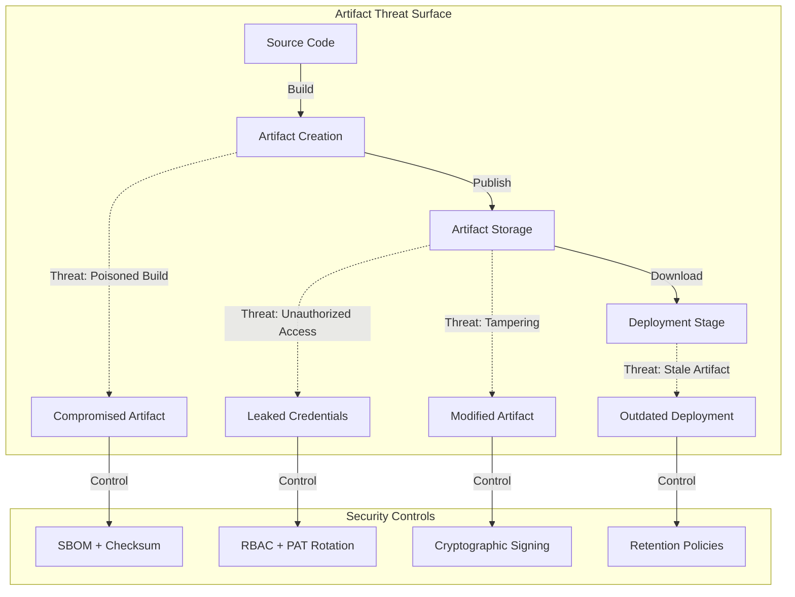
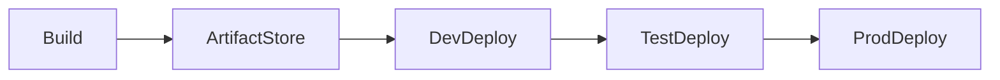
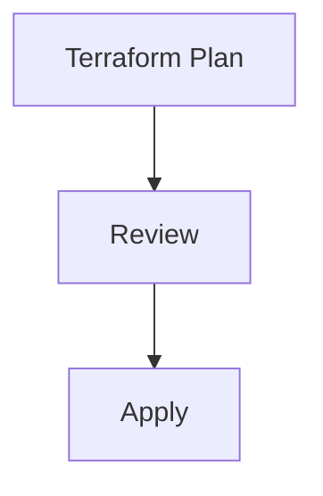
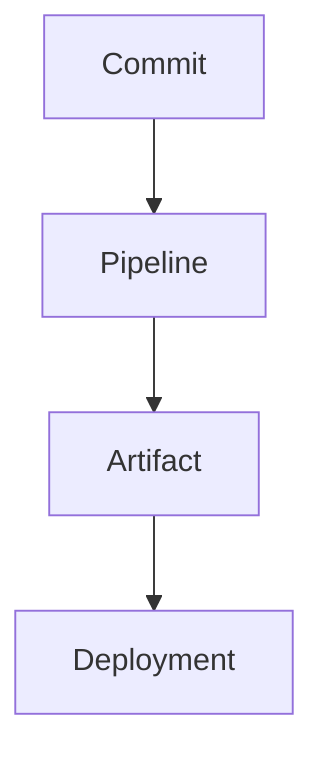

## Table of Contents

1. Scope and Artifact Threat Model  
2. Artifact Types and Classification  
3. Artifact Lifecycle and Promotion Flow  
4. Azure DevOps Artifact Storage Options  
5. Terraform Artifacts and State Outputs  
6. Security, Integrity, and Access Control  
7. Retention, Versioning, and Cleanup  
8. Auditing and Traceability  
9. Anti-Patterns and Common Failures  
10. Tradeoffs and Design Limitations  

---

## Scope and Artifact Threat Model

### Overview

This whitepaper defines **enterprise-grade artifact management practices** for Azure DevOps pipelines. It addresses **pipeline artifacts, package feeds, container images, and Terraform outputs** with a focus on **security, integrity, and compliance**.

### In-Scope Artifacts

| Artifact Type | Purpose | Storage Location | Lifecycle Duration |
|---------------|---------|------------------|-------------------|
| **Pipeline Artifacts** | Inter-stage deployment packages | Azure DevOps (60-day default) | Short-term (build-specific) |
| **Universal Packages** | Versioned binaries, configs | Azure Artifacts feeds | Long-term (immutable) |
| **NuGet/npm/Maven** | Application dependencies | Azure Artifacts feeds | Long-term (versioned) |
| **Container Images** | Containerized applications | Azure Container Registry | Medium-term (tag-based) |
| **Terraform Plans** | Infrastructure change artifacts | Azure Storage (encrypted) | Medium-term (audit trail) |
| **SBOM Files** | Software Bill of Materials | Azure Artifacts (metadata) | Long-term (compliance) |

### Artifact Security Model



### Control Objectives

| Control ID | Objective | Implementation | Compliance Mapping |
|------------|-----------|----------------|-------------------|
| **ART-001** | Artifact Immutability | SHA-256 checksums, artifact signing | NIST 800-171 3.14.1 |
| **ART-002** | Access Control | Feed-level RBAC with Entra ID groups | ISO 27001 A.9.4.1 |
| **ART-003** | Integrity Verification | Pre-deployment checksum validation | SOC 2 CC6.1 |
| **ART-004** | Traceability | Build ID → Artifact → Deployment linking | NIST 800-53 AU-2 |
| **ART-005** | Retention Management | Automated cleanup based on retention policies | GDPR Article 5(1)(e) |
| **ART-006** | Vulnerability Scanning | Container/package scanning pre-promotion | CIS Docker Benchmark 4.5 |

### Compliance Alignment

- **NIST 800-171:** Artifact integrity (3.14), access control (3.1), audit trails (3.3)
- **SOC 2 Type II:** Change management (CC8.1), logical access (CC6.1)
- **ISO 27001:2022:** Asset management (A.8), secure development (A.14)
- **GDPR:** Data retention policies (Article 5), deletion workflows (Article 17)  

---

## Artifact Types and Classification

Artifacts must be explicitly classified.

| Artifact Type | Description |
|--------------|-------------|
| Build Artifacts | Compiled binaries, containers, packages |
| Pipeline Artifacts | Intermediate outputs between stages |
| Terraform Artifacts | Plan files, validation outputs |
| Configuration Artifacts | Versioned config and manifests |

Each artifact type has distinct security and retention requirements.

---

## Artifact Lifecycle and Promotion Flow

Artifacts must move forward through environments without mutation.



Rules:

- Artifacts are immutable once published  
- Promotion reuses the same artifact  
- No rebuilding during promotion  

---

## Azure DevOps Artifact Storage Options

### Pipeline Artifacts

Used for short-lived, stage-to-stage data:

- Terraform plans  
- Validation results  
- Generated manifests  

Characteristics:

- Scoped to pipeline runs  
- Automatically versioned  
- Integrated with YAML pipelines  

### Azure Artifacts

Used for long-lived packages:

- NuGet, npm, Maven, Python  
- Internal reusable libraries  
- Versioned deployment packages  

Feeds are environment-agnostic and access-controlled.

---

## Terraform Artifacts and State Outputs

Terraform produces artifacts that require special handling.



Best practices:

- Store plan files as pipeline artifacts  
- Retain plans for audit and rollback analysis  
- Never regenerate plans in later stages  
- State files remain in secure backends, not artifacts  

Terraform state is **not** a pipeline artifact.

---

## Security, Integrity, and Access Control

### Integrity Controls

- Artifact immutability enforced  
- Checksums validated where applicable  
- Promotion only from trusted sources  

### Access Control

- Read-only access for downstream stages  
- No direct artifact uploads from production stages  
- RBAC enforced on Azure Artifacts feeds  

Secrets must never be packaged as artifacts.

---

## Retention, Versioning, and Cleanup

Retention policies are mandatory.

| Artifact Type | Retention |
|--------------|-----------|
| Pipeline Artifacts | Short-term (days/weeks) |
| Release Packages | Long-term (months/years) |
| Terraform Plans | Policy-defined |
| Logs and Metadata | Compliance-defined |

Automated cleanup prevents cost growth and data leakage.

---

## Auditing and Traceability

Traceability requirements:

- Artifact linked to commit SHA  
- Artifact linked to pipeline run  
- Artifact linked to deployment stage  



This enables full reconstruction of deployment history.

---

## Anti-Patterns and Common Failures

Avoid:

- Rebuilding artifacts per environment  
- Manual artifact promotion  
- Storing secrets in artifacts  
- Unlimited artifact retention  

These patterns break auditability and increase risk.

---

## Tradeoffs and Design Limitations

### Tradeoffs

- Increased storage costs  
- Additional pipeline complexity  

### Benefits

- Deterministic deployments  
- Strong audit posture  
- Reduced supply-chain risk  

---

## Conclusion

Pipeline artifacts and packages are **security-critical assets**. Treating them as immutable, traceable, and governed objects is essential for safe Azure delivery at scale.

---

*End of Document*

---

## Azure DevOps Pipeline Artifacts

### Complete Multi-Stage Pipeline with Artifact Publishing

This pipeline demonstrates **comprehensive artifact management** across build, test, and deployment stages with **integrity validation and promotion controls**.

```yaml
# azure-pipelines-artifacts.yml
trigger:
  branches:
    include: [main, release/*]

variables:
  - name: artifactName
    value: 'app-package'
  - name: buildConfiguration
    value: 'Release'
  - name: packageVersion
    value: '$(Build.BuildNumber)'

stages:
  ###########################################
  # BUILD STAGE: Create and Publish Artifacts
  ###########################################
  - stage: Build
    displayName: 'Build Application and Generate Artifacts'
    jobs:
      - job: BuildJob
        displayName: 'Build, Test, and Package'
        pool:
          vmImage: 'ubuntu-latest'
        steps:
          # Checkout source with full history for traceability
          - checkout: self
            fetchDepth: 0
            displayName: 'Checkout Source Code'

          # Install dependencies
          - task: UseDotNet@2
            displayName: 'Install .NET SDK'
            inputs:
              version: '8.x'

          # Restore NuGet packages
          - task: DotNetCoreCLI@2
            displayName: 'Restore NuGet Packages'
            inputs:
              command: 'restore'
              projects: '**/*.csproj'
              feedsToUse: 'select'
              vstsFeed: 'MyOrg/my-feed'

          # Build application
          - task: DotNetCoreCLI@2
            displayName: 'Build Application'
            inputs:
              command: 'build'
              projects: '**/*.csproj'
              arguments: '--configuration $(buildConfiguration) --no-restore'

          # Run unit tests
          - task: DotNetCoreCLI@2
            displayName: 'Run Unit Tests'
            inputs:
              command: 'test'
              projects: '**/*Tests/*.csproj'
              arguments: '--configuration $(buildConfiguration) --no-build --logger trx'

          # Publish test results
          - task: PublishTestResults@2
            displayName: 'Publish Test Results'
            inputs:
              testResultsFormat: 'VSTest'
              testResultsFiles: '**/*.trx'
              mergeTestResults: true

          # Publish application
          - task: DotNetCoreCLI@2
            displayName: 'Publish Application'
            inputs:
              command: 'publish'
              publishWebProjects: false
              projects: '**/MyApp.csproj'
              arguments: '--configuration $(buildConfiguration) --output $(Build.ArtifactStagingDirectory)/app'
              zipAfterPublish: true

          # Generate SBOM (Software Bill of Materials)
          - task: Bash@3
            displayName: 'Generate SBOM'
            inputs:
              targetType: 'inline'
              script: |
                curl -Lo sbom-tool https://github.com/microsoft/sbom-tool/releases/download/v1.5.0/sbom-tool-linux-x64
                chmod +x sbom-tool
                ./sbom-tool generate \
                  -b $(Build.ArtifactStagingDirectory)/app \
                  -bc $(Build.SourcesDirectory) \
                  -pn MyApp \
                  -pv $(packageVersion) \
                  -ps MyOrg \
                  -nsb https://myorg.com

          # Calculate artifact checksums
          - task: Bash@3
            displayName: 'Generate Artifact Checksums'
            inputs:
              targetType: 'inline'
              script: |
                cd $(Build.ArtifactStagingDirectory)
                find . -type f -name "*.zip" -exec sha256sum {} \; > checksums.txt
                echo "Checksums generated:"
                cat checksums.txt

          # Create artifact metadata
          - task: PowerShell@2
            displayName: 'Create Artifact Metadata'
            inputs:
              targetType: 'inline'
              script: |
                $metadata = @{
                  BuildId = "$(Build.BuildId)"
                  BuildNumber = "$(Build.BuildNumber)"
                  SourceVersion = "$(Build.SourceVersion)"
                  SourceBranch = "$(Build.SourceBranch)"
                  Repository = "$(Build.Repository.Name)"
                  BuildReason = "$(Build.Reason)"
                  BuildTimestamp = (Get-Date -Format "yyyy-MM-ddTHH:mm:ssZ")
                  AgentName = "$(Agent.MachineName)"
                } | ConvertTo-Json -Depth 5
                
                $metadata | Out-File "$(Build.ArtifactStagingDirectory)/artifact-metadata.json"
                Write-Host "Artifact metadata created:"
                Get-Content "$(Build.ArtifactStagingDirectory)/artifact-metadata.json"

          # Publish pipeline artifact
          - task: PublishPipelineArtifact@1
            displayName: 'Publish Pipeline Artifact'
            inputs:
              targetPath: '$(Build.ArtifactStagingDirectory)'
              artifactName: '$(artifactName)'
              artifactType: 'pipeline'

  ###########################################
  # VALIDATION STAGE: Security Scanning
  ###########################################
  - stage: Validation
    displayName: 'Artifact Validation and Security Scanning'
    dependsOn: Build
    jobs:
      - job: ValidateArtifacts
        displayName: 'Validate Artifact Integrity'
        pool:
          vmImage: 'ubuntu-latest'
        steps:
          # Download artifact
          - task: DownloadPipelineArtifact@2
            displayName: 'Download Pipeline Artifact'
            inputs:
              artifactName: '$(artifactName)'
              targetPath: '$(Pipeline.Workspace)/artifacts'

          # Verify checksums
          - task: Bash@3
            displayName: 'Verify Artifact Checksums'
            inputs:
              targetType: 'inline'
              script: |
                cd $(Pipeline.Workspace)/artifacts
                if [ ! -f checksums.txt ]; then
                  echo "##vso[task.logissue type=error]Checksum file not found!"
                  exit 1
                fi
                
                if sha256sum -c checksums.txt; then
                  echo "##vso[task.complete result=Succeeded]All checksums verified successfully"
                else
                  echo "##vso[task.logissue type=error]Checksum verification failed!"
                  exit 1
                fi

          # Scan for secrets
          - task: Bash@3
            displayName: 'Scan for Embedded Secrets'
            inputs:
              targetType: 'inline'
              script: |
                # Install gitleaks
                curl -sSfL https://github.com/gitleaks/gitleaks/releases/download/v8.18.0/gitleaks_8.18.0_linux_x64.tar.gz | tar -xz
                
                # Scan artifact directory
                ./gitleaks detect --source $(Pipeline.Workspace)/artifacts --no-git --verbose
                
                if [ $? -eq 0 ]; then
                  echo "##vso[task.complete result=Succeeded]No secrets detected"
                else
                  echo "##vso[task.logissue type=error]Secrets detected in artifacts!"
                  exit 1
                fi

          # Validate SBOM
          - task: Bash@3
            displayName: 'Validate SBOM'
            inputs:
              targetType: 'inline'
              script: |
                cd $(Pipeline.Workspace)/artifacts
                if [ -f "_manifest/spdx_2.2/manifest.spdx.json" ]; then
                  echo "SBOM found and validated"
                  jq . "_manifest/spdx_2.2/manifest.spdx.json" | head -n 20
                else
                  echo "##vso[task.logissue type=warning]SBOM not found in artifact"
                fi

  ###########################################
  # DEPLOY DEV STAGE
  ###########################################
  - stage: DeployDev
    displayName: 'Deploy to Development'
    dependsOn: Validation
    condition: succeeded()
    variables:
      - group: dev-variables
    jobs:
      - deployment: DeployDevJob
        displayName: 'Deploy to Dev Environment'
        pool:
          vmImage: 'ubuntu-latest'
        environment: 'Development'
        strategy:
          runOnce:
            deploy:
              steps:
                # Download artifact
                - task: DownloadPipelineArtifact@2
                  displayName: 'Download Validated Artifact'
                  inputs:
                    artifactName: '$(artifactName)'
                    targetPath: '$(Pipeline.Workspace)/deploy'

                # Re-verify checksums before deployment
                - task: Bash@3
                  displayName: 'Pre-Deployment Checksum Verification'
                  inputs:
                    targetType: 'inline'
                    script: |
                      cd $(Pipeline.Workspace)/deploy
                      sha256sum -c checksums.txt || exit 1

                # Simulate deployment
                - task: AzureWebApp@1
                  displayName: 'Deploy to Azure Web App'
                  inputs:
                    azureSubscription: 'Azure-Prod-ServiceConnection'
                    appType: 'webAppLinux'
                    appName: '$(devAppName)'
                    package: '$(Pipeline.Workspace)/deploy/app/*.zip'

                # Log deployment metadata
                - task: PowerShell@2
                  displayName: 'Record Deployment Event'
                  inputs:
                    targetType: 'inline'
                    script: |
                      $deploymentEvent = @{
                        Environment = "Development"
                        ArtifactName = "$(artifactName)"
                        BuildId = "$(Build.BuildId)"
                        DeploymentTime = (Get-Date -Format "yyyy-MM-ddTHH:mm:ssZ")
                        DeployedBy = "$(Build.RequestedFor)"
                      } | ConvertTo-Json
                      
                      Write-Host "Deployment Event:"
                      Write-Host $deploymentEvent
                      
                      # Send to Log Analytics (optional)
                      # Invoke-RestMethod -Method Post -Uri "$env:LOG_ANALYTICS_URI" -Body $deploymentEvent

  ###########################################
  # DEPLOY PROD STAGE (with approval gate)
  ###########################################
  - stage: DeployProd
    displayName: 'Deploy to Production'
    dependsOn: DeployDev
    condition: and(succeeded(), eq(variables['Build.SourceBranch'], 'refs/heads/main'))
    variables:
      - group: prod-variables
    jobs:
      - deployment: DeployProdJob
        displayName: 'Deploy to Production Environment'
        pool:
          vmImage: 'ubuntu-latest'
        environment: 'Production'  # Requires manual approval
        strategy:
          runOnce:
            deploy:
              steps:
                # Download artifact (same immutable artifact from build)
                - task: DownloadPipelineArtifact@2
                  displayName: 'Download Production Artifact'
                  inputs:
                    artifactName: '$(artifactName)'
                    targetPath: '$(Pipeline.Workspace)/prod-deploy'

                # Final checksum verification
                - task: Bash@3
                  displayName: 'Production Checksum Verification'
                  inputs:
                    targetType: 'inline'
                    script: |
                      cd $(Pipeline.Workspace)/prod-deploy
                      if ! sha256sum -c checksums.txt; then
                        echo "##vso[task.logissue type=error]Production checksum verification failed!"
                        exit 1
                      fi
                      echo "##vso[task.complete result=Succeeded]Production artifact integrity verified"

                # Deploy to production
                - task: AzureWebApp@1
                  displayName: 'Deploy to Production Web App'
                  inputs:
                    azureSubscription: 'Azure-Prod-ServiceConnection'
                    appType: 'webAppLinux'
                    appName: '$(prodAppName)'
                    package: '$(Pipeline.Workspace)/prod-deploy/app/*.zip'
                    deploymentMethod: 'zipDeploy'

                # Tag release in Git
                - task: Bash@3
                  displayName: 'Tag Production Release'
                  inputs:
                    targetType: 'inline'
                    script: |
                      git config user.email "azuredevops@myorg.com"
                      git config user.name "Azure DevOps"
                      git tag -a "prod-$(Build.BuildNumber)" -m "Production deployment"
                      git push origin "prod-$(Build.BuildNumber)"
```

### Universal Package Publishing Pattern

Universal Packages provide **versioned, immutable artifact storage** suitable for deployment packages, configuration files, and binaries.

```yaml
# Publish Universal Package
- task: UniversalPackages@0
  displayName: 'Publish Universal Package'
  inputs:
    command: 'publish'
    publishDirectory: '$(Build.ArtifactStagingDirectory)/package'
    feedsToUsePublish: 'internal'
    vstsFeedPublish: 'MyOrg/my-feed'
    vstsFeedPackagePublish: 'myapp-deployment-package'
    versionOption: 'custom'
    versionPublish: '$(packageVersion)'
    packagePublishDescription: 'Deployment package for build $(Build.BuildNumber)'

# Download Universal Package in deployment stage
- task: UniversalPackages@0
  displayName: 'Download Universal Package'
  inputs:
    command: 'download'
    downloadDirectory: '$(Pipeline.Workspace)/package'
    feedsToUse: 'internal'
    vstsFeed: 'MyOrg/my-feed'
    vstsFeedPackage: 'myapp-deployment-package'
    vstsPackageVersion: '$(packageVersion)'
```

### NuGet Package Publishing

```yaml
# Publish NuGet Package to Azure Artifacts Feed
- task: DotNetCoreCLI@2
  displayName: 'Pack NuGet Package'
  inputs:
    command: 'pack'
    packagesToPack: '**/MyLibrary.csproj'
    versioningScheme: 'byBuildNumber'
    configuration: '$(buildConfiguration)'

- task: NuGetCommand@2
  displayName: 'Push NuGet Package to Feed'
  inputs:
    command: 'push'
    packagesToPush: '$(Build.ArtifactStagingDirectory)/**/*.nupkg'
    nuGetFeedType: 'internal'
    publishVstsFeed: 'MyOrg/my-feed'
    allowPackageConflicts: false
```

### npm Package Publishing

```yaml
# Publish npm Package to Azure Artifacts
- task: Npm@1
  displayName: 'Install npm Dependencies'
  inputs:
    command: 'install'
    workingDir: '$(Build.SourcesDirectory)/frontend'
    customRegistry: 'useFeed'
    customFeed: 'MyOrg/my-feed'

- task: Npm@1
  displayName: 'Build npm Package'
  inputs:
    command: 'custom'
    workingDir: '$(Build.SourcesDirectory)/frontend'
    customCommand: 'run build'

- task: Npm@1
  displayName: 'Publish npm Package'
  inputs:
    command: 'publish'
    workingDir: '$(Build.SourcesDirectory)/frontend'
    publishRegistry: 'useFeed'
    publishFeed: 'MyOrg/my-feed'
```

### Python Package Publishing

```yaml
# Publish Python Package to Azure Artifacts
- task: UsePythonVersion@0
  displayName: 'Use Python 3.11'
  inputs:
    versionSpec: '3.11'

- task: Bash@3
  displayName: 'Build Python Package'
  inputs:
    targetType: 'inline'
    script: |
      python -m pip install --upgrade pip setuptools wheel twine
      python setup.py sdist bdist_wheel

- task: TwineAuthenticate@1
  displayName: 'Authenticate with Azure Artifacts'
  inputs:
    artifactFeed: 'MyOrg/my-feed'

- task: Bash@3
  displayName: 'Publish Python Package'
  inputs:
    targetType: 'inline'
    script: |
      python -m twine upload -r my-feed --config-file $(PYPIRC_PATH) dist/*
```

---

## Azure Artifacts Feeds and Package Management

### Terraform Feed Configuration

This Terraform configuration creates **Azure Artifacts feeds with RBAC permissions** and **upstream sources**.

```hcl
# azure-artifacts-feeds.tf
terraform {
  required_providers {
    azuredevops = {
      source  = "microsoft/azuredevops"
      version = "~> 1.1"
    }
  }
}

provider "azuredevops" {
  org_service_url = "https://dev.azure.com/MyOrg"
}

# Create Azure Artifacts Feed for Application Packages
resource "azuredevops_feed" "app_packages" {
  name = "app-packages"
  project_id = azuredevops_project.main.id
  
  features {
    restore      = true
    retention    = true
  }
}

# Create Azure Artifacts Feed for Infrastructure Packages
resource "azuredevops_feed" "infrastructure" {
  name = "infrastructure-packages"
  project_id = azuredevops_project.main.id
}

# Configure Feed Permissions for App Packages
resource "azuredevops_feed_permission" "app_packages_contributors" {
  feed_id    = azuredevops_feed.app_packages.id
  role       = "contributor"
  identity_descriptor = data.azuredevops_group.contributors.descriptor
}

resource "azuredevops_feed_permission" "app_packages_readers" {
  feed_id    = azuredevops_feed.app_packages.id
  role       = "reader"
  identity_descriptor = data.azuredevops_group.readers.descriptor
}

# Configure Upstream Sources for NuGet
resource "azuredevops_feed_upstream" "nuget_upstream" {
  feed_id     = azuredevops_feed.app_packages.id
  upstream_id = "nuget-upstream"
  name        = "NuGet Gallery"
  protocol    = "nuget"
  location    = "https://api.nuget.org/v3/index.json"
}

# Configure Upstream Sources for npm
resource "azuredevops_feed_upstream" "npm_upstream" {
  feed_id     = azuredevops_feed.app_packages.id
  upstream_id = "npm-upstream"
  name        = "npm Registry"
  protocol    = "npm"
  location    = "https://registry.npmjs.org/"
}

# Configure Feed Views for Environment Promotion
resource "azuredevops_feed_view" "release_view" {
  feed_id = azuredevops_feed.app_packages.id
  name    = "Release"
  visibility = "organization"
}

resource "azuredevops_feed_view" "prerelease_view" {
  feed_id = azuredevops_feed.app_packages.id
  name    = "Prerelease"
  visibility = "private"
}

# Data source for Entra ID groups
data "azuredevops_group" "contributors" {
  project_id = azuredevops_project.main.id
  name       = "Build Service Contributors"
}

data "azuredevops_group" "readers" {
  project_id = azuredevops_project.main.id
  name       = "Package Readers"
}

# Outputs for service connection configuration
output "app_packages_feed_url" {
  value = "https://pkgs.dev.azure.com/MyOrg/_packaging/app-packages/nuget/v3/index.json"
  description = "NuGet feed URL for application packages"
}

output "app_packages_feed_id" {
  value = azuredevops_feed.app_packages.id
  description = "Feed ID for programmatic access"
}
```

### Feed Retention Policy Configuration

```hcl
# Configure retention policies for feed cleanup
resource "azuredevops_feed_retention_policy" "app_packages_retention" {
  feed_id = azuredevops_feed.app_packages.id
  
  # Delete packages older than 90 days with 0 downloads
  count_limit                = 1000
  days_to_keep_recently_downloaded_packages = 90
}
```

### Service Connection for Feed Access

```yaml
# Configure service connection in pipeline
resources:
  repositories:
    - repository: self
  
  # Azure Artifacts service connection
  serviceConnections:
    - serviceConnection: 'AzureArtifacts-AppPackages'
      displayName: 'Azure Artifacts Feed Access'
```


---

## Container Image Management

### Container Build and Push to Azure Container Registry

```yaml
# Container image build and publish pipeline
stages:
  - stage: BuildContainerImage
    displayName: 'Build and Push Container Image'
    jobs:
      - job: BuildImage
        displayName: 'Build Docker Image'
        pool:
          vmImage: 'ubuntu-latest'
        steps:
          # Build Docker image
          - task: Docker@2
            displayName: 'Build Container Image'
            inputs:
              command: 'build'
              repository: 'myapp'
              dockerfile: '$(Build.SourcesDirectory)/Dockerfile'
              tags: |
                $(Build.BuildNumber)
                latest
              arguments: '--build-arg VERSION=$(Build.BuildNumber)'

          # Scan image for vulnerabilities
          - task: Bash@3
            displayName: 'Scan Image with Trivy'
            inputs:
              targetType: 'inline'
              script: |
                # Install Trivy
                curl -sfL https://raw.githubusercontent.com/aquasecurity/trivy/main/contrib/install.sh | sh -s -- -b /usr/local/bin
                
                # Scan image
                trivy image --severity HIGH,CRITICAL --exit-code 1 myapp:$(Build.BuildNumber)

          # Login to Azure Container Registry
          - task: Docker@2
            displayName: 'Login to ACR'
            inputs:
              command: 'login'
              containerRegistry: 'ACR-ServiceConnection'

          # Tag image for ACR
          - task: Docker@2
            displayName: 'Tag Image for ACR'
            inputs:
              command: 'tag'
              arguments: 'myapp:$(Build.BuildNumber) myregistry.azurecr.io/myapp:$(Build.BuildNumber)'

          # Push to Azure Container Registry
          - task: Docker@2
            displayName: 'Push to Azure Container Registry'
            inputs:
              command: 'push'
              containerRegistry: 'ACR-ServiceConnection'
              repository: 'myapp'
              tags: |
                $(Build.BuildNumber)
                latest

          # Generate image manifest and SBOM
          - task: Bash@3
            displayName: 'Generate Container SBOM'
            inputs:
              targetType: 'inline'
              script: |
                docker run --rm \
                  -v /var/run/docker.sock:/var/run/docker.sock \
                  -v $(Build.ArtifactStagingDirectory):/out \
                  anchore/syft:latest \
                  myregistry.azurecr.io/myapp:$(Build.BuildNumber) \
                  -o spdx-json=/out/container-sbom.json

          # Publish SBOM as artifact
          - task: PublishPipelineArtifact@1
            displayName: 'Publish Container SBOM'
            inputs:
              targetPath: '$(Build.ArtifactStagingDirectory)/container-sbom.json'
              artifactName: 'container-sbom'
```

### Multi-Architecture Container Builds

```yaml
# Build multi-platform container images
- task: Bash@3
  displayName: 'Build Multi-Architecture Image'
  inputs:
    targetType: 'inline'
    script: |
      # Enable Docker buildx
      docker buildx create --name multiarch --use
      
      # Build for multiple architectures
      docker buildx build \
        --platform linux/amd64,linux/arm64 \
        --tag myregistry.azurecr.io/myapp:$(Build.BuildNumber) \
        --tag myregistry.azurecr.io/myapp:latest \
        --push \
        --file Dockerfile \
        --build-arg VERSION=$(Build.BuildNumber) \
        .
```

### ACR Terraform Configuration

```hcl
# azure-container-registry.tf
resource "azurerm_container_registry" "main" {
  name                = "myregistry"
  resource_group_name = azurerm_resource_group.main.name
  location            = azurerm_resource_group.main.location
  sku                 = "Premium"
  admin_enabled       = false

  # Enable content trust for image signing
  trust_policy {
    enabled = true
  }

  # Enable vulnerability scanning
  quarantine_policy_enabled = true

  # Configure network access
  network_rule_set {
    default_action = "Deny"
    
    ip_rule {
      action   = "Allow"
      ip_range = "10.0.0.0/16"  # Corporate network
    }
  }

  # Configure georeplications for high availability
  georeplications {
    location = "eastus"
    zone_redundancy_enabled = true
  }

  # Enable private endpoint
  public_network_access_enabled = false
}

# Private endpoint for ACR
resource "azurerm_private_endpoint" "acr" {
  name                = "acr-private-endpoint"
  location            = azurerm_resource_group.main.location
  resource_group_name = azurerm_resource_group.main.name
  subnet_id           = azurerm_subnet.private_endpoints.id

  private_service_connection {
    name                           = "acr-connection"
    private_connection_resource_id = azurerm_container_registry.main.id
    is_manual_connection           = false
    subresource_names              = ["registry"]
  }
}

# RBAC assignments for ACR
resource "azurerm_role_assignment" "acr_pull" {
  scope                = azurerm_container_registry.main.id
  role_definition_name = "AcrPull"
  principal_id         = azurerm_kubernetes_cluster.main.kubelet_identity[0].object_id
}

resource "azurerm_role_assignment" "acr_push" {
  scope                = azurerm_container_registry.main.id
  role_definition_name = "AcrPush"
  principal_id         = data.azuread_service_principal.build_agent.object_id
}
```

---

## Terraform Artifacts and Plan Management

### Terraform Plan Artifact Publishing

```yaml
# Terraform pipeline with plan artifact management
stages:
  - stage: TerraformPlan
    displayName: 'Terraform Plan'
    jobs:
      - job: Plan
        displayName: 'Generate Terraform Plan'
        pool:
          vmImage: 'ubuntu-latest'
        steps:
          # Install Terraform
          - task: TerraformInstaller@0
            displayName: 'Install Terraform'
            inputs:
              terraformVersion: '1.7.0'

          # Initialize Terraform
          - task: TerraformTaskV4@4
            displayName: 'Terraform Init'
            inputs:
              provider: 'azurerm'
              command: 'init'
              workingDirectory: '$(Build.SourcesDirectory)/terraform'
              backendServiceArm: 'Azure-Prod-ServiceConnection'
              backendAzureRmResourceGroupName: 'terraform-state-rg'
              backendAzureRmStorageAccountName: 'tfstatestorage'
              backendAzureRmContainerName: 'tfstate'
              backendAzureRmKey: 'prod.tfstate'

          # Validate Terraform
          - task: TerraformTaskV4@4
            displayName: 'Terraform Validate'
            inputs:
              provider: 'azurerm'
              command: 'validate'
              workingDirectory: '$(Build.SourcesDirectory)/terraform'

          # Run Terraform Plan
          - task: TerraformTaskV4@4
            displayName: 'Terraform Plan'
            inputs:
              provider: 'azurerm'
              command: 'plan'
              workingDirectory: '$(Build.SourcesDirectory)/terraform'
              environmentServiceNameAzureRM: 'Azure-Prod-ServiceConnection'
              commandOptions: '-out=$(Build.ArtifactStagingDirectory)/tfplan.bin -detailed-exitcode'

          # Convert binary plan to JSON
          - task: Bash@3
            displayName: 'Convert Plan to JSON'
            inputs:
              targetType: 'inline'
              workingDirectory: '$(Build.SourcesDirectory)/terraform'
              script: |
                terraform show -json $(Build.ArtifactStagingDirectory)/tfplan.bin > $(Build.ArtifactStagingDirectory)/tfplan.json

          # Generate plan summary
          - task: PowerShell@2
            displayName: 'Generate Plan Summary'
            inputs:
              targetType: 'inline'
              script: |
                $planJson = Get-Content "$(Build.ArtifactStagingDirectory)/tfplan.json" | ConvertFrom-Json
                
                $summary = @{
                  BuildId = "$(Build.BuildId)"
                  PlanTimestamp = (Get-Date -Format "yyyy-MM-ddTHH:mm:ssZ")
                  ResourceChanges = $planJson.resource_changes.Count
                  ToCreate = ($planJson.resource_changes | Where-Object { $_.change.actions -contains 'create' }).Count
                  ToUpdate = ($planJson.resource_changes | Where-Object { $_.change.actions -contains 'update' }).Count
                  ToDelete = ($planJson.resource_changes | Where-Object { $_.change.actions -contains 'delete' }).Count
                } | ConvertTo-Json -Depth 5
                
                $summary | Out-File "$(Build.ArtifactStagingDirectory)/plan-summary.json"
                Write-Host "Plan Summary:"
                Write-Host $summary

          # Run Checkov security scan
          - task: Bash@3
            displayName: 'Security Scan with Checkov'
            inputs:
              targetType: 'inline'
              script: |
                pip install checkov
                checkov -f $(Build.ArtifactStagingDirectory)/tfplan.json --framework terraform_plan --output json > $(Build.ArtifactStagingDirectory)/checkov-results.json || true

          # Calculate plan checksum
          - task: Bash@3
            displayName: 'Generate Plan Checksum'
            inputs:
              targetType: 'inline'
              script: |
                cd $(Build.ArtifactStagingDirectory)
                sha256sum tfplan.bin > tfplan.sha256
                cat tfplan.sha256

          # Publish Terraform plan artifact
          - task: PublishPipelineArtifact@1
            displayName: 'Publish Terraform Plan Artifact'
            inputs:
              targetPath: '$(Build.ArtifactStagingDirectory)'
              artifactName: 'terraform-plan'

  - stage: TerraformApply
    displayName: 'Terraform Apply'
    dependsOn: TerraformPlan
    condition: succeeded()
    jobs:
      - deployment: Apply
        displayName: 'Apply Terraform Plan'
        pool:
          vmImage: 'ubuntu-latest'
        environment: 'Production-Infrastructure'
        strategy:
          runOnce:
            deploy:
              steps:
                # Download Terraform plan artifact
                - task: DownloadPipelineArtifact@2
                  displayName: 'Download Terraform Plan'
                  inputs:
                    artifactName: 'terraform-plan'
                    targetPath: '$(Pipeline.Workspace)/tfplan'

                # Verify plan checksum
                - task: Bash@3
                  displayName: 'Verify Plan Checksum'
                  inputs:
                    targetType: 'inline'
                    script: |
                      cd $(Pipeline.Workspace)/tfplan
                      if ! sha256sum -c tfplan.sha256; then
                        echo "##vso[task.logissue type=error]Terraform plan checksum verification failed!"
                        exit 1
                      fi
                      echo "Plan integrity verified"

                # Install Terraform
                - task: TerraformInstaller@0
                  displayName: 'Install Terraform'
                  inputs:
                    terraformVersion: '1.7.0'

                # Initialize Terraform (same backend config)
                - task: TerraformTaskV4@4
                  displayName: 'Terraform Init'
                  inputs:
                    provider: 'azurerm'
                    command: 'init'
                    workingDirectory: '$(Build.SourcesDirectory)/terraform'
                    backendServiceArm: 'Azure-Prod-ServiceConnection'
                    backendAzureRmResourceGroupName: 'terraform-state-rg'
                    backendAzureRmStorageAccountName: 'tfstatestorage'
                    backendAzureRmContainerName: 'tfstate'
                    backendAzureRmKey: 'prod.tfstate'

                # Apply Terraform plan
                - task: TerraformTaskV4@4
                  displayName: 'Terraform Apply'
                  inputs:
                    provider: 'azurerm'
                    command: 'apply'
                    workingDirectory: '$(Build.SourcesDirectory)/terraform'
                    environmentServiceNameAzureRM: 'Azure-Prod-ServiceConnection'
                    commandOptions: '$(Pipeline.Workspace)/tfplan/tfplan.bin'

                # Archive plan to Azure Storage for audit trail
                - task: AzureCLI@2
                  displayName: 'Archive Plan to Storage'
                  inputs:
                    azureSubscription: 'Azure-Prod-ServiceConnection'
                    scriptType: 'bash'
                    scriptLocation: 'inlineScript'
                    inlineScript: |
                      az storage blob upload \
                        --account-name tfplanarchive \
                        --container-name plans \
                        --name "$(Build.BuildId)/tfplan.bin" \
                        --file $(Pipeline.Workspace)/tfplan/tfplan.bin \
                        --metadata "buildId=$(Build.BuildId)" "buildNumber=$(Build.BuildNumber)" "timestamp=$(date -u +%Y-%m-%dT%H:%M:%SZ)"
```

### Terraform State Backend with Encryption

```hcl
# terraform-backend.tf
terraform {
  backend "azurerm" {
    resource_group_name  = "terraform-state-rg"
    storage_account_name = "tfstatestorage"
    container_name       = "tfstate"
    key                  = "prod.tfstate"
    
    # Enable encryption
    use_microsoft_graph = true
    use_oidc            = true
  }
}

# Storage account for Terraform state (with encryption)
resource "azurerm_storage_account" "tfstate" {
  name                     = "tfstatestorage"
  resource_group_name      = azurerm_resource_group.state.name
  location                 = azurerm_resource_group.state.location
  account_tier             = "Standard"
  account_replication_type = "GRS"
  
  # Enable encryption with customer-managed keys
  customer_managed_key {
    key_vault_key_id          = azurerm_key_vault_key.tfstate.id
    user_assigned_identity_id = azurerm_user_assigned_identity.tfstate.id
  }

  # Enable blob versioning for state history
  blob_properties {
    versioning_enabled = true
    
    delete_retention_policy {
      days = 30
    }
  }

  # Disable public access
  public_network_access_enabled = false
}

# State locking with Azure Storage
resource "azurerm_storage_container" "tfstate" {
  name                  = "tfstate"
  storage_account_name  = azurerm_storage_account.tfstate.name
  container_access_type = "private"
}
```

---

## Artifact Integrity and Checksum Validation

### PowerShell Checksum Validation Module

```powershell
# ArtifactIntegrity.psm1
function New-ArtifactChecksum {
    [CmdletBinding()]
    param(
        [Parameter(Mandatory=$true)]
        [string]$ArtifactPath,
        
        [Parameter(Mandatory=$false)]
        [string]$OutputFile = "checksums.txt",
        
        [Parameter(Mandatory=$false)]
        [ValidateSet('SHA256', 'SHA512')]
        [string]$Algorithm = 'SHA256'
    )
    
    $checksums = @()
    
    Get-ChildItem -Path $ArtifactPath -Recurse -File | ForEach-Object {
        $hash = Get-FileHash -Path $_.FullName -Algorithm $Algorithm
        $relativePath = $_.FullName.Replace($ArtifactPath, '').TrimStart('\', '/')
        
        $checksums += [PSCustomObject]@{
            File      = $relativePath
            Algorithm = $Algorithm
            Hash      = $hash.Hash
            Size      = $_.Length
            Modified  = $_.LastWriteTimeUtc.ToString('o')
        }
        
        Write-Verbose "Generated $Algorithm hash for: $relativePath"
    }
    
    # Export to JSON
    $outputPath = Join-Path -Path $ArtifactPath -ChildPath $OutputFile
    $checksums | ConvertTo-Json -Depth 5 | Out-File -FilePath $outputPath -Encoding UTF8
    
    Write-Host "Checksums written to: $outputPath"
    return $checksums
}

function Test-ArtifactIntegrity {
    [CmdletBinding()]
    param(
        [Parameter(Mandatory=$true)]
        [string]$ArtifactPath,
        
        [Parameter(Mandatory=$true)]
        [string]$ChecksumFile
    )
    
    $checksumFilePath = Join-Path -Path $ArtifactPath -ChildPath $ChecksumFile
    
    if (-not (Test-Path -Path $checksumFilePath)) {
        Write-Error "Checksum file not found: $checksumFilePath"
        return $false
    }
    
    $expectedChecksums = Get-Content -Path $checksumFilePath -Raw | ConvertFrom-Json
    $failures = @()
    
    foreach ($expected in $expectedChecksums) {
        $filePath = Join-Path -Path $ArtifactPath -ChildPath $expected.File
        
        if (-not (Test-Path -Path $filePath)) {
            $failures += "Missing file: $($expected.File)"
            continue
        }
        
        $actual = Get-FileHash -Path $filePath -Algorithm $expected.Algorithm
        
        if ($actual.Hash -ne $expected.Hash) {
            $failures += "Checksum mismatch: $($expected.File) (Expected: $($expected.Hash), Actual: $($actual.Hash))"
        } else {
            Write-Verbose "Verified: $($expected.File)"
        }
    }
    
    if ($failures.Count -gt 0) {
        Write-Error "Integrity verification failed:"
        $failures | ForEach-Object { Write-Error $_ }
        return $false
    }
    
    Write-Host "##vso[task.complete result=Succeeded]All artifacts verified successfully"
    return $true
}

function Sign-Artifact {
    [CmdletBinding()]
    param(
        [Parameter(Mandatory=$true)]
        [string]$ArtifactPath,
        
        [Parameter(Mandatory=$true)]
        [string]$CertificateThumbprint,
        
        [Parameter(Mandatory=$false)]
        [string]$TimestampServer = 'http://timestamp.digicert.com'
    )
    
    $cert = Get-ChildItem -Path Cert:\CurrentUser\My | Where-Object { $_.Thumbprint -eq $CertificateThumbprint }
    
    if (-not $cert) {
        Write-Error "Certificate not found: $CertificateThumbprint"
        return $false
    }
    
    Get-ChildItem -Path $ArtifactPath -Filter "*.dll" -Recurse | ForEach-Object {
        Set-AuthenticodeSignature -FilePath $_.FullName -Certificate $cert -TimestampServer $TimestampServer
        Write-Host "Signed: $($_.Name)"
    }
    
    return $true
}

Export-ModuleMember -Function New-ArtifactChecksum, Test-ArtifactIntegrity, Sign-Artifact
```

### Bash Checksum Validation Script

```bash
#!/bin/bash
# artifact-integrity.sh

set -euo pipefail

generate_checksums() {
    local artifact_path="$1"
    local output_file="${2:-checksums.txt}"
    
    echo "Generating checksums for artifacts in: $artifact_path"
    
    cd "$artifact_path"
    find . -type f ! -name "$output_file" -exec sha256sum {} \; > "$output_file"
    
    echo "Checksums generated: $output_file"
    cat "$output_file"
}

verify_checksums() {
    local artifact_path="$1"
    local checksum_file="${2:-checksums.txt}"
    
    if [ ! -f "$artifact_path/$checksum_file" ]; then
        echo "##vso[task.logissue type=error]Checksum file not found: $checksum_file"
        exit 1
    fi
    
    cd "$artifact_path"
    
    if sha256sum -c "$checksum_file"; then
        echo "##vso[task.complete result=Succeeded]All checksums verified successfully"
        return 0
    else
        echo "##vso[task.logissue type=error]Checksum verification failed!"
        exit 1
    fi
}

sign_artifact() {
    local artifact_path="$1"
    local signing_key="$2"
    
    echo "Signing artifacts with GPG key: $signing_key"
    
    find "$artifact_path" -type f -name "*.tar.gz" -o -name "*.zip" | while read -r file; do
        gpg --detach-sign --armor --local-user "$signing_key" "$file"
        echo "Signed: $file"
    done
}

verify_signatures() {
    local artifact_path="$1"
    
    find "$artifact_path" -type f -name "*.asc" | while read -r sig_file; do
        original_file="${sig_file%.asc}"
        
        if gpg --verify "$sig_file" "$original_file"; then
            echo "Signature verified: $original_file"
        else
            echo "##vso[task.logissue type=error]Signature verification failed: $original_file"
            exit 1
        fi
    done
}

# Main execution
case "${1:-}" in
    generate)
        generate_checksums "${2:-.}" "${3:-checksums.txt}"
        ;;
    verify)
        verify_checksums "${2:-.}" "${3:-checksums.txt}"
        ;;
    sign)
        sign_artifact "${2:-.}" "${3}"
        ;;
    verify-sig)
        verify_signatures "${2:-.}"
        ;;
    *)
        echo "Usage: $0 {generate|verify|sign|verify-sig} [artifact_path] [options]"
        exit 1
        ;;
esac
```


---

## Security, Access Control, and RBAC

### Feed Permissions Matrix

| Role | Permissions | Use Case | Assignment Method |
|------|-------------|----------|-------------------|
| **Reader** | Download packages, view feed | Development teams consuming packages | Entra ID group |
| **Collaborator** | Reader + upload packages | CI/CD pipelines publishing artifacts | Service principal |
| **Contributor** | Collaborator + promote to views | Release managers | Entra ID group |
| **Owner** | All permissions + feed management | Platform/DevOps teams | Entra ID group (restricted) |

### Personal Access Token (PAT) Management

```powershell
# PAT-Rotation-Script.ps1
# Automate PAT rotation for Azure Artifacts feeds

param(
    [Parameter(Mandatory=$true)]
    [string]$OrganizationUrl,
    
    [Parameter(Mandatory=$true)]
    [string]$FeedName,
    
    [Parameter(Mandatory=$false)]
    [int]$ExpirationDays = 90
)

$ErrorActionPreference = "Stop"

# Get existing PAT from Key Vault
$existingPat = Get-AzKeyVaultSecret -VaultName "devops-keyvault" -Name "AzureArtifacts-PAT" -AsPlainText

# Create new PAT via Azure DevOps REST API
$headers = @{
    Authorization = "Basic $([Convert]::ToBase::FromString(":$existingPat"))"
    'Content-Type' = 'application/json'
}

$body = @{
    displayName = "Azure Artifacts Feed Access - $(Get-Date -Format 'yyyy-MM-dd')"
    scope = "vso.packaging"
    validTo = (Get-Date).AddDays($ExpirationDays).ToString('o')
    allOrgs = $false
} | ConvertTo-Json

$newPatResponse = Invoke-RestMethod -Method Post -Uri "$OrganizationUrl/_apis/tokens/pats?api-version=7.1-preview.1" -Headers $headers -Body $body

$newPat = $newPatResponse.patToken.token

# Update Key Vault with new PAT
$secureString = ConvertTo-SecureString -String $newPat -AsPlainText -Force
Set-AzKeyVaultSecret -VaultName "devops-keyvault" -Name "AzureArtifacts-PAT" -SecretValue $secureString

# Revoke old PAT after grace period
Start-Sleep -Seconds 300  # 5-minute grace period

$revoke Body = @{
    authorizationId = $existingPatAuthId
} | ConvertTo-Json

Invoke-RestMethod -Method Delete -Uri "$OrganizationUrl/_apis/tokens/pats?api-version=7.1-preview.1" -Headers $headers -Body $revokeBody

Write-Host "PAT rotated successfully. New PAT stored in Key Vault."
```

### Service Connection Security

```yaml
# Secure service connection configuration
resources:
  serviceConnections:
    - serviceConnection: 'AzureArtifacts-Feed'
      displayName: 'Azure Artifacts Service Connection'
      # Restrict to specific pipelines
      pipelineAuthorization:
        authorizedPipelines:
          - 'Build-Pipeline'
          - 'Release-Pipeline'
        authorizeAll: false
```

### Feed-Level Access Control (Terraform)

```hcl
# Configure granular feed permissions
resource "azuredevops_feed_permission" "build_contributors" {
  feed_id    = azuredevops_feed.main.id
  role       = "contributor"
  identity_descriptor = data.azuredevops_group.build_service.descriptor
}

resource "azuredevops_feed_permission" "dev_readers" {
  feed_id    = azuredevops_feed.main.id
  role       = "reader"
  identity_descriptor = data.azuredevops_group.developers.descriptor
}

# Upstream source permissions
resource "azuredevops_feed_upstream_permission" "nuget_upstream" {
  feed_id     = azuredevops_feed.main.id
  upstream_id = azuredevops_feed_upstream.nuget.id
  role        = "collaborator"
  identity_descriptor = data.azuredevops_group.build_service.descriptor
}
```

### Artifact Signing with Azure Key Vault

```yaml
# Sign artifacts using certificates from Key Vault
- task: AzureKeyVault@2
  displayName: 'Retrieve Signing Certificate'
  inputs:
    azureSubscription: 'Azure-Prod-ServiceConnection'
    keyVaultName: 'signing-keyvault'
    secretsFilter: 'code-signing-cert'
    runAsPreJob: false

- task: PowerShell@2
  displayName: 'Sign Artifacts'
  inputs:
    targetType: 'inline'
    script: |
      $pfxBytes = [Convert]::FromBase64String($env:CODE_SIGNING_CERT)
      $pfxPath = "$env:TEMP\signing-cert.pfx"
      [System.IO.File]::WriteAllBytes($pfxPath, $pfxBytes)
      
      $cert = Get-PfxCertificate -FilePath $pfxPath
      
      Get-ChildItem "$(Build.ArtifactStagingDirectory)" -Filter "*.dll" -Recurse | ForEach-Object {
        Set-AuthenticodeSignature -FilePath $_.FullName -Certificate $cert -TimestampServer "http://timestamp.digicert.com"
      }
      
      Remove-Item $pfxPath -Force
```

---

## Retention Policies and Cleanup Automation

### Azure DevOps Retention Policy Configuration

```yaml
# Configure pipeline artifact retention
resources:
  pipelines:
    - pipeline: main-build
      source: BuildPipeline
      # Retention settings
      trigger:
        enabled: true
      retentionPolicy:
        daysToKeep: 60
        minimumToKeep: 10
        deleteBuildRecord: false
        deleteTestResults: false
```

### PowerShell Feed Cleanup Script

```powershell
# Feed-Cleanup-Automation.ps1
# Automate cleanup of old packages from Azure Artifacts feeds

param(
    [Parameter(Mandatory=$true)]
    [string]$OrganizationUrl,
    
    [Parameter(Mandatory=$true)]
    [string]$FeedName,
    
    [Parameter(Mandatory=$false)]
    [int]$RetentionDays = 90,
    
    [Parameter(Mandatory=$false)]
    [int]$MinimumDownloads = 0
)

$ErrorActionPreference = "Stop"

# Authenticate with Azure DevOps
$pat = Get-AzKeyVaultSecret -VaultName "devops-keyvault" -Name "AzureArtifacts-PAT" -AsPlainText
$base64AuthInfo = [Convert]::ToBase64String([Text.Encoding]::ASCII.GetBytes(":$pat"))
$headers = @{ Authorization = "Basic $base64AuthInfo" }

# Get feed details
$feedUrl = "$OrganizationUrl/_apis/packaging/feeds/$FeedName/packages?api-version=7.1-preview.1"
$packages = Invoke-RestMethod -Uri $feedUrl -Headers $headers

$cutoffDate = (Get-Date).AddDays(-$RetentionDays)
$deletedCount = 0

foreach ($package in $packages.value) {
    $versionsUrl = "$OrganizationUrl/_apis/packaging/feeds/$FeedName/packages/$($package.id)/versions?api-version=7.1-preview.1"
    $versions = Invoke-RestMethod -Uri $versionsUrl -Headers $headers
    
    foreach ($version in $versions.value) {
        $publishDate = [DateTime]::Parse($version.publishDate)
        $downloads = $version.views.prerelease.downloadCount ?? 0
        
        if ($publishDate -lt $cutoffDate -and $downloads -le $MinimumDownloads) {
            Write-Host "Deleting: $($package.name) version $($version.version) (Published: $publishDate, Downloads: $downloads)"
            
            $deleteUrl = "$OrganizationUrl/_apis/packaging/feeds/$FeedName/packages/$($package.id)/versions/$($version.id)?api-version=7.1-preview.1"
            Invoke-RestMethod -Method Delete -Uri $deleteUrl -Headers $headers
            
            $deletedCount++
        }
    }
}

Write-Host "Cleanup complete. Deleted $deletedCount package versions."

# Send metrics to Azure Monitor
$customMetric = @{
    time = (Get-Date -Format "o")
    data = @{
        baseData = @{
            metric = "PackageCleanup"
            namespace = "AzureArtifacts"
            dimNames = @("Feed", "Action")
            series = @(
                @{
                    dimValues = @($FeedName, "Deleted")
                    count = $deletedCount
                }
            )
        }
    }
} | ConvertTo-Json -Depth 10

$workspaceId = "<LOG_ANALYTICS_WORKSPACE_ID>"
$sharedKey = Get-AzKeyVaultSecret -VaultName "devops-keyvault" -Name "LogAnalytics-SharedKey" -AsPlainText

# Send to Log Analytics (implementation omitted for brevity)
```

### Automated Cleanup Pipeline

```yaml
# artifact-cleanup-pipeline.yml
schedules:
  - cron: "0 2 * * 0"  # Weekly on Sunday at 2 AM
    displayName: 'Weekly Artifact Cleanup'
    branches:
      include:
        - main
    always: true

pool:
  vmImage: 'ubuntu-latest'

steps:
  # Cleanup Azure DevOps pipeline artifacts
  - task: PowerShell@2
    displayName: 'Cleanup Pipeline Artifacts'
    inputs:
      targetType: 'filePath'
      filePath: '$(System.DefaultWorkingDirectory)/scripts/Cleanup-PipelineArtifacts.ps1'
      arguments: '-OrganizationUrl "$(System.CollectionUri)" -Project "$(System.TeamProject)" -RetentionDays 60'
      pwsh: true

  # Cleanup Azure Artifacts feeds
  - task: PowerShell@2
    displayName: 'Cleanup Feed Packages'
    inputs:
      targetType: 'filePath'
      filePath: '$(System.DefaultWorkingDirectory)/scripts/Feed-Cleanup-Automation.ps1'
      arguments: '-OrganizationUrl "$(System.CollectionUri)" -FeedName "app-packages" -RetentionDays 90'
      pwsh: true

  # Cleanup Azure Container Registry images
  - task: AzureCLI@2
    displayName: 'Cleanup ACR Untagged Images'
    inputs:
      azureSubscription: 'Azure-Prod-ServiceConnection'
      scriptType: 'bash'
      scriptLocation: 'inlineScript'
      inlineScript: |
        # Delete untagged images older than 30 days
        az acr repository list --name myregistry --output tsv | while read repo; do
          az acr manifest list-metadata --registry myregistry --name "$repo" \
            --orderby time_asc --output tsv | \
            awk '$4 == "" && $2 < "'$(date -d '30 days ago' -Ins --utc | sed 's/+0000/Z/')'" {print $3}' | \
            xargs -I {} az acr repository delete --name myregistry --image "$repo@{}" --yes
        done

  # Cleanup Terraform plan archives
  - task: AzureCLI@2
    displayName: 'Cleanup Terraform Plan Archives'
    inputs:
      azureSubscription: 'Azure-Prod-ServiceConnection'
      scriptType: 'bash'
      scriptLocation: 'inlineScript'
      inlineScript: |
        # Delete plans older than 180 days
        az storage blob delete-batch \
          --account-name tfplanarchive \
          --source plans \
          --if-unmodified-since $(date -d '180 days ago' -u +%Y-%m-%dT%H:%M:%SZ)
```

---

## Auditing, Traceability, and Compliance

### Artifact Usage Tracking (KQL Queries)

```kql
// Query artifact downloads from Azure DevOps audit logs
AzureDevOpsAuditEvents
| where TimeGenerated > ago(30d)
| where OperationName == "Artifacts.PackageDownloaded"
| extend FeedName = tostring(Data.FeedName)
| extend PackageName = tostring(Data.PackageName)
| extend PackageVersion = tostring(Data.PackageVersion)
| extend UserPrincipalName = tostring(ActorUPN)
| summarize DownloadCount = count() by FeedName, PackageName, PackageVersion, UserPrincipalName
| order by DownloadCount desc
| take 100
```

```kql
// Track artifact promotions across environments
AzureDevOpsAuditEvents
| where TimeGenerated > ago(90d)
| where OperationName == "Release.DeploymentCompleted"
| extend EnvironmentName = tostring(Data.EnvironmentName)
| extend ArtifactName = tostring(Data.PrimaryArtifactSourceAlias)
| extend BuildNumber = tostring(Data.PrimaryArtifactVersion)
| project TimeGenerated, EnvironmentName, ArtifactName, BuildNumber, ActorUPN
| order by TimeGenerated desc
```

```kql
// Detect unusual artifact access patterns
let baseline = AzureDevOpsAuditEvents
| where TimeGenerated between(ago(60d) .. ago(30d))
| where OperationName == "Artifacts.PackageDownloaded"
| summarize AvgDownloads = avg(DownloadCount) by bin(TimeGenerated, 1d);
AzureDevOpsAuditEvents
| where TimeGenerated > ago(30d)
| where OperationName == "Artifacts.PackageDownloaded"
| summarize CurrentDownloads = count() by bin(TimeGenerated, 1d)
| join kind=leftouter baseline on TimeGenerated
| extend Anomaly = CurrentDownloads > (AvgDownloads * 3)
| where Anomaly == true
| project TimeGenerated, CurrentDownloads, AvgDownloads, AnomalyScore = (CurrentDownloads / AvgDownloads)
```

### Compliance Reporting Script

```powershell
# Generate-ArtifactComplianceReport.ps1

param(
    [Parameter(Mandatory=$true)]
    [string]$OrganizationUrl,
    
    [Parameter(Mandatory=$false)]
    [string]$OutputPath = "artifact-compliance-report.html"
)

$ErrorActionPreference = "Stop"

# Authenticate
$pat = Get-AzKeyVaultSecret -VaultName "devops-keyvault" -Name "AzureArtifacts-PAT" -AsPlainText
$base64AuthInfo = [Convert]::ToBase64String([Text.Encoding]::ASCII.GetBytes(":$pat"))
$headers = @{ Authorization = "Basic $base64AuthInfo" }

# Query feeds
$feedsUrl = "$OrganizationUrl/_apis/packaging/feeds?api-version=7.1-preview.1"
$feeds = Invoke-RestMethod -Uri $feedsUrl -Headers $headers

$complianceData = @()

foreach ($feed in $feeds.value) {
    # Check retention policy
    $retentionConfigured = $feed.hideDeletedPackageVersions -eq $true
    
    # Check permissions
    $permissionsUrl = "$OrganizationUrl/_apis/packaging/feeds/$($feed.id)/permissions?api-version=7.1-preview.1"
    $permissions = Invoke-RestMethod -Uri $permissionsUrl -Headers $headers
    
    $adminCount = ($permissions.value | Where-Object { $_.role -eq 'owner' }).Count
    $hasExcessiveAdmins = $adminCount -gt 3
    
    # Check upstream sources
    $upstreamConfigured = $feed.upstreamSources.Count -gt 0
    
    $complianceData += [PSCustomObject]@{
        FeedName = $feed.name
        RetentionConfigured = $retentionConfigured
        AdminCount = $adminCount
        HasExcessiveAdmins = $hasExcessiveAdmins
        UpstreamConfigured = $upstreamConfigured
        ComplianceScore = (
            ($retentionConfigured ? 1 : 0) +
            ($hasExcessiveAdmins ? 0 : 1) +
            ($upstreamConfigured ? 1 : 0)
        ) / 3 * 100
    }
}

# Generate HTML report
$html = @"
<!DOCTYPE html>
<html>
<head>
    <title>Azure Artifacts Compliance Report</title>
    <style>
        body { font-family: Arial, sans-serif; margin: 20px; }
        table { border-collapse: collapse; width: 100%; margin-top: 20px; }
        th, td { border: 1px solid #ddd; padding: 12px; text-align: left; }
        th { background-color: #0078d4; color: white; }
        tr:nth-child(even) { background-color: #f2f2f2; }
        .compliant { color: green; font-weight: bold; }
        .non-compliant { color: red; font-weight: bold; }
        .score { font-size: 1.2em; font-weight: bold; }
    </style>
</head>
<body>
    <h1>Azure Artifacts Compliance Report</h1>
    <p>Generated: $(Get-Date -Format 'yyyy-MM-dd HH:mm:ss UTC')</p>
    
    <h2>Summary</h2>
    <p>Total Feeds: $($complianceData.Count)</p>
    <p>Fully Compliant: $(($complianceData | Where-Object { $_.ComplianceScore -eq 100 }).Count)</p>
    
    <h2>Feed Compliance Details</h2>
    <table>
        <thead>
            <tr>
                <th>Feed Name</th>
                <th>Retention Policy</th>
                <th>Admin Count</th>
                <th>Upstream Configured</th>
                <th>Compliance Score</th>
            </tr>
        </thead>
        <tbody>
"@

foreach ($item in $complianceData) {
    $html += @"
            <tr>
                <td>$($item.FeedName)</td>
                <td class="$($item.RetentionConfigured ? 'compliant' : 'non-compliant')">
                    $($item.RetentionConfigured ? 'Configured' : 'Missing')
                </td>
                <td class="$($item.HasExcessiveAdmins ? 'non-compliant' : 'compliant')">
                    $($item.AdminCount)
                </td>
                <td class="$($item.UpstreamConfigured ? 'compliant' : 'non-compliant')">
                    $($item.UpstreamConfigured ? 'Yes' : 'No')
                </td>
                <td class="score">$([math]::Round($item.ComplianceScore, 1))%</td>
            </tr>
"@
}

$html += @"
        </tbody>
    </table>
</body>
</html>
"@

$html | Out-File -FilePath $OutputPath -Encoding UTF8
Write-Host "Compliance report generated: $OutputPath"
```

### Azure Monitor Alert for Artifact Anomalies

```kql
// Alert rule for unauthorized artifact access
AzureDevOpsAuditEvents
| where TimeGenerated > ago(5m)
| where OperationName == "Artifacts.PackageDownloaded"
| where Result == "Failed"
| extend UserPrincipalName = tostring(ActorUPN)
| extend FeedName = tostring(Data.FeedName)
| summarize FailedAttempts = count() by UserPrincipalName, FeedName, bin(TimeGenerated, 5m)
| where FailedAttempts > 5
| project TimeGenerated, UserPrincipalName, FeedName, FailedAttempts
```


---

## GitHub Actions Artifact Management

### GitHub Actions Workflow with Artifact Publishing

```yaml
# .github/workflows/artifact-workflow.yml
name: Build and Publish Artifacts

on:
  push:
    branches: [main, develop]
  pull_request:
    branches: [main]

env:
  ARTIFACT_NAME: 'app-package'
  BUILD_CONFIGURATION: 'Release'

jobs:
  build:
    runs-on: ubuntu-latest
    
    steps:
      - name: Checkout Code
        uses: actions/checkout@v4
        with:
          fetch-depth: 0

      - name: Setup .NET
        uses: actions/setup-dotnet@v4
        with:
          dotnet-version: '8.0.x'

      - name: Restore Dependencies
        run: dotnet restore

      - name: Build Application
        run: dotnet build --configuration ${{ env.BUILD_CONFIGURATION }} --no-restore

      - name: Run Tests
        run: dotnet test --configuration ${{ env.BUILD_CONFIGURATION }} --no-build --verbosity normal

      - name: Publish Application
        run: dotnet publish --configuration ${{ env.BUILD_CONFIGURATION }} --output ./publish

      - name: Generate Checksums
        run: |
          cd ./publish
          find . -type f -exec sha256sum {} \; > checksums.txt
          cat checksums.txt

      - name: Upload Build Artifact
        uses: actions/upload-artifact@v4
        with:
          name: ${{ env.ARTIFACT_NAME }}
          path: ./publish
          retention-days: 30
          if-no-files-found: error

      - name: Generate SBOM
        run: |
          curl -Lo sbom-tool https://github.com/microsoft/sbom-tool/releases/download/v1.5.0/sbom-tool-linux-x64
          chmod +x sbom-tool
          ./sbom-tool generate -b ./publish -bc ${{ github.workspace }} -pn MyApp -pv ${{ github.run_number }} -ps MyOrg

      - name: Upload SBOM
        uses: actions/upload-artifact@v4
        with:
          name: sbom
          path: ./publish/_manifest

  deploy-dev:
    runs-on: ubuntu-latest
    needs: build
    if: github.ref == 'refs/heads/develop'
    environment: Development
    
    steps:
      - name: Download Artifact
        uses: actions/download-artifact@v4
        with:
          name: ${{ env.ARTIFACT_NAME }}
          path: ./artifact

      - name: Verify Checksums
        run: |
          cd ./artifact
          sha256sum -c checksums.txt

      - name: Azure Login
        uses: azure/login@v2
        with:
          creds: ${{ secrets.AZURE_CREDENTIALS }}

      - name: Deploy to Azure Web App
        uses: azure/webapps-deploy@v3
        with:
          app-name: 'myapp-dev'
          package: './artifact'

  deploy-prod:
    runs-on: ubuntu-latest
    needs: build
    if: github.ref == 'refs/heads/main'
    environment: Production
    
    steps:
      - name: Download Artifact
        uses: actions/download-artifact@v4
        with:
          name: ${{ env.ARTIFACT_NAME }}
          path: ./artifact

      - name: Verify Checksums
        run: |
          cd ./artifact
          if ! sha256sum -c checksums.txt; then
            echo "Checksum verification failed!"
            exit 1
          fi

      - name: Azure Login
        uses: azure/login@v2
        with:
          creds: ${{ secrets.AZURE_CREDENTIALS }}

      - name: Deploy to Azure Web App
        uses: azure/webapps-deploy@v3
        with:
          app-name: 'myapp-prod'
          package: './artifact'
```

### GitHub Packages Integration

```yaml
# Publish Docker image to GitHub Container Registry
- name: Login to GitHub Container Registry
  uses: docker/login-action@v3
  with:
    registry: ghcr.io
    username: ${{ github.actor }}
    password: ${{ secrets.GITHUB_TOKEN }}

- name: Build and Push Docker Image
  uses: docker/build-push-action@v5
  with:
    context: .
    push: true
    tags: |
      ghcr.io/${{ github.repository }}/myapp:${{ github.sha }}
      ghcr.io/${{ github.repository }}/myapp:latest
    labels: |
      org.opencontainers.image.source=${{ github.repositoryUrl }}
      org.opencontainers.image.revision=${{ github.sha }}
```

---

## Anti-Patterns and Common Failures

### Anti-Pattern: Mutable Artifact Tags

**Problem:** Overwriting artifacts with the same version tag (`latest`, `dev`, `prod`) destroys traceability and prevents rollback.

**Impact:**
- Cannot identify which artifact was deployed in production
- Impossible to rollback to previous version
- Audit trails become meaningless

**Solution:**
```yaml
# ❌ BAD: Mutable tags
tags: |
  latest
  dev

# ✅ GOOD: Immutable tags with build metadata
tags: |
  ${{ github.sha }}
  build-${{ github.run_number }}
  $(Build.BuildNumber)
```

### Anti-Pattern: Secrets in Artifacts

**Problem:** Configuration files, connection strings, or API keys embedded in artifacts.

**Impact:**
- Credentials exposed in artifact storage
- Compliance violations (PCI-DSS, SOC 2)
- Unable to rotate credentials without rebuilding

**Solution:**
```yaml
# Use Azure Key Vault or GitHub Secrets at deployment time
- task: AzureKeyVault@2
  displayName: 'Retrieve Secrets from Key Vault'
  inputs:
    azureSubscription: 'Azure-Prod-ServiceConnection'
    keyVaultName: 'app-keyvault'
    secretsFilter: '*'

# Inject secrets into application configuration
- task: FileTransform@2
  inputs:
    folderPath: '$(Pipeline.Workspace)/artifact'
    fileType: 'json'
    targetFiles: 'appsettings.json'
```

### Anti-Pattern: No Artifact Integrity Validation

**Problem:** Downloading artifacts without checksum verification allows tampering.

**Impact:**
- Compromised artifacts deployed to production
- Supply-chain attacks undetected
- No evidence of artifact modification

**Solution:**
Always generate and verify checksums:
```bash
# Generate at build time
sha256sum artifact.zip > artifact.zip.sha256

# Verify at deployment time
sha256sum -c artifact.zip.sha256 || exit 1
```

### Anti-Pattern: Infinite Artifact Retention

**Problem:** Keeping all artifacts forever leads to storage costs and compliance issues.

**Impact:**
- Terabytes of unused artifacts
- GDPR/data retention violations
- Increased attack surface

**Solution:**
Implement retention policies:
```yaml
retentionPolicy:
  daysToKeep: 60
  minimumToKeep: 10
```

### Anti-Pattern: Building in Deployment Stage

**Problem:** Running `dotnet build`, `npm install`, or `docker build` in deployment stages.

**Impact:**
- Non-deterministic deployments (different artifacts per environment)
- Cannot rollback to exact previous state
- Deployment failures due to dependency availability

**Solution:**
Build once, deploy many:
```yaml
# Build stage creates immutable artifact
- stage: Build
  jobs:
    - job: BuildJob
      steps:
        - script: dotnet publish -o $(Build.ArtifactStagingDirectory)
        - publish: $(Build.ArtifactStagingDirectory)
          artifact: app-package

# Deployment stages only download and deploy
- stage: DeployProd
  jobs:
    - deployment: DeployJob
      steps:
        - download: current
          artifact: app-package
        - task: AzureWebApp@1
          inputs:
            package: $(Pipeline.Workspace)/app-package
```

### Anti-Pattern: No SBOM Generation

**Problem:** No software bill of materials for vulnerability tracking.

**Impact:**
- Cannot identify affected systems during CVE disclosures
- Compliance failures (Executive Order 14028)
- Unknown supply-chain dependencies

**Solution:**
Generate SBOM as part of build:
```bash
./sbom-tool generate -b $(Build.ArtifactStagingDirectory) \
  -bc $(Build.SourcesDirectory) \
  -pn MyApp \
  -pv $(Build.BuildNumber) \
  -ps MyOrg
```

### Common Failure: Feed Permission Errors

**Symptom:** `403 Forbidden` when publishing to Azure Artifacts feed.

**Root Cause:**
- Service connection lacks `Contributor` role
- PAT expired or has insufficient scope
- Feed-level permissions not configured

**Resolution:**
```powershell
# Grant service principal feed contributor access
az devops security permission update \
  --id <PERMISSION_ID> \
  --subject <SERVICE_PRINCIPAL_OBJECT_ID> \
  --allow-bit 4  # Contributor
```

---

## References and Resources

### Official Documentation

- [Azure Artifacts Documentation](https://learn.microsoft.com/en-us/azure/devops/artifacts/)
- [Azure Pipelines Artifacts](https://learn.microsoft.com/en-us/azure/devops/pipelines/artifacts/)
- [Azure Container Registry Best Practices](https://learn.microsoft.com/en-us/azure/container-registry/container-registry-best-practices)
- [Terraform Azure DevOps Provider](https://registry.terraform.io/providers/microsoft/azuredevops/latest/docs)

### Compliance and Security Standards

- [NIST 800-171: Protecting Controlled Unclassified Information](https://csrc.nist.gov/publications/detail/sp/800-171/rev-2/final)
- [SOC 2 Trust Services Criteria](https://www.aicpa.org/interestareas/frc/assuranceadvisoryservices/aicpasoc2report.html)
- [ISO/IEC 27001:2022 Information Security Management](https://www.iso.org/standard/27001)
- [NIST Secure Software Development Framework (SSDF)](https://csrc.nist.gov/Projects/ssdf)

### Tools and Utilities

- [Microsoft SBOM Tool](https://github.com/microsoft/sbom-tool)
- [Trivy Container Scanner](https://github.com/aquasecurity/trivy)
- [Checkov IaC Security Scanner](https://www.checkov.io/)
- [Gitleaks Secrets Scanner](https://github.com/gitleaks/gitleaks)

### Azure CLI Commands

```bash
# List Azure Artifacts feeds
az artifacts universal search --organization https://dev.azure.com/MyOrg --feed my-feed

# Publish Universal Package
az artifacts universal publish \
  --organization https://dev.azure.com/MyOrg \
  --feed my-feed \
  --name myapp-package \
  --version 1.0.0 \
  --path ./artifact \
  --description "Build $(Build.BuildNumber)"

# Download Universal Package
az artifacts universal download \
  --organization https://dev.azure.com/MyOrg \
  --feed my-feed \
  --name myapp-package \
  --version 1.0.0 \
  --path ./download

# ACR image list
az acr repository list --name myregistry --output table

# ACR image delete
az acr repository delete --name myregistry --image myapp:v1.0.0 --yes
```

---

## Appendices

### Appendix A: Artifact Management Checklist

**Build Stage:**
- [ ] Generate SHA-256 checksums for all artifacts
- [ ] Create SBOM (Software Bill of Materials)
- [ ] Embed build metadata (Build ID, source version, timestamp)
- [ ] Scan for embedded secrets (gitleaks, detect-secrets)
- [ ] Sign artifacts with code-signing certificate
- [ ] Publish to versioned storage (Azure Artifacts, ACR)

**Validation Stage:**
- [ ] Verify artifact checksums
- [ ] Scan container images for vulnerabilities (Trivy, Aqua)
- [ ] Validate SBOM completeness
- [ ] Check for critical/high CVEs
- [ ] Verify artifact size is within expected range

**Deployment Stage:**
- [ ] Re-verify checksums before deployment
- [ ] Log deployment metadata (artifact version, timestamp, deployer)
- [ ] Tag deployed artifact in registry
- [ ] Archive deployment artifacts for audit trail
- [ ] Send deployment event to monitoring (Azure Monitor, Log Analytics)

**Operational:**
- [ ] Implement retention policies (60-day default for pipeline artifacts)
- [ ] Automate feed cleanup (weekly scheduled job)
- [ ] Rotate PATs every 90 days
- [ ] Review feed permissions quarterly
- [ ] Monitor artifact storage costs
- [ ] Test artifact rollback procedures

### Appendix B: Package Type Comparison Matrix

| Feature | Pipeline Artifacts | Universal Packages | Container Images | NuGet/npm/Maven |
|---------|-------------------|-------------------|------------------|-----------------|
| **Retention** | 60-day default | Indefinite | Tag-based | Version-based |
| **Immutability** | Partial | Yes | Yes | Yes |
| **Versioning** | Build number | Semantic versioning | Tags | Semantic versioning |
| **Promotion** | Download/re-upload | Feed views | Tag/push | Feed views |
| **Size Limit** | 10 GB | 4 GB | Unlimited | 500 MB (nuget.org) |
| **Access Control** | Pipeline-based | Feed RBAC | ACR RBAC | Feed RBAC |
| **Cost** | Included | $2/GB/month | $0.10/GB/day (Premium) | $2/GB/month |
| **Use Case** | Inter-stage transfer | Deployment packages | Containerized apps | Code libraries |

### Appendix C: Feed Configuration Reference

#### Recommended Feed Structure

```
MyOrg/
├── app-packages (Universal Packages, deployment artifacts)
│   ├── Views: @Release, @Prerelease
│   ├── Retention: 90 days, 0 downloads
│   └── Upstream: None
│
├── infrastructure-packages (Terraform modules, ARM templates)
│   ├── Views: @Release
│   ├── Retention: 365 days
│   └── Upstream: Terraform Registry
│
├── library-packages (NuGet, npm, Maven)
│   ├── Views: @Release, @Prerelease
│   ├── Retention: 180 days, 10 downloads
│   └── Upstream: NuGet.org, npmjs.org, Maven Central
│
└── container-images (Hosted in Azure Container Registry)
    ├── Retention: 30 days (untagged), 180 days (tagged)
    ├── Georeplications: East US, West Europe
    └── Network: Private endpoints only
```

#### Feed Permissions Best Practices

| Identity | Feed | Role | Justification |
|----------|------|------|---------------|
| Build Service | All feeds | Contributor | Publish artifacts from pipelines |
| Developers | app-packages | Reader | Download deployment packages |
| Developers | library-packages | Contributor | Publish code libraries |
| Release Managers | app-packages | Contributor | Promote to Release view |
| Platform Team | All feeds | Owner | Feed management and configuration |

### Appendix D: Retention Policy Examples

#### Conservative (High Compliance Requirements)

```yaml
retentionPolicy:
  daysToKeep: 365
  minimumToKeep: 50
  deleteBuildRecord: false
  deleteTestResults: false
```

**Use Case:** Financial services, healthcare (HIPAA), government

#### Balanced (Standard Enterprise)

```yaml
retentionPolicy:
  daysToKeep: 90
  minimumToKeep: 20
  deleteBuildRecord: false
  deleteTestResults: true
```

**Use Case:** Most enterprise applications

#### Aggressive (Cost-Optimized)

```yaml
retentionPolicy:
  daysToKeep: 30
  minimumToKeep: 10
  deleteBuildRecord: true
  deleteTestResults: true
```

**Use Case:** Development/test environments, non-critical applications

---

**End of Document**

**Document Control:**
- Version: 1.0
- Last Updated: January 2026
- Next Review: July 2026
- Owner: DevOps Platform Team

