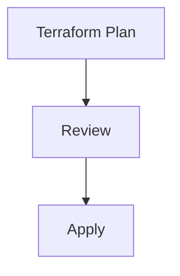
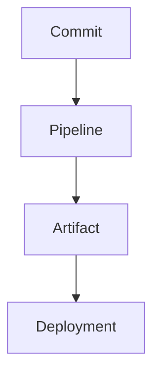

# Pipeline Artifacts and Package Management in Azure

**Author:** Randy Bordeaux  
**Version:** 1.0  
**Date:** 2026-01-22

---

## Executive Summary

This whitepaper defines **enterprise-grade practices for managing pipeline artifacts and packages** in Azure CI/CD pipelines. It focuses on ensuring **immutability, traceability, integrity, and secure promotion** of artifacts across multi-stage YAML pipelines.

The guidance targets experienced Azure engineers using **Azure DevOps Artifacts, Pipeline Artifacts, and Terraform-generated outputs** in **Azure Commercial** environments. Artifacts are treated as **first-class deployment inputs**, not transient byproducts of pipeline execution.

---

## Table of Contents

1. Scope and Artifact Threat Model  
2. Artifact Types and Classification  
3. Artifact Lifecycle and Promotion Flow  
4. Azure DevOps Artifact Storage Options  
5. Terraform Artifacts and State Outputs  
6. Security, Integrity, and Access Control  
7. Retention, Versioning, and Cleanup  
8. Auditing and Traceability  
9. Anti-Patterns and Common Failures  
10. Tradeoffs and Design Limitations  

---

## Scope and Artifact Threat Model

This document addresses:

- Secure handling of build and deployment artifacts  
- Preventing artifact tampering between stages  
- Ensuring reproducible and auditable deployments  
- Managing packages at enterprise scale  

Threats considered:

- Artifact substitution or poisoning  
- Unauthorized artifact access  
- Loss of provenance between stages  
- Over-retention of sensitive artifacts  

---

## Artifact Types and Classification

Artifacts must be explicitly classified.

| Artifact Type | Description |
|--------------|-------------|
| Build Artifacts | Compiled binaries, containers, packages |
| Pipeline Artifacts | Intermediate outputs between stages |
| Terraform Artifacts | Plan files, validation outputs |
| Configuration Artifacts | Versioned config and manifests |

Each artifact type has distinct security and retention requirements.

---

## Artifact Lifecycle and Promotion Flow

Artifacts must move forward through environments without mutation.

Rules:

- Artifacts are immutable once published  
- Promotion reuses the same artifact  
- No rebuilding during promotion  

---

## Azure DevOps Artifact Storage Options

### Pipeline Artifacts

Used for short-lived, stage-to-stage data:

- Terraform plans  
- Validation results  
- Generated manifests  

Characteristics:

- Scoped to pipeline runs  
- Automatically versioned  
- Integrated with YAML pipelines  

### Azure Artifacts

Used for long-lived packages:

- NuGet, npm, Maven, Python  
- Internal reusable libraries  
- Versioned deployment packages  

Feeds are environment-agnostic and access-controlled.

---

## Terraform Artifacts and State Outputs

Terraform produces artifacts that require special handling.

Best practices:

- Store plan files as pipeline artifacts  
- Retain plans for audit and rollback analysis  
- Never regenerate plans in later stages  
- State files remain in secure backends, not artifacts  

Terraform state is **not** a pipeline artifact.

---

## Security, Integrity, and Access Control

### Integrity Controls

- Artifact immutability enforced  
- Checksums validated where applicable  
- Promotion only from trusted sources  

### Access Control

- Read-only access for downstream stages  
- No direct artifact uploads from production stages  
- RBAC enforced on Azure Artifacts feeds  

Secrets must never be packaged as artifacts.

---

## Retention, Versioning, and Cleanup

Retention policies are mandatory.

| Artifact Type | Retention |
|--------------|-----------|
| Pipeline Artifacts | Short-term (days/weeks) |
| Release Packages | Long-term (months/years) |
| Terraform Plans | Policy-defined |
| Logs and Metadata | Compliance-defined |

Automated cleanup prevents cost growth and data leakage.

---

## Auditing and Traceability

Traceability requirements:

- Artifact linked to commit SHA  
- Artifact linked to pipeline run  
- Artifact linked to deployment stage  

This enables full reconstruction of deployment history.

---

## Anti-Patterns and Common Failures

Avoid:

- Rebuilding artifacts per environment  
- Manual artifact promotion  
- Storing secrets in artifacts  
- Unlimited artifact retention  

These patterns break auditability and increase risk.

---

## Tradeoffs and Design Limitations

### Tradeoffs

- Increased storage costs  
- Additional pipeline complexity  

### Benefits

- Deterministic deployments  
- Strong audit posture  
- Reduced supply-chain risk  

---

## Conclusion

Pipeline artifacts and packages are **security-critical assets**. Treating them as immutable, traceable, and governed objects is essential for safe Azure delivery at scale.

---

*End of Document*
