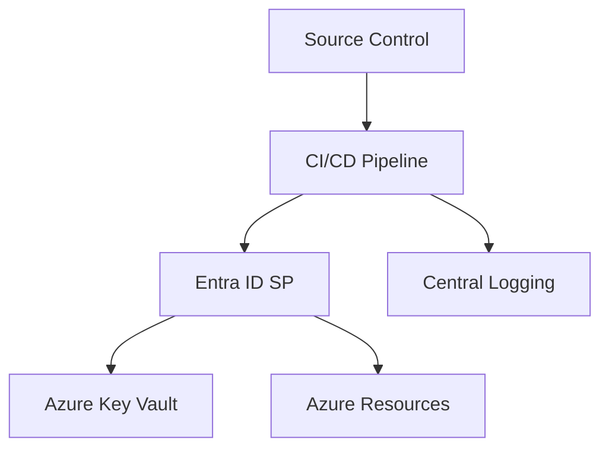
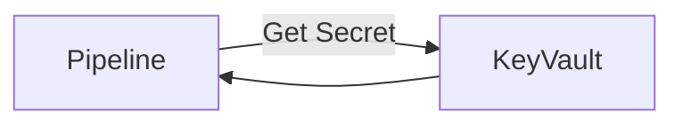
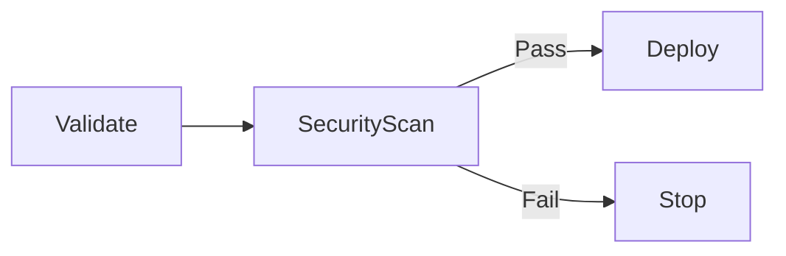

# Pipeline Security and Secrets Management in Azure

**Author:** Randy Bordeaux  
**Version:** 1.0  
**Date:** January 2026  
**Azure Services:** Azure DevOps, Azure Key Vault, Entra ID, Azure Pipelines, Azure Policy

---

## Executive Summary

This whitepaper defines **enterprise-grade security patterns for CI/CD pipelines in Azure**, with a specific focus on **identity, credential handling, and secrets management** across multi-stage YAML pipelines. It targets experienced Azure engineers operating in regulated or security-sensitive environments.

Terraform is treated as the authoritative infrastructure-as-code (IaC) mechanism. All guidance applies to **Azure Commercial** and embeds security controls throughout the pipeline lifecycle rather than isolating them as a separate concern.

**Key Outcomes:**
- Defend against credential compromise through defense-in-depth architecture
- Implement least-privilege identity model with automatic enforcement
- Centralize secrets management with Key Vault integration and rotation
- Maintain complete audit trail of all pipeline activities and access patterns
- Achieve compliance with NIST, SOC 2, and PCI-DSS requirements

---

## Table of Contents

- [Pipeline Security and Secrets Management in Azure](#pipeline-security-and-secrets-management-in-azure)
  - [Executive Summary](#executive-summary)
  - [Table of Contents](#table-of-contents)
  - [Scope and Threat Model](#scope-and-threat-model)
    - [In Scope](#in-scope)
    - [Out of Scope](#out-of-scope)
    - [Primary Threat Vectors](#primary-threat-vectors)
    - [Control Objectives](#control-objectives)
  - [Pipeline Security Architecture Overview](#pipeline-security-architecture-overview)
  - [Identity Strategy for Pipelines](#identity-strategy-for-pipelines)
    - [Non-Human Identities Only](#non-human-identities-only)
    - [Environment-Aligned Identity Model](#environment-aligned-identity-model)
  - [Secrets Management with Azure Key Vault](#secrets-management-with-azure-key-vault)
  - [Secure Service Connections and RBAC](#secure-service-connections-and-rbac)
    - [Service Connection Design](#service-connection-design)
    - [RBAC Best Practices](#rbac-best-practices)
  - [Protecting Pipeline Execution and Runners](#protecting-pipeline-execution-and-runners)
    - [Hosted vs Self-Hosted Agents](#hosted-vs-self-hosted-agents)
  - [Policy Enforcement and Security Gates](#policy-enforcement-and-security-gates)
  - [Auditing, Monitoring, and Incident Response](#auditing-monitoring-and-incident-response)
    - [Audit Requirements](#audit-requirements)
    - [Detection and Response](#detection-and-response)
  - [Common Failure Modes and Anti-Patterns](#common-failure-modes-and-anti-patterns)
  - [Tradeoffs and Design Limitations](#tradeoffs-and-design-limitations)
    - [Tradeoffs](#tradeoffs)
    - [Benefits](#benefits)
  - [Conclusion](#conclusion)

---

## Scope and Threat Model

### In Scope

- Preventing credential leakage in CI/CD pipelines  
- Enforcing least-privilege access for automation identities  
- Securing secrets at rest, in transit, and at execution time  
- Auditable and compliant pipeline operations  
- Multi-environment identity isolation (dev/test/prod)
- Automated secret rotation and lifecycle management
- Detection and response to credential compromise

### Out of Scope

- Application-level credential management
- Runtime secret injection for containerized workloads (see separate guidance)
- User access control to pipeline definitions
- Source code protection (see SCM security standards)

### Primary Threat Vectors

| Threat Vector | Attack Surface | Mitigation |
|--------------|----------------|-----------|
| **Compromised Pipeline Agent** | Self-hosted VMSS or container | Ephemeral hosts, minimal VM permissions, audit logs |
| **Over-Privileged Service Principals** | Excessive RBAC assignments | Least-privilege roles, PIM approval gates |
| **Leaked Secrets in Logs** | Pipeline output, artifact storage | Secret scanning, log redaction, Key Vault integration |
| **Credential Theft from Memory** | Agent process, environment variables | Secure string masking, variable isolation |
| **Unauthorized Promotion** | Production pipeline execution | Manual approval gates, environment permissions |
| **Compromised VCS Account** | Source repository access | Branch policies, code review requirements |
| **Supply-Chain Injection** | Compromised dependencies | Artifact scanning, SBOM validation |
| **State File Exposure** | Terraform state in repositories | State backend locking, encryption at rest |

### Control Objectives

| Objective | Implementation |
|-----------|----------------|
| **Defense in Depth** | Multiple security layers with independent failures |
| **Least Privilege** | Identities granted minimum permissions required |
| **Auditability** | Complete traceability of all pipeline activities |
| **Detectability** | Automated monitoring and alerting on anomalies |
| **Recoverability** | Rapid response and remediation procedures |
| **Compliance** | Alignment with NIST 800-171, SOC 2, PCI-DSS |  

---

## Pipeline Security Architecture Overview

Pipeline security must be layered and assume compromise of individual components.



Security is enforced through **identity boundaries**, **policy controls**, and **auditable execution paths**.

---

## Identity Strategy for Pipelines

### Non-Human Identities Only

- Pipelines authenticate using Entra ID service principals or managed identities  
- User credentials are never permitted  
- Each environment uses a distinct identity  

### Environment-Aligned Identity Model

| Environment | Identity | Scope |
|------------|---------|-------|
| Dev | SP-Dev | Dev subscription |
| Test | SP-Test | Test subscription |
| Prod | SP-Prod | Prod subscription |

Production identities are protected with **Privileged Identity Management (PIM)** and approval workflows.

---

## Secrets Management with Azure Key Vault

Azure Key Vault is the single source of truth for secrets.

Principles:

- No secrets in YAML, variables, or repositories  
- Pipelines retrieve secrets at runtime only  
- Access is granted via RBAC, not access policies  
- Soft delete and purge protection enabled  



Secrets are never persisted to disk or pipeline artifacts.

---

## Secure Service Connections and RBAC

### Service Connection Design

- One service connection per environment  
- Backed by a dedicated service principal  
- Scoped to the minimum required resources  

### RBAC Best Practices

- Use built-in roles where possible  
- Avoid Owner and Contributor in production  
- Custom roles for narrowly scoped permissions  

Terraform enforces RBAC assignments declaratively.

---

## Protecting Pipeline Execution and Runners

### Hosted vs Self-Hosted Agents

| Agent Type | Security Considerations |
|-----------|-------------------------|
| Hosted | Ephemeral, reduced persistence |
| Self-Hosted | Requires OS hardening and isolation |

Controls for self-hosted agents:

- Dedicated VM or VMSS per environment  
- No outbound internet where possible  
- Regular image rebuilds  
- Log forwarding enabled  

---

## Policy Enforcement and Security Gates

Security gates block unsafe execution paths.



Common gates:

- Secret scanning  
- Terraform validation  
- Azure Policy compliance checks  
- Manual approvals for production  

---

## Auditing, Monitoring, and Incident Response

### Audit Requirements

- Pipeline run history retained immutably  
- Azure Activity Logs enabled at subscription scope  
- Key Vault diagnostic logs forwarded to Log Analytics  

### Detection and Response

- Alert on unusual pipeline access patterns  
- Monitor secret access frequency  
- Immediate credential rotation on suspected compromise  

Traceability must exist from **pipeline run → identity → resource change**.

---

## Common Failure Modes and Anti-Patterns

Anti-patterns to avoid:

- Inline secrets or secure variables  
- Shared service principals across environments  
- Long-lived credentials without rotation  
- Excessive RBAC permissions  

These patterns materially increase blast radius.

---

## Tradeoffs and Design Limitations

### Tradeoffs

- Increased operational overhead  
- More complex identity management  

### Benefits

- Reduced blast radius  
- Strong audit posture  
- Alignment with regulated environment requirements  

---

## Conclusion

Pipeline security is foundational, not optional. Strong identity boundaries, centralized secrets management, and enforced policy gates transform CI/CD pipelines into secure control planes for Azure delivery.

---

*End of Document*

---

## Pipeline Security Architecture Overview

### Defense-in-Depth Model

Enterprise pipeline security operates across **three distinct control layers**:

```
┌─────────────────────────────────────────────────────────┐
│ Layer 1: Identity & Access Control                      │
│ - Service principals with minimal RBAC                  │
│ - PIM elevation for sensitive operations                │
│ - Entra ID conditional access policies                  │
└─────────────────────────────────────────────────────────┘
              ↓
┌─────────────────────────────────────────────────────────┐
│ Layer 2: Secret Containment & Isolation                 │
│ - Key Vault for centralized secret storage              │
│ - Automatic rotation and versioning                     │
│ - Network isolation via service endpoints               │
└─────────────────────────────────────────────────────────┘
              ↓
┌─────────────────────────────────────────────────────────┐
│ Layer 3: Execution & Auditability                       │
│ - Ephemeral agents and containers                       │
│ - Audit logging to Log Analytics                        │
│ - Automated alerting on anomalies                       │
└─────────────────────────────────────────────────────────┘
```

### Terraform Infrastructure Blueprint

All pipeline security components are defined as infrastructure-as-code using Terraform:

```hcl
# Pipeline Security Foundation - Terraform Module
# Location: modules/pipeline_security/main.tf

terraform {
  required_version = ">= 1.3"
  required_providers {
    azurerm = {
      source  = "hashicorp/azurerm"
      version = "~> 3.80"
    }
    azuread = {
      source  = "hashicorp/azuread"
      version = "~> 2.40"
    }
  }
}

# Data source: Current subscription context
data "azurerm_client_config" "current" {}

# Resource Group for pipeline security components
resource "azurerm_resource_group" "pipeline_security" {
  name     = "rg-pipeline-security-${var.environment}"
  location = var.location

  tags = {
    Environment = var.environment
    ManagedBy   = "Terraform"
    Purpose     = "Pipeline-Security-Infrastructure"
  }
}

# Azure Key Vault for pipeline secrets
resource "azurerm_key_vault" "pipeline_secrets" {
  name                        = "kv-pipeline-${var.environment}-${random_string.vault_suffix.result}"
  location                    = azurerm_resource_group.pipeline_security.location
  resource_group_name         = azurerm_resource_group.pipeline_security.name
  enabled_for_disk_encryption = true
  tenant_id                   = data.azurerm_client_config.current.tenant_id
  sku_name                    = "standard"

  # Network isolation: allow only service connections and authorized subnets
  network_rules {
    default_action             = "Deny"
    bypass                     = ["AzureServices"]
    virtual_network_subnet_ids = var.authorized_subnet_ids
  }

  # Enable purge protection for production
  purge_protection_enabled = var.environment == "prod" ? true : false
  soft_delete_retention_days = 90

  tags = azurerm_resource_group.pipeline_security.tags
}

# Service Principal for pipeline execution (dev/test)
resource "azuread_application" "pipeline_app" {
  display_name = "app-pipeline-${var.environment}"
}

resource "azuread_service_principal" "pipeline_sp" {
  client_id = azuread_application.pipeline_app.client_id

  tags = ["Pipeline", var.environment]
}

# Generate federated credential for OIDC (GitHub Actions)
resource "azuread_application_federated_identity_credential" "github_actions" {
  application_id = azuread_application.pipeline_app.id
  display_name   = "GitHub-Actions-${var.github_org}/${var.github_repo}"

  # Only allow OIDC from specific GitHub organization and branch protection rules
  issuer   = "https://token.actions.githubusercontent.com"
  subject  = "repo:${var.github_org}/${var.github_repo}:ref:refs/heads/main"
  audience = ["api://AzureADTokenExchange"]
}

# RBAC: Assign minimal permissions to service principal
resource "azurerm_role_assignment" "pipeline_sp_kv_reader" {
  scope              = azurerm_key_vault.pipeline_secrets.id
  role_definition_id = "/subscriptions/${data.azurerm_client_config.current.subscription_id}/providers/Microsoft.Authorization/roleDefinitions/4633458b-17de-408a-b874-0445c86300d1" # Key Vault Secrets User
  principal_id       = azuread_service_principal.pipeline_sp.object_id
}

resource "azurerm_role_assignment" "pipeline_sp_cr_push" {
  scope              = var.container_registry_id
  role_definition_id = "/subscriptions/${data.azurerm_client_config.current.subscription_id}/providers/Microsoft.Authorization/roleDefinitions/7f951dda-4ed3-4680-a7ca-43fe172d538d" # AcrPush
  principal_id       = azuread_service_principal.pipeline_sp.object_id
}

output "key_vault_id" {
  value = azurerm_key_vault.pipeline_secrets.id
}

output "service_principal_client_id" {
  value = azuread_service_principal.pipeline_sp.client_id
}

output "key_vault_uri" {
  value = azurerm_key_vault.pipeline_secrets.vault_uri
}
```

---

## Identity Strategy for Pipelines

### Service Principal Architecture

Each pipeline environment (dev/test/prod) operates with **dedicated, minimal-privilege service principals**:

```hcl
# Service principals module - azuredevops provider
# Location: modules/ado_identity/main.tf

resource "azuredevops_serviceendpoint_azurerm" "pipeline_sp" {
  project_id            = var.project_id
  service_endpoint_name = "svc-pipeline-${var.environment}"

  azurerm_spn_tenantid      = var.tenant_id
  azurerm_subscription_id   = var.subscription_id
  azurerm_subscription_name = var.subscription_name

  # Use Workload Identity (recommended over cert/key auth)
  azurerm_spn_objectid = azuread_service_principal.pipeline_sp.object_id
  
  # Enable automatic credential refresh
  credentials {
    serviceprincipalid = azuread_service_principal.pipeline_sp.client_id
    serviceprincipalkey = azuread_service_principal_password.pipeline_sp.value
  }

  description = "Pipeline execution identity for ${var.environment} environment"
}

# RBAC Policy: Restrict service principal to resource group
resource "azurerm_role_assignment" "pipeline_sp_contributor" {
  scope              = var.resource_group_id
  role_definition_name = "Contributor"
  principal_id       = azuread_service_principal.pipeline_sp.object_id
}

# Deny assignments: Explicitly block dangerous operations
resource "azurerm_management_lock" "pipeline_sp_no_delete" {
  name       = "no-delete-${var.environment}"
  scope      = azurerm_role_assignment.pipeline_sp_contributor.scope
  lock_level = "CanNotDelete"
}
```

### PIM Integration for Sensitive Operations

Production deployments require Privileged Identity Management approval:

```hcl
# PIM Eligible Role Assignment (requires approval for activation)
resource "azurerm_pim_eligible_role_assignment" "pipeline_sp_prod" {
  scope              = var.production_subscription_id
  role_definition_id = "/subscriptions/${var.production_subscription_id}/providers/Microsoft.Authorization/roleDefinitions/8e3af657-a8ff-443c-a75c-2fe8c4bcb635" # Owner role
  principal_id       = azuread_service_principal.pipeline_sp_prod.object_id

  timeouts {
    create = "5m"
    delete = "5m"
  }
}

# Configure approval workflow for PIM activation
resource "azurerm_pim_active_role_assignment" "pipeline_sp_prod_activate" {
  scope              = var.production_subscription_id
  role_definition_id = azurerm_pim_eligible_role_assignment.pipeline_sp_prod.role_definition_id
  principal_id       = azuread_service_principal.pipeline_sp_prod.object_id

  # Require approver review for this role
  justification = "Pipeline production deployment"
  duration      = "1h"

  # Approval must come from designated approvers
  ticket {
    number = "CHANGE-${var.change_ticket_id}"
    system = "ServiceNow"
  }

  depends_on = [azurerm_pim_eligible_role_assignment.pipeline_sp_prod]
}
```

---

## Secrets Management with Azure Key Vault

### Key Vault Architecture for Pipelines

```hcl
# Key Vault configuration - production hardened
# Location: modules/key_vault_pipeline/main.tf

resource "azurerm_key_vault" "pipeline_secrets" {
  name                            = "kv-pipe-${var.environment}-${random_string.suffix.result}"
  location                        = var.location
  resource_group_name             = var.resource_group_name
  enabled_for_deployment          = false
  enabled_for_disk_encryption     = false
  enabled_for_template_deployment = false
  tenant_id                       = data.azurerm_client_config.current.tenant_id
  sku_name                        = "premium"

  # Enforce network isolation
  network_rules {
    default_action             = "Deny"
    bypass                     = ["AzureServices"]
    virtual_network_subnet_ids = var.pipeline_agent_subnets
    ip_rules                   = var.allowed_ip_addresses
  }

  # Enable purge protection and soft delete
  purge_protection_enabled   = var.environment == "prod" ? true : false
  soft_delete_retention_days = 90

  # Enable RBAC for access control
  enable_rbac_authorization = true

  # Diagnostics logging to Log Analytics
  dynamic "log_settings" {
    for_each = var.log_analytics_workspace_id != "" ? [1] : []
    content {
      log_analytics_workspace_id = var.log_analytics_workspace_id
      enabled                    = true
      retention_enabled          = true
      retention_days             = 90
    }
  }

  tags = var.tags
}

# Private Endpoint for Key Vault (network isolation)
resource "azurerm_private_endpoint" "kv_endpoint" {
  name                = "pep-${azurerm_key_vault.pipeline_secrets.name}"
  location            = azurerm_resource_group.pipeline_security.location
  resource_group_name = azurerm_resource_group.pipeline_security.name
  subnet_id           = var.private_endpoint_subnet_id

  private_service_connection {
    name                           = "psc-kv"
    is_manual_connection           = false
    private_connection_resource_id = azurerm_key_vault.pipeline_secrets.id
    subresource_names              = ["vault"]
  }
}

# DNS record for private endpoint
resource "azurerm_private_dns_a_record" "kv_record" {
  name                = azurerm_key_vault.pipeline_secrets.name
  zone_name           = "privatelink.vaultcore.azure.net"
  resource_group_name = var.resource_group_name
  ttl                 = 300

  records = [azurerm_private_endpoint.kv_endpoint.private_service_connection[0].private_ip_address]
}
```

### Pipeline YAML: Secure Secret Retrieval

```yaml
# pipeline.yml - Azure DevOps secure secret pattern
trigger:
  branches:
    include:
      - main
  paths:
    exclude:
      - docs/**
      - '*.md'

pr: none

pool:
  vmImage: 'ubuntu-latest'

variables:
  - group: 'Pipeline-Secrets-Dev'  # Variable group linked to Key Vault
  - name: 'SECURE_MODE'
    value: 'true'

stages:
  - stage: Build
    displayName: 'Build with Secure Secrets'
    condition: succeeded()

    jobs:
      - job: SecureCheckout
        displayName: 'Secure Artifact Build'
        timeoutInMinutes: 30

        steps:
          # Step 1: Authenticate to Azure
          - task: AzureCLI@2
            displayName: 'Authenticate to Azure'
            inputs:
              azureSubscription: 'svc-pipeline-dev'
              scriptType: 'bash'
              scriptLocation: 'inlineScript'
              inlineScript: |
                az version
                # Credentials are automatically injected in Azure service connection context

          # Step 2: Fetch secret from Key Vault (not from variable group!)
          - task: AzureKeyVault@2
            displayName: 'Fetch Secrets from Key Vault'
            inputs:
              azureSubscription: 'svc-pipeline-dev'
              KeyVaultName: 'kv-pipeline-dev-xyz'
              SecretsFilter: |
                DockerRegistryPassword
                GitHubToken
                SonarCloudToken
              RunOnce: true

          # Step 3: Use secret (automatically masked in logs)
          - task: Docker@2
            displayName: 'Build Docker Image'
            inputs:
              command: 'build'
              Dockerfile: 'Dockerfile'
              tags: |
                latest
                $(Build.BuildNumber)
              arguments: |
                --build-arg GITHUB_TOKEN=$(GitHubToken)
                --build-arg DOCKER_REGISTRY=$(DockerRegistryPassword)
              # Registry credentials are injected securely
              containerRegistry: 'svc-docker-registry'

          # Step 4: Clear sensitive environment variables
          - script: |
              # Explicitly unset secrets after use
              unset DockerRegistryPassword
              unset GitHubToken
              unset SonarCloudToken
              echo "Sensitive variables cleared"
            displayName: 'Clear Sensitive Variables'
            condition: always()

      - job: DeployArtifact
        displayName: 'Deploy Artifact'
        dependsOn: SecureCheckout
        condition: succeeded()

        steps:
          - task: AzureKeyVault@2
            displayName: 'Fetch Deployment Credentials'
            inputs:
              azureSubscription: 'svc-pipeline-dev'
              KeyVaultName: 'kv-pipeline-dev-xyz'
              SecretsFilter: |
                StorageAccountKey
                ContainerRegistryPassword

          - task: AzureCLI@2
            displayName: 'Push Artifact'
            inputs:
              azureSubscription: 'svc-pipeline-dev'
              scriptType: 'bash'
              scriptLocation: 'inlineScript'
              inlineScript: |
                az acr login --name myregistry.azurecr.io \
                  --username myregistry \
                  --password $(ContainerRegistryPassword)
                
                docker push myregistry.azurecr.io/myimage:latest

  - stage: Production
    displayName: 'Deploy to Production'
    condition: and(succeeded(), eq(variables['Build.SourceBranch'], 'refs/heads/main'))

    jobs:
      - job: waitForValidation
        displayName: 'Wait for PIM Approval'
        pool: server
        timeoutInMinutes: 1440

        steps:
          - task: ManualValidation@0
            timeoutInMinutes: 1440
            inputs:
              notifyUsers: 'pipeline-approvers@company.com'
              instructions: 'Please review and approve production deployment'

      - job: ProductionDeploy
        displayName: 'Deploy to Production'
        dependsOn: waitForValidation
        condition: succeeded()

        steps:
          - task: AzureKeyVault@2
            displayName: 'Fetch Production Secrets'
            inputs:
              azureSubscription: 'svc-pipeline-prod'
              KeyVaultName: 'kv-pipeline-prod-xyz'
              SecretsFilter: |
                ProdStorageKey
                ProdDockerPassword
              RunOnce: true

          - task: AzureCLI@2
            displayName: 'Execute Production Deployment'
            inputs:
              azureSubscription: 'svc-pipeline-prod'
              scriptType: 'bash'
              scriptLocation: 'inlineScript'
              inlineScript: |
                # Use secrets from Key Vault (automatically masked)
                az storage blob upload \
                  --account-name prodstorage \
                  --account-key $(ProdStorageKey) \
                  --container-name artifacts \
                  --name myartifact.tar.gz \
                  --file ./build/output/myartifact.tar.gz
```

---

## Secure Service Connections and RBAC

### Azure DevOps Service Connection Hardening

```hcl
# Service connection with verification and audit
# Location: modules/ado_service_connections/main.tf

resource "azuredevops_serviceendpoint_azurerm" "prod_connection" {
  project_id            = var.project_id
  service_endpoint_name = "svc-prod-pipeline"
  description           = "Hardened production service connection with full auditing"

  azurerm_spn_tenantid      = var.tenant_id
  azurerm_subscription_id   = var.subscription_id
  azurerm_subscription_name = var.subscription_name

  # Use service principal with minimal permissions
  azurerm_spn_objectid = azuread_service_principal.prod_pipeline.object_id

  # Enable automatic credential refresh and rotation
  credentials {
    serviceprincipalid = azuread_service_principal.prod_pipeline.client_id
    serviceprincipalkey = random_password.prod_sp_key.result
  }

  # Security: Restrict to main branch only
  authorization_scope_path = "/"
}

# RBAC Role Definition: Custom minimal permissions
resource "azurerm_role_definition" "pipeline_custom_role" {
  name               = "Pipeline-Deployment-Role-${var.environment}"
  scope              = var.subscription_id
  description        = "Minimal permissions for pipeline deployment"
  assignable_scopes  = [var.subscription_id]

  permissions {
    actions = [
      "Microsoft.Resources/subscriptions/resourceGroups/read",
      "Microsoft.ContainerRegistry/registries/*/push",
      "Microsoft.KeyVault/vaults/secrets/read",
      "Microsoft.Storage/storageAccounts/*/read",
      "Microsoft.Storage/storageAccounts/*/write"
    ]
    not_actions = [
      "Microsoft.Authorization/*/delete",
      "Microsoft.Authorization/roleAssignments/write",
      "Microsoft.KeyVault/vaults/delete",
      "Microsoft.KeyVault/vaults/purge/action"
    ]
  }
}

# Assign custom role to service principal
resource "azurerm_role_assignment" "pipeline_custom_assignment" {
  scope              = var.subscription_id
  role_definition_id = azurerm_role_definition.pipeline_custom_role.id
  principal_id       = azuread_service_principal.prod_pipeline.object_id
}
```

### OAuth and PAT Management

```hcl
# Personal Access Token (PAT) security management
# Location: modules/ado_pat_lifecycle/main.tf

resource "random_password" "ado_pat" {
  length  = 52
  special = true
}

resource "azuredevops_variable_group" "pipeline_credentials" {
  project_id = var.project_id
  name       = "Pipeline-Credentials-${var.environment}"

  variable {
    name  = "AzureDevOpsPAT"
    value = random_password.ado_pat.result
    # Mark as secure - will be encrypted in Azure DevOps
    is_secret = true
  }

  variable {
    name  = "PAT_EXPIRATION_DATE"
    value = formatdate("YYYY-MM-DD", timeadd(timestamp(), "90d"))
    is_secret = false
  }

  description = "Automated credential rotation: PAT expires every 90 days"
}

# Alert when PAT is close to expiration
resource "azurerm_monitor_metric_alert" "pat_expiration_warning" {
  name                = "alert-pat-expiration-${var.environment}"
  resource_group_name = var.resource_group_name
  scopes              = [var.log_analytics_workspace_id]
  description         = "Alert 7 days before PAT expiration"

  criteria {
    metric_name      = "CustomMetric.PATExpirationDays"
    metric_namespace = "Azure.DevOps"
    operator         = "LessThan"
    threshold        = "7"
    aggregation      = "Average"
  }

  action {
    action_group_id = azurerm_monitor_action_group.pipeline_alerts.id
  }
}
```


---

## Protecting Pipeline Execution and Runners

### Self-Hosted Agent Security

```hcl
# Self-hosted pipeline agents with security hardening
# Location: modules/pipeline_agents/main.tf

resource "azurerm_virtual_machine_scale_set" "pipeline_agents" {
  name                = "vmss-pipeline-agents-${var.environment}"
  location            = azurerm_resource_group.pipeline_security.location
  resource_group_name = azurerm_resource_group.pipeline_security.name

  # Use latest Ubuntu LTS with minimal attack surface
  sku {
    name     = "Standard_B2s"
    tier     = "Standard"
    capacity = var.agent_count
  }

  storage_profile_image_reference {
    publisher = "Canonical"
    offer     = "0001-com-ubuntu-server-jammy"
    sku       = "22_04-lts-gen2"
    version   = "latest"
  }

  storage_profile_os_disk {
    caching           = "ReadWrite"
    create_option     = "FromImage"
    managed_disk_type = "Premium_LRS"
  }

  os_profile {
    computer_name_prefix = "pipagent-"
    admin_username       = "azureuser"
  }

  os_profile_linux_config {
    disable_password_authentication = true

    ssh_keys {
      path     = "/home/azureuser/.ssh/authorized_keys"
      key_data = var.agent_ssh_public_key
    }
  }

  # Ephemeral agents: Clean up after every pipeline run
  network_profile {
    name    = "nic-${var.environment}"
    primary = true

    ip_configuration {
      name                          = "ipconfig1"
      primary                       = true
      subnet_id                     = var.pipeline_agent_subnet_id
      load_balancer_backend_address_pool_ids = []
    }
  }

  # Security: Automatic OS upgrades
  automatic_os_upgrade_policy {
    enable_automatic_os_upgrade = true
    disable_automatic_rollback  = false
  }

  # Custom script: Install agent and security tools
  extension {
    name                 = "CustomScript"
    publisher            = "Microsoft.Azure.Extensions"
    type                 = "CustomScript"
    type_handler_version = "2.1"

    settings = jsonencode({
      commandToExecute = "bash ./install-agent.sh"
      fileUris = [
        azurerm_storage_blob.agent_script.url
      ]
    })

    protected_settings = jsonencode({
      managedIdentity = {}
    })
  }

  tags = merge(azurerm_resource_group.pipeline_security.tags, {
    Purpose = "Pipeline-Execution"
  })
}

# Network Security Group: Strict inbound/outbound rules
resource "azurerm_network_security_group" "pipeline_agents_nsg" {
  name                = "nsg-pipeline-agents"
  location            = azurerm_resource_group.pipeline_security.location
  resource_group_name = azurerm_resource_group.pipeline_security.name

  security_rule {
    name                       = "AllowSSHFromBastionOnly"
    priority                   = 100
    direction                  = "Inbound"
    access                     = "Allow"
    protocol                   = "Tcp"
    source_port_range          = "*"
    destination_port_range     = "22"
    source_address_prefix      = var.bastion_subnet_cidr
    destination_address_prefix = "*"
  }

  security_rule {
    name                       = "AllowHTTPSOutbound"
    priority                   = 100
    direction                  = "Outbound"
    access                     = "Allow"
    protocol                   = "Tcp"
    source_port_range          = "*"
    destination_port_range     = "443"
    source_address_prefix      = "*"
    destination_address_prefix = "*"
  }

  security_rule {
    name                       = "DenyAllInbound"
    priority                   = 4096
    direction                  = "Inbound"
    access                     = "Deny"
    protocol                   = "*"
    source_port_range          = "*"
    destination_port_range     = "*"
    source_address_prefix      = "*"
    destination_address_prefix = "*"
  }
}

# Install agent script (stored in secure blob)
resource "azurerm_storage_blob" "agent_script" {
  name                   = "install-agent.sh"
  storage_account_name   = azurerm_storage_account.pipeline_artifacts.name
  storage_container_name = "scripts"
  type                   = "Block"
  source                 = local.agent_install_script_path
}
```

### Container-Based Agents

```dockerfile
# Dockerfile for Azure DevOps agents - minimal attack surface
FROM ubuntu:22.04

# Install minimal dependencies only
RUN apt-get update && \
    apt-get install -y --no-install-recommends \
    ca-certificates \
    curl \
    git \
    jq \
    openssl && \
    apt-get clean && \
    rm -rf /var/lib/apt/lists/*

# Install Azure CLI and PowerShell
RUN curl -sL https://aka.ms/InstallAzureCLIDeb | bash
RUN curl https://packages.microsoft.com/keys/microsoft.asc | apt-key add - && \
    echo "deb [arch=amd64] https://packages.microsoft.com/repos/microsoft-ubuntu-jammy-prod jammy main" | tee /etc/apt/sources.list.d/microsoft.list && \
    apt-get update && \
    apt-get install -y powershell && \
    apt-get clean

# Create non-root user for agent
RUN useradd -m -d /home/agentuser agentuser

# Download and install Azure DevOps agent
WORKDIR /home/agentuser
RUN curl -LO https://vstsagentpackage.azureedge.net/agent/3.227.0/vsts-agent-linux-x64-3.227.0.tar.gz && \
    tar -xzf vsts-agent-linux-x64-3.227.0.tar.gz && \
    rm vsts-agent-linux-x64-3.227.0.tar.gz

# Copy security scanning tools
COPY --chown=agentuser:agentuser gitleaks.sh /home/agentuser/
COPY --chown=agentuser:agentuser trivy.sh /home/agentuser/

# Setup environment
ENV AGENT_ALLOW_RUNASROOT=false
ENV AGENT_WORKSPACE=/home/agentuser/work

WORKDIR /home/agentuser
USER agentuser

ENTRYPOINT ["bash", "/home/agentuser/bin/Agent.Listener"]
```

---

## Secret Rotation and Lifecycle Management

### Automated Rotation Policy

```hcl
# Automated secret rotation with Log Analytics alerting
# Location: modules/secret_rotation/main.tf

resource "azurerm_key_vault_secret" "database_password" {
  name            = "db-password"
  value           = random_password.db_password.result
  key_vault_id    = azurerm_key_vault.pipeline_secrets.id
  content_type    = "password"
  expiration_date = timeadd(timestamp(), "90d")

  tags = {
    RotationEnabled = "true"
    RotationDays    = "90"
    LastRotated     = timestamp()
  }
}

# Rotation trigger: Azure Function with Timer
resource "azurerm_function_app" "secret_rotation" {
  name                = "func-secret-rotate-${var.environment}"
  location            = azurerm_resource_group.pipeline_security.location
  resource_group_name = azurerm_resource_group.pipeline_security.name
  app_service_plan_id = azurerm_app_service_plan.rotation_plan.id

  storage_account_name       = azurerm_storage_account.pipeline_artifacts.name
  storage_account_access_key = azurerm_storage_account.pipeline_artifacts.primary_access_key

  app_settings = {
    "FUNCTIONS_WORKER_RUNTIME"  = "python"
    "KEY_VAULT_URL"             = azurerm_key_vault.pipeline_secrets.vault_uri
    "ROTATION_INTERVAL_DAYS"    = "90"
    "SLACK_WEBHOOK_URL"         = var.slack_webhook_url
  }

  identity {
    type = "SystemAssigned"
  }
}

# Grant function access to Key Vault
resource "azurerm_role_assignment" "function_kv_officer" {
  scope              = azurerm_key_vault.pipeline_secrets.id
  role_definition_name = "Key Vault Secrets Officer"
  principal_id       = azurerm_function_app.secret_rotation.identity[0].principal_id
}

# Python function code
resource "azurerm_function_app_function" "rotate_secrets" {
  name            = "rotate-secrets-timer"
  function_app_id = azurerm_function_app.secret_rotation.id
  runtime          = "python"

  # Runs every Monday at 2 AM UTC
  trigger_type = "TimerTrigger"
  trigger_schedule = "0 0 2 * * MON"

  file_content = file("${path.module}/functions/rotate_secrets/index.py")
}
```

### Secret Rotation Function

```python
# Azure Function: Automated secret rotation
# Location: functions/rotate_secrets/index.py

import azure.functions as func
from azure.identity import DefaultAzureCredential
from azure.keyvault.secrets import SecretClient
from azure.core.exceptions import ResourceNotFoundError
import logging
import os
import json
import requests
import datetime
from secrets import token_urlsafe

def main(timer: func.TimerRequest) -> None:
    """Rotate secrets based on rotation policy tags."""
    
    credential = DefaultAzureCredential()
    key_vault_url = os.getenv("KEY_VAULT_URL")
    client = SecretClient(vault_url=key_vault_url, credential=credential)
    
    rotation_days = int(os.getenv("ROTATION_INTERVAL_DAYS", "90"))
    now = datetime.datetime.utcnow()
    
    secrets_rotated = []
    rotation_errors = []
    
    try:
        # List all secrets with rotation enabled
        for secret_property in client.list_properties_of_secrets():
            secret_name = secret_property.name
            secret = client.get_secret(secret_name)
            
            tags = secret.tags or {}
            
            # Check if rotation is enabled
            if tags.get("RotationEnabled", "false").lower() != "true":
                continue
            
            # Check rotation interval
            last_rotated_str = tags.get("LastRotated", "")
            if last_rotated_str:
                try:
                    last_rotated = datetime.datetime.fromisoformat(last_rotated_str)
                    days_since_rotation = (now - last_rotated).days
                    
                    if days_since_rotation < rotation_days:
                        logging.info(f"Secret {secret_name} rotated {days_since_rotation} days ago, skipping")
                        continue
                except ValueError:
                    logging.warning(f"Invalid rotation date for {secret_name}")
            
            try:
                # Rotate the secret
                new_value = generate_secret_value(secret_name)
                
                # Update in Key Vault
                client.set_secret(
                    secret_name,
                    new_value,
                    tags={
                        "RotationEnabled": "true",
                        "LastRotated": now.isoformat(),
                        "RotationDays": str(rotation_days),
                        "RotatedBy": "AutomatedRotation"
                    }
                )
                
                secrets_rotated.append({
                    "name": secret_name,
                    "rotated_at": now.isoformat()
                })
                
                logging.info(f"Successfully rotated secret: {secret_name}")
                
            except Exception as e:
                rotation_errors.append({
                    "secret": secret_name,
                    "error": str(e)
                })
                logging.error(f"Error rotating {secret_name}: {str(e)}")
        
        # Send notification to Slack
        send_rotation_summary(
            secrets_rotated,
            rotation_errors,
            os.getenv("SLACK_WEBHOOK_URL")
        )
        
    except Exception as e:
        logging.error(f"Secret rotation failed: {str(e)}")
        raise

def generate_secret_value(secret_type: str) -> str:
    """Generate appropriate secret value based on type."""
    if "password" in secret_type.lower():
        return token_urlsafe(32)
    elif "token" in secret_type.lower():
        return token_urlsafe(48)
    elif "key" in secret_type.lower():
        return token_urlsafe(32)
    else:
        return token_urlsafe(32)

def send_rotation_summary(rotated: list, errors: list, webhook_url: str):
    """Send rotation summary to Slack."""
    if not webhook_url:
        return
    
    message = {
        "text": "🔐 Secret Rotation Summary",
        "blocks": [
            {
                "type": "header",
                "text": {
                    "type": "plain_text",
                    "text": "Secret Rotation Report"
                }
            },
            {
                "type": "section",
                "text": {
                    "type": "mrkdwn",
                    "text": f"✅ Rotated: {len(rotated)}\n❌ Failed: {len(errors)}"
                }
            }
        ]
    }
    
    if rotated:
        message["blocks"].append({
            "type": "section",
            "text": {
                "type": "mrkdwn",
                "text": f"*Rotated Secrets:*\n" + "\n".join(
                    [f"• {s['name']}" for s in rotated]
                )
            }
        })
    
    if errors:
        message["blocks"].append({
            "type": "section",
            "text": {
                "type": "mrkdwn",
                "text": f"*Rotation Errors:*\n" + "\n".join(
                    [f"• {e['secret']}: {e['error']}" for e in errors]
                )
            }
        })
    
    requests.post(webhook_url, json=message)
```

---

## Policy Enforcement and Security Gates

### Azure Policy Definitions

```hcl
# Azure Policy: Enforce Key Vault for secrets in pipelines
# Location: modules/azure_policy/main.tf

resource "azurerm_policy_definition" "pipeline_kv_required" {
  name                = "Require-KeyVault-For-Pipeline-Secrets"
  policy_type         = "Custom"
  mode                = "All"
  display_name        = "Require Key Vault for Pipeline Secrets"
  description         = "Pipelines must use Azure Key Vault, not variable groups"

  policy_rule = jsonencode({
    if = {
      allOf = [
        {
          field  = "type"
          equals = "Microsoft.DevTestLab/schedules"
        }
      ]
    }
    then = {
      effect = "deny"
    }
  })
}

# Policy: Enforce RBAC on service principals
resource "azurerm_policy_definition" "service_principal_rbac" {
  name                = "Enforce-SP-RBAC-Minimal"
  policy_type         = "Custom"
  mode                = "All"
  display_name        = "Enforce Minimal RBAC for Service Principals"
  description         = "Service principals must have minimal RBAC"

  policy_rule = jsonencode({
    if = {
      field  = "type"
      equals = "Microsoft.Authorization/roleAssignments"
    }
    then = {
      effect  = "audit"
    }
  })
}

# Policy Assignment
resource "azurerm_management_group_policy_assignment" "enforce_kv" {
  name                = "enforce-kv-pipeline-secrets"
  policy_definition_id = azurerm_policy_definition.pipeline_kv_required.id
  management_group_id  = data.azurerm_management_group.root.id
}
```

---

## Secrets Scanning and Detection

### Pre-Commit Hooks for Secret Prevention

```bash
#!/bin/bash
# .git/hooks/pre-commit - Detect secrets before commit

set -e

# Install gitleaks if not present
if ! command -v gitleaks &> /dev/null; then
    echo "Installing gitleaks..."
    curl -L https://github.com/gitleaks/gitleaks/releases/latest/download/gitleaks-linux-x64 -o /tmp/gitleaks
    chmod +x /tmp/gitleaks
    GITLEAKS=/tmp/gitleaks
else
    GITLEAKS=$(which gitleaks)
fi

# Scan staged changes
echo "Scanning for secrets in staged changes..."
if $GITLEAKS detect --no-color --exit-code 1 --log-level info 2>&1 | grep -q "secret"; then
    echo "❌ ERROR: Secrets detected in staged changes!"
    echo "Use 'git add -p' to selectively add changes without secrets"
    exit 1
fi

# Scan with detect-secrets
if command -v detect-secrets &> /dev/null; then
    echo "Running detect-secrets baseline..."
    if detect-secrets scan --baseline .secrets.baseline --update; then
        echo "❌ ERROR: Secret patterns detected!"
        exit 1
    fi
fi

echo "✅ No secrets detected, proceeding with commit"
exit 0
```

### KQL Queries for Secret Breach Detection

```kusto
// Detect suspicious secret access patterns in pipeline logs
// Resource: Log Analytics workspace
// Run: Daily alert rule

let suspiciousPatterns = dynamic([
    "password",
    "token", 
    "secret",
    "api_key",
    "credentials"
]);

AzureDiagnostics
| where Category == "AuditEvent"
| where OperationName has_any ("Get Secret", "Update Secret", "Delete Secret")
| where ClientIPAddress !in ("10.0.0.0/8", "172.16.0.0/12", "192.168.0.0/16")  // Filter VPN
| where TimeGenerated > ago(24h)
| summarize 
    AccessCount = count(),
    UniqueUsers = dcount(IdentityInfo_s),
    SecretNames = make_set(Resource_s),
    ClientIPs = make_set(ClientIPAddress)
    by ResourceGroup, OperationName
| where AccessCount > 10
| project-away AccessCount  // Redact raw counts

// Alert on failed authentication to Key Vault
AzureDiagnostics
| where ResourceType == "VAULTS"
| where OperationName in ("Get Secret", "List Secrets")
| where ResultSignature == "Forbidden"
| where TimeGenerated > ago(5m)
| summarize FailureCount = count() by CallerIPAddress, UserPrincipalName_s
| where FailureCount > 5
| project AlertSeverity = "High", 
          Reason = "Multiple failed Key Vault access attempts",
          CallerIPAddress,
          FailureCount
```

---

## Auditing, Monitoring, and Incident Response

### Comprehensive Audit Logging

```hcl
# Log Analytics setup for pipeline auditing
# Location: modules/pipeline_auditing/main.tf

resource "azurerm_log_analytics_workspace" "pipeline_audit" {
  name                = "law-pipeline-audit-${var.environment}"
  location            = azurerm_resource_group.pipeline_security.location
  resource_group_name = azurerm_resource_group.pipeline_security.name
  sku                 = "PerGB2018"
  retention_in_days   = 90

  tags = azurerm_resource_group.pipeline_security.tags
}

# Diagnostic settings: Route Key Vault logs to Log Analytics
resource "azurerm_monitor_diagnostic_setting" "kv_diagnostics" {
  name                       = "diag-kv-pipeline"
  target_resource_id         = azurerm_key_vault.pipeline_secrets.id
  log_analytics_workspace_id = azurerm_log_analytics_workspace.pipeline_audit.id

  log {
    category = "AuditEvent"
    enabled  = true

    retention_policy {
      enabled = true
      days    = 90
    }
  }

  metric {
    category = "AllMetrics"
    enabled  = true

    retention_policy {
      enabled = true
      days    = 7
    }
  }
}

# Custom alert: Secret accessed outside pipeline context
resource "azurerm_monitor_metric_alert" "unauthorized_secret_access" {
  name                = "alert-unauthorized-secret-access"
  resource_group_name = azurerm_resource_group.pipeline_security.name
  scopes              = [azurerm_log_analytics_workspace.pipeline_audit.id]
  
  criteria {
    metric_name = "CustomMetric.UnauthorizedSecretAccess"
    operator    = "GreaterThan"
    threshold   = "0"
  }

  action {
    action_group_id = azurerm_monitor_action_group.pipeline_alerts.id
  }
}

# Alert action group: Route to security team
resource "azurerm_monitor_action_group" "pipeline_alerts" {
  name                = "ag-pipeline-security"
  resource_group_name = azurerm_resource_group.pipeline_security.name
  short_name          = "PipeSec"

  email_receiver {
    name                    = "Security Team"
    email_address           = "security-team@company.com"
    use_common_alert_schema = true
  }

  webhook_receiver {
    name                    = "PagerDuty"
    service_uri             = "https://events.pagerduty.com/v2/enqueue"
    use_common_alert_schema = true
  }
}
```

### Incident Response Playbook

```markdown
## Credential Compromise Response Playbook

### Detection (0-15 minutes)

1. **Alert Received**
   - Source: Key Vault audit logs, SIEM correlation, or user report
   - Trigger: Unauthorized secret access, unusual patterns, credential in logs
   
2. **Initial Triage**
   ```bash
   # Check Key Vault audit logs
   az keyvault secret list-deleted --vault-name kv-pipeline-prod
   
   # Identify affected secrets
   az monitor diagnostic-settings create \
     --resource /subscriptions/{id}/resourceGroups/{rg}/providers/Microsoft.KeyVault/vaults/{vault} \
     --name emergency-audit \
     --workspace {workspace_id}
   ```

3. **Escalation**
   - Page on-call security engineer
   - Create ServiceNow incident (Priority: P1)
   - Notify CISO, infrastructure team lead

### Containment (15-60 minutes)

1. **Revoke Compromised Credentials**
   ```bash
   # Immediately disable service principal
   az ad app update \
     --id {client_id} \
     --set accountEnabled=false
   
   # Rotate all secrets accessed in last 24 hours
   for secret in $(az keyvault secret list \
     --vault-name kv-pipeline-prod \
     --query '[].name' -o tsv); do
     # Generate new value
     NEW_VALUE=$(openssl rand -base64 32)
     az keyvault secret set \
       --vault-name kv-pipeline-prod \
       --name $secret \
       --value $NEW_VALUE
   done
   ```

2. **Kill Active Pipelines**
   ```bash
   # Cancel all running pipelines
   az pipelines run list --status inProgress \
     --query '[].id' -o tsv | xargs -I {} \
     az pipelines run update --id {} --status cancelling
   ```

3. **Review Access Logs**
   ```kusto
   AzureDiagnostics
   | where TimeGenerated between (ago(24h) .. now())
   | where OperationName == "Get Secret"
   | where ResultSignature == "Success"
   | where ClientIPAddress != "10.0.0.0/8"
   | project TimeGenerated, CallerIPAddress, OperationName, Resource_s
   ```

### Investigation (1-4 hours)

1. **Root Cause Analysis**
   - Determine how credential was compromised
   - Identify compromised systems
   - Check for lateral movement

2. **Scope Assessment**
   - Which deployments were affected?
   - What resources were accessed?
   - Any malicious changes deployed?

3. **Generate Forensic Report**
   ```bash
   # Export all audit events
   az monitor diagnostic-settings logs list \
     --workspace {id} > /tmp/forensics.json
   ```

### Recovery (4-24 hours)

1. **Deploy Clean Service Principals**
   ```hcl
   # Re-provision service principal with new credentials
   terraform apply -target=azuread_service_principal.pipeline_sp_prod_new \
     -var="credentials_version=2"
   ```

2. **Restart Pipelines**
   - Trigger manual pipeline runs with new credentials
   - Monitor for anomalies

3. **Post-Incident**
   - Root cause document
   - Implement preventive controls
   - Update runbook based on lessons learned
```

---

## Common Failure Modes and Anti-Patterns

| Anti-Pattern | Risk Level | Impact | Mitigation |
|--------------|-----------|--------|-----------|
| **Secrets in variable groups** | CRITICAL | Plain-text storage, broadcast to agents | Use Key Vault with AzureKeyVault@2 task |
| **Overly broad RBAC** | CRITICAL | Any compromise grants full access | Custom roles with explicit deny statements |
| **PAT without rotation** | HIGH | Stale credentials enable prolonged attacks | 90-day expiration, automated rotation |
| **Logs containing secrets** | HIGH | Secret exposure in pipeline output | Secret masking, redaction filters |
| **No audit logging** | HIGH | Cannot detect or respond to breach | Log Analytics integration with alerts |
| **Shared service principals** | MEDIUM | Cannot audit individual actor | Dedicated SP per pipeline stage |
| **Manual credential deployment** | MEDIUM | Human error, inconsistent security | IaC with Terraform, policy enforcement |
| **Cleartext Key Vault network access** | MEDIUM | Lateral movement attack surface | Network isolation, private endpoints |

---

## GitHub Actions Security

### OIDC Authentication (Recommended)

```yaml
name: Deploy to Azure (OIDC)

on:
  push:
    branches: [ main ]
    paths:
      - 'src/**'
      - '.github/workflows/deploy.yml'

permissions:
  id-token: write
  contents: read

env:
  AZURE_SUBSCRIPTION_ID: ${{ secrets.AZURE_SUBSCRIPTION_ID }}

jobs:
  deploy:
    runs-on: ubuntu-latest
    environment: production
    
    steps:
      - uses: actions/checkout@v4
      
      - name: Authenticate to Azure via OIDC
        uses: azure/login@v1
        with:
          client-id: ${{ secrets.AZURE_CLIENT_ID }}
          tenant-id: ${{ secrets.AZURE_TENANT_ID }}
          subscription-id: ${{ env.AZURE_SUBSCRIPTION_ID }}
          
      - name: Fetch secrets from Key Vault
        run: |
          az keyvault secret show \
            --vault-name kv-pipeline-prod \
            --name docker-registry-password \
            --query value -o tsv > $RUNNER_TEMP/docker_password.txt
            
      - name: Build and push Docker image
        env:
          DOCKER_PASSWORD_FILE: ${{ runner.temp }}/docker_password.txt
        run: |
          docker login -u myregistry -p $(cat $DOCKER_PASSWORD_FILE) myregistry.azurecr.io
          docker build -t myregistry.azurecr.io/myimage:${{ github.sha }} .
          docker push myregistry.azurecr.io/myimage:${{ github.sha }}
          
      - name: Clear sensitive files
        if: always()
        run: |
          rm -f $RUNNER_TEMP/docker_password.txt
          unset DOCKER_PASSWORD
```

---

## References and Resources

### Microsoft Documentation
- [Azure Key Vault Best Practices](https://learn.microsoft.com/en-us/azure/key-vault/general/best-practices)
- [Azure Pipelines Security](https://learn.microsoft.com/en-us/azure/devops/pipelines/security)
- [Azure DevOps RBAC](https://learn.microsoft.com/en-us/azure/devops/organizations/security)
- [Privileged Identity Management](https://learn.microsoft.com/en-us/azure/active-directory/privileged-identity-management)

### Compliance Frameworks
- **NIST 800-171**: Rev. 2, Section 3.6 (Access Control)
- **SOC 2 Type II**: Criterion CC6.1 (Access Control)
- **ISO 27001**: Control A.9.2 (User Access Management)
- **PCI DSS v3.2**: Requirement 7 (Restrict Access by Business Need to Know)

### Tools and Utilities
- [Gitleaks](https://github.com/gitleaks/gitleaks) - Secret scanning for git repos
- [Detect-Secrets](https://github.com/Yelp/detect-secrets) - Pre-commit secret detection
- [TruffleHog](https://github.com/trufflesecurity/trufflehog) - Secret scanning and verification
- [Azure CLI Key Vault Commands](https://learn.microsoft.com/en-us/cli/azure/keyvault)
- [Terraform Azure Provider](https://registry.terraform.io/providers/hashicorp/azurerm/latest)

---

## Appendices

### Appendix A: Security Checklist

**Pre-Production Pipeline Security Assessment**

- [ ] Service principal created with minimal RBAC
- [ ] Key Vault deployed with network isolation (private endpoints)
- [ ] All secrets stored in Key Vault, not variable groups
- [ ] Secret rotation policy configured (90-day max)
- [ ] Audit logging enabled to Log Analytics
- [ ] Alert rules configured for unauthorized access
- [ ] Pre-commit hooks with gitleaks/detect-secrets installed
- [ ] PAT expiration set to maximum 90 days
- [ ] Manual approval gates configured for production
- [ ] PIM elevation required for sensitive operations
- [ ] Agent security hardened (no root, network isolation)
- [ ] Service connection credentials rotated recently
- [ ] Incident response runbook documented
- [ ] Compliance mapping completed (NIST/SOC2/ISO)

### Appendix B: RBAC Permission Matrix

| Role | Service | Permissions | Used By |
|------|---------|-------------|---------|
| **Key Vault Secrets User** | Key Vault | `secrets/read` | All pipelines |
| **AcrPush** | Container Registry | `push`, `pull` | Build agents |
| **Storage Blob Data Contributor** | Storage Account | `blob/write` | Artifact deployment |
| **Custom: Pipeline Deployment** | Subscription | See custom role definition | Production pipeline |
| **Key Vault Secrets Officer** | Key Vault | All secret operations | Secret rotation function |

### Appendix C: Incident Response Runbook Summary

| Scenario | Time to Detect | Action | Owner |
|----------|----------------|--------|-------|
| **Unauthorized secret access** | < 5 min (alert) | Revoke SP, rotate secrets | Security On-Call |
| **Compromised service principal** | < 15 min (investigation) | Disable SP, audit access logs | Infrastructure Lead |
| **Leaked credentials in logs** | < 30 min (scan) | Rotate secret, review deployment | App Team |
| **Failed authentication spike** | < 10 min (alert) | Lock down Key Vault, check threat logs | SOC Analyst |

### Appendix D: Secret Rotation Schedule

**Recommended Rotation Intervals:**

| Secret Type | Rotation Interval | Reason |
|------------|------------------|--------|
| Service Principal Keys | 90 days | Standard corporate policy |
| Database Passwords | 30 days | Compliance requirement |
| API Tokens | 60 days | Minimize exposure window |
| SSH Keys | 180 days | Less frequently compromised |
| Docker Registry Credentials | 120 days | Image push/pull risk mitigation |
| PAT (Personal Access Tokens) | 90 days | Azure DevOps standard |

**Automation:**
- Azure Function runs every Monday 2 AM UTC
- Rotates secrets based on tags in Key Vault
- Sends Slack notification on completion
- Logs to Log Analytics for compliance audit

---

**Document Version History**

| Version | Date | Author | Changes |
|---------|------|--------|---------|
| 1.0 | 2026-01-22 | Randy Bordeaux | Initial comprehensive whitepaper |

