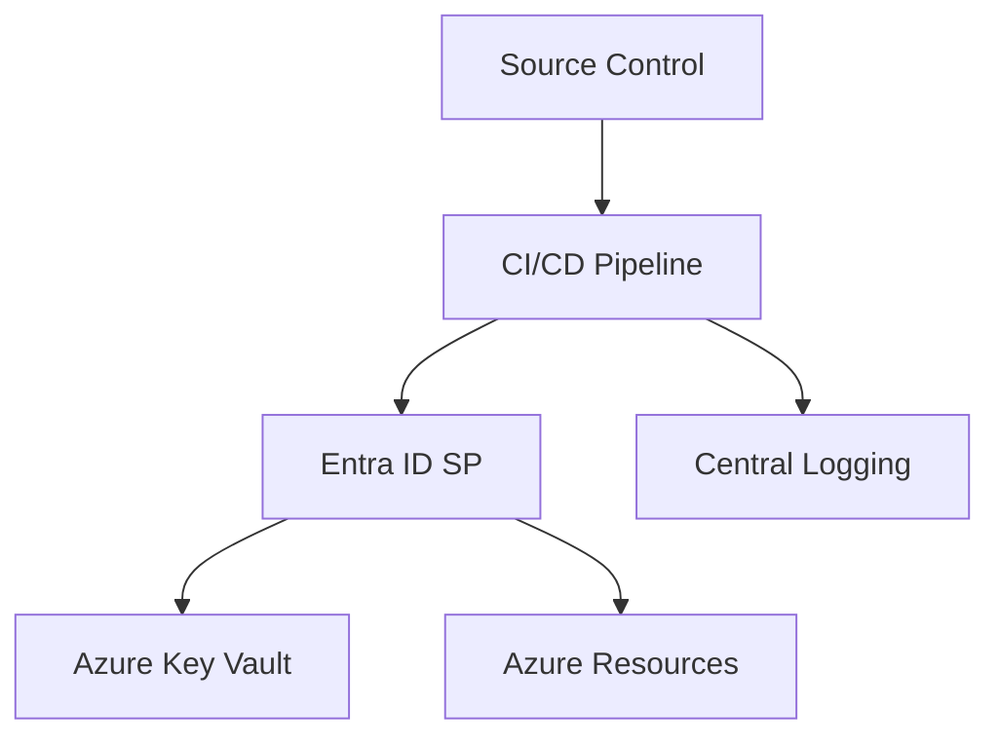
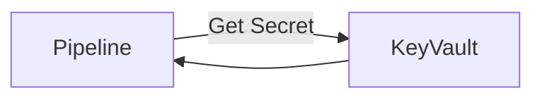
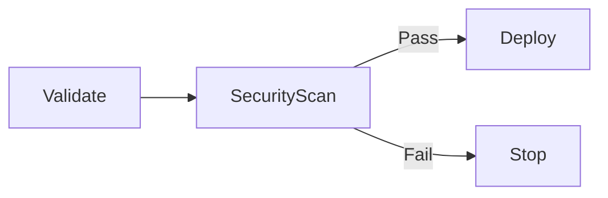

# Pipeline Security and Secrets Management in Azure

**Author:** Randy Bordeaux  
**Version:** 1.0  
**Date:** 2026-01-22  

---

## Executive Summary

This whitepaper defines **enterprise-grade security patterns for CI/CD pipelines in Azure**, with a specific focus on **identity, credential handling, and secrets management** across multi-stage YAML pipelines. It targets experienced Azure engineers operating in regulated or security-sensitive environments.

Terraform is treated as the authoritative infrastructure-as-code (IaC) mechanism. All guidance applies to **Azure Commercial** and embeds security controls throughout the pipeline lifecycle rather than isolating them as a separate concern.

---

## Table of Contents

1. Scope and Threat Model  
2. Pipeline Security Architecture Overview  
3. Identity Strategy for Pipelines  
4. Secrets Management with Azure Key Vault  
5. Secure Service Connections and RBAC  
6. Protecting Pipeline Execution and Runners  
7. Policy Enforcement and Security Gates  
8. Auditing, Monitoring, and Incident Response  
9. Common Failure Modes and Anti-Patterns  
10. Tradeoffs and Design Limitations  

---

## Scope and Threat Model

This document addresses:

- Preventing credential leakage in CI/CD pipelines  
- Enforcing least-privilege access for automation identities  
- Securing secrets at rest, in transit, and at execution time  
- Auditable and compliant pipeline operations  

Primary threat vectors considered:

- Compromised pipeline agents  
- Over-privileged service principals  
- Leaked secrets via logs or artifacts  
- Unauthorized promotion to production  

---

## Pipeline Security Architecture Overview

Pipeline security must be layered and assume compromise of individual components.

Security is enforced through **identity boundaries**, **policy controls**, and **auditable execution paths**.

---

## Identity Strategy for Pipelines

### Non-Human Identities Only

- Pipelines authenticate using Entra ID service principals or managed identities  
- User credentials are never permitted  
- Each environment uses a distinct identity  

### Environment-Aligned Identity Model

| Environment | Identity | Scope |
|------------|---------|-------|
| Dev | SP-Dev | Dev subscription |
| Test | SP-Test | Test subscription |
| Prod | SP-Prod | Prod subscription |

Production identities are protected with **Privileged Identity Management (PIM)** and approval workflows.

---

## Secrets Management with Azure Key Vault

Azure Key Vault is the single source of truth for secrets.

Principles:

- No secrets in YAML, variables, or repositories  
- Pipelines retrieve secrets at runtime only  
- Access is granted via RBAC, not access policies  
- Soft delete and purge protection enabled  

Secrets are never persisted to disk or pipeline artifacts.

---

## Secure Service Connections and RBAC

### Service Connection Design

- One service connection per environment  
- Backed by a dedicated service principal  
- Scoped to the minimum required resources  

### RBAC Best Practices

- Use built-in roles where possible  
- Avoid Owner and Contributor in production  
- Custom roles for narrowly scoped permissions  

Terraform enforces RBAC assignments declaratively.

---

## Protecting Pipeline Execution and Runners

### Hosted vs Self-Hosted Agents

| Agent Type | Security Considerations |
|-----------|-------------------------|
| Hosted | Ephemeral, reduced persistence |
| Self-Hosted | Requires OS hardening and isolation |

Controls for self-hosted agents:

- Dedicated VM or VMSS per environment  
- No outbound internet where possible  
- Regular image rebuilds  
- Log forwarding enabled  

---

## Policy Enforcement and Security Gates

Security gates block unsafe execution paths.

Common gates:

- Secret scanning  
- Terraform validation  
- Azure Policy compliance checks  
- Manual approvals for production  

---

## Auditing, Monitoring, and Incident Response

### Audit Requirements

- Pipeline run history retained immutably  
- Azure Activity Logs enabled at subscription scope  
- Key Vault diagnostic logs forwarded to Log Analytics  

### Detection and Response

- Alert on unusual pipeline access patterns  
- Monitor secret access frequency  
- Immediate credential rotation on suspected compromise  

Traceability must exist from **pipeline run → identity → resource change**.

---

## Common Failure Modes and Anti-Patterns

Anti-patterns to avoid:

- Inline secrets or secure variables  
- Shared service principals across environments  
- Long-lived credentials without rotation  
- Excessive RBAC permissions  

These patterns materially increase blast radius.

---

## Tradeoffs and Design Limitations

### Tradeoffs

- Increased operational overhead  
- More complex identity management  

### Benefits

- Reduced blast radius  
- Strong audit posture  
- Alignment with regulated environment requirements  

---

## Conclusion

Pipeline security is foundational, not optional. Strong identity boundaries, centralized secrets management, and enforced policy gates transform CI/CD pipelines into secure control planes for Azure delivery.

---

*End of Document*
