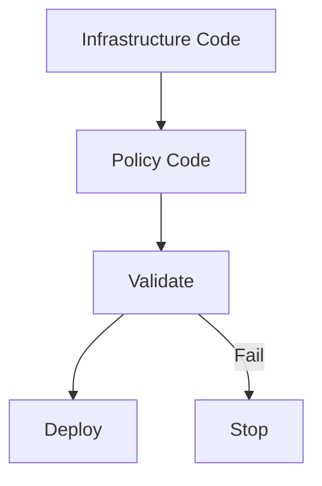
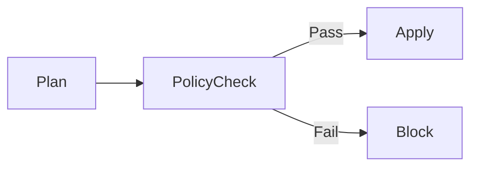

# Policy as Code Integration in Azure Pipelines

**Author:** Randy Bordeaux  
**Version:** 1.0  
**Date:** January 2026  
**Azure Services:** Azure Policy, Azure DevOps, Terraform, Azure Pipelines

---

## Executive Summary

This whitepaper defines **enterprise-grade patterns for implementing Policy-as-Code (PaC) in Azure CI/CD pipelines**, with focus on **shift-left governance, automated compliance, and deterministic deployment outcomes**. It integrates **Azure Policy, Terraform native validation, OPA/Rego policies, and pipeline enforcement mechanisms** to ensure governance controls are **automatically evaluated before resource creation**.

Terraform is treated as the authoritative infrastructure-as-code mechanism, with policies as first-class code artifacts that are **versioned, reviewed, tested, and promoted** alongside infrastructure definitions. Policy evaluation occurs in the pipeline, not in the cloud.

**Key Outcomes:**
- Prevent non-compliant infrastructure deployment through automated validation
- Enforce governance controls shift-left (in CI/CD, not post-deployment)
- Maintain complete audit trail of policy evaluations and exceptions
- Enable compliance teams to express policy as executable code
- Achieve deterministic, repeatable deployment outcomes

---

## Table of Contents

- [Policy as Code Integration in Azure Pipelines](#policy-as-code-integration-in-azure-pipelines)
  - [Executive Summary](#executive-summary)
  - [Table of Contents](#table-of-contents)
  - [Scope and Governance Objectives](#scope-and-governance-objectives)
    - [In Scope](#in-scope)
    - [Out of Scope](#out-of-scope)
    - [Primary Governance Objectives](#primary-governance-objectives)
  - [Policy-as-Code Architecture Overview](#policy-as-code-architecture-overview)
  - [Azure Policy as Code (Definitions and Initiatives)](#azure-policy-as-code-definitions-and-initiatives)
  - [Terraform Policy Integration Patterns](#terraform-policy-integration-patterns)
    - [Pre-Apply Validation](#pre-apply-validation)
    - [Azure Policy Enforcement](#azure-policy-enforcement)
  - [Pipeline Enforcement and Validation Stages](#pipeline-enforcement-and-validation-stages)
  - [Environment Promotion and Policy Drift Control](#environment-promotion-and-policy-drift-control)
  - [Security, Compliance, and Auditability](#security-compliance-and-auditability)
    - [Audit Requirements](#audit-requirements)
    - [Compliance Alignment](#compliance-alignment)
  - [Failure Handling and Exception Management](#failure-handling-and-exception-management)
    - [Policy Violations](#policy-violations)
    - [Exceptions](#exceptions)
  - [Anti-Patterns and Common Pitfalls](#anti-patterns-and-common-pitfalls)
  - [Tradeoffs and Design Considerations](#tradeoffs-and-design-considerations)
    - [Tradeoffs](#tradeoffs)
    - [Benefits](#benefits)
  - [Conclusion](#conclusion)

---

## Scope and Governance Objectives

### In Scope

- Defining governance controls as executable code (Azure Policy, OPA/Rego, Terraform validators)
- Preventing non-compliant infrastructure deployment through pipeline gates
- Automating compliance validation at build-time, not audit-time
- Managing policy exceptions with explicit approval workflows
- Auditing all policy evaluations and exception decisions
- Monitoring policy compliance across environments
- Promoting policies through environments alongside infrastructure

### Out of Scope

- Application-level compliance (data retention, encryption at app layer)
- User identity and access management policy (covered separately)
- Cost governance and cost control (separate FinOps guidance)
- Organizational hierarchy and team permissions

### Primary Governance Objectives

| Objective | Implementation |
|-----------|----------------|
| **Shift-Left Enforcement** | Policy validation during pipeline execution, blocking non-compliant plans |
| **Deterministic Outcomes** | Same infrastructure code + same policies = identical deployment result |
| **Auditability** | Complete record of what policies were evaluated, what passed/failed, and why |
| **Exception Management** | Explicit, time-bounded approval for policy deviations |
| **Compliance as Code** | Policies versioned in Git, reviewed in PRs, tested like code |
| **Multi-Environment Parity** | Policy enforcement consistent across dev/test/prod with environment-specific parameters |  

---

## Policy-as-Code Architecture Overview

Policy-as-Code integrates **policy definition, validation, and enforcement** directly into delivery pipelines.



Policy evaluation occurs **before resource creation**, not after.

---

## Azure Policy as Code (Definitions and Initiatives)

Azure Policy definitions and initiatives must be managed as source-controlled assets.

Best practices:

- Custom policies stored in Git repositories  
- Initiatives used to group related controls  
- Parameterized policies for reuse  
- Versioned releases aligned to environments  

Policy assignments are deployed via Terraform.

```hcl
resource "azurerm_policy_assignment" "example" {
  name                 = "enforce-secure-baseline"
  scope                = var.policy_scope
  policy_definition_id = var.policy_definition_id
}
```

---

## Terraform Policy Integration Patterns

Terraform enforces policy through multiple layers.

### Pre-Apply Validation

- `terraform validate`  
- Static analysis of resource configuration  
- Custom validation scripts  

### Azure Policy Enforcement

- Deny effects block non-compliant resources  
- Audit effects provide visibility  
- DeployIfNotExists for baseline controls  

Terraform plans must pass all policy checks before apply.

---

## Pipeline Enforcement and Validation Stages

Policy enforcement is embedded as explicit pipeline stages.



Controls:

- Policy compliance evaluated pre-apply  
- Fail-fast behavior on violations  
- Policy results published as pipeline artifacts  

---

## Environment Promotion and Policy Drift Control

Policy drift is managed independently from infrastructure drift.

Best practices:

- Policies promoted ahead of workloads  
- Policy changes require approval  
- Continuous compliance scans scheduled  

Policy changes are treated as **breaking changes** for downstream environments.

---

## Security, Compliance, and Auditability

### Audit Requirements

- Policy definitions versioned and immutable  
- Assignment history retained  
- Compliance results logged centrally  

### Compliance Alignment

Policy-as-Code supports alignment with:

- NIST 800-171 control families  
- Internal security baselines  
- Change management requirements  

Every deployment is provably policy-compliant at execution time.

---

## Failure Handling and Exception Management

### Policy Violations

- Deny effects stop deployment immediately  
- Violations require code or policy updates  
- No inline bypasses in pipelines  

### Exceptions

- Time-bound exemptions only  
- Explicit approval required  
- Logged and reviewed post-expiration  

Emergency exemptions are audited and minimized.

---

## Anti-Patterns and Common Pitfalls

Avoid:

- Manual policy assignment  
- Post-deployment compliance remediation  
- Broad exemptions  
- Hard-coded policy logic in pipelines  

These undermine governance objectives.

---

## Tradeoffs and Design Considerations

### Tradeoffs

- Increased pipeline complexity  
- Slower initial development velocity  

### Benefits

- Predictable compliance  
- Reduced audit burden  
- Strong preventative controls  

---

## Conclusion

Policy-as-Code transforms governance from a reactive process into a **preventative control system**. When tightly integrated with Terraform and CI/CD pipelines, it ensures Azure environments remain secure, compliant, and auditable by default.

---

*End of Document*

---

## Policy-as-Code Architecture Overview

### Defense-in-Depth Policy Layers

Policy validation operates across **three independent evaluation layers**:

```
┌─────────────────────────────────────────────────────────┐
│ Layer 1: Pre-Apply Validation (Local + CI)              │
│ - Terraform validate, fmt, static analysis              │
│ - OPA/Conftest policy evaluation                        │
│ - Custom validation scripts                             │
└─────────────────────────────────────────────────────────┘
              ↓ (Block if violated)
┌─────────────────────────────────────────────────────────┐
│ Layer 2: Plan Analysis (Azure DevOps Pipeline)          │
│ - Terraform plan parsing (JSON format)                  │
│ - Azure Policy initiative evaluation                    │
│ - Drift detection and audit logging                     │
└─────────────────────────────────────────────────────────┘
              ↓ (Block if violated)
┌─────────────────────────────────────────────────────────┐
│ Layer 3: Post-Deployment Compliance (Ongoing)           │
│ - Azure Policy evaluations on deployed resources        │
│ - GitOps drift detection                                │
│ - Compliance reporting and alerts                       │
└─────────────────────────────────────────────────────────┘
```

### Policy Evolution Through Environments

```
Development         Staging             Production
┌──────────┐        ┌──────────┐        ┌──────────┐
│ Policies │        │ Policies │        │ Policies │
│ v1.0.0   │ ──→    │ v1.0.0   │ ──→    │ v1.0.0   │
│ (Audit)  │        │ (Audit)  │        │ (Deny)   │
└──────────┘        └──────────┘        └──────────┘
  Warnings           Warnings            Enforcement
```

---

## Azure Policy Definitions and Initiatives

### Policy Definition as Code

All Azure Policy definitions are stored in Git and deployed via Terraform:

```hcl
# modules/azure_policy/main.tf

resource "azurerm_policy_definition" "enforce_tags" {
  name                = "Enforce-Required-Tags"
  policy_type         = "Custom"
  mode                = "All"
  display_name        = "Enforce Required Tags on All Resources"
  description         = "Ensures all resources have mandatory tags: Environment, Owner, CostCenter"

  policy_rule = jsonencode({
    if = {
      field = "type"
      equals = "Microsoft.Resources/subscriptions/resourceGroups"
    }
    then = {
      effect = "deny"
      details = {
        roleDefinitionIds = [
          "/subscriptions/${data.azurerm_client_config.current.subscription_id}/providers/Microsoft.Authorization/roleDefinitions/b24988ac-6180-42a0-ab88-20f7382dd24c"
        ]
        operations = [
          {
            operation = "addOrReplace"
            field     = "tags"
            values = {
              Environment = "[parameters('environmentTag')]"
              Owner       = "[parameters('ownerTag')]"
              CostCenter  = "[parameters('costCenterTag')]"
            }
          }
        ]
      }
    }
  })

  parameters = jsonencode({
    environmentTag = {
      type        = "String"
      metadata = {
        displayName = "Environment Tag Value"
        description = "Required value for Environment tag"
      }
      allowedValues = ["dev", "test", "staging", "prod"]
    }
    ownerTag = {
      type        = "String"
      metadata = {
        displayName = "Owner Tag Value"
        description = "Required value for Owner tag"
      }
    }
    costCenterTag = {
      type        = "String"
      metadata = {
        displayName = "Cost Center Tag Value"
        description = "Required value for CostCenter tag"
      }
    }
  })
}

# Policy Initiative: Group related policies
resource "azurerm_policy_set_definition" "compliance_baseline" {
  name                  = "Compliance-Baseline-Initiative"
  policy_type           = "Custom"
  display_name          = "Compliance Baseline - All Resources"
  description           = "Initiative enforcing minimum compliance requirements"
  management_group_name = var.management_group_name

  policy_definition_reference {
    policy_definition_id = azurerm_policy_definition.enforce_tags.id
    parameter_values = jsonencode({
      environmentTag = { value = var.environment }
      ownerTag       = { value = var.owner }
      costCenterTag  = { value = var.cost_center }
    })
  }

  policy_definition_reference {
    policy_definition_id = "/subscriptions/${data.azurerm_client_config.current.subscription_id}/providers/Microsoft.Authorization/policyDefinitions/496eedd8-b307-4ac6-b4e7-da0a3ff4de6c"  # Built-in: "Not allowed resource types"
    parameter_values = jsonencode({
      listOfResourceTypesNotAllowed = {
        value = [
          "Microsoft.ClassicCompute/virtualMachines",
          "Microsoft.ClassicStorage/storageAccounts"
        ]
      }
    })
  }
}

# Policy Assignment: Apply to scope with specific effects
resource "azurerm_management_group_policy_assignment" "prod_baseline" {
  name                 = "prod-compliance-baseline"
  policy_definition_id = azurerm_policy_set_definition.compliance_baseline.id
  management_group_id  = data.azurerm_management_group.prod.id

  parameters = jsonencode({
    environmentTag = {
      value = "prod"
    }
  })

  # Enforcement mode: "Default" (deny), "DoNotEnforce" (audit only)
  enforcement_mode = "Default"

  # Non-compliance messages
  description = "Enforces compliance baseline for production environment"

  # Identity for Modify and DeployIfNotExists effects
  identity {
    type = "SystemAssigned"
  }

  depends_on = [azurerm_policy_set_definition.compliance_baseline]
}

# Grant permissions for policy remediation
resource "azurerm_role_assignment" "policy_remediation" {
  scope              = data.azurerm_management_group.prod.id
  role_definition_id = "/subscriptions/${data.azurerm_client_config.current.subscription_id}/providers/Microsoft.Authorization/roleDefinitions/b24988ac-6180-42a0-ab88-20f7382dd24c"  # Contributor
  principal_id       = azurerm_management_group_policy_assignment.prod_baseline.identity[0].principal_id
}

# Compliance monitoring
resource "azurerm_resource_group" "policy_compliance" {
  name     = "rg-policy-compliance-${var.environment}"
  location = var.location

  tags = {
    Purpose = "Policy-Compliance-Monitoring"
  }
}

resource "azurerm_monitor_diagnostic_setting" "policy_events" {
  name                       = "diag-policy-events"
  target_resource_id         = data.azurerm_management_group.prod.id
  log_analytics_workspace_id = azurerm_log_analytics_workspace.governance.id

  log {
    category = "PolicyEvaluationDetails"
    enabled  = true
    retention_policy {
      enabled = true
      days    = 90
    }
  }
}
```

---

## Terraform Policy Integration Patterns

### Built-in Terraform Validation

```hcl
# modules/storage/variables.tf

variable "storage_account_tier" {
  type        = string
  description = "Storage account access tier"
  default     = "Hot"

  # Validation: enforce only approved tiers
  validation {
    condition     = contains(["Hot", "Cool", "Archive"], var.storage_account_tier)
    error_message = "Storage tier must be Hot, Cool, or Archive."
  }
}

variable "storage_account_replication_type" {
  type        = string
  description = "Storage account replication type"

  # Validation: enforce geo-redundancy in production
  validation {
    condition     = (
      var.environment == "prod" && contains(["GZRS", "RA-GZRS", "GRS", "RA-GRS"], var.storage_account_replication_type)
    ) || (
      var.environment != "prod"
    )
    error_message = "Production must use geo-redundant replication (GRS, GZRS, RA-GRS, or RA-GZRS)."
  }
}

# modules/storage/locals.tf

locals {
  # Policy enforcement: Ensure all resources have required tags
  validation_tags = {
    for key, value in var.tags :
    key => value
    if contains(["Environment", "Owner", "CostCenter", "Application"], key)
  }

  # Assertion: Fail if required tags missing
  required_tags_check = (
    length([for key in ["Environment", "Owner", "CostCenter"] : 
      key if !contains(keys(var.tags), key)
    ]) == 0
  ) ? true : (
    raise("ERROR: Required tags missing. Must include: Environment, Owner, CostCenter")
  )
}

# modules/storage/resource.tf

resource "azurerm_storage_account" "policy_validated" {
  name                     = var.storage_account_name
  resource_group_name      = var.resource_group_name
  location                 = var.location
  account_tier             = var.storage_account_tier
  account_replication_type = var.storage_account_replication_type
  https_traffic_only_enabled = true
  
  # Enforce RBAC (not access keys)
  shared_access_key_enabled = false

  # Network isolation
  default_to_oauth_authentication = true

  # Encryption: Customer-managed keys in production
  customer_managed_key {
    key_vault_key_id = var.environment == "prod" ? azurerm_key_vault_key.storage_cmk.id : null
  }

  tags = merge(var.tags, {
    PolicyValidated = "true"
    ValidatedAt     = timestamp()
  })
}
```

### Custom Policy Validation Functions

```hcl
# modules/policies/validation.tf

# Custom validation: Enforce naming conventions
locals {
  naming_pattern = {
    rg_pattern     = "^rg-[a-z0-9-]{3,20}-[a-z]{3,10}$"
    sa_pattern     = "^sa[a-z0-9]{3,24}$"
    kv_pattern     = "^kv-[a-z0-9-]{3,24}$"
  }
}

locals {
  # Function: Validate resource naming
  validate_naming = (
    regex(local.naming_pattern.rg_pattern, var.resource_group_name) != null &&
    regex(local.naming_pattern.sa_pattern, var.storage_account_name) != null
  ) ? true : false
}

variable "environment" {
  type = string
  validation {
    condition     = contains(["dev", "test", "staging", "prod"], var.environment)
    error_message = "Environment must be dev, test, staging, or prod."
  }
}
```

---

## OPA/Rego Policy Framework

### Rego Policies for Infrastructure Validation

OPA (Open Policy Agent) provides declarative policy validation before deployment:

```rego
# policies/terraform.rego

package terraform

import data.terraform.modules

# DENY: Storage accounts without HTTPS-only
deny[msg] {
    storage = input.resource_changes[_]
    storage.type == "azurerm_storage_account"
    storage.change.after.https_traffic_only_enabled != true
    msg = sprintf(
        "Storage account '%s' must enable HTTPS-only access",
        [storage.address]
    )
}

# DENY: Overly permissive network rules
deny[msg] {
    nsg = input.resource_changes[_]
    nsg.type == "azurerm_network_security_group"
    rule = nsg.change.after.security_rule[_]
    rule.access == "Allow"
    rule.source_address_prefix == "*"
    rule.destination_port_range == "*"
    msg = sprintf(
        "NSG rule '%s' allows unrestricted access (0.0.0.0/0:*)",
        [rule.name]
    )
}

# DENY: Public endpoints on sensitive services
deny[msg] {
    kv = input.resource_changes[_]
    kv.type == "azurerm_key_vault"
    kv.change.after.network_rules[0].default_action != "Deny"
    msg = sprintf(
        "Key Vault '%s' must have default_action = Deny",
        [kv.address]
    )
}

# WARN: Resources missing required tags
warn[msg] {
    resource = input.resource_changes[_]
    not resource.change.after.tags.Environment
    msg = sprintf(
        "%s '%s' missing required 'Environment' tag",
        [resource.type, resource.address]
    )
}

# DENY: Unencrypted databases
deny[msg] {
    db = input.resource_changes[_]
    db.type == "azurerm_sql_database"
    db.change.after.transparent_data_encryption_enabled != true
    msg = sprintf(
        "SQL Database '%s' must have TDE enabled",
        [db.address]
    )
}

# AUDIT: Production environment constraints
audit[msg] {
    input.environment == "prod"
    vm = input.resource_changes[_]
    vm.type == "azurerm_virtual_machine"
    vm.change.after.vm_size in ["Standard_B1s", "Standard_B1ms", "Standard_B2s"]
    msg = sprintf(
        "Production VM '%s' using burstable tier (B-series). Recommend D-series or E-series.",
        [vm.address]
    )
}

# Metadata for violations
violation_severity[severity_info] {
    deny[_]
    severity_info = {
        "level": "error",
        "action": "block_deployment"
    }
}

warning_severity[warning_info] {
    warn[_]
    warning_info = {
        "level": "warning",
        "action": "allow_with_notification"
    }
}
```

### Conftest Configuration for CI/CD

```bash
#!/bin/bash
# validate-terraform.sh - OPA/Conftest validation in pipeline

set -e

ENVIRONMENT="${1:-dev}"
TFPLAN_FILE="terraform.tfplan"
TFPLAN_JSON="terraform.plan.json"

echo "Generating Terraform plan..."
terraform plan -out=$TFPLAN_FILE

echo "Converting plan to JSON..."
terraform show -json $TFPLAN_FILE > $TFPLAN_JSON

echo "Running OPA policy validation..."
conftest test -p ./policies/terraform.rego \
  -d ./policies/data.json \
  -i json \
  -o json \
  $TFPLAN_JSON > policy_results.json

# Parse results
VIOLATIONS=$(jq '.[] | select(.type == "DENY") | .message' policy_results.json | wc -l)
WARNINGS=$(jq '.[] | select(.type == "WARN") | .message' policy_results.json | wc -l)

echo "Policy Evaluation Results:"
echo "  Violations (DENY): $VIOLATIONS"
echo "  Warnings (WARN): $WARNINGS"

if [ "$VIOLATIONS" -gt 0 ]; then
    echo "ERROR: Policy violations found. Deployment blocked."
    jq '.[] | select(.type == "DENY") | .message' policy_results.json
    exit 1
fi

if [ "$ENVIRONMENT" == "prod" ] && [ "$WARNINGS" -gt 0 ]; then
    echo "WARNING: Production deployment with policy warnings. Requiring approval."
    jq '.[] | select(.type == "WARN") | .message' policy_results.json
fi

exit 0
```

---

## Pipeline Validation Architecture

### Azure DevOps Pipeline with Policy Validation

```yaml
# azure-pipelines.yml - Multi-stage policy validation

trigger:
  branches:
    include:
      - main
      - develop
  paths:
    include:
      - infrastructure/**
      - policies/**

pr:
  branches:
    include:
      - main
      - develop

variables:
  terraform_version: 1.6.0
  tfstate_rg: rg-terraform-state
  tfstate_storage: sastateprod

stages:
  - stage: Validate
    displayName: 'Policy and Syntax Validation'
    condition: always()
    jobs:
      - job: TerraformValidate
        displayName: 'Terraform Syntax Check'
        steps:
          - task: TerraformInstaller@1
            displayName: 'Install Terraform'
            inputs:
              terraformVersion: '$(terraform_version)'

          - script: |
              cd $(Build.SourcesDirectory)/infrastructure
              terraform init -backend=false
              terraform validate
            displayName: 'Terraform Validate'

          - script: |
              cd $(Build.SourcesDirectory)/infrastructure
              terraform fmt -check -recursive
            displayName: 'Terraform Format Check'
            continueOnError: true

      - job: PolicyValidation
        displayName: 'OPA/Conftest Policy Check'
        steps:
          - script: |
              curl -L https://openpolicyagent.org/downloads/latest/opa_linux_amd64 -o opa
              chmod +x opa
              curl -L https://github.com/open-policy-agent/conftest/releases/latest/download/conftest_linux_x86_64 -o conftest
              chmod +x conftest
            displayName: 'Install OPA and Conftest'

          - script: |
              cd $(Build.SourcesDirectory)
              ./conftest test -p policies/ \
                -d policies/data.json \
                -i json \
                -o json \
                infrastructure/**/*.tf > policy_results.json
              
              # Parse results
              VIOLATIONS=$(jq '.[] | select(.type == "DENY") | length' policy_results.json)
              if [ "$VIOLATIONS" -gt 0 ]; then
                echo "##vso[task.logissue type=error]Policy violations detected"
                jq '.[] | select(.type == "DENY")' policy_results.json
                exit 1
              fi
            displayName: 'Run Policy Validation'

          - publish: $(Build.SourcesDirectory)/policy_results.json
            artifact: PolicyValidationResults
            displayName: 'Publish Policy Results'

  - stage: Plan
    displayName: 'Terraform Plan with Policy Evaluation'
    dependsOn: Validate
    condition: succeeded()
    jobs:
      - job: PlanDev
        displayName: 'Plan - Development'
        steps:
          - checkout: self
          - task: TerraformInstaller@1
            inputs:
              terraformVersion: '$(terraform_version)'

          - task: AzureCLI@2
            displayName: 'Authenticate to Azure'
            inputs:
              azureSubscription: 'Azure-Dev-ServiceConnection'
              scriptType: 'bash'
              scriptLocation: 'inlineScript'
              inlineScript: |
                az account show

          - script: |
              cd $(Build.SourcesDirectory)/infrastructure
              terraform init \
                -backend-config="resource_group_name=$(tfstate_rg)" \
                -backend-config="storage_account_name=$(tfstate_storage)" \
                -backend-config="container_name=tfstate-dev" \
                -backend-config="key=terraform.tfstate"
              
              terraform plan \
                -var-file=environments/dev.tfvars \
                -out=terraform.dev.plan
            displayName: 'Generate Terraform Plan'

          - script: |
              cd $(Build.SourcesDirectory)/infrastructure
              terraform show -json terraform.dev.plan > terraform.plan.json
              
              # Evaluate plan against policies
              ../ conftest test -p ../policies/terraform.rego \
                -i json \
                -o json \
                terraform.plan.json > plan_policy_results.json
              
              cat plan_policy_results.json
            displayName: 'Evaluate Plan Against Policies'

          - publish: $(Build.SourcesDirectory)/infrastructure/terraform.plan.json
            artifact: TerraformPlan_Dev

      - job: PlanProd
        displayName: 'Plan - Production'
        steps:
          - checkout: self
          - task: TerraformInstaller@1
            inputs:
              terraformVersion: '$(terraform_version)'

          - task: AzureCLI@2
            displayName: 'Authenticate to Azure'
            inputs:
              azureSubscription: 'Azure-Prod-ServiceConnection'
              scriptType: 'bash'
              scriptLocation: 'inlineScript'
              inlineScript: |
                az account show

          - script: |
              cd $(Build.SourcesDirectory)/infrastructure
              terraform init \
                -backend-config="resource_group_name=$(tfstate_rg)" \
                -backend-config="storage_account_name=$(tfstate_storage)" \
                -backend-config="container_name=tfstate-prod" \
                -backend-config="key=terraform.tfstate"
              
              terraform plan \
                -var-file=environments/prod.tfvars \
                -out=terraform.prod.plan
            displayName: 'Generate Terraform Plan'

          - script: |
              cd $(Build.SourcesDirectory)/infrastructure
              terraform show -json terraform.prod.plan > terraform.plan.json
              
              ../conftest test -p ../policies/terraform.rego \
                -d policies/prod.json \
                -i json \
                -o json \
                terraform.plan.json > plan_policy_results.json
              
              # In production, any policy violation blocks deployment
              if grep -q '"type":"DENY"' plan_policy_results.json; then
                echo "##vso[task.logissue type=error]Production deployment blocked by policy violation"
                exit 1
              fi
            displayName: 'Evaluate Plan Against Production Policies'

  - stage: ApprovalGate
    displayName: 'Approval and Exception Management'
    dependsOn: Plan
    condition: succeeded()
    jobs:
      - job: ApprovalJob
        displayName: 'Require Approval'
        pool: server
        timeoutInMinutes: 1440
        steps:
          - task: ManualValidation@0
            timeoutInMinutes: 1440
            inputs:
              notifyUsers: 'devops-team@company.com'
              instructions: |
                Review Terraform plan and policy evaluation results.
                Approve to proceed with deployment.
              onTimeout: 'reject'

  - stage: Apply
    displayName: 'Apply Infrastructure Changes'
    dependsOn: ApprovalGate
    condition: succeeded()
    jobs:
      - job: ApplyDev
        displayName: 'Apply - Development'
        steps:
          - checkout: self
          - task: TerraformInstaller@1
            inputs:
              terraformVersion: '$(terraform_version)'
          - task: AzureCLI@2
            inputs:
              azureSubscription: 'Azure-Dev-ServiceConnection'
              scriptType: 'bash'
              scriptLocation: 'inlineScript'
              inlineScript: |
                cd $(Build.SourcesDirectory)/infrastructure
                terraform init -backend-config="container_name=tfstate-dev"
                terraform apply terraform.dev.plan
            displayName: 'Terraform Apply - Dev'
```


---

## Environment Promotion and Policy Drift

### Policy Versioning Strategy

```hcl
# policies/versions.tf

variable "policy_version" {
  type    = string
  default = "1.0.0"
}

# Environment-specific policy enforcement
locals {
  environment_policy_modes = {
    dev = {
      enforcement_mode = "DoNotEnforce"  # Audit only
      severity = "warning"
    }
    test = {
      enforcement_mode = "DoNotEnforce"  # Audit only
      severity = "warning"
    }
    staging = {
      enforcement_mode = "Default"  # Enforce
      severity = "error"
    }
    prod = {
      enforcement_mode = "Default"  # Enforce strictly
      severity = "critical"
    }
  }
}

# GitOps: Policies stored as versioned artifacts
resource "azurerm_storage_blob" "policy_definitions" {
  name                   = "policies-${var.policy_version}.json"
  storage_account_name   = azurerm_storage_account.policy_artifacts.name
  storage_container_name = "policy-definitions"
  type                   = "Block"
  source                 = "${path.module}/policies/definitions.json"

  metadata = {
    version        = var.policy_version
    promoted_by    = var.promoted_by
    promotion_date = timestamp()
    environment    = var.environment
  }
}

# Drift detection: Compare deployed policies with source
resource "azurerm_monitor_metric_alert" "policy_drift_detected" {
  name                = "alert-policy-drift-${var.environment}"
  resource_group_name = azurerm_resource_group.governance.name
  scopes              = [azurerm_log_analytics_workspace.compliance.id]
  
  criteria {
    metric_name      = "PolicyDriftEvents"
    operator         = "GreaterThan"
    threshold        = "0"
    aggregation      = "Total"
  }

  action {
    action_group_id = azurerm_monitor_action_group.compliance_alerts.id
  }

  description = "Alert when deployed policies drift from Git source"
}
```

---

## Policy Exceptions and Exception Management

### Exception Workflow

```hcl
# modules/policy_exceptions/main.tf

resource "azurerm_resource_group" "exceptions" {
  name     = "rg-policy-exceptions-${var.environment}"
  location = var.location

  tags = {
    Purpose = "Policy-Exception-Management"
  }
}

# Exception record (audit trail)
resource "azurerm_storage_table" "policy_exceptions" {
  name                 = "policyexceptions"
  storage_account_name = azurerm_storage_account.exceptions.name

  # Table stores: ExceptionID, PolicyName, Resource, ApprovedBy, ExpiresAt, Reason
}

# Exception approval workflow (Logic App)
resource "azurerm_logic_app_workflow" "exception_approval" {
  name                = "logic-policy-exception-approval"
  location            = azurerm_resource_group.exceptions.location
  resource_group_name = azurerm_resource_group.exceptions.name

  definition = jsonencode({
    $schema        = "https://schema.management.azure.com/providers/Microsoft.Logic/schemas/2016-06-01/workflowdefinition.json#"
    contentVersion = "1.0.0.0"

    triggers = {
      manual = {
        type   = "Request"
        kind   = "Http"
        inputs = {
          schema = {
            type = "object"
            properties = {
              policy_name = { type = "string" }
              resource_id = { type = "string" }
              reason      = { type = "string" }
              expires_at  = { type = "string" }
            }
          }
        }
      }
    }

    actions = {
      send_approval_email = {
        type     = "ApiConnection"
        inputs = {
          host = {
            connection = {
              name = "@parameters('$connections')['office365']['connectionId']"
            }
          }
          method = "post"
          body = {
            Message = {
              Subject      = "Policy Exception Approval Required"
              Body         = "@{triggerBody()}"
              ToRecipients = [{
                EmailAddress = {
                  Address = "@{variables('approver_email')}"
                }
              }]
            }
          }
          path = "/v1/me/sendmail"
        }
      }

      approval_task = {
        type     = "ApiConnection"
        inputs = {
          host = {
            connection = {
              name = "@parameters('$connections')['approvals']['connectionId']"
            }
          }
          method = "post"
          body = {
            approvalType       = "PendingFromAll"
            title              = "@{triggerBody()['policy_name']} Exception"
            details            = "@{triggerBody()['reason']}"
            requestor          = "@{triggerBody()['requestor']}"
            itemLink           = "@{triggerBody()['resource_id']}"
            assignedTo         = "@{variables('approver_email')}"
          }
          path = "/approvals"
        }
      }

      record_exception = {
        type        = "ApiConnection"
        runAfter    = {
          approval_task = ["Succeeded"]
        }
        inputs = {
          host = {
            connection = {
              name = "@parameters('$connections')['azuretables']['connectionId']"
            }
          }
          method = "post"
          body = {
            PolicyName  = "@{triggerBody()['policy_name']}"
            ResourceId  = "@{triggerBody()['resource_id']}"
            ApprovedBy  = "@{triggerBody()['approver']}"
            ExpiresAt   = "@{triggerBody()['expires_at']}"
            Reason      = "@{triggerBody()['reason']}"
            CreatedDate = "@{utcNow()}"
          }
          path = "/Tables/{table_name}/entities"
        }
      }
    }
  })
}

# Exception enforcement: Compliance scanning honors approved exceptions
locals {
  active_exceptions = {
    for ex in azurerm_storage_table.policy_exceptions.rows :
    ex.ResourceId => ex
    if ex.ExpiresAt > timestamp()
  }
}
```

---

## Auditing, Monitoring, and Compliance Reporting

### Compliance Monitoring Dashboard

```kusto
// Policy compliance evaluation results
AzureDiagnostics
| where Category == "PolicyEvaluationDetails"
| where TimeGenerated > ago(24h)
| extend
    PolicyName = tostring(PolicyName_s),
    ComplianceState = tostring(ComplianceState_s),
    ResourceType = tostring(ResourceType_s)
| summarize
    TotalEvaluations = count(),
    Compliant = countif(ComplianceState == "Compliant"),
    NonCompliant = countif(ComplianceState == "NonCompliant"),
    Exempt = countif(ComplianceState == "Exempt")
    by PolicyName, ResourceType
| project
    PolicyName,
    ResourceType,
    TotalEvaluations,
    CompliancePercentage = todouble(Compliant) / todouble(TotalEvaluations) * 100,
    NonCompliant,
    Exempt

// Policy exceptions approved in last 30 days
PolicyExceptionTable
| where CreatedDate > ago(30d)
| summarize
    ExceptionsApproved = count(),
    UniqueResources = dcount(ResourceId),
    AverageExceptionDuration = avg(datetime_diff('day', ExpiresAt, CreatedDate))
    by ApprovedBy
| order by ExceptionsApproved desc

// Policy violations over time
AzureDiagnostics
| where Category == "PolicyEvaluationDetails"
| where ComplianceState_s == "NonCompliant"
| make-series ViolationCount = count() on TimeGenerated from ago(30d) to now() step 1d
| render timechart
```

---

## Multi-Tenant and Multi-Environment Governance

### Hierarchical Policy Assignment

```hcl
# modules/governance_hierarchy/main.tf

# Management Group hierarchy
data "azurerm_management_group" "root" {
  name = "root"
}

# Root-level policies (apply to all)
resource "azurerm_management_group_policy_assignment" "root_baseline" {
  name                 = "root-baseline"
  policy_definition_id = azurerm_policy_set_definition.baseline.id
  management_group_id  = data.azurerm_management_group.root.id
  enforcement_mode     = "Default"

  description = "Baseline policies apply to all subscriptions"
}

# Environment-specific overrides
resource "azurerm_management_group_policy_assignment" "prod_strict" {
  name                 = "prod-strict-enforcement"
  policy_definition_id = azurerm_policy_set_definition.prod_strict.id
  management_group_id  = data.azurerm_management_group.prod.id
  enforcement_mode     = "Default"

  # Overrides less strict parent policies
  parameters = jsonencode({
    allowedResourceTypes = {
      value = var.prod_allowed_resources
    }
  })

  description = "Stricter policies for production environment"
}

# Tenant-specific policies
resource "azurerm_management_group_policy_assignment" "tenant_compliance" {
  for_each = var.tenants

  name                 = "tenant-${each.key}-compliance"
  policy_definition_id = azurerm_policy_set_definition.tenant_compliance[each.key].id
  management_group_id  = azurerm_management_group.tenant[each.key].id
  enforcement_mode     = "Default"

  description = "Tenant-specific compliance policies for ${each.key}"
}
```

---

## GitOps Integration for Policy Drift Detection

### Policy Drift Monitoring

```yaml
# .github/workflows/policy-drift-detection.yml

name: Policy Drift Detection

on:
  schedule:
    - cron: '0 */6 * * *'  # Every 6 hours
  workflow_dispatch:

jobs:
  detect-drift:
    runs-on: ubuntu-latest
    steps:
      - uses: actions/checkout@v4
      
      - name: Azure Login
        uses: azure/login@v1
        with:
          creds: ${{ secrets.AZURE_CREDENTIALS }}
      
      - name: Get Deployed Policies
        run: |
          az policy definition list \
            --query "[].{Name: displayName, Version: version}" \
            --output json > deployed_policies.json
      
      - name: Compare with Source
        run: |
          # Parse source policies
          find policies/ -name "*.json" | \
            jq -s 'map({Name: .displayName, Version: .version})' > source_policies.json
          
          # Detect drift
          diff <(jq -S . deployed_policies.json) <(jq -S . source_policies.json) > drift_report.txt || true
      
      - name: Report Drift
        if: hashFiles('drift_report.txt') != ''
        run: |
          echo "##vso[task.logissue type=warning]Policy drift detected"
          cat drift_report.txt
      
      - name: Create Issue if Drift Found
        if: hashFiles('drift_report.txt') != ''
        uses: actions/github-script@v7
        with:
          script: |
            github.rest.issues.create({
              owner: context.repo.owner,
              repo: context.repo.repo,
              title: 'Policy Drift Detected',
              body: 'Deployed policies differ from source. Review and synchronize.'
            })
```

---

## Common Failure Modes and Anti-Patterns

| Anti-Pattern | Risk Level | Impact | Mitigation |
|--------------|-----------|--------|-----------|
| **Hard-Coded Policy Exceptions** | CRITICAL | Prevents automatic enforcement | Use exception management workflow |
| **No Policy Testing** | HIGH | Policies block legitimate deployments | Test policies in dev/test before prod |
| **Conflicting Policies** | HIGH | Mutual exclusion blocks all deployments | Policy composition matrix, regular audits |
| **Missing Audit Logging** | HIGH | Cannot trace compliance violations | Enable diagnostics logging to Log Analytics |
| **Manual Policy Overrides** | HIGH | Audit trail integrity compromised | Enforce programmatic exception workflows |
| **Unapproved Policy Changes** | MEDIUM | Governance controls bypass via code changes | Branch protection on policies/ directory |
| **Non-Deterministic Policy Evaluation** | MEDIUM | Deployments succeed/fail inconsistently | Use versioned policies, frozen evaluations |
| **Policies Without Rollback Path** | MEDIUM | Broken policies lock down production | Gradual rollout, monitor before/after |

---

## Testing and Validation Strategies

### Policy Testing Framework

```hcl
# tests/policies/terraform_tests.tf

terraform {
  required_providers {
    test = {
      source = "terraform.io/builtin/test"
    }
  }
}

# Test: Ensure storage account requires HTTPS
run "storage_https_required" {
  command = plan

  variables {
    storage_account_https_enabled = false
  }

  expect_failures = [
    azurerm_storage_account.test
  ]
}

# Test: Allow compliant storage configuration
run "storage_compliant" {
  command = plan

  variables {
    storage_account_https_enabled = true
    storage_account_tier          = "Standard"
    account_replication_type      = "GRS"
  }

  assert {
    condition     = azurerm_storage_account.test.https_traffic_only_enabled == true
    error_message = "Storage account must enable HTTPS"
  }
}

# Test: Reject overly permissive NSG rules
run "nsg_reject_open_rdp" {
  command = plan

  variables {
    nsg_rules = [
      {
        name                       = "AllowRDP"
        priority                   = 100
        direction                  = "Inbound"
        access                     = "Allow"
        protocol                   = "*"
        source_port_range          = "*"
        destination_port_range     = "3389"
        source_address_prefix      = "*"
        destination_address_prefix = "*"
      }
    ]
  }

  expect_failures = [
    azurerm_network_security_group.test
  ]
}
```

---

## References and Resources

### Microsoft Documentation
- [Azure Policy Overview](https://learn.microsoft.com/en-us/azure/governance/policy/overview)
- [Azure Policy as Code](https://learn.microsoft.com/en-us/azure/governance/policy/concepts/policy-as-code)
- [Terraform Testing](https://developer.hashicorp.com/terraform/language/testing)
- [OPA Policy Language](https://www.openpolicyagent.org/docs/latest/)

### Compliance Frameworks
- **NIST 800-171**: Control SI-10 (Information System Monitoring)
- **SOC 2 Type II**: Criterion CC7.2 (System Monitoring)
- **ISO 27001**: Control A.12.4.1 (Event Logging)

### Tools and Utilities
- [OPA/Conftest](https://www.conftest.dev/)
- [Checkov](https://www.checkov.io/)
- [Snyk Policy as Code](https://snyk.io/)
- [Pulumi CrossGuard](https://www.pulumi.com/docs/guides/crossguard/)

---

## Appendices

### Appendix A: Policy Governance Checklist

**Policy Definition:**
- [ ] Policy stored in Git repository with version control
- [ ] Policy parameters documented and validated
- [ ] Enforcement mode matches environment (Audit in dev, Deny in prod)
- [ ] Policy rules tested for false positives
- [ ] Exception criteria clearly defined

**Deployment:**
- [ ] Policy assignment uses versioned artifact
- [ ] Management group hierarchy aligned to business structure
- [ ] Policy conflicts resolved and documented
- [ ] Audit logging enabled for all assignments
- [ ] Non-compliance alerts configured

**Operations:**
- [ ] Weekly policy evaluation review
- [ ] Exception approval workflow documented
- [ ] Exceptions expire on configured schedule
- [ ] Compliance reports generated for audits
- [ ] Policy drift detection monitoring active

### Appendix B: Policy Implementation Matrix

| Control | Azure Policy | OPA/Rego | Terraform Validation |
|---------|-------------|----------|----------------------|
| **Shift-Left** | CI/CD pipeline integration | ✓ Conftest | ✓ Local validation |
| **Auditability** | Diagnostics logging | ✓ Custom integration | Terraform state |
| **Exception Mgmt** | Exemptions feature | Custom workflow | Override blocks |
| **Multi-Tenant** | Management groups | ✓ Workspaces | Module design |
| **Performance** | Real-time evaluation | Batch processing | Pre-apply only |
| **Cost** | Included in governance | Open source | Built-in |

### Appendix C: Policy Exception Approval Template

**Exception Request Form:**
- Policy Name: [e.g., "Enforce-HTTPS-Storage"]
- Resource ID: [Full Azure resource ID]
- Reason: [Business justification]
- Duration: [Time-limited exception validity]
- Approver: [Required role]
- Alternative: [How issue will be resolved]
- Target Remediation: [Date when exception expires]

### Appendix D: Policy Lifecycle Timeline

```
v1.0.0 Development       v1.0.0 Staging          v1.0.0 Production
├─ Audit Mode            ├─ Audit Mode           ├─ Enforce Mode
├─ Bleeding edge         ├─ Pre-production       ├─ Strict enforcement
├─ Continuous updates    ├─ Frozen 2 weeks      ├─ Frozen until v1.1.0
│                        └─ Prepare v1.1.0      └─ Review for v2.0.0
│
v1.1.0 Development       v1.1.0 Staging          v1.1.0 Production
├─ Based on prod v1.0.0  ├─ Based on prod v1.0.0 ├─ 4-week transition
├─ New requirements      ├─ Compatibility tests  ├─ Gradual rollout
└─ Preview release       └─ Stability validation └─ Full enforcement
```

---

**Document Version History**

| Version | Date | Author | Changes |
|---------|------|--------|---------|
| 1.0 | 2026-01-25 | Randy Bordeaux | Initial comprehensive whitepaper |

