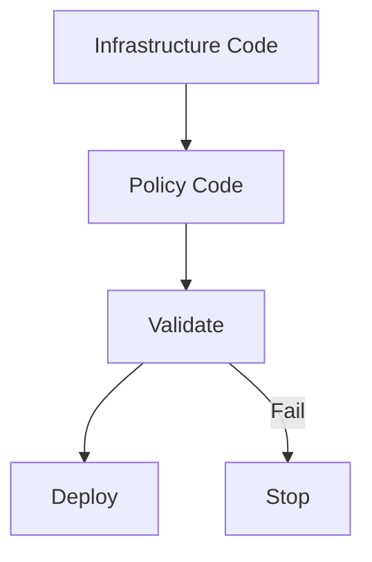
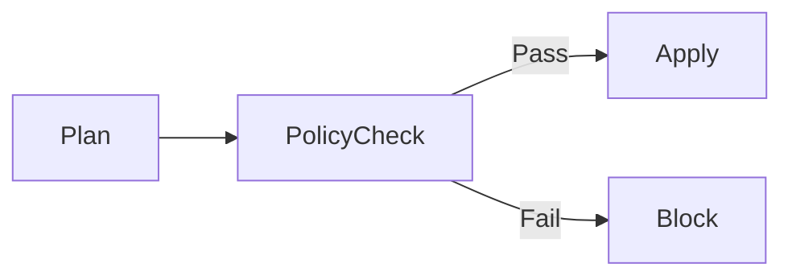

# Policy as Code Integration in Azure Pipelines

**Author:** Randy Bordeaux  
**Version:** 1.0  
**Date:** 2026-01-22

---

## Executive Summary

This whitepaper defines **enterprise-grade patterns for implementing Policy-as-Code (PaC) in Azure CI/CD pipelines**. It focuses on integrating **Azure Policy, Terraform-native validation, and pipeline enforcement mechanisms** to ensure that governance, security, and compliance controls are **automatically enforced at deployment time**.

The guidance targets experienced Azure engineers operating **Azure Commercial** environments at scale. Policy is treated as a **first-class code artifact** that is versioned, reviewed, tested, and promoted alongside infrastructure code.

---

## Table of Contents

1. Scope and Governance Objectives  
2. Policy-as-Code Architecture Overview  
3. Azure Policy as Code (Definitions and Initiatives)  
4. Terraform Policy Integration Patterns  
5. Pipeline Enforcement and Validation Stages  
6. Environment Promotion and Policy Drift Control  
7. Security, Compliance, and Auditability  
8. Failure Handling and Exception Management  
9. Anti-Patterns and Common Pitfalls  
10. Tradeoffs and Design Considerations  

---

## Scope and Governance Objectives

This document addresses:

- Enforcing governance controls through code  
- Preventing non-compliant infrastructure deployment  
- Integrating policy validation into CI/CD pipelines  
- Maintaining auditable and repeatable compliance  

Governance objectives include:

- Shift-left policy enforcement  
- Deterministic deployment outcomes  
- Explicit approval of policy exceptions  

---

## Policy-as-Code Architecture Overview

Policy-as-Code integrates **policy definition, validation, and enforcement** directly into delivery pipelines.



Policy evaluation occurs **before resource creation**, not after.

---

## Azure Policy as Code (Definitions and Initiatives)

Azure Policy definitions and initiatives must be managed as source-controlled assets.

Best practices:

- Custom policies stored in Git repositories  
- Initiatives used to group related controls  
- Parameterized policies for reuse  
- Versioned releases aligned to environments  

Policy assignments are deployed via Terraform.

```hcl
resource "azurerm_policy_assignment" "example" {
  name                 = "enforce-secure-baseline"
  scope                = var.policy_scope
  policy_definition_id = var.policy_definition_id
}
```

---

## Terraform Policy Integration Patterns

Terraform enforces policy through multiple layers.

### Pre-Apply Validation

- `terraform validate`  
- Static analysis of resource configuration  
- Custom validation scripts  

### Azure Policy Enforcement

- Deny effects block non-compliant resources  
- Audit effects provide visibility  
- DeployIfNotExists for baseline controls  

Terraform plans must pass all policy checks before apply.

---

## Pipeline Enforcement and Validation Stages

Policy enforcement is embedded as explicit pipeline stages.



Controls:

- Policy compliance evaluated pre-apply  
- Fail-fast behavior on violations  
- Policy results published as pipeline artifacts  

---

## Environment Promotion and Policy Drift Control

Policy drift is managed independently from infrastructure drift.

Best practices:

- Policies promoted ahead of workloads  
- Policy changes require approval  
- Continuous compliance scans scheduled  

Policy changes are treated as **breaking changes** for downstream environments.

---

## Security, Compliance, and Auditability

### Audit Requirements

- Policy definitions versioned and immutable  
- Assignment history retained  
- Compliance results logged centrally  

### Compliance Alignment

Policy-as-Code supports alignment with:

- NIST 800-171 control families  
- Internal security baselines  
- Change management requirements  

Every deployment is provably policy-compliant at execution time.

---

## Failure Handling and Exception Management

### Policy Violations

- Deny effects stop deployment immediately  
- Violations require code or policy updates  
- No inline bypasses in pipelines  

### Exceptions

- Time-bound exemptions only  
- Explicit approval required  
- Logged and reviewed post-expiration  

Emergency exemptions are audited and minimized.

---

## Anti-Patterns and Common Pitfalls

Avoid:

- Manual policy assignment  
- Post-deployment compliance remediation  
- Broad exemptions  
- Hard-coded policy logic in pipelines  

These undermine governance objectives.

---

## Tradeoffs and Design Considerations

### Tradeoffs

- Increased pipeline complexity  
- Slower initial development velocity  

### Benefits

- Predictable compliance  
- Reduced audit burden  
- Strong preventative controls  

---

## Conclusion

Policy-as-Code transforms governance from a reactive process into a **preventative control system**. When tightly integrated with Terraform and CI/CD pipelines, it ensures Azure environments remain secure, compliant, and auditable by default.

---

*End of Document*
