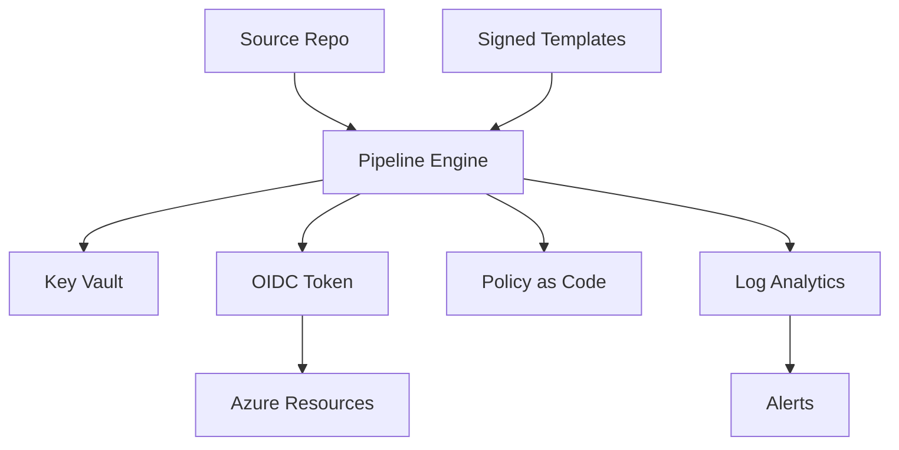

# Security Topics and Controls for Azure DevOps Pipelines

**Author:** Randy Bordeaux  
**Version:** 1.0  
**Date:** January 2026  
**Azure Services:** Azure DevOps, GitHub Actions, Azure Key Vault, Azure Monitor, Microsoft Entra ID

---

## Executive Summary

This document aggregates **security-focused topics and controls** for Azure DevOps and GitHub Actions pipelines. It provides actionable patterns for identity, secrets, policy enforcement, supply-chain protection, compliance evidence, and incident response. The guidance assumes **Azure Commercial** and targets production-grade pipelines delivering both application and infrastructure workloads.

**Key Outcomes:**
- Standardize secure identities with **OIDC/workload identity federation** and environment-scoped service connections
- Enforce **secretless execution** with Azure Key Vault and short-lived tokens
- Embed **policy as code** using OPA/conftest and Azure Policy checks before deployment
- Protect the software supply chain with **SBOMs, signing, and artifact integrity**
- Monitor, audit, and respond using **Log Analytics, KQL alerts, and runbooks**

---

## Table of Contents

- [Executive Summary](#executive-summary)
- [Scope and Design Principles](#scope-and-design-principles)
- [Identity and Access Control](#identity-and-access-control)
- [Secrets Management](#secrets-management)
- [Pipeline Hardening](#pipeline-hardening)
- [Supply Chain Security](#supply-chain-security)
- [Policy as Code and Governance](#policy-as-code-and-governance)
- [Compliance, Audit, and Logging](#compliance-audit-and-logging)
- [Monitoring, Detection, and Alerting](#monitoring-detection-and-alerting)
- [Incident Response and Recovery](#incident-response-and-recovery)
- [Anti-Patterns and Tradeoffs](#anti-patterns-and-tradeoffs)
- [References and Resources](#references-and-resources)
- [Appendices](#appendices)

---

## Scope and Design Principles

### In Scope

- Secure identities for pipelines (Azure DevOps, GitHub Actions) using OIDC/federated credentials
- Secretless patterns with Azure Key Vault and just-in-time tokens
- Policy enforcement (OPA/conftest, Azure Policy) in CI/CD
- Supply-chain controls: SBOM, signing, provenance, artifact retention
- Audit-ready logging with KQL-driven detections
- Incident response runbooks and recovery playbooks

### Out of Scope

- On-premises-only build systems
- Non-Azure identity providers beyond Entra ID
- Application-layer vulns (handled in app security program)

### Design Principles

| Principle | Implementation |
|-----------|----------------|
| Least Privilege | Environment-scoped service connections; role-based permissions; deny shared prod creds |
| Secretless | OIDC/federated credentials; Key Vault-backed secrets; no inline secrets |
| Immutable Pipelines | Templates pinned by tag; no ad-hoc script changes in root pipeline |
| Defense in Depth | Identity + network + policy + artifact integrity + monitoring layers |
| Auditability | Log approvals, policy results, artifact hashes, SBOMs to Log Analytics |
| Recoverability | Documented rollback and key rotation; backup of policies and templates |

---

## Identity and Access Control

### OIDC for Azure DevOps

```yaml
# azure-pipelines.yml
variables:
  serviceConnection: 'svc-prod'
  managedIdentityClientId: '00000000-0000-0000-0000-000000000000'

steps:
  - task: AzureCLI@2
    displayName: Login with OIDC
    inputs:
      azureSubscription: $(serviceConnection)
      scriptType: bash
      scriptLocation: inlineScript
      inlineScript: |
        export ARM_USE_OIDC=true
        export ARM_CLIENT_ID=$(managedIdentityClientId)
        export ARM_TENANT_ID=$(ARM_TENANT_ID)
        export ARM_SUBSCRIPTION_ID=$(ARM_SUBSCRIPTION_ID)
        az account show
```

### GitHub Actions Federated Credential

```yaml
# .github/workflows/deploy.yml
permissions:
  id-token: write
  contents: read

jobs:
  deploy:
    runs-on: ubuntu-latest
    steps:
      - uses: actions/checkout@v4
      - uses: azure/login@v1
        with:
          client-id: ${{ secrets.AZURE_CLIENT_ID }}
          tenant-id: ${{ secrets.AZURE_TENANT_ID }}
          subscription-id: ${{ secrets.AZURE_SUBSCRIPTION_ID }}
```

### RBAC Scoping

- Separate service connections per environment (dev/test/stage/prod)
- Roles: `Contributor` for app resource group, `Storage Blob Data Contributor` for state, `Key Vault Secrets User` for retrieval only
- Deny assignment where possible for non-prod identities on prod scopes

---

## Secrets Management

### Key Vault Integration (Azure DevOps)

```yaml
steps:
  - task: AzureKeyVault@2
    inputs:
      azureSubscription: 'svc-nonprod'
      KeyVaultName: 'kv-pipeline-nonprod'
      SecretsFilter: 'sp-client-id,sp-client-secret'
```

### Secretless Patterns

- Prefer OIDC tokens over client secrets
- If secrets required, store in Key Vault; never in YAML or variable groups as plain text
- Rotate secrets on schedule; track rotation tickets

### Prevent Secret Exfiltration

```yaml
steps:
  - task: Bash@3
    displayName: Disable command echo for secrets
    inputs:
      targetType: inline
      script: |
        set +x
        echo "Running without echo"
```

---

## Pipeline Hardening

- `lockBehavior: sequential` for prod pipelines to prevent concurrent deploys
- Set `condition: succeeded()` on deploy jobs; avoid `always()` for prod resources
- Pin tool versions (Terraform, Node, .NET SDK) to avoid drift
- Require manual validations for prod
- Use deployment jobs with environment checks

```yaml
stages:
- stage: Deploy_Prod
  jobs:
    - deployment: Apply
      environment: prod
      strategy:
        runOnce:
          deploy:
            steps:
              - script: ./deploy.sh
                displayName: Deploy
                retryCountOnTaskFailure: 2
                timeoutInMinutes: 30
```

---

## Supply Chain Security

### SBOM and Signing

```yaml
steps:
  - script: syft packages dir:./ -o json > sbom.json
    displayName: Generate SBOM
  - script: cosign sign-blob --key azkms://kv-sig/key1 --output-signature sbom.sig sbom.json
    displayName: Sign SBOM
```

### Artifact Integrity Validation

```yaml
steps:
  - script: |
      cosign verify-blob --key azkms://kv-sig/key1 --signature sbom.sig sbom.json
    displayName: Verify SBOM Signature
```

### Feed Controls

- Use private feeds (Azure Artifacts) with scoped tokens
- Enable retention and immutability on critical artifacts
- Disallow `latest` tags; require digest pinning for images

---

## Policy as Code and Governance

### OPA/Rego Example

```rego
package pipelines.security

default allow = false

allow {
  input.stage == "prod"
  input.has_approval
  not input.uses_public_agent
}

violation[msg] {
  input.uses_public_agent
  msg = "Public agents not allowed for prod"
}
```

### Conftest Step

```yaml
steps:
  - script: |
      set -euo pipefail
      conftest test pipelines --policy policies/opa
    displayName: Policy Check
```

### Azure Policy Gate

- Require policy compliance checks before deployment
- Use Azure DevOps environment checks or GitHub branch protection with required status checks

---

## Compliance, Audit, and Logging

- Emit pipeline logs and approvals to Log Analytics
- Store plan/apply artifacts, SBOMs, signatures for 90+ days
- Tag runs with `environment`, `commit`, `build.reason`

```kql
// Identify failed approvals
AzureDiagnostics
| where Category == "Approvals"
| where Status != "Approved"
| project TimeGenerated, StageName, Approver, Status
```

---

## Monitoring, Detection, and Alerting

### Pipeline Failure Alerts

```kql
AzureDiagnostics
| where Category == "PipelineRuns"
| where Status == "Failed"
| summarize Failures = count() by PipelineName, bin(TimeGenerated, 1h)
| where Failures > 3
```

### Unauthorized Access Detection (Key Vault)

```kql
AzureDiagnostics
| where ResourceProvider == "MICROSOFT.KEYVAULT"
| where OperationName == "VaultGetSecret"
| where ResultSignature != "Success"
| summarize Attempts = count() by CallerIpAddress, bin(TimeGenerated, 1h)
| where Attempts > 5
```

### Alert Rule (Example)

```hcl
resource "azurerm_monitor_scheduled_query_rules_alert_v2" "pipeline_failures" {
  name                = "alert-pipeline-failures"
  resource_group_name = var.resource_group
  location            = var.location
  scopes              = [var.log_analytics_workspace_id]
  severity            = 2

  criteria {
    query = <<-QUERY
      AzureDiagnostics
      | where Category == "PipelineRuns"
      | where Status == "Failed"
      | summarize Failures = count() by PipelineName, bin(TimeGenerated, 15m)
      | where Failures > 1
    QUERY
    operator  = "GreaterThan"
    threshold = 0
    time_aggregation_method = "Count"
  }

  action {
    action_groups = [azurerm_monitor_action_group.devops.id]
  }
}
```

---

## Incident Response and Recovery

### Playbook

1. **Contain**: Pause deployments; disable affected service connection
2. **Investigate**: Pull logs (pipeline, Key Vault, RBAC changes)
3. **Eradicate**: Rotate credentials, revoke tokens
4. **Recover**: Re-enable pipelines with new identities; validate with test deployment
5. **Postmortem**: Document root cause; add detections and controls

### Rollback Example (Terraform)

```bash
#!/bin/bash
set -euo pipefail

if [ ! -f tfplan-prev ]; then
  echo "Previous plan missing" && exit 1
fi

echo "Applying previous known-good plan"
terraform apply tfplan-prev
```

### Key Rotation Script (Example)

```bash
#!/bin/bash
set -euo pipefail

VAULT=kv-pipeline-prod
SECRET=sp-client-secret

NEW=$(uuidgen)
az keyvault secret set --vault-name "$VAULT" --name "$SECRET" --value "$NEW"
echo "Secret rotated; update service connection to use new value"
```

---

## Anti-Patterns and Tradeoffs

| Anti-Pattern | Risk | Mitigation |
|--------------|------|------------|
| Shared prod service connection used by all stages | Blast radius if compromised | Separate per-environment connections; least privilege scopes |
| Inline secrets in YAML or variable groups | Secret leakage, audit failure | Key Vault secrets; OIDC tokens |
| Floating template refs (`@main`) | Unreviewed changes reach prod | Pin tags; drift alerts |
| No SBOM or signing | Supply-chain tampering undetected | Generate SBOM; sign/verify artifacts |
| Public hosted agents for prod | Exposure of credentials/artifacts | Use private/self-hosted agents for prod |

---

## References and Resources

- Azure Pipelines security: https://learn.microsoft.com/azure/devops/pipelines/security/roles
- OIDC with Azure: https://learn.microsoft.com/azure/active-directory/develop/workload-identity-federation
- Azure Key Vault integration: https://learn.microsoft.com/azure/key-vault/secrets/tutorial-net-create-vault-azure-web-app
- OPA/conftest: https://www.openpolicyagent.org/docs/latest/conftest/
- SBOM with Syft: https://github.com/anchore/syft
- Cosign signing: https://docs.sigstore.dev/cosign/overview

---

## Appendices

### Appendix A: Security Checklist

- [ ] OIDC/federated credentials for pipelines; no stored client secrets
- [ ] Environment-scoped service connections with least privilege
- [ ] Key Vault-backed secrets; secret scanning enabled
- [ ] Templates pinned by tag; no `@main` in prod
- [ ] SBOM generated and signed; artifacts verified before deploy
- [ ] Policy checks (OPA/Conftest) blocking on violation
- [ ] Approvals and checks for non-dev environments
- [ ] Logs and artifacts retained for 90+ days; alerts configured
- [ ] Self-hosted agents for prod; network egress restricted
- [ ] Incident response playbook reviewed quarterly

### Appendix B: Sample Variable Group Definition

```yaml
variables:
- name: azureSubscription
  value: 'svc-prod'
- name: keyVaultName
  value: 'kv-pipeline-prod'
- name: tfStateStorage
  value: 'sttfstateprod001'
```

### Appendix C: KQL Snippets

```kql
// Service connection usage by pipeline
AzureDiagnostics
| where Category == "PipelineRuns"
| summarize Count = count() by PipelineName, ServiceConnection, bin(TimeGenerated, 1d)
```

```kql
// Key Vault secret fetches by identity
AzureDiagnostics
| where ResourceProvider == "MICROSOFT.KEYVAULT"
| where OperationName == "VaultGetSecret"
| summarize Count = count() by Identity, bin(TimeGenerated, 1d)
```

### Appendix D: Mermaid Overview



---

**Document Version:** 1.0  
**Last Updated:** January 2026  
**Author:** Randy Bordeaux  
**Review Cycle:** Quarterly
