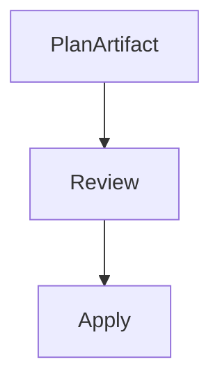
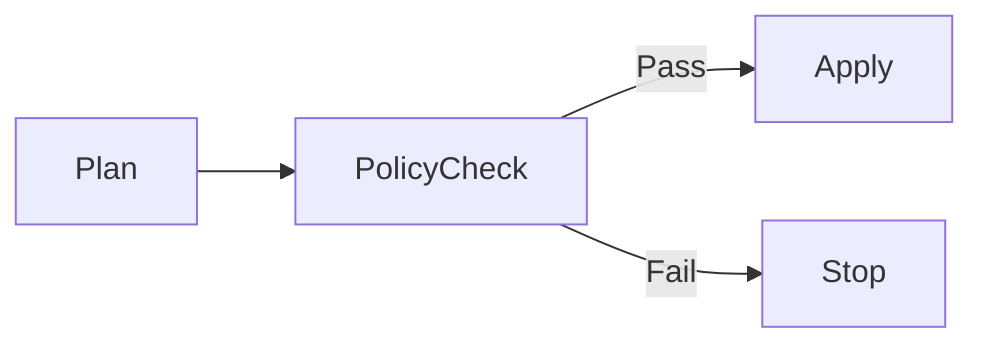

# Terraform Pipeline Automation and Best Practices in Azure

**Author:** Randy Bordeaux  
**Version:** 1.0  
**Date:** 2026-01-22  

---

## Executive Summary

This whitepaper defines **enterprise-grade best practices for automating Terraform execution in Azure CI/CD pipelines**. It focuses on **safe, repeatable, and auditable infrastructure delivery** using Terraform as the authoritative infrastructure-as-code (IaC) mechanism within multi-stage YAML pipelines.

The guidance targets experienced Azure engineers operating **Azure Commercial** environments at scale. Terraform automation is treated as a **controlled change system**, not a convenience wrapper around ad-hoc execution.

---

## Table of Contents

1. Scope and Design Principles  
2. Terraform Pipeline Execution Model  
3. Repository and Module Strategy  
4. State Management and Backend Design  
5. Plan, Apply, and Promotion Patterns  
6. Identity, Access, and Secrets Handling  
7. Policy Enforcement and Guardrails  
8. Drift Detection and Continuous Reconciliation  
9. Failure Handling and Recovery  
10. Anti-Patterns and Tradeoffs  

---

## Scope and Design Principles

This document addresses:

- Automating Terraform safely through CI/CD pipelines  
- Enforcing deterministic plan and apply behavior  
- Preventing configuration drift and unauthorized changes  
- Embedding security and governance into Terraform workflows  

Design principles:

- Pipelines own execution, humans own intent  
- Terraform plans are reviewable artifacts  
- State is isolated, secured, and auditable  
- Production changes require explicit approval  

---

## Terraform Pipeline Execution Model

Terraform execution is stage-bound and environment-specific.


Rules:

- `terraform validate` always runs first  
- `terraform plan` is read-only  
- `terraform apply` is gated and controlled  
- No direct CLI execution outside pipelines  

---

## Repository and Module Strategy

### Repository Structure

- Root repository orchestrates environments  
- Terraform modules are versioned and reusable  
- Environment configuration is explicit  

Example layout:

```
/terraform
  /modules
  /env
    /dev
    /test
    /prod
```

Rules:

- No environment conditionals inside modules  
- Modules never reference pipeline variables directly  
- All inputs passed via variables  

---

## State Management and Backend Design

State is a **security boundary**.

```hcl
terraform {
  backend "azurerm" {
    resource_group_name  = var.tfstate_rg
    storage_account_name = var.tfstate_storage
    container_name       = var.environment
    key                  = "infra.tfstate"
  }
}
```

Best practices:

- Separate backend per environment  
- Private endpoints for state storage  
- RBAC-based access control  
- State access logged and monitored  

State files are never handled as pipeline artifacts.

---

## Plan, Apply, and Promotion Patterns

### Plan Stage

- Generates immutable plan artifacts  
- Captures resource diffs and risk  
- Blocks destructive changes by policy  

### Apply Stage

- Consumes approved plan only  
- Requires manual approval for production  
- Uses environment-scoped identity  



No re-planning is permitted during apply.

---

## Identity, Access, and Secrets Handling

Controls:

- One service principal or managed identity per environment  
- Least-privilege RBAC assignments  
- Secrets retrieved from Azure Key Vault at runtime  

Anti-patterns:

- Shared service principals  
- Inline secrets  
- Owner or Contributor in production  

Terraform credentials are ephemeral and never persisted.

---

## Policy Enforcement and Guardrails

Terraform automation must enforce policy.

Controls include:

- `terraform fmt -check`  
- `terraform validate`  
- Azure Policy deny effects  
- Custom pre-apply validation  



Policy violations halt promotion automatically.

---

## Drift Detection and Continuous Reconciliation

Drift is inevitable and must be detected.

Recommended approach:

- Scheduled plan-only pipelines  
- No auto-apply in drift detection  
- Alerts on unexpected changes  

Drift pipelines provide visibility without mutating state.

---

## Failure Handling and Recovery

Failure handling principles:

- Fail fast  
- Never force state unlocks casually  
- Investigate before retry  

Recovery actions:

- Fix-forward with code changes  
- Targeted applies only when approved  
- Post-incident review mandatory  

State corruption incidents are treated as security events.

---

## Anti-Patterns and Tradeoffs

### Anti-Patterns

- Running `apply` without review  
- Manual state manipulation  
- Shared backends across environments  
- Using Terraform workspaces for isolation  

### Tradeoffs

- Slower deployment velocity  
- Higher operational discipline required  

Benefits outweigh cost in regulated environments.

---

## Conclusion

Terraform pipeline automation is a **governance system**, not a scripting exercise. When designed correctly, it delivers consistent, secure, and auditable infrastructure changes across Azure environments at scale.

---

*End of Document*
