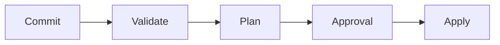
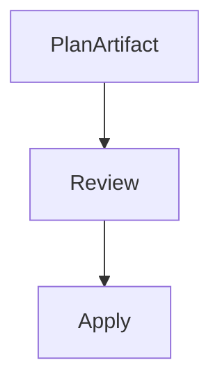
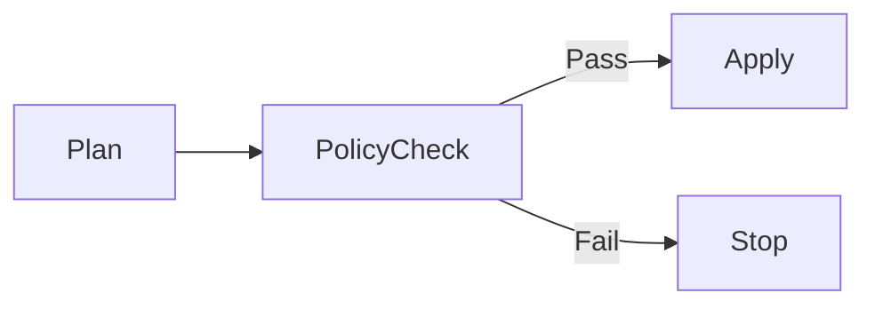

# Terraform Pipeline Automation and Best Practices in Azure

**Author:** Randy Bordeaux  
**Version:** 1.0  
**Date:** January 2026  
**Azure Services:** Terraform, Azure DevOps, Azure Pipelines, Entra ID

---

## Executive Summary

This whitepaper defines **enterprise-grade best practices for automating Terraform execution in Azure CI/CD pipelines**, with focus on **safe, repeatable, auditable infrastructure delivery** and **preventing drift through automated reconciliation**. It treats **Terraform as a controlled change system** with multiple validation gates, approval workflows, and continuous compliance monitoring.

Terraform automation is enforced through **multi-stage YAML pipelines** that separate plan, review, and apply activities. State management uses **backend isolation, RBAC enforcement, and comprehensive auditing**. Policy-as-code integration prevents non-compliant infrastructure deployments.

**Key Outcomes:**
- Automate infrastructure changes through safe, gated pipelines
- Implement deterministic Terraform execution with repeatable outcomes
- Maintain complete audit trail of all infrastructure modifications
- Prevent drift through continuous reconciliation and monitoring
- Enable infrastructure promotion across environments (dev → test → prod)

---

## Table of Contents

- [Terraform Pipeline Automation and Best Practices in Azure](#terraform-pipeline-automation-and-best-practices-in-azure)
  - [Executive Summary](#executive-summary)
  - [Table of Contents](#table-of-contents)
  - [Scope and Design Principles](#scope-and-design-principles)
    - [In Scope](#in-scope)
    - [Out of Scope](#out-of-scope)
    - [Core Design Principles](#core-design-principles)
  - [Terraform Pipeline Execution Model](#terraform-pipeline-execution-model)
  - [Repository and Module Strategy](#repository-and-module-strategy)
    - [Repository Structure](#repository-structure)
  - [State Management and Backend Design](#state-management-and-backend-design)
  - [Plan, Apply, and Promotion Patterns](#plan-apply-and-promotion-patterns)
    - [Plan Stage](#plan-stage)
    - [Apply Stage](#apply-stage)
  - [Identity, Access, and Secrets Handling](#identity-access-and-secrets-handling)
  - [Policy Enforcement and Guardrails](#policy-enforcement-and-guardrails)
  - [Drift Detection and Continuous Reconciliation](#drift-detection-and-continuous-reconciliation)
  - [Failure Handling and Recovery](#failure-handling-and-recovery)
  - [Anti-Patterns and Tradeoffs](#anti-patterns-and-tradeoffs)
    - [Anti-Patterns](#anti-patterns)
    - [Tradeoffs](#tradeoffs)
  - [Conclusion](#conclusion)
  - [Terraform Pipeline Architecture](#terraform-pipeline-architecture)
    - [Three-Tier Execution Model](#three-tier-execution-model)
    - [Pipeline Execution Guarantees](#pipeline-execution-guarantees)
  - [Repository and Module Strategy](#repository-and-module-strategy-1)
    - [Recommended Repository Structure](#recommended-repository-structure)
    - [Module Design Principles](#module-design-principles)
    - [Version Management](#version-management)
  - [State Management and Backend Design](#state-management-and-backend-design-1)
    - [Backend Architecture](#backend-architecture)
    - [Backend Security Configuration](#backend-security-configuration)
  - [Plan, Apply, and Approval Workflows](#plan-apply-and-approval-workflows)
    - [Terraform Plan Parsing and Analysis](#terraform-plan-parsing-and-analysis)
    - [Approval Gate Implementation](#approval-gate-implementation)
  - [Multi-Stage Pipeline Implementation](#multi-stage-pipeline-implementation)
    - [Azure DevOps Pipeline (Complete)](#azure-devops-pipeline-complete)

---

## Scope and Design Principles

### In Scope

- Automating Terraform safely through CI/CD pipelines with multi-stage workflows
- Enforcing deterministic plan and apply behavior with repeatable outcomes
- Preventing configuration drift through continuous reconciliation
- Implementing least-privilege identity and access controls
- Embedding policy-as-code enforcement into Terraform workflows
- Managing state as a security boundary with encryption and RBAC
- Auditing all infrastructure changes and approvals

### Out of Scope

- Terraform module development (internal module patterns only)
- Terraform Cloud/Enterprise (self-hosted Azure focus)
- Terraform language fundamentals (assumes intermediate knowledge)
- Application deployment orchestration (IaC only)

### Core Design Principles

| Principle | Implementation |
|-----------|----------------|
| **Pipelines Own Execution** | No direct `terraform apply` outside CI/CD; all changes via pull requests |
| **Humans Own Intent** | Code review required before any infrastructure change |
| **Plans Are Artifacts** | Terraform plans saved as immutable artifacts and reviewed before apply |
| **State Is Secure** | Backend isolation, encryption at rest/transit, RBAC enforcement |
| **Auditable Everything** | Complete audit trail: who, what, when, where, why for all changes |
| **Deterministic Outcomes** | Same code + same state = identical infrastructure every time |
| **Approval Gates** | Production changes require multiple approvals (policy + human) |  

---

## Terraform Pipeline Execution Model

Terraform execution is stage-bound and environment-specific.



Rules:

- `terraform validate` always runs first  
- `terraform plan` is read-only  
- `terraform apply` is gated and controlled  
- No direct CLI execution outside pipelines  

---

## Repository and Module Strategy

### Repository Structure

- Root repository orchestrates environments  
- Terraform modules are versioned and reusable  
- Environment configuration is explicit  

Example layout:

```
/terraform
  /modules
  /env
    /dev
    /test
    /prod
```

Rules:

- No environment conditionals inside modules  
- Modules never reference pipeline variables directly  
- All inputs passed via variables  

---

## State Management and Backend Design

State is a **security boundary**.

```hcl
terraform {
  backend "azurerm" {
    resource_group_name  = var.tfstate_rg
    storage_account_name = var.tfstate_storage
    container_name       = var.environment
    key                  = "infra.tfstate"
  }
}
```

Best practices:

- Separate backend per environment  
- Private endpoints for state storage  
- RBAC-based access control  
- State access logged and monitored  

State files are never handled as pipeline artifacts.

---

## Plan, Apply, and Promotion Patterns

### Plan Stage

- Generates immutable plan artifacts  
- Captures resource diffs and risk  
- Blocks destructive changes by policy  

### Apply Stage

- Consumes approved plan only  
- Requires manual approval for production  
- Uses environment-scoped identity  



No re-planning is permitted during apply.

---

## Identity, Access, and Secrets Handling

Controls:

- One service principal or managed identity per environment  
- Least-privilege RBAC assignments  
- Secrets retrieved from Azure Key Vault at runtime  

Anti-patterns:

- Shared service principals  
- Inline secrets  
- Owner or Contributor in production  

Terraform credentials are ephemeral and never persisted.

---

## Policy Enforcement and Guardrails

Terraform automation must enforce policy.

Controls include:

- `terraform fmt -check`  
- `terraform validate`  
- Azure Policy deny effects  
- Custom pre-apply validation  



Policy violations halt promotion automatically.

---

## Drift Detection and Continuous Reconciliation

Drift is inevitable and must be detected.

Recommended approach:

- Scheduled plan-only pipelines  
- No auto-apply in drift detection  
- Alerts on unexpected changes  

Drift pipelines provide visibility without mutating state.

---

## Failure Handling and Recovery

Failure handling principles:

- Fail fast  
- Never force state unlocks casually  
- Investigate before retry  

Recovery actions:

- Fix-forward with code changes  
- Targeted applies only when approved  
- Post-incident review mandatory  

State corruption incidents are treated as security events.

---

## Anti-Patterns and Tradeoffs

### Anti-Patterns

- Running `apply` without review  
- Manual state manipulation  
- Shared backends across environments  
- Using Terraform workspaces for isolation  

### Tradeoffs

- Slower deployment velocity  
- Higher operational discipline required  

Benefits outweigh cost in regulated environments.

---

## Conclusion

Terraform pipeline automation is a **governance system**, not a scripting exercise. When designed correctly, it delivers consistent, secure, and auditable infrastructure changes across Azure environments at scale.

---

*End of Document*

---

## Terraform Pipeline Architecture

### Three-Tier Execution Model

```
┌─────────────────────────────────────────────────────────┐
│ Tier 1: Validate (Local + CI)                           │
│ - terraform validate, fmt, tflint                       │
│ - Policy validation (Conftest, OPA)                     │
│ - Cost estimation and diff analysis                     │
└─────────────────────────────────────────────────────────┘
              ↓ (Must pass to continue)
┌─────────────────────────────────────────────────────────┐
│ Tier 2: Plan & Review (CI/CD Pipeline)                 │
│ - terraform plan (read-only, no side effects)           │
│ - Parse and analyze plan JSON                           │
│ - Generate plan artifacts and summaries                 │
│ - Require code review + policy approval                 │
└─────────────────────────────────────────────────────────┘
              ↓ (Manual approval required)
┌─────────────────────────────────────────────────────────┐
│ Tier 3: Apply & Audit (Controlled Execution)           │
│ - terraform apply with saved plan                       │
│ - Audit logging of all changes                          │
│ - Post-apply verification and drift detection           │
│ - Compliance monitoring                                 │
└─────────────────────────────────────────────────────────┘
```

### Pipeline Execution Guarantees

- ✅ **Never apply without a saved plan**: `terraform apply tfplan` only
- ✅ **Never skip validation**: Policy checks are non-bypassable
- ✅ **Never apply to wrong environment**: Backend validation on every run
- ✅ **Never lose audit trail**: Every change logged with actor and timestamp

---

## Repository and Module Strategy

### Recommended Repository Structure

```
terraform/
├── .github/
│   ├── workflows/
│   │   ├── validate.yml
│   │   ├── plan.yml
│   │   └── apply.yml
│   └── CODEOWNERS
│
├── modules/
│   ├── networking/
│   │   ├── main.tf
│   │   ├── variables.tf
│   │   ├── outputs.tf
│   │   └── README.md
│   ├── storage/
│   ├── compute/
│   └── security/
│
├── environments/
│   ├── dev/
│   │   ├── main.tf
│   │   ├── variables.tf
│   │   ├── terraform.tfvars
│   │   └── backend.tf
│   ├── test/
│   ├── staging/
│   └── prod/
│       └── requires additional approvals
│
├── policies/
│   ├── terraform.rego
│   ├── conftest.toml
│   └── data.json
│
├── tests/
│   ├── terraform_tests.tf
│   └── module_tests/
│
├── docs/
│   ├── CONTRIBUTING.md
│   ├── ARCHITECTURE.md
│   └── MODULE_REGISTRY.md
│
└── .gitignore, .terraform-docs.yml, etc.
```

### Module Design Principles

```hcl
# ✅ GOOD: Modules are self-contained and reusable

module "storage_account" {
  source = "git::https://github.com/myorg/terraform-modules.git//azurerm_storage?ref=v1.2.0"

  # All inputs explicit and documented
  resource_group_name  = azurerm_resource_group.main.name
  location             = azurerm_resource_group.main.location
  environment          = var.environment
  storage_account_name = var.storage_account_name

  # No environment-specific logic inside module
  # Module doesn't reference variables from parent scope
  
  tags = var.common_tags
}

# ❌ BAD: Environment logic inside module
resource "azurerm_storage_account" "bad_example" {
  # Conditional logic breaks reproducibility
  account_tier = var.environment == "prod" ? "Premium" : "Standard"
  
  # Hard-coded values reduce reusability
  https_traffic_only_enabled = true
}
```

### Version Management

```hcl
# modules/networking/versions.tf

terraform {
  required_version = ">= 1.6"
  required_providers {
    azurerm = {
      source  = "hashicorp/azurerm"
      version = "~> 3.80"
    }
    random = {
      source  = "hashicorp/random"
      version = "~> 3.6"
    }
  }
}

# Lock file: terraform.lock.hcl
# Committed to Git for reproducible builds
```

---

## State Management and Backend Design

### Backend Architecture

```hcl
# environments/prod/backend.tf

terraform {
  backend "azurerm" {
    # Backend values cannot use interpolation
    # Must be passed via -backend-config flags
    resource_group_name  = "rg-tfstate-prod"
    storage_account_name = "satestateprod"
    container_name       = "tfstate"
    key                  = "prod-infra.tfstate"
  }
}

# Pipeline passes backend config dynamically
# Command: terraform init \
#   -backend-config="resource_group_name=..." \
#   -backend-config="storage_account_name=..." \
#   -backend-config="container_name=..."
```

### Backend Security Configuration

```hcl
# modules/tfstate_backend/main.tf

# Storage account for Terraform state
resource "azurerm_storage_account" "tfstate" {
  name                     = "sa${var.environment}tfstate"
  resource_group_name      = azurerm_resource_group.tfstate.name
  location                 = azurerm_resource_group.tfstate.location
  account_tier             = "Standard"
  account_replication_type = "GRS"  # Geo-redundant for production

  # Enforce HTTPS
  https_traffic_only_enabled = true

  # Disable public access
  public_network_access_enabled = false

  # Enable encryption
  identity {
    type = "SystemAssigned"
  }

  tags = var.tags
}

# Storage container for state files
resource "azurerm_storage_container" "tfstate" {
  name                  = "tfstate"
  storage_account_name  = azurerm_storage_account.tfstate.name
  container_access_type = "private"
}

# Private endpoint for state backend access
resource "azurerm_private_endpoint" "tfstate" {
  name                = "pep-tfstate-${var.environment}"
  location            = azurerm_resource_group.tfstate.location
  resource_group_name = azurerm_resource_group.tfstate.name
  subnet_id           = var.pipeline_subnet_id

  private_service_connection {
    name                           = "psc-tfstate"
    is_manual_connection           = false
    private_connection_resource_id = azurerm_storage_account.tfstate.id
    subresource_names              = ["blob"]
  }
}

# Management lock: Prevent accidental deletion
resource "azurerm_management_lock" "tfstate_no_delete" {
  name       = "no-delete-tfstate"
  scope      = azurerm_storage_account.tfstate.id
  lock_level = "CanNotDelete"
}

# RBAC: Least-privilege access
resource "azurerm_role_assignment" "tfstate_access" {
  scope              = azurerm_storage_account.tfstate.id
  role_definition_id = "/subscriptions/${data.azurerm_client_config.current.subscription_id}/providers/Microsoft.Authorization/roleDefinitions/ba92f5b4-2d11-453d-a403-e96b0029c9fe"  # Storage Blob Data Contributor
  principal_id       = azuread_service_principal.terraform_sp.object_id
}

# Auditing: Log all state access
resource "azurerm_monitor_diagnostic_setting" "tfstate_audit" {
  name                       = "diag-tfstate"
  target_resource_id         = azurerm_storage_account.tfstate.id
  log_analytics_workspace_id = var.log_analytics_workspace_id

  metrics {
    category = "Transaction"
    enabled  = true
  }

  log {
    category = "StorageRead"
    enabled  = true
  }
}

# Versioning: Retain state history
resource "azurerm_storage_account_blob_properties" "tfstate" {
  storage_account_id = azurerm_storage_account.tfstate.id

  versioning_enabled = true
  delete_retention_days = 30
  restore_policy {
    days = 6
  }
}
```

---

## Plan, Apply, and Approval Workflows

### Terraform Plan Parsing and Analysis

```hcl
# Plan analysis: Parse terraform plan JSON for review

locals {
  # Parse plan output
  plan_json = jsondecode(file("${path.module}/terraform.plan.json"))
  
  # Extract resource changes
  resource_changes = {
    for change in local.plan_json.resource_changes :
    change.address => change
  }

  # Count actions by type
  creates  = length([for c in local.resource_changes : c if c.change.actions == ["create"]])
  updates  = length([for c in local.resource_changes : c if c.change.actions == ["update"]])
  destroys = length([for c in local.resource_changes : c if c.change.actions == ["delete"]])
  
  # Flag dangerous operations
  dangerous_destroys = [
    for addr, change in local.resource_changes :
    addr
    if (
      can(change.change.actions[0]) &&
      change.change.actions[0] == "delete" &&
      contains([
        "azurerm_sql_database",
        "azurerm_storage_account",
        "azurerm_key_vault"
      ], change.type)
    )
  ]
}

output "plan_summary" {
  value = {
    creates  = local.creates
    updates  = local.updates
    destroys = local.destroys
    resources_affected = length(local.resource_changes)
    dangerous_operations = local.dangerous_destroys
  }
}
```

### Approval Gate Implementation

```hcl
# Service principal for pipeline automation
resource "azuread_application" "terraform_pipeline" {
  display_name = "app-terraform-pipeline"
}

resource "azuread_service_principal" "terraform_sp" {
  client_id = azuread_application.terraform_pipeline.client_id

  tags = ["Terraform", "Pipeline"]
}

# RBAC: Assign minimal permissions
resource "azurerm_role_assignment" "terraform_contributor" {
  scope              = var.subscription_id
  role_definition_name = "Contributor"
  principal_id       = azuread_service_principal.terraform_sp.object_id
  
  # Time-limited: Expires after 12 months for security review
  expires_on = timeadd(timestamp(), "8760h")
}

# PIM integration for production
resource "azurerm_pim_eligible_role_assignment" "terraform_prod_owner" {
  scope              = var.production_subscription_id
  role_definition_id = "/subscriptions/${var.production_subscription_id}/providers/Microsoft.Authorization/roleDefinitions/8e3af657-a8ff-443c-a75c-2fe8c4bcb635"  # Owner
  principal_id       = azuread_service_principal.terraform_sp.object_id
}
```

---

## Multi-Stage Pipeline Implementation

### Azure DevOps Pipeline (Complete)

```yaml
trigger:
  branches:
    include:
      - main
      - develop
      - feature/*
  paths:
    include:
      - terraform/**
      - policies/**

pr:
  branches:
    include:
      - main
      - develop

variables:
  terraform_version: 1.6.0
  tflint_version: 0.50.0
  tfstate_resource_group: rg-tfstate
  tfstate_storage_account: sastateprod

stages:
  - stage: Validate
    displayName: 'Terraform Validation'
    condition: always()
    jobs:
      - job: Format
        displayName: 'Terraform Format Check'
        steps:
          - task: TerraformInstaller@1
            inputs:
              terraformVersion: '$(terraform_version)'

          - script: |
              cd $(Build.SourcesDirectory)/terraform
              terraform fmt -check -recursive
            displayName: 'Check Formatting'
            continueOnError: false

      - job: Validate
        displayName: 'Terraform Validate & Lint'
        steps:
          - task: TerraformInstaller@1
            inputs:
              terraformVersion: '$(terraform_version)'

          - script: |
              # Install tflint
              curl -s https://raw.githubusercontent.com/terraform-linters/tflint/master/install_linux.sh | bash
            displayName: 'Install tflint'

          - script: |
              cd $(Build.SourcesDirectory)/terraform
              
              # Validate syntax
              terraform init -backend=false
              terraform validate
              
              # Run linting
              tflint --init
              tflint --recursive --format json > linting_results.json || true
              
              # Check for errors (not warnings)
              if grep -q '"type":"error"' linting_results.json; then
                echo "##vso[task.logissue type=error]Linting errors detected"
                exit 1
              fi
            displayName: 'Validate & Lint'

          - publish: $(Build.SourcesDirectory)/terraform/linting_results.json
            artifact: LintingResults
            displayName: 'Publish Linting Results'

  - stage: PlanDev
    displayName: 'Plan - Development'
    dependsOn: Validate
    condition: succeeded()
    jobs:
      - job: PlanJob
        displayName: 'Terraform Plan'
        steps:
          - checkout: self
          - task: TerraformInstaller@1
            inputs:
              terraformVersion: '$(terraform_version)'

          - task: AzureCLI@2
            displayName: 'Authenticate'
            inputs:
              azureSubscription: 'Azure-Dev-ServiceConnection'
              scriptType: 'bash'
              scriptLocation: 'inlineScript'
              inlineScript: |
                az account show

          - script: |
              cd $(Build.SourcesDirectory)/terraform/environments/dev
              
              terraform init \
                -backend-config="resource_group_name=$(tfstate_resource_group)" \
                -backend-config="storage_account_name=$(tfstate_storage_account)" \
                -backend-config="container_name=tfstate-dev" \
                -backend-config="key=terraform.tfstate"
              
              terraform plan \
                -var-file=terraform.tfvars \
                -out=terraform.dev.plan
            displayName: 'Generate Plan'

          - script: |
              cd $(Build.SourcesDirectory)/terraform/environments/dev
              terraform show -json terraform.dev.plan > terraform.plan.json
              cat terraform.plan.json | jq . > plan_summary.json
            displayName: 'Export Plan JSON'

          - publish: $(Build.SourcesDirectory)/terraform/environments/dev/terraform.dev.plan
            artifact: TerraformPlan_Dev
            displayName: 'Publish Plan Artifact'

          - publish: $(Build.SourcesDirectory)/terraform/environments/dev/plan_summary.json
            artifact: PlanSummary_Dev

      - job: PlanAnalysis
        displayName: 'Analyze Plan'
        dependsOn: PlanJob
        condition: succeeded()
        steps:
          - download: current
            artifact: PlanSummary_Dev

          - script: |
              PLAN_FILE=$(Pipeline.Workspace)/PlanSummary_Dev/plan_summary.json
              
              CREATES=$(jq '.resource_changes | map(select(.change.actions[0]=="create")) | length' $PLAN_FILE)
              UPDATES=$(jq '.resource_changes | map(select(.change.actions[0]=="update")) | length' $PLAN_FILE)
              DESTROYS=$(jq '.resource_changes | map(select(.change.actions[0]=="delete")) | length' $PLAN_FILE)
              
              echo "##vso[task.logissue type=information]Plan Summary: +$CREATES ~$UPDATES -$DESTROYS"
              
              # Flag dangerous operations
              DANGEROUS=$(jq '.resource_changes[] | select(.change.actions[0]=="delete") | select(.type | IN("azurerm_sql_database","azurerm_key_vault","azurerm_storage_account"))' $PLAN_FILE | wc -l)
              
              if [ "$DANGEROUS" -gt 0 ]; then
                echo "##vso[task.logissue type=warning]$DANGEROUS dangerous resource deletions detected"
              fi
            displayName: 'Plan Analysis'

  - stage: PlanProd
    displayName: 'Plan - Production'
    dependsOn: Validate
    condition: succeeded()
    jobs:
      - job: PlanJob
        displayName: 'Terraform Plan'
        steps:
          - checkout: self
          - task: TerraformInstaller@1
            inputs:
              terraformVersion: '$(terraform_version)'

          - task: AzureCLI@2
            displayName: 'Authenticate to Production'
            inputs:
              azureSubscription: 'Azure-Prod-ServiceConnection'
              scriptType: 'bash'
              scriptLocation: 'inlineScript'
              inlineScript: |
                az account show

          - script: |
              cd $(Build.SourcesDirectory)/terraform/environments/prod
              
              terraform init \
                -backend-config="resource_group_name=$(tfstate_resource_group)" \
                -backend-config="storage_account_name=$(tfstate_storage_account)" \
                -backend-config="container_name=tfstate-prod" \
                -backend-config="key=terraform.tfstate"
              
              terraform plan \
                -var-file=terraform.tfvars \
                -out=terraform.prod.plan
            displayName: 'Generate Plan'

          - script: |
              cd $(Build.SourcesDirectory)/terraform/environments/prod
              terraform show -json terraform.prod.plan > terraform.plan.json
            displayName: 'Export Plan JSON'

          - publish: $(Build.SourcesDirectory)/terraform/environments/prod/terraform.prod.plan
            artifact: TerraformPlan_Prod

  - stage: ApprovalGate
    displayName: 'Approval Required'
    dependsOn:
      - PlanDev
      - PlanProd
    condition: succeeded()
    jobs:
      - job: ManualApproval
        displayName: 'Require Change Approval'
        pool: server
        timeoutInMinutes: 1440
        steps:
          - task: ManualValidation@0
            timeoutInMinutes: 1440
            inputs:
              notifyUsers: 'terraform-approvers@company.com'
              instructions: |
                Review Terraform plan changes.
                Verify no unauthorized resources are being created/destroyed.
                Approve to proceed with infrastructure changes.
              onTimeout: 'reject'

  - stage: ApplyDev
    displayName: 'Apply - Development'
    dependsOn: ApprovalGate
    condition: succeeded()
    jobs:
      - job: ApplyJob
        displayName: 'Terraform Apply'
        steps:
          - checkout: self
          - task: TerraformInstaller@1
            inputs:
              terraformVersion: '$(terraform_version)'

          - task: AzureCLI@2
            inputs:
              azureSubscription: 'Azure-Dev-ServiceConnection'
              scriptType: 'bash'
              scriptLocation: 'inlineScript'
              inlineScript: |
                az account show

          - download: current
            artifact: TerraformPlan_Dev

          - script: |
              cd $(Build.SourcesDirectory)/terraform/environments/dev
              
              terraform init \
                -backend-config="resource_group_name=$(tfstate_resource_group)" \
                -backend-config="storage_account_name=$(tfstate_storage_account)" \
                -backend-config="container_name=tfstate-dev" \
                -backend-config="key=terraform.tfstate"
              
              # Apply saved plan only
              terraform apply \
                -input=false \
                -no-color \
                $(Pipeline.Workspace)/TerraformPlan_Dev/terraform.dev.plan
            displayName: 'Apply Plan'

          - script: |
              cd $(Build.SourcesDirectory)/terraform/environments/dev
              
              # Export state for audit
              terraform state pull > tfstate.json
              
              # Log changes
              echo "Infrastructure changes applied at $(date)"
              echo "Terraform version: $(terraform version -json | jq .terraform_version)"
            displayName: 'Post-Apply Audit'

  - stage: ApplyProd
    displayName: 'Apply - Production'
    dependsOn: ApprovalGate
    condition: and(succeeded(), eq(variables['Build.SourceBranch'], 'refs/heads/main'))
    jobs:
      - job: ProdApprovalGate
        displayName: 'Require Additional Production Approval'
        pool: server
        timeoutInMinutes: 1440
        steps:
          - task: ManualValidation@0
            timeoutInMinutes: 1440
            inputs:
              notifyUsers: 'infrastructure-leads@company.com'
              instructions: |
                PRODUCTION DEPLOYMENT - Final Approval Required
                This will apply infrastructure changes to production.
                - Verify deployment window
                - Confirm change ticket is approved
                - Ensure rollback plan is documented
              onTimeout: 'reject'

      - job: ApplyJob
        displayName: 'Terraform Apply'
        dependsOn: ProdApprovalGate
        condition: succeeded()
        steps:
          - checkout: self
          - task: TerraformInstaller@1
            inputs:
              terraformVersion: '$(terraform_version)'

          - task: AzureCLI@2
            inputs:
              azureSubscription: 'Azure-Prod-ServiceConnection'
              scriptType: 'bash'
              scriptLocation: 'inlineScript'
              inlineScript: |
                az account show

          - download: current
            artifact: TerraformPlan_Prod

          - script: |
              cd $(Build.SourcesDirectory)/terraform/environments/prod
              
              terraform init \
                -backend-config="resource_group_name=$(tfstate_resource_group)" \
                -backend-config="storage_account_name=$(tfstate_storage_account)" \
                -backend-config="container_name=tfstate-prod" \
                -backend-config="key=terraform.tfstate"
              
              terraform apply \
                -input=false \
                -no-color \
                $(Pipeline.Workspace)/TerraformPlan_Prod/terraform.prod.plan
            displayName: 'Apply Plan'
```


---

## Identity, Access, and Service Connections

### Workload Identity Configuration

```hcl
# Create managed identity for Terraform pipeline
resource "azurerm_user_assigned_identity" "terraform_pipeline" {
  name                = "uami-terraform-pipeline"
  resource_group_name = azurerm_resource_group.infrastructure.name
  location            = azurerm_resource_group.infrastructure.location
  tags                = var.common_tags
}

# RBAC: Scoped to subscription
resource "azurerm_role_assignment" "terraform_subscription" {
  scope                = var.subscription_id
  role_definition_name = "Contributor"
  principal_id         = azurerm_user_assigned_identity.terraform_pipeline.principal_id
}

# RBAC: Storage account state access
resource "azurerm_role_assignment" "terraform_state_access" {
  scope                = azurerm_storage_account.tfstate.id
  role_definition_name = "Storage Blob Data Contributor"
  principal_id         = azurerm_user_assigned_identity.terraform_pipeline.principal_id
}
```

### Azure DevOps Service Connection with Workload Identity

```hcl
resource "azuread_application" "ado_terraform" {
  display_name = "app-ado-terraform-pipeline"
}

resource "azuread_service_principal" "ado_terraform_sp" {
  client_id = azuread_application.ado_terraform.client_id
  tags      = ["AzureDevOps", "Terraform", "Pipeline"]
}

resource "azuread_service_principal_certificate" "ado_terraform_cert" {
  service_principal_id = azuread_service_principal.ado_terraform_sp.id
  type                 = "AsymmetricX509Cert"
  value                = file("${path.module}/certs/ado_terraform_cert.pem")
  end_date             = timeadd(timestamp(), "8760h")
}

resource "azurerm_role_assignment" "ado_terraform_contributor" {
  scope                = var.subscription_id
  role_definition_name = "Contributor"
  principal_id         = azuread_service_principal.ado_terraform_sp.object_id
}
```

### Service Connection in Azure DevOps YAML

```yaml
resources:
  repositories:
    - repository: self
      type: git

variables:
  azure_service_connection: 'Azure-Terraform-ServiceConnection'

jobs:
  - job: AuthenticateToAzure
    steps:
      - task: AzureCLI@2
        displayName: 'Authenticate with Service Connection'
        inputs:
          azureSubscription: '$(azure_service_connection)'
          scriptType: 'bash'
          scriptLocation: 'inlineScript'
          inlineScript: |
            az account show
            ACCESS_TOKEN=$(az account get-access-token --query accessToken -o tsv)
            echo "##vso[task.setvariable variable=azure_access_token;issecret=true]$ACCESS_TOKEN"
```

---

## Policy Enforcement and Validation

### Terraform Policy as Code with OPA/Rego

```rego
package terraform
import rego.v1

deny[msg] {
  resource := input.resource_changes[_]
  resource.type == "azurerm_storage_account"
  resource.change.after.https_traffic_only_enabled != true
  msg := sprintf("Storage account %s must have HTTPS traffic only enabled", [resource.address])
}

deny[msg] {
  resource := input.resource_changes[_]
  resource.type == "azurerm_key_vault"
  resource.change.after.soft_delete_enabled != true
  msg := sprintf("Key Vault %s must have soft delete enabled", [resource.address])
}

warn[msg] {
  resource := input.resource_changes[_]
  resource.type == "azurerm_public_ip"
  not contains_tag(resource.change.after.tags, "approved_public_ip")
  msg := sprintf("Public IP %s requires 'approved_public_ip' tag", [resource.address])
}

contains_tag(tags, tag_name) {
  tags[tag_name]
}

deny[msg] {
  resource := input.resource_changes[_]
  not has_key(resource.change.after.tags, "cost_center")
  msg := sprintf("Resource %s must have 'cost_center' tag", [resource.address])
}

has_key(obj, key) {
  _ = obj[key]
}
```

### Conftest Bash Wrapper

```bash
#!/bin/bash
set -euo pipefail
PLAN_FILE="${1:?Plan file not provided}"
POLICY_DIR="${2:-.}/policies"

echo "Validating Terraform plan against policies..."
terraform show -json "$PLAN_FILE" | jq '.' > plan.json
conftest test plan.json -p "$POLICY_DIR" -o json --fail-on-warn > policy_results.json || {
  echo "Policy violations detected:";
  cat policy_results.json | jq '.[] | select(.result | length > 0)';
  exit 1;
}
echo "✅ All policies passed"
```

---

## Drift Detection and Continuous Reconciliation

### Drift Detection Azure Pipeline

```yaml
trigger:
  - cron: "0 2 * * *"
    branches:
      include:
        - main

schedule:
  - cron: "0 */6 * * *"
    displayName: 'Continuous Drift Check'
    branches:
      include:
        - main
    always: true

jobs:
  - job: DriftDetection
    displayName: 'Detect Infrastructure Drift'
    steps:
      - checkout: self
      - task: TerraformInstaller@1
        inputs:
          terraformVersion: '1.6.0'
      - task: AzureCLI@2
        inputs:
          azureSubscription: 'Azure-Terraform-ServiceConnection'
          scriptType: 'bash'
          scriptLocation: 'inlineScript'
          inlineScript: |
            cd terraform/environments/prod
            terraform init \
              -backend-config="resource_group_name=rg-tfstate" \
              -backend-config="storage_account_name=satestateprod" \
              -backend-config="container_name=tfstate-prod" \
              -backend-config="key=terraform.tfstate"
      - script: |
          cd terraform/environments/prod
          terraform refresh -var-file=terraform.tfvars
          terraform plan -var-file=terraform.tfvars -out=drift.plan -lock=false
          terraform show -json drift.plan > drift_analysis.json
          CREATES=$(jq '[.resource_changes[] | select(.change.actions[0]=="create")] | length' drift_analysis.json)
          UPDATES=$(jq '[.resource_changes[] | select(.change.actions[0]=="update")] | length' drift_analysis.json)
          DELETES=$(jq '[.resource_changes[] | select(.change.actions[0]=="delete")] | length' drift_analysis.json)
          TOTAL_DRIFT=$((CREATES + UPDATES + DELETES))
          echo "##vso[task.setvariable variable=drift_count]$TOTAL_DRIFT"
          echo "Creates: $CREATES, Updates: $UPDATES, Deletes: $DELETES"
        displayName: 'Calculate Drift'
      - script: |
          if [ "$(drift_count)" -gt 0 ]; then
            echo "##vso[task.logissue type=warning]Infrastructure drift detected: $(drift_count) changes"
            exit 1
          else
            echo "✅ No infrastructure drift detected"
          fi
        displayName: 'Report Drift Status'
      - task: PublishBuildArtifacts@1
        condition: always()
        inputs:
          PathtoPublish: '$(System.DefaultWorkingDirectory)/terraform/environments/prod'
          ArtifactName: 'DriftAnalysis'
```

### Drift Detection with KQL Monitoring

```kusto
AzureDiagnostics
| where ResourceProvider == "Microsoft.Storage"
| where OperationName == "PutBlob" or OperationName == "GetBlob"
| where uri_path contains "tfstate"
| extend StateFileAccess = case(
    OperationName == "PutBlob", "Write",
    OperationName == "GetBlob", "Read",
    "Other"
  )
| summarize ReadCount = countif(StateFileAccess == "Read"), WriteCount = countif(StateFileAccess == "Write"), LastAccess = max(TimeGenerated)
    by bin(TimeGenerated, 1h), CallerIPAddress
| render timechart

AzureActivity
| where ResourceProvider =~ "Microsoft.Compute|Microsoft.Storage|Microsoft.Network"
| where OperationName startswith "Create" or OperationName startswith "Update" or OperationName startswith "Delete"
| where Caller !contains "terraform" and Caller !contains "system"
| summarize ChangeCount = count(), LastChange = max(TimeGenerated) by Resource, OperationName, Caller
| where ChangeCount > 0
| render table
```


---

## Failure Handling and Recovery

### Terraform State Locking

```hcl
terraform {
  backend "azurerm" {
    resource_group_name  = "rg-tfstate"
    storage_account_name = "satestateprod"
    container_name       = "tfstate"
    key                  = "terraform.tfstate"
    # State locking via lease prevents concurrent modifications
  }
}

# Lock TTL: 60 seconds (auto-renewed), timeout: 120 seconds (auto-release on crash)
```

### Rollback Procedure

```bash
#!/bin/bash
# scripts/terraform_rollback.sh
set -euo pipefail

BACKUP_VERSION="${1:?Version to rollback to not provided}"
ENVIRONMENT="${2:?Environment not provided}"

echo "Rolling back $ENVIRONMENT to version $BACKUP_VERSION..."

az storage blob download   --account-name "satestate$ENVIRONMENT"   --container-name "tfstate-archive"   --name "terraform.tfstate.backup.$BACKUP_VERSION"   --file terraform.tfstate.backup

if ! terraform state validate < terraform.tfstate.backup; then
  echo "❌ Backup state is invalid"; exit 1; fi

cat > rollback_audit.log << EOF
Rollback Executed: $(date)
Environment: $ENVIRONMENT
Target Version: $BACKUP_VERSION
Executed By: $USER
Reason: $(read -p "Reason for rollback: ")"
EOF

cp terraform.tfstate.backup terraform.tfstate
terraform state list

echo "✅ Rollback complete. Review state and plan before applying: terraform plan"
```

### Error Recovery Patterns

```hcl
# Pattern 1: Manual state repair
# terraform state rm <resource>
# Re-apply to recreate

resource "azurerm_recovery_services_vault" "demo" {
  name                = "rsv-demo"
  location            = var.location
  resource_group_name = azurerm_resource_group.demo.name
  sku                 = "Standard"
  lifecycle { ignore_changes = [location] }
}

# Pattern 2: Taint and replace
# terraform taint <resource>

# Pattern 3: State locking timeout
locals { lock_timeout = 120 retry_count = 3 retry_delay = 30 }

# Pattern 4: Conditional recreation
resource "azurerm_storage_account" "safe_recreation" {
  name                     = var.storage_account_name
  resource_group_name      = azurerm_resource_group.main.name
  location                 = azurerm_resource_group.main.location
  account_tier             = "Standard"
  account_replication_type = "GRS"
  lifecycle { prevent_destroy = true }
  tags = { critical = "true", backup_before_deletion = "required" }
}
```

---

## Monitoring, Auditing, and Compliance

### Terraform State Audit Logging

```hcl
resource "azurerm_monitor_diagnostic_setting" "tfstate_audit" {
  name                       = "audit-tfstate-access"
  target_resource_id         = azurerm_storage_account.tfstate.id
  log_analytics_workspace_id = azurerm_log_analytics_workspace.audit.id

  enabled_log {
    category = "StorageRead"
    enabled  = true
    retention_policy { enabled = true, days = 365 }
  }

  enabled_log {
    category = "StorageWrite"
    enabled  = true
    retention_policy { enabled = true, days = 365 }
  }

  metric { category = "Transaction" enabled = true }
}

resource "azurerm_monitor_diagnostic_setting" "activity_log" {
  name                       = "diag-activity-to-law"
  target_resource_id         = "/subscriptions/${data.azurerm_client_config.current.subscription_id}"
  log_analytics_workspace_id = azurerm_log_analytics_workspace.audit.id

  enabled_log { category = "Administrative" enabled = true }
  enabled_log { category = "Security" enabled = true }
}
```

### Compliance Monitoring Queries

```kusto
AzureActivity
| where ResourceProvider =~ "Microsoft.Storage" and OperationName == "List Storage Accounts"
| summarize CompliantAccounts = dcount(Resource) by SubscriptionId
| join kind=inner (
    AzureDiagnostics
    | where ResourceType == "STORAGEACCOUNTS"
    | where properties.encryption.services.blob.enabled == false
    | summarize NonCompliantAccounts = dcount(Resource) by SubscriptionId
  ) on SubscriptionId
| extend CompliancePercentage = (CompliantAccounts - NonCompliantAccounts) * 100.0 / CompliantAccounts
| render table
```

---

## Testing and Validation Strategies

### Terraform Test Framework

```hcl
run "validate_storage_account_creation" {
  command = apply
  variables { storage_account_name = "teststore123" location = "eastus" environment = "test" }
  assert { condition = azurerm_storage_account.main.https_traffic_only_enabled == true error_message = "Storage account must enforce HTTPS" }
  assert { condition = azurerm_storage_account.main.account_tier == "Standard" error_message = "Test environment must use Standard tier" }
}

run "validate_key_vault_security" {
  command = apply
  variables { environment = "prod" }
  assert { condition = azurerm_key_vault.main.soft_delete_retention_days >= 7 error_message = "Key Vault must retain soft-deleted items for 7+ days" }
  assert { condition = azurerm_key_vault.main.purge_protection_enabled == true error_message = "Production Key Vault must have purge protection enabled" }
}

run "validate_policy_enforcement" {
  command = plan
  variables { environment = "prod" }
  assert { condition = contains(keys(azurerm_policy_definition.main), "https_enforcement") error_message = "HTTPS enforcement policy must be defined" }
}
```

### Integration Testing Script

```bash
#!/bin/bash
# scripts/terraform_integration_test.sh
set -euo pipefail
ENVIRONMENT="${1:-test}"

echo "Running Terraform integration tests for $ENVIRONMENT..."
cd terraform/environments/$ENVIRONMENT
terraform init -upgrade
terraform fmt -check -recursive
terraform validate
tflint --init
tflint --recursive
terraform plan -out=tfplan
terraform show -json tfplan > plan.json
terraform test -verbose
rm -f tfplan plan.json .terraform.lock.hcl

echo "✅ All tests passed for $ENVIRONMENT"
```

---

## Common Failure Modes and Anti-Patterns

### Anti-Pattern: Manual Infrastructure Changes Outside Terraform

**Problem:** Operators modify infrastructure directly in Azure Portal or via Azure CLI.

**Impact:** State drift, broken audit trail, rollback failures.

**Prevention:** Restrict RBAC, scheduled drift detection, `prevent_destroy` on critical resources.

---

### Anti-Pattern: Modifying State Files Directly

**Problem:** Editing `.tfstate` JSON files by hand.

**Impact:** Corruption, lost metadata, unrecoverable infra.

**Solution:** Use `terraform state rm/mv`; never edit state manually.

---

### Anti-Pattern: Secrets in Terraform Code

**Problem:** Hardcoded secrets in `.tf` files.

**Impact:** Secrets exposed in Git history; compliance violations.

**Solution:** Pull from Key Vault via `data "azurerm_key_vault_secret"` and inject at runtime.

---

### Anti-Pattern: No Plan Review Before Apply

**Problem:** Auto-apply without human review.

**Impact:** Unintended deletions and policy violations.

**Solution:** Manual approval gate (`ManualValidation@0`) before apply.

---

### Anti-Pattern: Not Locking Terraform Versions

**Problem:** Running unspecified Terraform versions.

**Impact:** Non-reproducible builds, breaking changes.

**Solution:** `required_version = ">= 1.6, < 2.0"` and locked providers.

---

## References and Resources

### Official Microsoft Documentation

- [Terraform on Azure Overview](https://learn.microsoft.com/en-us/azure/developer/terraform/overview)
- [Azure DevOps Pipelines Documentation](https://learn.microsoft.com/en-us/azure/devops/pipelines/)
- [Terraform State Backend Configuration](https://developer.hashicorp.com/terraform/language/settings/backends/azurerm)
- [Azure Policy as Code](https://learn.microsoft.com/en-us/azure/governance/policy/overview)

### Compliance Frameworks

- [NIST 800-171 Revision 2](https://csrc.nist.gov/publications/detail/sp/800-171/rev-2/final)
- [SOC 2 Trust Services Criteria](https://www.aicpa.org/interestareas/frc/assuranceadvisoryservices/aicpasoc2report.html)
- [ISO/IEC 27001:2022](https://www.iso.org/standard/27001)
- [Executive Order 14028 Cybersecurity](https://www.whitehouse.gov/briefing-room/presidential-actions/2021/05/12/executive-order-on-improving-the-nations-cybersecurity/)

### Tools and Projects

- [Terraform Registry](https://registry.terraform.io/)
- [Azure DevOps Extensions](https://marketplace.visualstudio.com/azuredevops)
- [Conftest Policy Testing](https://www.conftest.dev/)
- [OPA/Rego Language](https://www.openpolicyagent.org/docs/latest/)
- [tflint Terraform Linter](https://github.com/terraform-linters/tflint)

---

## Appendices

### Appendix A: Implementation Checklist

- [ ] Enforce `terraform fmt`, `validate`, `tflint` in CI
- [ ] Require saved plan artifacts for every apply
- [ ] Enable drift detection on schedule and on-demand
- [ ] Protect state backend with private endpoints and RBAC
- [ ] Enable diagnostic settings for state and activity logs
- [ ] Integrate OPA/Conftest policy checks in plan stage
- [ ] Require ManualValidation gates before production apply
- [ ] Store plans and logs as build artifacts for 1 year
- [ ] Version-lock Terraform and providers; commit lock file
- [ ] Use Key Vault for all secrets and rotate regularly

### Appendix B: Environment Promotion Matrix

| Environment | Branch Source | Approvals | Backend Key | Service Connection |
|-------------|---------------|-----------|-------------|--------------------|
| Dev         | feature/*     | 0         | tfstate-dev | Azure-Dev-ServiceConnection |
| Test        | develop       | 1         | tfstate-test| Azure-Test-ServiceConnection |
| Staging     | release/*     | 1         | tfstate-stg | Azure-Stg-ServiceConnection |
| Prod        | main          | 2         | tfstate-prod| Azure-Prod-ServiceConnection |

### Appendix C: Troubleshooting Guide

- **Pipeline cannot acquire state lock**: Check for running applies; if stale, release lease after timeout.
- **Plan contains unexpected destroys**: Verify workspace backend key; ensure correct var-file per environment.
- **Authentication failures**: Validate service connection credentials/managed identity role assignments.
- **Policy violations**: Inspect `policy_results.json`; update tags or resource configuration to comply.
- **Drift detected but not intended**: Confirm no out-of-band changes; reapply desired state.

### Appendix D: Terraform Promotion Lifecycle

```
[Commit & PR] -> [CI Validate] -> [Plan Dev/Test] -> [Approval Gate] -> [Apply Dev/Test]
    -> [Promote to Release Branch] -> [Plan Prod] -> [Prod Approval] -> [Apply Prod]
    -> [Post-Apply Drift Check] -> [Audit & Compliance Reporting]
```
