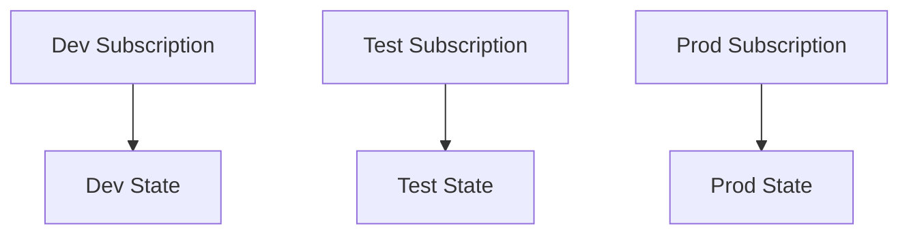
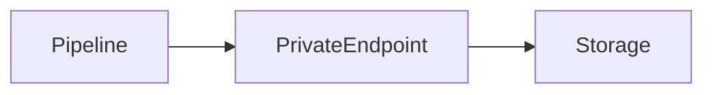
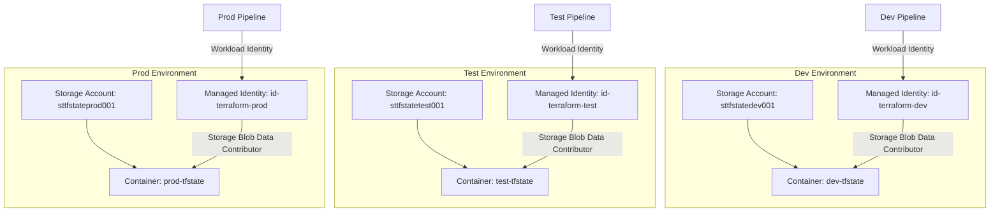
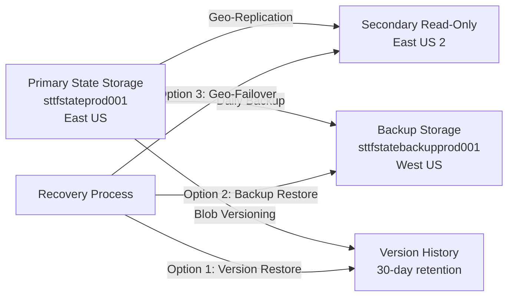
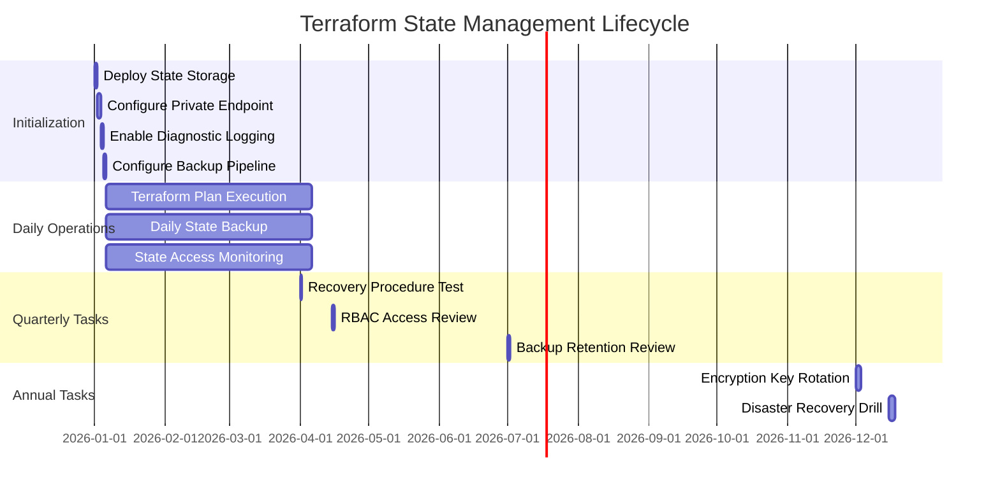

# Terraform State Management and Backend Configuration in Azure

**Author:** Randy Bordeaux  
**Version:** 1.0  
**Date:** January 2026  
**Azure Services:** Terraform, Azure Storage, Azure Key Vault, Azure Monitor

---

## Executive Summary

This whitepaper defines **enterprise-grade patterns for Terraform state management and backend configuration in Azure**, treating state as a **security-critical system of record** requiring isolation, integrity, availability, and comprehensive auditability. State management is not an implementation detail—it is the **foundational control plane** for infrastructure governance.

Terraform state contains sensitive resource identifiers, configuration metadata, and topology information. **Compromise of state enables complete infrastructure takeover**. This document establishes patterns for secure state storage using Azure Storage backends with encryption, private endpoints, RBAC-based access, blob versioning, and continuous monitoring.

**Key Outcomes:**
- Treat Terraform state as confidential, integrity-protected, highly-available data
- Implement environment isolation with dedicated state containers and identities
- Enforce network security through private endpoints and storage firewalls
- Enable state recovery with versioning, soft delete, and backup automation
- Maintain compliance audit trails with diagnostic logging and KQL monitoring

---

## Table of Contents

- [Terraform State Management and Backend Configuration in Azure](#terraform-state-management-and-backend-configuration-in-azure)
  - [Executive Summary](#executive-summary)
  - [Table of Contents](#table-of-contents)
  - [Scope and Design Principles](#scope-and-design-principles)
    - [In Scope](#in-scope)
    - [Out of Scope](#out-of-scope)
    - [Core Design Principles](#core-design-principles)
  - [Terraform State as a Security Boundary](#terraform-state-as-a-security-boundary)
  - [AzureRM Backend Architecture](#azurerm-backend-architecture)
  - [Environment Isolation and State Segmentation](#environment-isolation-and-state-segmentation)
  - [Access Control, Locking, and Concurrency](#access-control-locking-and-concurrency)
    - [Access Control](#access-control)
    - [Locking](#locking)
  - [Network Security and Private Access](#network-security-and-private-access)
  - [State Protection, Backup, and Recovery](#state-protection-backup-and-recovery)
  - [Auditing, Monitoring, and Compliance](#auditing-monitoring-and-compliance)
  - [Failure Scenarios and Anti-Patterns](#failure-scenarios-and-anti-patterns)
    - [Failure Scenarios](#failure-scenarios)
    - [Anti-Patterns](#anti-patterns)
  - [Tradeoffs and Design Limitations](#tradeoffs-and-design-limitations)
    - [Tradeoffs](#tradeoffs)
    - [Benefits](#benefits)
  - [Conclusion](#conclusion)
## Scope and Design Principles

### In Scope

- Secure storage and isolation of Terraform state files
- Preventing unauthorized state access, modification, or exfiltration
- Ensuring reliable locking and concurrency control for multi-user teams
- Supporting audit, compliance, and recovery requirements
- Network-level protection with private endpoints and storage firewalls
- Backup automation and disaster recovery procedures
- State migration patterns for reorganization and consolidation

### Out of Scope

- Terraform Cloud or Terraform Enterprise (focus on Azure-native backends)
- State file format internals (assumes understanding of JSON structure)
- Application-level secrets management (covered in separate whitepaper)
- Multi-cloud state management (Azure-only focus)

### Core Design Principles

| Principle | Implementation |
|-----------|----------------|
| **State per Environment** | One state container per environment; no shared backends across dev/test/prod |
| **Identity-Based Access** | RBAC only; no shared storage account keys or SAS tokens |
| **Encryption Everywhere** | Storage Service Encryption (SSE) + HTTPS enforcement + optional customer-managed keys |
| **Network Isolation** | Private endpoints + storage firewall + deny public access |
| **Versioning Enabled** | Blob versioning for state history; soft delete for recovery |
| **Audit Everything** | Diagnostic settings send all read/write operations to Log Analytics |
| **Immutable Infrastructure** | Management locks prevent accidental state storage deletion |ol  
- Supporting audit and recovery requirements  

Control objectives include:

- One state file per environment and workload  
- Explicit identity-based access  
- Encrypted, private, and monitored state storage  

---

## Terraform State as a Security Boundary

Terraform state contains:

- Resource IDs and topology  
- Sensitive configuration metadata  
- Provider-specific identifiers  

Compromise of state enables infrastructure takeover.

State must therefore be treated as:

- Confidential  
- Integrity-protected  
- Highly available  

State access is equivalent to privileged infrastructure access.

---

## AzureRM Backend Architecture

Azure Storage with the AzureRM backend is the authoritative backend.

```hcl
terraform {
  backend "azurerm" {
    resource_group_name  = var.tfstate_rg
    storage_account_name = var.tfstate_storage
    container_name       = var.environment
    key                  = "platform.tfstate"
  }
}
```

Backend design principles:

- Dedicated storage account per platform or domain  
- Blob containers scoped per environment  
- No shared backends across trust boundaries  

---

## Environment Isolation and State Segmentation

Isolation dimensions:

| Dimension | Isolation Strategy |
|---------|-------------------|
| Environment | Separate state container |
| Subscription | One per environment |
| Identity | One SP or MI per environment |
| Workload | One state per stack |



Terraform workspaces are not used for environment isolation.

---

## Access Control, Locking, and Concurrency

### Access Control

- RBAC-based access only  
- No shared storage account keys  
- Separate roles for read vs write  

Recommended roles:

- Storage Blob Data Reader (plan)  
- Storage Blob Data Contributor (apply)  

### Locking

- Blob lease-based locking is mandatory  
- Lock failures halt pipeline execution  
- Manual lock breaking requires investigation and approval  

---

## Network Security and Private Access

State storage must be isolated from public networks.

Controls:

- Private Endpoint for Blob service  
- Public network access disabled  
- DNS resolution validated in pipelines  



Pipelines must execute from trusted networks with private connectivity.

---

## State Protection, Backup, and Recovery

Protection mechanisms:

- Soft delete enabled  
- Blob versioning enabled  
- Immutability policies where required  

Recovery principles:

- Never manually edit state  
- Restore via blob versioning  
- Reconcile drift with Terraform, not storage tools  

State recovery events trigger security review.

---

## Auditing, Monitoring, and Compliance

Monitoring requirements:

- Storage diagnostic logs enabled  
- Key Vault logs (if CMK used)  
- Azure Activity Logs retained  

Audit capabilities:

- State access traceable to identity  
- Pipeline run correlation  
- Change history reconstructable  

Supports alignment with NIST 800-171 and internal audit controls.

---

## Failure Scenarios and Anti-Patterns

### Failure Scenarios

- Concurrent applies without locking  
- Lost state due to misconfiguration  
- Unauthorized access via shared keys  

### Anti-Patterns

- Local state files  
- Manual state editing  
- Shared state across environments  
- Disabling locks to “unblock” pipelines  

These materially increase blast radius.

---

## Tradeoffs and Design Limitations

### Tradeoffs

- Additional storage cost  
- Increased backend complexity  

### Benefits

- Strong security posture  
- Reliable concurrency control  
- Auditable infrastructure history  

---

## Conclusion

Terraform state management is **foundational infrastructure**. Correct backend design, isolation, and protection are prerequisites for safe automation and trustworthy Azure environments.

---

*End of Document*


---

## AzureRM Backend Architecture

### Storage Account Configuration

The AzureRM backend uses **Azure Storage Blob containers** for state persistence. Each state file is stored as a blob with **server-side encryption (SSE)** and optional customer-managed keys (CMK) from Azure Key Vault.

**Hardened Storage Account Configuration:**

```hcl
# terraform/modules/state-backend/main.tf
resource "azurerm_storage_account" "terraform_state" {
  name                            = "sttfstate${var.environment}001"
  resource_group_name             = azurerm_resource_group.state.name
  location                        = var.location
  account_tier                    = "Standard"
  account_replication_type        = "GRS"  # Geo-redundant for disaster recovery
  account_kind                    = "StorageV2"
  min_tls_version                 = "TLS1_2"
  enable_https_traffic_only       = true
  allow_nested_items_to_be_public = false
  public_network_access_enabled   = false  # Force private endpoint only

  blob_properties {
    versioning_enabled  = true  # Enable blob versioning for state history
    change_feed_enabled = true  # Track modifications for audit

    delete_retention_policy {
      days = 30
    }

    container_delete_retention_policy {
      days = 30
    }
  }

  network_rules {
    default_action             = "Deny"
    bypass                     = ["AzureServices"]
    ip_rules                   = []
    virtual_network_subnet_ids = []
  }

  identity {
    type = "SystemAssigned"
  }

  tags = {
    Environment = var.environment
    Purpose     = "TerraformState"
    ManagedBy   = "Terraform"
    CostCenter  = "Infrastructure"
  }
}

# Enable diagnostic logging
resource "azurerm_monitor_diagnostic_setting" "state_storage" {
  name                       = "state-storage-diagnostics"
  target_resource_id         = azurerm_storage_account.terraform_state.id
  log_analytics_workspace_id = var.log_analytics_workspace_id

  enabled_log {
    category = "StorageRead"
  }

  enabled_log {
    category = "StorageWrite"
  }

  enabled_log {
    category = "StorageDelete"
  }

  metric {
    category = "Transaction"
    enabled  = true
  }

  metric {
    category = "Capacity"
    enabled  = true
  }
}

# Management lock to prevent deletion
resource "azurerm_management_lock" "state_storage" {
  name       = "state-storage-lock"
  scope      = azurerm_storage_account.terraform_state.id
  lock_level = "CanNotDelete"
  notes      = "Prevent accidental deletion of Terraform state storage"
}
```

### State Container Structure

```hcl
# Create environment-specific containers
resource "azurerm_storage_container" "state" {
  name                  = "${var.environment}-tfstate"
  storage_account_name  = azurerm_storage_account.terraform_state.name
  container_access_type = "private"
}

# Optional: Create workload-specific containers within environment
resource "azurerm_storage_container" "networking" {
  name                  = "${var.environment}-networking-tfstate"
  storage_account_name  = azurerm_storage_account.terraform_state.name
  container_access_type = "private"
}

resource "azurerm_storage_container" "compute" {
  name                  = "${var.environment}-compute-tfstate"
  storage_account_name  = azurerm_storage_account.terraform_state.name
  container_access_type = "private"
}
```

### Backend Configuration Block

```hcl
# terraform/environments/prod/backend.tf
terraform {
  backend "azurerm" {
    resource_group_name  = "rg-terraform-state-prod"
    storage_account_name = "sttfstateprod001"
    container_name       = "prod-tfstate"
    key                  = "workload.tfstate"
    use_azuread_auth     = true  # Use Entra ID RBAC instead of storage keys
    use_oidc             = true  # Use OIDC workload identity (Azure DevOps/GitHub)
  }
}
```

---

## Environment Isolation and State Segmentation

### Environment Separation Architecture

**Each environment must have its own state storage account** to enforce security boundaries and prevent cross-environment contamination.



### Workload Segmentation Within Environments

For large environments, **segment state by workload domain**:

| Workload | Container | State File | Purpose |
|----------|-----------|-----------|---------|
| Networking | `prod-networking-tfstate` | `network.tfstate` | VNets, subnets, NSGs, route tables |
| Compute | `prod-compute-tfstate` | `compute.tfstate` | VMs, scale sets, availability zones |
| Data | `prod-data-tfstate` | `data.tfstate` | SQL, Cosmos DB, storage accounts |
| Identity | `prod-identity-tfstate` | `identity.tfstate` | Entra ID groups, role assignments |

**Example multi-workload backend configuration:**

```hcl
# terraform/workloads/networking/backend.tf
terraform {
  backend "azurerm" {
    resource_group_name  = "rg-terraform-state-prod"
    storage_account_name = "sttfstateprod001"
    container_name       = "prod-networking-tfstate"
    key                  = "network.tfstate"
    use_azuread_auth     = true
  }
}
```

---

## Access Control, RBAC, and Identity

### Identity-Based Authentication

**Never use storage account keys or SAS tokens**. Use **Azure RBAC with managed identities** or **service principals with workload identity federation**.

**Required RBAC Roles:**

| Role | Scope | Purpose |
|------|-------|---------|
| `Storage Blob Data Contributor` | State container | Read/write state files |
| `Storage Blob Data Reader` | State container | Read-only access for auditors |
| `Storage Account Contributor` | Storage account | Manage state locking (lease operations) |

### Managed Identity for Azure DevOps Pipelines

```hcl
# Create managed identity for Terraform pipeline
resource "azurerm_user_assigned_identity" "terraform" {
  name                = "id-terraform-${var.environment}"
  resource_group_name = azurerm_resource_group.identity.name
  location            = var.location
}

# Grant state access
resource "azurerm_role_assignment" "terraform_state_contributor" {
  scope                = azurerm_storage_container.state.resource_manager_id
  role_definition_name = "Storage Blob Data Contributor"
  principal_id         = azurerm_user_assigned_identity.terraform.principal_id
}

# Grant lock management (for state locking)
resource "azurerm_role_assignment" "terraform_state_lock" {
  scope                = azurerm_storage_account.terraform_state.id
  role_definition_name = "Storage Account Contributor"
  principal_id         = azurerm_user_assigned_identity.terraform.principal_id
}
```

**Azure DevOps Pipeline Configuration:**

```yaml
# azure-pipelines.yml
variables:
  azureSubscription: 'prod-service-connection'
  managedIdentityClientId: '00000000-0000-0000-0000-000000000000'

stages:
  - stage: TerraformApply
    jobs:
      - job: Apply
        pool:
          vmImage: 'ubuntu-latest'
        steps:
          - task: AzureCLI@2
            displayName: 'Terraform Init with Workload Identity'
            inputs:
              azureSubscription: $(azureSubscription)
              scriptType: bash
              scriptLocation: inlineScript
              inlineScript: |
                export ARM_USE_OIDC=true
                export ARM_CLIENT_ID=$(managedIdentityClientId)
                export ARM_TENANT_ID=$(ARM_TENANT_ID)
                export ARM_SUBSCRIPTION_ID=$(ARM_SUBSCRIPTION_ID)
                terraform init
```

### Service Principal with Federated Credentials (GitHub Actions)

```hcl
# Create service principal and federated credential for GitHub Actions
resource "azuread_application" "terraform" {
  display_name = "terraform-${var.environment}"
}

resource "azuread_service_principal" "terraform" {
  client_id = azuread_application.terraform.client_id
}

resource "azuread_application_federated_identity_credential" "github" {
  application_id = azuread_application.terraform.id
  display_name   = "github-actions-${var.repository}"
  audiences      = ["api://AzureADTokenExchange"]
  issuer         = "https://token.actions.githubusercontent.com"
  subject        = "repo:${var.github_org}/${var.repository}:environment:${var.environment}"
}

# Grant state access
resource "azurerm_role_assignment" "terraform_state" {
  scope                = azurerm_storage_container.state.resource_manager_id
  role_definition_name = "Storage Blob Data Contributor"
  principal_id         = azuread_service_principal.terraform.object_id
}
```

**GitHub Actions Workflow:**

```yaml
# .github/workflows/terraform.yml
name: Terraform Apply

on:
  push:
    branches: [main]

permissions:
  id-token: write  # Required for OIDC
  contents: read

jobs:
  terraform:
    runs-on: ubuntu-latest
    environment: production
    steps:
      - uses: actions/checkout@v3

      - name: Azure Login with OIDC
        uses: azure/login@v1
        with:
          client-id: ${{ secrets.AZURE_CLIENT_ID }}
          tenant-id: ${{ secrets.AZURE_TENANT_ID }}
          subscription-id: ${{ secrets.AZURE_SUBSCRIPTION_ID }}

      - name: Terraform Init
        run: |
          export ARM_USE_OIDC=true
          terraform init
```

---

## State Locking and Concurrency Control

Terraform uses **Azure Storage blob leases** for state locking. When a Terraform operation begins, it acquires a **60-second renewable lease** on the state blob.

### State Lock Configuration

State locking is **automatic** when using the `azurerm` backend, but requires proper RBAC:

```hcl
terraform {
  backend "azurerm" {
    resource_group_name  = "rg-terraform-state-prod"
    storage_account_name = "sttfstateprod001"
    container_name       = "prod-tfstate"
    key                  = "workload.tfstate"
    use_azuread_auth     = true
  }
}
```

### Lock Troubleshooting

**Check active leases:**

```bash
#!/bin/bash
# check-state-locks.sh

STORAGE_ACCOUNT="sttfstateprod001"
CONTAINER="prod-tfstate"
STATE_FILE="workload.tfstate"

echo "Checking state file lease status..."
az storage blob show   --account-name "$STORAGE_ACCOUNT"   --container-name "$CONTAINER"   --name "$STATE_FILE"   --auth-mode login   --query "{LeaseState: properties.lease.state, LeaseDuration: properties.lease.duration, LeaseStatus: properties.lease.status}"   --output table
```

**Force-break stuck lock (emergency only):**

```bash
#!/bin/bash
# break-state-lock.sh
# WARNING: Only use if you are certain no Terraform operations are running

STORAGE_ACCOUNT="sttfstateprod001"
CONTAINER="prod-tfstate"
STATE_FILE="workload.tfstate"

echo "WARNING: Force-breaking state lock. Ensure no Terraform operations are active."
read -p "Continue? (yes/no): " CONFIRM

if [ "$CONFIRM" != "yes" ]; then
  echo "Aborted."
  exit 1
fi

az storage blob lease break   --account-name "$STORAGE_ACCOUNT"   --container-name "$CONTAINER"   --blob-name "$STATE_FILE"   --auth-mode login   --break-period 0

echo "Lock broken. Verify state integrity before next Terraform operation."
```

### Preventing Lock Conflicts

**Pipeline pattern to prevent race conditions:**

```yaml
# azure-pipelines.yml
trigger:
  branches:
    include:
      - main

# Ensure only one pipeline run at a time
lockBehavior: sequential

stages:
  - stage: Terraform
    jobs:
      - deployment: Apply
        environment: production  # Manual approval gate
        strategy:
          runOnce:
            deploy:
              steps:
                - script: terraform apply -auto-approve
```

---

## Network Security and Private Access

### Private Endpoint Configuration

**Disable public network access** and enforce private endpoints for state storage:

```hcl
# Private endpoint for blob storage
resource "azurerm_private_endpoint" "state_blob" {
  name                = "pe-tfstate-blob-${var.environment}"
  resource_group_name = azurerm_resource_group.state.name
  location            = var.location
  subnet_id           = var.private_endpoint_subnet_id

  private_service_connection {
    name                           = "psc-tfstate-blob"
    private_connection_resource_id = azurerm_storage_account.terraform_state.id
    subresource_names              = ["blob"]
    is_manual_connection           = false
  }

  private_dns_zone_group {
    name                 = "pdns-group-blob"
    private_dns_zone_ids = [var.private_dns_zone_blob_id]
  }
}

# Private DNS zone for blob storage
resource "azurerm_private_dns_zone" "blob" {
  name                = "privatelink.blob.core.windows.net"
  resource_group_name = azurerm_resource_group.networking.name
}

resource "azurerm_private_dns_zone_virtual_network_link" "blob" {
  name                  = "pdns-link-blob-${var.vnet_name}"
  resource_group_name   = azurerm_resource_group.networking.name
  private_dns_zone_name = azurerm_private_dns_zone.blob.name
  virtual_network_id    = var.vnet_id
  registration_enabled  = false
}
```

### Storage Firewall Rules

```hcl
resource "azurerm_storage_account_network_rules" "state" {
  storage_account_id = azurerm_storage_account.terraform_state.id

  default_action = "Deny"
  bypass         = ["AzureServices"]  # Allow Azure-trusted services

  # Optional: Allow specific pipeline agent IPs (not recommended for production)
  # ip_rules = var.pipeline_agent_ips

  # Restrict to specific VNets
  virtual_network_subnet_ids = [
    var.pipeline_subnet_id,
    var.management_subnet_id
  ]
}
```

### Service Endpoint (Alternative to Private Endpoint)

For environments without private endpoint support:

```hcl
resource "azurerm_subnet" "pipeline" {
  name                 = "snet-pipeline"
  resource_group_name  = azurerm_resource_group.networking.name
  virtual_network_name = azurerm_virtual_network.main.name
  address_prefixes     = ["10.0.10.0/24"]

  service_endpoints = ["Microsoft.Storage"]
}

resource "azurerm_storage_account_network_rules" "state" {
  storage_account_id = azurerm_storage_account.terraform_state.id

  default_action = "Deny"
  bypass         = ["AzureServices"]

  virtual_network_subnet_ids = [
    azurerm_subnet.pipeline.id
  ]
}
```


---

## Encryption, Versioning, and Data Protection

### Server-Side Encryption (SSE)

Azure Storage **encrypts all data at rest by default** using Microsoft-managed keys. For enhanced control, use **customer-managed keys (CMK)** stored in Azure Key Vault.

**CMK Configuration:**

```hcl
# Key Vault for state encryption
resource "azurerm_key_vault" "state" {
  name                       = "kv-tfstate-${var.environment}"
  resource_group_name        = azurerm_resource_group.state.name
  location                   = var.location
  tenant_id                  = data.azurerm_client_config.current.tenant_id
  sku_name                   = "premium"
  soft_delete_retention_days = 90
  purge_protection_enabled   = true

  network_acls {
    default_action = "Deny"
    bypass         = "AzureServices"
  }
}

# Encryption key for state storage
resource "azurerm_key_vault_key" "state_encryption" {
  name         = "tfstate-encryption-key"
  key_vault_id = azurerm_key_vault.state.id
  key_type     = "RSA"
  key_size     = 4096

  key_opts = [
    "decrypt",
    "encrypt",
    "sign",
    "unwrapKey",
    "verify",
    "wrapKey"
  ]
}

# Grant storage account access to key
resource "azurerm_key_vault_access_policy" "storage" {
  key_vault_id = azurerm_key_vault.state.id
  tenant_id    = data.azurerm_client_config.current.tenant_id
  object_id    = azurerm_storage_account.terraform_state.identity[0].principal_id

  key_permissions = [
    "Get",
    "UnwrapKey",
    "WrapKey"
  ]
}

# Enable CMK encryption
resource "azurerm_storage_account_customer_managed_key" "state" {
  storage_account_id = azurerm_storage_account.terraform_state.id
  key_vault_id       = azurerm_key_vault.state.id
  key_name           = azurerm_key_vault_key.state_encryption.name

  depends_on = [
    azurerm_key_vault_access_policy.storage
  ]
}
```

### Blob Versioning and Soft Delete

**Blob versioning** creates an immutable version history for state files, enabling rollback and audit:

```hcl
resource "azurerm_storage_account" "terraform_state" {
  # ... other configuration ...

  blob_properties {
    versioning_enabled  = true
    change_feed_enabled = true

    delete_retention_policy {
      days = 30  # Retain deleted blobs for 30 days
    }

    container_delete_retention_policy {
      days = 30
    }

    restore_policy {
      days = 29  # Must be less than delete retention
    }
  }
}
```

**List state file versions:**

```bash
#!/bin/bash
# list-state-versions.sh

STORAGE_ACCOUNT="sttfstateprod001"
CONTAINER="prod-tfstate"
STATE_FILE="workload.tfstate"

echo "State file version history:"
az storage blob list \
  --account-name "$STORAGE_ACCOUNT" \
  --container-name "$CONTAINER" \
  --prefix "$STATE_FILE" \
  --include v \
  --auth-mode login \
  --query "[].{Name:name, Version:versionId, LastModified:properties.lastModified, Size:properties.contentLength}" \
  --output table
```

### HTTPS Enforcement

```hcl
resource "azurerm_storage_account" "terraform_state" {
  # ... other configuration ...

  enable_https_traffic_only = true  # Reject HTTP requests
  min_tls_version           = "TLS1_2"  # Enforce TLS 1.2 minimum
}
```

---

## Backup, Recovery, and Disaster Response

### Automated State Backup

**Daily backup to secondary storage account:**

```bash
#!/bin/bash
# backup-terraform-state.sh
# Run daily via Azure DevOps scheduled pipeline or Azure Automation

set -euo pipefail

SOURCE_STORAGE="sttfstateprod001"
SOURCE_CONTAINER="prod-tfstate"
BACKUP_STORAGE="sttfstatebackupprod001"
BACKUP_CONTAINER="state-backups"
TIMESTAMP=$(date +%Y%m%d-%H%M%S)

echo "Starting Terraform state backup at $TIMESTAMP"

# List all state files
STATE_FILES=$(az storage blob list \
  --account-name "$SOURCE_STORAGE" \
  --container-name "$SOURCE_CONTAINER" \
  --auth-mode login \
  --query "[].name" \
  --output tsv)

# Copy each state file with timestamp
for STATE_FILE in $STATE_FILES; do
  BACKUP_NAME="${STATE_FILE%.tfstate}-${TIMESTAMP}.tfstate"
  
  echo "Backing up $STATE_FILE to $BACKUP_NAME"
  
  az storage blob copy start \
    --source-account-name "$SOURCE_STORAGE" \
    --source-container "$SOURCE_CONTAINER" \
    --source-blob "$STATE_FILE" \
    --account-name "$BACKUP_STORAGE" \
    --destination-container "$BACKUP_CONTAINER" \
    --destination-blob "$BACKUP_NAME" \
    --auth-mode login
done

echo "Backup completed successfully"

# Cleanup backups older than 90 days
CUTOFF_DATE=$(date -u -d '90 days ago' +%Y-%m-%dT%H:%M:%SZ)

echo "Cleaning up backups older than $CUTOFF_DATE"

az storage blob delete-batch \
  --account-name "$BACKUP_STORAGE" \
  --source "$BACKUP_CONTAINER" \
  --auth-mode login \
  --if-unmodified-since "$CUTOFF_DATE"

echo "Cleanup completed"
```

**Azure DevOps Pipeline for Scheduled Backup:**

```yaml
# azure-pipelines-backup.yml
trigger: none  # Scheduled only

schedules:
  - cron: "0 2 * * *"  # Daily at 2 AM UTC
    displayName: Daily State Backup
    branches:
      include:
        - main
    always: true

pool:
  vmImage: 'ubuntu-latest'

steps:
  - task: AzureCLI@2
    displayName: 'Backup Terraform State'
    inputs:
      azureSubscription: 'prod-service-connection'
      scriptType: bash
      scriptLocation: scriptPath
      scriptPath: scripts/backup-terraform-state.sh
```

### State Recovery Procedure

**Restore from blob version:**

```bash
#!/bin/bash
# restore-state-version.sh
# Restore state to a specific version ID

set -euo pipefail

STORAGE_ACCOUNT="sttfstateprod001"
CONTAINER="prod-tfstate"
STATE_FILE="workload.tfstate"
VERSION_ID="$1"  # Pass version ID as argument

if [ -z "$VERSION_ID" ]; then
  echo "Usage: $0 <version-id>"
  echo ""
  echo "List available versions with:"
  echo "az storage blob list --account-name $STORAGE_ACCOUNT --container-name $CONTAINER --prefix $STATE_FILE --include v --auth-mode login"
  exit 1
fi

echo "WARNING: This will restore $STATE_FILE to version $VERSION_ID"
echo "Current state will be preserved as a version."
read -p "Continue? (yes/no): " CONFIRM

if [ "$CONFIRM" != "yes" ]; then
  echo "Aborted."
  exit 1
fi

# Download specific version
echo "Downloading version $VERSION_ID..."
az storage blob download \
  --account-name "$STORAGE_ACCOUNT" \
  --container-name "$CONTAINER" \
  --name "$STATE_FILE" \
  --version-id "$VERSION_ID" \
  --file "/tmp/${STATE_FILE}.backup" \
  --auth-mode login

# Upload as current version (creates new version automatically)
echo "Restoring as current state..."
az storage blob upload \
  --account-name "$STORAGE_ACCOUNT" \
  --container-name "$CONTAINER" \
  --name "$STATE_FILE" \
  --file "/tmp/${STATE_FILE}.backup" \
  --auth-mode login \
  --overwrite

echo "State restored successfully. Verify with: terraform plan"
rm -f "/tmp/${STATE_FILE}.backup"
```

### Disaster Recovery Architecture



**Geo-Redundancy Configuration:**

```hcl
resource "azurerm_storage_account" "terraform_state" {
  name                     = "sttfstateprod001"
  account_replication_type = "GRS"  # Geo-redundant storage
  # ... other configuration ...
}

# Backup storage in different region
resource "azurerm_storage_account" "backup" {
  name                     = "sttfstatebackupprod001"
  location                 = "westus"  # Different region
  account_replication_type = "LRS"
  # ... other configuration ...
}
```

---

## Auditing, Monitoring, and Compliance

### Diagnostic Logging

**Enable comprehensive logging for state storage:**

```hcl
resource "azurerm_monitor_diagnostic_setting" "state_storage" {
  name                       = "state-storage-diagnostics"
  target_resource_id         = azurerm_storage_account.terraform_state.id
  log_analytics_workspace_id = var.log_analytics_workspace_id

  enabled_log {
    category = "StorageRead"
  }

  enabled_log {
    category = "StorageWrite"
  }

  enabled_log {
    category = "StorageDelete"
  }

  metric {
    category = "Transaction"
    enabled  = true
  }

  metric {
    category = "Capacity"
    enabled  = true
  }
}
```

### KQL Queries for State Monitoring

**Detect state access patterns:**

```kql
// Query: Terraform state access audit
StorageBlobLogs
| where AccountName == "sttfstateprod001"
| where ContainerName == "prod-tfstate"
| where TimeGenerated > ago(7d)
| summarize 
    ReadCount = countif(OperationName == "GetBlob"),
    WriteCount = countif(OperationName == "PutBlob"),
    DeleteCount = countif(OperationName == "DeleteBlob"),
    UniqueCallers = dcount(CallerIpAddress)
    by bin(TimeGenerated, 1h), AuthenticationType, Identity
| order by TimeGenerated desc
```

**Detect unauthorized access attempts:**

```kql
// Query: Failed state access attempts
StorageBlobLogs
| where AccountName == "sttfstateprod001"
| where ContainerName == "prod-tfstate"
| where StatusCode != 200
| where TimeGenerated > ago(24h)
| project 
    TimeGenerated,
    OperationName,
    StatusCode,
    StatusText,
    CallerIpAddress,
    Identity,
    Uri
| order by TimeGenerated desc
```

**Monitor state modifications:**

```kql
// Query: State file write operations
StorageBlobLogs
| where AccountName == "sttfstateprod001"
| where ContainerName == "prod-tfstate"
| where OperationName == "PutBlob"
| where TimeGenerated > ago(30d)
| project 
    TimeGenerated,
    BlobName = extract(@"prod-tfstate/(.*)", 1, Uri),
    CallerIpAddress,
    Identity,
    UserAgentHeader
| order by TimeGenerated desc
```

### Alert Rules

**Alert on unexpected state modifications:**

```hcl
resource "azurerm_monitor_scheduled_query_rules_alert_v2" "state_write_alert" {
  name                = "alert-tfstate-unexpected-write"
  resource_group_name = azurerm_resource_group.monitoring.name
  location            = var.location
  scopes              = [var.log_analytics_workspace_id]
  severity            = 2

  criteria {
    query = <<-QUERY
      StorageBlobLogs
      | where AccountName == "sttfstateprod001"
      | where ContainerName == "prod-tfstate"
      | where OperationName == "PutBlob"
      | where TimeGenerated > ago(1h)
      | where Identity !contains "id-terraform-prod"  // Alert if not expected identity
      | summarize Count = count() by Identity, CallerIpAddress
    QUERY

    time_aggregation_method = "Count"
    threshold               = 1
    operator                = "GreaterThanOrEqual"

    failing_periods {
      minimum_failing_periods_to_trigger_alert = 1
      number_of_evaluation_periods             = 1
    }
  }

  action {
    action_groups = [azurerm_monitor_action_group.security.id]
  }

  description = "Alert when Terraform state is modified by unexpected identity"
  enabled     = true
}
```

### Compliance Mapping

| Control | Implementation | Evidence |
|---------|----------------|----------|
| **NIST 800-171 3.13.11** (Cryptographic Protection) | SSE with CMK | Key Vault encryption key configuration |
| **NIST 800-171 3.3.1** (Audit Logging) | Diagnostic settings | Log Analytics workspace retention |
| **NIST 800-171 3.5.1** (Least Privilege) | RBAC assignments | Role assignments per identity |
| **SOC 2 CC6.1** (Logical Access) | Private endpoints + firewall | Network rules configuration |
| **ISO 27001 A.12.3.1** (Backup) | Geo-redundancy + daily backups | Backup pipeline execution logs |

---

## State Migration and Import Patterns

### Migrating State Between Backends

**Scenario:** Moving from local state to AzureRM backend

```bash
#!/bin/bash
# migrate-to-azurerm.sh

set -euo pipefail

echo "Step 1: Backup current local state"
cp terraform.tfstate terraform.tfstate.backup.$(date +%Y%m%d-%H%M%S)

echo "Step 2: Configure AzureRM backend in backend.tf"
cat > backend.tf <<EOF
terraform {
  backend "azurerm" {
    resource_group_name  = "rg-terraform-state-prod"
    storage_account_name = "sttfstateprod001"
    container_name       = "prod-tfstate"
    key                  = "workload.tfstate"
    use_azuread_auth     = true
  }
}
EOF

echo "Step 3: Initialize with migration"
terraform init -migrate-state

echo "Step 4: Verify state was migrated"
terraform state list

echo "Migration complete. Local state backed up as terraform.tfstate.backup.*"
```

### Importing Existing Resources

```bash
#!/bin/bash
# import-existing-resources.sh

set -euo pipefail

RESOURCE_GROUP="rg-existing-resources"

echo "Importing existing Azure resources into Terraform state..."

# Import resource group
terraform import azurerm_resource_group.existing "/subscriptions/00000000-0000-0000-0000-000000000000/resourceGroups/$RESOURCE_GROUP"

# Import storage account
terraform import azurerm_storage_account.existing "/subscriptions/00000000-0000-0000-0000-000000000000/resourceGroups/$RESOURCE_GROUP/providers/Microsoft.Storage/storageAccounts/stexisting001"

# Import virtual network
terraform import azurerm_virtual_network.existing "/subscriptions/00000000-0000-0000-0000-000000000000/resourceGroups/$RESOURCE_GROUP/providers/Microsoft.Network/virtualNetworks/vnet-existing"

echo "Import complete. Verify with: terraform plan"
```

### State Splitting (Workload Segmentation)

**Scenario:** Split monolithic state into workload-specific states

```bash
#!/bin/bash
# split-state.sh

set -euo pipefail

echo "Step 1: Backup current state"
terraform state pull > state-backup.json

echo "Step 2: Move networking resources to new state"
terraform state mv -state-out=networking.tfstate \
  azurerm_virtual_network.main \
  azurerm_subnet.app \
  azurerm_network_security_group.main

echo "Step 3: Configure new backend for networking"
# Create new backend configuration and migrate
```

---

## Common Failure Modes and Anti-Patterns

### Anti-Pattern 1: Sharing State Storage Across Environments

**Problem:** Using a single storage account with multiple containers for dev/test/prod state.

**Risk:** Credential compromise grants access to all environment states. RBAC misconfiguration can allow cross-environment access.

**Impact:** Production infrastructure compromise from dev environment breach.

**Solution:**
- Deploy **separate storage accounts per environment** in different resource groups
- Use environment-specific managed identities with scoped RBAC
- Implement separate Azure subscriptions for production isolation

```hcl
# WRONG: Single storage account
resource "azurerm_storage_container" "dev" {
  storage_account_name = "sttfstatecompany001"  # Shared!
  container_name       = "dev-tfstate"
}

resource "azurerm_storage_container" "prod" {
  storage_account_name = "sttfstatecompany001"  # Shared!
  container_name       = "prod-tfstate"
}

# CORRECT: Separate storage accounts
resource "azurerm_storage_account" "dev" {
  name = "sttfstatedev001"
  # ... configuration ...
}

resource "azurerm_storage_account" "prod" {
  name = "sttfstateprod001"
  # ... configuration ...
}
```

### Anti-Pattern 2: Using Storage Account Keys

**Problem:** Authenticating with storage account keys instead of RBAC.

**Risk:** Keys stored in pipeline variables, Key Vault, or environment variables. Rotation requires pipeline updates.

**Impact:** Key leakage grants unrestricted storage access. No audit trail for key usage.

**Solution:**
- Use `use_azuread_auth = true` in backend configuration
- Implement workload identity federation (OIDC) for pipelines
- Grant `Storage Blob Data Contributor` role to managed identities

```hcl
# WRONG: Using storage keys
terraform {
  backend "azurerm" {
    storage_account_name = "sttfstateprod001"
    container_name       = "prod-tfstate"
    key                  = "workload.tfstate"
    # No use_azuread_auth - defaults to storage key authentication
  }
}

# CORRECT: RBAC authentication
terraform {
  backend "azurerm" {
    storage_account_name = "sttfstateprod001"
    container_name       = "prod-tfstate"
    key                  = "workload.tfstate"
    use_azuread_auth     = true  # Use Entra ID authentication
    use_oidc             = true  # Use workload identity federation
  }
}
```

### Anti-Pattern 3: Manual State Modification

**Problem:** Directly editing state files with text editors or `terraform state rm` without corresponding infrastructure changes.

**Risk:** State divergence from actual resources. Orphaned resources. Terraform unable to manage infrastructure.

**Impact:** Infrastructure drift. Failed applies. Accidental resource deletion.

**Solution:**
- Never manually edit state JSON
- Use `terraform state mv` or `terraform import` for legitimate state changes
- Always run `terraform plan` after state operations to verify

### Anti-Pattern 4: Public Network Access Enabled

**Problem:** Leaving `public_network_access_enabled = true` on state storage accounts.

**Risk:** State files accessible from public internet if firewall misconfigured. Brute-force attacks on authentication.

**Impact:** State exfiltration. Credential exposure. Resource enumeration.

**Solution:**
- Set `public_network_access_enabled = false`
- Deploy private endpoints for blob storage
- Configure storage firewall with `default_action = "Deny"`

```hcl
# WRONG: Public access allowed
resource "azurerm_storage_account" "state" {
  name                          = "sttfstateprod001"
  public_network_access_enabled = true  # Vulnerable!
}

# CORRECT: Private endpoint only
resource "azurerm_storage_account" "state" {
  name                          = "sttfstateprod001"
  public_network_access_enabled = false
  
  network_rules {
    default_action = "Deny"
    bypass         = ["AzureServices"]
  }
}
```

### Anti-Pattern 5: No Backup or Versioning

**Problem:** Relying solely on single-region storage without versioning or backups.

**Risk:** Accidental state deletion. Corruption. Region outage.

**Impact:** Complete infrastructure management loss. Extended recovery time.

**Solution:**
- Enable blob versioning with 30-day retention
- Configure geo-redundant storage (GRS)
- Implement daily backups to secondary storage account
- Test recovery procedures quarterly

```hcl
# WRONG: No versioning or redundancy
resource "azurerm_storage_account" "state" {
  name                     = "sttfstateprod001"
  account_replication_type = "LRS"  # Single region only
  
  blob_properties {
    versioning_enabled = false  # No version history
  }
}

# CORRECT: Versioning and geo-redundancy
resource "azurerm_storage_account" "state" {
  name                     = "sttfstateprod001"
  account_replication_type = "GRS"
  
  blob_properties {
    versioning_enabled  = true
    change_feed_enabled = true
    
    delete_retention_policy {
      days = 30
    }
  }
}
```

---

## References and Resources

### Microsoft Documentation

- [Terraform AzureRM Backend](https://developer.hashicorp.com/terraform/language/settings/backends/azurerm)
- [Azure Storage Account Security](https://learn.microsoft.com/en-us/azure/storage/common/storage-security-guide)
- [Azure Private Endpoints](https://learn.microsoft.com/en-us/azure/private-link/private-endpoint-overview)
- [Azure RBAC for Storage](https://learn.microsoft.com/en-us/azure/storage/blobs/authorize-access-azure-active-directory)
- [Workload Identity Federation](https://learn.microsoft.com/en-us/azure/active-directory/develop/workload-identity-federation)

### Compliance Frameworks

- **NIST 800-171:** Protecting Controlled Unclassified Information
- **SOC 2:** Service Organization Control Type 2
- **ISO 27001:** Information Security Management
- **Executive Order 14028:** Improving the Nation's Cybersecurity

### Tools and Extensions

- **Terraform:** Infrastructure as Code engine
- **Azure CLI:** Command-line management for Azure resources
- **Azure DevOps:** CI/CD pipeline platform
- **GitHub Actions:** Workflow automation for GitHub repositories

---

## Appendices

### Appendix A: State Security Checklist

- [ ] State storage account uses separate account per environment
- [ ] Public network access disabled (`public_network_access_enabled = false`)
- [ ] Private endpoints configured for blob storage
- [ ] Storage firewall set to `default_action = "Deny"`
- [ ] RBAC authentication enabled (`use_azuread_auth = true`)
- [ ] Managed identities or federated credentials used (no storage keys)
- [ ] Blob versioning enabled with 30-day retention
- [ ] Soft delete enabled for blobs and containers
- [ ] Geo-redundant storage (GRS) configured
- [ ] Customer-managed encryption keys (CMK) from Key Vault
- [ ] Diagnostic logging enabled to Log Analytics
- [ ] Alert rules configured for unauthorized access attempts
- [ ] Daily automated backups to secondary storage account
- [ ] Management lock (`CanNotDelete`) applied to state storage
- [ ] Recovery procedures documented and tested quarterly

### Appendix B: Backend Configuration Matrix

| Environment | Storage Account | Container | Managed Identity | RBAC Role | Region |
|-------------|----------------|-----------|------------------|-----------|--------|
| Dev | `sttfstatedev001` | `dev-tfstate` | `id-terraform-dev` | Storage Blob Data Contributor | East US |
| Test | `sttfstatetest001` | `test-tfstate` | `id-terraform-test` | Storage Blob Data Contributor | East US |
| Staging | `sttfstatestaging001` | `staging-tfstate` | `id-terraform-staging` | Storage Blob Data Contributor | East US |
| Prod | `sttfstateprod001` | `prod-tfstate` | `id-terraform-prod` | Storage Blob Data Contributor | East US |
| Prod Backup | `sttfstatebackupprod001` | `state-backups` | `id-backup-automation` | Storage Blob Data Contributor | West US |

### Appendix C: Troubleshooting Guide

**Scenario 1: State Lock Timeout**

**Symptom:** `Error acquiring state lock: ConditionalCheckFailedException`

**Cause:** Previous Terraform operation crashed without releasing lock.

**Resolution:**
1. Verify no Terraform operations are running
2. Check lock status: `az storage blob show --account-name sttfstateprod001 --container-name prod-tfstate --name workload.tfstate --query "properties.lease"`
3. Force-break lock: `az storage blob lease break --account-name sttfstateprod001 --container-name prod-tfstate --blob-name workload.tfstate --break-period 0`
4. Run `terraform plan` to verify state integrity

**Scenario 2: Authentication Failure**

**Symptom:** `Error: Unable to list storage account keys`

**Cause:** Managed identity lacks `Storage Account Contributor` role for lease operations.

**Resolution:**
1. Grant role: `az role assignment create --assignee <identity-id> --role "Storage Account Contributor" --scope <storage-account-id>`
2. Wait 5 minutes for RBAC propagation
3. Retry Terraform operation

**Scenario 3: State Corruption**

**Symptom:** `Error: state snapshot was created by Terraform vX.Y.Z, which is newer than current v...`

**Cause:** State file modified by newer Terraform version or corrupted.

**Resolution:**
1. List versions: `az storage blob list --account-name sttfstateprod001 --container-name prod-tfstate --prefix workload.tfstate --include v`
2. Download previous version: `az storage blob download --account-name sttfstateprod001 --container-name prod-tfstate --name workload.tfstate --version-id <version-id> --file state-recovered.tfstate`
3. Upload as current: `az storage blob upload --account-name sttfstateprod001 --container-name prod-tfstate --name workload.tfstate --file state-recovered.tfstate --overwrite`

**Scenario 4: Private Endpoint DNS Resolution**

**Symptom:** `Error: dial tcp: lookup sttfstateprod001.blob.core.windows.net: no such host`

**Cause:** Private DNS zone not linked to VNet or incorrect DNS configuration.

**Resolution:**
1. Verify private DNS zone: `privatelink.blob.core.windows.net`
2. Link to VNet: `az network private-dns link vnet create`
3. Test DNS resolution from pipeline agent: `nslookup sttfstateprod001.blob.core.windows.net`
4. Verify private endpoint connection: `az network private-endpoint show`

**Scenario 5: Concurrent Modification Conflict**

**Symptom:** `Error: state was changed by another operation`

**Cause:** Multiple pipeline runs accessing same state simultaneously.

**Resolution:**
1. Configure pipeline `lockBehavior: sequential` in Azure DevOps
2. Use environment approval gates for production
3. Implement `concurrency` groups in GitHub Actions
4. Verify no manual Terraform operations during pipeline execution

### Appendix D: State Lifecycle Timeline



---

**Document Version:** 1.0  
**Last Updated:** January 2026  
**Author:** Randy Bordeaux  
**Review Cycle:** Quarterly

