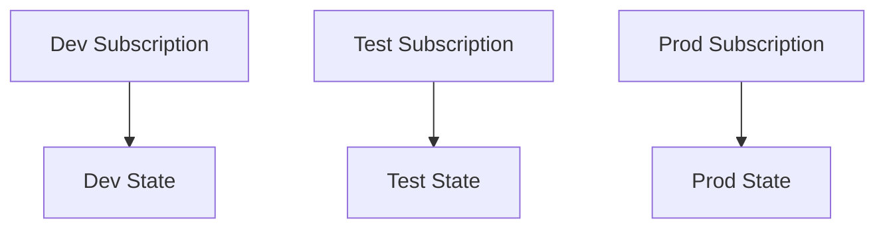
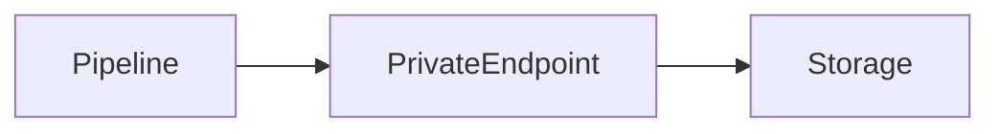

# Terraform State Management and Backend Configuration in Azure

**Author:** Randy Bordeaux  
**Version:** 1.0  
**Date:** 2026-01-22  

---

## Executive Summary

This whitepaper defines **enterprise-grade patterns for Terraform state management and backend configuration in Azure**. It focuses on treating Terraform state as a **security-critical system of record**, enforcing isolation, integrity, availability, and auditability across environments.

The guidance targets experienced Azure engineers operating **Azure Commercial** environments and assumes Terraform is executed exclusively through controlled CI/CD pipelines. State management is positioned as a **foundational control plane**, not an implementation detail.

---

## Table of Contents

1. Scope and Control Objectives  
2. Terraform State as a Security Boundary  
3. AzureRM Backend Architecture  
4. Environment Isolation and State Segmentation  
5. Access Control, Locking, and Concurrency  
6. Network Security and Private Access  
7. State Protection, Backup, and Recovery  
8. Auditing, Monitoring, and Compliance  
9. Failure Scenarios and Anti-Patterns  
10. Tradeoffs and Design Limitations  

---

## Scope and Control Objectives

This document addresses:

- Secure storage and isolation of Terraform state  
- Preventing unauthorized state access or mutation  
- Ensuring reliable locking and concurrency control  
- Supporting audit and recovery requirements  

Control objectives include:

- One state file per environment and workload  
- Explicit identity-based access  
- Encrypted, private, and monitored state storage  

---

## Terraform State as a Security Boundary

Terraform state contains:

- Resource IDs and topology  
- Sensitive configuration metadata  
- Provider-specific identifiers  

Compromise of state enables infrastructure takeover.

State must therefore be treated as:

- Confidential  
- Integrity-protected  
- Highly available  

State access is equivalent to privileged infrastructure access.

---

## AzureRM Backend Architecture

Azure Storage with the AzureRM backend is the authoritative backend.

```hcl
terraform {
  backend "azurerm" {
    resource_group_name  = var.tfstate_rg
    storage_account_name = var.tfstate_storage
    container_name       = var.environment
    key                  = "platform.tfstate"
  }
}
```

Backend design principles:

- Dedicated storage account per platform or domain  
- Blob containers scoped per environment  
- No shared backends across trust boundaries  

---

## Environment Isolation and State Segmentation

Isolation dimensions:

| Dimension | Isolation Strategy |
|---------|-------------------|
| Environment | Separate state container |
| Subscription | One per environment |
| Identity | One SP or MI per environment |
| Workload | One state per stack |



Terraform workspaces are not used for environment isolation.

---

## Access Control, Locking, and Concurrency

### Access Control

- RBAC-based access only  
- No shared storage account keys  
- Separate roles for read vs write  

Recommended roles:

- Storage Blob Data Reader (plan)  
- Storage Blob Data Contributor (apply)  

### Locking

- Blob lease-based locking is mandatory  
- Lock failures halt pipeline execution  
- Manual lock breaking requires investigation and approval  

---

## Network Security and Private Access

State storage must be isolated from public networks.

Controls:

- Private Endpoint for Blob service  
- Public network access disabled  
- DNS resolution validated in pipelines  



Pipelines must execute from trusted networks with private connectivity.

---

## State Protection, Backup, and Recovery

Protection mechanisms:

- Soft delete enabled  
- Blob versioning enabled  
- Immutability policies where required  

Recovery principles:

- Never manually edit state  
- Restore via blob versioning  
- Reconcile drift with Terraform, not storage tools  

State recovery events trigger security review.

---

## Auditing, Monitoring, and Compliance

Monitoring requirements:

- Storage diagnostic logs enabled  
- Key Vault logs (if CMK used)  
- Azure Activity Logs retained  

Audit capabilities:

- State access traceable to identity  
- Pipeline run correlation  
- Change history reconstructable  

Supports alignment with NIST 800-171 and internal audit controls.

---

## Failure Scenarios and Anti-Patterns

### Failure Scenarios

- Concurrent applies without locking  
- Lost state due to misconfiguration  
- Unauthorized access via shared keys  

### Anti-Patterns

- Local state files  
- Manual state editing  
- Shared state across environments  
- Disabling locks to “unblock” pipelines  

These materially increase blast radius.

---

## Tradeoffs and Design Limitations

### Tradeoffs

- Additional storage cost  
- Increased backend complexity  

### Benefits

- Strong security posture  
- Reliable concurrency control  
- Auditable infrastructure history  

---

## Conclusion

Terraform state management is **foundational infrastructure**. Correct backend design, isolation, and protection are prerequisites for safe automation and trustworthy Azure environments.

---

*End of Document*
