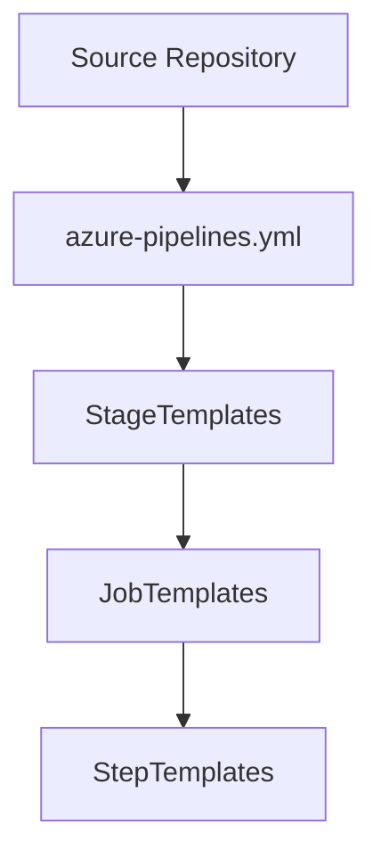
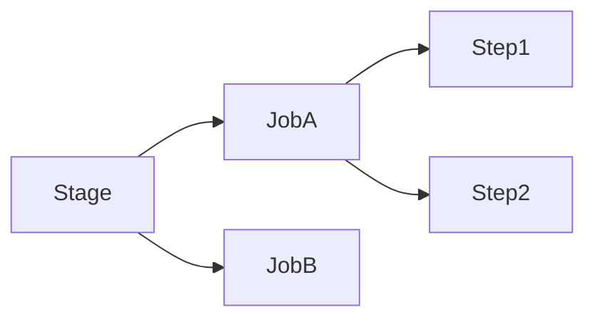

# YAML Pipeline Best Practices and Reusable Templates in Azure

**Author:** Randy Bordeaux  
**Version:** 1.0  
**Date:** 2026-01-22  

---

## Executive Summary

This whitepaper defines **enterprise-grade best practices for YAML-based CI/CD pipelines in Azure**, with a focus on **Azure DevOps YAML pipelines and reusable template patterns**. The guidance targets experienced Azure engineers designing scalable, secure, and maintainable pipelines for infrastructure and application delivery.

Terraform is treated as the authoritative infrastructure-as-code (IaC) mechanism. Security, environment isolation, and auditability are embedded throughout the pipeline lifecycle. All guidance applies to **Azure Commercial** environments.

---

## Table of Contents

1. Scope and Design Objectives  
2. YAML Pipeline Architecture Principles  
3. Repository and Template Organization  
4. Parameterization and Variable Management  
5. Stage, Job, and Step Design Patterns  
6. Security Best Practices in YAML Pipelines  
7. Terraform Integration Patterns  
8. Approval Gates and Environment Controls  
9. Observability, Auditing, and Drift Detection  
10. Tradeoffs and Anti-Patterns  

---

## Scope and Design Objectives

This document addresses:

- Authoring maintainable YAML pipelines at scale  
- Designing reusable and composable YAML templates  
- Secure pipeline execution across multiple environments  
- Terraform-driven infrastructure delivery  
- Policy-aligned pipeline enforcement  

Out of scope:

- UI-based classic pipelines  
- Application-specific build tooling  
- Non-Azure CI/CD platforms  

---

## YAML Pipeline Architecture Principles

Enterprise YAML pipelines should be:

- **Declarative**: Desired state defined explicitly  
- **Composable**: Built from small, reusable templates  
- **Deterministic**: Same inputs produce the same outputs  
- **Secure by default**: Least privilege enforced everywhere  



---

## Repository and Template Organization

A recommended repository layout:

```
/pipelines
  /templates
    /stages
    /jobs
    /steps
  azure-pipelines.yml
```

Key rules:

- Root pipeline only orchestrates stages  
- No business logic in the root YAML  
- Templates are versioned and reviewed like code  
- Cross-repo templates use pinned references  

---

## Parameterization and Variable Management

### Parameters

- Use parameters for **structural decisions** (stages, jobs, environments)
- Parameters are evaluated at compile time
- Avoid runtime mutation

```yaml
parameters:
  - name: environment
    type: string
    values:
      - dev
      - test
      - prod
```

### Variables

- Use variables for **runtime values**
- Secrets must never be defined inline
- Environment-specific variables are injected via variable groups or Key Vault

---

## Stage, Job, and Step Design Patterns

### Stages

- One environment per stage
- No shared credentials across stages
- Explicit dependencies only

### Jobs

- Single responsibility per job
- Avoid monolithic jobs
- Prefer agent-based isolation

### Steps

- Idempotent execution
- Explicit tool versions
- Fail fast on error



---

## Security Best Practices in YAML Pipelines

Security controls must be enforced directly in YAML:

- Dedicated service connections per environment  
- Least-privilege RBAC assignments  
- Entra ID–backed authentication only  
- Secrets sourced from Azure Key Vault  

Anti-patterns:

- Inline secrets  
- Shared production credentials  
- Over-privileged service connections  

---

## Terraform Integration Patterns

Terraform execution must be explicit and controlled.

```yaml
- script: |
    terraform init
    terraform plan -out=tfplan
  displayName: Terraform Plan
```

Best practices:

- One Terraform workspace per environment  
- Separate state backends  
- Never run `apply` without a prior `plan`  
- Apply stages require manual approval  

---

## Approval Gates and Environment Controls


Controls:

- Manual approvals for production  
- Branch protection rules  
- Environment-scoped service connections  
- Policy validation before apply  

---

## Observability, Auditing, and Drift Detection

- Pipeline logs retained centrally  
- Terraform state access logged  
- Azure Activity Logs enabled at subscription scope  
- Scheduled drift detection pipelines recommended  

Traceability must exist from **commit → pipeline → resource change**.

---

## Tradeoffs and Anti-Patterns

### Tradeoffs

- Increased YAML complexity  
- Higher initial engineering effort  

### Anti-Patterns

- Copy-paste pipelines  
- Logic-heavy root YAML files  
- Environment conditionals scattered across steps  

---

## Conclusion

Well-designed YAML pipelines act as **enforcement mechanisms**, not just automation scripts. Reusable templates, strict parameterization, and embedded security controls enable safe, scalable Azure delivery.

---

*End of Document*
