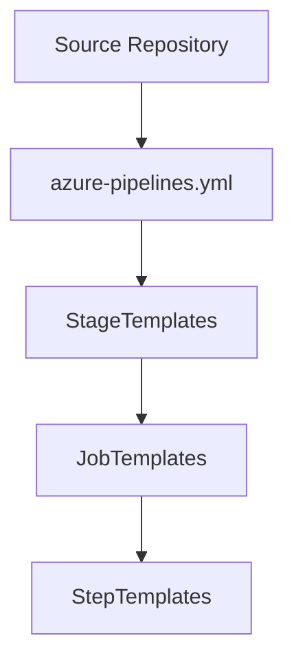
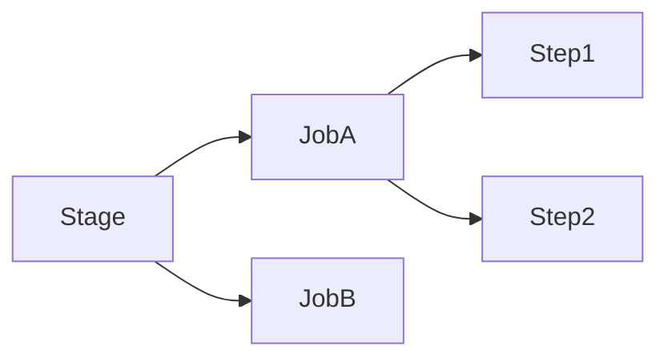
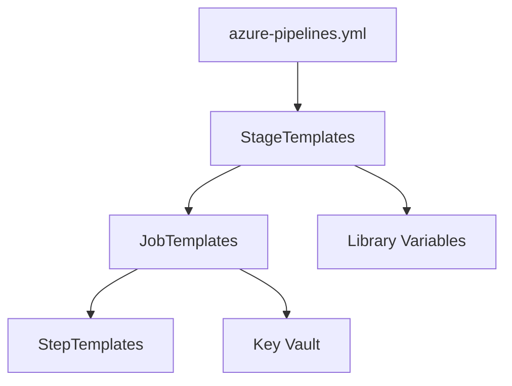
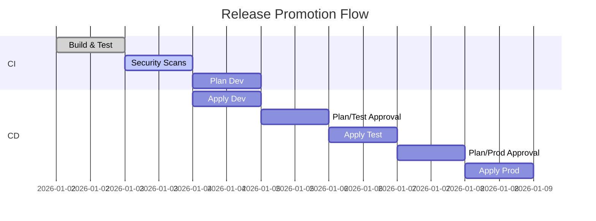

# YAML Pipeline Best Practices and Reusable Templates in Azure

**Author:** Randy Bordeaux  
**Version:** 1.0  
**Date:** January 2026  
**Azure Services:** Azure DevOps, GitHub Actions, Terraform, Azure Key Vault

---

## Executive Summary

This whitepaper defines **enterprise-grade patterns for YAML-based CI/CD in Azure**, centering on **Azure DevOps pipelines with reusable templates and parameterized delivery**. It targets teams building scalable, secure, and compliant pipelines for both infrastructure and application workloads.

The guidance enforces **least privilege**, **immutable pipelines**, and **template-driven standardization**. Terraform is treated as the authoritative infrastructure-as-code (IaC) mechanism, with security, environment isolation, and auditability embedded across the pipeline lifecycle. All patterns assume **Azure Commercial** environments and production-grade controls.

**Key Outcomes:**
- Standardize pipelines with reusable, versioned templates and pinned references
- Enforce least-privilege identities, secretless execution, and approval gates
- Deliver Terraform with deterministic plan/apply flows and drift detection
- Embed policy validation, compliance logging, and audit-ready evidence
- Provide resilient execution with retries, concurrency control, and recovery playbooks

---

## Table of Contents

1. Scope and Design Objectives  
2. YAML Pipeline Architecture Principles  
3. Repository and Template Organization  
4. Parameterization and Variable Management  
5. Stage, Job, and Step Design Patterns  
6. Security Best Practices in YAML Pipelines  
7. Terraform Integration Patterns  
8. Approval Gates and Environment Controls  
9. Observability, Auditing, and Drift Detection  
10. Tradeoffs and Anti-Patterns  

---

## Scope and Design Principles

### In Scope

- Authoring maintainable, reusable YAML pipelines at scale
- Template-driven delivery for stages, jobs, and steps across repos
- Secure execution with least-privilege identities and secretless patterns
- Terraform-driven infrastructure delivery with controlled promotion
- Policy-aligned enforcement (branch protection, approvals, OPA/conftest)
- Observability, auditing, and drift detection for pipeline runs
- Reliability patterns (retries, timeouts, concurrency control)

### Out of Scope

- Classic (UI-based) pipelines
- Non-Azure CI/CD platforms
- Application-specific buildpack tooling
- Terraform Cloud/Enterprise workflows

### Design Principles

| Principle | Implementation |
|-----------|----------------|
| **Declarative** | All behavior defined in YAML and templates; no ad-hoc scripts in root pipeline |
| **Composable** | Small, single-purpose templates for stages/jobs/steps with parameterized inputs |
| **Deterministic** | Pin tool versions and template refs; same inputs yield same outputs |
| **Least Privilege** | Environment-scoped service connections; no shared prod credentials |
| **Secretless** | OIDC/federated credentials; secrets only from Key Vault or variable groups |
| **Auditable** | Pipeline logs, approvals, and policy checks emitted to Log Analytics |

---

## YAML Pipeline Architecture Principles

Enterprise YAML pipelines should be:

- **Declarative**: Desired state defined explicitly  
- **Composable**: Built from small, reusable templates  
- **Deterministic**: Same inputs produce the same outputs  
- **Secure by default**: Least privilege enforced everywhere  



---

## Repository and Template Organization

A recommended repository layout:

```
/pipelines
  /templates
    /stages
    /jobs
    /steps
  azure-pipelines.yml
```

Key rules:

- Root pipeline only orchestrates stages  
- No business logic in the root YAML  
- Templates are versioned and reviewed like code  
- Cross-repo templates use pinned references  

---

## Parameterization and Variable Management

### Parameters

- Use parameters for **structural decisions** (stages, jobs, environments)
- Parameters are evaluated at compile time
- Avoid runtime mutation

```yaml
parameters:
  - name: environment
    type: string
    values:
      - dev
      - test
      - prod
```

### Variables

- Use variables for **runtime values**
- Secrets must never be defined inline
- Environment-specific variables are injected via variable groups or Key Vault

---

## Stage, Job, and Step Design Patterns

### Stages

- One environment per stage
- No shared credentials across stages
- Explicit dependencies only

### Jobs

- Single responsibility per job
- Avoid monolithic jobs
- Prefer agent-based isolation

### Steps

- Idempotent execution
- Explicit tool versions
- Fail fast on error



---

## Security Best Practices in YAML Pipelines

Security controls must be enforced directly in YAML:

- Dedicated service connections per environment  
- Least-privilege RBAC assignments  
- Entra ID–backed authentication only  
- Secrets sourced from Azure Key Vault  

Anti-patterns:

- Inline secrets  
- Shared production credentials  
- Over-privileged service connections  

---

## Terraform Integration Patterns

Terraform execution must be explicit and controlled.

```yaml
- script: |
    terraform init
    terraform plan -out=tfplan
  displayName: Terraform Plan
```

Best practices:

- One Terraform workspace per environment  
- Separate state backends  
- Never run `apply` without a prior `plan`  
- Apply stages require manual approval  

---

## Approval Gates and Environment Controls


Controls:

- Manual approvals for production  
- Branch protection rules  
- Environment-scoped service connections  
- Policy validation before apply  

---

## Observability, Auditing, and Drift Detection

- Pipeline logs retained centrally  
- Terraform state access logged  
- Azure Activity Logs enabled at subscription scope  
- Scheduled drift detection pipelines recommended  

Traceability must exist from **commit → pipeline → resource change**.

---

## Tradeoffs and Anti-Patterns

### Tradeoffs

- Increased YAML complexity  
- Higher initial engineering effort  

### Anti-Patterns

- Copy-paste pipelines  
- Logic-heavy root YAML files  
- Environment conditionals scattered across steps  

---

## Conclusion

Well-designed YAML pipelines act as **enforcement mechanisms**, not just automation scripts. Reusable templates, strict parameterization, and embedded security controls enable safe, scalable Azure delivery.

---

*End of Document*


---

## Pipeline Architecture Principles

Enterprise pipelines should emphasize **declarative orchestration**, **template-first composition**, and **deterministic execution**.

### Key Practices

- Single root pipeline (`azure-pipelines.yml`) that only orchestrates stages
- All logic lives in **reusable templates** (stages/jobs/steps)
- Pin template versions (branch or tag) to avoid implicit drift
- Explicit dependencies between stages and jobs; no hidden ordering
- Use **runtime parameters** for structure and **variables** for values
- Fail-fast behavior with consistent retry and timeout policies



### Example Root Pipeline (Orchestration Only)

```yaml
# azure-pipelines.yml
trigger:
  branches:
    include:
      - main
      - release/*

extends:
  template: pipelines/templates/stages/app-ci-cd.yml
  parameters:
    environments:
      - dev
      - test
      - prod
    enable_terraform: true
    enable_security_scans: true
```

---

## Repository and Template Organization

Recommended repository layout for reusable pipeline assets:

```
/pipelines
  azure-pipelines.yml            # Root orchestrator
  /templates
    /stages
      app-ci-cd.yml
      infra-ci-cd.yml
    /jobs
      build.yml
      deploy.yml
      terraform-plan.yml
      terraform-apply.yml
      quality-gates.yml
    /steps
      setup-dotnet.yml
      setup-node.yml
      trivy-scan.yml
      tfsec.yml
      opa-validate.yml
  /variables
    dev.yml
    test.yml
    prod.yml
  /scripts
    drift-detect.sh
    parse-plan.py
```

### Cross-Repo Template Consumption

```yaml
# azure-pipelines.yml
extends:
  template: app-ci-cd.yml@pipeline-templates
  parameters:
    templateVersion: refs/tags/v1.4.0
    environments: [dev, prod]
```

**Guidelines:**
- Use **tagged refs** (`refs/tags/vX.Y.Z`) for template imports
- Avoid floating `main` references in production pipelines
- Store shared templates in a dedicated repo with CODEOWNERS and PR checks
- Version templates like code; breaking changes require major version bumps

---

## Parameterization and Variable Management

### Parameters (Structure)

```yaml
parameters:
  - name: environments
    type: object
    default: [dev, test, prod]
  - name: deploy_windows
    type: boolean
    default: false
```

### Variables (Values)

```yaml
variables:
  - template: variables/common.yml
  - template: variables/$(Build.SourceBranchName).yml

steps:
  - task: AzureKeyVault@2
    inputs:
      azureSubscription: 'svc-connection-dev'
      KeyVaultName: 'kv-pipeline-dev'
      SecretsFilter: 'sp-client-id,sp-client-secret'
```

**Practices:**
- Parameters decide structure; variables supply runtime values
- Secrets **never** inline; always sourced from Key Vault or library variable groups
- Use variable groups per environment; do not share production secrets
- Mask outputs when passing between jobs (`isOutput=true`, `issecret=true`)

---

## Stage, Job, and Step Patterns

### Stage Pattern

```yaml
stages:
- stage: Deploy_Test
  displayName: Deploy to Test
  dependsOn: Build
  condition: succeeded()
  jobs:
    - template: jobs/deploy.yml
      parameters:
        environment: test
```

### Job Pattern

```yaml
# pipelines/templates/jobs/deploy.yml
parameters:
  - name: environment
    type: string

jobs:
- deployment: Deploy
  environment: ${{ parameters.environment }}
  strategy:
    runOnce:
      deploy:
        steps:
          - template: steps/deploy-app.yml
            parameters:
              environment: ${{ parameters.environment }}
```

### Step Pattern

```yaml
# pipelines/templates/steps/deploy-app.yml
parameters:
  - name: environment
    type: string

steps:
  - script: npm ci
    displayName: Install dependencies
  - script: npm run build
    displayName: Build
  - script: npm run test
    displayName: Test
  - task: AzureCLI@2
    displayName: Deploy
    inputs:
      azureSubscription: 'svc-${{ parameters.environment }}'
      scriptType: bash
      scriptLocation: inlineScript
      inlineScript: |
        az webapp deploy --name myapp-${{ parameters.environment }} --src-path dist/
```

**Principles:**
- One responsibility per job; split build/test/deploy into separate jobs
- Use **deployment jobs** for environments to leverage approvals and checks
- Apply `condition` for controlled retries and skip logic

---

## Security, Identity, and Secrets Management

### Identity

- Use **workload identity federation (OIDC)** for pipelines; avoid client secrets
- Environment-scoped service connections; no shared production creds
- Managed identities for deployment tasks where possible

```yaml
# GitHub Actions (OIDC to Azure)
permissions:
  id-token: write
  contents: read

steps:
  - uses: azure/login@v1
    with:
      client-id: ${{ secrets.AZURE_CLIENT_ID }}
      tenant-id: ${{ secrets.AZURE_TENANT_ID }}
      subscription-id: ${{ secrets.AZURE_SUBSCRIPTION_ID }}
```

### Secrets

- No inline secrets; Key Vault-backed variable groups only
- Restrict secret scope per environment
- Rotate secrets and service connections on a schedule; track rotation in backlog

```yaml
variables:
- group: kv-prod

steps:
  - task: AzureKeyVault@2
    inputs:
      azureSubscription: 'svc-prod'
      KeyVaultName: 'kv-pipeline-prod'
      SecretsFilter: 'sp-client-id,sp-client-secret'
```

### Hardening

- Set `lockBehavior: sequential` for prod pipelines to prevent concurrent writes
- Enforce `succeeded()` conditions; avoid `always()` for deploy jobs
- Validate artifacts with checksums/signatures before deploy

---

## Terraform Integration and IaC Delivery

### Plan and Apply Separation

```yaml
# pipelines/templates/jobs/terraform-plan.yml
steps:
  - checkout: self
  - task: AzureCLI@2
    displayName: Terraform Init/Plan
    inputs:
      azureSubscription: 'svc-dev'
      scriptType: bash
      scriptLocation: inlineScript
      inlineScript: |
        set -euo pipefail
        export ARM_USE_OIDC=true
        terraform init           -backend-config="resource_group_name=rg-tfstate-dev"           -backend-config="storage_account_name=sttfstatedev001"           -backend-config="container_name=dev-tfstate"           -backend-config="key=app.tfstate"
        terraform plan -out=tfplan
        terraform show -json tfplan > tfplan.json
        python scripts/parse-plan.py tfplan.json > plan-summary.txt
```

```yaml
# pipelines/templates/jobs/terraform-apply.yml
steps:
  - download: current
    artifact: tfplan
  - task: AzureCLI@2
    displayName: Terraform Apply
    inputs:
      azureSubscription: 'svc-prod'
      scriptType: bash
      scriptLocation: inlineScript
      inlineScript: |
        set -euo pipefail
        export ARM_USE_OIDC=true
        terraform apply tfplan
```

**Practices:**
- Generate plan once; store as artifact; apply uses the exact plan
- Plans are immutable; no re-plan in apply stage
- Use `-lock-timeout=300s` to tolerate transient lock contention
- Fail plans on `-detailed-exitcode` parsing; block merges if non-zero changes unapproved

### Drift Detection (Scheduled)

```yaml
schedules:
  - cron: "0 */6 * * *"  # Every 6 hours
    displayName: Drift Detection
    branches:
      include: [main]
    always: true

jobs:
- job: Drift
  pool:
    vmImage: ubuntu-latest
  steps:
    - checkout: self
    - script: |
        export ARM_USE_OIDC=true
        terraform init -backend-config=... 
        terraform plan -detailed-exitcode -out=tfplan || EXIT=$?
        if [ "${EXIT:-0}" = "2" ]; then
          echo "Drift detected"; exit 1
        fi
      displayName: Detect drift
```

---

## Quality Gates, Approvals, and Promotion


### Environment Checks (Azure DevOps)

- Use **approvals and checks** on environments (approver groups, business hours)
- Require `Artifact filters` to ensure correct artifact/environment pairing
- Enable **branch filters** to restrict production deployments to `main`/`release/*`

### Promotion Flow

```yaml
stages:
- stage: Plan_Prod
  jobs:
    - template: jobs/terraform-plan.yml
      parameters:
        environment: prod

- stage: Approve_Prod
  dependsOn: Plan_Prod
  jobs:
    - job: ManualGate
      pool: server
      steps:
        - task: ManualValidation@0
          inputs:
            notifyUsers: 'prod-approvers@contoso.com'
            instructions: 'Review plan-summary.txt before approval.'

- stage: Apply_Prod
  dependsOn: Approve_Prod
  condition: succeeded()
  jobs:
    - template: jobs/terraform-apply.yml
      parameters:
        environment: prod
```

### Policy Validation

- Gate on security scans (SAST/DAST), IaC validation (tfsec, OPA), and SBOM checks
- Block apply if policy violations exceed severity thresholds

---

## Observability, Auditing, and Drift Detection

### Logging and Tracing

- Emit pipeline logs to Log Analytics via diagnostic settings
- Use structured logs for plan summaries and approvals
- Tag runs with `build.reason`, `commit`, `environment`

### KQL Queries

```kql
// Pipeline failures by job
AzureDiagnostics
| where Category == "PipelineRuns"
| summarize Failures = count() by JobName, bin(TimeGenerated, 1d)
| order by Failures desc
```

```kql
// Manual approvals timeline
AzureDiagnostics
| where Category == "Approvals"
| project TimeGenerated, StageName, Approver, Status
| order by TimeGenerated desc
```

### Drift Audit

- Store plan artifacts and drift results for 90 days
- Alert on failed drift runs (scheduled job failure signal)

---

## Reusable Template Patterns and Libraries

### Stage Template with Parameters

```yaml
# pipelines/templates/stages/app-ci-cd.yml
parameters:
  - name: environments
    type: object
  - name: enable_terraform
    type: boolean
    default: true

stages:
- ${{ each env in parameters.environments }}:
  - stage: Deploy_${{ env }}
    displayName: Deploy to ${{ env }}
    jobs:
      - template: ../jobs/build.yml
      - template: ../jobs/deploy.yml
        parameters:
          environment: ${{ env }}
      - ${{ if and(eq(parameters.enable_terraform, true), ne(env, 'dev')) }}:
        - template: ../jobs/terraform-plan.yml
          parameters:
            environment: ${{ env }}
```

### Job Template: Quality Gates

```yaml
# pipelines/templates/jobs/quality-gates.yml
jobs:
- job: Gates
  pool:
    vmImage: ubuntu-latest
  steps:
    - template: ../steps/tfsec.yml
    - template: ../steps/opa-validate.yml
    - template: ../steps/trivy-scan.yml
```

### Step Template: OPA Validation

```yaml
# pipelines/templates/steps/opa-validate.yml
steps:
  - script: |
      set -euo pipefail
      opa run --server --addr :8181 &
      conftest test . --all-namespaces --policy policies/opa
    displayName: OPA Validate
```

**Library Guidance:**
- Keep templates **pure** (no environment-specific values inside templates)
- Inputs must declare types; use defaults for optional behaviors
- Include schema docs in template headers (parameters, expected variables)

---

## Compliance, Policy, and Guardrails

### OPA/Rego Example

```rego
package azure.pipelines

default allow = false

# Block public IP creation without justification
allow {
  not public_ip_without_tag
}

public_ip_without_tag {
  input.resource_type == "azurerm_public_ip"
  not input.tags.justification
}
```

### Conftest Wrapper Step

```yaml
steps:
  - script: |
      set -euo pipefail
      conftest test pipelines --policy policies/opa
    displayName: Policy Check
```

### Azure DevOps Checks

- Branch policies: required reviewers, status checks from security scans
- Environment checks: approvals, schedule windows, required templates
- Repository protection: CODEOWNERS on templates and policies

---

## Reliability, Resilience, and Failure Recovery

- Use `retryCountOnTaskFailure` and `timeoutInMinutes` on tasks/jobs
- Prefer **idempotent** steps; guard with existence checks
- Configure **concurrency groups** to avoid overlapping deployments
- Capture artifacts (plans, logs, SBOMs) for postmortems

```yaml
jobs:
- job: Deploy
  timeoutInMinutes: 30
  strategy:
    runOnce:
      deploy:
        steps:
          - script: ./deploy.sh
            displayName: Deploy
            retryCountOnTaskFailure: 2
```

### Rollback Playbook (Terraform)

```bash
#!/bin/bash
set -euo pipefail

if [ ! -f tfplan-prev ]; then
  echo "Previous plan missing" && exit 1
fi

echo "Applying previous known-good plan"
terraform apply tfplan-prev
```

---

## Testing and Validation Strategies

- Lint YAML (`yamllint`), validate schema (`azure-pipelines-yaml` schema)
- Unit test templates with template expansion tests
- Integration tests using pipeline simulation (dry-runs) and test subscriptions
- Security tests: tfsec, Trivy, OPA/conftest

```bash
# lint-templates.sh
set -euo pipefail
yamllint pipelines/templates
python -m azure_pipelines_validate pipelines/templates/stages/app-ci-cd.yml
```

---

## Common Anti-Patterns and Tradeoffs

| Anti-Pattern | Risk | Mitigation |
|--------------|------|------------|
| Floating template refs (`@main`) | Unreviewed breaking changes hit prod | Pin tags; automated template drift alerts |
| Inline secrets in YAML | Secret leakage in repo history | Key Vault-backed variables; remove secrets from history | 
| Single service connection for all envs | Blast radius if compromised | Separate connections per env; scoped RBAC |
| Re-plan during apply | Plan/apply mismatch | Plan once, store artifact, apply artifact |
| No drift detection | Undetected out-of-band changes | Scheduled plan with alerting |

---

## References and Resources

- Azure Pipelines YAML schema: https://learn.microsoft.com/azure/devops/pipelines/yaml-schema
- Azure DevOps approvals and checks: https://learn.microsoft.com/azure/devops/pipelines/process/approvals
- Azure RBAC for pipelines: https://learn.microsoft.com/azure/devops/pipelines/security/roles
- Terraform AzureRM backend: https://developer.hashicorp.com/terraform/language/settings/backends/azurerm
- OIDC with GitHub Actions and Azure: https://learn.microsoft.com/azure/active-directory/develop/workload-identity-federation

---

## Appendices

### Appendix A: Pipeline Security Checklist

- [ ] Root pipeline orchestrates only; logic in templates
- [ ] Templates pinned to tagged versions
- [ ] Environment-scoped service connections; no shared prod creds
- [ ] OIDC/federated identities; no stored secrets in repo
- [ ] Key Vault-backed secrets; secret variables masked
- [ ] Approvals and checks enabled for non-dev
- [ ] Drift detection scheduled for Terraform
- [ ] Artifact integrity validated (checksums/SBOM)
- [ ] Logs emitted to Log Analytics; retention >= 90 days
- [ ] Concurrency controls on prod deployments

### Appendix B: Template Library Map

- `templates/stages/app-ci-cd.yml` – orchestrates build/test/deploy per environment
- `templates/jobs/terraform-plan.yml` – deterministic plan creation
- `templates/jobs/terraform-apply.yml` – plan artifact application with OIDC
- `templates/jobs/quality-gates.yml` – tfsec, OPA, Trivy
- `templates/steps/opa-validate.yml` – policy enforcement
- `templates/steps/trivy-scan.yml` – container scanning

### Appendix C: Troubleshooting Guide

| Symptom | Likely Cause | Resolution |
|---------|--------------|------------|
| `AuthorizationFailed` during deploy | Service connection lacks role | Grant least-privilege role; wait for RBAC propagation |
| Drift job fails intermittently | State lock contention | Increase `-lock-timeout`; serialize runs via concurrency |
| OIDC login fails | Missing federated credential subject | Verify issuer/subject on app; re-run login |
| Policy check blocks deploy | OPA rule violation | Review `conftest` output; update IaC or policy with justification |

### Appendix D: Release and Promotion Timeline



---

**Document Version:** 1.0  
**Last Updated:** January 2026  
**Author:** Randy Bordeaux  
**Review Cycle:** Quarterly

