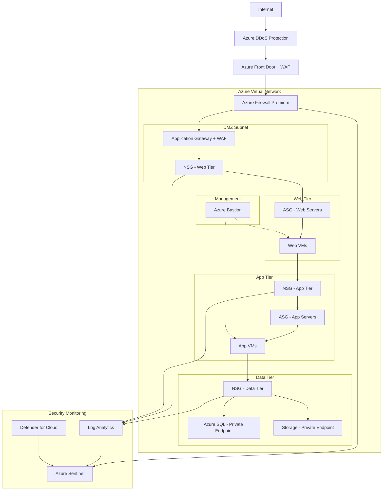
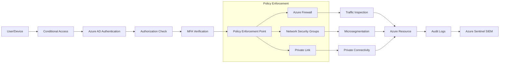
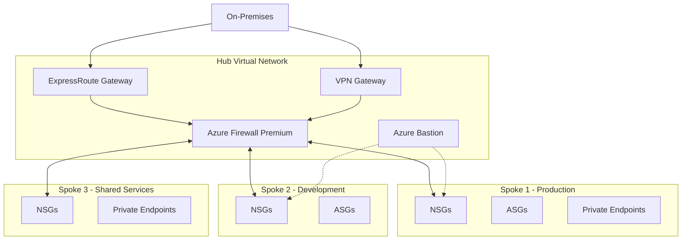

# Azure Network Security Best Practices

**Author:** Randy Bordeaux  
**Date:** January 2026  
**Version:** 1.0  
**Azure Services:** Azure Firewall, Network Security Groups (NSGs), Application Security Groups (ASGs), Azure DDoS Protection, Azure Bastion, Azure Private Link, Web Application Firewall (WAF), Microsoft Defender for Cloud

## Executive Summary

Network security is the foundation of a comprehensive cloud security strategy. As organizations migrate critical workloads to Azure, they face increasingly sophisticated threats including DDoS attacks, malware propagation, data exfiltration, and advanced persistent threats. Traditional perimeter-based security models are insufficient for protecting modern cloud environments that require dynamic, defense-in-depth approaches.

Azure provides a comprehensive suite of network security services that enable organizations to implement zero-trust architectures, defend against evolving threats, and maintain compliance with regulatory requirements. By combining Azure Firewall, Network Security Groups, Private Link, DDoS Protection, and Web Application Firewall, organizations can create layered security controls that protect workloads at every level.

This whitepaper provides actionable guidance for implementing Azure network security best practices, covering architecture patterns, configuration strategies, threat protection, and compliance considerations. Organizations following these recommendations typically reduce security incidents by 70-80% while achieving compliance with standards including NIST 800-53, CIS Benchmarks, and FedRAMP.

## Table of Contents

- [Executive Summary](#executive-summary)
- [Introduction](#introduction)
- [Problem Statement](#problem-statement)
- [Solution Overview](#solution-overview)
- [Technical Architecture](#technical-architecture)
- [Implementation Guide](#implementation-guide)
- [Best Practices](#best-practices)
- [Security Considerations](#security-considerations)
- [Cost Optimization](#cost-optimization)
- [Monitoring and Maintenance](#monitoring-and-maintenance)
- [Conclusion](#conclusion)
- [References](#references)
- [Appendices](#appendices)

## Introduction

### Background
Network security in Azure requires a shift from traditional perimeter-based security models to defense-in-depth strategies that assume breach and verify every access request. The shared responsibility model places network security configuration and policy management squarely in the customer's domain, making it critical to implement comprehensive security controls.

### Scope
This whitepaper covers:
- Network segmentation and isolation strategies
- Azure Firewall configuration and policy management
- Network Security Group (NSG) and Application Security Group (ASG) design
- DDoS protection and mitigation
- Secure remote access with Azure Bastion
- Private connectivity with Azure Private Link
- Web Application Firewall (WAF) implementation
- Zero-trust network architecture
- Threat detection and response

### Target Audience
- Security architects and engineers
- Cloud network architects
- Security operations center (SOC) teams
- Compliance and risk management professionals
- IT administrators managing Azure infrastructure

### Prerequisites
- Azure subscription with appropriate permissions
- Understanding of networking fundamentals (TCP/IP, routing, firewalls)
- Familiarity with Azure Virtual Networks and subnets
- Basic understanding of security principles and defense-in-depth

## Problem Statement

### Current Challenges

**Inadequate Network Segmentation**
- Flat network architectures without proper isolation
- Lateral movement opportunities for attackers
- Difficulty enforcing least-privilege access
- Lack of microsegmentation for workload isolation

**Perimeter Security Gaps**
- Public endpoints exposed to internet attacks
- Insufficient DDoS protection
- Missing web application firewall controls
- Unprotected management interfaces

**Insufficient Traffic Inspection**
- East-west traffic flows without inspection
- Encrypted traffic bypassing security controls
- Missing intrusion detection/prevention capabilities
- Lack of threat intelligence integration

**Insecure Remote Access**
- Direct RDP/SSH exposure to the internet
- Weak authentication mechanisms
- No just-in-time access controls
- Insufficient audit logging for privileged access

**Compliance and Governance Gaps**
- Inconsistent security policy enforcement
- Manual security configurations prone to drift
- Inadequate logging for compliance requirements
- Difficulty demonstrating security controls to auditors

### Business Impact
- **Data Breaches:** Average cost of $4.45M per incident in 2023
- **Downtime:** DDoS attacks causing service unavailability and revenue loss
- **Compliance Penalties:** Fines for inadequate security controls (GDPR, HIPAA, PCI-DSS)
- **Reputation Damage:** Loss of customer trust following security incidents
- **Operational Overhead:** 60-80% of security team time spent on reactive incident response

## Solution Overview

Azure's comprehensive network security portfolio enables organizations to implement defense-in-depth strategies aligned with zero-trust principles.

### Key Benefits
- **Layered Defense:** Multiple security controls at network, application, and data layers
- **Automated Threat Protection:** AI-powered threat detection and response
- **Zero-Trust Architecture:** Verify explicitly, use least-privilege access, assume breach
- **Centralized Management:** Unified policy management with Azure Firewall Manager
- **Compliance Support:** Built-in controls aligned with major security frameworks
- **Reduced Attack Surface:** Private connectivity eliminates public exposure

### Success Criteria
- Achieve 99.99% uptime against DDoS attacks
- Reduce security incidents by 70-80% within 6 months
- Block 100% of OWASP Top 10 attacks with WAF
- Eliminate public RDP/SSH exposure across all environments
- Achieve compliance scores >90% for NIST 800-53 and CIS Benchmarks
- Reduce mean time to detect (MTTD) threats to <5 minutes

### Core Security Components

#### Component 1: Azure Firewall
- **Purpose:** Centralized network security and threat protection
- **Azure Service:** Azure Firewall Premium
- **Configuration:** Stateful firewall with IDPS, TLS inspection, URL filtering, and threat intelligence

#### Component 2: Network Security Groups (NSGs)
- **Purpose:** Subnet and NIC-level traffic filtering
- **Azure Service:** Network Security Groups
- **Configuration:** Allow/deny rules based on source/destination IP, port, and protocol

#### Component 3: Application Security Groups (ASGs)
- **Purpose:** Application-centric security policy management
- **Azure Service:** Application Security Groups
- **Configuration:** Logical grouping of VMs for simplified NSG rule management

#### Component 4: Azure DDoS Protection
- **Purpose:** Protection against volumetric and protocol DDoS attacks
- **Azure Service:** Azure DDoS Network Protection
- **Configuration:** Always-on traffic monitoring with automatic attack mitigation

#### Component 5: Azure Bastion
- **Purpose:** Secure RDP/SSH access without public exposure
- **Azure Service:** Azure Bastion
- **Configuration:** PaaS-based jump host with HTML5 browser-based access

#### Component 6: Azure Private Link
- **Purpose:** Private connectivity to Azure PaaS services
- **Azure Service:** Azure Private Link / Private Endpoints
- **Configuration:** Eliminates public internet exposure for PaaS services

#### Component 7: Web Application Firewall (WAF)
- **Purpose:** Layer 7 application security
- **Azure Service:** WAF on Azure Application Gateway / Azure Front Door
- **Configuration:** OWASP rule sets, custom rules, bot protection

## Technical Architecture

### Defense-in-Depth Architecture



### Zero-Trust Network Architecture



### Hub-Spoke Security Architecture



## Implementation Guide

### Prerequisites
- Azure subscription with Owner or Security Admin role
- Hub-spoke network topology deployed (or plan to deploy)
- Log Analytics workspace for security logging
- Azure Policy and Defender for Cloud enabled

### Step 1: Deploy Azure Firewall Premium

```bash
# Create resource group for hub network
az group create \
  --name Hub-Network-RG \
  --location eastus

# Create hub virtual network
az network vnet create \
  --resource-group Hub-Network-RG \
  --name Hub-VNet \
  --address-prefix 10.0.0.0/16 \
  --subnet-name AzureFirewallSubnet \
  --subnet-prefix 10.0.1.0/24

# Create public IP for Azure Firewall
az network public-ip create \
  --resource-group Hub-Network-RG \
  --name AzFirewall-PIP \
  --sku Standard \
  --allocation-method Static

# Create Azure Firewall Premium
az network firewall create \
  --resource-group Hub-Network-RG \
  --name Hub-AzFirewall \
  --location eastus \
  --tier Premium \
  --sku AZFW_VNet \
  --vnet-name Hub-VNet \
  --public-ip AzFirewall-PIP

# Configure Azure Firewall
az network firewall ip-config create \
  --firewall-name Hub-AzFirewall \
  --name FW-Config \
  --public-ip-address AzFirewall-PIP \
  --resource-group Hub-Network-RG \
  --vnet-name Hub-VNet

# Enable threat intelligence
az network firewall update \
  --resource-group Hub-Network-RG \
  --name Hub-AzFirewall \
  --threat-intel-mode Alert
```

### Step 2: Configure Azure Firewall Policy

```bash
# Create firewall policy with Premium features
az network firewall policy create \
  --resource-group Hub-Network-RG \
  --name Hub-FW-Policy \
  --sku Premium \
  --threat-intel-mode Alert \
  --idps-mode Alert \
  --enable-dns-proxy true

# Associate policy with firewall
az network firewall update \
  --resource-group Hub-Network-RG \
  --name Hub-AzFirewall \
  --firewall-policy Hub-FW-Policy

# Create rule collection group
az network firewall policy rule-collection-group create \
  --resource-group Hub-Network-RG \
  --policy-name Hub-FW-Policy \
  --name AppRules \
  --priority 100

# Add application rules
az network firewall policy rule-collection-group collection add-filter-collection \
  --resource-group Hub-Network-RG \
  --policy-name Hub-FW-Policy \
  --rule-collection-group-name AppRules \
  --name AllowAzureServices \
  --collection-priority 100 \
  --action Allow \
  --rule-name AllowAzureMonitor \
  --rule-type ApplicationRule \
  --target-fqdns "*.azure.com" "*.microsoft.com" \
  --source-addresses "10.1.0.0/16" "10.2.0.0/16" \
  --protocols Https=443

# Add network rules for internal traffic
az network firewall policy rule-collection-group collection add-filter-collection \
  --resource-group Hub-Network-RG \
  --policy-name Hub-FW-Policy \
  --rule-collection-group-name NetworkRules \
  --name AllowInternalTraffic \
  --collection-priority 200 \
  --action Allow \
  --rule-name AllowWebToApp \
  --rule-type NetworkRule \
  --ip-protocols TCP \
  --source-addresses "10.1.1.0/24" \
  --destination-addresses "10.1.2.0/24" \
  --destination-ports "443" "8080"
```

### Step 3: Configure Network Security Groups

```bash
# Create NSG for web tier
az network nsg create \
  --resource-group Production-RG \
  --name Web-Tier-NSG \
  --location eastus

# Allow HTTPS from internet
az network nsg rule create \
  --resource-group Production-RG \
  --nsg-name Web-Tier-NSG \
  --name Allow-HTTPS-Inbound \
  --priority 100 \
  --direction Inbound \
  --access Allow \
  --protocol Tcp \
  --source-address-prefixes Internet \
  --source-port-ranges '*' \
  --destination-address-prefixes '*' \
  --destination-port-ranges 443

# Deny all other inbound traffic
az network nsg rule create \
  --resource-group Production-RG \
  --nsg-name Web-Tier-NSG \
  --name Deny-All-Inbound \
  --priority 4096 \
  --direction Inbound \
  --access Deny \
  --protocol '*' \
  --source-address-prefixes '*' \
  --source-port-ranges '*' \
  --destination-address-prefixes '*' \
  --destination-port-ranges '*'

# Create NSG for app tier
az network nsg create \
  --resource-group Production-RG \
  --name App-Tier-NSG \
  --location eastus

# Allow traffic from web tier only
az network nsg rule create \
  --resource-group Production-RG \
  --nsg-name App-Tier-NSG \
  --name Allow-From-Web-Tier \
  --priority 100 \
  --direction Inbound \
  --access Allow \
  --protocol Tcp \
  --source-address-prefixes "10.1.1.0/24" \
  --destination-address-prefixes '*' \
  --destination-port-ranges 8080

# Enable NSG Flow Logs
az network watcher flow-log create \
  --location eastus \
  --name Web-NSG-FlowLog \
  --nsg /subscriptions/{sub}/resourceGroups/Production-RG/providers/Microsoft.Network/networkSecurityGroups/Web-Tier-NSG \
  --storage-account {storage-account-id} \
  --workspace {workspace-id} \
  --interval 10 \
  --traffic-analytics true \
  --retention 30
```

### Step 4: Configure Application Security Groups

```bash
# Create ASGs for logical grouping
az network asg create \
  --resource-group Production-RG \
  --name WebServers-ASG \
  --location eastus

az network asg create \
  --resource-group Production-RG \
  --name AppServers-ASG \
  --location eastus

az network asg create \
  --resource-group Production-RG \
  --name DBServers-ASG \
  --location eastus

# Create NSG rule using ASGs
az network nsg rule create \
  --resource-group Production-RG \
  --nsg-name App-Tier-NSG \
  --name Allow-Web-to-App \
  --priority 110 \
  --direction Inbound \
  --access Allow \
  --protocol Tcp \
  --source-asgs WebServers-ASG \
  --destination-asgs AppServers-ASG \
  --destination-port-ranges 8080

# Associate NIC with ASG
az network nic ip-config update \
  --resource-group Production-RG \
  --nic-name web-vm-01-nic \
  --name ipconfig1 \
  --application-security-groups WebServers-ASG
```

### Step 5: Deploy Azure Bastion

```bash
# Create Bastion subnet
az network vnet subnet create \
  --resource-group Hub-Network-RG \
  --vnet-name Hub-VNet \
  --name AzureBastionSubnet \
  --address-prefix 10.0.2.0/26

# Create public IP for Bastion
az network public-ip create \
  --resource-group Hub-Network-RG \
  --name Bastion-PIP \
  --sku Standard \
  --allocation-method Static

# Deploy Azure Bastion
az network bastion create \
  --resource-group Hub-Network-RG \
  --name Hub-Bastion \
  --public-ip-address Bastion-PIP \
  --vnet-name Hub-VNet \
  --location eastus \
  --sku Standard

# Remove public IPs from VMs (after Bastion deployment)
az network nic ip-config update \
  --resource-group Production-RG \
  --nic-name web-vm-01-nic \
  --name ipconfig1 \
  --remove PublicIpAddress
```

### Step 6: Enable Azure DDoS Protection

```bash
# Create DDoS Protection Plan
az network ddos-protection create \
  --resource-group Hub-Network-RG \
  --name Hub-DDoS-Plan \
  --location eastus

# Enable DDoS Protection on VNet
az network vnet update \
  --resource-group Production-RG \
  --name Production-VNet \
  --ddos-protection-plan /subscriptions/{sub}/resourceGroups/Hub-Network-RG/providers/Microsoft.Network/ddosProtectionPlans/Hub-DDoS-Plan \
  --ddos-protection true

# Configure DDoS alerts
az monitor metrics alert create \
  --name DDoS-Attack-Alert \
  --resource-group Production-RG \
  --scopes /subscriptions/{sub}/resourceGroups/Production-RG/providers/Microsoft.Network/publicIPAddresses/AppGW-PIP \
  --condition "max IfUnderDDoSAttack > 0" \
  --window-size 5m \
  --evaluation-frequency 1m \
  --severity 0 \
  --description "Alert when DDoS attack detected"
```

### Step 7: Configure Private Endpoints

```bash
# Disable public network access on storage account
az storage account update \
  --resource-group Production-RG \
  --name prodstorageacct \
  --public-network-access Disabled

# Create private endpoint subnet
az network vnet subnet create \
  --resource-group Production-RG \
  --vnet-name Production-VNet \
  --name PrivateEndpoint-Subnet \
  --address-prefix 10.1.4.0/24 \
  --disable-private-endpoint-network-policies true

# Create private endpoint for storage
az network private-endpoint create \
  --resource-group Production-RG \
  --name Storage-PE \
  --location eastus \
  --subnet PrivateEndpoint-Subnet \
  --vnet-name Production-VNet \
  --private-connection-resource-id /subscriptions/{sub}/resourceGroups/Production-RG/providers/Microsoft.Storage/storageAccounts/prodstorageacct \
  --group-id blob \
  --connection-name storage-connection

# Create private DNS zone
az network private-dns zone create \
  --resource-group Production-RG \
  --name privatelink.blob.core.windows.net

# Link DNS zone to VNet
az network private-dns link vnet create \
  --resource-group Production-RG \
  --zone-name privatelink.blob.core.windows.net \
  --name StorageDNSLink \
  --virtual-network Production-VNet \
  --registration-enabled false

# Create DNS record for private endpoint
az network private-endpoint dns-zone-group create \
  --resource-group Production-RG \
  --endpoint-name Storage-PE \
  --name StorageDNSZoneGroup \
  --private-dns-zone privatelink.blob.core.windows.net \
  --zone-name privatelink.blob.core.windows.net
```

### Step 8: Deploy Web Application Firewall

```bash
# Create WAF policy
az network application-gateway waf-policy create \
  --resource-group Production-RG \
  --name AppGW-WAF-Policy \
  --location eastus \
  --type OWASP \
  --version 3.2

# Configure WAF policy settings
az network application-gateway waf-policy policy-setting update \
  --resource-group Production-RG \
  --policy-name AppGW-WAF-Policy \
  --state Enabled \
  --mode Prevention \
  --request-body-check true \
  --max-request-body-size-in-kb 128 \
  --file-upload-limit-in-mb 100

# Add custom WAF rule
az network application-gateway waf-policy custom-rule create \
  --resource-group Production-RG \
  --policy-name AppGW-WAF-Policy \
  --name BlockMaliciousIPs \
  --priority 10 \
  --rule-type MatchRule \
  --action Block \
  --match-condition \
    match-variable=RemoteAddr \
    operator=IPMatch \
    match-value="192.0.2.0/24" "203.0.113.0/24"

# Associate WAF policy with Application Gateway
az network application-gateway update \
  --resource-group Production-RG \
  --name Production-AppGW \
  --waf-policy /subscriptions/{sub}/resourceGroups/Production-RG/providers/Microsoft.Network/ApplicationGatewayWebApplicationFirewallPolicies/AppGW-WAF-Policy
```

## Best Practices

### Design Principles
1. **Zero Trust:** Never trust, always verify - authenticate and authorize every access request
2. **Defense in Depth:** Implement multiple layers of security controls
3. **Least Privilege:** Grant minimum necessary permissions for each workload
4. **Assume Breach:** Design security controls assuming attackers may gain initial access
5. **Microsegmentation:** Isolate workloads to limit lateral movement

### Network Segmentation Best Practices

#### Hub-Spoke Topology
- Centralize security services (firewall, Bastion) in hub network
- Isolate workloads in separate spoke VNets
- Route all internet-bound traffic through Azure Firewall
- Implement spoke-to-spoke traffic inspection

#### Subnet Design
```plaintext
Production VNet (10.1.0.0/16)
├── GatewaySubnet (10.1.0.0/26) - VPN/ExpressRoute Gateway
├── AzureFirewallSubnet (10.1.0.64/26) - Azure Firewall (if deployed per-VNet)
├── AzureBastionSubnet (10.1.0.128/26) - Azure Bastion
├── Web-Tier-Subnet (10.1.1.0/24) - Web servers, load balancers
├── App-Tier-Subnet (10.1.2.0/24) - Application servers
├── Data-Tier-Subnet (10.1.3.0/24) - Database servers
└── PrivateEndpoint-Subnet (10.1.4.0/24) - Private endpoints for PaaS
```

### Azure Firewall Best Practices

#### Rule Organization
- Use Firewall Policy for centralized management
- Organize rules in collection groups by priority:
  - Priority 100-199: Allow rules for critical services
  - Priority 200-299: Allow rules for application traffic
  - Priority 300-399: Allow rules for management traffic
  - Priority 4000-4096: Deny rules for explicit blocks

#### Application Rules vs Network Rules
- Use application rules for FQDN-based filtering (Layer 7)
- Use network rules for IP/port-based filtering (Layer 4)
- Application rules are processed before network rules

#### Threat Intelligence
```bash
# Enable threat intelligence in Alert and Deny mode
az network firewall update \
  --resource-group Hub-Network-RG \
  --name Hub-AzFirewall \
  --threat-intel-mode Deny

# Configure IDPS
az network firewall policy update \
  --resource-group Hub-Network-RG \
  --name Hub-FW-Policy \
  --idps-mode Deny \
  --signature-overrides \
    '{"id":"2024897","state":"Alert"}' \
    '{"id":"2024898","state":"Deny"}'
```

### NSG Best Practices

#### Rule Design
- Start with explicit deny-all rules
- Add specific allow rules with least privilege
- Use service tags instead of IP ranges where possible
- Document each rule with descriptive names

#### Effective NSG Rules
```bash
# Example: Properly scoped NSG rule
az network nsg rule create \
  --resource-group Production-RG \
  --nsg-name Web-Tier-NSG \
  --name Allow-HTTPS-From-AppGW \
  --priority 100 \
  --direction Inbound \
  --access Allow \
  --protocol Tcp \
  --source-address-prefixes "10.1.0.128/26" \
  --destination-address-prefixes VirtualNetwork \
  --destination-port-ranges 443 \
  --description "Allow HTTPS from Application Gateway subnet"

# Use service tags for Azure services
az network nsg rule create \
  --resource-group Production-RG \
  --nsg-name App-Tier-NSG \
  --name Allow-To-AzureMonitor \
  --priority 150 \
  --direction Outbound \
  --access Allow \
  --protocol Tcp \
  --source-address-prefixes VirtualNetwork \
  --destination-address-prefixes AzureMonitor \
  --destination-port-ranges 443
```

#### NSG Flow Logs Analysis
- Enable flow logs on all production NSGs
- Use Traffic Analytics for pattern analysis
- Set up alerts for suspicious traffic patterns
- Regular review of blocked traffic for rule optimization

### Private Link Best Practices

#### When to Use Private Endpoints
- **Always:** Azure Storage, Azure SQL, Key Vault, Cosmos DB
- **Recommended:** Azure Container Registry, App Service, Azure Cognitive Services
- **Consider:** Any PaaS service with sensitive data

#### Private Endpoint Design
- Create dedicated subnet for private endpoints
- Use Private DNS zones for automatic name resolution
- Link Private DNS zones to all VNets requiring access
- Disable public access after private endpoint creation

### DDoS Protection Best Practices

#### Protection Strategy
- Enable DDoS Network Protection for production VNets
- Configure DDoS diagnostic logging
- Set up real-time alerts for attacks
- Conduct regular DDoS simulation tests

#### DDoS Response Plan
```bash
# Configure comprehensive DDoS logging
az monitor diagnostic-settings create \
  --name DDoS-Diagnostics \
  --resource /subscriptions/{sub}/resourceGroups/Production-RG/providers/Microsoft.Network/publicIPAddresses/AppGW-PIP \
  --workspace {workspace-id} \
  --logs '[
    {"category": "DDoSProtectionNotifications", "enabled": true},
    {"category": "DDoSMitigationFlowLogs", "enabled": true},
    {"category": "DDoSMitigationReports", "enabled": true}
  ]'
```

### WAF Best Practices

#### Rule Configuration
- Start in Detection mode, move to Prevention after tuning
- Use OWASP CRS 3.2 or later
- Implement custom rules for application-specific threats
- Configure bot protection rules
- Set appropriate request body inspection limits

#### WAF Tuning
```bash
# Disable specific OWASP rules causing false positives
az network application-gateway waf-policy managed-rule rule-set update \
  --resource-group Production-RG \
  --policy-name AppGW-WAF-Policy \
  --type OWASP \
  --version 3.2 \
  --group-name REQUEST-942-APPLICATION-ATTACK-SQLI \
  --rule-ids 942100 942110 \
  --action AnomalyScoring

# Create exclusion for known safe patterns
az network application-gateway waf-policy managed-rule exclusion add \
  --resource-group Production-RG \
  --policy-name AppGW-WAF-Policy \
  --match-variable RequestHeaderNames \
  --selector-match-operator Equals \
  --selector "User-Agent"
```

### Performance Optimization

#### Azure Firewall Performance
- Use availability zones for high availability
- Enable forced tunneling only when required (impacts performance)
- Optimize rule order (place most-hit rules first)
- Use FQDN tags for common Microsoft services

#### NSG Performance
- Minimize number of rules (consolidate where possible)
- Place most-used rules at higher priority (lower numbers)
- Use ASGs to reduce rule complexity
- Avoid overlapping rules

## Security Considerations

### Identity and Access Management

#### Role-Based Access Control
- Use built-in roles for network security management:
  - **Network Contributor:** Manage all network resources
  - **Security Admin:** Manage security policies
  - **Network Watcher Contributor:** Manage Network Watcher
- Implement just-in-time admin access with Privileged Identity Management
- Use managed identities for service-to-service authentication

#### Secure Administrative Access
```bash
# Configure Azure Bastion with additional security
az network bastion update \
  --resource-group Hub-Network-RG \
  --name Hub-Bastion \
  --enable-ip-connect true \
  --enable-tunneling true \
  --enable-shareable-link false

# Create conditional access policy for Bastion
# (Requires Azure AD Premium)
# - Require MFA for Bastion access
# - Restrict access to specific trusted locations
# - Require compliant devices
```

### Network Security

#### Encryption in Transit
- Enforce TLS 1.2 minimum for all services
- Use Azure Firewall Premium for TLS inspection
- Enable HTTPS-only on Application Gateway
- Configure end-to-end SSL/TLS

#### Network Isolation
- Use Private Link for all PaaS services
- Disable public access on storage accounts, databases
- Implement service endpoints as fallback
- Use ExpressRoute with private peering for hybrid connectivity

### Data Protection

#### Encryption at Rest
- Enable encryption for NSG flow logs in storage
- Use customer-managed keys where required
- Enable soft delete and versioning on storage

#### Secure Key Management
```bash
# Create Key Vault with network restrictions
az keyvault create \
  --resource-group Security-RG \
  --name prod-keyvault-01 \
  --location eastus \
  --enable-purge-protection true \
  --enable-rbac-authorization true

# Configure network rules
az keyvault network-rule add \
  --resource-group Security-RG \
  --name prod-keyvault-01 \
  --subnet /subscriptions/{sub}/resourceGroups/Production-RG/providers/Microsoft.Network/virtualNetworks/Production-VNet/subnets/App-Tier-Subnet

# Default deny public access
az keyvault update \
  --resource-group Security-RG \
  --name prod-keyvault-01 \
  --default-action Deny
```

### Compliance

#### Security Benchmarks
- Implement CIS Microsoft Azure Foundations Benchmark controls
- Follow NIST 800-53 guidelines for network security
- Comply with industry-specific requirements (PCI-DSS, HIPAA, FedRAMP)

#### Azure Policy for Network Security
```bash
# Assign built-in policy initiative
az policy assignment create \
  --name "Network-Security-Baseline" \
  --display-name "Network Security Baseline Controls" \
  --scope /subscriptions/{subscription-id} \
  --policy-set-definition "/providers/Microsoft.Authorization/policySetDefinitions/9daedab3-fb2d-461e-b861-71790eead4f6"

# Common network security policies:
# - NSG flow logs should be enabled
# - Azure DDoS Protection should be enabled
# - VMs should not have public IPs
# - Storage accounts should use private link
# - NSGs should not allow unrestricted inbound access on ports 22, 3389, 1433, 5432
```

#### Compliance Monitoring
- Enable Microsoft Defender for Cloud
- Regular review of Secure Score recommendations
- Automated compliance reporting with Azure Policy
- Maintain audit trail of all security changes

## Cost Optimization

### Cost Factors

**Azure Firewall**
- Deployment cost: ~$1.25/hour (Premium SKU)
- Data processing: $0.016/GB
- Public IP addresses: $0.005/hour each

**DDoS Protection**
- $2,944/month per protection plan
- Covers up to 100 public IPs
- Additional IPs: ~$30/month each

**Azure Bastion**
- Standard SKU: ~$0.19/hour
- Premium SKU: ~$0.29/hour

**NSG Flow Logs**
- Log processing: ~$0.50/GB
- Storage costs for retention

**Private Endpoints**
- $0.01/hour per endpoint (~$7.30/month)
- Inbound data: Free
- Outbound data: $0.01/GB

### Optimization Strategies

#### 1. Right-Size Azure Firewall
```bash
# Use Basic SKU for dev/test (where IDPS not required)
az network firewall create \
  --resource-group Dev-Network-RG \
  --name Dev-AzFirewall \
  --tier Standard \
  --sku AZFW_VNet

# Share firewall across multiple spokes
# Route traffic from multiple VNets through single firewall
```

#### 2. Optimize DDoS Protection
- Single DDoS plan covers multiple VNets (up to 100 public IPs)
- Evaluate if Basic DDoS protection is sufficient for non-critical workloads
- Share plan across subscriptions in same Azure AD tenant

#### 3. Consolidate Private Endpoints
- Use shared private endpoints where possible
- Group PaaS services in same subnet to reduce endpoint count
- Evaluate need for private endpoint per service vs. per application

#### 4. NSG Flow Log Optimization
```bash
# Selective flow logging - enable only on critical subnets
# Shorter retention for non-production
az network watcher flow-log update \
  --location eastus \
  --name Dev-NSG-FlowLog \
  --retention 7

# Use lifecycle policies for flow log storage
az storage account management-policy create \
  --account-name flowlogsstorage \
  --resource-group NetworkMonitoring-RG \
  --policy '{
    "rules": [{
      "name": "deleteOldFlowLogs",
      "enabled": true,
      "type": "Lifecycle",
      "definition": {
        "actions": {
          "baseBlob": {
            "delete": {"daysAfterModificationGreaterThan": 90}
          }
        },
        "filters": {
          "blobTypes": ["blockBlob"],
          "prefixMatch": ["insights-logs-networksecuritygroupflowevent"]
        }
      }
    }]
  }'
```

#### 5. Bastion Optimization
- Deploy single Bastion in hub for multiple spoke VNets
- Use Standard SKU only where native client or IP-based connection required
- Consider alternative for non-production (conditional JIT access)

### Cost Monitoring

#### Track Network Security Costs
```kusto
// Azure Resource Graph query for network security costs
AzureDiagnostics
| where ResourceType in ("AZUREFIREWALLS", "BASTIONHOSTS", "DDOSPROTECTIONPLANS", "PRIVATEENDPOINTS")
| summarize count() by ResourceType, ResourceGroup
| join kind=inner (
    AzureActivity
    | where OperationName == "Create or Update Firewall"
) on ResourceGroup
```

#### Cost Alerts
```bash
# Set budget alert for network security resources
az consumption budget create \
  --budget-name "NetworkSecurity-Budget" \
  --amount 5000 \
  --time-grain Monthly \
  --start-date 2026-01-01 \
  --end-date 2026-12-31 \
  --resource-group Hub-Network-RG \
  --notifications \
    'threshold=80,contactEmails=["admin@company.com"],enabled=true' \
    'threshold=100,contactEmails=["admin@company.com"],enabled=true'
```

## Monitoring and Maintenance

### Key Metrics

#### Azure Firewall Metrics
- **Throughput:** Data processed (Gbps)
- **SNAT Port Utilization:** Percentage of SNAT ports used (alert >80%)
- **Firewall Health:** Overall health state
- **Application Rules Hit Count:** Number of application rules matched
- **Network Rules Hit Count:** Number of network rules matched
- **Threat Intelligence Hits:** Blocked malicious traffic

#### NSG Metrics
- **Flow Count:** Number of flows processed
- **Blocked Flows:** Denied traffic patterns
- **Top Talkers:** Resources generating most traffic

#### DDoS Metrics
- **Under DDoS Attack:** Binary indicator (0 or 1)
- **Inbound Packets Dropped:** Packets dropped during attack
- **Inbound TCP Packets to Trigger DDoS Mitigation:** Threshold metrics

### Alerting

#### Critical Security Alerts
```bash
# Alert on firewall health degradation
az monitor metrics alert create \
  --name "Firewall-Health-Alert" \
  --resource-group Hub-Network-RG \
  --scopes /subscriptions/{sub}/resourceGroups/Hub-Network-RG/providers/Microsoft.Network/azureFirewalls/Hub-AzFirewall \
  --condition "avg FirewallHealth < 90" \
  --window-size 5m \
  --evaluation-frequency 1m \
  --severity 1

# Alert on high SNAT port utilization
az monitor metrics alert create \
  --name "High-SNAT-Usage" \
  --resource-group Hub-Network-RG \
  --scopes /subscriptions/{sub}/resourceGroups/Hub-Network-RG/providers/Microsoft.Network/azureFirewalls/Hub-AzFirewall \
  --condition "avg SNATPortUtilization > 80" \
  --window-size 5m \
  --evaluation-frequency 1m \
  --severity 2

# Alert on DDoS attack
az monitor metrics alert create \
  --name "DDoS-Attack-Detected" \
  --resource-group Production-RG \
  --scopes /subscriptions/{sub}/resourceGroups/Production-RG/providers/Microsoft.Network/publicIPAddresses/AppGW-PIP \
  --condition "max IfUnderDDoSAttack > 0" \
  --window-size 5m \
  --evaluation-frequency 1m \
  --severity 0
```

#### Log-Based Security Alerts (KQL)
```kusto
// Alert on repeated firewall blocks from same source
AzureDiagnostics
| where ResourceType == "AZUREFIREWALLS"
| where Category == "AzureFirewallNetworkRule"
| where OperationName == "AzureFirewallNatRuleLog" or OperationName == "AzureFirewallNetworkRuleLog"
| where msg_s contains "Deny"
| extend SourceIP = extract("source IP: ([0-9.]+)", 1, msg_s)
| summarize DeniedCount = count() by SourceIP, bin(TimeGenerated, 5m)
| where DeniedCount > 100
| project TimeGenerated, SourceIP, DeniedCount, Severity = "High"

// Alert on WAF detections
AzureDiagnostics
| where ResourceType == "APPLICATIONGATEWAYS"
| where Category == "ApplicationGatewayFirewallLog"
| where action_s == "Blocked"
| summarize AttackCount = count() by clientIp_s, ruleId_s, bin(TimeGenerated, 5m)
| where AttackCount > 10
| project TimeGenerated, AttackerIP = clientIp_s, RuleID = ruleId_s, AttackCount

// Alert on suspicious port scans
AzureNetworkAnalytics_CL
| where SubType_s == "FlowLog"
| where FlowStatus_s == "D" // Denied
| summarize UniqueDestPorts = dcount(DestPort_d) by SrcIP_s, bin(TimeGenerated, 5m)
| where UniqueDestPorts > 20
| project TimeGenerated, SourceIP = SrcIP_s, UniquePortsScanned = UniqueDestPorts
```

### Maintenance Tasks

#### Daily
- Review Azure Firewall threat intelligence hits
- Check WAF blocked requests for attack patterns
- Monitor DDoS protection status
- Review security alerts in Azure Sentinel
- Verify critical services accessible via Bastion

#### Weekly
- Analyze NSG flow logs for traffic patterns
- Review firewall rule hit counts and optimize
- Check Secure Score in Defender for Cloud
- Update threat intelligence feeds
- Review private endpoint connectivity

#### Monthly
- Audit NSG and firewall rules for least privilege
- Review and update WAF custom rules
- Conduct security posture assessment
- Update security runbooks and documentation
- Test DDoS response procedures
- Review access logs for Bastion usage
- Capacity planning for Azure Firewall

#### Quarterly
- Comprehensive security architecture review
- Penetration testing (authorized)
- Disaster recovery drill for security services
- Review and update security policies
- Compliance audit for network controls
- Training updates for security team
- Review costs and optimization opportunities

### Troubleshooting

#### Connectivity Issues Through Firewall

**Symptom:** Application cannot reach destination through Azure Firewall

**Diagnostic Steps:**
```bash
# Check firewall health
az network firewall show \
  --resource-group Hub-Network-RG \
  --name Hub-AzFirewall \
  --query "provisioningState"

# Review firewall logs for blocks
# KQL Query in Log Analytics:
```

```kusto
AzureDiagnostics
| where ResourceType == "AZUREFIREWALLS"
| where Category == "AzureFirewallNetworkRule" or Category == "AzureFirewallApplicationRule"
| where SourceIP == "10.1.1.4" // Replace with source IP
| project TimeGenerated, msg_s, Protocol, DestinationIP, DestinationPort
| order by TimeGenerated desc
```

**Common Causes:**
1. Missing firewall rule
2. Incorrect UDR routing traffic elsewhere
3. SNAT port exhaustion
4. DNS resolution issues

#### NSG Blocking Legitimate Traffic

**Symptom:** Expected traffic is being blocked

**Diagnostic Steps:**
```bash
# Use IP flow verify
az network watcher test-ip-flow \
  --resource-group Production-RG \
  --vm web-vm-01 \
  --direction Inbound \
  --protocol TCP \
  --local 10.1.1.4:443 \
  --remote 203.0.113.5:54321

# Review NSG flow logs
```

```kusto
AzureNetworkAnalytics_CL
| where SubType_s == "FlowLog"
| where FlowStatus_s == "D"
| where DestIP_s == "10.1.1.4"
| project TimeGenerated, SrcIP_s, DestPort_d, NSGRule_s
| order by TimeGenerated desc
| take 100
```

**Resolution:**
- Add explicit allow rule with appropriate priority
- Verify service tag usage is correct
- Check for conflicting rules

#### WAF False Positives

**Symptom:** Legitimate requests blocked by WAF

**Diagnostic Steps:**
```kusto
AzureDiagnostics
| where ResourceType == "APPLICATIONGATEWAYS"
| where Category == "ApplicationGatewayFirewallLog"
| where action_s == "Blocked"
| where requestUri_s contains "/api/legitimate-endpoint"
| project TimeGenerated, clientIp_s, ruleId_s, ruleGroup_s, message_s
| order by TimeGenerated desc
```

**Resolution:**
1. Identify the rule causing false positive
2. Create exclusion for specific parameter
3. Temporarily disable specific rule (last resort)
4. Consider custom rule to allow known-good pattern

#### Private Endpoint DNS Issues

**Symptom:** Cannot resolve private endpoint FQDN

**Diagnostic Steps:**
```bash
# Test DNS resolution from VM
nslookup storageaccount.blob.core.windows.net

# Verify private DNS zone configuration
az network private-dns link vnet list \
  --resource-group Production-RG \
  --zone-name privatelink.blob.core.windows.net

# Check private endpoint DNS records
az network private-endpoint show \
  --resource-group Production-RG \
  --name Storage-PE \
  --query "customDnsConfigs"
```

**Resolution:**
- Verify private DNS zone linked to VNet
- Ensure DNS zone group configured on private endpoint
- Check custom DNS servers are forwarding to Azure DNS (168.63.129.16)

## Conclusion

Implementing comprehensive network security in Azure requires a defense-in-depth approach that combines multiple layers of protection: perimeter defense with Azure Firewall and DDoS Protection, network segmentation with NSGs and ASGs, secure connectivity with Azure Bastion and Private Link, and application protection with WAF.

### Key Takeaways
- **Layered security reduces risk by 70-80%** through multiple defensive controls
- **Zero-trust principles** eliminate implicit trust and enforce verification at every access point
- **Azure Firewall Premium provides advanced threat protection** including IDPS, TLS inspection, and threat intelligence
- **Private Link eliminates public exposure** for PaaS services, significantly reducing attack surface
- **Proper network segmentation** limits lateral movement and contains potential breaches
- **Continuous monitoring and alerting** enable rapid detection and response to security threats

### Next Steps
1. Conduct network security assessment of current environment
2. Design hub-spoke topology with centralized security services
3. Deploy Azure Firewall Premium in hub virtual network
4. Implement NSGs with least-privilege rules on all subnets
5. Deploy Azure Bastion to eliminate public RDP/SSH exposure
6. Enable Private Link for all PaaS services
7. Configure DDoS Protection for production VNets
8. Deploy WAF on Application Gateway or Front Door
9. Enable comprehensive logging and integrate with Azure Sentinel
10. Establish security operations processes (monitoring, incident response, compliance)
11. Conduct regular security testing and validation
12. Implement Azure Policy for governance and compliance enforcement

## References

1. [Azure Firewall Documentation](https://docs.microsoft.com/azure/firewall/)
2. [Network Security Groups Documentation](https://docs.microsoft.com/azure/virtual-network/network-security-groups-overview)
3. [Azure Private Link Documentation](https://docs.microsoft.com/azure/private-link/)
4. [Azure DDoS Protection Documentation](https://docs.microsoft.com/azure/ddos-protection/)
5. [Azure Bastion Documentation](https://docs.microsoft.com/azure/bastion/)
6. [Web Application Firewall Documentation](https://docs.microsoft.com/azure/web-application-firewall/)
7. [Azure Security Benchmark](https://docs.microsoft.com/security/benchmark/azure/)
8. [CIS Microsoft Azure Foundations Benchmark](https://www.cisecurity.org/benchmark/azure)
9. [NIST Cybersecurity Framework](https://www.nist.gov/cyberframework)

## Appendices

### Appendix A: Security Service Comparison Matrix

| Security Control | Use Case | OSI Layer | Cost | Complexity | FedRAMP Approved |
|-----------------|----------|-----------|------|------------|------------------|
| Azure Firewall Premium | Network and application filtering, IDPS | L3-L7 | $$$ | Medium | Yes |
| NSG | Subnet/NIC traffic filtering | L3-L4 | Free | Low | Yes |
| ASG | Application-centric grouping | L3-L4 | Free | Low | Yes |
| Azure Bastion | Secure RDP/SSH access | L7 | $$ | Low | Yes |
| Private Link | Private connectivity to PaaS | L3 | $ | Medium | Yes |
| DDoS Protection | Volumetric attack mitigation | L3-L4 | $$$ | Low | Yes |
| WAF | Application layer protection | L7 | $$ | Medium | Yes |
| Azure Front Door | Global application delivery + WAF | L7 | $$$ | Medium | Yes |
| VPN Gateway | Site-to-site encryption | L3 | $$ | Medium | Yes |
| ExpressRoute | Private WAN connectivity | L2-L3 | $$$$ | High | Yes |

### Appendix B: NSG Rule Templates

#### Web Tier NSG
```bash
# Allow HTTPS from Application Gateway
Priority: 100 | Inbound | Allow | TCP | AppGW-Subnet | * | 443

# Allow HTTP for health probes
Priority: 110 | Inbound | Allow | TCP | AppGW-Subnet | * | 80

# Deny all other inbound
Priority: 4096 | Inbound | Deny | * | * | * | *

# Allow outbound to app tier
Priority: 100 | Outbound | Allow | TCP | * | App-Tier-Subnet | 8080

# Allow outbound to Azure services
Priority: 110 | Outbound | Allow | TCP | * | AzureMonitor | 443
Priority: 120 | Outbound | Allow | TCP | * | Storage | 443

# Deny all other outbound
Priority: 4096 | Outbound | Deny | * | * | * | *
```

#### App Tier NSG
```bash
# Allow from web tier only
Priority: 100 | Inbound | Allow | TCP | Web-Tier-Subnet | * | 8080

# Deny all other inbound
Priority: 4096 | Inbound | Deny | * | * | * | *

# Allow to data tier
Priority: 100 | Outbound | Allow | TCP | * | Data-Tier-Subnet | 1433

# Allow to Azure services
Priority: 110 | Outbound | Allow | TCP | * | AzureKeyVault | 443
Priority: 120 | Outbound | Allow | TCP | * | Storage | 443

# Deny all other outbound
Priority: 4096 | Outbound | Deny | * | * | * | *
```

#### Data Tier NSG
```bash
# Allow from app tier only
Priority: 100 | Inbound | Allow | TCP | App-Tier-Subnet | * | 1433

# Deny all other inbound
Priority: 4096 | Inbound | Deny | * | * | * | *

# Allow to Azure backup
Priority: 100 | Outbound | Allow | TCP | * | AzureBackup | 443

# Deny all other outbound
Priority: 4096 | Outbound | Deny | * | * | * | *
```

### Appendix C: Azure Firewall Rule Examples

#### Application Rule Collection - Allow Azure Services
```json
{
  "name": "AllowAzureServices",
  "priority": 100,
  "action": "Allow",
  "rules": [
    {
      "name": "AllowAzureMonitor",
      "sourceAddresses": ["10.0.0.0/8"],
      "protocols": [{"protocolType": "Https", "port": 443}],
      "targetFqdns": [
        "*.azure.com",
        "*.microsoft.com",
        "*.windows.net"
      ]
    },
    {
      "name": "AllowAzureStorage",
      "sourceAddresses": ["10.1.0.0/16"],
      "protocols": [{"protocolType": "Https", "port": 443}],
      "targetFqdns": ["*.blob.core.windows.net", "*.queue.core.windows.net"]
    }
  ]
}
```

#### Network Rule Collection - Internal Traffic
```json
{
  "name": "AllowInternalTraffic",
  "priority": 200,
  "action": "Allow",
  "rules": [
    {
      "name": "AllowWebToApp",
      "sourceAddresses": ["10.1.1.0/24"],
      "destinationAddresses": ["10.1.2.0/24"],
      "destinationPorts": ["8080", "8443"],
      "protocols": ["TCP"]
    },
    {
      "name": "AllowAppToDatabase",
      "sourceAddresses": ["10.1.2.0/24"],
      "destinationAddresses": ["10.1.3.0/24"],
      "destinationPorts": ["1433", "5432"],
      "protocols": ["TCP"]
    }
  ]
}
```

### Appendix D: Security Baseline Checklist

#### Azure Firewall
- [ ] Deploy Azure Firewall Premium for IDPS capabilities
- [ ] Enable threat intelligence in Deny mode
- [ ] Configure IDPS signature overrides for environment
- [ ] Enable DNS proxy on Azure Firewall
- [ ] Configure diagnostic logging to Log Analytics
- [ ] Implement forced tunneling if required for compliance
- [ ] Deploy across availability zones for HA
- [ ] Create firewall policy with organized rule collections
- [ ] Enable TLS inspection for encrypted traffic
- [ ] Configure SNAT port monitoring and alerts

#### Network Security Groups
- [ ] Deploy NSGs on all subnets (except AzureFirewallSubnet, GatewaySubnet, AzureBastionSubnet)
- [ ] Implement deny-all rules as baseline
- [ ] Use service tags instead of IP addresses where possible
- [ ] Enable NSG flow logs on all production NSGs
- [ ] Configure Traffic Analytics for pattern analysis
- [ ] Document purpose of each NSG rule
- [ ] Regular review and cleanup of unused rules
- [ ] Use ASGs for application-centric rule management

#### Private Connectivity
- [ ] Deploy private endpoints for all PaaS services with sensitive data
- [ ] Disable public network access on services with private endpoints
- [ ] Configure private DNS zones for name resolution
- [ ] Link private DNS zones to all VNets
- [ ] Use Private Link for Azure services
- [ ] Deploy Azure Bastion for secure VM access
- [ ] Remove public IPs from VMs where possible
- [ ] Use ExpressRoute or VPN for hybrid connectivity

#### DDoS Protection
- [ ] Enable DDoS Network Protection on production VNets
- [ ] Configure DDoS diagnostic logging
- [ ] Set up real-time alerts for attack detection
- [ ] Document DDoS response procedures
- [ ] Conduct annual DDoS simulation testing
- [ ] Review DDoS telemetry monthly

#### Web Application Firewall
- [ ] Deploy WAF on Application Gateway or Front Door
- [ ] Configure OWASP CRS 3.2 or later
- [ ] Start in Detection mode, tune, then enable Prevention
- [ ] Implement custom rules for application-specific threats
- [ ] Enable bot protection
- [ ] Configure geo-filtering if applicable
- [ ] Set up WAF alert rules
- [ ] Regular review of blocked requests for tuning

#### Monitoring and Compliance
- [ ] Enable Microsoft Defender for Cloud
- [ ] Configure Azure Policy for security governance
- [ ] Implement continuous compliance monitoring
- [ ] Integrate with Azure Sentinel for SIEM
- [ ] Configure security alerts for all critical events
- [ ] Maintain audit logs for minimum required retention
- [ ] Regular security posture assessments
- [ ] Document all security configurations and changes

---

**Disclaimer:** This whitepaper is provided for informational purposes only. 

**Last Updated:** January 2026  
**Review Schedule:** July 2026
