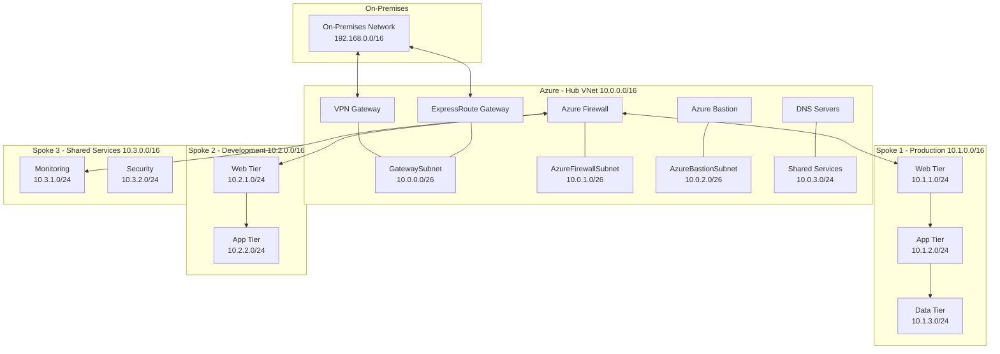
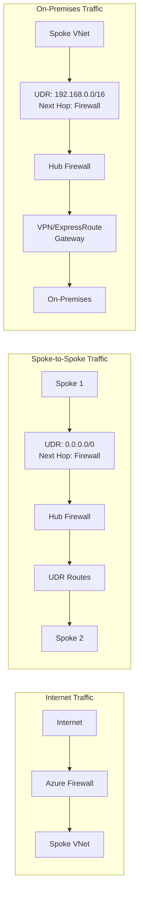
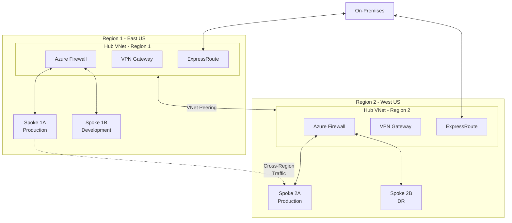
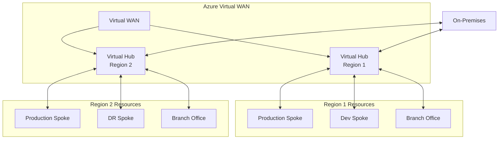

# Hub-Spoke Network Topology in Azure

**Author:** Randy Bordeaux  
**Date:** January 2026  
**Version:** 1.0  
**Azure Services:** Azure Virtual Network, Virtual Network Peering, Azure Firewall, VPN Gateway, ExpressRoute, Azure Route Server, Azure Virtual WAN

## Executive Summary

As organizations scale their Azure presence, managing network connectivity, security, and routing across multiple workloads becomes increasingly complex. Flat network architectures that served initial cloud migrations quickly become difficult to manage, insecure, and costly as the number of virtual networks grows. Traditional mesh peering approaches create exponential complexity and management overhead.

The hub-spoke network topology provides a scalable, secure, and cost-effective architecture pattern for Azure networking. By centralizing shared network services in a hub virtual network while isolating workloads in spoke virtual networks, organizations gain centralized security enforcement, simplified routing, reduced management overhead, and improved governance.

This whitepaper provides comprehensive guidance for designing, implementing, and operating hub-spoke network topologies in Azure. It covers architecture patterns, routing strategies, security integration, hybrid connectivity, and operational best practices. Organizations implementing hub-spoke architectures typically reduce network management overhead by 60%, improve security posture through centralized controls, and achieve 30-40% cost savings through shared services consolidation.

## Table of Contents

- [Executive Summary](#executive-summary)
- [Introduction](#introduction)
- [Problem Statement](#problem-statement)
- [Solution Overview](#solution-overview)
- [Technical Architecture](#technical-architecture)
- [Implementation Guide](#implementation-guide)
- [Best Practices](#best-practices)
- [Security Considerations](#security-considerations)
- [Cost Optimization](#cost-optimization)
- [Monitoring and Maintenance](#monitoring-and-maintenance)
- [Conclusion](#conclusion)
- [References](#references)
- [Appendices](#appendices)

## Introduction

### Background
Network topology design is a foundational decision that impacts security, performance, management complexity, and cost throughout the lifecycle of cloud infrastructure. As Azure environments grow from simple proof-of-concepts to production-scale deployments, the limitations of flat or mesh network architectures become apparent.

The hub-spoke topology has emerged as the recommended pattern for enterprise Azure deployments, endorsed by Microsoft's Azure Architecture Center and implemented by thousands of organizations worldwide.

### Scope
This whitepaper covers:
- Hub-spoke architecture principles and benefits
- Design patterns for single and multi-region deployments
- Virtual network peering configuration and optimization
- Routing strategies with Azure Firewall and NVAs
- Hybrid connectivity integration (ExpressRoute, VPN)
- Service chaining and traffic flow patterns
- Azure Virtual WAN as a managed alternative
- Migration strategies from existing topologies

### Target Audience
- Cloud architects designing Azure networking
- Network engineers implementing connectivity solutions
- Platform engineering teams building landing zones
- IT operations teams managing Azure infrastructure
- Enterprise architects planning cloud strategy

### Prerequisites
- Understanding of Azure Virtual Networks and subnets
- Familiarity with routing concepts (static routes, BGP)
- Knowledge of Azure networking services (VPN Gateway, ExpressRoute)
- Basic understanding of network security principles

## Problem Statement

### Current Challenges

**Mesh Network Complexity**
- Exponential growth in peering connections (n×(n-1)/2 formula)
- Difficult to implement consistent routing policies
- Network security rules must be replicated across VNets
- High management overhead as network grows
- Visibility and troubleshooting become increasingly difficult

**Lack of Centralized Security**
- Security controls must be deployed per virtual network
- Inconsistent policy enforcement across workloads
- No centralized traffic inspection point
- Difficulty implementing network-based threat detection
- Complex compliance auditing across distributed firewalls

**Inefficient Resource Utilization**
- Shared services duplicated in each virtual network
- Multiple VPN Gateways or ExpressRoute circuits
- Redundant firewall and security appliances
- Wasted capacity due to per-VNet sizing requirements

**Poor Network Segmentation**
- Difficulty isolating environments (prod, dev, test)
- Challenges implementing least-privilege network access
- Limited ability to enforce traffic flow patterns
- Compliance requirements difficult to demonstrate

**Hybrid Connectivity Challenges**
- Multiple connection points to on-premises networks
- Inconsistent routing and policy enforcement
- High cost of redundant gateway deployments
- Complex BGP configurations and routing tables

### Business Impact
- **Management Overhead:** Network teams spend 60-80% of time on repetitive configuration tasks
- **Security Risks:** Inconsistent policy enforcement leads to security gaps and compliance violations
- **Cost Overruns:** Duplicated services and inefficient resource utilization increase spending by 40-60%
- **Deployment Delays:** Complex networking slows application deployment by weeks or months
- **Operational Complexity:** Troubleshooting and incident response takes 3-5x longer in mesh topologies

## Solution Overview

The hub-spoke network topology addresses these challenges through a centralized architecture pattern that separates shared infrastructure from workload-specific resources.

### Key Benefits
- **Centralized Management:** Single point of control for security, routing, and connectivity
- **Simplified Security:** Centralized firewall and security controls with consistent policy enforcement
- **Cost Efficiency:** Shared services reduce infrastructure costs by 30-40%
- **Improved Scalability:** Linear scaling (n+1) instead of exponential (n×(n-1)/2)
- **Better Isolation:** Clear segmentation between environments and workloads
- **Simplified Compliance:** Centralized logging and policy enforcement

### Success Criteria
- Reduce network management time by 60% through centralization
- Achieve consistent security policy enforcement across all environments
- Reduce network infrastructure costs by 30-40% through shared services
- Enable new workload deployment in hours instead of weeks
- Maintain <2ms latency between spoke VNets through hub
- Achieve 99.99% availability for hub services

### Architecture Components

#### Component 1: Hub Virtual Network
- **Purpose:** Centralized infrastructure for shared services
- **Azure Service:** Azure Virtual Network
- **Configuration:** Contains Azure Firewall, VPN Gateway, ExpressRoute Gateway, Azure Bastion, DNS servers

#### Component 2: Spoke Virtual Networks
- **Purpose:** Isolated environments for specific workloads or applications
- **Azure Service:** Azure Virtual Network
- **Configuration:** Contains application resources, peered to hub, custom route tables pointing to hub firewall

#### Component 3: Virtual Network Peering
- **Purpose:** High-bandwidth, low-latency connectivity between hub and spokes
- **Azure Service:** VNet Peering
- **Configuration:** Hub-to-spoke and spoke-to-hub peering with gateway transit

#### Component 4: Azure Firewall
- **Purpose:** Centralized network security and traffic inspection
- **Azure Service:** Azure Firewall Premium
- **Configuration:** Deployed in hub, controls all north-south and east-west traffic

#### Component 5: VPN Gateway / ExpressRoute Gateway
- **Purpose:** Hybrid connectivity to on-premises networks
- **Azure Service:** VPN Gateway and/or ExpressRoute Gateway
- **Configuration:** Deployed in hub, shared across all spokes via gateway transit

## Technical Architecture

### Basic Hub-Spoke Architecture



### Traffic Flow Patterns



### Multi-Region Hub-Spoke Architecture



### Azure Virtual WAN Architecture (Alternative)



## Implementation Guide

### Prerequisites
- Azure subscription with Network Contributor access
- IP address planning completed (non-overlapping ranges)
- Security requirements documented
- Hybrid connectivity requirements identified
- Cost budget approved

### Step 1: Plan IP Address Space

```bash
# Recommended address space allocation:
# Hub VNet:          10.0.0.0/16
# Spoke 1 (Prod):    10.1.0.0/16
# Spoke 2 (Dev):     10.2.0.0/16
# Spoke 3 (Test):    10.3.0.0/16
# Spoke 4 (Shared):  10.4.0.0/16
# Additional spokes: 10.5.0.0/16 - 10.255.0.0/16

# Hub subnet allocation:
# GatewaySubnet:           10.0.0.0/26  (required name)
# AzureFirewallSubnet:     10.0.1.0/26  (required name)
# AzureBastionSubnet:      10.0.2.0/26  (required name)
# Shared Services:         10.0.3.0/24
# Management:              10.0.4.0/24
# Reserved for growth:     10.0.5.0/24 - 10.0.255.0/24
```

### Step 2: Deploy Hub Virtual Network

```bash
# Create resource group for hub
az group create \
  --name Hub-Network-RG \
  --location eastus

# Create hub virtual network
az network vnet create \
  --resource-group Hub-Network-RG \
  --name Hub-VNet \
  --location eastus \
  --address-prefix 10.0.0.0/16

# Create GatewaySubnet
az network vnet subnet create \
  --resource-group Hub-Network-RG \
  --vnet-name Hub-VNet \
  --name GatewaySubnet \
  --address-prefix 10.0.0.0/26

# Create AzureFirewallSubnet
az network vnet subnet create \
  --resource-group Hub-Network-RG \
  --vnet-name Hub-VNet \
  --name AzureFirewallSubnet \
  --address-prefix 10.0.1.0/26

# Create AzureBastionSubnet
az network vnet subnet create \
  --resource-group Hub-Network-RG \
  --vnet-name Hub-VNet \
  --name AzureBastionSubnet \
  --address-prefix 10.0.2.0/26

# Create Shared Services subnet
az network vnet subnet create \
  --resource-group Hub-Network-RG \
  --vnet-name Hub-VNet \
  --name SharedServices-Subnet \
  --address-prefix 10.0.3.0/24
```

### Step 3: Deploy Azure Firewall in Hub

```bash
# Create public IP for Azure Firewall
az network public-ip create \
  --resource-group Hub-Network-RG \
  --name AzFirewall-PIP \
  --location eastus \
  --sku Standard \
  --allocation-method Static

# Create Azure Firewall
az network firewall create \
  --resource-group Hub-Network-RG \
  --name Hub-AzFirewall \
  --location eastus \
  --tier Premium

# Configure Azure Firewall
az network firewall ip-config create \
  --firewall-name Hub-AzFirewall \
  --name FW-Config \
  --public-ip-address AzFirewall-PIP \
  --resource-group Hub-Network-RG \
  --vnet-name Hub-VNet

# Get firewall private IP for route tables
FW_PRIVATE_IP=$(az network firewall show \
  --resource-group Hub-Network-RG \
  --name Hub-AzFirewall \
  --query "ipConfigurations[0].privateIPAddress" \
  --output tsv)

echo "Firewall Private IP: $FW_PRIVATE_IP"
```

### Step 4: Deploy VPN Gateway (Optional)

```bash
# Create public IP for VPN Gateway
az network public-ip create \
  --resource-group Hub-Network-RG \
  --name VPNGateway-PIP \
  --location eastus \
  --sku Standard \
  --allocation-method Static

# Create VPN Gateway (takes 30-45 minutes)
az network vnet-gateway create \
  --resource-group Hub-Network-RG \
  --name Hub-VPN-Gateway \
  --location eastus \
  --vnet Hub-VNet \
  --gateway-type Vpn \
  --vpn-type RouteBased \
  --sku VpnGw2AZ \
  --public-ip-addresses VPNGateway-PIP \
  --no-wait

# Check deployment status
az network vnet-gateway show \
  --resource-group Hub-Network-RG \
  --name Hub-VPN-Gateway \
  --query "provisioningState"
```

### Step 5: Deploy Spoke Virtual Networks

```bash
# Create Production Spoke
az group create \
  --name Spoke-Production-RG \
  --location eastus

az network vnet create \
  --resource-group Spoke-Production-RG \
  --name Spoke-Production-VNet \
  --location eastus \
  --address-prefix 10.1.0.0/16

# Create subnets in production spoke
az network vnet subnet create \
  --resource-group Spoke-Production-RG \
  --vnet-name Spoke-Production-VNet \
  --name Web-Subnet \
  --address-prefix 10.1.1.0/24

az network vnet subnet create \
  --resource-group Spoke-Production-RG \
  --vnet-name Spoke-Production-VNet \
  --name App-Subnet \
  --address-prefix 10.1.2.0/24

az network vnet subnet create \
  --resource-group Spoke-Production-RG \
  --vnet-name Spoke-Production-VNet \
  --name Data-Subnet \
  --address-prefix 10.1.3.0/24

# Create Development Spoke
az group create \
  --name Spoke-Development-RG \
  --location eastus

az network vnet create \
  --resource-group Spoke-Development-RG \
  --name Spoke-Development-VNet \
  --location eastus \
  --address-prefix 10.2.0.0/16

az network vnet subnet create \
  --resource-group Spoke-Development-RG \
  --vnet-name Spoke-Development-VNet \
  --name Dev-Subnet \
  --address-prefix 10.2.1.0/24
```

### Step 6: Configure VNet Peering

```bash
# Get VNet IDs
HUB_VNET_ID=$(az network vnet show \
  --resource-group Hub-Network-RG \
  --name Hub-VNet \
  --query id --output tsv)

PROD_VNET_ID=$(az network vnet show \
  --resource-group Spoke-Production-RG \
  --name Spoke-Production-VNet \
  --query id --output tsv)

DEV_VNET_ID=$(az network vnet show \
  --resource-group Spoke-Development-RG \
  --name Spoke-Development-VNet \
  --query id --output tsv)

# Create hub-to-spoke peering (Production)
az network vnet peering create \
  --resource-group Hub-Network-RG \
  --name Hub-to-Prod \
  --vnet-name Hub-VNet \
  --remote-vnet $PROD_VNET_ID \
  --allow-vnet-access \
  --allow-forwarded-traffic \
  --allow-gateway-transit

# Create spoke-to-hub peering (Production)
az network vnet peering create \
  --resource-group Spoke-Production-RG \
  --name Prod-to-Hub \
  --vnet-name Spoke-Production-VNet \
  --remote-vnet $HUB_VNET_ID \
  --allow-vnet-access \
  --allow-forwarded-traffic \
  --use-remote-gateways

# Create hub-to-spoke peering (Development)
az network vnet peering create \
  --resource-group Hub-Network-RG \
  --name Hub-to-Dev \
  --vnet-name Hub-VNet \
  --remote-vnet $DEV_VNET_ID \
  --allow-vnet-access \
  --allow-forwarded-traffic \
  --allow-gateway-transit

# Create spoke-to-hub peering (Development)
az network vnet peering create \
  --resource-group Spoke-Development-RG \
  --name Dev-to-Hub \
  --vnet-name Spoke-Development-VNet \
  --remote-vnet $HUB_VNET_ID \
  --allow-vnet-access \
  --allow-forwarded-traffic \
  --use-remote-gateways
```

### Step 7: Configure Route Tables

```bash
# Create route table for spoke subnets
az network route-table create \
  --resource-group Hub-Network-RG \
  --name Spoke-RouteTable \
  --location eastus \
  --disable-bgp-route-propagation false

# Add default route to firewall
az network route-table route create \
  --resource-group Hub-Network-RG \
  --route-table-name Spoke-RouteTable \
  --name Default-to-Firewall \
  --address-prefix 0.0.0.0/0 \
  --next-hop-type VirtualAppliance \
  --next-hop-ip-address $FW_PRIVATE_IP

# Add route for other spokes through firewall
az network route-table route create \
  --resource-group Hub-Network-RG \
  --route-table-name Spoke-RouteTable \
  --name Spoke-to-Spoke \
  --address-prefix 10.0.0.0/8 \
  --next-hop-type VirtualAppliance \
  --next-hop-ip-address $FW_PRIVATE_IP

# Associate route table with production spoke subnets
az network vnet subnet update \
  --resource-group Spoke-Production-RG \
  --vnet-name Spoke-Production-VNet \
  --name Web-Subnet \
  --route-table Spoke-RouteTable

az network vnet subnet update \
  --resource-group Spoke-Production-RG \
  --vnet-name Spoke-Production-VNet \
  --name App-Subnet \
  --route-table Spoke-RouteTable

# Associate with development spoke
az network vnet subnet update \
  --resource-group Spoke-Development-RG \
  --vnet-name Spoke-Development-VNet \
  --name Dev-Subnet \
  --route-table Spoke-RouteTable
```

### Step 8: Configure Azure Firewall Rules

```bash
# Create firewall policy
az network firewall policy create \
  --resource-group Hub-Network-RG \
  --name Hub-Firewall-Policy \
  --sku Premium \
  --threat-intel-mode Alert

# Associate policy with firewall
az network firewall update \
  --resource-group Hub-Network-RG \
  --name Hub-AzFirewall \
  --firewall-policy Hub-Firewall-Policy

# Create rule collection group
az network firewall policy rule-collection-group create \
  --resource-group Hub-Network-RG \
  --policy-name Hub-Firewall-Policy \
  --name DefaultRules \
  --priority 100

# Allow spoke-to-spoke communication
az network firewall policy rule-collection-group collection add-filter-collection \
  --resource-group Hub-Network-RG \
  --policy-name Hub-Firewall-Policy \
  --rule-collection-group-name DefaultRules \
  --name Allow-Spoke-to-Spoke \
  --collection-priority 100 \
  --action Allow \
  --rule-name Prod-to-Dev \
  --rule-type NetworkRule \
  --ip-protocols Any \
  --source-addresses "10.1.0.0/16" \
  --destination-addresses "10.2.0.0/16" \
  --destination-ports "*"

# Allow internet access
az network firewall policy rule-collection-group collection add-filter-collection \
  --resource-group Hub-Network-RG \
  --policy-name Hub-Firewall-Policy \
  --rule-collection-group-name DefaultRules \
  --name Allow-Internet \
  --collection-priority 200 \
  --action Allow \
  --rule-name Allow-HTTPS \
  --rule-type ApplicationRule \
  --source-addresses "10.0.0.0/8" \
  --protocols "Https=443" \
  --target-fqdns "*"
```

## Best Practices

### Design Principles
1. **Centralize Shared Services:** Deploy common infrastructure (firewall, VPN, DNS) in hub only
2. **Isolate Workloads:** Use separate spoke VNets for different environments, applications, or business units
3. **Control Traffic Flow:** Route all traffic through hub firewall for inspection and policy enforcement
4. **Plan for Scale:** Design IP addressing to support growth (reserve /16 for hub, /16 per spoke)
5. **Use Gateway Transit:** Share VPN/ExpressRoute gateways across spokes to reduce cost

### IP Address Planning

#### Address Space Allocation Strategy
```plaintext
Enterprise Allocation (Regional):
├── Region 1: 10.0.0.0/12 (16 /16 networks)
│   ├── Hub: 10.0.0.0/16
│   └── Spokes: 10.1.0.0/16 - 10.15.0.0/16
├── Region 2: 10.16.0.0/12 (16 /16 networks)
│   ├── Hub: 10.16.0.0/16
│   └── Spokes: 10.17.0.0/16 - 10.31.0.0/16
└── Region 3: 10.32.0.0/12 (16 /16 networks)
    ├── Hub: 10.32.0.0/16
    └── Spokes: 10.33.0.0/16 - 10.47.0.0/16

Hub Subnet Allocation (10.0.0.0/16):
├── GatewaySubnet:        10.0.0.0/26   (64 IPs)
├── AzureFirewallSubnet:  10.0.1.0/26   (64 IPs)
├── AzureBastionSubnet:   10.0.2.0/26   (64 IPs)
├── Shared Services:      10.0.10.0/24  (256 IPs)
├── Management:           10.0.11.0/24  (256 IPs)
└── Reserved:             10.0.12.0/22  (1024 IPs for growth)
```

### VNet Peering Best Practices

#### Peering Configuration
- Always use bidirectional peering (hub-to-spoke AND spoke-to-hub)
- Enable `allow-gateway-transit` on hub peering
- Enable `use-remote-gateways` on spoke peering (after gateway deployment)
- Enable `allow-forwarded-traffic` on both sides
- Document peering relationships in network diagrams

#### Peering Limitations
- Maximum 500 peerings per VNet (plan accordingly)
- No transitive peering (spokes cannot directly communicate)
- Peering across subscriptions requires proper RBAC
- Global peering has bandwidth charges

### Routing Best Practices

#### User-Defined Routes (UDRs)
```bash
# Standard spoke route table pattern
0.0.0.0/0 → Firewall (default route)
10.0.0.0/8 → Firewall (other spokes)
192.168.0.0/16 → Firewall (on-premises via gateway)

# Do NOT add routes for:
# - Local VNet (automatic)
# - Hub VNet (learned via peering)
# - Internet via VNet Gateway (if BGP is used)
```

#### Route Table Optimization
- Create one route table, share across multiple spoke subnets
- Use service tags in NSG rules instead of UDRs where possible
- Avoid route table per subnet (increases management overhead)
- Document route table associations

### Multi-Region Design Patterns

#### Active-Active Multi-Region
```bash
# Independent hub-spoke per region
# VNet peering between regional hubs
# Global VNet peering for cross-region spoke communication
# ExpressRoute circuits in both regions for redundancy

Region 1 Hub (10.0.0.0/16) <--Peering--> Region 2 Hub (10.16.0.0/16)
       ↓                                          ↓
Spokes 10.1-15.x.x                        Spokes 10.17-31.x.x
```

#### Hub-of-Hubs (Centralized)
```bash
# Global hub in one region
# Regional hubs in other regions
# All regional hubs peer to global hub
# Centralized security and connectivity in global hub

        Global Hub (10.0.0.0/16)
              ↓           ↓
   Regional Hub 1   Regional Hub 2
   (10.16.0.0/16)   (10.32.0.0/16)
        ↓                 ↓
      Spokes           Spokes
```

### Azure Virtual WAN vs Traditional Hub-Spoke

| Factor | Traditional Hub-Spoke | Azure Virtual WAN |
|--------|----------------------|-------------------|
| Management | Manual configuration | Fully managed by Azure |
| Routing | User-defined routes | Automatic routing |
| Transit | Via firewall/NVA | Native any-to-any |
| Scaling | Manual peering | Automatic |
| Multi-region | Complex setup | Simplified with global WAN |
| Cost | Lower (DIY) | Higher (managed service) |
| Complexity | Higher | Lower |
| Control | Full control | Some limitations |
| Best For | <50 VNets, custom requirements | >50 VNets, simplified management |

### Performance Optimization

#### Latency Optimization
- Deploy hub in region with most spokes
- Use availability zones for hub services
- Enable accelerated networking on VMs
- Consider proximity placement groups for latency-sensitive apps

#### Bandwidth Optimization
- Use ExpressRoute for high-bandwidth hybrid connectivity
- Deploy Azure Firewall in multiple availability zones
- Monitor firewall throughput and scale appropriately
- Use multiple firewall instances for very high throughput (>100 Gbps)

#### Firewall Performance
```bash
# Monitor firewall metrics
az monitor metrics list \
  --resource /subscriptions/{sub}/resourceGroups/Hub-Network-RG/providers/Microsoft.Network/azureFirewalls/Hub-AzFirewall \
  --metric "Throughput" \
  --start-time 2026-01-01T00:00:00Z \
  --end-time 2026-01-17T23:59:59Z \
  --interval PT1H

# Throughput limits by SKU:
# Standard: 30 Gbps
# Premium: 100 Gbps
```

## Security Considerations

### Identity and Access Management

#### RBAC for Hub-Spoke
- **Hub Network:** Restrict to network team with Network Contributor role
- **Spoke Networks:** Application teams with limited network permissions
- **Firewall Policy:** Security team only
- **Route Tables:** Centralized management by network team

#### Resource Locks
```bash
# Prevent accidental deletion of hub resources
az lock create \
  --name "DoNotDelete-Hub" \
  --resource-group Hub-Network-RG \
  --lock-type CanNotDelete

# Lock firewall configuration
az lock create \
  --name "DoNotDelete-Firewall" \
  --resource-group Hub-Network-RG \
  --resource-name Hub-AzFirewall \
  --resource-type Microsoft.Network/azureFirewalls \
  --lock-type CanNotDelete
```

### Network Security

#### Traffic Inspection
- Route all north-south traffic through Azure Firewall
- Inspect spoke-to-spoke (east-west) traffic
- Enable IDPS on Azure Firewall Premium
- Configure TLS inspection for encrypted traffic

#### NSG Strategy
- Apply NSGs at subnet level in spokes
- Use Azure Firewall for centralized policy
- NSGs provide defense-in-depth
- Enable NSG flow logs for all spoke subnets

#### Secure Hybrid Connectivity
```bash
# Configure forced tunneling on VPN Gateway
az network vnet-gateway update \
  --resource-group Hub-Network-RG \
  --name Hub-VPN-Gateway \
  --enable-bgp true

# Configure BGP for ExpressRoute
az network vnet-gateway update \
  --resource-group Hub-Network-RG \
  --name Hub-ER-Gateway \
  --enable-bgp true \
  --asn 65001
```

### Data Protection

#### Encryption
- VNet peering traffic is automatically encrypted
- Enable ExpressRoute encryption for additional security
- Use VPN tunnels with strong encryption (AES-256)

#### Network Isolation
- No direct spoke-to-spoke connectivity (transitive routing blocked)
- All inter-spoke traffic inspected by firewall
- Private endpoints for PaaS services in spokes
- Azure Bastion for secure VM access

### Compliance

#### Audit and Logging
```bash
# Enable diagnostic settings on hub VNet
az monitor diagnostic-settings create \
  --name Hub-VNet-Diagnostics \
  --resource /subscriptions/{sub}/resourceGroups/Hub-Network-RG/providers/Microsoft.Network/virtualNetworks/Hub-VNet \
  --workspace {workspace-id} \
  --metrics '[{"category": "AllMetrics", "enabled": true}]'

# Enable firewall diagnostics
az monitor diagnostic-settings create \
  --name Firewall-Diagnostics \
  --resource /subscriptions/{sub}/resourceGroups/Hub-Network-RG/providers/Microsoft.Network/azureFirewalls/Hub-AzFirewall \
  --workspace {workspace-id} \
  --logs '[
    {"category": "AzureFirewallApplicationRule", "enabled": true},
    {"category": "AzureFirewallNetworkRule", "enabled": true}
  ]'
```

#### Azure Policy for Governance
```bash
# Enforce hub-spoke peering
# Require route tables on spoke subnets
# Prevent VNet peering to external subscriptions
# Audit VNets not peered to hub

az policy assignment create \
  --name "Enforce-HubSpoke-Topology" \
  --display-name "Enforce Hub-Spoke Network Topology" \
  --scope /subscriptions/{subscription-id} \
  --policy-set-definition "/providers/Microsoft.Authorization/policySetDefinitions/network-topology-governance"
```

## Cost Optimization

### Cost Factors

**VNet Peering**
- Free within same region
- Global peering (cross-region): $0.01/GB ingress + $0.01/GB egress

**Azure Firewall**
- Deployment: $1.25/hour (Premium)
- Data processing: $0.016/GB

**VPN Gateway**
- VpnGw1: $0.14/hour (~$100/month)
- VpnGw2AZ: $0.59/hour (~$425/month)
- VpnGw3AZ: $1.37/hour (~$987/month)

**ExpressRoute Gateway**
- Standard: $0.26/hour (~$187/month)
- High Performance: $0.52/hour (~$375/month)
- Ultra Performance: $1.35/hour (~$973/month)

### Optimization Strategies

#### 1. Consolidate Gateways
```bash
# Single VPN Gateway shared across all spokes
# Savings: ($425/month per gateway) × (number of spokes - 1)
# Example: 5 spokes = $1,700/month savings

# Use gateway transit in peering configuration
--allow-gateway-transit  # On hub peering
--use-remote-gateways    # On spoke peering
```

#### 2. Right-Size Azure Firewall
```bash
# Use Standard tier for dev/test environments
# Estimated savings: ~$0.50/hour = $360/month per firewall

# Dev/Test firewall
az network firewall create \
  --resource-group Dev-Hub-RG \
  --name Dev-Hub-Firewall \
  --tier Standard  # vs Premium

# Consider single firewall for multiple non-production environments
```

#### 3. Optimize Cross-Region Traffic
- Minimize global VNet peering (charged per GB)
- Use Azure Front Door or Traffic Manager for global load balancing
- Cache content closer to users with Azure CDN
- Evaluate if cross-region spoke communication is necessary

#### 4. Shared Services Consolidation
- Deploy shared services once in hub (DNS, monitoring, Active Directory)
- Use private endpoints for PaaS services
- Centralize backup and disaster recovery infrastructure

#### 5. Azure Virtual WAN Considerations
```bash
# Virtual WAN pricing:
# Virtual Hub: $0.25/hour per hub (~$180/month)
# Routing Infrastructure Unit: $0.035/hour (~$25/month)
# VNet connections: $0.02/hour per connection (~$14.40/month)

# Traditional hub-spoke may be cheaper for <20 spokes
# Virtual WAN more cost-effective at scale (>50 spokes)
```

### Cost Monitoring

#### Track Network Costs by Resource Group
```kusto
// Cost Management query
AzureConsumption
| where TimeGenerated > ago(30d)
| where ResourceGroup in ("Hub-Network-RG", "Spoke-Production-RG", "Spoke-Development-RG")
| summarize TotalCost = sum(Cost) by ResourceGroup, MeterCategory
| order by TotalCost desc
```

#### Set Budget Alerts
```bash
# Create budget for hub resources
az consumption budget create \
  --budget-name "Hub-Network-Budget" \
  --amount 2000 \
  --time-grain Monthly \
  --resource-group Hub-Network-RG \
  --notifications \
    'threshold=80,contactEmails=["netops@company.com"]' \
    'threshold=100,contactEmails=["netops@company.com","finance@company.com"]'
```

## Monitoring and Maintenance

### Key Metrics

#### VNet Peering Metrics
- **Peering Status:** Connected vs. Disconnected
- **Bytes Sent/Received:** Throughput per peering
- **Packets Dropped:** Indication of issues

#### Azure Firewall Metrics
- **Throughput:** Current data processing rate (Gbps)
- **Application Rules Hit:** Number of L7 rules matched
- **Network Rules Hit:** Number of L4 rules matched
- **Health State:** Overall firewall availability
- **SNAT Port Utilization:** Percentage of SNAT ports used

#### VPN Gateway Metrics
- **Bandwidth:** Current throughput
- **Tunnel Egress/Ingress:** Data transferred
- **BGP Peer Status:** Routing protocol health
- **Packet Drop Rate:** Connection quality

### Alerting

#### Critical Hub Infrastructure Alerts
```bash
# Alert on peering failure
az monitor metrics alert create \
  --name "VNet-Peering-Disconnected" \
  --resource-group Hub-Network-RG \
  --scopes /subscriptions/{sub}/resourceGroups/Hub-Network-RG/providers/Microsoft.Network/virtualNetworks/Hub-VNet/virtualNetworkPeerings/Hub-to-Prod \
  --condition "avg PeeringStatus < 1" \
  --window-size 5m \
  --evaluation-frequency 1m \
  --severity 0

# Alert on firewall health
az monitor metrics alert create \
  --name "Firewall-Health-Critical" \
  --resource-group Hub-Network-RG \
  --scopes /subscriptions/{sub}/resourceGroups/Hub-Network-RG/providers/Microsoft.Network/azureFirewalls/Hub-AzFirewall \
  --condition "avg FirewallHealth < 90" \
  --window-size 5m \
  --severity 0

# Alert on VPN Gateway downtime
az monitor metrics alert create \
  --name "VPN-Gateway-Down" \
  --resource-group Hub-Network-RG \
  --scopes /subscriptions/{sub}/resourceGroups/Hub-Network-RG/providers/Microsoft.Network/virtualNetworkGateways/Hub-VPN-Gateway \
  --condition "avg TunnelIngressBytes == 0 and TunnelEgressBytes == 0" \
  --window-size 15m \
  --severity 1
```

#### Network Performance Alerts
```kusto
// Alert on high latency between hub and spoke
NetworkIpFlow
| where TimeGenerated > ago(5m)
| where SourceVnet == "Hub-VNet" and DestinationVnet startswith "Spoke-"
| summarize AvgLatency = avg(LatencyMs) by DestinationVnet
| where AvgLatency > 50
| project DestinationVnet, AvgLatency, AlertMessage = "High latency detected"
```

### Maintenance Tasks

#### Daily
- Review firewall rule hits and blocked traffic
- Monitor peering status across all spokes
- Check gateway connectivity and VPN tunnel status
- Review security alerts and incidents

#### Weekly
- Analyze traffic patterns and bandwidth utilization
- Review route table effectiveness
- Check for asymmetric routing issues
- Update firewall rules based on application needs
- Verify backup and DR procedures

#### Monthly
- Audit spoke VNet deployments and peering configuration
- Review and optimize firewall rules
- Capacity planning for hub services
- Cost analysis and optimization review
- Update network documentation
- Test failover procedures for hybrid connectivity

#### Quarterly
- Comprehensive security architecture review
- IP address space utilization assessment
- Disaster recovery testing
- Review and update network standards
- Training for network operations team
- Evaluate new Azure networking features

### Troubleshooting

#### Connectivity Issues Between Spokes

**Symptom:** Cannot reach resources in another spoke VNet

**Diagnostic Steps:**
```bash
# 1. Verify peering status
az network vnet peering list \
  --resource-group Hub-Network-RG \
  --vnet-name Hub-VNet \
  --query "[].{Name:name, Status:peeringState}" \
  --output table

# 2. Check route tables
az network route-table route list \
  --resource-group Hub-Network-RG \
  --route-table-name Spoke-RouteTable \
  --output table

# 3. Verify firewall rules allow traffic
az network firewall policy rule-collection-group collection list \
  --resource-group Hub-Network-RG \
  --policy-name Hub-Firewall-Policy \
  --rule-collection-group-name DefaultRules

# 4. Test connectivity through firewall
az network watcher test-connectivity \
  --resource-group Spoke-Production-RG \
  --source-resource web-vm-01 \
  --dest-address 10.2.1.4 \
  --dest-port 443
```

**Common Causes:**
1. Missing or incorrect UDR pointing to firewall
2. Firewall rules blocking traffic
3. NSG rules blocking traffic in source or destination
4. Peering not configured with `allow-forwarded-traffic`

#### Gateway Transit Not Working

**Symptom:** Spokes cannot reach on-premises through hub gateway

**Resolution:**
```bash
# Verify gateway transit settings on hub peering
az network vnet peering show \
  --resource-group Hub-Network-RG \
  --vnet-name Hub-VNet \
  --name Hub-to-Prod \
  --query "{AllowGatewayTransit:allowGatewayTransit, UseRemoteGateways:useRemoteGateways}"

# Should show: AllowGatewayTransit: true, UseRemoteGateways: false (on hub side)

# Verify spoke peering settings
az network vnet peering show \
  --resource-group Spoke-Production-RG \
  --vnet-name Spoke-Production-VNet \
  --name Prod-to-Hub \
  --query "{AllowGatewayTransit:allowGatewayTransit, UseRemoteGateways:useRemoteGateways}"

# Should show: AllowGatewayTransit: false, UseRemoteGateways: true (on spoke side)

# Update if incorrect
az network vnet peering update \
  --resource-group Spoke-Production-RG \
  --vnet-name Spoke-Production-VNet \
  --name Prod-to-Hub \
  --set useRemoteGateways=true
```

#### Asymmetric Routing

**Symptom:** Traffic flows one direction but not the other

**Diagnosis:**
```kusto
// Check firewall logs for asymmetric routing
AzureDiagnostics
| where ResourceType == "AZUREFIREWALLS"
| where msg_s contains "TCP packet from" and msg_s contains "to" 
| extend Direction = iff(msg_s contains "Egress", "Outbound", "Inbound")
| summarize count() by Direction, bin(TimeGenerated, 5m)
| render timechart
```

**Resolution:**
- Ensure UDRs are configured on both source and destination subnets
- Verify firewall has routes back to both spoke VNets
- Check for conflicting routes in route tables

#### High Firewall Latency

**Symptom:** Increased latency through hub

**Investigation:**
```bash
# Check firewall throughput
az monitor metrics list \
  --resource /subscriptions/{sub}/resourceGroups/Hub-Network-RG/providers/Microsoft.Network/azureFirewalls/Hub-AzFirewall \
  --metric "Throughput" \
  --aggregation Average \
  --interval PT5M

# Check SNAT port exhaustion
az monitor metrics list \
  --resource /subscriptions/{sub}/resourceGroups/Hub-Network-RG/providers/Microsoft.Network/azureFirewalls/Hub-AzFirewall \
  --metric "SNATPortUtilization" \
  --aggregation Average
```

**Resolution:**
- Scale up firewall SKU if approaching throughput limits
- Optimize firewall rules (remove unused rules, consolidate rules)
- Consider multiple firewall instances for very high throughput
- Use ExpressRoute for high-bandwidth workloads

## Conclusion

The hub-spoke network topology provides a proven, scalable architecture pattern for enterprise Azure deployments. By centralizing shared network services in a hub virtual network while isolating workloads in spoke virtual networks, organizations achieve better security, reduced complexity, and significant cost savings compared to alternative topologies.

### Key Takeaways
- **Hub-spoke reduces network management overhead by 60%** through centralized services and simplified routing
- **Centralized security enforcement** via Azure Firewall provides consistent policy across all workloads
- **Gateway transit** enables 30-40% cost savings by sharing VPN/ExpressRoute across all spokes
- **Linear scaling** (n+1 peerings) is dramatically simpler than mesh topology (n×(n-1)/2)
- **Clear isolation** between environments and workloads improves security posture and compliance
- **Azure Virtual WAN** offers a fully managed alternative for very large deployments (>50 spokes)

### Next Steps
1. Document current network topology and identify pain points
2. Design IP address space with growth in mind
3. Create hub virtual network with required subnets
4. Deploy Azure Firewall and configure basic rule sets
5. Deploy VPN Gateway or ExpressRoute Gateway for hybrid connectivity
6. Create first spoke VNet and configure peering
7. Implement route tables to direct traffic through firewall
8. Test connectivity between spoke, hub, and on-premises
9. Migrate existing workloads to new spoke VNets
10. Document architecture and operational procedures
11. Train operations team on hub-spoke management
12. Implement monitoring and alerting for hub infrastructure

## References

1. [Hub-spoke network topology in Azure](https://docs.microsoft.com/azure/architecture/reference-architectures/hybrid-networking/hub-spoke)
2. [Virtual Network Peering](https://docs.microsoft.com/azure/virtual-network/virtual-network-peering-overview)
3. [Azure Firewall Architecture Guide](https://docs.microsoft.com/azure/firewall/firewall-architecture-guide)
4. [VPN Gateway Documentation](https://docs.microsoft.com/azure/vpn-gateway/)
5. [ExpressRoute Documentation](https://docs.microsoft.com/azure/expressroute/)
6. [Azure Virtual WAN Documentation](https://docs.microsoft.com/azure/virtual-wan/)
7. [Azure Architecture Center - Networking](https://docs.microsoft.com/azure/architecture/networking/)

## Appendices

### Appendix A: Hub-Spoke vs Other Topologies

| Topology | Peering Connections | Management Complexity | Security | Cost | Best For |
|----------|-------------------|---------------------|----------|------|----------|
| Flat (Single VNet) | 0 | Low | Poor isolation | Low | POC, small apps |
| Mesh | n×(n-1)/2 | Very High | Decentralized | High | <5 VNets only |
| Hub-Spoke | n+1 | Low-Medium | Centralized | Medium | Most enterprises |
| Virtual WAN | Managed | Very Low | Centralized | Medium-High | >50 VNets, global |
| Multi-Hub | 2n+1 | Medium | Centralized | Medium-High | Multi-region |

**Example Peering Count:**
- 10 VNets in mesh: 10×9/2 = 45 peerings
- 10 VNets in hub-spoke: 10+1 = 11 peerings (82% reduction)

### Appendix B: Sample IP Address Plan Template

```markdown
# Enterprise IP Address Plan

## Summary
- Total Address Space: 10.0.0.0/8
- Regions: 3
- Estimated Spokes per Region: 50
- Reserved Growth: 30%

## Regional Allocation

### Region 1: East US (10.0.0.0/12)
- Hub VNet: 10.0.0.0/16
  - GatewaySubnet: 10.0.0.0/26
  - AzureFirewallSubnet: 10.0.1.0/26
  - AzureBastionSubnet: 10.0.2.0/26
  - Shared-Services-Subnet: 10.0.10.0/24
  - Management-Subnet: 10.0.11.0/24

- Spoke VNets: 10.1.0.0/16 through 10.15.0.0/16
  - Spoke-Production-Web: 10.1.0.0/16
  - Spoke-Production-App: 10.2.0.0/16
  - Spoke-Production-Data: 10.3.0.0/16
  - Spoke-Development: 10.4.0.0/16
  - Spoke-Test: 10.5.0.0/16
  - Spoke-Shared-Services: 10.6.0.0/16
  - Reserved: 10.7.0.0/16 - 10.15.0.0/16

### Region 2: West Europe (10.16.0.0/12)
- Hub VNet: 10.16.0.0/16
- Spoke VNets: 10.17.0.0/16 through 10.31.0.0/16

### Region 3: Southeast Asia (10.32.0.0/12)
- Hub VNet: 10.32.0.0/16
- Spoke VNets: 10.33.0.0/16 through 10.47.0.0/16

## On-Premises Networks
- Corporate HQ: 192.168.0.0/16
- Branch Offices: 172.16.0.0/12
```

### Appendix C: PowerShell Deployment Script

```powershell
# Hub-Spoke Deployment Script
# Run with appropriate Azure subscription context

# Variables
$location = "eastus"
$hubRG = "Hub-Network-RG"
$hubVNetName = "Hub-VNet"
$hubVNetPrefix = "10.0.0.0/16"
$fwSubnetPrefix = "10.0.1.0/26"
$fwName = "Hub-AzFirewall"

# Create Hub Resource Group
New-AzResourceGroup -Name $hubRG -Location $location

# Create Hub VNet
$hubVNet = New-AzVirtualNetwork `
    -ResourceGroupName $hubRG `
    -Location $location `
    -Name $hubVNetName `
    -AddressPrefix $hubVNetPrefix

# Add Azure Firewall Subnet
Add-AzVirtualNetworkSubnetConfig `
    -Name "AzureFirewallSubnet" `
    -VirtualNetwork $hubVNet `
    -AddressPrefix $fwSubnetPrefix | Set-AzVirtualNetwork

# Create Public IP for Firewall
$fwPip = New-AzPublicIpAddress `
    -ResourceGroupName $hubRG `
    -Location $location `
    -Name "$fwName-PIP" `
    -AllocationMethod Static `
    -Sku Standard

# Create Azure Firewall
$fw = New-AzFirewall `
    -Name $fwName `
    -ResourceGroupName $hubRG `
    -Location $location `
    -VirtualNetwork $hubVNet `
    -PublicIpAddress $fwPip

Write-Host "Hub infrastructure deployed successfully"
Write-Host "Firewall Private IP: $($fw.IpConfigurations[0].PrivateIPAddress)"
```

### Appendix D: Terraform Example

```hcl
# Hub Virtual Network
resource "azurerm_virtual_network" "hub" {
  name                = "hub-vnet"
  location            = var.location
  resource_group_name = azurerm_resource_group.hub.name
  address_space       = ["10.0.0.0/16"]
}

# Azure Firewall Subnet
resource "azurerm_subnet" "firewall" {
  name                 = "AzureFirewallSubnet"
  resource_group_name  = azurerm_resource_group.hub.name
  virtual_network_name = azurerm_virtual_network.hub.name
  address_prefixes     = ["10.0.1.0/26"]
}

# Public IP for Firewall
resource "azurerm_public_ip" "firewall" {
  name                = "hub-firewall-pip"
  location            = var.location
  resource_group_name = azurerm_resource_group.hub.name
  allocation_method   = "Static"
  sku                 = "Standard"
}

# Azure Firewall
resource "azurerm_firewall" "hub" {
  name                = "hub-firewall"
  location            = var.location
  resource_group_name = azurerm_resource_group.hub.name
  sku_name            = "AZFW_VNet"
  sku_tier            = "Premium"

  ip_configuration {
    name                 = "configuration"
    subnet_id            = azurerm_subnet.firewall.id
    public_ip_address_id = azurerm_public_ip.firewall.id
  }
}

# Spoke Virtual Network
resource "azurerm_virtual_network" "spoke_prod" {
  name                = "spoke-production-vnet"
  location            = var.location
  resource_group_name = azurerm_resource_group.spoke_prod.name
  address_space       = ["10.1.0.0/16"]
}

# VNet Peering: Hub to Spoke
resource "azurerm_virtual_network_peering" "hub_to_spoke" {
  name                         = "hub-to-prod"
  resource_group_name          = azurerm_resource_group.hub.name
  virtual_network_name         = azurerm_virtual_network.hub.name
  remote_virtual_network_id    = azurerm_virtual_network.spoke_prod.id
  allow_forwarded_traffic      = true
  allow_gateway_transit        = true
  allow_virtual_network_access = true
}

# VNet Peering: Spoke to Hub
resource "azurerm_virtual_network_peering" "spoke_to_hub" {
  name                         = "prod-to-hub"
  resource_group_name          = azurerm_resource_group.spoke_prod.name
  virtual_network_name         = azurerm_virtual_network.spoke_prod.name
  remote_virtual_network_id    = azurerm_virtual_network.hub.id
  allow_forwarded_traffic      = true
  use_remote_gateways          = false  # Set to true after gateway deployed
  allow_virtual_network_access = true
}

# Route Table for Spoke
resource "azurerm_route_table" "spoke" {
  name                = "spoke-route-table"
  location            = var.location
  resource_group_name = azurerm_resource_group.hub.name

  route {
    name                   = "default-via-firewall"
    address_prefix         = "0.0.0.0/0"
    next_hop_type          = "VirtualAppliance"
    next_hop_in_ip_address = azurerm_firewall.hub.ip_configuration[0].private_ip_address
  }

  route {
    name                   = "spokes-via-firewall"
    address_prefix         = "10.0.0.0/8"
    next_hop_type          = "VirtualAppliance"
    next_hop_in_ip_address = azurerm_firewall.hub.ip_configuration[0].private_ip_address
  }
}
```

---

**Disclaimer:** This whitepaper is provided for informational purposes only. No warranties, express or implied, are made with respect to the information provided here.

**Last Updated:** January 2026  
**Review Schedule:** July 2026
