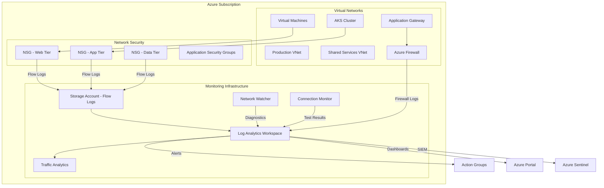
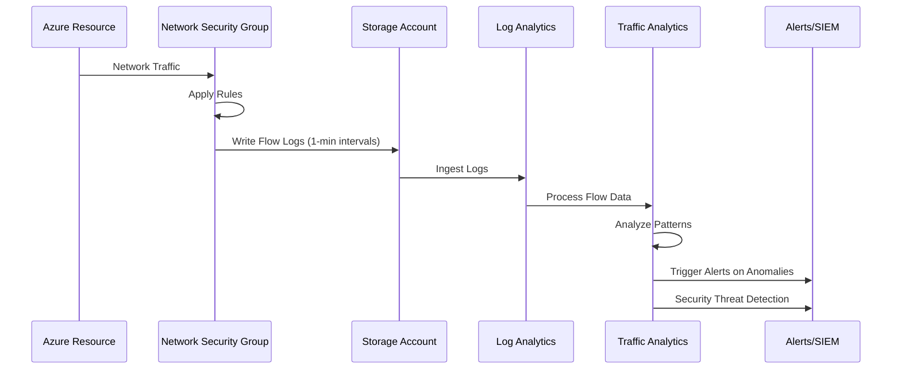
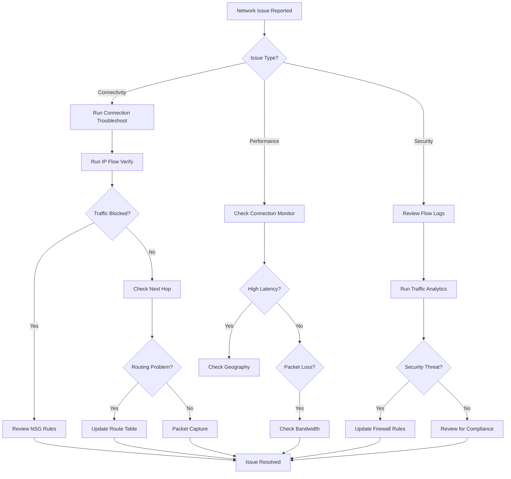

# Network Monitoring and Troubleshooting in Azure

**Author:** Randy Bordeaux  
**Date:** January 2026  
**Version:** 1.0  
**Azure Services:** Azure Network Watcher, Azure Monitor, Log Analytics, Connection Monitor, Traffic Analytics, NSG Flow Logs, Azure Firewall Analytics

## Executive Summary

Network visibility and troubleshooting capabilities are critical for maintaining reliable, secure, and performant cloud infrastructure. In complex Azure environments, traditional network troubleshooting approaches are insufficient due to the distributed nature of cloud resources, multiple layers of abstraction, and dynamic scaling behaviors.

Azure provides a comprehensive suite of network monitoring and diagnostic tools that enable proactive monitoring, rapid issue identification, and efficient troubleshooting. Network Watcher, combined with Azure Monitor and Log Analytics, delivers deep visibility into network traffic patterns, connectivity issues, and security posture.

This whitepaper provides practical guidance for implementing network monitoring and troubleshooting strategies in Azure, covering architecture design, tool selection, diagnostic workflows, and best practices. Organizations following these recommendations typically reduce mean time to resolution (MTTR) by 60-70% while improving network reliability and security posture.

## Table of Contents

- [Executive Summary](#executive-summary)
- [Introduction](#introduction)
- [Problem Statement](#problem-statement)
- [Solution Overview](#solution-overview)
- [Technical Architecture](#technical-architecture)
- [Implementation Guide](#implementation-guide)
- [Best Practices](#best-practices)
- [Security Considerations](#security-considerations)
- [Cost Optimization](#cost-optimization)
- [Monitoring and Maintenance](#monitoring-and-maintenance)
- [Conclusion](#conclusion)
- [References](#references)
- [Appendices](#appendices)

## Introduction

### Background
As organizations migrate workloads to Azure, network complexity increases significantly. Virtual networks, subnets, network security groups, load balancers, application gateways, and hybrid connectivity create intricate network topologies that require sophisticated monitoring and troubleshooting capabilities.

Traditional on-premises network monitoring tools are inadequate for cloud environments due to:
- Lack of visibility into Azure's software-defined networking layer
- Inability to monitor dynamic, auto-scaling resources
- Limited integration with Azure-native security and compliance tools

### Scope
This whitepaper covers:
- Azure Network Watcher capabilities and use cases
- Network monitoring architecture and configuration
- Diagnostic tools and troubleshooting workflows
- Performance monitoring and optimization
- Security monitoring and threat detection
- Cost-effective logging and retention strategies

### Target Audience
- Network engineers and architects
- Cloud operations teams
- Security operations center (SOC) analysts
- DevOps and platform engineering teams
- IT administrators managing hybrid environments

### Prerequisites
- Azure subscription with network resources deployed
- Understanding of Azure networking concepts (VNets, NSGs, routing)
- Familiarity with Azure Monitor and Log Analytics
- Basic knowledge of network protocols and troubleshooting

## Problem Statement

### Current Challenges

**Lack of Network Visibility**
- Inability to see traffic flows between Azure resources
- No insight into blocked traffic or NSG rule effectiveness
- Difficulty identifying network bottlenecks and latency issues

**Connectivity Troubleshooting**
- Complex routing paths through multiple network layers
- Intermittent connectivity issues difficult to reproduce
- Limited tools for validating end-to-end connectivity

**Security Monitoring**
- Insufficient visibility into malicious traffic patterns
- Difficulty correlating network events with security incidents
- Manual analysis of NSG logs is time-consuming and error-prone

**Performance Issues**
- Difficulty identifying causes of application latency
- Limited visibility into packet loss and network congestion
- No proactive alerting for network performance degradation

**Compliance and Auditing**
- Incomplete network traffic logs for compliance requirements
- Manual effort required for network security audits
- Lack of centralized network activity reporting

### Business Impact
- **Increased Downtime:** Network issues take 3-5x longer to resolve without proper tooling
- **Security Risks:** Undetected network threats and compliance violations
- **Productivity Loss:** Teams spend 40-60% of time on reactive troubleshooting
- **Cost Overruns:** Over-provisioning to compensate for lack of performance visibility
- **Compliance Failures:** Inability to meet regulatory logging and monitoring requirements

## Solution Overview

Azure provides integrated network monitoring and diagnostic capabilities that address these challenges through a combination of tools and services.

### Key Benefits
- **Comprehensive Visibility:** Full traffic flow analysis across all Azure network resources
- **Rapid Diagnostics:** Automated tools reduce troubleshooting time by 60-70%
- **Proactive Monitoring:** Real-time alerts prevent issues before they impact users
- **Security Integration:** Native integration with Azure Sentinel and Defender
- **Cost-Effective:** Pay-per-use pricing with flexible retention policies
- **Compliance Support:** Built-in logging meets regulatory requirements

### Success Criteria
- Reduce mean time to resolution (MTTR) for network issues by 60%
- Achieve 99.9% network availability through proactive monitoring
- Detect and alert on security threats within 5 minutes
- Maintain complete network traffic logs for compliance
- Reduce manual troubleshooting effort by 50%

### Core Components

#### Component 1: Azure Network Watcher
- **Purpose:** Primary network diagnostic and monitoring service
- **Azure Service:** Network Watcher
- **Configuration:** Enabled per region with diagnostic capabilities including IP flow verify, next hop, connection troubleshoot, packet capture, and VPN diagnostics

#### Component 2: NSG Flow Logs
- **Purpose:** Capture network traffic flow information through NSGs
- **Azure Service:** Network Security Group Flow Logs v2
- **Configuration:** Enabled on critical NSGs with storage to Log Analytics workspace for analysis

#### Component 3: Traffic Analytics
- **Purpose:** Analyze network traffic patterns and identify security threats
- **Azure Service:** Traffic Analytics (powered by Network Watcher)
- **Configuration:** Processes NSG flow logs to provide insights on traffic patterns, top talkers, blocked traffic, and geo-distribution

#### Component 4: Connection Monitor
- **Purpose:** Continuous monitoring of connectivity and latency
- **Azure Service:** Network Watcher Connection Monitor
- **Configuration:** Tests configured between critical endpoints with alerting thresholds

#### Component 5: Azure Monitor and Log Analytics
- **Purpose:** Centralized logging, analysis, and alerting platform
- **Azure Service:** Azure Monitor with Log Analytics workspace
- **Configuration:** Aggregates network logs, metrics, and diagnostics for unified analysis

## Technical Architecture

### Architecture Overview



### Network Monitoring Data Flow



## Implementation Guide

### Prerequisites
- Azure subscription with Contributor or Network Contributor access
- Virtual networks and resources already deployed
- Log Analytics workspace created
- Storage account for flow logs (General Purpose v2, Standard tier)

### Step 1: Enable Network Watcher

Network Watcher is enabled per region and subscription.

```bash
# List available regions
az account list-locations --query "[].name" --output table

# Enable Network Watcher for a region
az network watcher configure \
  --resource-group NetworkWatcherRG \
  --locations eastus westus centralus \
  --enabled true

# Verify Network Watcher is enabled
az network watcher list --output table
```

### Step 2: Create Log Analytics Workspace

```bash
# Create resource group for monitoring
az group create \
  --name NetworkMonitoring-RG \
  --location eastus

# Create Log Analytics workspace
az monitor log-analytics workspace create \
  --resource-group NetworkMonitoring-RG \
  --workspace-name network-monitoring-workspace \
  --location eastus \
  --sku PerGB2018

# Get workspace ID for later use
WORKSPACE_ID=$(az monitor log-analytics workspace show \
  --resource-group NetworkMonitoring-RG \
  --workspace-name network-monitoring-workspace \
  --query id --output tsv)
```

### Step 3: Create Storage Account for Flow Logs

```bash
# Create storage account
az storage account create \
  --name netflowlogs$RANDOM \
  --resource-group NetworkMonitoring-RG \
  --location eastus \
  --sku Standard_LRS \
  --kind StorageV2

# Enable encryption and secure transfer
az storage account update \
  --name netflowlogs$RANDOM \
  --resource-group NetworkMonitoring-RG \
  --https-only true \
  --min-tls-version TLS1_2
```

### Step 4: Enable NSG Flow Logs

```bash
# Get NSG resource ID
NSG_ID=$(az network nsg show \
  --resource-group Production-RG \
  --name web-tier-nsg \
  --query id --output tsv)

# Get storage account ID
STORAGE_ID=$(az storage account show \
  --name netflowlogs$RANDOM \
  --resource-group NetworkMonitoring-RG \
  --query id --output tsv)

# Enable NSG Flow Logs v2 with Traffic Analytics
az network watcher flow-log create \
  --location eastus \
  --name web-tier-flow-logs \
  --nsg $NSG_ID \
  --storage-account $STORAGE_ID \
  --workspace $WORKSPACE_ID \
  --interval 10 \
  --traffic-analytics true \
  --retention 30 \
  --format JSON \
  --log-version 2 \
  --enabled true
```

### Step 5: Configure Traffic Analytics

Traffic Analytics is configured when enabling flow logs with the `--traffic-analytics true` flag. Additional configuration:

```bash
# Verify Traffic Analytics configuration
az network watcher flow-log show \
  --location eastus \
  --name web-tier-flow-logs

# Update Traffic Analytics interval (10 or 60 minutes)
az network watcher flow-log update \
  --location eastus \
  --name web-tier-flow-logs \
  --interval 10
```

### Step 6: Create Connection Monitor

```bash
# Create connection monitor to test connectivity
az network watcher connection-monitor create \
  --name web-to-db-monitor \
  --location eastus \
  --endpoint-source-name web-vm \
  --endpoint-source-resource-id /subscriptions/{sub}/resourceGroups/Production-RG/providers/Microsoft.Compute/virtualMachines/web-vm-01 \
  --endpoint-dest-name sql-server \
  --endpoint-dest-resource-id /subscriptions/{sub}/resourceGroups/Production-RG/providers/Microsoft.Sql/servers/prod-sql-server \
  --test-config-name http-test \
  --protocol Tcp \
  --dest-port 1433 \
  --test-frequency 60 \
  --threshold-failed-percent 10

# Create HTTP test for web application
az network watcher connection-monitor create \
  --name internet-to-web \
  --location eastus \
  --endpoint-source-type ExternalAddress \
  --endpoint-source-address 1.2.3.4 \
  --endpoint-dest-name app-gateway \
  --endpoint-dest-resource-id /subscriptions/{sub}/resourceGroups/Production-RG/providers/Microsoft.Network/applicationGateways/prod-appgw \
  --test-config-name https-test \
  --protocol Https \
  --dest-port 443 \
  --test-frequency 30
```

### Step 7: Configure Diagnostic Settings

Enable diagnostic logging for network resources:

```bash
# Azure Firewall diagnostics
az monitor diagnostic-settings create \
  --name firewall-diagnostics \
  --resource /subscriptions/{sub}/resourceGroups/Network-RG/providers/Microsoft.Network/azureFirewalls/prod-firewall \
  --workspace $WORKSPACE_ID \
  --logs '[
    {"category": "AzureFirewallApplicationRule", "enabled": true},
    {"category": "AzureFirewallNetworkRule", "enabled": true},
    {"category": "AzureFirewallDnsProxy", "enabled": true}
  ]' \
  --metrics '[{"category": "AllMetrics", "enabled": true}]'

# Application Gateway diagnostics
az monitor diagnostic-settings create \
  --name appgw-diagnostics \
  --resource /subscriptions/{sub}/resourceGroups/Network-RG/providers/Microsoft.Network/applicationGateways/prod-appgw \
  --workspace $WORKSPACE_ID \
  --logs '[
    {"category": "ApplicationGatewayAccessLog", "enabled": true},
    {"category": "ApplicationGatewayPerformanceLog", "enabled": true},
    {"category": "ApplicationGatewayFirewallLog", "enabled": true}
  ]' \
  --metrics '[{"category": "AllMetrics", "enabled": true}]'

# Load Balancer diagnostics
az monitor diagnostic-settings create \
  --name lb-diagnostics \
  --resource /subscriptions/{sub}/resourceGroups/Network-RG/providers/Microsoft.Network/loadBalancers/prod-lb \
  --workspace $WORKSPACE_ID \
  --logs '[
    {"category": "LoadBalancerAlertEvent", "enabled": true},
    {"category": "LoadBalancerProbeHealthStatus", "enabled": true}
  ]' \
  --metrics '[{"category": "AllMetrics", "enabled": true}]'
```

### Step 8: Create Monitoring Alerts

```bash
# Alert on high packet loss
az monitor metrics alert create \
  --name high-packet-loss \
  --resource-group NetworkMonitoring-RG \
  --scopes /subscriptions/{sub}/resourceGroups/Network-RG/providers/Microsoft.Network/virtualNetworks/prod-vnet \
  --condition "avg PacketsLost > 100" \
  --window-size 5m \
  --evaluation-frequency 1m \
  --severity 2 \
  --description "Alert when packet loss exceeds threshold"

# Alert on connection failures
az monitor metrics alert create \
  --name connection-monitor-failure \
  --resource-group NetworkMonitoring-RG \
  --scopes /subscriptions/{sub}/resourceGroups/NetworkWatcherRG/providers/Microsoft.Network/networkWatchers/NetworkWatcher_eastus/connectionMonitors/web-to-db-monitor \
  --condition "avg TestResult > 50" \
  --window-size 5m \
  --evaluation-frequency 1m \
  --severity 1 \
  --description "Alert when connection test failures exceed 50%"
```

## Best Practices

### Design Principles
1. **Defense in Depth:** Monitor at multiple network layers (NSG, firewall, application)
2. **Centralized Logging:** Aggregate all network logs in a single Log Analytics workspace
3. **Automate Diagnostics:** Use Network Watcher automation for common troubleshooting scenarios
4. **Proactive Monitoring:** Alert on anomalies before they impact users

### Operational Best Practices

#### Enable Flow Logs on Critical NSGs
- Start with production workloads and security-sensitive resources
- Use NSG Flow Logs v2 for enhanced traffic analytics
- Configure appropriate retention based on compliance requirements

#### Use Traffic Analytics for Insights
- Enable Traffic Analytics to process flow logs automatically
- Review Top Talkers to identify bandwidth-heavy resources
- Monitor Blocked Traffic to validate NSG rules
- Track geographic traffic patterns for security analysis

#### Implement Connection Monitoring
- Create monitors for critical application paths
- Test both internal (VM-to-VM) and external (internet-to-app) connectivity
- Set appropriate thresholds based on application SLAs
- Monitor ExpressRoute and VPN Gateway connectivity

#### Optimize Log Retention
- Use different retention periods based on compliance and cost requirements
- Archive long-term logs to cheaper storage tiers
- Use Log Analytics data retention policies effectively

### Performance Optimization

#### Query Optimization
```kusto
// Efficient query for top traffic flows
AzureNetworkAnalytics_CL
| where TimeGenerated > ago(1h)
| where SubType_s == "FlowLog"
| summarize TotalBytes = sum(FlowCount_d * AllExtIPs_s) by SrcIP_s, DestIP_s, DestPort_d
| top 20 by TotalBytes desc
```

#### Network Watcher Tools Usage

**IP Flow Verify** - Check if traffic is allowed to/from a VM
```bash
az network watcher test-ip-flow \
  --resource-group Production-RG \
  --vm web-vm-01 \
  --direction Inbound \
  --protocol TCP \
  --local 10.0.1.4:80 \
  --remote 203.0.113.5:12345
```

**Next Hop** - Determine routing path
```bash
az network watcher show-next-hop \
  --resource-group Production-RG \
  --vm web-vm-01 \
  --dest-ip 10.0.2.10 \
  --source-ip 10.0.1.4
```

**Connection Troubleshoot** - Diagnose connectivity issues
```bash
az network watcher test-connectivity \
  --resource-group Production-RG \
  --source-resource web-vm-01 \
  --dest-resource db-vm-01 \
  --protocol TCP \
  --dest-port 1433
```

**Packet Capture** - Capture network traffic for deep analysis
```bash
az network watcher packet-capture create \
  --resource-group Production-RG \
  --vm web-vm-01 \
  --name troubleshoot-capture \
  --storage-account netflowlogs$RANDOM \
  --time-limit 300 \
  --filters "[{\"protocol\":\"TCP\",\"localPort\":\"80\"}]"
```

## Security Considerations

### Identity and Access Management
- Use managed identities for Network Watcher access to storage and Log Analytics
- Grant minimum required permissions using built-in roles:
  - Network Contributor for flow log configuration
  - Monitoring Reader for viewing diagnostics
- Enable Azure AD authentication for Log Analytics access

### Network Security

#### Flow Log Security
- Enable encryption at rest for storage accounts holding flow logs
- Use private endpoints for storage accounts to prevent public access
- Configure network security groups to restrict access to storage

#### Log Analytics Security
- Enable Azure Private Link for Log Analytics workspace
- Configure workspace-based access control
- Use customer-managed keys for data encryption

### Data Protection
- Enable soft delete on storage accounts for flow log retention
- Implement lifecycle management policies for cost-effective archival
- Use immutable storage for compliance requirements
- Regularly audit access to network logs

### Compliance
- Configure flow log retention to meet regulatory requirements (typically 90-365 days)
- Enable diagnostic settings on all network resources for audit trails
- Use Azure Policy to enforce flow logging on all NSGs
- Integrate with Azure Sentinel for security information and event management (SIEM)

#### Azure Policy for Flow Logs
```json
{
  "properties": {
    "displayName": "Deploy NSG Flow Logs to Log Analytics",
    "policyType": "Custom",
    "mode": "All",
    "description": "Automatically configure NSG flow logs to send to Log Analytics",
    "policyRule": {
      "if": {
        "field": "type",
        "equals": "Microsoft.Network/networkSecurityGroups"
      },
      "then": {
        "effect": "DeployIfNotExists",
        "details": {
          "type": "Microsoft.Network/networkWatchers/flowLogs",
          "evaluationDelay": "AfterProvisioning",
          "roleDefinitionIds": [
            "/providers/Microsoft.Authorization/roleDefinitions/4d97b98b-1d4f-4787-a291-c67834d212e7"
          ]
        }
      }
    }
  }
}
```

## Cost Optimization

### Cost Factors
- **NSG Flow Logs:** Charged per GB of logs processed
- **Traffic Analytics:** Additional processing charges
- **Storage:** Flow log storage costs (blob storage)
- **Log Analytics:** Data ingestion and retention costs
- **Connection Monitor:** Per test endpoint and frequency
- **Packet Capture:** Storage costs for captured packets

### Optimization Strategies

1. **Selective Flow Logging**
   - Enable flow logs only on critical NSGs (production, security-sensitive)
   - Use sampling for high-volume environments
   - Configure appropriate retention periods

```bash
# Enable flow logs with 7-day retention for dev environment
az network watcher flow-log create \
  --location eastus \
  --name dev-flow-logs \
  --nsg $NSG_ID \
  --storage-account $STORAGE_ID \
  --retention 7 \
  --enabled true
```

2. **Log Analytics Data Management**
   - Use table-level retention policies
   - Archive old data to cheaper storage tiers
   - Configure data export for long-term retention

```bash
# Set retention to 30 days for flow logs
az monitor log-analytics workspace table update \
  --resource-group NetworkMonitoring-RG \
  --workspace-name network-monitoring-workspace \
  --name AzureNetworkAnalytics_CL \
  --retention-time 30
```

3. **Traffic Analytics Interval**
   - Use 60-minute intervals for non-critical environments
   - Reserve 10-minute intervals for production workloads

4. **Connection Monitor Optimization**
   - Reduce test frequency for non-critical endpoints
   - Consolidate monitoring for similar resources
   - Use representative sampling instead of monitoring every instance

5. **Storage Tier Optimization**
   ```bash
   # Configure lifecycle management for flow logs
   az storage account management-policy create \
     --account-name netflowlogs$RANDOM \
     --resource-group NetworkMonitoring-RG \
     --policy '{
       "rules": [{
         "name": "moveToArchive",
         "enabled": true,
         "type": "Lifecycle",
         "definition": {
           "actions": {
             "baseBlob": {
               "tierToCool": {"daysAfterModificationGreaterThan": 30},
               "tierToArchive": {"daysAfterModificationGreaterThan": 90},
               "delete": {"daysAfterModificationGreaterThan": 365}
             }
           },
           "filters": {
             "blobTypes": ["blockBlob"],
             "prefixMatch": ["insights-logs-networksecuritygroupflowevent"]
           }
         }
       }]
     }'
   ```

### Cost Monitoring
- Use Azure Cost Management to track network monitoring expenses
- Set up budget alerts for monitoring resource groups
- Regular review of flow log volumes and optimize as needed
- Monitor Log Analytics ingestion rates

#### Sample Cost Analysis Query
```kusto
Usage
| where TimeGenerated > ago(30d)
| where DataType == "AzureNetworkAnalytics_CL"
| summarize TotalGB = sum(Quantity) / 1024 by bin(TimeGenerated, 1d)
| render timechart
```

## Monitoring and Maintenance

### Key Metrics

#### Network Performance Metrics
- **Latency:** Round-trip time between endpoints (target: <50ms for regional, <200ms for global)
- **Packet Loss:** Percentage of packets lost (target: <0.1%)
- **Throughput:** Data transfer rate (MB/s)
- **Connection Success Rate:** Percentage of successful connections (target: >99.9%)

#### Traffic Metrics
- **Inbound/Outbound Traffic:** Volume by source and destination
- **Top Talkers:** Resources generating most traffic
- **Protocol Distribution:** Traffic breakdown by protocol
- **Blocked Traffic:** Failed connections due to NSG/firewall rules

#### Resource Health Metrics
- **Flow Log Processing Status:** Successful vs. failed processing
- **Connection Monitor Test Results:** Pass/fail status
- **Network Watcher API Success Rate:** Diagnostic tool reliability

### Alerting

#### Critical Alerts
```bash
# High latency alert
az monitor metrics alert create \
  --name high-latency-alert \
  --resource-group NetworkMonitoring-RG \
  --scopes $CONNECTION_MONITOR_ID \
  --condition "avg RoundTripTimeMs > 100" \
  --window-size 5m \
  --evaluation-frequency 1m \
  --severity 2 \
  --action email support@company.com

# Connection failure alert
az monitor metrics alert create \
  --name connection-failure \
  --resource-group NetworkMonitoring-RG \
  --scopes $CONNECTION_MONITOR_ID \
  --condition "avg ChecksFailedPercent > 10" \
  --window-size 5m \
  --evaluation-frequency 1m \
  --severity 1 \
  --action webhook https://alertmanager.company.com/webhook
```

#### Log-Based Alerts (KQL)
```kusto
// Alert on unusual traffic patterns
AzureNetworkAnalytics_CL
| where TimeGenerated > ago(5m)
| where SubType_s == "FlowLog"
| summarize TotalFlows = count() by SrcIP_s
| where TotalFlows > 10000
| project SrcIP_s, TotalFlows, AlertMessage = "Abnormally high flow count detected"

// Alert on blocked malicious traffic
AzureNetworkAnalytics_CL
| where TimeGenerated > ago(5m)
| where FlowStatus_s == "D" // Denied
| summarize BlockedCount = count() by DestIP_s
| where BlockedCount > 100
| project DestIP_s, BlockedCount, AlertMessage = "High volume of blocked traffic"
```

### Maintenance Tasks

#### Daily
- Review Traffic Analytics dashboard for anomalies
- Check Connection Monitor test results
- Verify NSG flow log processing status
- Review critical alerts and incidents

#### Weekly
- Analyze top talkers and bandwidth usage trends
- Review blocked traffic patterns for security threats
- Check storage account capacity for flow logs
- Validate diagnostic settings on new resources

#### Monthly
- Optimize NSG flow log configuration based on usage
- Review and adjust alert thresholds
- Analyze cost trends and optimization opportunities
- Update Connection Monitor tests for new endpoints
- Review Log Analytics workspace capacity and retention

#### Quarterly
- Comprehensive security review of network traffic patterns
- Update monitoring documentation and runbooks
- Review compliance with logging requirements
- Capacity planning for monitoring infrastructure
- Training updates for operations team

### Troubleshooting

#### Connection Issues

**Symptom:** Application cannot connect to backend service

**Diagnostic Workflow:**
```bash
# Step 1: Verify source VM can reach destination
az network watcher test-connectivity \
  --resource-group Production-RG \
  --source-resource web-vm-01 \
  --dest-address 10.0.2.10 \
  --dest-port 443

# Step 2: Check if NSG is blocking traffic
az network watcher test-ip-flow \
  --resource-group Production-RG \
  --vm web-vm-01 \
  --direction Outbound \
  --protocol TCP \
  --local 10.0.1.4:45678 \
  --remote 10.0.2.10:443

# Step 3: Verify routing
az network watcher show-next-hop \
  --resource-group Production-RG \
  --vm web-vm-01 \
  --dest-ip 10.0.2.10 \
  --source-ip 10.0.1.4

# Step 4: If needed, capture packets
az network watcher packet-capture create \
  --resource-group Production-RG \
  --vm web-vm-01 \
  --name connectivity-debug \
  --storage-account $STORAGE_ID \
  --time-limit 300
```

#### Performance Degradation

**Symptom:** High latency or packet loss

**Diagnostic KQL Query:**
```kusto
// Analyze latency trends
AzureDiagnostics
| where ResourceType == "AZUREFIREWALLS"
| where TimeGenerated > ago(1h)
| extend Latency = todouble(ResponseTime_d)
| summarize AvgLatency = avg(Latency), P95Latency = percentile(Latency, 95) by bin(TimeGenerated, 5m)
| render timechart

// Identify top bandwidth consumers
AzureNetworkAnalytics_CL
| where TimeGenerated > ago(1h)
| where SubType_s == "FlowLog"
| summarize TotalBytes = sum(OutboundBytes_d + InboundBytes_d) by SrcIP_s, DestIP_s
| top 10 by TotalBytes desc
```

#### Flow Log Issues

**Symptom:** Missing or delayed flow logs

**Resolution Steps:**
1. Verify NSG flow log configuration
   ```bash
   az network watcher flow-log show \
     --location eastus \
     --name flow-log-name
   ```

2. Check storage account access and capacity
   ```bash
   az storage account show \
     --name netflowlogs$RANDOM \
     --resource-group NetworkMonitoring-RG \
     --query "{Name:name, Status:statusOfPrimary, Capacity:usage}"
   ```

3. Verify Network Watcher permissions
4. Check for network connectivity between Network Watcher and storage account

#### Traffic Analytics Not Updating

**Symptom:** Traffic Analytics dashboard shows stale data

**Resolution:**
1. Verify flow logs are being generated
2. Check Log Analytics workspace status
3. Validate Traffic Analytics configuration interval
4. Review NSG flow log processing errors in Activity Log

#### Common Error Codes

| Error | Description | Resolution |
|-------|-------------|------------|
| `NetworkWatcherNotEnabled` | Network Watcher not available in region | Enable Network Watcher for the region |
| `StorageAccountNotFound` | Flow log storage account deleted | Update flow log configuration with valid storage account |
| `InsufficientPermissions` | Insufficient RBAC permissions | Grant Network Contributor role |
| `QuotaExceeded` | Connection Monitor test limit reached | Remove unused monitors or request quota increase |

## Conclusion

Effective network monitoring and troubleshooting are essential for maintaining reliable, secure, and performant Azure infrastructure. Azure's integrated suite of network diagnostic tools—Network Watcher, Traffic Analytics, Connection Monitor, and Azure Monitor—provides comprehensive visibility and rapid issue resolution capabilities.

### Key Takeaways
- **Proactive monitoring reduces MTTR by 60-70%** through early detection and automated diagnostics
- **NSG Flow Logs and Traffic Analytics provide essential visibility** into network traffic patterns and security threats
- **Connection Monitor enables continuous validation** of critical application paths and hybrid connectivity
- **Centralized logging in Log Analytics** facilitates correlation and analysis across network resources
- **Cost-effective monitoring** is achievable through selective logging, appropriate retention policies, and storage tier optimization

### Next Steps
1. Enable Network Watcher in all regions where resources are deployed
2. Configure NSG flow logs on production and security-critical resources
3. Create Log Analytics workspace for centralized network logging
4. Enable Traffic Analytics for automated traffic pattern analysis
5. Implement Connection Monitors for critical application paths
6. Configure diagnostic settings on all network resources
7. Create alerts for key network metrics and security events
8. Develop troubleshooting runbooks incorporating Network Watcher tools
9. Establish regular review processes for network health and optimization
10. Integrate network monitoring with Azure Sentinel for security operations

## References

1. [Azure Network Watcher Documentation](https://docs.microsoft.com/azure/network-watcher/)
2. [NSG Flow Logs Overview](https://docs.microsoft.com/azure/network-watcher/network-watcher-nsg-flow-logging-overview)
3. [Traffic Analytics Documentation](https://docs.microsoft.com/azure/network-watcher/traffic-analytics)
4. [Connection Monitor Documentation](https://docs.microsoft.com/azure/network-watcher/connection-monitor-overview)
5. [Azure Monitor Documentation](https://docs.microsoft.com/azure/azure-monitor/)
6. [Network Watcher Pricing](https://azure.microsoft.com/pricing/details/network-watcher/)
7. [Azure Monitor KQL Reference](https://docs.microsoft.com/azure/data-explorer/kusto/query/)

## Appendices

### Appendix A: Network Watcher Capabilities Matrix

| Tool | Use Case | Scope | Real-time | Cost |
|------|----------|-------|-----------|------|
| IP Flow Verify | Check if traffic allowed by NSG | Single VM | Yes | Free |
| Next Hop | Determine routing path | Single VM | Yes | Free |
| Connection Troubleshoot | Diagnose connectivity issues | VM to endpoint | Yes | $0.50/test |
| NSG Flow Logs | Traffic flow analysis | NSG | No (1-min delay) | $0.50/GB processed |
| Traffic Analytics | Pattern analysis & insights | Subscription | No (10-60 min delay) | $0.50/GB + processing |
| Connection Monitor | Continuous connectivity monitoring | Multiple endpoints | Yes (30-60s interval) | $0.30/test/month |
| Packet Capture | Deep packet inspection | Single VM | Yes | Storage costs only |
| VPN Troubleshoot | VPN Gateway diagnostics | VPN Gateway | Yes | Storage costs only |
| Network Topology | Visual network map | Resource Group/VNet | Yes | Free |

### Appendix B: Essential KQL Queries

#### Top 10 Traffic Flows
```kusto
AzureNetworkAnalytics_CL
| where SubType_s == "FlowLog"
| where TimeGenerated > ago(1h)
| summarize TotalBytes = sum(FlowCount_d * BytesSent_d) by SrcIP_s, DestIP_s, DestPort_d, L7Protocol_s
| top 10 by TotalBytes desc
| project SourceIP = SrcIP_s, DestinationIP = DestIP_s, Port = DestPort_d, Protocol = L7Protocol_s, TotalMB = TotalBytes / 1024 / 1024
```

#### Blocked Traffic Analysis
```kusto
AzureNetworkAnalytics_CL
| where SubType_s == "FlowLog"
| where FlowStatus_s == "D" // Denied
| where TimeGenerated > ago(24h)
| summarize BlockedCount = count(), UniqueDestinations = dcount(DestIP_s) by SrcIP_s, NSGRule_s
| order by BlockedCount desc
| project SourceIP = SrcIP_s, BlockedAttempts = BlockedCount, UniqueTargets = UniqueDestinations, BlockedByRule = NSGRule_s
```

#### Connection Monitor Health
```kusto
NWConnectionMonitorTestResult
| where TimeGenerated > ago(1h)
| summarize AvgLatency = avg(AvgRoundTripTimeMs), MaxLatency = max(AvgRoundTripTimeMs), SuccessRate = avg(TestResult) * 100 by ConnectionMonitorResourceId, SourceName, DestinationName
| project ConnectionMonitor = split(ConnectionMonitorResourceId, "/")[-1], Source = SourceName, Destination = DestinationName, AvgLatencyMs = round(AvgLatency, 2), MaxLatencyMs = MaxLatency, SuccessPercent = round(SuccessRate, 2)
| order by SuccessPercent asc
```

#### Malicious IP Detection
```kusto
AzureNetworkAnalytics_CL
| where SubType_s == "FlowLog"
| where TimeGenerated > ago(1h)
| where FlowStatus_s == "D"
| summarize AttemptCount = count() by SrcIP_s, DestPort_d
| where AttemptCount > 100
| join kind=leftouter (
    ThreatIntelligenceIndicator
    | where isnotempty(NetworkIP)
    | project MaliciousIP = NetworkIP, ThreatType, Confidence
) on $left.SrcIP_s == $right.MaliciousIP
| project SourceIP = SrcIP_s, TargetPort = DestPort_d, Attempts = AttemptCount, ThreatType, Confidence
| order by Attempts desc
```

#### Azure Firewall Top Denied Connections
```kusto
AzureDiagnostics
| where ResourceType == "AZUREFIREWALLS"
| where Category == "AzureFirewallNetworkRule"
| where OperationName == "AzureFirewallNetworkRuleLog"
| where msg_s contains "Deny"
| extend SourceIP = extract("source IP: ([0-9.]+)", 1, msg_s)
| extend DestIP = extract("destination IP: ([0-9.]+)", 1, msg_s)
| extend DestPort = extract("destination port: ([0-9]+)", 1, msg_s)
| summarize DenyCount = count() by SourceIP, DestIP, DestPort
| top 20 by DenyCount desc
```

#### Application Gateway Backend Health
```kusto
AzureDiagnostics
| where ResourceType == "APPLICATIONGATEWAYS"
| where Category == "ApplicationGatewayAccessLog"
| where TimeGenerated > ago(1h)
| extend BackendStatus = columnifexists("backendStatus_s", "")
| where isnotempty(BackendStatus)
| summarize 
    TotalRequests = count(),
    FailedRequests = countif(BackendStatus != "200"),
    AvgResponseTime = avg(todouble(timeTaken_s))
    by backendPoolName_s, backendServerName_s
| extend SuccessRate = (TotalRequests - FailedRequests) * 100.0 / TotalRequests
| project BackendPool = backendPoolName_s, BackendServer = backendServerName_s, 
    TotalRequests, FailedRequests, SuccessRate = round(SuccessRate, 2), 
    AvgResponseTimeSec = round(AvgResponseTime, 2)
| order by FailedRequests desc
```

### Appendix C: Troubleshooting Flowchart



---

**Disclaimer:** This whitepaper is provided for informational purposes only. Microsoft makes no warranties, express or implied, with respect to the information provided here.

**Last Updated:** January 2026  
**Review Schedule:** July 2026
