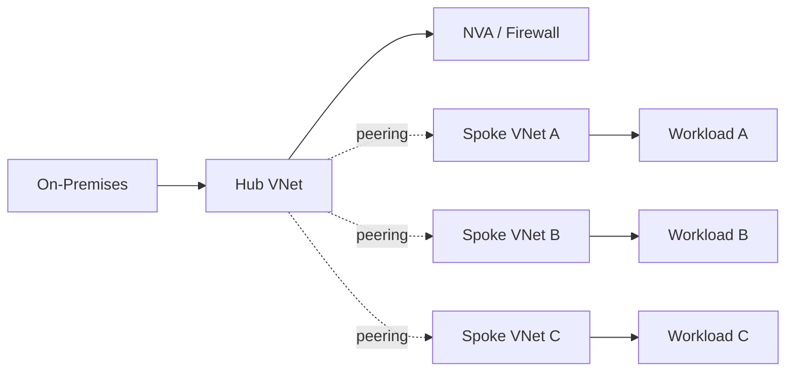
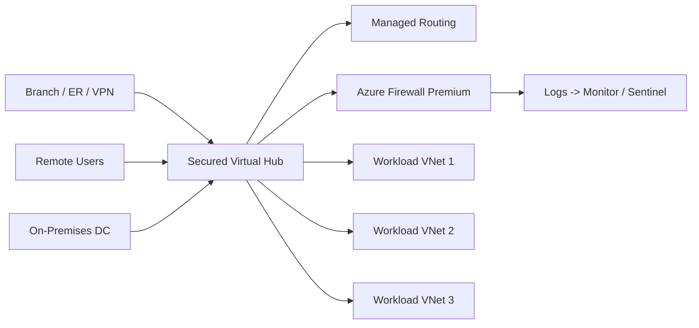

# Whitepaper
## Azure Virtual WAN with Secured Virtual Hub for FedRAMP High
*A modern alternative to traditional hub-and-spoke networking*

---

## Executive Summary
Operating at FedRAMP High demands secure, scalable, and auditable connectivity across regions, clouds, and on-premises. Classic hub-and-spoke in Azure can meet these needs, but it often introduces operational complexity, fragmented security controls, and scale limitations.

Azure Virtual WAN (vWAN) with Secured Virtual Hub streamlines transit, routing, and inspection as a managed service. By consolidating connectivity and security into the platform, agencies reduce configuration overhead, strengthen control consistency, and simplify audit evidence collection—improving resilience and accelerating compliance outcomes.

---

## Challenges in FedRAMP High Environments
Architectures must:
- Enforce rigorous controls (NIST 800-53 AC, SC, SI families).
- Apply consistent policy across tenants, regions, and environments.
- Enable hybrid and multi-cloud connectivity with minimal exposure.
- Provide centralized visibility, logging, and governance for audits.

Manual design and maintenance in classic patterns can become a bottleneck as environments grow.

---

## Classic Hub-and-Spoke Overview
- Central hub VNet provides shared connectivity and security services.
- Spoke VNets attach via peering for isolation and route propagation.
- Network virtual appliances (NVAs), firewalls, and gateways live in the hub.

### FedRAMP High Limitations
- High operational load: peering, UDRs, NSGs, and routes maintained by hand.
- Scale pain: more spokes drive exponential route and policy complexity.
- Configuration drift risk: custom NVAs and firewalls increase misconfiguration surface.
- Suboptimal paths: traffic often hairpins through the hub for inspection.
- Wider audit scope: more customer-operated components to harden, patch, and monitor.

#### Diagram: Classic Hub-and-Spoke


---

## Azure Virtual WAN with Secured Virtual Hub
Virtual WAN delivers a Microsoft-managed global transit fabric. The Secured Virtual Hub augments this with integrated Azure Firewall Premium, policy-driven routing, and centralized security operations.

### Key Capabilities
- Managed global transit: unify connectivity for regions, sites, users, and clouds.
- Integrated security: Azure Firewall Premium with TLS inspection, IDPS, URL/FQDN filtering.
- Zero-trust ready: per-segment routing, isolation, and inspection at scale.
- Compliance-aligned telemetry: native export to Azure Monitor, Microsoft Sentinel, and storage.
- Elastic scale: built-in resiliency and high availability for thousands of VNets and branches.

#### Diagram: vWAN with Secured Hub


---

## Multi-Region Design for FedRAMP High
Multiple secured hubs can be deployed in required regions (including Azure Government) and automatically interconnected over Microsoft’s backbone for:
- Geographic resilience and mission continuity.
- Regional data residency and jurisdictional needs.
- Efficient east–west routing without custom peering meshes.
- Seamless hybrid integration from distributed sites.

#### Diagram: Multi-Region vWAN with Secured Hubs
```mermaid
graph TB
    subgraph EAST[Region: East US]
        H1[Secured Hub (East)]
        H1 --> F1[Azure Firewall]
        H1 --> E1[VNet East-1]
        H1 --> E2[VNet East-2]
    end

    subgraph WEST[Region: West US]
        H2[Secured Hub (West)]
        H2 --> F2[Azure Firewall]
        H2 --> W1[VNet West-1]
        H2 --> W2[VNet West-2]
    end

    subgraph GOV[US Gov Virginia]
        H3[Secured Hub (US Gov VA)]
        H3 --> F3[Azure Firewall]
        H3 --> G1[VNet Gov-1]
        H3 --> G2[VNet Gov-2]
    end

    DCE[On-Prem East] --> H1
    DCW[On-Prem West] --> H2
    RUC[Remote Users CONUS] --> H1
    RUO[Remote Users OCONUS] --> H3

    H1 <-- MS Backbone --> H2
    H2 <-- MS Backbone --> H3
    H1 <-- MS Backbone --> H3
```

---

## Why It Outperforms Classic Hub-and-Spoke
| Aspect       | Classic Hub-and-Spoke | vWAN Secured Virtual Hub |
|--------------|------------------------|---------------------------|
| Complexity   | Manual peering, UDRs, NSGs, NVA lifecycle | Managed transit and routing with centralized policy |
| Security     | Customer-built firewall stacks | Built-in Azure Firewall Premium with uniform policy |
| Scalability  | Peering and route scale constraints | Elastic scale for VNets, branches, and users |
| Compliance   | Larger customer audit footprint | Reduced scope leveraging managed controls and logging |
| Resilience   | Custom HA and failover patterns | Native HA and auto-scale hubs |
| Latency      | Hairpin inspection patterns | Optimized any-to-any routing paths |

---

## FedRAMP High Scenarios
- Multi-region agencies: straightforward connectivity across CONUS/OCONUS with consistent policy.
- Defense contractors: centralized inspection aligned to NIST 800-171/800-53 control objectives.
- Hybrid workloads: ExpressRoute/VPN into secured hubs with enforced traffic inspection.
- Zero-trust segmentation: per-VNet micro-segmentation with centralized logging and analytics.

---

## Compliance Considerations
- Audit logging: firewall and routing telemetry supports AC-2, AU-2, AU-6.
- Boundary protection: secured hubs enable SC-7 and SC-7(3).
- Configuration management: centralized policy and automation align to CM-2, CM-6.
- Continuous monitoring: integrations with Defender for Cloud and Sentinel support CA-7, SI-4.

---

## Conclusion
For FedRAMP High, classic hub-and-spoke introduces avoidable complexity and audit overhead. Azure Virtual WAN with Secured Virtual Hub consolidates transit and security as a platform service, improving scale, resilience, and policy consistency while reducing operational risk and compliance burden—so teams can focus on mission delivery rather than network plumbing.