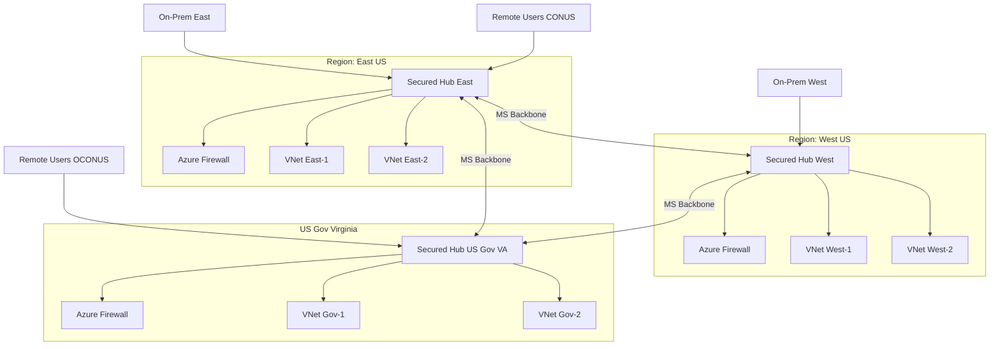

# Whitepaper
## Azure Virtual WAN with Secured Virtual Hub for FedRAMP High
*A modern alternative to traditional hub-and-spoke networking*

---
## Table of Contents
- [Whitepaper](#whitepaper)
  - [Azure Virtual WAN with Secured Virtual Hub for FedRAMP High](#azure-virtual-wan-with-secured-virtual-hub-for-fedramp-high)
  - [Table of Contents](#table-of-contents)
  - [Executive Summary](#executive-summary)
  - [Challenges in FedRAMP High Environments](#challenges-in-fedramp-high-environments)
  - [Classic Hub-and-Spoke Overview](#classic-hub-and-spoke-overview)
    - [FedRAMP High Limitations](#fedramp-high-limitations)
      - [Diagram: Classic Hub-and-Spoke](#diagram-classic-hub-and-spoke)
  - [Azure Virtual WAN with Secured Virtual Hub](#azure-virtual-wan-with-secured-virtual-hub)
    - [Key Capabilities](#key-capabilities)
      - [Diagram: vWAN with Secured Hub](#diagram-vwan-with-secured-hub)
  - [Multi-Region Design for FedRAMP High](#multi-region-design-for-fedramp-high)
      - [Diagram: Multi-Region vWAN with Secured Hubs](#diagram-multi-region-vwan-with-secured-hubs)
  - [Why It Outperforms Classic Hub-and-Spoke](#why-it-outperforms-classic-hub-and-spoke)
  - [Why Choose Virtual WAN Over Hub-and-Spoke](#why-choose-virtual-wan-over-hub-and-spoke)
    - [Centralized Security with Lower Risk](#centralized-security-with-lower-risk)
    - [Scalability for Multi-Region Deployments](#scalability-for-multi-region-deployments)
    - [Simplified Operations and Governance](#simplified-operations-and-governance)
    - [Optimized Performance](#optimized-performance)
    - [FedRAMP High Alignment](#fedramp-high-alignment)
  - [FedRAMP High Use Cases](#fedramp-high-use-cases)
  - [Compliance Considerations](#compliance-considerations)
  - [Conclusion](#conclusion)

---

## Executive Summary
Operating at FedRAMP High demands secure, scalable, and auditable connectivity across regions, clouds, and on-premises. Classic hub-and-spoke in Azure can meet these needs, but it often introduces operational complexity, fragmented security controls, and scale limitations.

Azure Virtual WAN (vWAN) with Secured Virtual Hub streamlines transit, routing, and inspection as a managed service. By consolidating connectivity and security into the platform, agencies reduce configuration overhead, strengthen control consistency, and simplify audit evidence collection—improving resilience and accelerating compliance outcomes.

---

## Challenges in FedRAMP High Environments
Architectures must:
- Enforce rigorous controls (NIST 800-53 AC, SC, SI families).
- Apply consistent policy across tenants, regions, and environments.
- Enable hybrid and multi-cloud connectivity with minimal exposure.
- Provide centralized visibility, logging, and governance for audits.

Manual design and maintenance in classic patterns can become a bottleneck as environments grow.

---

## Classic Hub-and-Spoke Overview
- Central hub VNet provides shared connectivity and security services.
- Spoke VNets attach via peering for isolation and route propagation.
- Network virtual appliances (NVAs), firewalls, and gateways live in the hub.

### FedRAMP High Limitations
- High operational load: peering, UDRs, NSGs, and routes maintained by hand.
- Scale pain: more spokes drive exponential route and policy complexity.
- Configuration drift risk: custom NVAs and firewalls increase misconfiguration surface.
- Suboptimal paths: traffic often hairpins through the hub for inspection.
- Wider audit scope: more customer-operated components to harden, patch, and monitor.

#### Diagram: Classic Hub-and-Spoke

---

## Azure Virtual WAN with Secured Virtual Hub
Virtual WAN delivers a Microsoft-managed global transit fabric. The Secured Virtual Hub augments this with integrated Azure Firewall Premium, policy-driven routing, and centralized security operations.

### Key Capabilities
- Managed global transit: unify connectivity for regions, sites, users, and clouds.
- Integrated security: Azure Firewall Premium with TLS inspection, IDPS, URL/FQDN filtering.
- Zero-trust ready: per-segment routing, isolation, and inspection at scale.
- Compliance-aligned telemetry: native export to Azure Monitor, Microsoft Sentinel, and storage.
- Elastic scale: built-in resiliency and high availability for thousands of VNets and branches.

#### Diagram: vWAN with Secured Hub

---

## Multi-Region Design for FedRAMP High
Multiple secured hubs can be deployed in required regions (including Azure Government) and automatically interconnected over Microsoft’s backbone for:
- Geographic resilience and mission continuity.
- Regional data residency and jurisdictional needs.
- Efficient east–west routing without custom peering meshes.
- Seamless hybrid integration from distributed sites.

#### Diagram: Multi-Region vWAN with Secured Hubs

---

## Why It Outperforms Classic Hub-and-Spoke
| Aspect       | Classic Hub-and-Spoke | vWAN Secured Virtual Hub |
|--------------|------------------------|---------------------------|
| Complexity   | Manual peering, UDRs, NSGs, NVA lifecycle | Managed transit and routing with centralized policy |
| Security     | Customer-built firewall stacks | Built-in Azure Firewall Premium with uniform policy |
| Scalability  | Peering and route scale constraints | Elastic scale for VNets, branches, and users |
| Compliance   | Larger customer audit footprint | Reduced scope leveraging managed controls and logging |
| Resilience   | Custom HA and failover patterns | Native HA and auto-scale hubs |
| Latency      | Hairpin inspection patterns | Optimized any-to-any routing paths |

---

## Why Choose Virtual WAN Over Hub-and-Spoke

When designing secure and compliant cloud networking architectures in FedRAMP High environments, the decision between traditional hub-and-spoke and Azure Virtual WAN with Secured Virtual Hub is critical. While hub-and-spoke is familiar and straightforward for small environments, it does not scale effectively for modern federal workloads that require resilience, compliance, and global reach.

### Centralized Security with Lower Risk
Hub-and-spoke relies on manually deployed NVAs or firewalls, each of which must be hardened, patched, and monitored—expanding the compliance footprint. vWAN Secured Hub integrates Azure Firewall Premium directly into the Microsoft backbone, reducing the attack surface and shifting much of the compliance burden to Microsoft’s managed service.

### Scalability for Multi-Region Deployments
As environments expand, hub-and-spoke networks become difficult to manage due to exponential route table growth and peering limits. vWAN provides global transit capabilities that allow thousands of spokes, branches, and remote users to connect seamlessly through Microsoft-managed routing, with automatic scaling across regions.

### Simplified Operations and Governance
Hub-and-spoke requires extensive configuration of route tables, UDRs, NSGs, and peerings, all of which increase operational overhead. By contrast, vWAN centralizes policy enforcement and connectivity management, enabling IT teams to focus on mission outcomes instead of network plumbing.

### Optimized Performance
With hub-and-spoke, traffic often hairpins through the hub for inspection, introducing unnecessary latency. vWAN optimizes routing across Microsoft’s global backbone, ensuring any-to-any connectivity with built-in inspection at the secured hub, improving both performance and security posture.

### FedRAMP High Alignment
In a compliance-driven environment, simplicity translates to reduced risk. By consolidating routing, firewalling, and monitoring into vWAN, organizations reduce the audit scope, minimize manual misconfiguration risks, and align with controls such as SC-7 (Boundary Defense), AU-2 (Audit Events), and SI-4 (System Monitoring).

## FedRAMP High Use Cases
- Multi-Region Federal Agencies: Simplified, compliant interconnectivity between CONUS and OCONUS regions.
- Defense Contractors: Centralized security inspection with Azure Firewall Premium meeting NIST 800-171/800-53 requirements.
- Hybrid Government Workloads: Seamless integration with on-premises via ExpressRoute or VPN, with enforced inspection at the secured hub.
- Zero-Trust Modernization: Micro-segmentation across VNets with central logging into Microsoft Sentinel for continuous monitoring.

## Compliance Considerations
- Audit Logging: Centralized firewall and routing logs meet AC-2, AU-2, AU-6 controls.
- Boundary Defense: Secured hub enforces SC-7 and SC-7(3) requirements.
- Centralized Management: Reduces human error and misconfiguration risk (aligned with CM-2, CM-6).
- Continuous Monitoring: Native integration with Microsoft Defender for Cloud and Microsoft Sentinel satisfies CA-7 and SI-4.

## Conclusion
For FedRAMP High environments, the traditional hub-and-spoke model introduces unnecessary complexity, operational risk, and compliance overhead. Azure Virtual WAN with Secured Virtual Hub offers a more secure, scalable, and compliant-ready alternative that reduces the audit burden, enhances security posture, and simplifies operations.

By choosing Virtual WAN over hub-and-spoke, agencies and contractors gain not only a modernized network architecture but also a compliance accelerator, a risk reducer, and a performance enhancer—providing a foundation that is both future-ready and mission-focused.
