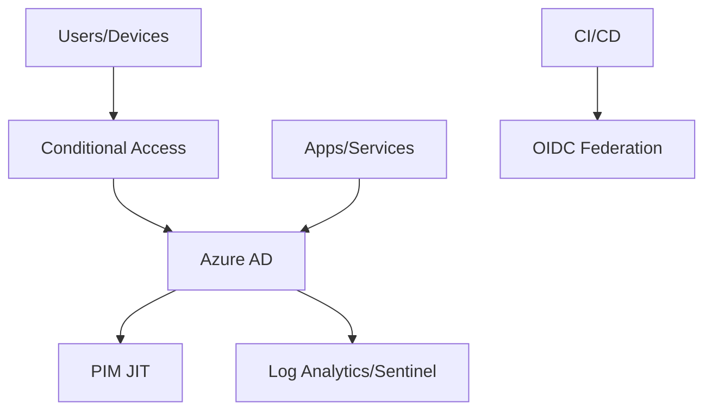

# Azure AD Implementation and Best Practices

**Author:** Randy Bordeaux  
**Version:** 1.0  
**Date:** January 2026  
**Azure Services:** Microsoft Entra ID, Conditional Access, Privileged Identity Management, Defender for Cloud Apps, (optional) Azure AD B2C

---

## Executive Summary

This whitepaper provides a **practical blueprint for implementing and operating Azure AD (Microsoft Entra ID) at enterprise scale**, aligning to Zero Trust principles. It covers **tenant setup, identity governance, secure access, application integration, and continuous monitoring**, with prescriptive configurations for Conditional Access, PIM, workload identities, and application lifecycle management.

**Key Outcomes:**
- Establish **secure-by-default tenant configuration** with CA/MFA, baseline policies, and blocked legacy auth
- Implement **least-privilege administration** with PIM just-in-time, approval workflows, and role separation
- Harden **application access** with SSO, federation, SCIM provisioning, and lifecycle governance
- Enable **workload identities** using managed identities and OIDC federation for CI/CD without secrets
- Deliver **continuous compliance** with access reviews, sign-in risk policies, and audit-ready logging

---

## Table of Contents

- [Executive Summary](#executive-summary)
- [Scope and Design Principles](#scope-and-design-principles)
- [Tenant Baseline Configuration](#tenant-baseline-configuration)
- [Identity Governance and Administration](#identity-governance-and-administration)
- [Conditional Access Strategy](#conditional-access-strategy)
- [Privileged Identity Management (PIM)](#privileged-identity-management-pim)
- [Application Integration and SSO](#application-integration-and-sso)
- [Workload Identities and Automation](#workload-identities-and-automation)
- [Device and Endpoint Policies](#device-and-endpoint-policies)
- [Monitoring, Audit, and Threat Detection](#monitoring-audit-and-threat-detection)
- [Compliance and Access Reviews](#compliance-and-access-reviews)
- [Deployment Blueprint](#deployment-blueprint)
- [Anti-Patterns and Tradeoffs](#anti-patterns-and-tradeoffs)
- [References and Resources](#references-and-resources)
- [Appendices](#appendices)

---

## Scope and Design Principles

### In Scope

- Azure AD tenant hardening and baseline policies
- Identity governance (PIM, access reviews, lifecycle)
- Conditional Access for users and admins
- Application SSO, provisioning, and lifecycle controls
- Workload identities for automation (OIDC, managed identities)

### Out of Scope

- On-prem AD DS design and migration steps
- B2C customer identity deep dive (only referenced as optional)
- Application-layer secure coding practices

### Principles

| Principle | Implementation |
|-----------|----------------|
| Zero Trust | Assume breach; verify explicitly with CA and risk signals |
| Least Privilege | PIM JIT for admin roles; scoped app roles; per-app service principals |
| Secure by Default | Block legacy auth; enforce MFA; baseline CA policies |
| Lifecycle Governance | Automate join/move/leave; SCIM provisioning; access reviews |
| Observability | Centralized sign-in and audit logs; alerting on anomalous access |

---

## Tenant Baseline Configuration

- Block legacy authentication; disable basic auth protocols
- Enforce MFA for all users; stronger for privileged roles
- Configure security defaults or custom CA baselines
- Set self-service password reset (SSPR) with strong methods
- Enable combined registration for MFA/SSPR

```powershell
# Example: Disable legacy auth protocols
Set-AuthenticationPolicy -Identity Global -AllowBasicAuthNtlm $false
Set-AuthenticationPolicy -Identity Global -AllowLegacyAuthProtocols $false
```

---

## Identity Governance and Administration

- Separate admin accounts; no standing Global Admin
- Use **admin units** to scope administration where possible
- Implement **role-based delegation** (e.g., App Admin vs. User Admin)
- Protect break-glass accounts (cloud-only, long passwords, excluded from CA but monitored)

```powershell
# Create admin unit example
New-AzureADMSAdministrativeUnit -DisplayName "EU-Subsidiary"
```

---

## Conditional Access Strategy

- Baseline: MFA for all; block legacy; require compliant or hybrid-joined devices for admin access
- Step-up: Elevate to PIM requires device compliance + MFA + risk < medium
- Location: Trusted named locations; block high-risk geos for admins

```yaml
# Conceptual CA policy structure
policy:
  name: "Admin Portal Access"
  conditions:
    users: ['Privileged roles']
    device: compliant
    locations: ['trusted']
  grant:
    - mfa
    - require_compliant_device
```

---

## Privileged Identity Management (PIM)

- Enable PIM for Azure AD roles and Azure RBAC
- Approval workflows for sensitive roles; justification required
- Time-bound assignments; enforce MFA on activation
- Alert on permanent role assignments; remove standing privilege

```powershell
# Example: Set PIM settings via Graph (conceptual placeholder)
# Use Graph API /beta roleManagement/directory/roleScheduleInstances
```

---

## Application Integration and SSO

- Prefer SAML/OIDC with strong claims and group-to-role mapping
- Use **SCIM provisioning** for app lifecycle; deprovision on exit
- Pin certificate lifetimes and rotate before expiry
- Enforce app consent policies; restrict user consent

```json
{
  "appId": "<guid>",
  "signInAudience": "AzureADMyOrg",
  "optionalClaims": {
    "idToken": [{"name": "groups", "essential": false, "additionalProperties": ["id"]}]
  }
}
```

---

## Workload Identities and Automation

- Use **managed identities** for Azure resources; avoid client secrets
- For CI/CD (Azure DevOps/GitHub), use **OIDC federated credentials** to service principals
- Scope roles minimally for automation (e.g., specific RG or resource)

```yaml
# GitHub Actions OIDC
permissions:
  id-token: write
  contents: read

steps:
  - uses: azure/login@v1
    with:
      client-id: ${{ secrets.AZURE_CLIENT_ID }}
      tenant-id: ${{ secrets.AZURE_TENANT_ID }}
      subscription-id: ${{ secrets.AZURE_SUBSCRIPTION_ID }}
```

---

## Device and Endpoint Policies

- Require Intune compliance for admin access; block jailbroken/rooted devices
- Use Defender for Endpoint signals in CA (risk-based)
- Enforce disk encryption, secure boot, and up-to-date AV

```text
Compliance baseline: BitLocker/ FileVault on, Secure Boot, OS version >= baseline, AV healthy
```

---

## Monitoring, Audit, and Threat Detection

- Send AAD sign-in and audit logs to Log Analytics/Sentinel
- Enable Identity Protection (sign-in risk, user risk policies)
- Detections: impossible travel, unfamiliar sign-in properties, MFA fatigue

```kql
// Unusual admin sign-ins
SigninLogs
| where Role in ("Global Administrator", "Privileged Role Administrator")
| summarize count() by IPAddress, bin(TimeGenerated, 1h)
| where count_ > 3
```

---

## Compliance and Access Reviews

- Quarterly access reviews for privileged roles and high-value apps
- Review guest access regularly; enforce entitlement management for external users
- Track and rotate credentials; alert on expiring certs/secrets

```kql
// Expiring app certs (30 days)
AADServicePrincipalSignInLogs
| where CertificateExpirationDate < now() + 30d
```

---

## Deployment Blueprint

1. Enable MFA/CA baseline; block legacy auth
2. Stand up admin units and role delegation; protect break-glass
3. Roll out PIM for all privileged roles with approvals
4. Onboard apps to SSO with SCIM; enforce consent policies
5. Implement OIDC workload identities for CI/CD; remove stored secrets
6. Integrate logs with Sentinel; enable Identity Protection; configure alerts
7. Establish access reviews; rotate creds and certificates; run DR and IR tabletop exercises

---

## Anti-Patterns and Tradeoffs

| Anti-Pattern | Risk | Mitigation |
|--------------|------|------------|
| Standing Global Admins | Privilege escalation, audit gaps | PIM JIT, separate admin accounts |
| Legacy/basic auth enabled | Credential stuffing, MFA bypass | Block legacy; enforce CA |
| User consent allowed broadly | Rogue app consent | Restrict consent; admin consent workflow |
| Long-lived client secrets in CI/CD | Secret leakage | OIDC federation; managed identities; rotate secrets |
| No access reviews | Access creep, compliance gaps | Quarterly reviews; entitlement management |

---

## References and Resources

- Conditional Access design: https://learn.microsoft.com/azure/active-directory/conditional-access/overview
- PIM deployment: https://learn.microsoft.com/azure/active-directory/privileged-identity-management/pim-configure
- Identity Protection: https://learn.microsoft.com/azure/active-directory/identity-protection/overview-identity-protection
- App integration patterns: https://learn.microsoft.com/azure/active-directory/manage-apps/what-is-application-management
- Workload identity federation: https://learn.microsoft.com/azure/active-directory/develop/workload-identity-federation

---

## Appendices

### Appendix A: Policy Starter Set

- Block legacy auth
- MFA for all; stronger for admins
- Require compliant/hybrid-joined device for admin portals
- User consent disabled; admin consent workflow
- PIM required for privileged roles with approval + justification
- Identity Protection sign-in risk policy (block high risk)

### Appendix B: Break-Glass Account Handling

- 2 cloud-only accounts
- Long, random passwords stored offline; rotated quarterly
- Excluded from CA but monitored with alerts
- Tested quarterly for access

### Appendix C: App Onboarding Checklist

- SSO protocol chosen (OIDC/SAML)
- Claims mapped (groups/roles)
- SCIM provisioning configured
- Certificates/keys rotation schedule set
- Consent model: admin consent only for high-priv apps

### Appendix D: Mermaid Overview



---

**Document Version:** 1.0  
**Last Updated:** January 2026  
**Author:** Randy Bordeaux  
**Review Cycle:** Quarterly
