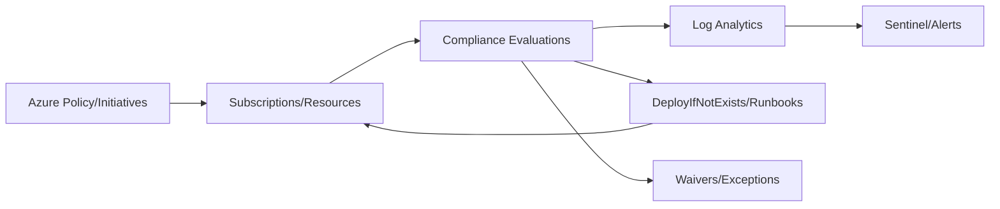

# Compliance Automation and Governance with Azure

**Author:** Randy Bordeaux  
**Version:** 1.0  
**Date:** January 2026  
**Azure Services:** Azure Policy, Defender for Cloud, Azure Blueprints, Microsoft Purview, Azure Monitor, Microsoft Sentinel

---

## Executive Summary

This whitepaper provides a **practical blueprint to automate compliance and governance** in Azure. It maps controls to Azure-native services, **codifies guardrails**, and establishes **evidence collection and alerting** pipelines aligned to frameworks such as NIST 800-53, ISO 27001, SOC 2, and CIS.

**Key Outcomes:**
- Standardize guardrails with **Azure Policy** and **initiatives** mapped to control families
- Automate compliance posture with **Defender for Cloud** regulatory standards and continuous export
- Enforce **resource consistency** via landing zone archetypes and **Azure Blueprints** patterns
- Centralize evidence (logs, alerts, assessments) into **Log Analytics/Sentinel** for audit readiness
- Operationalize **exceptions, waivers, and remediation** with automation runbooks and ticketing

---

## Table of Contents

- [Executive Summary](#executive-summary)
- [Scope and Design Principles](#scope-and-design-principles)
- [Control Framework Mapping](#control-framework-mapping)
- [Policy-Driven Guardrails](#policy-driven-guardrails)
- [Defender for Cloud and Regulatory Standards](#defender-for-cloud-and-regulatory-standards)
- [Landing Zones and Blueprint Patterns](#landing-zones-and-blueprint-patterns)
- [Data Protection and Purview](#data-protection-and-purview)
- [Monitoring, Evidence, and Reporting](#monitoring-evidence-and-reporting)
- [Exception Management and Waivers](#exception-management-and-waivers)
- [Automated Remediation](#automated-remediation)
- [Continuous Assessment and Audits](#continuous-assessment-and-audits)
- [Anti-Patterns and Tradeoffs](#anti-patterns-and-tradeoffs)
- [References and Resources](#references-and-resources)
- [Appendices](#appendices)

---

## Scope and Design Principles

### In Scope

- Azure-native compliance enforcement for commercial cloud
- Policy-based controls, remediation, and evidence collection
- Integration with SIEM/SOAR for detections and ticketing

### Out of Scope

- Sovereign/Gov cloud specifics
- On-prem compliance tooling integrations

### Principles

| Principle | Implementation |
|-----------|----------------|
| Codify Controls | Use Azure Policy/initiatives; versioned and tagged |
| Minimize Drift | Policy remediation + deployment guardrails; deny-by-default where safe |
| Evidence by Design | Logs, assessments, SBOMs, and approvals exported to Log Analytics/Sentinel |
| Separation of Duties | Break-glass excluded; approvals for waivers; PIM for policy admins |
| Continuous Verification | Scheduled assessments, drift detection, and alerting |

---

## Control Framework Mapping

Map policy sets to control families:
- NIST 800-53: AC, AU, CM, SC, IR
- ISO 27001 Annex A: A.5, A.8, A.9, A.12, A.14
- CIS Controls: 1 (Inventory), 4 (Admin Privileges), 5 (Secure Config), 13 (Network Monitoring)

Maintain a **policy registry** with control IDs, policy definition IDs, assignment scopes, and evidence paths.

---

## Policy-Driven Guardrails

- Use **policy initiatives** for environment archetypes (dev/test/prod)
- Prefer **deny** for high-risk (public IP on PaaS, no TLS), **deployIfNotExists** for additive controls (diagnostics)
- Assign at management group scope; exclude break-glass/resource exceptions via parameters

```json
{
  "if": {
    "allOf": [
      { "field": "type", "equals": "Microsoft.Network/publicIPAddresses" }
    ]
  },
  "then": { "effect": "deny" }
}
```

```json
{
  "if": {
    "field": "type",
    "equals": "Microsoft.Storage/storageAccounts"
  },
  "then": {
    "effect": "deployIfNotExists",
    "details": {
      "type": "Microsoft.Storage/storageAccounts/blobServices",
      "name": "default",
      "roleDefinitionIds": ["/providers/Microsoft.Authorization/roleDefinitions/817433f3-f1c2-4a01-b75d-5dfc1b84e0d5"],
      "deployment": {
        "properties": {
          "mode": "incremental",
          "template": {
            "$schema": "http://schema.management.azure.com/schemas/2019-04-01/deploymentTemplate.json#",
            "contentVersion": "1.0.0.0",
            "resources": [
              {
                "type": "Microsoft.Storage/storageAccounts/blobServices",
                "apiVersion": "2021-08-01",
                "name": "[format('{0}/default', parameters('storageAccountName'))]",
                "properties": {
                  "deleteRetentionPolicy": {"enabled": true, "days": 30}
                }
              }
            ],
            "parameters": {
              "storageAccountName": {"type": "string"}
            }
          },
          "parameters": {
            "storageAccountName": {"value": "[field('name')]"}
          }
        }
      }
    }
  }
}
```

---

## Defender for Cloud and Regulatory Standards

- Enable **Defender for Cloud** with regulatory standards (NIST, ISO, CIS)
- Configure **continuous export** of recommendations and assessments to Log Analytics/Event Hub
- Use **workflows** to create tickets for high severity recommendations

```bash
az security auto-provisioning-setting update --name default --auto-provision on
az security pricing create --name VirtualMachines --tier standard
```

---

## Landing Zones and Blueprint Patterns

- Use landing zone archetypes: **Corp**, **Online**, **SAP**, etc., with pre-assigned policy sets
- Leverage **Azure Blueprints** or **Bicep/ARM + policy assignments** for repeatable deployment
- Include **diagnostic settings** and **tag standards** in archetypes

---

## Data Protection and Purview

- Classify and label data with **Microsoft Purview**; auto-label sensitive data
- Enforce **DLP policies** for egress; integrate with Defender for Cloud Apps
- Require encryption at rest (SSE/CMK), TLS >=1.2, and Private Link for data planes

---

## Monitoring, Evidence, and Reporting

- Centralize logs: Activity, Resource, Policy, Defender, Sentinel incidents
- Store evidence: policy compliance snapshots, recommendation exports, approvals/waivers

```kql
// Policy non-compliance by definition
PolicyResources
| where ComplianceState == "NonCompliant"
| summarize NonCompliant=count() by PolicyDefinitionName, ManagementGroupName
```

```kql
// High severity Defender recommendations
SecurityRecommendation
| where Severity == "High"
| summarize Count=count() by RecommendationDisplayName
```

- Dashboards: compliance posture by scope, trend of non-compliance, MTTR for remediation

---

## Exception Management and Waivers

- Formal **waiver process** with expiration dates and justification
- Track waivers in source control or ticketing; link to policy assignment IDs
- Alert on waiver expiry and renew or remediate

---

## Automated Remediation

- Use **deployIfNotExists** policies for diagnostics, encryption, and network restrictions
- Use **Logic Apps/Functions/Runbooks** triggered from Event Grid/Log Analytics for:
  - Enabling diagnostics on non-compliant resources
  - Removing public IPs from tagged resources
  - Rotating keys/secrets when expiry threshold hit

```kql
// Trigger non-compliance remediation
PolicyResources
| where ComplianceState == "NonCompliant"
| where PolicyDefinitionAction == "DeployIfNotExists"
```

---

## Continuous Assessment and Audits

- Weekly compliance scans; monthly executive summaries
- Quarterly tabletop for incident and DR tied to control objectives
- Maintain **evidence catalog** with control -> evidence artifact mapping

---

## Anti-Patterns and Tradeoffs

| Anti-Pattern | Risk | Mitigation |
|--------------|------|------------|
| Deny-only without remediation | Operational friction, shadow IT | Blend deny + deployIfNotExists + guidance |
| Unscoped policy assignments | Blast radius, false positives | Use MG scopes and parameters; test in lower envs |
| No waiver lifecycle | Permanent exceptions | Expiring waivers, approval workflow, alerts |
| Compliance via manual attestations | Stale evidence | Automated exports, dashboards, audit-ready logs |
| Ignoring data classification | Unknown sensitive data exposure | Purview labeling + DLP, encryption, Private Link |

---

## References and Resources

- Azure Policy documentation: https://learn.microsoft.com/azure/governance/policy/overview
- Defender for Cloud regulatory standards: https://learn.microsoft.com/azure/defender-for-cloud/regulatory-compliance-dashboard
- Azure Blueprints/landing zones: https://learn.microsoft.com/azure/cloud-adoption-framework/ready/landing-zone/
- Microsoft Purview sensitivity labels: https://learn.microsoft.com/purview/sensitivity-labels
- Sentinel integration: https://learn.microsoft.com/azure/sentinel/connect-azure-policy

---

## Appendices

### Appendix A: Initiative Starter Set (Examples)

- Deny public IP on PaaS (Storage/SQL)
- Require Private Link on Key Vault/Storage
- Deploy diagnostics to Log Analytics for all supported resource types
- Enforce tags: `Owner`, `Environment`, `DataClassification`
- Require TLS >=1.2; HTTPS only on web apps

### Appendix B: Continuous Export Example

```bash
az security setting update --name ContinuousExport --enabled true
az security automation create --resource-group rg-sec --name sec-auto \
  --actions "[{\"actionType\":\"EventHub\",\"resourceId\":\"/subscriptions/<sub>/resourceGroups/rg-sec/providers/Microsoft.EventHub/namespaces/sec-eh\"}]"
```

### Appendix C: Evidence Catalog Template

| Control ID | Policy/Source | Evidence Artifact | Retention |
|------------|---------------|-------------------|-----------|
| NIST AC-3 | Azure Policy: Deny public IP | Policy compliance export | 1 year |
| ISO A.12.4 | Diagnostics enabled | Log Analytics exports | 1 year |
| CIS 5.1 | PIM enforced | PIM audit logs | 1 year |

### Appendix D: Mermaid Compliance Flow



---

**Document Version:** 1.0  
**Last Updated:** January 2026  
**Author:** Randy Bordeaux  
**Review Cycle:** Quarterly
