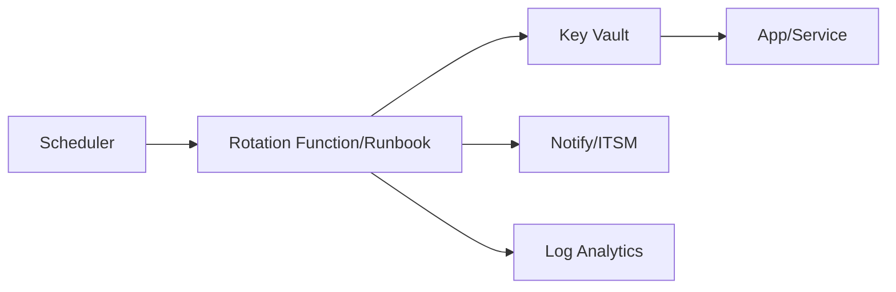

# Key Vault Deployment and Secret Rotation Strategies

**Author:** Randy Bordeaux  
**Version:** 1.0  
**Date:** January 2026  
**Azure Services:** Azure Key Vault, Private Link, Microsoft Entra ID, Azure Monitor, Azure Policy

---

## Executive Summary

This whitepaper provides **production-ready guidance for deploying Azure Key Vault**, enforcing network and identity isolation, and implementing **automated secret and key rotation** for applications and CI/CD pipelines. It emphasizes **private access, RBAC, managed identities, and continuous monitoring** to meet Zero Trust and compliance requirements.

**Key Outcomes:**
- Deploy hardened Key Vault instances with **private endpoints** and **public network disabled**
- Enforce **RBAC-only access** with managed identities and scoped roles; avoid access policies
- Implement **automated rotation** for secrets, keys, and certificates with runbooks and pipelines
- Monitor vault usage with **diagnostic logs**, **KQL alerts**, and **Azure Policy** guardrails
- Provide **recovery assurance** with soft delete, purge protection, and tested restore procedures

---

## Table of Contents

- [Executive Summary](#executive-summary)
- [Scope and Design Principles](#scope-and-design-principles)
- [Deployment Architecture](#deployment-architecture)
- [Identity and Access Control](#identity-and-access-control)
- [Network Security](#network-security)
- [Secret, Key, and Certificate Management](#secret-key-and-certificate-management)
- [Rotation Strategies and Automation](#rotation-strategies-and-automation)
- [Monitoring, Logging, and Alerting](#monitoring-logging-and-alerting)
- [Compliance and Policy Controls](#compliance-and-policy-controls)
- [Backup, Recovery, and DR](#backup-recovery-and-dr)
- [Integration Patterns (App + CI/CD)](#integration-patterns-app--cicd)
- [Anti-Patterns and Tradeoffs](#anti-patterns-and-tradeoffs)
- [References and Resources](#references-and-resources)
- [Appendices](#appendices)

---

## Scope and Design Principles

### In Scope

- Secure deployment of Azure Key Vault for app and pipeline secrets
- Identity-based access using RBAC and managed identities
- Network isolation via Private Link and firewalls
- Automated rotation of secrets, keys, and certificates
- Monitoring, alerting, and compliance enforcement

### Out of Scope

- HSM-backed keys (Azure Key Vault Managed HSM) deep dive
- Application-layer tokenization/encryption patterns
- On-premises HSM integrations

### Principles

| Principle | Implementation |
|-----------|----------------|
| Least Privilege | RBAC roles scoped per vault; no shared credentials |
| Secretless | Managed identities; avoid storing secrets in pipelines |
| Private by Default | Private endpoints; public network access disabled |
| Automate Rotation | Runbooks/pipelines with short-lived credentials |
| Audit Everything | Diagnostic logs to Log Analytics; alerts on anomalies |
| Recoverable | Soft delete + purge protection; tested restore procedures |

---

## Deployment Architecture

```mermaid
graph TD
    App[App/Function/VM] --> MI[Managed Identity]
    MI --> KV[Key Vault (Private Endpoint)]
    KV --> Logs[Diagnostics -> Log Analytics]
    Logs --> Alerts[Alerts]
    Admins --> PIM[PIM JIT]
    PIM --> KV
```

- One vault per app or domain to minimize blast radius
- Separate vaults per environment (dev/test/stage/prod)
- Private endpoints per vault; DNS via `privatelink.vaultcore.azure.net`

---

## Identity and Access Control

- Prefer **RBAC** over access policies; disable public access
- Roles: `Key Vault Secrets User` for apps, `Key Vault Crypto User` for key ops, `Key Vault Administrator` for operators (PIM JIT)
- Break-glass account excluded from CA but monitored; no standing GA on vaults

```hcl
# Example role assignment
resource "azurerm_role_assignment" "app_secrets" {
  scope                = azurerm_key_vault.app.id
  role_definition_name = "Key Vault Secrets User"
  principal_id         = azurerm_user_assigned_identity.app.principal_id
}
```

---

## Network Security

- `public_network_access_enabled = false`
- Private endpoint for `vault` subresource; DNS via Private DNS zone
- Firewall rules minimal; allow only required subnets/agents

```hcl
resource "azurerm_key_vault" "app" {
  name                        = "kv-app-prod"
  location                    = var.location
  resource_group_name         = azurerm_resource_group.app.name
  tenant_id                   = data.azurerm_client_config.current.tenant_id
  sku_name                    = "standard"
  soft_delete_retention_days  = 90
  purge_protection_enabled    = true
  public_network_access_enabled = false
}

resource "azurerm_private_endpoint" "kv" {
  name                = "pe-kv-app-prod"
  resource_group_name = azurerm_resource_group.network.name
  location            = var.location
  subnet_id           = var.private_endpoint_subnet_id

  private_service_connection {
    name                           = "kv-conn"
    private_connection_resource_id = azurerm_key_vault.app.id
    subresource_names              = ["vault"]
    is_manual_connection           = false
  }
}
```

---

## Secret, Key, and Certificate Management

- Enable **soft delete** and **purge protection**
- Version secrets; never overwrite without versioning
- Use separate vaults/objects for app vs. ops credentials
- Enforce naming conventions (e.g., `app/env/secret-name`)

```bash
# Get latest secret version
az keyvault secret show --vault-name kv-app-prod --name app-db-password --query "id"
```

---

## Rotation Strategies and Automation

### Secrets

- Rotate high-value secrets every 30-90 days; database creds monthly
- Use **runbooks** or **Functions** to rotate and update dependent services

```bash
# Example rotation script (conceptual)
NEW=$(uuidgen)
az keyvault secret set --vault-name kv-app-prod --name app-db-password --value "$NEW"
```

### Certificates

- Use Key Vault cert auto-renew with issuer (ACME/Partner)
- Alert on certs expiring <30 days

```bash
az keyvault certificate list --vault-name kv-app-prod --query "[?attributes.expires<`date -d '+30 days' -Iseconds`].id"
```

### Keys

- Rotate keys on schedule; separate keys per app/service
- For client encryption keys, enforce RBAC and logging on unwrap/wrap

### Pipelines

- CI/CD retrieves secrets at runtime via managed identity
- No secret caching in pipeline logs/artifacts; mask outputs

---

## Monitoring, Logging, and Alerting

- Enable **diagnostic settings** to Log Analytics for all categories (AuditEvent, Request)
- Alerts: secret read spikes, failed auth, near-expiry certs, purge operations

```kql
// Failed vault operations
AzureDiagnostics
| where ResourceProvider == "MICROSOFT.KEYVAULT"
| where ResultSignature != "Success"
| summarize Count = count() by OperationName, CallerIPAddress, bin(TimeGenerated, 1h)
```

```hcl
# Example alert (Terraform)
resource "azurerm_monitor_scheduled_query_rules_alert_v2" "kv_failures" {
  name                = "alert-kv-failures"
  resource_group_name = var.rg
  location            = var.location
  scopes              = [var.log_analytics_workspace_id]
  severity            = 2
  criteria {
    query = <<-QUERY
      AzureDiagnostics
      | where ResourceProvider == "MICROSOFT.KEYVAULT"
      | where ResultSignature != "Success"
      | summarize Count = count() by bin(TimeGenerated, 15m)
      | where Count > 5
    QUERY
    operator  = "GreaterThan"
    threshold = 0
    time_aggregation_method = "Count"
  }
  action {
    action_groups = [azurerm_monitor_action_group.secops.id]
  }
}
```

---

## Compliance and Policy Controls

- Azure Policy: require private endpoints, deny public network access, enforce purge protection on
- Defender for Cloud: enable Key Vault plan for threat detection

```json
{
  "if": {
    "allOf": [
      {"field": "type", "equals": "Microsoft.KeyVault/vaults"},
      {"field": "Microsoft.KeyVault/vaults/publicNetworkAccess", "notequals": "Disabled"}
    ]
  },
  "then": {"effect": "deny"}
}
```

---

## Backup, Recovery, and DR

- Soft delete + purge protection enabled (90 days typical)
- Use `az keyvault secret backup` for critical secrets before major changes
- Test restore paths; document RTO/RPO

```bash
az keyvault secret backup --vault-name kv-app-prod --name app-db-password --file app-db-password.bak
az keyvault secret restore --vault-name kv-app-prod --file app-db-password.bak
```

---

## Integration Patterns (App + CI/CD)

### App Integration (Managed Identity)

```hcl
resource "azurerm_user_assigned_identity" "app" {
  name                = "id-app-prod"
  resource_group_name = azurerm_resource_group.app.name
  location            = var.location
}

resource "azurerm_role_assignment" "app_secrets" {
  scope                = azurerm_key_vault.app.id
  role_definition_name = "Key Vault Secrets User"
  principal_id         = azurerm_user_assigned_identity.app.principal_id
}
```

### Pipeline Integration (OIDC)

```yaml
permissions:
  id-token: write
  contents: read

steps:
  - uses: azure/login@v1
    with:
      client-id: ${{ secrets.AZURE_CLIENT_ID }}
      tenant-id: ${{ secrets.AZURE_TENANT_ID }}
      subscription-id: ${{ secrets.AZURE_SUBSCRIPTION_ID }}
  - task: AzureKeyVault@2
    inputs:
      azureSubscription: 'svc-prod'
      KeyVaultName: 'kv-app-prod'
      SecretsFilter: 'app-db-password'
```

---

## Anti-Patterns and Tradeoffs

| Anti-Pattern | Risk | Mitigation |
|--------------|------|------------|
| Access policies instead of RBAC | Coarse access, harder audit | Use RBAC roles; disable access policies |
| Public network access enabled | Secret exfiltration | Disable public access; require Private Link |
| Long-lived secrets in pipelines | Leakage in logs/artifacts | Use managed identities/OIDC; short TTL; mask outputs |
| Single shared vault for all apps | Broad blast radius | Per-app/per-env vaults; scoped identities |
| No rotation or monitoring | Expired/compromised secrets undetected | Scheduled rotation; alerts on failures/expirations |

---

## References and Resources

- Azure Key Vault security overview: https://learn.microsoft.com/azure/key-vault/general/overview-security
- Private Link for Key Vault: https://learn.microsoft.com/azure/key-vault/general/private-link
- Managed identities: https://learn.microsoft.com/azure/active-directory/managed-identities-azure-resources/overview
- Azure Policy samples: https://learn.microsoft.com/azure/governance/policy/samples
- Azure Key Vault monitoring: https://learn.microsoft.com/azure/key-vault/general/logging

---

## Appendices

### Appendix A: Rotation Cadence Examples

| Secret Type | Cadence |
|-------------|---------|
| DB credentials | 30 days |
| App secrets (API keys) | 60-90 days |
| Certificates | Auto-renew or 60 days before expiry |
| Encryption keys | 180-365 days (per compliance) |

### Appendix B: Terraform Module Skeleton

```hcl
module "key_vault" {
  source              = "./modules/key-vault"
  name                = "kv-app-prod"
  resource_group_name = var.rg
  location            = var.location
  private_endpoint_subnet_id = var.pe_subnet_id
  enable_purge_protection    = true
  enable_private_endpoint    = true
}
```

### Appendix C: KQL Snippets

```kql
// Secret read spikes
AzureDiagnostics
| where ResourceProvider == "MICROSOFT.KEYVAULT"
| where OperationName == "SecretGet"
| summarize Count = count() by CallerIPAddress, bin(TimeGenerated, 1h)
| where Count > 100
```

```kql
// Purge operations
AzureDiagnostics
| where OperationName contains "Purge"
| project TimeGenerated, OperationName, Caller, CallerIPAddress
```

### Appendix D: Mermaid Rotation Flow



---

**Document Version:** 1.0  
**Last Updated:** January 2026  
**Author:** Randy Bordeaux  
**Review Cycle:** Quarterly
