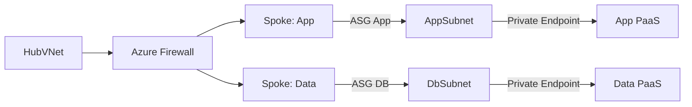

# Zero Trust Architecture with Azure Services

**Author:** Randy Bordeaux  
**Version:** 1.0  
**Date:** January 2026  
**Azure Services:** Microsoft Entra ID, Azure Firewall, Azure Private Link, Azure VPN Gateway, Azure Key Vault, Microsoft Defender for Cloud, Microsoft Sentinel

---

## Executive Summary

This whitepaper provides an actionable blueprint to implement **Zero Trust** in Azure, emphasizing **continuous verification, least privilege, and explicit security controls** across identity, devices, network, applications, data, and telemetry. It aligns to NIST SP 800-207 and CIS benchmarks and is optimized for **enterprise landing zones**.

**Key Outcomes:**
- Enforce **strong identity** with Conditional Access, MFA, and PIM-backed just-in-time elevation
- Achieve **network containment** with microsegmentation, Private Link, and egress control through central firewalls
- Protect **data and secrets** with encryption, tokenization, and per-app Key Vault isolation
- Embed **policy and compliance** via Azure Policy, Defender for Cloud, and continuous posture assessments
- Establish **monitoring and response** using Sentinel analytics, UEBA, and automated playbooks

---

## Table of Contents

- [Zero Trust Architecture with Azure Services](#zero-trust-architecture-with-azure-services)
  - [Executive Summary](#executive-summary)
  - [Table of Contents](#table-of-contents)
  - [Scope and Design Principles](#scope-and-design-principles)
    - [In Scope](#in-scope)
    - [Out of Scope](#out-of-scope)
    - [Design Principles](#design-principles)
  - [Reference Architecture](#reference-architecture)
  - [Identity and Access Control](#identity-and-access-control)
    - [Conditional Access](#conditional-access)
    - [Privileged Access](#privileged-access)
    - [Workload Identity](#workload-identity)
  - [Device and Endpoint Trust](#device-and-endpoint-trust)
  - [Network Segmentation and Access](#network-segmentation-and-access)
    - [Segmentation Strategy](#segmentation-strategy)
    - [Private Access](#private-access)
    - [Egress Control](#egress-control)
  - [Application Access and Service Isolation](#application-access-and-service-isolation)
  - [Data Protection and Key Management](#data-protection-and-key-management)
  - [Monitoring, Detection, and Response](#monitoring-detection-and-response)
    - [Playbooks](#playbooks)
  - [Compliance, Policy, and Assurance](#compliance-policy-and-assurance)
  - [Deployment Blueprint](#deployment-blueprint)
  - [Anti-Patterns and Tradeoffs](#anti-patterns-and-tradeoffs)
  - [References and Resources](#references-and-resources)
  - [Appendices](#appendices)
    - [Appendix A: Control Checklist](#appendix-a-control-checklist)
    - [Appendix B: Sample Conditional Access Matrix](#appendix-b-sample-conditional-access-matrix)
    - [Appendix C: Network Segmentation Pattern](#appendix-c-network-segmentation-pattern)
    - [Appendix D: Incident Response Quick Steps](#appendix-d-incident-response-quick-steps)

---

## Scope and Design Principles

### In Scope

- Azure-hosted workloads (IaaS, PaaS, containers) in Commercial cloud
- Identity-centric controls (Conditional Access, PIM, workload identities)
- Network microsegmentation, Private Link, and controlled egress
- Data protection (encryption, secrets, tokenization)
- Monitoring, threat detection, and automated response with Sentinel

### Out of Scope

- On-premises-only architectures without Azure connectivity
- Sovereign clouds (Gov/China) specifics
- Application-layer secure coding practices (covered separately)

### Design Principles

| Principle | Implementation |
|-----------|----------------|
| Assume Breach | Default deny, just-in-time elevation, verify every request |
| Least Privilege | PIM, role scoping, per-app service principals, constrained RBAC |
| Explicit Verification | Conditional Access with device/user/risk signals; certificate pinning for services |
| Microsegmentation | Spoke VNets with NSGs/ASGs, Private Link, no direct public exposure |
| Secure by Default | No public endpoints; TLS everywhere; managed identities over secrets |
| Observability | Centralized logging, UEBA, and automated playbooks |

---

## Reference Architecture

```mermaid
graph TD
    Users[Users/Devices]
    IdP[Microsoft Entra ID]
    CA[Conditional Access]
    PIM[PIM JIT]
    Hub[Hub VNet]
    Spoke1[App Spoke]
    Spoke2[Data Spoke]
    FW[Azure Firewall]
    PL[Private Link]
    KV[Key Vault (per app)]
    LA[Log Analytics]
    Sentinel[Sentinel]

    Users -->|MFA/CA| IdP
    IdP --> CA
    IdP --> PIM
    Users -->|Privileged via PIM| Hub
    Hub --> FW
    FW --> Spoke1
    FW --> Spoke2
    Spoke1 -->|Private Endpoint| PL
    PL --> KV
    Spoke2 -->|Private Endpoint| KV
    FW -->|Egress allowlist| Internet
    Spoke1 --> LA
    Spoke2 --> LA
    LA --> Sentinel
```

**Architecture Tenets:**
- Hub-and-spoke with central firewall for egress allowlisting and DNAT for controlled ingress
- Private Link for PaaS consumption; no public endpoints on data planes
- Per-application Key Vault with RBAC; no shared vaults across tiers
- Sentinel as SIEM with UEBA; Log Analytics for telemetry lake

---

## Identity and Access Control

### Conditional Access

- Require MFA for all users; step-up MFA for privileged actions
- Block legacy authentication; enforce device compliance for admin portals
- Location/geo controls for privileged roles

```yaml
# Example policy description (conceptual)
policy:
  name: "Admin Portal Access"
  conditions:
    users: ['Privileged roles']
    device: compliant
    client_app: modern_auth
  grant:
    - mfa
    - require_compliant_device
```

### Privileged Access

- Use **PIM** for Azure roles and Entra roles; enforce approval workflows and time-bound assignments
- Separate admin accounts; no standing global admin
- Break-glass accounts stored offline, tested quarterly

### Workload Identity

- Use managed identities for Azure resources; avoid client secrets
- For GitHub/Azure DevOps, use **OIDC federation** for service principals
- Scope roles minimally (e.g., `Storage Blob Data Contributor` on specific account)

---

## Device and Endpoint Trust

- Intune compliance required for admin access; jailbroken/rooted devices denied
- Defender for Endpoint signals feed Conditional Access risk
- Use Microsoft Edge with isolated profiles for privileged sessions

```text
Compliance: OS version >= baseline, disk encryption on, Secure Boot enabled, AV up to date
```

---

## Network Segmentation and Access

### Segmentation Strategy

- **Hub-spoke** with dedicated spokes per workload domain (app, data, shared services)
- **NSGs/ASGs** to segment east-west; deny by default
- **Azure Firewall** for egress control, FQDN filtering, TLS inspection where allowed

```hcl
# Sample NSG rule (HCL style for clarity)
resource "azurerm_network_security_rule" "app_to_db" {
  name                        = "app-to-db"
  priority                    = 120
  direction                   = "Outbound"
  access                      = "Allow"
  protocol                    = "Tcp"
  source_port_range           = "*"
  destination_port_ranges     = ["1433"]
  source_application_security_group_ids      = [azurerm_application_security_group.app.id]
  destination_application_security_group_ids = [azurerm_application_security_group.db.id]
}
```

### Private Access

- Enforce **Private Link** for PaaS (Storage, SQL, Cosmos DB, Key Vault)
- Disable public network access on PaaS resources
- Use **VPN/ExpressRoute** for hybrid; deny inbound RDP/SSH from internet

### Egress Control

- Deny-all outbound at firewall; allow specific FQDN/IPs
- Use **Azure Firewall policy** with DNS proxy + threat intelligence
- Mirror egress policies to Dev/Test to catch violations early

---

## Application Access and Service Isolation

- Split tiers (web/api/data) into separate subnets/ASGs
- Use **mTLS** for service-to-service in sensitive paths
- Enforce per-app Key Vault and per-app service principals
- For CI/CD, per-environment service connections with least privilege

```yaml
# GitHub Actions OIDC for per-app SP
permissions:
  id-token: write
  contents: read

steps:
  - uses: azure/login@v1
    with:
      client-id: ${{ secrets.AZURE_CLIENT_ID }}
      tenant-id: ${{ secrets.AZURE_TENANT_ID }}
      subscription-id: ${{ secrets.AZURE_SUBSCRIPTION_ID }}
```

---

## Data Protection and Key Management

- Encrypt data at rest (SSE with CMK where needed)
- Enable soft delete/versioning for Storage/Key Vault
- Tokenize sensitive fields before storage; minimize PII footprint
- Use **Key Vault RBAC**; disallow access policies when possible

```bash
# Key rotation example
az keyvault key rotate --vault-name kv-app-prod --name app-key
```

- TLS 1.2+ everywhere; consider TLS 1.3 where supported
- DLP policies for egress of sensitive data (MIP/Defender for Cloud Apps)

---

## Monitoring, Detection, and Response

- Centralize logs: Azure activity, resource logs, Key Vault, AAD sign-ins
- Sentinel analytics with UEBA; map alerts to MITRE ATT&CK
- Enable **Defender for Cloud** for CSPM + workload protection

```kql
// Unusual admin sign-in
SigninLogs
| where Role in ("Global Administrator", "Privileged Role Administrator")
| summarize count() by IPAddress, bin(TimeGenerated, 1h)
| where count_ > 3
```

### Playbooks

- Auto-disable risky sessions; revoke tokens on impossible travel
- Auto-quarantine VMs by NSG update; open incident in ITSM

---

## Compliance, Policy, and Assurance

- Enforce **Azure Policy**: deny public IPs on critical subnets, require Private Link, enforce TLS >=1.2
- **Defender for Cloud regulatory compliance** dashboard: map to NIST/ISO
- Periodic access reviews for groups, apps, and service principals

```json
{
  "if": {
    "field": "type",
    "equals": "Microsoft.Network/publicIPAddresses"
  },
  "then": {
    "effect": "deny"
  }
}
```

---

## Deployment Blueprint

1. **Foundation:** Landing zone, hub-spoke, identity baseline (MFA, CA policies), logging to Sentinel
2. **Network Hardening:** NSGs/ASGs, firewall egress allowlist, Private Link, disable public endpoints
3. **Identity Hardening:** PIM rollout, break-glass tested, OIDC for automation
4. **Data Protection:** Key Vault per app, CMK where required, backup/restore validated
5. **Detection & Response:** Sentinel analytics, playbooks, Defender for Cloud plans enabled
6. **Validation:** Red-team simulations, policy compliance scans, disaster recovery drills

---

## Anti-Patterns and Tradeoffs

| Anti-Pattern | Risk | Mitigation |
|--------------|------|------------|
| Shared admin accounts or standing GA | Privilege escalation, poor audit | PIM JIT, separate admin accounts, approvals |
| Public endpoints on PaaS | Data exfiltration, bypass of controls | Disable public access, use Private Link, firewall egress |
| Flat networks without ASGs | Lateral movement | Spoke/subnet isolation, NSGs with deny-by-default |
| Long-lived secrets in CI/CD | Secret leakage | OIDC/workload identity; rotate secrets; Key Vault RBAC |
| Unpinned templates/tooling | Supply-chain drift | Pin versions, signed templates, SBOM + verification |

---

## References and Resources

- NIST SP 800-207 Zero Trust Architecture
- Azure Landing Zone Architecture: https://learn.microsoft.com/azure/cloud-adoption-framework/ready/landing-zone/
- Conditional Access design: https://learn.microsoft.com/azure/active-directory/conditional-access/overview
- Defender for Cloud: https://learn.microsoft.com/azure/defender-for-cloud/defender-for-cloud-introduction
- Private Link guidance: https://learn.microsoft.com/azure/private-link/private-link-overview
- Sentinel analytics and UEBA: https://learn.microsoft.com/azure/sentinel/overview

---

## Appendices

### Appendix A: Control Checklist

- [ ] MFA + CA for all users; step-up for admin
- [ ] PIM for privileged roles with approvals and time limits
- [ ] Private Link enabled; public network access disabled on PaaS
- [ ] Firewall egress deny-by-default with allowlist
- [ ] Per-app Key Vault; soft delete and purge protection on
- [ ] OIDC/workload identity for automation; no stored client secrets
- [ ] Sentinel analytics enabled; UEBA active; playbooks tested
- [ ] Azure Policy denies public IPs and requires TLS >=1.2
- [ ] Backup/restore tested for keys and critical data
- [ ] DR and incident playbooks reviewed quarterly

### Appendix B: Sample Conditional Access Matrix

| Scenario | Controls |
|----------|----------|
| Admin portal access | MFA, compliant device, trusted location, PIM activation |
| Dev access to non-prod | MFA, sign-in risk < medium, device compliance optional |
| CI/CD automation | OIDC service principal, IP allowlist, no interactive login |

### Appendix C: Network Segmentation Pattern



### Appendix D: Incident Response Quick Steps

1) Contain: disable service connection, isolate subnet via NSG
2) Eradicate: rotate keys/secrets, revoke tokens, remove rogue identities
3) Recover: validate infra with terraform plan/apply; re-enable CA policies
4) Lessons: update detections, add playbook automation, document RCA

---

**Document Version:** 1.0  
**Last Updated:** January 2026  
**Author:** Randy Bordeaux  
**Review Cycle:** Quarterly
