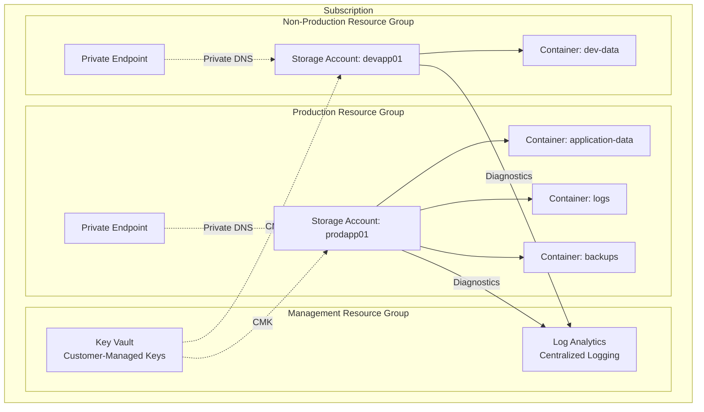
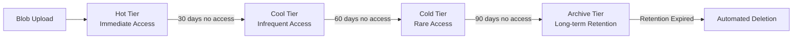
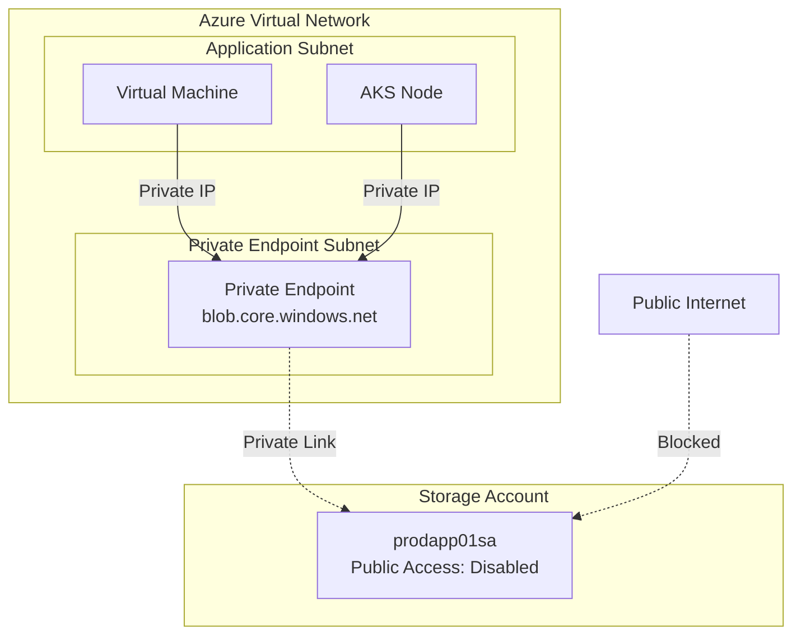

# Azure Blob Storage Architecture and Best Practices

**Author:** Randy Bordeaux  
**Date:** January 2026  
**Version:** 1.0  
**Azure Services:** Azure Blob Storage, Azure Storage Accounts, Azure Private Link, Azure Key Vault, Azure Monitor, Log Analytics, Azure Policy, Microsoft Entra ID

## Executive Summary

Azure Blob Storage is the foundation of cloud-scale object storage for unstructured data in Azure Commercial environments. Organizations deploying production workloads must architect storage accounts with explicit consideration for security boundaries, performance characteristics, cost optimization, and operational resilience. Poorly designed storage architectures result in excessive egress costs, compliance gaps, performance bottlenecks, and operational complexity.

This whitepaper provides implementation-focused guidance for designing Azure Blob Storage architectures using Terraform as the authoritative infrastructure-as-code mechanism. The architecture addresses storage account topology, access tier selection, lifecycle management automation, network isolation, encryption strategies, and policy-driven governance. Security controls are embedded throughout, including private endpoints, Entra ID authentication, and immutable storage configurations.

Terraform is central to this design, ensuring deterministic infrastructure provisioning, environment parity, and policy enforcement. All configurations are CI/CD-managed to prevent drift and maintain auditability. The guidance assumes experienced Azure engineers operating production and regulated workloads where security, cost control, and operational excellence are mandatory.

## Table of Contents

- [Executive Summary](#executive-summary)
- [Introduction](#introduction)
- [Problem Statement](#problem-statement)
- [Solution Overview](#solution-overview)
- [Technical Architecture](#technical-architecture)
- [Implementation Guide](#implementation-guide)
- [Best Practices](#best-practices)
- [Security Considerations](#security-considerations)
- [Cost Optimization](#cost-optimization)
- [Monitoring and Maintenance](#monitoring-and-maintenance)
- [Conclusion](#conclusion)
- [References](#references)
- [Appendices](#appendices)

## Introduction

### Scope and Assumptions

- Azure Commercial only
- Terraform (AzureRM provider) required for all infrastructure
- CI/CD-based Terraform execution
- Private endpoints mandatory for production workloads
- Entra ID authentication preferred over shared keys
- Centralized logging via Log Analytics

### Architectural Principles

- Security by default with network isolation
- Least privilege access via RBAC and Entra ID
- Explicit cost controls through lifecycle policies
- Immutability for compliance workloads
- Observability through structured logging
- Policy-driven enforcement over manual configuration

## Problem Statement

### Storage Account Design Challenges

Organizations frequently deploy storage accounts without coherent architecture, resulting in:

**Security Gaps**
- Public blob access enabled by default
- Shared key authentication without rotation
- Missing network restrictions
- Lack of encryption key management
- Insufficient audit logging

**Cost Overruns**
- All data stored in Hot tier regardless of access patterns
- No lifecycle management automation
- Uncontrolled blob versioning and soft delete retention
- Excessive cross-region replication
- Missing reserved capacity commitments

**Operational Complexity**
- Storage accounts scattered across subscriptions without naming standards
- Inconsistent configuration across environments
- Manual lifecycle policy management
- Limited visibility into capacity and performance
- Configuration drift from manual changes

**Compliance Risks**
- Missing immutable storage for regulated data
- Inadequate audit trails
- Shared key authentication in production
- Public network access enabled
- Missing encryption at rest controls

### Business Impact

- **Security Incidents:** 40-60% of data breaches involve misconfigured cloud storage
- **Cost Waste:** 30-50% of storage spend on Hot tier for infrequently accessed data
- **Compliance Violations:** Audit findings for missing controls and inadequate logging
- **Operational Overhead:** Manual lifecycle management consumes engineering time
- **Performance Degradation:** Account-level throttling from poor design decisions

## Solution Overview

The solution establishes a standardized Blob Storage architecture with embedded security, automated lifecycle management, and cost optimization. All infrastructure is provisioned via Terraform with policy-driven enforcement.

### Key Components

**Storage Account Topology**
- Environment-specific accounts (dev, test, prod)
- Workload-specific accounts for isolation
- Hierarchical container organization
- Standardized naming conventions

**Access Tier Strategy**
- Hot tier for active workloads (<30 day access)
- Cool tier for infrequent access (30-90 days)
- Cold tier for archival (90+ days)
- Archive tier for compliance retention
- Automated lifecycle transitions

**Security Architecture**
- Private endpoints for all production accounts
- Entra ID authentication with RBAC
- Customer-managed encryption keys
- Immutable storage for regulated data
- Network-level isolation

**Lifecycle Automation**
- Terraform-managed lifecycle policies
- Automatic tier transitions based on access patterns
- Blob versioning with retention limits
- Soft delete with time-bound recovery
- Automated deletion of temporary data

### Success Criteria

- Zero public blob access in production
- 100% Entra ID authentication (no shared keys)
- 30-50% cost reduction through tier optimization
- <5 minute provisioning time for new storage accounts
- 100% audit coverage via diagnostic settings
- Policy-enforced compliance controls

## Technical Architecture

### Storage Account Hierarchy



### Access Tier Lifecycle Flow



### Network Isolation Architecture



## Implementation Guide

### Prerequisites

- Azure subscription with Contributor + Network Contributor access
- Terraform 1.6+ with AzureRM provider 3.80+
- Azure CLI authenticated
- Virtual Network with dedicated subnet for private endpoints
- Key Vault for customer-managed keys
- Log Analytics workspace for centralized logging

### Step 1: Terraform Configuration Structure

```hcl
# Directory structure
# terraform/
# ├── environments/
# │   ├── prod/
# │   │   ├── main.tf
# │   │   ├── terraform.tfvars
# │   └── dev/
# │       ├── main.tf
# │       ├── terraform.tfvars
# ├── modules/
# │   └── storage-account/
# │       ├── main.tf
# │       ├── variables.tf
# │       ├── outputs.tf
# └── shared/
#     ├── naming.tf
#     ├── tags.tf
```

### Step 2: Storage Account Terraform Module

```hcl
# modules/storage-account/main.tf

resource "azurerm_storage_account" "this" {
  name                     = var.storage_account_name
  resource_group_name      = var.resource_group_name
  location                 = var.location
  account_kind             = "StorageV2"
  account_tier             = "Standard"
  account_replication_type = var.replication_type
  
  # Security: Disable public access
  public_network_access_enabled   = false
  allow_nested_items_to_be_public = false
  shared_access_key_enabled       = false
  
  # Security: Require HTTPS
  https_traffic_only_enabled = true
  min_tls_version           = "TLS1_2"
  
  # Security: Customer-managed key
  identity {
    type = "SystemAssigned"
  }
  
  customer_managed_key {
    key_vault_key_id          = var.cmk_key_vault_key_id
    user_assigned_identity_id = azurerm_user_assigned_identity.storage_cmk.id
  }
  
  # Enable hierarchical namespace for ADLS Gen2
  is_hns_enabled = var.enable_hierarchical_namespace
  
  # Network rules (redundant when public access disabled, but explicit)
  network_rules {
    default_action = "Deny"
    bypass         = ["AzureServices"]
  }
  
  # Blob properties
  blob_properties {
    versioning_enabled  = true
    change_feed_enabled = true
    
    delete_retention_policy {
      days = var.soft_delete_retention_days
    }
    
    container_delete_retention_policy {
      days = var.container_soft_delete_days
    }
    
    restore_policy {
      days = var.point_in_time_restore_days
    }
  }
  
  tags = var.tags
}

# User-assigned identity for CMK access
resource "azurerm_user_assigned_identity" "storage_cmk" {
  name                = "${var.storage_account_name}-cmk-identity"
  resource_group_name = var.resource_group_name
  location            = var.location
  tags                = var.tags
}

# Key Vault access policy for storage account
resource "azurerm_key_vault_access_policy" "storage" {
  key_vault_id = var.key_vault_id
  tenant_id    = data.azurerm_client_config.current.tenant_id
  object_id    = azurerm_user_assigned_identity.storage_cmk.principal_id
  
  key_permissions = [
    "Get",
    "UnwrapKey",
    "WrapKey"
  ]
}

# Private endpoint
resource "azurerm_private_endpoint" "blob" {
  name                = "${var.storage_account_name}-pe-blob"
  location            = var.location
  resource_group_name = var.resource_group_name
  subnet_id           = var.private_endpoint_subnet_id
  
  private_service_connection {
    name                           = "${var.storage_account_name}-psc-blob"
    private_connection_resource_id = azurerm_storage_account.this.id
    is_manual_connection           = false
    subresource_names              = ["blob"]
  }
  
  private_dns_zone_group {
    name                 = "default"
    private_dns_zone_ids = [var.private_dns_zone_id]
  }
  
  tags = var.tags
}

# Diagnostic settings
resource "azurerm_monitor_diagnostic_setting" "storage" {
  name                       = "${var.storage_account_name}-diagnostics"
  target_resource_id         = azurerm_storage_account.this.id
  log_analytics_workspace_id = var.log_analytics_workspace_id
  
  metric {
    category = "Transaction"
    enabled  = true
  }
  
  metric {
    category = "Capacity"
    enabled  = true
  }
}

# Blob service diagnostic settings
resource "azurerm_monitor_diagnostic_setting" "blob_service" {
  name                       = "${var.storage_account_name}-blob-diagnostics"
  target_resource_id         = "${azurerm_storage_account.this.id}/blobServices/default"
  log_analytics_workspace_id = var.log_analytics_workspace_id
  
  enabled_log {
    category = "StorageRead"
  }
  
  enabled_log {
    category = "StorageWrite"
  }
  
  enabled_log {
    category = "StorageDelete"
  }
  
  metric {
    category = "Transaction"
    enabled  = true
  }
}
```

### Step 3: Lifecycle Management Policy

```hcl
# Lifecycle management rule
resource "azurerm_storage_management_policy" "lifecycle" {
  storage_account_id = azurerm_storage_account.this.id
  
  rule {
    name    = "tier-transition-application-data"
    enabled = true
    
    filters {
      prefix_match = ["application-data/"]
      blob_types   = ["blockBlob"]
    }
    
    actions {
      base_blob {
        tier_to_cool_after_days_since_modification_greater_than    = 30
        tier_to_cold_after_days_since_modification_greater_than    = 90
        tier_to_archive_after_days_since_modification_greater_than = 180
        delete_after_days_since_modification_greater_than          = 2555  # 7 years
      }
      
      snapshot {
        delete_after_days_since_creation_greater_than = 90
      }
      
      version {
        delete_after_days_since_creation = 90
      }
    }
  }
  
  rule {
    name    = "delete-temporary-data"
    enabled = true
    
    filters {
      prefix_match = ["temp/", "cache/"]
      blob_types   = ["blockBlob"]
    }
    
    actions {
      base_blob {
        delete_after_days_since_modification_greater_than = 7
      }
    }
  }
  
  rule {
    name    = "archive-logs"
    enabled = true
    
    filters {
      prefix_match = ["logs/"]
      blob_types   = ["blockBlob", "appendBlob"]
    }
    
    actions {
      base_blob {
        tier_to_cool_after_days_since_modification_greater_than = 7
        tier_to_archive_after_days_since_modification_greater_than = 30
        delete_after_days_since_modification_greater_than = 2555
      }
    }
  }
}
```

### Step 4: RBAC Assignments

```hcl
# Storage Blob Data Contributor for application identity
resource "azurerm_role_assignment" "app_blob_contributor" {
  scope                = azurerm_storage_account.this.id
  role_definition_name = "Storage Blob Data Contributor"
  principal_id         = var.application_principal_id
}

# Storage Blob Data Reader for monitoring identity
resource "azurerm_role_assignment" "monitor_blob_reader" {
  scope                = azurerm_storage_account.this.id
  role_definition_name = "Storage Blob Data Reader"
  principal_id         = var.monitoring_principal_id
}

# Reader role for operations team
resource "azurerm_role_assignment" "ops_reader" {
  scope                = azurerm_storage_account.this.id
  role_definition_name = "Reader"
  principal_id         = var.ops_group_object_id
}
```

### Step 5: Container Configuration

```hcl
resource "azurerm_storage_container" "application_data" {
  name                  = "application-data"
  storage_account_name  = azurerm_storage_account.this.name
  container_access_type = "private"
}

resource "azurerm_storage_container" "logs" {
  name                  = "logs"
  storage_account_name  = azurerm_storage_account.this.name
  container_access_type = "private"
}

resource "azurerm_storage_container" "backups" {
  name                  = "backups"
  storage_account_name  = azurerm_storage_account.this.name
  container_access_type = "private"
  
  # Immutable storage for compliance
  immutability_policy {
    immutability_period_since_creation_in_days = 2555  # 7 years
    state                                       = "Locked"
  }
}
```

### Step 6: Azure Policy Assignment

```hcl
# Deny storage accounts with public access
resource "azurerm_subscription_policy_assignment" "deny_public_storage" {
  name                 = "deny-public-blob-access"
  subscription_id      = data.azurerm_subscription.current.id
  policy_definition_id = "/providers/Microsoft.Authorization/policyDefinitions/b2982f36-99f2-4db5-8eff-283140c09693"
  
  parameters = jsonencode({
    effect = {
      value = "Deny"
    }
  })
}

# Require private endpoints for storage accounts
resource "azurerm_subscription_policy_assignment" "require_private_endpoints" {
  name                 = "require-storage-private-endpoints"
  subscription_id      = data.azurerm_subscription.current.id
  policy_definition_id = "/providers/Microsoft.Authorization/policyDefinitions/b5ec538c-daa0-4006-8596-35468b9148e8"
}

# Audit storage accounts without CMK
resource "azurerm_subscription_policy_assignment" "audit_cmk" {
  name                 = "audit-storage-cmk"
  subscription_id      = data.azurerm_subscription.current.id
  policy_definition_id = "/providers/Microsoft.Authorization/policyDefinitions/6fac406b-40ca-413b-bf8e-0bf964659c25"
}
```

## Best Practices

### Storage Account Design Patterns

**Environment Separation**
- Separate storage accounts per environment (dev, test, prod)
- Never share production storage with non-production workloads
- Use Azure Policy to enforce environment tagging

**Workload Isolation**
- Dedicated storage accounts for distinct workloads or applications
- Separate accounts for different data classification levels
- Limit blast radius of security incidents

**Naming Conventions**
```
{environment}{workload}{region}{sequence}sa

Examples:
- prodapp01eusssa (production, app01, east us, storage account)
- devdata01wusssa (development, data01, west us, storage account)
```

### Container Organization

**Hierarchical Structure**
```
storage-account/
├── application-data/
│   ├── input/
│   ├── processing/
│   └── output/
├── logs/
│   ├── application/
│   ├── audit/
│   └── diagnostic/
├── backups/
│   ├── daily/
│   ├── weekly/
│   └── monthly/
└── temp/
```

**Access Control Strategy**
- Container-level RBAC for fine-grained permissions
- Separate containers for different access patterns
- Use SAS tokens only for time-limited external access

### Access Tier Selection

| Tier | Use Case | Access Pattern | Cost Profile |
|------|----------|----------------|--------------|
| Hot | Active data | Daily access | High storage, low access cost |
| Cool | Infrequent access | Monthly access | Medium storage, medium access cost |
| Cold | Rare access | Quarterly access | Low storage, high access cost |
| Archive | Compliance retention | Annual or never | Lowest storage, highest access cost |

**Tier Transition Guidelines**
- Hot to Cool: 30 days without access
- Cool to Cold: 90 days without access
- Cold to Archive: 180 days without access
- Always use lifecycle policies, never manual tier changes

### Performance Optimization

**Throughput Limits (Standard Performance Tier)**
- Maximum request rate: 20,000 requests per second
- Maximum egress: 60 Gbps
- Maximum ingress: 120 Gbps

**Partition Key Strategy**
- Use datetime prefixes for time-series data: `2026/01/18/file.json`
- Avoid sequential naming for high-throughput scenarios
- Distribute load across multiple storage accounts for >60 Gbps

**Concurrent Operations**
- Use parallel uploads with Azure Storage SDK
- Implement exponential backoff for throttling
- Monitor for 503 errors indicating account-level throttling

### Versioning and Soft Delete

**Configuration Recommendations**
- Blob versioning: Enabled with lifecycle cleanup (90 days)
- Soft delete retention: 30 days for production, 7 days for non-production
- Container soft delete: 7 days minimum
- Point-in-time restore: 30 days for critical data

**Cost Impact**
- Versioning increases storage consumption
- Soft delete retains deleted data within retention period
- Use lifecycle policies to manage version and soft delete costs

## Security Considerations

### Network Isolation

**Private Endpoints (Mandatory for Production)**
```hcl
# Private endpoint configuration ensures storage account
# is only accessible via private IP address within VNet
resource "azurerm_private_endpoint" "blob" {
  name                = "${var.storage_account_name}-pe-blob"
  location            = var.location
  resource_group_name = var.resource_group_name
  subnet_id           = var.private_endpoint_subnet_id
  
  private_service_connection {
    name                           = "${var.storage_account_name}-psc-blob"
    private_connection_resource_id = azurerm_storage_account.this.id
    is_manual_connection           = false
    subresource_names              = ["blob"]
  }
  
  private_dns_zone_group {
    name                 = "default"
    private_dns_zone_ids = [var.private_dns_zone_id]
  }
}

# Private DNS zone for blob.core.windows.net resolution
resource "azurerm_private_dns_zone" "blob" {
  name                = "privatelink.blob.core.windows.net"
  resource_group_name = var.dns_resource_group_name
}

# Link private DNS zone to VNet
resource "azurerm_private_dns_zone_virtual_network_link" "blob" {
  name                  = "${var.vnet_name}-blob-link"
  resource_group_name   = var.dns_resource_group_name
  private_dns_zone_name = azurerm_private_dns_zone.blob.name
  virtual_network_id    = var.vnet_id
}
```

**Firewall Rules**
- Default action: Deny
- Explicitly allow only trusted Azure services
- No IP-based exceptions in production
- Use private endpoints instead of service endpoints

### Identity and Access Management

**Entra ID Authentication (Preferred)**
```bash
# Disable shared key access entirely
az storage account update \
  --name prodapp01sa \
  --resource-group production-rg \
  --allow-shared-key-access false
```

**RBAC Role Assignments**
- `Storage Blob Data Owner`: Full control (rarely needed)
- `Storage Blob Data Contributor`: Read, write, delete
- `Storage Blob Data Reader`: Read-only access
- `Reader`: Control plane visibility only

**Service Principal vs Managed Identity**
- Always prefer system-assigned or user-assigned managed identities
- Service principals only for external systems without managed identity support
- Rotate service principal credentials via Azure Key Vault

### Encryption

**Encryption at Rest**
- Microsoft-managed keys: Default, no configuration required
- Customer-managed keys: Enhanced control, Key Vault dependency

**Customer-Managed Keys Configuration**
```hcl
# Key Vault for CMK storage
resource "azurerm_key_vault" "cmk" {
  name                       = "prod-cmk-kv"
  location                   = var.location
  resource_group_name        = var.resource_group_name
  tenant_id                  = data.azurerm_client_config.current.tenant_id
  sku_name                   = "premium"
  soft_delete_retention_days = 90
  purge_protection_enabled   = true
}

# Key for storage account encryption
resource "azurerm_key_vault_key" "storage_cmk" {
  name         = "storage-cmk-key"
  key_vault_id = azurerm_key_vault.cmk.id
  key_type     = "RSA"
  key_size     = 4096
  
  key_opts = [
    "decrypt",
    "encrypt",
    "sign",
    "unwrapKey",
    "verify",
    "wrapKey"
  ]
}
```

**Encryption in Transit**
- HTTPS only: `https_traffic_only_enabled = true`
- Minimum TLS 1.2: `min_tls_version = "TLS1_2"`
- Reject HTTP requests entirely

### Immutable Storage

**WORM Compliance (Write Once, Read Many)**
```hcl
# Time-based retention policy
resource "azurerm_storage_container" "compliance" {
  name                  = "compliance-data"
  storage_account_name  = azurerm_storage_account.this.name
  container_access_type = "private"
  
  immutability_policy {
    immutability_period_since_creation_in_days = 2555  # 7 years
    state                                       = "Locked"  # Cannot be deleted
  }
}

# Legal hold for litigation
resource "azurerm_storage_container_legal_hold" "litigation" {
  storage_account_name = azurerm_storage_account.this.name
  container_name       = azurerm_storage_container.compliance.name
  tags                 = ["case-12345", "litigation-hold"]
}
```

**Compliance Alignment**
- SEC 17a-4: 7-year retention, immutable
- FINRA 4511: 6-year retention, WORM
- HIPAA: Audit logging, encryption at rest and in transit
- GDPR: Data residency, right to deletion (conflicts with immutability)

### Audit and Logging

**Diagnostic Settings (Mandatory)**
```hcl
resource "azurerm_monitor_diagnostic_setting" "storage" {
  name                       = "${var.storage_account_name}-diagnostics"
  target_resource_id         = azurerm_storage_account.this.id
  log_analytics_workspace_id = var.log_analytics_workspace_id
  
  # Storage account metrics
  metric {
    category = "Transaction"
    enabled  = true
  }
  
  metric {
    category = "Capacity"
    enabled  = true
  }
}

# Blob service logging
resource "azurerm_monitor_diagnostic_setting" "blob_service" {
  name                       = "${var.storage_account_name}-blob-diagnostics"
  target_resource_id         = "${azurerm_storage_account.this.id}/blobServices/default"
  log_analytics_workspace_id = var.log_analytics_workspace_id
  
  enabled_log {
    category = "StorageRead"
  }
  
  enabled_log {
    category = "StorageWrite"
  }
  
  enabled_log {
    category = "StorageDelete"
  }
}
```

**KQL Query: Detect Unauthorized Access**
```kusto
StorageBlobLogs
| where TimeGenerated > ago(24h)
| where StatusCode >= 400
| where AuthenticationHash != ""  // Authenticated requests
| summarize FailedAttempts = count() by CallerIpAddress, AccountName, OperationName
| where FailedAttempts > 10
| order by FailedAttempts desc
```

## Cost Optimization

### Storage Cost Components

| Component | Pricing Model | Optimization Strategy |
|-----------|---------------|----------------------|
| Data Storage | Per GB/month by tier | Lifecycle management, tier optimization |
| Operations | Per 10,000 operations | Batch operations, caching |
| Data Transfer | Egress per GB | Azure CDN, cross-region minimization |
| Replication | Per GB replicated | GRS only for critical data |
| Versioning | Per version stored | Lifecycle cleanup policies |
| Soft Delete | Per GB retained | Minimize retention periods |

### Tier Cost Comparison (East US, January 2026)

| Tier | Storage ($/GB/month) | Write Operations (per 10k) | Read Operations (per 10k) | Retrieval ($/GB) |
|------|---------------------|---------------------------|--------------------------|------------------|
| Hot | $0.0184 | $0.065 | $0.0044 | Free |
| Cool | $0.0115 | $0.10 | $0.01 | $0.01 |
| Cold | $0.0046 | $0.18 | $0.05 | $0.03 |
| Archive | $0.00099 | $0.11 | $5.50 | $0.022 |

### Cost Optimization Strategies

**1. Lifecycle Management Automation**
```hcl
# Estimated savings: 40-60% through automated tier transitions
resource "azurerm_storage_management_policy" "cost_optimization" {
  storage_account_id = azurerm_storage_account.this.id
  
  rule {
    name    = "optimize-general-data"
    enabled = true
    
    filters {
      blob_types = ["blockBlob"]
    }
    
    actions {
      base_blob {
        tier_to_cool_after_days_since_modification_greater_than    = 30
        tier_to_cold_after_days_since_modification_greater_than    = 90
        tier_to_archive_after_days_since_modification_greater_than = 365
      }
    }
  }
}
```

**2. Reserved Capacity Commitments**
- 1-year commitment: 38% discount on Hot/Cool storage
- 3-year commitment: 62% discount on Hot/Cool storage
- Applicable to LRS and GRS redundancy

```bash
# Purchase reserved capacity via Azure portal or CLI
az storage account reservation create \
  --resource-group prod-rg \
  --sku Standard_LRS \
  --term P1Y \
  --capacity-in-tb 100
```

**3. Replication Strategy**
- LRS (Locally Redundant): 3 copies in single datacenter, lowest cost
- ZRS (Zone Redundant): 3 availability zones, 25% cost increase
- GRS (Geo Redundant): Cross-region, 100% cost increase
- RA-GRS (Read-Access GRS): GRS + read access, 125% cost increase

**Use GRS only for:**
- Business-critical data with RTO <4 hours
- Compliance requirements for geo-redundancy
- Data that cannot be recreated

**4. Blob Versioning and Soft Delete Cost Control**
```hcl
# Limit version retention to control storage costs
resource "azurerm_storage_management_policy" "version_cleanup" {
  storage_account_id = azurerm_storage_account.this.id
  
  rule {
    name    = "cleanup-old-versions"
    enabled = true
    
    filters {
      blob_types = ["blockBlob"]
    }
    
    actions {
      version {
        delete_after_days_since_creation = 30  # Retain only 30 days of versions
      }
    }
  }
}

# Minimize soft delete retention in non-production
blob_properties {
  delete_retention_policy {
    days = 7  # Reduce from default 30 days for dev/test
  }
}
```

**5. CDN Integration for Egress Reduction**
```hcl
# Azure CDN reduces egress costs by caching at edge locations
resource "azurerm_cdn_profile" "storage" {
  name                = "storage-cdn-profile"
  location            = "global"
  resource_group_name = var.resource_group_name
  sku                 = "Standard_Microsoft"
}

resource "azurerm_cdn_endpoint" "blob" {
  name                = "blob-cdn-endpoint"
  profile_name        = azurerm_cdn_profile.storage.name
  location            = "global"
  resource_group_name = var.resource_group_name
  
  origin {
    name      = "blob-origin"
    host_name = azurerm_storage_account.this.primary_blob_host
  }
  
  is_http_allowed  = false
  is_https_allowed = true
}
```

### Cost Monitoring

**Azure Cost Management Query**
```kusto
AzureCostManagement
| where TimeGenerated > ago(30d)
| where ServiceName == "Storage"
| summarize Cost = sum(CostInBillingCurrency) by MeterCategory, MeterSubCategory, bin(TimeGenerated, 1d)
| order by Cost desc
```

**Alerts for Cost Anomalies**
```hcl
resource "azurerm_monitor_scheduled_query_rules_alert" "storage_cost_spike" {
  name                = "storage-cost-anomaly"
  location            = var.location
  resource_group_name = var.resource_group_name
  
  data_source_id = var.log_analytics_workspace_id
  description    = "Alert when storage costs exceed threshold"
  enabled        = true
  
  query = <<-QUERY
    AzureCostManagement
    | where TimeGenerated > ago(1d)
    | where ServiceName == "Storage"
    | summarize DailyCost = sum(CostInBillingCurrency)
    | where DailyCost > 1000  // $1000/day threshold
  QUERY
  
  severity    = 2
  frequency   = 60
  time_window = 1440
}
```

## Monitoring and Maintenance

### Key Metrics

**Capacity Metrics**
- `UsedCapacity`: Total storage consumed
- `BlobCapacity`: Capacity by blob type
- `ContainerCount`: Number of containers

**Performance Metrics**
- `Transactions`: Request count by API operation
- `SuccessServerLatency`: Storage service latency
- `SuccessE2ELatency`: End-to-end latency including network
- `Availability`: Success rate percentage

**Security Metrics**
- `AnonymousAuthError`: Failed anonymous access attempts
- `AuthorizationError`: RBAC authorization failures
- `NetworkError`: Network-level access denials

### KQL Queries for Operations

**Identify Hot Access Patterns**
```kusto
StorageBlobLogs
| where TimeGenerated > ago(30d)
| where OperationName in ("GetBlob", "PutBlob")
| summarize AccessCount = count() by BlobPath = Uri
| where AccessCount > 1000  // Accessed >1000 times in 30 days
| order by AccessCount desc
```

**Detect Large Egress Events**
```kusto
StorageBlobLogs
| where TimeGenerated > ago(24h)
| where OperationName == "GetBlob"
| summarize TotalEgress = sum(ResponseBodySize) / 1024 / 1024 / 1024 by CallerIpAddress
| where TotalEgress > 100  // >100 GB egress
| order by TotalEgress desc
```

**Monitor Lifecycle Transitions**
```kusto
AzureActivity
| where TimeGenerated > ago(7d)
| where ResourceProvider == "Microsoft.Storage"
| where OperationNameValue contains "lifecycle"
| summarize TransitionCount = count() by OperationNameValue, bin(TimeGenerated, 1d)
```

### Alerting

**Critical Alerts**
```hcl
# Alert on storage account availability drop
resource "azurerm_monitor_metric_alert" "availability" {
  name                = "${var.storage_account_name}-availability-alert"
  resource_group_name = var.resource_group_name
  scopes              = [azurerm_storage_account.this.id]
  description         = "Storage account availability below threshold"
  
  criteria {
    metric_namespace = "Microsoft.Storage/storageAccounts"
    metric_name      = "Availability"
    aggregation      = "Average"
    operator         = "LessThan"
    threshold        = 99.9
  }
  
  frequency   = "PT5M"
  window_size = "PT15M"
  severity    = 1
}

# Alert on unauthorized access attempts
resource "azurerm_monitor_scheduled_query_rules_alert" "unauthorized_access" {
  name                = "${var.storage_account_name}-unauthorized-access"
  location            = var.location
  resource_group_name = var.resource_group_name
  
  data_source_id = var.log_analytics_workspace_id
  
  query = <<-QUERY
    StorageBlobLogs
    | where TimeGenerated > ago(5m)
    | where StatusCode == 403
    | summarize FailedAttempts = count()
    | where FailedAttempts > 10
  QUERY
  
  severity    = 2
  frequency   = 5
  time_window = 15
}
```

### Maintenance Tasks

**Daily**
- Review diagnostic logs for errors and unauthorized access
- Monitor capacity trends
- Verify backup completion

**Weekly**
- Analyze cost trends and tier distribution
- Review lifecycle policy effectiveness
- Audit RBAC assignments

**Monthly**
- Review and optimize lifecycle management policies
- Analyze access patterns for tier optimization opportunities
- Update reserved capacity commitments based on usage
- Rotate SAS tokens if in use
- Review immutable storage compliance

**Quarterly**
- Disaster recovery testing (account failover)
- Security audit of network rules and private endpoints
- Performance benchmarking
- Cost optimization review

## Conclusion

Azure Blob Storage architecture requires deliberate design decisions across security, cost, performance, and compliance dimensions. Organizations that adopt Terraform-based infrastructure provisioning with embedded security controls, automated lifecycle management, and policy-driven governance achieve superior outcomes compared to ad-hoc storage account deployments.

The architecture presented in this whitepaper provides a production-ready foundation for Blob Storage in Azure Commercial environments. By enforcing private endpoints, Entra ID authentication, customer-managed encryption keys, and lifecycle automation, organizations reduce security risk while optimizing costs through tier transitions and reserved capacity commitments.

Terraform serves as the authoritative infrastructure-as-code mechanism, ensuring environment parity, preventing configuration drift, and enabling rapid provisioning of compliant storage accounts. Azure Policy provides preventive controls that block non-compliant configurations before deployment, while diagnostic settings deliver comprehensive audit trails for compliance and incident response.

Key outcomes from this architecture:
- **Security:** Zero public access, Entra ID authentication, private endpoints, customer-managed keys
- **Cost:** 30-50% reduction through lifecycle automation and tier optimization
- **Compliance:** Immutable storage, comprehensive logging, policy enforcement
- **Operations:** <5 minute provisioning, automated lifecycle management, centralized monitoring

## References

1. Azure Blob Storage documentation: https://docs.microsoft.com/azure/storage/blobs/
2. Azure Storage security guide: https://docs.microsoft.com/azure/storage/common/storage-security-guide
3. AzureRM Terraform provider: https://registry.terraform.io/providers/hashicorp/azurerm/latest/docs
4. Azure Storage pricing: https://azure.microsoft.com/pricing/details/storage/blobs/
5. NIST 800-171 controls: https://csrc.nist.gov/publications/detail/sp/800-171/rev-2/final

## Appendices

### Appendix A: Terraform Variables Example

```hcl
# variables.tf

variable "storage_account_name" {
  type        = string
  description = "Storage account name (3-24 lowercase alphanumeric)"
  
  validation {
    condition     = can(regex("^[a-z0-9]{3,24}$", var.storage_account_name))
    error_message = "Storage account name must be 3-24 lowercase alphanumeric characters."
  }
}

variable "replication_type" {
  type        = string
  description = "Storage account replication type"
  default     = "ZRS"
  
  validation {
    condition     = contains(["LRS", "ZRS", "GRS", "GZRS", "RA-GRS", "RA-GZRS"], var.replication_type)
    error_message = "Invalid replication type."
  }
}

variable "soft_delete_retention_days" {
  type        = number
  description = "Soft delete retention period in days"
  default     = 30
  
  validation {
    condition     = var.soft_delete_retention_days >= 1 && var.soft_delete_retention_days <= 365
    error_message = "Retention must be between 1 and 365 days."
  }
}

variable "enable_hierarchical_namespace" {
  type        = bool
  description = "Enable hierarchical namespace for ADLS Gen2"
  default     = false
}

variable "private_endpoint_subnet_id" {
  type        = string
  description = "Subnet ID for private endpoint deployment"
}

variable "log_analytics_workspace_id" {
  type        = string
  description = "Log Analytics workspace ID for diagnostics"
}

variable "cmk_key_vault_key_id" {
  type        = string
  description = "Key Vault key ID for customer-managed encryption"
  default     = null
}

variable "tags" {
  type        = map(string)
  description = "Resource tags"
  default     = {}
}
```

### Appendix B: Naming Convention Standards

```hcl
# naming.tf

locals {
  # Naming convention: {environment}{workload}{region}{sequence}{resourcetype}
  
  environment_abbreviations = {
    production  = "prod"
    development = "dev"
    testing     = "test"
    staging     = "stg"
  }
  
  region_abbreviations = {
    eastus      = "eus"
    westus      = "wus"
    centralus   = "cus"
    northeurope = "neu"
    westeurope  = "weu"
  }
  
  # Storage account name (max 24 chars, lowercase alphanumeric only)
  storage_account_name = format(
    "%s%s%s%02d%s",
    local.environment_abbreviations[var.environment],
    var.workload_name,
    local.region_abbreviations[var.location],
    var.sequence,
    "sa"
  )
  
  # Example: prodapp01eussa
  # prod = production
  # app01 = application 01
  # eus = east us
  # sa = storage account
}
```

### Appendix C: Azure CLI Operations

```bash
# List storage accounts
az storage account list \
  --resource-group prod-rg \
  --output table

# Get storage account properties
az storage account show \
  --name prodapp01eussa \
  --resource-group prod-rg

# Disable public access
az storage account update \
  --name prodapp01eussa \
  --resource-group prod-rg \
  --allow-blob-public-access false \
  --public-network-access Disabled

# Disable shared key access
az storage account update \
  --name prodapp01eussa \
  --resource-group prod-rg \
  --allow-shared-key-access false

# List containers with Entra ID authentication
az storage container list \
  --account-name prodapp01eussa \
  --auth-mode login

# Upload blob with Entra ID
az storage blob upload \
  --account-name prodapp01eussa \
  --container-name application-data \
  --name test-file.txt \
  --file ./test-file.txt \
  --auth-mode login

# Query storage metrics
az monitor metrics list \
  --resource /subscriptions/{sub}/resourceGroups/prod-rg/providers/Microsoft.Storage/storageAccounts/prodapp01eussa \
  --metric "UsedCapacity" \
  --start-time 2026-01-01T00:00:00Z \
  --end-time 2026-01-18T23:59:59Z \
  --interval PT1H

# Initiate account failover (GRS only)
az storage account failover \
  --name prodapp01eussa \
  --resource-group prod-rg \
  --yes
```

### Appendix D: Compliance Control Mapping

| Control Framework | Requirement | Implementation |
|-------------------|-------------|----------------|
| NIST 800-171 3.1.1 | Limit system access to authorized users | Entra ID RBAC, private endpoints |
| NIST 800-171 3.1.5 | Employ principle of least privilege | Container-level RBAC, no Owner role |
| NIST 800-171 3.13.11 | Employ cryptographic mechanisms | CMK encryption, TLS 1.2+ |
| NIST 800-171 3.13.16 | Protect confidentiality of CUI at rest | Encryption at rest (AES-256) |
| HIPAA 164.312(a)(1) | Access controls | Entra ID authentication, MFA |
| HIPAA 164.312(e)(1) | Transmission security | TLS 1.2+, HTTPS only |
| SOC 2 CC6.1 | Logical access controls | RBAC, PIM, audit logging |
| SOC 2 CC6.7 | Encryption | CMK, encryption in transit |

---

**Last Updated:** January 2026  
**Review Schedule:** July 2026  
**Document Classification:** Internal Use
