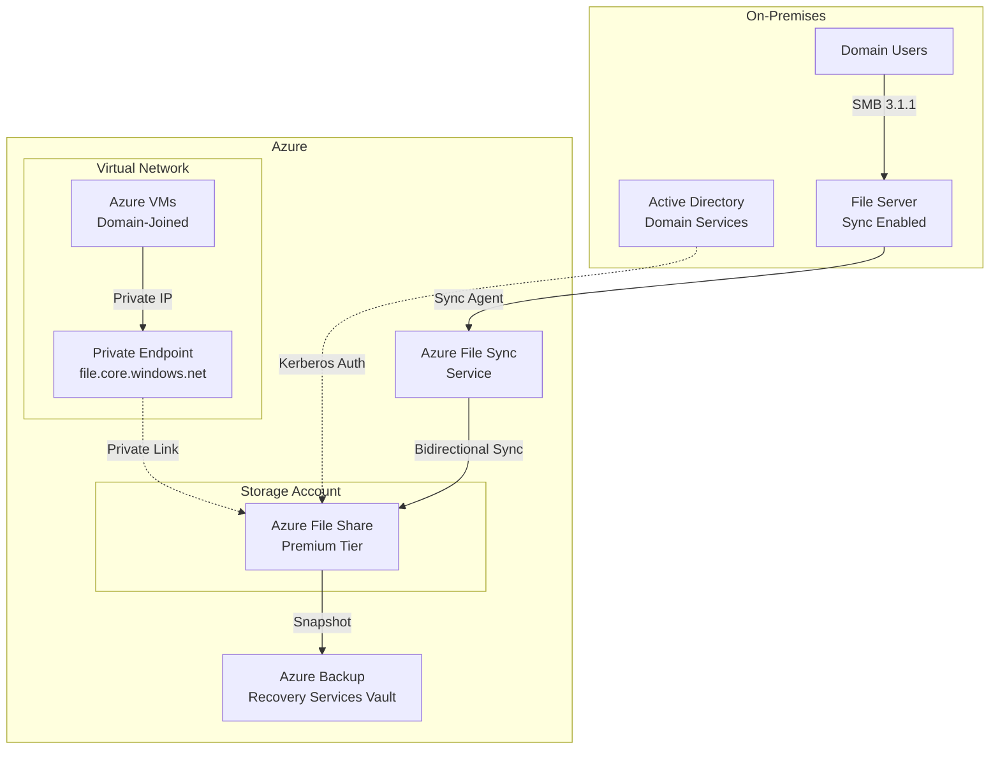
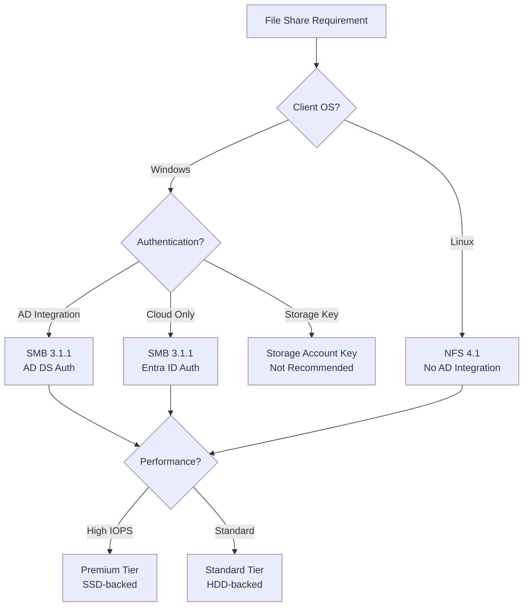
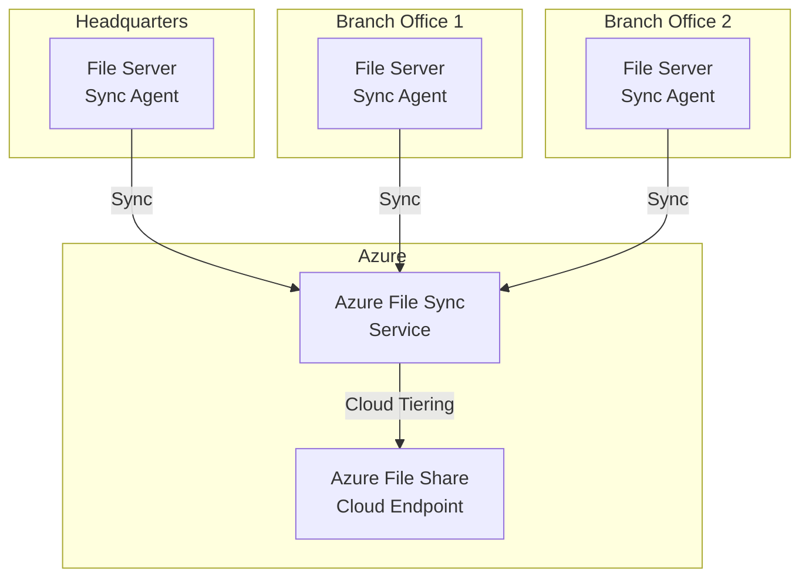

# Azure Files Enterprise Deployment Guide

**Author:** Randy Bordeaux  
**Date:** January 2026  
**Version:** 1.0  
**Azure Services:** Azure Files, Azure File Sync, Azure Private Link, Azure Backup, Microsoft Entra Domain Services, Active Directory Domain Services, Azure Monitor, Log Analytics

## Executive Summary

Azure Files provides fully managed file shares in the cloud accessible via SMB and NFS protocols. Enterprise workloads requiring shared file storage face challenges migrating from on-premises file servers due to authentication complexity, performance requirements, backup integration, and hybrid connectivity needs. Traditional lift-and-shift approaches using IaaS file servers introduce operational overhead, security gaps, and cost inefficiencies.

This whitepaper provides implementation-focused guidance for deploying Azure Files in enterprise environments using Terraform as the authoritative infrastructure-as-code mechanism. The architecture addresses protocol selection (SMB vs NFS), identity integration (AD DS, Entra ID DS), performance tier optimization, Azure File Sync for hybrid scenarios, and comprehensive security controls including private endpoints and encryption.

All infrastructure is provisioned via Terraform with CI/CD-based execution to ensure deterministic deployments and prevent configuration drift. Security is embedded throughout with private network access, identity-based authentication, encryption at rest with customer-managed keys, and comprehensive audit logging. The guidance assumes experienced Azure engineers operating production file sharing workloads where security, performance, and hybrid integration are mandatory.

## Table of Contents

- [Executive Summary](#executive-summary)
- [Introduction](#introduction)
- [Problem Statement](#problem-statement)
- [Solution Overview](#solution-overview)
- [Technical Architecture](#technical-architecture)
- [Implementation Guide](#implementation-guide)
- [Best Practices](#best-practices)
- [Security Considerations](#security-considerations)
- [Cost Optimization](#cost-optimization)
- [Monitoring and Maintenance](#monitoring-and-maintenance)
- [Conclusion](#conclusion)
- [References](#references)
- [Appendices](#appendices)

## Introduction

### Scope and Assumptions

- Azure Commercial only
- Terraform (AzureRM provider) mandatory for all infrastructure
- SMB 3.x and NFS 4.1 protocol support
- Identity integration via AD DS or Entra ID DS
- Private endpoint connectivity required for production
- Azure File Sync for hybrid scenarios
- Centralized logging via Log Analytics

### Architectural Principles

- Identity-based authentication (no storage account keys)
- Network isolation via private endpoints
- Performance tier selection aligned to workload requirements
- Hybrid integration via Azure File Sync where applicable
- Encryption at rest with customer-managed keys
- Comprehensive audit logging and monitoring
- Automated backup and disaster recovery

## Problem Statement

### Enterprise File Sharing Challenges

**On-Premises File Server Limitations**
- High capital expenditure for hardware and storage
- Manual capacity management and expansion
- Limited disaster recovery capabilities
- Complex backup and restore procedures
- Patch management and security updates
- Single points of failure without clustering

**IaaS File Server Drawbacks**
- Operational overhead of VM management
- OS and security patching responsibility
- Complex high availability configuration
- Backup and DR complexity
- Higher total cost of ownership
- Expanded compliance audit scope

**Authentication Complexity**
- Integration with existing Active Directory
- Kerberos authentication requirements
- ACL preservation during migration
- NTFS permission mapping
- Service account management

**Performance Requirements**
- IOPS and throughput for database workloads
- Latency-sensitive applications
- Concurrent user access
- Large file operations

### Business Impact

- **Operational Costs:** 40-60% higher TCO for IaaS file servers vs Azure Files
- **Security Risks:** Misconfigured file servers expose data to unauthorized access
- **Downtime:** Manual recovery processes result in extended RTO
- **Compliance Gaps:** Inconsistent backup and audit logging
- **Limited Scalability:** Capacity expansion requires extended downtime

## Solution Overview

The solution establishes Azure Files as a fully managed file sharing service with integrated identity authentication, hybrid connectivity via Azure File Sync, and comprehensive security controls. All infrastructure is provisioned via Terraform with policy-driven enforcement.

### Key Components

**Azure Files Storage Account**
- Premium or Standard performance tier
- SMB 3.1.1 with encryption in transit
- NFS 4.1 for Linux workloads
- Private endpoint connectivity
- Identity-based authentication

**Azure File Sync**
- Bidirectional sync between on-premises and Azure
- Cloud tiering for capacity optimization
- Multi-site sync topology
- Server endpoint health monitoring

**Identity Integration**
- AD DS integration for Kerberos authentication
- Entra ID DS for cloud-only scenarios
- RBAC for share-level permissions
- NTFS ACLs for file/folder permissions

**Backup and DR**
- Azure Backup for file share snapshots
- Cross-region replication for disaster recovery
- Point-in-time restore capabilities
- Automated backup policies

### Success Criteria

- Zero storage account key authentication
- 100% private endpoint connectivity
- <10ms latency for on-premises access via File Sync
- 99.9% availability SLA
- Automated daily backups with 30-day retention
- Complete audit trail via diagnostic settings

## Technical Architecture

### Azure Files with AD DS Integration



### Protocol Selection Decision Tree



### Hybrid Sync Topology



## Implementation Guide

### Prerequisites

- Azure subscription with Contributor access
- Terraform 1.6+ with AzureRM provider 3.80+
- Active Directory Domain Services (for AD integration)
- Virtual Network with private endpoint subnet
- Log Analytics workspace
- Recovery Services Vault for backups

### Step 1: Storage Account for Azure Files

```hcl
# modules/azure-files/main.tf

resource "azurerm_storage_account" "files" {
  name                     = var.storage_account_name
  resource_group_name      = var.resource_group_name
  location                 = var.location
  account_kind             = "FileStorage"  # Premium performance
  account_tier             = "Premium"
  account_replication_type = "ZRS"  # Zone-redundant
  
  # Security: Disable public access
  public_network_access_enabled   = false
  shared_access_key_enabled       = false  # Require identity-based auth
  
  # Security: Require HTTPS and TLS 1.2
  https_traffic_only_enabled = true
  min_tls_version           = "TLS1_2"
  
  # Enable large file shares (up to 100 TiB)
  large_file_share_enabled = true
  
  # Identity for customer-managed keys
  identity {
    type = "SystemAssigned"
  }
  
  # Azure Files specific settings
  azure_files_authentication {
    directory_type = "AD"  # Active Directory DS
  }
  
  tags = var.tags
}

# Premium file share
resource "azurerm_storage_share" "premium" {
  name                 = var.share_name
  storage_account_name = azurerm_storage_account.files.name
  quota                = var.share_quota_gb  # 100 GB minimum for Premium
  enabled_protocol     = "SMB"
  
  acl {
    id = "access-policy-1"
    
    access_policy {
      permissions = "rwdl"
      start       = "2026-01-01T00:00:00Z"
      expiry      = "2027-01-01T00:00:00Z"
    }
  }
}

# Private endpoint for file service
resource "azurerm_private_endpoint" "files" {
  name                = "${var.storage_account_name}-pe-file"
  location            = var.location
  resource_group_name = var.resource_group_name
  subnet_id           = var.private_endpoint_subnet_id
  
  private_service_connection {
    name                           = "${var.storage_account_name}-psc-file"
    private_connection_resource_id = azurerm_storage_account.files.id
    is_manual_connection           = false
    subresource_names              = ["file"]
  }
  
  private_dns_zone_group {
    name                 = "default"
    private_dns_zone_ids = [var.file_private_dns_zone_id]
  }
  
  tags = var.tags
}

# Private DNS zone for file.core.windows.net
resource "azurerm_private_dns_zone" "files" {
  name                = "privatelink.file.core.windows.net"
  resource_group_name = var.dns_resource_group_name
}

resource "azurerm_private_dns_zone_virtual_network_link" "files" {
  name                  = "${var.vnet_name}-file-link"
  resource_group_name   = var.dns_resource_group_name
  private_dns_zone_name = azurerm_private_dns_zone.files.name
  virtual_network_id    = var.vnet_id
}
```

### Step 2: AD DS Integration

```hcl
# Register storage account with Active Directory
# Note: This step requires domain admin credentials and must be performed
# using PowerShell on a domain-joined machine before Terraform deployment

# PowerShell script: register-storage-account-ad.ps1
# Run on domain-joined Windows Server with domain admin credentials
```

```powershell
# register-storage-account-ad.ps1

# Import AzFilesHybrid module
Import-Module AzFilesHybrid

# Connect to Azure
Connect-AzAccount

# Set variables
$SubscriptionId = "<subscription-id>"
$ResourceGroupName = "prod-files-rg"
$StorageAccountName = "prodfiles01sa"

# Register storage account with AD DS
Join-AzStorageAccountForAuth `
    -ResourceGroupName $ResourceGroupName `
    -StorageAccountName $StorageAccountName `
    -DomainAccountType "ComputerAccount" `
    -OrganizationalUnitDistinguishedName "OU=StorageAccounts,DC=contoso,DC=com"

# Verify registration
$storageAccount = Get-AzStorageAccount `
    -ResourceGroupName $ResourceGroupName `
    -Name $StorageAccountName

$storageAccount.AzureFilesIdentityBasedAuth
```

### Step 3: RBAC and NTFS Permissions

```hcl
# Share-level RBAC assignments
resource "azurerm_role_assignment" "file_contributor" {
  scope                = azurerm_storage_share.premium.resource_manager_id
  role_definition_name = "Storage File Data SMB Share Contributor"
  principal_id         = var.user_group_object_id
}

resource "azurerm_role_assignment" "file_reader" {
  scope                = azurerm_storage_share.premium.resource_manager_id
  role_definition_name = "Storage File Data SMB Share Reader"
  principal_id         = var.readonly_group_object_id
}

# Elevated share permissions for administrators
resource "azurerm_role_assignment" "file_elevated" {
  scope                = azurerm_storage_share.premium.resource_manager_id
  role_definition_name = "Storage File Data SMB Share Elevated Contributor"
  principal_id         = var.admin_group_object_id
}
```

```powershell
# Mount file share and configure NTFS ACLs
# Run on domain-joined Windows machine

$StorageAccountName = "prodfiles01sa"
$ShareName = "departmentshare"
$StorageAccountKey = "<temporary-key-for-initial-setup>"

# Mount share using storage account key (initial setup only)
net use Z: \\$StorageAccountName.file.core.windows.net\$ShareName /user:Azure\$StorageAccountName $StorageAccountKey

# Configure NTFS permissions
$acl = Get-Acl Z:\
$acl.SetAccessRuleProtection($true, $false)  # Disable inheritance

# Grant permissions to domain groups
$rule1 = New-Object System.Security.AccessControl.FileSystemAccessRule("CONTOSO\FileShare-Users", "ReadAndExecute", "ContainerInherit,ObjectInherit", "None", "Allow")
$rule2 = New-Object System.Security.AccessControl.FileSystemAccessRule("CONTOSO\FileShare-Admins", "FullControl", "ContainerInherit,ObjectInherit", "None", "Allow")

$acl.AddAccessRule($rule1)
$acl.AddAccessRule($rule2)
Set-Acl Z:\ $acl

# Dismount share
net use Z: /delete

# After NTFS ACLs configured, disable storage account key access
# via Terraform: shared_access_key_enabled = false
```

### Step 4: Azure File Sync Deployment

```hcl
# Storage Sync Service
resource "azurerm_storage_sync" "sync" {
  name                = "prod-file-sync"
  resource_group_name = var.resource_group_name
  location            = var.location
  tags                = var.tags
}

# Sync group
resource "azurerm_storage_sync_group" "group" {
  name            = "department-sync-group"
  storage_sync_id = azurerm_storage_sync.sync.id
}

# Cloud endpoint (Azure File Share)
resource "azurerm_storage_sync_cloud_endpoint" "cloud" {
  name                  = "cloud-endpoint"
  storage_sync_group_id = azurerm_storage_sync_group.group.id
  file_share_name       = azurerm_storage_share.premium.name
  storage_account_id    = azurerm_storage_account.files.id
}

# Server endpoint will be registered via Azure File Sync agent
# installed on on-premises Windows Server
```

```powershell
# Install Azure File Sync agent on on-premises file server
# Download from: https://aka.ms/afs/agent

# Run installer
.\StorageSyncAgent.msi

# Register server
Import-Module "C:\Program Files\Azure\StorageSyncAgent\StorageSync.Management.PowerShell.Cmdlets.dll"

Register-AzStorageSyncServer `
    -SubscriptionId "<subscription-id>" `
    -ResourceGroupName "prod-files-rg" `
    -StorageSyncServiceName "prod-file-sync"

# Create server endpoint
New-AzStorageSyncServerEndpoint `
    -Name "hq-file-server" `
    -SyncGroup $syncGroup `
    -ServerLocalPath "D:\Shares\Department" `
    -CloudTiering `
    -VolumeFreeSpacePercent 20 `
    -TierFilesOlderThanDays 30
```

### Step 5: Azure Backup Configuration

```hcl
# Recovery Services Vault
resource "azurerm_recovery_services_vault" "backup" {
  name                = "prod-files-backup-vault"
  location            = var.location
  resource_group_name = var.resource_group_name
  sku                 = "Standard"
  soft_delete_enabled = true
  tags                = var.tags
}

# Backup policy for file shares
resource "azurerm_backup_policy_file_share" "daily" {
  name                = "daily-backup-policy"
  resource_group_name = var.resource_group_name
  recovery_vault_name = azurerm_recovery_services_vault.backup.name
  
  timezone = "UTC"
  
  backup {
    frequency = "Daily"
    time      = "23:00"
  }
  
  retention_daily {
    count = 30
  }
  
  retention_weekly {
    count    = 12
    weekdays = ["Sunday"]
  }
  
  retention_monthly {
    count    = 12
    weekdays = ["Sunday"]
    weeks    = ["First"]
  }
  
  retention_yearly {
    count    = 7
    weekdays = ["Sunday"]
    weeks    = ["First"]
    months   = ["January"]
  }
}

# Backup container for storage account
resource "azurerm_backup_container_storage_account" "container" {
  resource_group_name = var.resource_group_name
  recovery_vault_name = azurerm_recovery_services_vault.backup.name
  storage_account_id  = azurerm_storage_account.files.id
}

# Protected file share
resource "azurerm_backup_protected_file_share" "share" {
  resource_group_name       = var.resource_group_name
  recovery_vault_name       = azurerm_recovery_services_vault.backup.name
  source_storage_account_id = azurerm_backup_container_storage_account.container.storage_account_id
  source_file_share_name    = azurerm_storage_share.premium.name
  backup_policy_id          = azurerm_backup_policy_file_share.daily.id
}
```

### Step 6: Monitoring and Diagnostics

```hcl
# Diagnostic settings for storage account
resource "azurerm_monitor_diagnostic_setting" "storage" {
  name                       = "${var.storage_account_name}-diagnostics"
  target_resource_id         = azurerm_storage_account.files.id
  log_analytics_workspace_id = var.log_analytics_workspace_id
  
  metric {
    category = "Transaction"
    enabled  = true
  }
  
  metric {
    category = "Capacity"
    enabled  = true
  }
}

# File service diagnostic settings
resource "azurerm_monitor_diagnostic_setting" "file_service" {
  name                       = "${var.storage_account_name}-file-diagnostics"
  target_resource_id         = "${azurerm_storage_account.files.id}/fileServices/default"
  log_analytics_workspace_id = var.log_analytics_workspace_id
  
  enabled_log {
    category = "StorageRead"
  }
  
  enabled_log {
    category = "StorageWrite"
  }
  
  enabled_log {
    category = "StorageDelete"
  }
  
  metric {
    category = "Transaction"
    enabled  = true
  }
  
  metric {
    category = "Capacity"
    enabled  = true
  }
}

# Alert on file share capacity
resource "azurerm_monitor_metric_alert" "capacity" {
  name                = "${var.share_name}-capacity-alert"
  resource_group_name = var.resource_group_name
  scopes              = [azurerm_storage_account.files.id]
  description         = "File share approaching capacity limit"
  
  criteria {
    metric_namespace = "Microsoft.Storage/storageAccounts/fileServices"
    metric_name      = "FileCapacity"
    aggregation      = "Average"
    operator         = "GreaterThan"
    threshold        = var.share_quota_gb * 0.85 * 1073741824  # 85% of quota in bytes
  }
  
  frequency   = "PT15M"
  window_size = "PT1H"
  severity    = 2
}
```

## Best Practices

### Performance Tier Selection

| Tier | Storage | IOPS | Throughput | Use Case |
|------|---------|------|------------|----------|
| Premium | SSD | Up to 100,000 | Up to 10 GBps | Databases, high-performance apps |
| Transaction Optimized | HDD | Baseline 400, Burst 4000 | Up to 300 MBps | General purpose file shares |
| Hot | HDD | Baseline 400, Burst 4000 | Up to 300 MBps | Team shares, active data |
| Cool | HDD | Baseline 100, Burst 300 | Up to 150 MBps | Archival, infrequent access |

**Selection Criteria**
- Premium: <10ms latency required, IOPS >1000
- Transaction Optimized: General purpose departmental shares
- Hot: Active file shares with moderate IOPS
- Cool: Archive and backup storage

### File Share Sizing

**Premium Tier Provisioning**
- Minimum: 100 GB
- Maximum: 100 TB (with large file shares enabled)
- IOPS scaling: 1 IOPS per GB (baseline) + 3 IOPS per GB (burst)
- Throughput: 0.1 MB/s per GB (ingress), 0.06 MB/s per GB (egress)

**Standard Tier Limits**
- Maximum: 5 TB (default), 100 TB (with large file shares)
- IOPS: Fixed baseline based on tier
- Throughput: Fixed based on tier

### SMB Protocol Configuration

**SMB 3.1.1 Security**
- Encryption in transit: Enabled by default
- SMB signing: Enforced
- SMB 2.1: Disabled (legacy protocol)

```powershell
# Verify SMB configuration
Get-SmbServerConfiguration | Select EnableSMB2Protocol, EncryptData, RequireSecuritySignature

# Disable SMB 2.1 (if not already disabled)
Set-SmbServerConfiguration -EnableSMB2Protocol $false -Force

# Enforce encryption and signing
Set-SmbServerConfiguration -EncryptData $true -RequireSecuritySignature $true -Force
```

### Azure File Sync Best Practices

**Cloud Tiering Configuration**
- Volume free space: 20-30% for optimal performance
- Tier files older than: 30-60 days based on access patterns
- Date policy: Enabled to prevent tiering recently accessed files

**Sync Group Design**
- One sync group per logical share
- Maximum 100 server endpoints per sync group
- Avoid deeply nested folder structures (>200 character path)

**Network Bandwidth Management**
```powershell
# Configure bandwidth limits for sync
Import-Module "C:\Program Files\Azure\StorageSyncAgent\StorageSync.Management.ServerCmdlets.dll"

# Set bandwidth limit (in MB/s)
Set-StorageSyncNetworkLimit -Day Monday -StartHour 8 -EndHour 17 -LimitKbps 10240  # 10 MB/s during business hours
Set-StorageSyncNetworkLimit -Day Monday -StartHour 17 -EndHour 8 -LimitKbps -1  # Unlimited after hours
```

### Snapshot Strategy

```hcl
# File share snapshot schedule
resource "azurerm_storage_share_snapshot" "daily" {
  name                 = "${var.share_name}-${formatdate("YYYY-MM-DD", timestamp())}"
  storage_account_name = azurerm_storage_account.files.name
  file_share_name      = azurerm_storage_share.premium.name
}

# Snapshot lifecycle (manual or via Azure Backup)
# Azure Backup recommended for automated snapshot management
```

**Snapshot Retention**
- Daily snapshots: 30 days
- Weekly snapshots: 12 weeks
- Monthly snapshots: 12 months
- Yearly snapshots: 7 years (compliance)

## Security Considerations

### Identity-Based Authentication

**Active Directory Integration**
- Kerberos authentication for domain-joined clients
- NTFS ACL enforcement at file/folder level
- Share-level RBAC via Azure roles
- No storage account key access

**RBAC Roles**
| Role | Permissions | Use Case |
|------|-------------|----------|
| Storage File Data SMB Share Reader | Read-only | View files, no modifications |
| Storage File Data SMB Share Contributor | Read, write, delete | Standard users |
| Storage File Data SMB Share Elevated Contributor | Full control including ACL changes | Administrators |

**Entra ID Authentication (Cloud-Only)**
```hcl
# For cloud-only scenarios without AD DS
azure_files_authentication {
  directory_type = "AADDS"  # Entra ID Domain Services
}

# Requires Entra ID DS deployment
resource "azurerm_active_directory_domain_service" "aadds" {
  name                = "contoso.onmicrosoft.com"
  resource_group_name = var.resource_group_name
  location            = var.location
  sku                 = "Standard"
  
  initial_replica_set {
    subnet_id = var.aadds_subnet_id
  }
}
```

### Network Security

**Private Endpoint Requirements**
- Mandatory for production file shares
- Disable public network access entirely
- Private DNS zone integration for name resolution
- NSG rules to restrict access to specific subnets

**Service Endpoint Alternative (Not Recommended)**
```hcl
# Service endpoints expose storage to entire subnet
# Use private endpoints instead for granular control
```

### Encryption

**Encryption at Rest**
- Default: Microsoft-managed keys (MMK)
- Enhanced: Customer-managed keys (CMK) via Key Vault

```hcl
# Customer-managed key configuration
resource "azurerm_key_vault_key" "files_cmk" {
  name         = "files-cmk-key"
  key_vault_id = var.key_vault_id
  key_type     = "RSA"
  key_size     = 4096
  
  key_opts = [
    "decrypt",
    "encrypt",
    "unwrapKey",
    "wrapKey"
  ]
}

resource "azurerm_storage_account_customer_managed_key" "files" {
  storage_account_id = azurerm_storage_account.files.id
  key_vault_id       = var.key_vault_id
  key_name           = azurerm_key_vault_key.files_cmk.name
}
```

**Encryption in Transit**
- SMB 3.1.1 with AES-256-GCM encryption
- TLS 1.2 for REST API access
- Reject unencrypted SMB connections

### Access Control Audit

**KQL Query: File Access Monitoring**
```kusto
StorageFileLogs
| where TimeGenerated > ago(24h)
| where OperationName in ("Read", "Write", "Delete")
| summarize Operations = count() by CallerIpAddress, AuthenticationHash, OperationName
| order by Operations desc
```

**Alert on Suspicious Activity**
```hcl
resource "azurerm_monitor_scheduled_query_rules_alert" "suspicious_access" {
  name                = "file-share-suspicious-access"
  location            = var.location
  resource_group_name = var.resource_group_name
  
  data_source_id = var.log_analytics_workspace_id
  
  query = <<-QUERY
    StorageFileLogs
    | where TimeGenerated > ago(5m)
    | where StatusCode >= 400
    | summarize FailedAttempts = count() by CallerIpAddress
    | where FailedAttempts > 20
  QUERY
  
  severity    = 2
  frequency   = 5
  time_window = 15
}
```

## Cost Optimization

### Pricing Model (East US, January 2026)

**Premium Tier**
- Provisioned storage: $0.20/GB/month
- Snapshots: $0.17/GB/month
- Minimum: 100 GB ($20/month)

**Transaction Optimized (Standard)**
- Storage: $0.10/GB/month
- Transactions: $0.01 per 10,000
- Snapshots: $0.17/GB/month

**Hot Tier (Standard)**
- Storage: $0.0255/GB/month
- Transactions: $0.01 per 10,000
- Snapshots: $0.17/GB/month

**Cool Tier (Standard)**
- Storage: $0.015/GB/month
- Transactions: $0.05 per 10,000
- Data retrieval: $0.01/GB
- Snapshots: $0.17/GB/month

### Cost Optimization Strategies

**1. Right-Size Premium Provisioning**
```hcl
# Start with minimum required provisioning
# Scale up based on actual IOPS/throughput metrics

resource "azurerm_storage_share" "premium" {
  name                 = var.share_name
  storage_account_name = azurerm_storage_account.files.name
  quota                = 100  # Start with 100 GB minimum
  enabled_protocol     = "SMB"
}

# Monitor utilization and adjust
# Every 100 GB provides: 100 IOPS baseline, 300 IOPS burst
```

**2. Use Standard Tier for Non-Critical Workloads**
```hcl
# Transaction Optimized for departmental shares
resource "azurerm_storage_account" "standard_files" {
  name                     = "${var.prefix}stdfiles${var.suffix}"
  resource_group_name      = var.resource_group_name
  location                 = var.location
  account_kind             = "StorageV2"
  account_tier             = "Standard"
  account_replication_type = "LRS"  # Locally redundant for cost savings
}
```

**3. Azure File Sync Cloud Tiering**
- Reduce on-premises storage requirements
- Tier infrequently accessed files to Azure
- Free space target: 20-30% of volume

```powershell
# Enable cloud tiering on server endpoint
New-AzStorageSyncServerEndpoint `
    -Name "branch-office" `
    -SyncGroup $syncGroup `
    -ServerLocalPath "E:\Shares\Branch" `
    -CloudTiering `
    -VolumeFreeSpacePercent 20 `
    -TierFilesOlderThanDays 30
```

**4. Snapshot Retention Optimization**
- Use Azure Backup automated snapshots
- Delete manual snapshots after backup verification
- Implement retention policies aligned to compliance requirements

**5. Reserved Capacity**
```bash
# Purchase 1-year or 3-year commitment for 40-60% discount
# Applies to Premium and Standard tiers

az storage account reservation create \
  --name "files-reservation" \
  --sku Premium_LRS \
  --location eastus \
  --capacity-in-tb 10 \
  --term P1Y  # 1-year commitment
```

### Cost Monitoring

```kusto
// Daily file share cost analysis
AzureCostManagement
| where TimeGenerated > ago(30d)
| where ServiceName == "Storage" and MeterCategory == "Files"
| summarize DailyCost = sum(CostInBillingCurrency) by bin(TimeGenerated, 1d), MeterName
| render timechart
```

## Monitoring and Maintenance

### Key Metrics

**Capacity Metrics**
- `FileCapacity`: Total storage consumed
- `FileCount`: Number of files in share
- `FileShareQuota`: Provisioned capacity

**Performance Metrics**
- `Transactions`: Operation count
- `SuccessServerLatency`: Storage service latency
- `SuccessE2ELatency`: End-to-end latency including network
- `Availability`: Service availability percentage

**Sync Metrics (File Sync)**
- `SyncSessionResult`: Success/failure of sync sessions
- `FilesNotSyncingPerSyncGroup`: Files with sync errors
- `CloudTieringRecallSize`: Data recalled from Azure
- `CloudTieringLowDiskSpace`: Tiering policy effectiveness

### KQL Queries

**High Latency Detection**
```kusto
StorageFileLogs
| where TimeGenerated > ago(1h)
| where SuccessE2ELatency > 100  // >100ms latency
| summarize HighLatencyOps = count() by OperationName, bin(TimeGenerated, 5m)
| where HighLatencyOps > 50
```

**File Sync Health**
```kusto
StorageSyncSessionResult
| where TimeGenerated > ago(24h)
| where Result != "Success"
| summarize FailedSessions = count() by ServerEndpointName, Result
| order by FailedSessions desc
```

**IOPS Utilization (Premium)**
```kusto
AzureMetrics
| where TimeGenerated > ago(1h)
| where MetricName == "Transactions"
| where ResourceId contains "/fileServices/"
| summarize TotalIOPS = sum(Total) / 3600 by bin(TimeGenerated, 1h)
| project TimeGenerated, TotalIOPS
```

### Alerting Strategy

```hcl
# Critical: File share approaching quota
resource "azurerm_monitor_metric_alert" "quota_alert" {
  name                = "file-share-quota-critical"
  resource_group_name = var.resource_group_name
  scopes              = [azurerm_storage_account.files.id]
  
  criteria {
    metric_namespace = "Microsoft.Storage/storageAccounts/fileServices"
    metric_name      = "FileCapacity"
    aggregation      = "Average"
    operator         = "GreaterThan"
    threshold        = var.share_quota_gb * 0.90 * 1073741824  # 90% of quota
  }
  
  frequency   = "PT5M"
  window_size = "PT15M"
  severity    = 0  # Critical
}

# Warning: Sync session failures
resource "azurerm_monitor_scheduled_query_rules_alert" "sync_failure" {
  name                = "file-sync-session-failure"
  location            = var.location
  resource_group_name = var.resource_group_name
  
  data_source_id = var.log_analytics_workspace_id
  
  query = <<-QUERY
    StorageSyncSessionResult
    | where TimeGenerated > ago(30m)
    | where Result != "Success"
    | summarize Failures = count()
    | where Failures > 3
  QUERY
  
  severity    = 2
  frequency   = 30
  time_window = 60
}
```

### Maintenance Tasks

**Daily**
- Review file sync health in Azure portal
- Monitor capacity utilization trends
- Check backup job success

**Weekly**
- Analyze file access patterns for tier optimization
- Review RBAC assignments for access creep
- Test file restoration from backup

**Monthly**
- Performance tuning based on IOPS/throughput metrics
- Review and optimize cloud tiering policies
- Audit NTFS permissions
- Validate disaster recovery procedures

**Quarterly**
- Test failover to secondary region (if GRS enabled)
- Review and optimize provisioned capacity (Premium)
- Security audit of authentication and network access
- Compliance audit of retention policies

## Conclusion

Azure Files provides enterprise-grade file sharing with comprehensive security, hybrid integration via File Sync, and flexible performance tiers. Organizations migrating from on-premises file servers or replacing IaaS file server VMs achieve significant operational efficiency, cost savings, and security improvements.

The architecture presented in this whitepaper establishes Azure Files with identity-based authentication (AD DS or Entra ID DS), private endpoint connectivity, customer-managed encryption keys, and automated backup policies. Terraform ensures deterministic infrastructure provisioning while Azure Policy enforces compliance controls.

Azure File Sync extends the solution to hybrid scenarios, enabling multi-site file sharing with cloud tiering to optimize on-premises storage consumption. Automated backup via Azure Backup provides point-in-time restore capabilities with flexible retention policies.

Key outcomes from this architecture:
- **Security:** Identity-based auth, private endpoints, encryption at rest and in transit
- **Cost:** 40-60% reduction vs IaaS file servers, cloud tiering for capacity optimization
- **Performance:** Premium tier for <10ms latency, up to 100,000 IOPS
- **Hybrid:** Seamless integration with on-premises via File Sync
- **Compliance:** NTFS ACL preservation, comprehensive audit logging, immutable snapshots

## References

1. Azure Files documentation: https://docs.microsoft.com/azure/storage/files/
2. Azure File Sync documentation: https://docs.microsoft.com/azure/storage/file-sync/
3. Identity-based authentication: https://docs.microsoft.com/azure/storage/files/storage-files-active-directory-overview
4. Performance tuning: https://docs.microsoft.com/azure/storage/files/storage-files-scale-targets
5. Azure Files pricing: https://azure.microsoft.com/pricing/details/storage/files/

## Appendices

### Appendix A: Protocol Comparison

| Feature | SMB 3.1.1 | NFS 4.1 |
|---------|-----------|---------|
| Supported OS | Windows, Linux, macOS | Linux only |
| Authentication | AD DS, Entra ID, Storage Key | Storage Key, Private IP |
| Encryption in transit | Yes (AES-256-GCM) | Yes (Kerberos in NFS 5) |
| NTFS ACLs | Yes | No (POSIX ACLs) |
| File locking | Yes | Yes |
| Azure File Sync | Yes | No |
| Maximum file size | 4 TiB | 4 TiB |
| Maximum file share size | 100 TiB | 100 TiB |

### Appendix B: Mount Commands

**Windows (SMB)**
```powershell
# Mount using AD authentication (domain-joined machine)
net use Z: \\prodfiles01sa.file.core.windows.net\departmentshare

# Mount with stored credentials
$credential = Get-Credential
New-PSDrive -Name Z -PSProvider FileSystem -Root \\prodfiles01sa.file.core.windows.net\departmentshare -Credential $credential -Persist

# Verify mount
Get-PSDrive Z
```

**Linux (SMB)**
```bash
# Install cifs-utils
sudo apt-get install cifs-utils  # Ubuntu/Debian
sudo yum install cifs-utils       # RHEL/CentOS

# Mount file share
sudo mkdir /mnt/azurefiles
sudo mount -t cifs //prodfiles01sa.file.core.windows.net/departmentshare /mnt/azurefiles -o vers=3.1.1,username=CONTOSO\user,dir_mode=0777,file_mode=0777,serverino

# Persistent mount via /etc/fstab
echo "//prodfiles01sa.file.core.windows.net/departmentshare /mnt/azurefiles cifs vers=3.1.1,username=CONTOSO\user,credentials=/etc/smbcredentials,dir_mode=0777,file_mode=0777,serverino 0 0" | sudo tee -a /etc/fstab
```

**Linux (NFS)**
```bash
# Install nfs-common
sudo apt-get install nfs-common

# Mount NFS share
sudo mkdir /mnt/azurefiles-nfs
sudo mount -t nfs -o vers=4.1,sec=sys prodfiles01sa.file.core.windows.net:/prodfiles01sa/nfsshare /mnt/azurefiles-nfs

# Persistent mount via /etc/fstab
echo "prodfiles01sa.file.core.windows.net:/prodfiles01sa/nfsshare /mnt/azurefiles-nfs nfs vers=4.1,sec=sys 0 0" | sudo tee -a /etc/fstab
```

### Appendix C: Disaster Recovery Procedures

**Failover to Secondary Region (GRS)**
```bash
# Initiate storage account failover
az storage account failover \
  --name prodfiles01sa \
  --resource-group prod-files-rg \
  --yes

# Failover duration: 24-72 hours
# Last Sync Time indicates RPO
```

**File Restore from Backup**
```bash
# List recovery points
az backup recoverypoint list \
  --resource-group prod-files-rg \
  --vault-name prod-files-backup-vault \
  --container-name prodfiles01sa \
  --item-name departmentshare

# Restore file share
az backup restore restore-azurefileshare \
  --resource-group prod-files-rg \
  --vault-name prod-files-backup-vault \
  --container-name prodfiles01sa \
  --item-name departmentshare \
  --rp-name <recovery-point-name> \
  --target-storage-account prodfiles01sa \
  --target-file-share departmentshare-restored
```

### Appendix D: Performance Benchmarking

```powershell
# DiskSpd benchmark for file share performance
# Download: https://github.com/microsoft/diskspd

# Mount file share as Z:
net use Z: \\prodfiles01sa.file.core.windows.net\benchmarkshare

# Sequential write test
diskspd.exe -c10G -w100 -t4 -o32 -b1M -d60 -Sh Z:\testfile.dat

# Random read test
diskspd.exe -c10G -w0 -t4 -o32 -b4K -r -d60 -Sh Z:\testfile.dat

# Results interpretation:
# IOPS = Total I/Os / Duration
# Throughput = Bytes / Duration
# Latency = Average ms per I/O
```

---

**Last Updated:** January 2026  
**Review Schedule:** July 2026  
**Document Classification:** Internal Use
