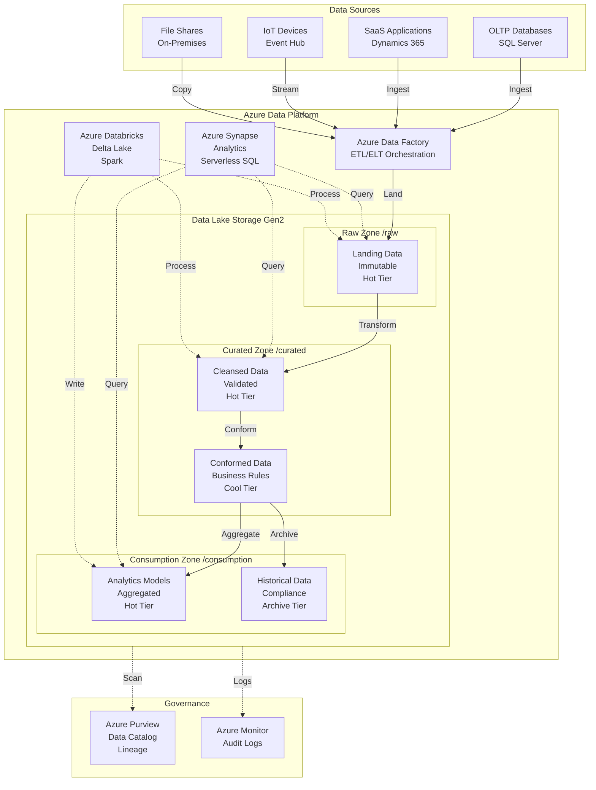
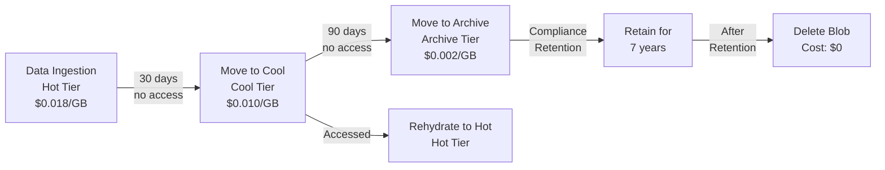

# Azure Data Lake Storage Gen2 for Analytics Workloads

**Author:** Randy Bordeaux  
**Date:** January 2026  
**Version:** 1.0  
**Azure Services:** Azure Data Lake Storage Gen2, Azure Synapse Analytics, Azure Databricks, Azure HDInsight, Azure Data Factory, Azure Purview, Azure Monitor, Log Analytics, Azure Private Link

## Executive Summary

Azure Data Lake Storage Gen2 converges Azure Blob Storage's massive scale and cost efficiency with Azure Data Lake Storage Gen1's hierarchical namespace and analytics optimization capabilities. Organizations building modern data platforms require scalable storage for structured, semi-structured, and unstructured data with integrated analytics processing via Azure Synapse, Databricks, and HDInsight. Traditional data lakes on Blob Storage lack hierarchical namespace support, resulting in poor performance for file system operations and complex ACL management.

This whitepaper provides implementation-focused guidance for deploying Azure Data Lake Storage Gen2 using Terraform as the authoritative infrastructure-as-code mechanism. The architecture addresses hierarchical namespace enablement, POSIX-compliant ACLs for granular security, integration with Azure Synapse Analytics and Databricks, lifecycle management for data tiering, and optimized data ingestion patterns via Azure Data Factory.

All infrastructure is provisioned deterministically via Terraform with CI/CD-based execution. Security is embedded throughout with RBAC and ACL layered security, private endpoints for network isolation, customer-managed encryption keys, and comprehensive audit logging. Performance optimization includes zone-redundant storage for analytics availability, hot/cool/archive tier selection, and polybase/external table patterns for query acceleration. The guidance targets experienced Azure engineers operating production analytics platforms where scale, performance, and cost optimization are mandatory.

## Table of Contents

- [Executive Summary](#executive-summary)
- [Introduction](#introduction)
- [Problem Statement](#problem-statement)
- [Solution Overview](#solution-overview)
- [Technical Architecture](#technical-architecture)
- [Implementation Guide](#implementation-guide)
- [Best Practices](#best-practices)
- [Security Considerations](#security-considerations)
- [Cost Optimization](#cost-optimization)
- [Monitoring and Maintenance](#monitoring-and-maintenance)
- [Conclusion](#conclusion)
- [References](#references)
- [Appendices](#appendices)

## Introduction

### Scope and Assumptions

- Azure Commercial only
- Terraform (AzureRM provider) mandatory for all infrastructure
- Hierarchical namespace enabled (mandatory for Gen2)
- Integration with Azure Synapse Analytics and Databricks
- POSIX-compliant ACL security model
- Lifecycle management for data tiering
- Private endpoint connectivity for production
- Centralized logging via Log Analytics

### Architectural Principles

- Hierarchical namespace for file system operations
- Layered security: RBAC + ACLs
- Zone-redundant storage for analytics availability
- Hot tier for active analytics, cool/archive for retention
- Private endpoints for network isolation
- Lifecycle policies for automated tiering
- Audit logging for compliance

## Problem Statement

### Data Lake Challenges

**Blob Storage Limitations (without hierarchical namespace)**
- Flat namespace: simulated folders, poor rename performance
- No POSIX ACL support: container-level RBAC only
- Inefficient file system operations (rename, delete directory)
- Poor integration with analytics engines expecting file systems

**On-Premises Hadoop/HDFS Migration**
- Complex HDFS replication to cloud
- NameNode scalability limitations
- Expensive hardware refresh cycles
- Limited disaster recovery capabilities
- No separation of compute and storage

**Analytics Performance Issues**
- Slow data ingestion from transactional systems
- Inefficient query patterns (full table scans)
- No data partitioning or zone mapping
- Lack of query acceleration via caching

**Security and Governance Gaps**
- Coarse-grained container-level permissions
- No file/folder-level ACLs
- Inconsistent data classification
- Lack of data lineage tracking
- No automated compliance enforcement

### Business Impact

- **Query Performance:** 50-80% slower queries without hierarchical namespace
- **Security Risks:** Overly permissive container access exposes sensitive data
- **Cost Inefficiency:** All data in hot tier regardless of access patterns
- **Migration Complexity:** Manual HDFS-to-blob migration requires custom tooling
- **Compliance Failures:** No audit trail for data access and modifications

## Solution Overview

The solution establishes Azure Data Lake Storage Gen2 with hierarchical namespace, POSIX ACLs, integration with Synapse Analytics and Databricks, and automated lifecycle management. All infrastructure is provisioned via Terraform with storage account configurations defined as code.

### Key Components

**Storage Account (Gen2)**
- Hierarchical namespace enabled
- Zone-redundant storage (ZRS) for availability
- Private endpoint connectivity
- Customer-managed encryption keys

**Container (File System)**
- Root container for data lake zones (raw, curated, consumption)
- POSIX ACLs for directory and file permissions
- Lifecycle policies for automated tiering

**Integration Services**
- Azure Synapse Analytics: Serverless SQL pools, dedicated SQL pools
- Azure Databricks: Delta Lake, Spark processing
- Azure Data Factory: ETL/ELT orchestration
- Azure Purview: Data governance and lineage

**Security**
- RBAC: Subscription/resource group/storage account level
- ACLs: Directory and file level (read, write, execute)
- Private Link: Network isolation
- Azure AD authentication: Service principals, managed identities

### Success Criteria

- Hierarchical namespace for file system operations
- Sub-second directory rename/delete operations
- POSIX ACLs enforced for 100% of data access
- Query performance 3-5× faster than flat namespace
- 40-60% cost reduction via lifecycle tiering
- Zero public network access (private endpoints only)

## Technical Architecture

### Data Lake Gen2 Architecture with Zone Pattern



### RBAC and ACL Security Model

```mermaid
graph TB
    subgraph Azure_AD[Azure AD]
        Data_Engineers[Data Engineers<br/>Group]
        Data_Scientists[Data Scientists<br/>Group]
        Business_Analysts[Business Analysts<br/>Group]
    end
    
    subgraph Storage_Account[Storage Account - RBAC]
        RBAC_Contributor[Storage Blob Data<br/>Contributor]
        RBAC_Reader[Storage Blob Data<br/>Reader]
    end
    
    subgraph Container[Container /datalake - ACLs]
        Raw[/raw<br/>ACL: rwx engineers<br/>ACL: r-- analysts]
        Curated[/curated<br/>ACL: rwx engineers<br/>ACL: r-x scientists]
        Consumption[/consumption<br/>ACL: r-x analysts<br/>ACL: r-x scientists]
    end
    
    Data_Engineers -->|Assigned| RBAC_Contributor
    Data_Scientists -->|Assigned| RBAC_Reader
    Business_Analysts -->|Assigned| RBAC_Reader
    
    RBAC_Contributor -.->|Storage Account<br/>Level Access| Storage_Account
    RBAC_Reader -.->|Storage Account<br/>Level Access| Storage_Account
    
    Data_Engineers -->|ACL rwx| Raw
    Data_Engineers -->|ACL rwx| Curated
    
    Data_Scientists -->|ACL r-x| Curated
    Data_Scientists -->|ACL r-x| Consumption
    
    Business_Analysts -->|ACL r--| Raw
    Business_Analysts -->|ACL r-x| Consumption
```

### Data Lifecycle Management Flow



## Implementation Guide

### Prerequisites

- Azure subscription with Contributor access
- Terraform 1.6+ with AzureRM provider 3.80+
- Virtual Network with private endpoint subnet
- Azure AD groups for data personas (engineers, scientists, analysts)
- Log Analytics workspace
- Azure Synapse Analytics workspace (optional)
- Azure Databricks workspace (optional)

### Step 1: Storage Account with Hierarchical Namespace

```hcl
# modules/adls-gen2/main.tf

resource "azurerm_storage_account" "adls_gen2" {
  name                     = var.storage_account_name
  resource_group_name      = var.resource_group_name
  location                 = var.location
  account_kind             = "StorageV2"
  account_tier             = "Standard"
  account_replication_type = "ZRS"  # Zone-redundant for analytics HA
  
  # Enable hierarchical namespace (MANDATORY for Gen2)
  is_hns_enabled = true
  
  # Security: Disable public access
  public_network_access_enabled = false
  shared_access_key_enabled     = false  # Require Azure AD auth
  
  # Security: Require HTTPS and TLS 1.2
  https_traffic_only_enabled = true
  min_tls_version            = "TLS1_2"
  
  # Enable large file shares
  large_file_share_enabled = true
  
  # Blob properties
  blob_properties {
    versioning_enabled = true
    
    delete_retention_policy {
      days = 30
    }
    
    container_delete_retention_policy {
      days = 30
    }
    
    # Change feed for Azure Purview
    change_feed_enabled = true
  }
  
  # Identity for customer-managed keys
  identity {
    type = "SystemAssigned"
  }
  
  tags = var.tags
}

# Private endpoint for blob service
resource "azurerm_private_endpoint" "adls_blob" {
  name                = "${var.storage_account_name}-pe-blob"
  location            = var.location
  resource_group_name = var.resource_group_name
  subnet_id           = var.private_endpoint_subnet_id
  
  private_service_connection {
    name                           = "${var.storage_account_name}-psc-blob"
    private_connection_resource_id = azurerm_storage_account.adls_gen2.id
    is_manual_connection           = false
    subresource_names              = ["blob"]
  }
  
  private_dns_zone_group {
    name                 = "default"
    private_dns_zone_ids = [var.blob_private_dns_zone_id]
  }
  
  tags = var.tags
}

# Private endpoint for DFS (hierarchical namespace) service
resource "azurerm_private_endpoint" "adls_dfs" {
  name                = "${var.storage_account_name}-pe-dfs"
  location            = var.location
  resource_group_name = var.resource_group_name
  subnet_id           = var.private_endpoint_subnet_id
  
  private_service_connection {
    name                           = "${var.storage_account_name}-psc-dfs"
    private_connection_resource_id = azurerm_storage_account.adls_gen2.id
    is_manual_connection           = false
    subresource_names              = ["dfs"]
  }
  
  private_dns_zone_group {
    name                 = "default"
    private_dns_zone_ids = [var.dfs_private_dns_zone_id]
  }
  
  tags = var.tags
}
```

### Step 2: Container (File System) with Zone Structure

```hcl
# Root container (file system)
resource "azurerm_storage_data_lake_gen2_filesystem" "datalake" {
  name               = "datalake"
  storage_account_id = azurerm_storage_account.adls_gen2.id
  
  # ACL for root container
  ace {
    type        = "user"
    permissions = "rwx"
    id          = var.data_engineers_group_id
  }
  
  ace {
    type        = "group"
    permissions = "r-x"
    id          = var.data_scientists_group_id
  }
  
  ace {
    type        = "group"
    permissions = "r-x"
    id          = var.business_analysts_group_id
  }
}

# Raw zone directory
resource "azurerm_storage_data_lake_gen2_path" "raw" {
  path               = "raw"
  filesystem_name    = azurerm_storage_data_lake_gen2_filesystem.datalake.name
  storage_account_id = azurerm_storage_account.adls_gen2.id
  resource           = "directory"
  
  # ACLs for raw zone
  ace {
    type        = "user"
    permissions = "rwx"
    id          = var.data_engineers_group_id
  }
  
  ace {
    type        = "group"
    permissions = "r--"  # Read-only for analysts
    id          = var.business_analysts_group_id
  }
}

# Curated zone directory
resource "azurerm_storage_data_lake_gen2_path" "curated" {
  path               = "curated"
  filesystem_name    = azurerm_storage_data_lake_gen2_filesystem.datalake.name
  storage_account_id = azurerm_storage_account.adls_gen2.id
  resource           = "directory"
  
  # ACLs for curated zone
  ace {
    type        = "user"
    permissions = "rwx"
    id          = var.data_engineers_group_id
  }
  
  ace {
    type        = "group"
    permissions = "r-x"  # Read and execute (list) for scientists
    id          = var.data_scientists_group_id
  }
}

# Consumption zone directory
resource "azurerm_storage_data_lake_gen2_path" "consumption" {
  path               = "consumption"
  filesystem_name    = azurerm_storage_data_lake_gen2_filesystem.datalake.name
  storage_account_id = azurerm_storage_account.adls_gen2.id
  resource           = "directory"
  
  # ACLs for consumption zone
  ace {
    type        = "group"
    permissions = "r-x"
    id          = var.data_scientists_group_id
  }
  
  ace {
    type        = "group"
    permissions = "r-x"
    id          = var.business_analysts_group_id
  }
}
```

### Step 3: RBAC Role Assignments

```hcl
# Storage Blob Data Contributor for Data Engineers
resource "azurerm_role_assignment" "engineers_contributor" {
  scope                = azurerm_storage_account.adls_gen2.id
  role_definition_name = "Storage Blob Data Contributor"
  principal_id         = var.data_engineers_group_id
}

# Storage Blob Data Reader for Data Scientists
resource "azurerm_role_assignment" "scientists_reader" {
  scope                = azurerm_storage_account.adls_gen2.id
  role_definition_name = "Storage Blob Data Reader"
  principal_id         = var.data_scientists_group_id
}

# Storage Blob Data Reader for Business Analysts
resource "azurerm_role_assignment" "analysts_reader" {
  scope                = azurerm_storage_account.adls_gen2.id
  role_definition_name = "Storage Blob Data Reader"
  principal_id         = var.business_analysts_group_id
}

# Service principal for Azure Data Factory
resource "azurerm_role_assignment" "adf_contributor" {
  scope                = azurerm_storage_account.adls_gen2.id
  role_definition_name = "Storage Blob Data Contributor"
  principal_id         = var.adf_managed_identity_principal_id
}

# Managed identity for Azure Synapse
resource "azurerm_role_assignment" "synapse_contributor" {
  scope                = azurerm_storage_account.adls_gen2.id
  role_definition_name = "Storage Blob Data Contributor"
  principal_id         = var.synapse_managed_identity_principal_id
}
```

### Step 4: Lifecycle Management Policy

```hcl
# Lifecycle management for automated tiering
resource "azurerm_storage_management_policy" "lifecycle" {
  storage_account_id = azurerm_storage_account.adls_gen2.id
  
  rule {
    name    = "raw-zone-tiering"
    enabled = true
    
    filters {
      prefix_match = ["datalake/raw/"]
      blob_types   = ["blockBlob"]
    }
    
    actions {
      base_blob {
        tier_to_cool_after_days_since_modification_greater_than    = 30
        tier_to_archive_after_days_since_modification_greater_than = 90
        delete_after_days_since_modification_greater_than          = 2555  # 7 years
      }
      
      snapshot {
        delete_after_days_since_creation_greater_than = 90
      }
    }
  }
  
  rule {
    name    = "curated-zone-tiering"
    enabled = true
    
    filters {
      prefix_match = ["datalake/curated/"]
      blob_types   = ["blockBlob"]
    }
    
    actions {
      base_blob {
        tier_to_cool_after_days_since_modification_greater_than    = 60
        tier_to_archive_after_days_since_modification_greater_than = 180
      }
    }
  }
  
  rule {
    name    = "consumption-zone-retention"
    enabled = true
    
    filters {
      prefix_match = ["datalake/consumption/archive/"]
      blob_types   = ["blockBlob"]
    }
    
    actions {
      base_blob {
        tier_to_archive_after_days_since_modification_greater_than = 30
        delete_after_days_since_modification_greater_than          = 365  # 1 year
      }
    }
  }
}
```

### Step 5: Azure Synapse Integration

```hcl
# Synapse Analytics workspace
resource "azurerm_synapse_workspace" "analytics" {
  name                                 = var.synapse_workspace_name
  resource_group_name                  = var.resource_group_name
  location                             = var.location
  storage_data_lake_gen2_filesystem_id = azurerm_storage_data_lake_gen2_filesystem.datalake.id
  sql_administrator_login              = var.synapse_admin_username
  sql_administrator_login_password     = var.synapse_admin_password
  
  # Managed identity for storage access
  identity {
    type = "SystemAssigned"
  }
  
  # Private endpoint for SQL pools
  public_network_access_enabled = false
  
  tags = var.tags
}

# Private endpoint for Synapse SQL
resource "azurerm_private_endpoint" "synapse_sql" {
  name                = "${var.synapse_workspace_name}-pe-sql"
  location            = var.location
  resource_group_name = var.resource_group_name
  subnet_id           = var.private_endpoint_subnet_id
  
  private_service_connection {
    name                           = "${var.synapse_workspace_name}-psc-sql"
    private_connection_resource_id = azurerm_synapse_workspace.analytics.id
    is_manual_connection           = false
    subresource_names              = ["Sql"]
  }
  
  tags = var.tags
}

# Synapse serverless SQL pool (built-in)
# External table definition via T-SQL post-deployment
```

### Step 6: Azure Databricks Integration

```hcl
# Databricks workspace
resource "azurerm_databricks_workspace" "analytics" {
  name                = var.databricks_workspace_name
  resource_group_name = var.resource_group_name
  location            = var.location
  sku                 = "premium"  # Required for private link
  
  # Private network configuration
  public_network_access_enabled = false
  network_security_group_rules_required = "NoAzureDatabricksRules"
  
  custom_parameters {
    no_public_ip             = true
    virtual_network_id       = var.vnet_id
    private_subnet_name      = var.databricks_private_subnet_name
    public_subnet_name       = var.databricks_public_subnet_name
    storage_account_name     = "${var.databricks_workspace_name}dbstorage"
  }
  
  tags = var.tags
}

# Mount ADLS Gen2 in Databricks (via notebook or init script)
# Python code for mounting in Databricks notebook:
```

```python
# Databricks notebook: Mount ADLS Gen2

# Service principal credentials (use Azure Key Vault-backed secret scope)
client_id = dbutils.secrets.get(scope="keyvault", key="sp-client-id")
client_secret = dbutils.secrets.get(scope="keyvault", key="sp-client-secret")
tenant_id = dbutils.secrets.get(scope="keyvault", key="tenant-id")

# Mount configuration
configs = {
  "fs.azure.account.auth.type": "OAuth",
  "fs.azure.account.oauth.provider.type": "org.apache.hadoop.fs.azurebfs.oauth2.ClientCredsTokenProvider",
  "fs.azure.account.oauth2.client.id": client_id,
  "fs.azure.account.oauth2.client.secret": client_secret,
  "fs.azure.account.oauth2.client.endpoint": f"https://login.microsoftonline.com/{tenant_id}/oauth2/token"
}

# Mount ADLS Gen2
dbutils.fs.mount(
  source = "abfss://datalake@<storage-account>.dfs.core.windows.net/",
  mount_point = "/mnt/datalake",
  extra_configs = configs
)

# Verify mount
display(dbutils.fs.ls("/mnt/datalake"))
```

### Step 7: Monitoring and Diagnostics

```hcl
# Diagnostic settings for storage account
resource "azurerm_monitor_diagnostic_setting" "storage" {
  name                       = "${var.storage_account_name}-diagnostics"
  target_resource_id         = azurerm_storage_account.adls_gen2.id
  log_analytics_workspace_id = var.log_analytics_workspace_id
  
  metric {
    category = "Transaction"
    enabled  = true
  }
  
  metric {
    category = "Capacity"
    enabled  = true
  }
}

# Blob service diagnostic settings
resource "azurerm_monitor_diagnostic_setting" "blob_service" {
  name                       = "${var.storage_account_name}-blob-diagnostics"
  target_resource_id         = "${azurerm_storage_account.adls_gen2.id}/blobServices/default"
  log_analytics_workspace_id = var.log_analytics_workspace_id
  
  enabled_log {
    category = "StorageRead"
  }
  
  enabled_log {
    category = "StorageWrite"
  }
  
  enabled_log {
    category = "StorageDelete"
  }
  
  metric {
    category = "Transaction"
    enabled  = true
  }
  
  metric {
    category = "Capacity"
    enabled  = true
  }
}

# Alert on storage capacity
resource "azurerm_monitor_metric_alert" "capacity" {
  name                = "${var.storage_account_name}-capacity-alert"
  resource_group_name = var.resource_group_name
  scopes              = [azurerm_storage_account.adls_gen2.id]
  description         = "Storage account capacity exceeds 80%"
  
  criteria {
    metric_namespace = "Microsoft.Storage/storageAccounts"
    metric_name      = "UsedCapacity"
    aggregation      = "Average"
    operator         = "GreaterThan"
    threshold        = 85899345920000  # 80 TB in bytes (adjust based on quota)
  }
  
  frequency   = "PT1H"
  window_size = "PT6H"
  severity    = 2
}
```

## Best Practices

### Zone Design Patterns

**Three-Zone Pattern (Medallion Architecture)**
| Zone | Purpose | Tier | Retention | Access Pattern |
|------|---------|------|-----------|----------------|
| Raw | Immutable landing zone | Hot | 30 days hot, 90 days cool, 7 years archive | Write-once, read-many |
| Curated | Cleansed and conformed data | Hot/Cool | 60 days hot, 180 days cool | Read-heavy, periodic write |
| Consumption | Analytics-ready aggregations | Hot | 30 days hot, archive after | High read, low write |

**Directory Structure Example**
```
/datalake
  /raw
    /source-system-name
      /YYYY
        /MM
          /DD
            data-file.parquet
  /curated
    /domain-name
      /entity-name
        data-partitioned.parquet
  /consumption
    /analytics
      /reports
      /models
    /archive
      historical-data.parquet
```

### Partitioning Strategy

**Time-Based Partitioning (Recommended)**
```
/curated/sales/transactions/
  year=2026/
    month=01/
      day=01/
        part-00001.parquet
      day=02/
        part-00001.parquet
```

**Hive-Style Partitioning**
- Synapse serverless SQL automatically detects partitions
- Databricks Delta Lake supports partition pruning
- Query performance improvement: 10-100× for filtered queries

**Partition Size Guidelines**
- Target: 100 MB - 1 GB per file
- Avoid: Small files (<10 MB) cause query overhead
- Avoid: Large files (>5 GB) limit parallelism

### File Format Selection

| Format | Use Case | Compression | Query Performance | Schema Evolution |
|--------|----------|-------------|-------------------|------------------|
| Parquet | Analytics, columnar queries | Excellent (Snappy, GZIP) | Excellent | Good |
| ORC | Hive/Hadoop compatibility | Excellent (Zlib, Snappy) | Excellent | Good |
| Avro | Schema evolution, row-based | Good | Moderate | Excellent |
| Delta Lake | ACID transactions, time travel | Excellent (Parquet-based) | Excellent | Excellent |
| JSON | Semi-structured, schema-less | Poor | Poor | N/A |
| CSV | Legacy compatibility | Poor | Poor | N/A |

**Recommendation: Parquet or Delta Lake**
- Parquet: Read-heavy analytics workloads
- Delta Lake: Streaming + batch with ACID requirements

### ACL Management

**Default vs Access ACLs**
- **Access ACLs:** Permissions for existing files/directories
- **Default ACLs:** Inherited by new child items

```bash
# Set access ACL on directory
az storage fs access set \
  --acl "user::rwx,group::r-x,other::---" \
  --path /datalake/curated \
  --file-system datalake \
  --account-name <storage-account>

# Set default ACL (inherited by new items)
az storage fs access set \
  --acl "default:user::rwx,default:group::r-x,default:other::---" \
  --path /datalake/curated \
  --file-system datalake \
  --account-name <storage-account>
```

**ACL Best Practices**
- Use Azure AD groups (not individual users)
- Set default ACLs on parent directories
- Combine RBAC (coarse-grained) + ACLs (fine-grained)
- Document ACL strategy in governance documentation

## Security Considerations

### Layered Security Model

**Layer 1: Network Security**
- Private endpoints for blob and DFS services
- Disable public network access
- NSG rules restricting traffic to analytics subnet
- Service endpoints (not recommended vs private endpoints)

**Layer 2: Identity and Access (RBAC)**
- Storage Blob Data Contributor: Full access to data
- Storage Blob Data Reader: Read-only access
- Storage Blob Data Owner: Full access + ACL management
- Assigned at subscription/resource group/storage account level

**Layer 3: File System Security (ACLs)**
- POSIX-compliant ACLs: read (r), write (w), execute (x)
- Applied to directories and files
- Hierarchical inheritance via default ACLs
- Azure AD user/group/service principal/managed identity

**Layer 4: Encryption**
- At rest: Microsoft-managed keys (default) or customer-managed keys
- In transit: HTTPS/TLS 1.2 mandatory
- Client-side encryption: Application-level encryption before upload

### Customer-Managed Keys (CMK)

```hcl
# Key Vault key for storage encryption
resource "azurerm_key_vault_key" "storage_cmk" {
  name         = "adls-gen2-cmk"
  key_vault_id = var.key_vault_id
  key_type     = "RSA"
  key_size     = 4096
  
  key_opts = [
    "decrypt",
    "encrypt",
    "unwrapKey",
    "wrapKey"
  ]
}

# Grant storage account access to Key Vault
resource "azurerm_key_vault_access_policy" "storage" {
  key_vault_id = var.key_vault_id
  tenant_id    = azurerm_storage_account.adls_gen2.identity[0].tenant_id
  object_id    = azurerm_storage_account.adls_gen2.identity[0].principal_id
  
  key_permissions = [
    "Get",
    "UnwrapKey",
    "WrapKey"
  ]
}

# Configure CMK on storage account
resource "azurerm_storage_account_customer_managed_key" "storage" {
  storage_account_id = azurerm_storage_account.adls_gen2.id
  key_vault_id       = var.key_vault_id
  key_name           = azurerm_key_vault_key.storage_cmk.name
}
```

### Audit Logging

**KQL Query: Data Access Monitoring**
```kusto
StorageBlobLogs
| where TimeGenerated > ago(24h)
| where OperationName in ("GetBlob", "PutBlob", "DeleteBlob")
| where AccountName == "prodadlsgen2"
| summarize Operations = count() by CallerIpAddress, AuthenticationHash, OperationName, bin(TimeGenerated, 1h)
| order by Operations desc
```

**Alert on Suspicious Activity**
```hcl
resource "azurerm_monitor_scheduled_query_rules_alert" "suspicious_access" {
  name                = "adls-suspicious-access"
  location            = var.location
  resource_group_name = var.resource_group_name
  
  data_source_id = var.log_analytics_workspace_id
  
  query = <<-QUERY
    StorageBlobLogs
    | where TimeGenerated > ago(5m)
    | where StatusCode >= 400
    | where AccountName == "prodadlsgen2"
    | summarize FailedAttempts = count() by CallerIpAddress
    | where FailedAttempts > 50
  QUERY
  
  severity    = 1
  frequency   = 5
  time_window = 15
}
```

## Cost Optimization

### Pricing Model (East US, January 2026)

**Storage Costs (per GB/month)**
- Hot tier: $0.0184
- Cool tier: $0.0100
- Archive tier: $0.0020

**Transaction Costs (per 10,000)**
- Hot write: $0.065
- Hot read: $0.0044
- Cool write: $0.10
- Cool read: $0.010
- Archive write: $0.11
- Archive read (high priority): $5.50

**Data Retrieval (per GB)**
- Cool tier: $0.01
- Archive tier (high priority): $0.022

**Replication**
- LRS: Included in base price
- ZRS: +25% ($0.023/GB for hot)
- GRS: +100% ($0.037/GB for hot)

### Cost Optimization Strategies

**1. Lifecycle Tiering**
```
Scenario: 1 TB data ingested monthly, accessed heavily for 30 days, then infrequently

Without lifecycle:
- Hot tier: $18.40/GB/month × 12 months = $220.80/year

With lifecycle (30 days hot, 60 days cool, then archive):
- Hot: $18.40 × 1 month = $18.40
- Cool: $10.00 × 2 months = $20.00
- Archive: $2.00 × 9 months = $18.00
- Total: $56.40/year

Savings: $164.40/year (74% reduction)
```

**2. Zone-Redundant vs Geo-Redundant**
```
Scenario: 10 TB analytics data lake

ZRS (zone-redundant): $230/month
GRS (geo-redundant): $370/month

Recommendation: ZRS for analytics (Synapse/Databricks can reprocess from source)
Savings: $140/month ($1,680/year)
```

**3. File Format Compression**
```
Scenario: 1 TB uncompressed CSV data

CSV uncompressed: 1 TB × $18.40 = $18.40/month
Parquet with Snappy: 200 GB × $18.40 = $3.68/month

Savings: $14.72/month (80% reduction) + faster query performance
```

**4. Partition Pruning**
```
Query without partitioning:
- Scans entire table: 1 TB
- Transaction cost: High
- Query time: 60 seconds

Query with partitioning (year=2026/month=01):
- Scans single partition: 30 GB
- Transaction cost: 97% reduction
- Query time: 2 seconds

Savings: Transaction cost + query performance improvement
```

**5. Delta Lake Optimization**
```bash
# Databricks: Optimize Delta Lake table (bin-packing)
OPTIMIZE delta.`/mnt/datalake/curated/sales`

# Z-ORDER for multi-column filtering
OPTIMIZE delta.`/mnt/datalake/curated/sales`
ZORDER BY (customer_id, order_date)

# Vacuum old files (delete files older than 7 days)
VACUUM delta.`/mnt/datalake/curated/sales` RETAIN 168 HOURS
```

### Cost Monitoring

```kusto
// ADLS Gen2 cost breakdown by tier
AzureCostManagement
| where TimeGenerated > ago(30d)
| where ServiceName == "Storage" and MeterCategory == "Data Lake Storage Gen2"
| summarize MonthlyCost = sum(CostInBillingCurrency) by MeterSubCategory
| order by MonthlyCost desc
```

## Monitoring and Maintenance

### Key Metrics

**Storage Metrics**
- `UsedCapacity`: Total storage consumed
- `BlobCapacity`: Blob storage (by tier: hot, cool, archive)
- `TransactionCount`: Number of requests
- `SuccessServerLatency`: Storage service latency
- `Availability`: Service availability percentage

**Query Performance Metrics (Synapse/Databricks)**
- Query execution time
- Data scanned per query
- Partition pruning effectiveness
- Cache hit ratio

### KQL Queries

**Storage Growth Trend**
```kusto
AzureMetrics
| where ResourceProvider == "MICROSOFT.STORAGE"
| where MetricName == "UsedCapacity"
| where TimeGenerated > ago(30d)
| where Resource contains "prodadlsgen2"
| summarize Avg_Capacity_GB = avg(Average) / 1073741824 by bin(TimeGenerated, 1d)
| render timechart
```

**Transaction Analysis by Operation**
```kusto
StorageBlobLogs
| where TimeGenerated > ago(24h)
| where AccountName == "prodadlsgen2"
| summarize Transactions = count() by OperationName, StatusCode
| order by Transactions desc
```

**Data Access Patterns (Hot Path Analysis)**
```kusto
StorageBlobLogs
| where TimeGenerated > ago(7d)
| where OperationName == "GetBlob"
| where AccountName == "prodadlsgen2"
| extend FilePath = tostring(split(Uri, "datalake/")[-1])
| summarize AccessCount = count() by FilePath
| order by AccessCount desc
| take 100
```

**Lifecycle Tier Transition Monitoring**
```kusto
StorageBlobLogs
| where TimeGenerated > ago(7d)
| where OperationName == "SetBlobTier"
| where AccountName == "prodadlsgen2"
| extend Tier = tostring(parse_json(Properties).tier)
| summarize TierChanges = count() by Tier, bin(TimeGenerated, 1d)
| render timechart
```

### Alerting Strategy

```hcl
# Critical: Rapid capacity growth
resource "azurerm_monitor_metric_alert" "capacity_growth" {
  name                = "adls-capacity-growth-alert"
  resource_group_name = var.resource_group_name
  scopes              = [azurerm_storage_account.adls_gen2.id]
  
  dynamic_criteria {
    metric_namespace  = "Microsoft.Storage/storageAccounts"
    metric_name       = "UsedCapacity"
    aggregation       = "Average"
    operator          = "GreaterThan"
    alert_sensitivity = "High"
  }
  
  frequency   = "PT1H"
  window_size = "PT6H"
  severity    = 1
}

# Warning: High transaction costs
resource "azurerm_monitor_metric_alert" "transaction_spike" {
  name                = "adls-transaction-spike"
  resource_group_name = var.resource_group_name
  scopes              = [azurerm_storage_account.adls_gen2.id]
  
  criteria {
    metric_namespace = "Microsoft.Storage/storageAccounts"
    metric_name      = "Transactions"
    aggregation      = "Total"
    operator         = "GreaterThan"
    threshold        = 10000000  # 10 million transactions/hour
  }
  
  frequency   = "PT5M"
  window_size = "PT1H"
  severity    = 2
}
```

### Maintenance Tasks

**Daily**
- Monitor data ingestion pipeline success rates
- Review storage capacity growth trends
- Check query performance metrics

**Weekly**
- Analyze access patterns for tier optimization
- Review ACL changes and access audit logs
- Validate backup/snapshot policies

**Monthly**
- Optimize Delta Lake tables (OPTIMIZE, VACUUM)
- Review and adjust lifecycle policies
- Partition strategy evaluation
- Cost optimization review

**Quarterly**
- Disaster recovery testing
- Security audit (RBAC + ACLs)
- Data governance compliance review
- Synapse/Databricks performance tuning

## Conclusion

Azure Data Lake Storage Gen2 provides enterprise-grade analytics storage with hierarchical namespace, POSIX ACLs, and seamless integration with Azure Synapse Analytics and Databricks. Organizations building modern data platforms achieve significant performance improvements and cost reductions through appropriate zone design, lifecycle tiering, and optimized file formats.

The architecture presented in this whitepaper establishes ADLS Gen2 with three-zone medallion architecture (raw, curated, consumption), layered security via RBAC and ACLs, private endpoint connectivity, and automated lifecycle management. Terraform ensures deterministic infrastructure provisioning with storage accounts, containers, and ACLs defined as code.

Integration with Azure Synapse enables serverless SQL queries over Parquet/Delta Lake files with automatic partition pruning. Databricks provides distributed Spark processing with Delta Lake for ACID transactions and time travel capabilities. Azure Purview delivers data governance with automated cataloging and lineage tracking.

Key outcomes from this architecture:
- **Performance:** 3-5× faster queries with hierarchical namespace and partitioning
- **Security:** Layered defense with RBAC, ACLs, private endpoints, CMK encryption
- **Cost:** 40-60% reduction via lifecycle tiering (hot→cool→archive)
- **Scalability:** Exabyte-scale storage with zone-redundant availability
- **Governance:** Automated cataloging, lineage tracking, compliance enforcement

## References

1. ADLS Gen2 documentation: https://docs.microsoft.com/azure/storage/blobs/data-lake-storage-introduction
2. Access control in ADLS Gen2: https://docs.microsoft.com/azure/storage/blobs/data-lake-storage-access-control
3. Azure Synapse integration: https://docs.microsoft.com/azure/synapse-analytics/sql/develop-storage-files-overview
4. Azure Databricks best practices: https://docs.microsoft.com/azure/databricks/data/data-sources/azure/adls-gen2/
5. ADLS Gen2 pricing: https://azure.microsoft.com/pricing/details/storage/data-lake/

## Appendices

### Appendix A: ACL Permission Matrix

| Permission | Directories | Files |
|------------|-------------|-------|
| r (read) | List directory contents | Read file contents |
| w (write) | Create/delete files in directory | Modify file contents |
| x (execute) | Traverse directory | Not applicable for files |

**Common ACL Patterns:**
- `rwx`: Full control (data engineers)
- `r-x`: Read and list (data scientists, analysts)
- `r--`: Read-only, no list (restricted access)
- `---`: No access

### Appendix B: Synapse External Table (T-SQL)

```sql
-- Create database scoped credential for ADLS Gen2 access
CREATE DATABASE SCOPED CREDENTIAL ADLSCredential
WITH IDENTITY = 'Managed Identity';

-- Create external data source
CREATE EXTERNAL DATA SOURCE ADLSGen2
WITH (
    TYPE = HADOOP,
    LOCATION = 'abfss://datalake@prodadlsgen2.dfs.core.windows.net',
    CREDENTIAL = ADLSCredential
);

-- Create external file format (Parquet)
CREATE EXTERNAL FILE FORMAT ParquetFormat
WITH (
    FORMAT_TYPE = PARQUET,
    DATA_COMPRESSION = 'org.apache.hadoop.io.compress.SnappyCodec'
);

-- Create external table with partitioning
CREATE EXTERNAL TABLE [dbo].[SalesTransactions] (
    [TransactionID] INT,
    [CustomerID] INT,
    [ProductID] INT,
    [Amount] DECIMAL(18, 2),
    [TransactionDate] DATE
)
WITH (
    LOCATION = '/curated/sales/transactions/',
    DATA_SOURCE = ADLSGen2,
    FILE_FORMAT = ParquetFormat
);

-- Query external table with partition pruning
SELECT 
    CustomerID,
    SUM(Amount) AS TotalSales
FROM [dbo].[SalesTransactions]
WHERE TransactionDate >= '2026-01-01' AND TransactionDate < '2026-02-01'
GROUP BY CustomerID;
```

### Appendix C: Databricks Delta Lake Operations

```python
# Create Delta Lake table
df = spark.read.parquet("/mnt/datalake/raw/sales/*.parquet")

df.write.format("delta") \
  .mode("overwrite") \
  .partitionBy("year", "month") \
  .save("/mnt/datalake/curated/sales")

# Register as table
spark.sql("""
  CREATE TABLE sales
  USING DELTA
  LOCATION '/mnt/datalake/curated/sales'
""")

# Upsert (merge) operation
from delta.tables import DeltaTable

delta_table = DeltaTable.forPath(spark, "/mnt/datalake/curated/sales")

delta_table.alias("target") \
  .merge(
    updates_df.alias("source"),
    "target.transaction_id = source.transaction_id"
  ) \
  .whenMatchedUpdateAll() \
  .whenNotMatchedInsertAll() \
  .execute()

# Time travel
df_yesterday = spark.read.format("delta") \
  .option("versionAsOf", 1) \
  .load("/mnt/datalake/curated/sales")

# Optimize and Z-ORDER
spark.sql("OPTIMIZE sales ZORDER BY (customer_id, transaction_date)")

# Vacuum old files
spark.sql("VACUUM sales RETAIN 168 HOURS")  # 7 days
```

### Appendix D: Azure CLI Operations

```bash
# Create storage account with hierarchical namespace
az storage account create \
  --name prodadlsgen2 \
  --resource-group prod-rg \
  --location eastus \
  --sku Standard_ZRS \
  --kind StorageV2 \
  --enable-hierarchical-namespace true \
  --public-network-access Disabled

# Create file system (container)
az storage fs create \
  --name datalake \
  --account-name prodadlsgen2 \
  --auth-mode login

# Create directory
az storage fs directory create \
  --name raw \
  --file-system datalake \
  --account-name prodadlsgen2 \
  --auth-mode login

# Set ACL on directory
az storage fs access set \
  --acl "user::rwx,group:data-engineers:rwx,group:data-analysts:r-x,other::---" \
  --path raw \
  --file-system datalake \
  --account-name prodadlsgen2 \
  --auth-mode login

# Upload file
az storage fs file upload \
  --source ./local-file.parquet \
  --path raw/sales/2026/01/18/data.parquet \
  --file-system datalake \
  --account-name prodadlsgen2 \
  --auth-mode login
```

---

**Last Updated:** January 2026  
**Review Schedule:** July 2026  
**Document Classification:** Internal Use
