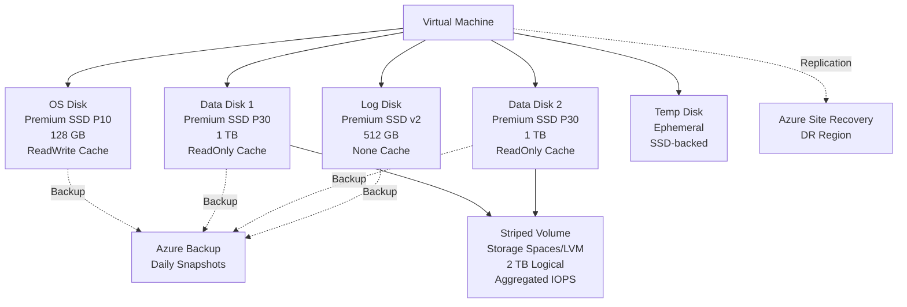
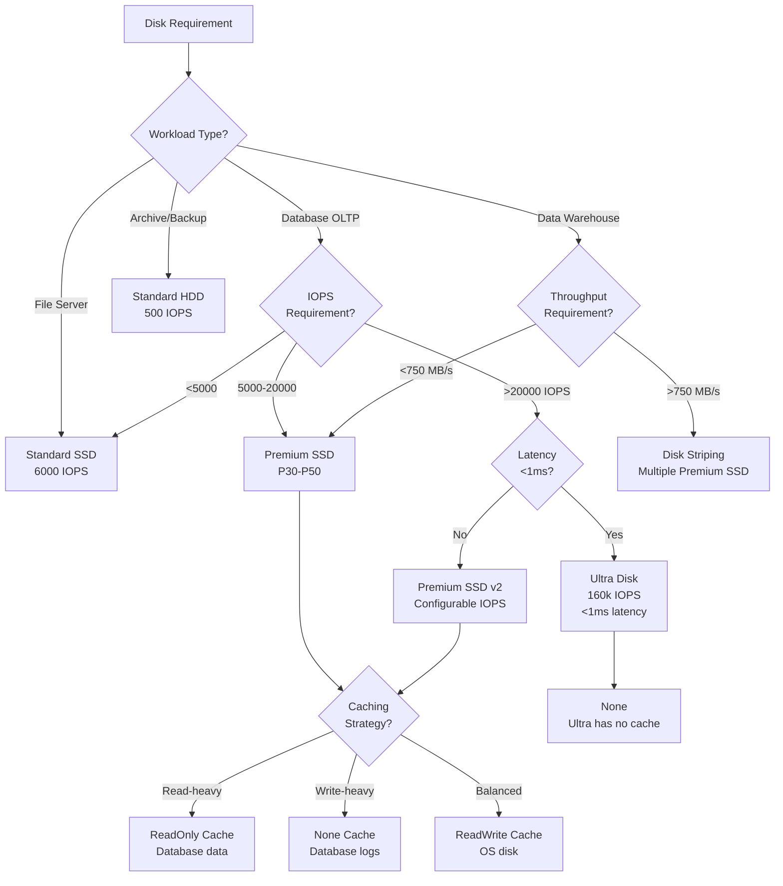
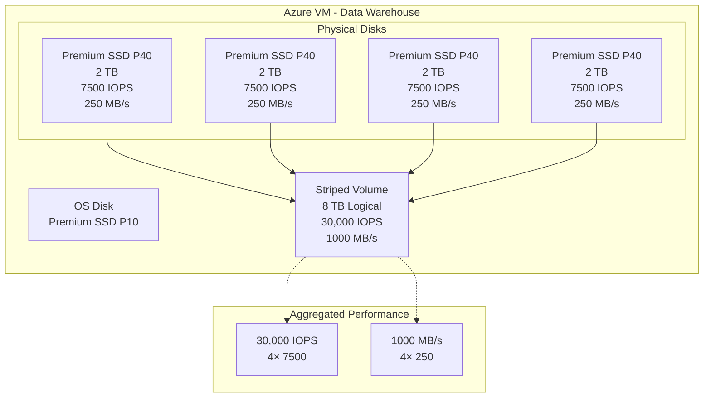

# Azure Disk Storage Optimization and Performance Tuning

**Author:** Randy Bordeaux  
**Date:** January 2026  
**Version:** 1.0  
**Azure Services:** Azure Managed Disks, Azure Disk Storage, Azure Backup, Azure Site Recovery, Azure Monitor, Log Analytics, Azure Disk Encryption

## Executive Summary

Azure Disk Storage provides persistent block storage for Azure Virtual Machines with multiple performance tiers optimized for different workload patterns. Organizations migrating on-premises applications to Azure VMs require appropriate disk selection, configuration, and optimization to achieve performance targets while controlling costs. Traditional approaches using Standard HDD disks result in poor application performance, while indiscriminate use of Premium SSD or Ultra Disk drives unnecessary cost escalation without corresponding benefit.

This whitepaper provides implementation-focused guidance for optimizing Azure disk storage using Terraform as the authoritative infrastructure-as-code mechanism. The architecture addresses disk type selection (Standard HDD, Standard SSD, Premium SSD, Premium SSD v2, Ultra Disk), caching strategies, disk bursting, shared disk configurations for clustering, disk striping for high-throughput applications, and comprehensive backup strategies via Azure Backup and Azure Site Recovery.

All infrastructure is provisioned deterministically via Terraform with CI/CD-based execution. Security is embedded throughout with Azure Disk Encryption, customer-managed keys, and private links for disk access. Performance tuning guidance includes storage space configuration on Windows, LVM on Linux, and monitoring via Azure Monitor. The guidance targets experienced Azure engineers operating production VM workloads where performance, reliability, and cost optimization are mandatory.

## Table of Contents

- [Executive Summary](#executive-summary)
- [Introduction](#introduction)
- [Problem Statement](#problem-statement)
- [Solution Overview](#solution-overview)
- [Technical Architecture](#technical-architecture)
- [Implementation Guide](#implementation-guide)
- [Best Practices](#best-practices)
- [Security Considerations](#security-considerations)
- [Cost Optimization](#cost-optimization)
- [Monitoring and Maintenance](#monitoring-and-maintenance)
- [Conclusion](#conclusion)
- [References](#references)
- [Appendices](#appendices)

## Introduction

### Scope and Assumptions

- Azure Commercial only
- Terraform (AzureRM provider) mandatory for all infrastructure
- Managed Disks (not unmanaged disks)
- Disk types: Standard HDD, Standard SSD, Premium SSD, Premium SSD v2, Ultra Disk
- OS and data disk configurations
- Disk caching strategies (None, ReadOnly, ReadWrite)
- Disk bursting and performance optimization
- Encryption at rest and in transit
- Centralized monitoring via Log Analytics

### Architectural Principles

- Disk type aligned to workload IOPS and throughput requirements
- Cost-optimized disk tier selection
- Caching strategy appropriate for workload pattern
- Disk striping for high-throughput applications
- Encryption by default with customer-managed keys
- Automated backup via Azure Backup
- Disaster recovery via Azure Site Recovery

## Problem Statement

### Storage Performance Challenges

**Inadequate Disk Selection**
- Standard HDD: 500 IOPS, 60 MB/s (insufficient for databases)
- Over-provisioning Premium SSD: Unnecessary cost
- No disk performance monitoring leading to bottlenecks
- Lack of understanding of IOPS vs throughput requirements

**On-Premises Migration Pitfalls**
- Direct lift-and-shift without disk optimization
- Single large disk instead of striped volumes
- No caching configuration
- Inadequate IOPS provisioning for databases
- Throttling and performance degradation

**Application Performance Issues**
- Database query latency >100ms
- Disk queue depth saturation
- IOPS throttling during peak load
- Throughput bottlenecks for ETL workloads
- Log file write delays impacting transactions

**Cost Inefficiency**
- Premium SSD for non-critical workloads
- Ultra Disk when Premium SSD v2 sufficient
- Oversized disks for storage capacity instead of performance
- No disk snapshot lifecycle management

### Business Impact

- **Performance Degradation:** 40-70% slower application response times
- **Throttling:** Unpredictable latency spikes during burst workloads
- **Downtime:** Disk bottlenecks causing application failures
- **Cost Overruns:** 2-3× higher storage costs from poor disk selection
- **Migration Failures:** Applications fail performance acceptance testing

## Solution Overview

The solution establishes optimized Azure disk configurations with appropriate disk type selection, caching strategies, disk striping for high-throughput scenarios, and comprehensive backup policies. All infrastructure is provisioned via Terraform with disk configurations defined as code.

### Key Components

**Disk Types**
- **Standard HDD:** Archive, backup, infrequent access (500 IOPS)
- **Standard SSD:** Web servers, dev/test (6000 IOPS)
- **Premium SSD:** Production databases, applications (20,000 IOPS)
- **Premium SSD v2:** High-performance with granular IOPS/throughput configuration
- **Ultra Disk:** Latency-sensitive databases (<1ms), SAP HANA (160,000 IOPS)

**Disk Caching**
- **None:** Write-heavy workloads, no read caching benefit
- **ReadOnly:** Read-heavy workloads, database data files
- **ReadWrite:** OS disks, application binaries, read/write balance

**Performance Optimization**
- Disk bursting for unpredictable workloads
- Disk striping (RAID 0) for throughput aggregation
- Storage Spaces (Windows) or LVM (Linux) for volume management
- On-demand bursting for Premium SSD

**Backup and DR**
- Azure Backup for disk snapshots
- Azure Site Recovery for VM replication
- Incremental snapshots for cost efficiency
- Cross-region snapshot replication

### Success Criteria

- IOPS provisioning meets application requirements (zero throttling)
- Disk latency <5ms for databases (P30+ disks)
- Throughput meets ETL/batch processing requirements
- 30-40% cost reduction via appropriate disk tier selection
- Automated daily backups with 30-day retention
- <15 minute RPO for disaster recovery

## Technical Architecture

### Disk Type Selection Architecture



### Disk Performance Decision Tree



### High-Throughput Architecture with Disk Striping



## Implementation Guide

### Prerequisites

- Azure subscription with Contributor access
- Terraform 1.6+ with AzureRM provider 3.80+
- Virtual Network and subnet for VMs
- Key Vault for customer-managed keys
- Log Analytics workspace
- Recovery Services Vault for backups

### Step 1: Standard Disk Configurations

```hcl
# modules/azure-disks/main.tf

# Standard HDD for archive/backup
resource "azurerm_managed_disk" "standard_hdd" {
  name                 = "${var.vm_name}-backup-disk"
  location             = var.location
  resource_group_name  = var.resource_group_name
  storage_account_type = "Standard_LRS"
  create_option        = "Empty"
  disk_size_gb         = 1024  # 1 TB
  
  # No caching for backup disk
  disk_iops_read_write   = 500   # Standard HDD limit
  disk_mbps_read_write   = 60    # Standard HDD limit
  
  tags = var.tags
}

# Standard SSD for web servers
resource "azurerm_managed_disk" "standard_ssd" {
  name                 = "${var.vm_name}-app-disk"
  location             = var.location
  resource_group_name  = var.resource_group_name
  storage_account_type = "StandardSSD_LRS"
  create_option        = "Empty"
  disk_size_gb         = 512
  
  disk_iops_read_write   = 6000   # Standard SSD limit
  disk_mbps_read_write   = 750    # Standard SSD limit
  
  tags = var.tags
}

# Attach to VM
resource "azurerm_virtual_machine_data_disk_attachment" "standard_ssd" {
  managed_disk_id    = azurerm_managed_disk.standard_ssd.id
  virtual_machine_id = var.vm_id
  lun                = 0
  caching            = "ReadOnly"  # Read caching for application data
}
```

### Step 2: Premium SSD Configuration

```hcl
# Premium SSD for production database
resource "azurerm_managed_disk" "premium_data" {
  name                 = "${var.vm_name}-db-data-disk"
  location             = var.location
  resource_group_name  = var.resource_group_name
  storage_account_type = "Premium_LRS"
  create_option        = "Empty"
  disk_size_gb         = 1024  # P30: 5000 IOPS, 200 MB/s
  
  # Enable on-demand bursting for unpredictable loads
  on_demand_bursting_enabled = true
  
  tags = var.tags
}

resource "azurerm_virtual_machine_data_disk_attachment" "premium_data" {
  managed_disk_id    = azurerm_managed_disk.premium_data.id
  virtual_machine_id = var.vm_id
  lun                = 1
  caching            = "ReadOnly"  # Database data files benefit from read cache
}

# Premium SSD for database transaction logs
resource "azurerm_managed_disk" "premium_log" {
  name                 = "${var.vm_name}-db-log-disk"
  location             = var.location
  resource_group_name  = var.resource_group_name
  storage_account_type = "Premium_LRS"
  create_option        = "Empty"
  disk_size_gb         = 512  # P20: 2300 IOPS, 150 MB/s
  
  on_demand_bursting_enabled = true
  
  tags = var.tags
}

resource "azurerm_virtual_machine_data_disk_attachment" "premium_log" {
  managed_disk_id    = azurerm_managed_disk.premium_log.id
  virtual_machine_id = var.vm_id
  lun                = 2
  caching            = "None"  # Log files are write-heavy, no cache benefit
}
```

### Step 3: Premium SSD v2 Configuration

```hcl
# Premium SSD v2 with granular IOPS/throughput configuration
resource "azurerm_managed_disk" "premium_v2" {
  name                 = "${var.vm_name}-db-premium-v2"
  location             = var.location
  resource_group_name  = var.resource_group_name
  storage_account_type = "PremiumV2_LRS"
  create_option        = "Empty"
  disk_size_gb         = 512
  
  # Granular IOPS and throughput configuration
  disk_iops_read_write = 10000  # Configurable: 3000-160000
  disk_mbps_read_write = 300    # Configurable: 125-4000
  
  # Logical sector size (optional)
  logical_sector_size = 4096  # 4K sector size
  
  tags = var.tags
}

resource "azurerm_virtual_machine_data_disk_attachment" "premium_v2" {
  managed_disk_id    = azurerm_managed_disk.premium_v2.id
  virtual_machine_id = var.vm_id
  lun                = 3
  caching            = "None"  # Premium SSD v2 does not support caching
}
```

### Step 4: Ultra Disk Configuration

```hcl
# Ultra Disk for latency-sensitive workloads
resource "azurerm_managed_disk" "ultra" {
  name                 = "${var.vm_name}-ultra-disk"
  location             = var.location
  resource_group_name  = var.resource_group_name
  storage_account_type = "UltraSSD_LRS"
  create_option        = "Empty"
  disk_size_gb         = 1024
  
  # Ultra Disk performance configuration
  disk_iops_read_write = 50000   # Configurable: 100-160000
  disk_mbps_read_write = 1000    # Configurable: 1-4000
  
  # Logical sector size
  logical_sector_size = 4096
  
  # Ultra Disks require availability zone
  zone = "1"
  
  tags = var.tags
}

# VM must have ultra_ssd_enabled = true
resource "azurerm_linux_virtual_machine" "ultra_vm" {
  name                = var.vm_name
  location            = var.location
  resource_group_name = var.resource_group_name
  size                = "Standard_E16s_v5"  # Ultra SSD compatible VM size
  zone                = "1"  # Must match Ultra Disk zone
  
  # Enable Ultra Disk support
  additional_capabilities {
    ultra_ssd_enabled = true
  }
  
  # ... other VM configuration
}

resource "azurerm_virtual_machine_data_disk_attachment" "ultra" {
  managed_disk_id    = azurerm_managed_disk.ultra.id
  virtual_machine_id = azurerm_linux_virtual_machine.ultra_vm.id
  lun                = 4
  caching            = "None"  # Ultra Disk does not support caching
}
```

### Step 5: Shared Disk for Clustering

```hcl
# Shared Premium SSD for Windows Failover Cluster
resource "azurerm_managed_disk" "shared" {
  name                 = "${var.cluster_name}-shared-disk"
  location             = var.location
  resource_group_name  = var.resource_group_name
  storage_account_type = "Premium_LRS"
  create_option        = "Empty"
  disk_size_gb         = 1024
  
  # Enable shared disk
  max_shares = 2  # Number of VMs that can attach (2-5 for Premium, up to 10 for Ultra)
  
  tags = var.tags
}

# Attach to first cluster node
resource "azurerm_virtual_machine_data_disk_attachment" "shared_node1" {
  managed_disk_id    = azurerm_managed_disk.shared.id
  virtual_machine_id = azurerm_windows_virtual_machine.cluster_node1.id
  lun                = 0
  caching            = "None"  # Shared disks do not support caching
}

# Attach to second cluster node
resource "azurerm_virtual_machine_data_disk_attachment" "shared_node2" {
  managed_disk_id    = azurerm_managed_disk.shared.id
  virtual_machine_id = azurerm_windows_virtual_machine.cluster_node2.id
  lun                = 0
  caching            = "None"
}
```

### Step 6: Disk Encryption

```hcl
# Customer-managed key in Key Vault
resource "azurerm_key_vault_key" "disk_encryption" {
  name         = "disk-encryption-key"
  key_vault_id = var.key_vault_id
  key_type     = "RSA"
  key_size     = 4096
  
  key_opts = [
    "decrypt",
    "encrypt",
    "unwrapKey",
    "wrapKey"
  ]
}

# Disk Encryption Set
resource "azurerm_disk_encryption_set" "encryption" {
  name                = "prod-disk-encryption-set"
  location            = var.location
  resource_group_name = var.resource_group_name
  key_vault_key_id    = azurerm_key_vault_key.disk_encryption.id
  
  identity {
    type = "SystemAssigned"
  }
  
  tags = var.tags
}

# Grant Disk Encryption Set access to Key Vault
resource "azurerm_key_vault_access_policy" "encryption" {
  key_vault_id = var.key_vault_id
  tenant_id    = azurerm_disk_encryption_set.encryption.identity[0].tenant_id
  object_id    = azurerm_disk_encryption_set.encryption.identity[0].principal_id
  
  key_permissions = [
    "Get",
    "WrapKey",
    "UnwrapKey"
  ]
}

# Encrypted managed disk
resource "azurerm_managed_disk" "encrypted" {
  name                 = "${var.vm_name}-encrypted-disk"
  location             = var.location
  resource_group_name  = var.resource_group_name
  storage_account_type = "Premium_LRS"
  create_option        = "Empty"
  disk_size_gb         = 1024
  
  disk_encryption_set_id = azurerm_disk_encryption_set.encryption.id
  
  tags = var.tags
}
```

### Step 7: Azure Backup Configuration

```hcl
# Recovery Services Vault
resource "azurerm_recovery_services_vault" "backup" {
  name                = "prod-disk-backup-vault"
  location            = var.location
  resource_group_name = var.resource_group_name
  sku                 = "Standard"
  soft_delete_enabled = true
  
  tags = var.tags
}

# Backup policy for VMs
resource "azurerm_backup_policy_vm" "daily" {
  name                = "daily-vm-backup"
  resource_group_name = var.resource_group_name
  recovery_vault_name = azurerm_recovery_services_vault.backup.name
  
  timezone = "UTC"
  
  backup {
    frequency = "Daily"
    time      = "23:00"
  }
  
  retention_daily {
    count = 30
  }
  
  retention_weekly {
    count    = 12
    weekdays = ["Sunday"]
  }
  
  retention_monthly {
    count    = 12
    weekdays = ["Sunday"]
    weeks    = ["First"]
  }
  
  retention_yearly {
    count    = 7
    weekdays = ["Sunday"]
    weeks    = ["First"]
    months   = ["January"]
  }
  
  # Instant restore snapshot retention
  instant_restore_retention_days = 5
}

# Protected VM
resource "azurerm_backup_protected_vm" "vm" {
  resource_group_name = var.resource_group_name
  recovery_vault_name = azurerm_recovery_services_vault.backup.name
  source_vm_id        = azurerm_linux_virtual_machine.vm.id
  backup_policy_id    = azurerm_backup_policy_vm.daily.id
}
```

### Step 8: Monitoring Configuration

```hcl
# Diagnostic settings for managed disk
resource "azurerm_monitor_diagnostic_setting" "disk" {
  name                       = "${azurerm_managed_disk.premium_data.name}-diagnostics"
  target_resource_id         = azurerm_managed_disk.premium_data.id
  log_analytics_workspace_id = var.log_analytics_workspace_id
  
  metric {
    category = "AllMetrics"
    enabled  = true
  }
}

# Alert on disk IOPS throttling
resource "azurerm_monitor_metric_alert" "iops_throttle" {
  name                = "${azurerm_managed_disk.premium_data.name}-iops-throttle"
  resource_group_name = var.resource_group_name
  scopes              = [azurerm_managed_disk.premium_data.id]
  description         = "Disk IOPS exceeding provisioned limit"
  
  criteria {
    metric_namespace = "Microsoft.Compute/disks"
    metric_name      = "Composite Disk Read Operations/sec"
    aggregation      = "Average"
    operator         = "GreaterThan"
    threshold        = 4500  # 90% of P30 limit (5000 IOPS)
  }
  
  frequency   = "PT5M"
  window_size = "PT15M"
  severity    = 2
}

# Alert on disk throughput throttling
resource "azurerm_monitor_metric_alert" "throughput_throttle" {
  name                = "${azurerm_managed_disk.premium_data.name}-throughput-throttle"
  resource_group_name = var.resource_group_name
  scopes              = [azurerm_managed_disk.premium_data.id]
  description         = "Disk throughput exceeding provisioned limit"
  
  criteria {
    metric_namespace = "Microsoft.Compute/disks"
    metric_name      = "Composite Disk Read Bytes/sec"
    aggregation      = "Average"
    operator         = "GreaterThan"
    threshold        = 190000000  # 190 MB/s (95% of P30 200 MB/s limit)
  }
  
  frequency   = "PT5M"
  window_size = "PT15M"
  severity    = 2
}
```

## Best Practices

### Disk Type Selection Matrix

| Workload | IOPS Requirement | Throughput | Latency | Recommended Disk | Cost/Month (1 TB) |
|----------|------------------|------------|---------|------------------|-------------------|
| Archive/Backup | <500 | <60 MB/s | Not critical | Standard HDD | $20 |
| Dev/Test Web | 500-6000 | 60-750 MB/s | <20ms | Standard SSD | $50 |
| Production Web | 1000-5000 | 100-200 MB/s | <10ms | Premium SSD (P30) | $123 |
| Database OLTP | 5000-20000 | 200-500 MB/s | <5ms | Premium SSD (P40-P50) | $245-$1,229 |
| High IOPS Database | >20000 | >500 MB/s | <3ms | Premium SSD v2 | $160 + IOPS/throughput |
| Latency-Sensitive | >50000 | >1000 MB/s | <1ms | Ultra Disk | $204 + IOPS/throughput |

### Caching Strategy

**ReadWrite Caching (Default for OS Disks)**
- OS disks, application binaries
- Balanced read/write workloads
- Write-through cache (data persisted to disk)
- Maximum cache size: 4 GiB (DS-series), 8 GiB (ES-series)

**ReadOnly Caching**
- Database data files (read-heavy)
- Application data with infrequent writes
- Static content
- No write caching overhead

**None (No Caching)**
- Database transaction logs (write-heavy)
- Shared disks for clustering
- Premium SSD v2 and Ultra Disk (no caching support)
- Workloads requiring direct disk access

### Disk Sizing for Performance

**IOPS-Driven Sizing**
```
Required IOPS: 15,000
Premium SSD P40 (2 TB): 7,500 IOPS → Need 2× P40 disks striped
Total: 15,000 IOPS, 4 TB capacity, 500 MB/s throughput
```

**Throughput-Driven Sizing**
```
Required Throughput: 800 MB/s
Premium SSD P30 (1 TB): 200 MB/s → Need 4× P30 disks striped
Total: 20,000 IOPS, 4 TB capacity, 800 MB/s throughput
```

**Cost-Optimized Sizing with Premium SSD v2**
```
Required: 15,000 IOPS, 400 MB/s, 1 TB capacity
Premium SSD v2: $82 (base) + $74 (IOPS) + $48 (throughput) = $204/month
vs Premium SSD P40 (2 TB): $245/month (wasted 1 TB capacity)
```

### Disk Striping (RAID 0)

**Windows Storage Spaces**
```powershell
# Create storage pool from multiple disks
$disks = Get-PhysicalDisk -CanPool $true
New-StoragePool -FriendlyName "DataPool" -StorageSubSystemFriendlyName "Windows Storage*" -PhysicalDisks $disks

# Create striped virtual disk
New-VirtualDisk -StoragePoolFriendlyName "DataPool" -FriendlyName "StripedVolume" -ResiliencySettingName "Simple" -NumberOfColumns 4 -Size 8TB

# Initialize and format
Get-VirtualDisk -FriendlyName "StripedVolume" | Get-Disk | Initialize-Disk -PartitionStyle GPT
Get-VirtualDisk -FriendlyName "StripedVolume" | Get-Disk | New-Partition -DriveLetter F -UseMaximumSize | Format-Volume -FileSystem NTFS -NewFileSystemLabel "Data" -AllocationUnitSize 64KB
```

**Linux LVM**
```bash
# Create physical volumes
pvcreate /dev/sdc /dev/sdd /dev/sde /dev/sdf

# Create volume group
vgcreate data_vg /dev/sdc /dev/sdd /dev/sde /dev/sdf

# Create striped logical volume (4 disks)
lvcreate -L 8T -i 4 -I 256K -n data_lv data_vg

# Format and mount
mkfs.xfs -f -K /dev/data_vg/data_lv
mkdir /data
mount /dev/data_vg/data_lv /data

# Add to /etc/fstab for persistent mount
echo "/dev/data_vg/data_lv /data xfs defaults,noatime 0 0" >> /etc/fstab
```

### Disk Bursting

**Credit-Based Bursting (Premium SSD P1-P20)**
- Accumulate burst credits when IOPS/throughput below baseline
- Burst up to 3,500 IOPS / 170 MB/s
- Credit bucket size: 30 minutes at burst rate
- Use for unpredictable workloads with occasional spikes

**On-Demand Bursting (Premium SSD P20+)**
```hcl
resource "azurerm_managed_disk" "bursting" {
  name                       = "${var.vm_name}-bursting-disk"
  location                   = var.location
  resource_group_name        = var.resource_group_name
  storage_account_type       = "Premium_LRS"
  create_option              = "Empty"
  disk_size_gb               = 512  # P20
  on_demand_bursting_enabled = true  # Enable on-demand bursting
  
  tags = var.tags
}
```

- Burst beyond provisioned limits on-demand
- Pay only for burst duration (hourly rate)
- No credit accumulation required
- Ideal for batch processing, nightly ETL

## Security Considerations

### Encryption at Rest

**Platform-Managed Keys (Default)**
```hcl
# Encryption automatic with platform-managed keys
resource "azurerm_managed_disk" "encrypted_pmk" {
  name                 = "${var.vm_name}-disk"
  location             = var.location
  resource_group_name  = var.resource_group_name
  storage_account_type = "Premium_LRS"
  create_option        = "Empty"
  disk_size_gb         = 1024
  
  # Encryption enabled by default
  encryption_settings {
    enabled = true
  }
  
  tags = var.tags
}
```

**Customer-Managed Keys (CMK)**
- Full control over encryption keys
- Key rotation via Key Vault
- Compliance requirements (FIPS 140-2, PCI DSS)
- Bring Your Own Key (BYOK) support

```hcl
# See Step 6 for full CMK configuration
disk_encryption_set_id = azurerm_disk_encryption_set.encryption.id
```

**Azure Disk Encryption (ADE)**
- OS-level encryption using BitLocker (Windows) or dm-crypt (Linux)
- Integrates with Key Vault for key management
- Encrypts OS and data disks

```bash
# Enable ADE on existing VM
az vm encryption enable \
  --resource-group prod-rg \
  --name prod-db-vm \
  --disk-encryption-keyvault /subscriptions/.../vaults/prod-kv \
  --volume-type ALL
```

### Private Link for Disk Access

```hcl
# Disk Access resource for private link
resource "azurerm_disk_access" "private" {
  name                = "prod-disk-access"
  location            = var.location
  resource_group_name = var.resource_group_name
  
  tags = var.tags
}

# Private endpoint for disk access
resource "azurerm_private_endpoint" "disk_access" {
  name                = "disk-access-pe"
  location            = var.location
  resource_group_name = var.resource_group_name
  subnet_id           = var.private_endpoint_subnet_id
  
  private_service_connection {
    name                           = "disk-access-psc"
    private_connection_resource_id = azurerm_disk_access.private.id
    is_manual_connection           = false
    subresource_names              = ["disks"]
  }
}

# Managed disk with private link
resource "azurerm_managed_disk" "private_access" {
  name                   = "${var.vm_name}-private-disk"
  location               = var.location
  resource_group_name    = var.resource_group_name
  storage_account_type   = "Premium_LRS"
  create_option          = "Empty"
  disk_size_gb           = 1024
  disk_access_id         = azurerm_disk_access.private.id
  network_access_policy  = "AllowPrivate"  # Restrict to private access
  
  tags = var.tags
}
```

### Snapshot Encryption

```hcl
# Encrypted snapshot
resource "azurerm_snapshot" "encrypted" {
  name                = "${azurerm_managed_disk.premium_data.name}-snapshot"
  location            = var.location
  resource_group_name = var.resource_group_name
  create_option       = "Copy"
  source_resource_id  = azurerm_managed_disk.premium_data.id
  
  # Inherit encryption from source disk
  disk_encryption_set_id = azurerm_disk_encryption_set.encryption.id
  
  tags = var.tags
}
```

### Access Control

```hcl
# RBAC for disk management
resource "azurerm_role_assignment" "disk_operator" {
  scope                = azurerm_managed_disk.premium_data.id
  role_definition_name = "Data Operator for Managed Disks"
  principal_id         = var.operator_group_object_id
}

# Restrict snapshot creation
resource "azurerm_role_assignment" "snapshot_contributor" {
  scope                = var.resource_group_id
  role_definition_name = "Disk Snapshot Contributor"
  principal_id         = var.backup_service_principal_id
}
```

## Cost Optimization

### Pricing Comparison (East US, January 2026)

| Disk Type | Size | IOPS | Throughput | Cost/Month | Cost per IOPS |
|-----------|------|------|------------|------------|---------------|
| Standard HDD (S30) | 1 TB | 500 | 60 MB/s | $20 | $0.040 |
| Standard SSD (E30) | 1 TB | 6,000 | 750 MB/s | $50 | $0.0083 |
| Premium SSD (P30) | 1 TB | 5,000 | 200 MB/s | $123 | $0.0246 |
| Premium SSD (P40) | 2 TB | 7,500 | 250 MB/s | $245 | $0.0327 |
| Premium SSD v2 | 1 TB (base) + 10k IOPS + 300 MB/s | 10,000 | 300 MB/s | $204 | $0.0204 |
| Ultra Disk | 1 TB (base) + 50k IOPS + 1000 MB/s | 50,000 | 1000 MB/s | $848 | $0.0170 |

### Cost Optimization Strategies

**1. Right-Size Disk Types**
```
Scenario: Web server requiring 2000 IOPS, 150 MB/s

Option A: Premium SSD P30 (1 TB) = $123/month (over-provisioned)
Option B: Standard SSD E30 (1 TB) = $50/month (meets requirements)

Savings: $73/month (59% reduction)
```

**2. Use Premium SSD v2 for Flexible Performance**
```
Scenario: Database requiring 12,000 IOPS, 350 MB/s, 1 TB

Option A: Premium SSD P40 (2 TB) = $245/month (wasted 1 TB)
Option B: Premium SSD v2 (1 TB + 12k IOPS + 350 MB/s) = $218/month

Savings: $27/month (11% reduction) + avoid unused capacity
```

**3. Snapshot Lifecycle Management**
```hcl
# Delete old snapshots automatically
resource "azurerm_snapshot" "lifecycle" {
  name                = "${var.vm_name}-snapshot-${formatdate("YYYYMMDD", timestamp())}"
  location            = var.location
  resource_group_name = var.resource_group_name
  create_option       = "Copy"
  source_resource_id  = azurerm_managed_disk.premium_data.id
  
  tags = merge(var.tags, {
    retention_days = "30"
  })
}

# Azure Policy or script to delete snapshots older than retention period
```

**4. Disk Bursting for Variable Workloads**
```
Scenario: Batch processing with 2-hour daily spike to 10,000 IOPS

Option A: Premium SSD P40 (7,500 IOPS) + On-Demand Bursting = $245 + ~$3/month
Option B: Premium SSD P50 (10,000 IOPS) = $1,229/month

Savings: $981/month (80% reduction)
```

**5. Standard SSD for Non-Production**
```
Dev/Test Environment:
- Production: 10× Premium SSD P30 = $1,230/month
- Dev/Test: 10× Standard SSD E30 = $500/month

Savings: $730/month for dev/test environments
```

### Cost Monitoring

```kusto
// Monthly disk cost analysis
AzureCostManagement
| where TimeGenerated > ago(30d)
| where ServiceName == "Storage"
| where MeterCategory == "Storage" and MeterSubCategory contains "Managed Disks"
| summarize MonthlyCost = sum(CostInBillingCurrency) by MeterName, MeterSubCategory
| order by MonthlyCost desc
```

## Monitoring and Maintenance

### Key Metrics

**Disk Performance Metrics**
- `Composite Disk Read Operations/sec`: IOPS for read operations
- `Composite Disk Write Operations/sec`: IOPS for write operations
- `Composite Disk Read Bytes/sec`: Throughput for reads (MB/s)
- `Composite Disk Write Bytes/sec`: Throughput for writes (MB/s)
- `Disk Queue Depth`: Number of outstanding I/O requests
- `OS Disk Latency (ms)`: Average latency for OS disk
- `Data Disk Latency (ms)`: Average latency for data disks

**VM-Level Disk Metrics**
- `Disk Read Operations/Sec`: VM-level read IOPS
- `Disk Write Operations/Sec`: VM-level write IOPS
- `Disk Read Bytes`: Total bytes read
- `Disk Write Bytes`: Total bytes written

### KQL Queries

**Disk IOPS Utilization**
```kusto
AzureMetrics
| where ResourceProvider == "MICROSOFT.COMPUTE"
| where MetricName in ("Composite Disk Read Operations/sec", "Composite Disk Write Operations/sec")
| where TimeGenerated > ago(24h)
| extend DiskName = tostring(split(ResourceId, "/")[-1])
| summarize Avg_IOPS = avg(Average) by DiskName, MetricName, bin(TimeGenerated, 15m)
| render timechart
```

**Disk Throughput Analysis**
```kusto
AzureMetrics
| where ResourceProvider == "MICROSOFT.COMPUTE"
| where MetricName in ("Composite Disk Read Bytes/sec", "Composite Disk Write Bytes/sec")
| where TimeGenerated > ago(24h)
| extend DiskName = tostring(split(ResourceId, "/")[-1])
| summarize Avg_Throughput_MBps = avg(Average) / 1048576 by DiskName, MetricName, bin(TimeGenerated, 15m)
| render timechart
```

**Disk Latency Monitoring**
```kusto
Perf
| where ObjectName == "LogicalDisk"
| where CounterName == "Avg. Disk sec/Read" or CounterName == "Avg. Disk sec/Write"
| where TimeGenerated > ago(1h)
| summarize Avg_Latency_ms = avg(CounterValue) * 1000 by Computer, InstanceName, CounterName, bin(TimeGenerated, 5m)
| where Avg_Latency_ms > 10  // Alert on >10ms latency
```

**Queue Depth Saturation**
```kusto
AzureMetrics
| where ResourceProvider == "MICROSOFT.COMPUTE"
| where MetricName == "Disk Queue Depth"
| where TimeGenerated > ago(1h)
| extend DiskName = tostring(split(ResourceId, "/")[-1])
| summarize Avg_Queue_Depth = avg(Average) by DiskName, bin(TimeGenerated, 5m)
| where Avg_Queue_Depth > 50  // High queue depth indicates saturation
```

### Alerting Strategy

```hcl
# Critical: Disk latency exceeds 20ms
resource "azurerm_monitor_metric_alert" "latency_critical" {
  name                = "disk-latency-critical"
  resource_group_name = var.resource_group_name
  scopes              = [azurerm_linux_virtual_machine.vm.id]
  
  criteria {
    metric_namespace = "Microsoft.Compute/virtualMachines"
    metric_name      = "Data Disk Latency"
    aggregation      = "Average"
    operator         = "GreaterThan"
    threshold        = 20  # 20ms
  }
  
  frequency   = "PT5M"
  window_size = "PT15M"
  severity    = 0  # Critical
}

# Warning: Queue depth sustained high
resource "azurerm_monitor_metric_alert" "queue_depth_warning" {
  name                = "disk-queue-depth-warning"
  resource_group_name = var.resource_group_name
  scopes              = [azurerm_managed_disk.premium_data.id]
  
  criteria {
    metric_namespace = "Microsoft.Compute/disks"
    metric_name      = "Disk Queue Depth"
    aggregation      = "Average"
    operator         = "GreaterThan"
    threshold        = 50
  }
  
  frequency   = "PT5M"
  window_size = "PT30M"  # Sustained for 30 minutes
  severity    = 2
}
```

### Maintenance Tasks

**Daily**
- Review disk performance metrics for throttling
- Monitor disk latency trends
- Check backup job success

**Weekly**
- Analyze disk IOPS and throughput utilization
- Review disk queue depth for saturation
- Validate snapshot retention policies

**Monthly**
- Disk performance tuning based on workload patterns
- Right-size disk types for cost optimization
- Review and optimize disk striping configurations
- Test disk restore from snapshots

**Quarterly**
- Disaster recovery failover test
- Disk encryption key rotation
- Compliance audit of encryption settings
- Capacity planning for disk expansion

## Conclusion

Azure Disk Storage provides multiple performance tiers optimized for different workload patterns, from cost-effective Standard HDD for archival to ultra-low latency Ultra Disk for mission-critical databases. Organizations migrating to Azure VMs or optimizing existing workloads achieve significant performance improvements and cost reductions through appropriate disk type selection, caching strategies, and disk striping configurations.

The architecture presented in this whitepaper establishes optimized disk configurations with Premium SSD for production databases, Premium SSD v2 for flexible performance tuning, and Ultra Disk for latency-sensitive workloads. Terraform ensures deterministic infrastructure provisioning with disk types, caching, and encryption defined as code.

Disk striping via Windows Storage Spaces or Linux LVM aggregates IOPS and throughput across multiple disks, delivering >1 GB/s throughput for data warehouse and HPC workloads. Shared disks enable Windows Failover Clustering and Linux STONITH configurations for high availability.

Key outcomes from this architecture:
- **Performance:** Right-sized IOPS and throughput eliminating throttling
- **Cost:** 30-40% reduction via appropriate tier selection and Premium SSD v2
- **Security:** Encryption at rest with customer-managed keys, private link access
- **Reliability:** Automated backups, cross-region snapshot replication
- **Flexibility:** On-demand bursting for unpredictable workloads

## References

1. Azure Managed Disks documentation: https://docs.microsoft.com/azure/virtual-machines/managed-disks-overview
2. Disk performance: https://docs.microsoft.com/azure/virtual-machines/disks-performance
3. Premium SSD v2: https://docs.microsoft.com/azure/virtual-machines/disks-types#premium-ssd-v2
4. Ultra Disk: https://docs.microsoft.com/azure/virtual-machines/disks-types#ultra-disks
5. Azure Disk pricing: https://azure.microsoft.com/pricing/details/managed-disks/

## Appendices

### Appendix A: Disk Performance Limits

| Disk Type | Size | IOPS | Throughput | Burst IOPS | Burst Throughput |
|-----------|------|------|------------|------------|------------------|
| Standard HDD | 1 TB | 500 | 60 MB/s | N/A | N/A |
| Standard SSD | 1 TB | 6,000 | 750 MB/s | N/A | N/A |
| Premium SSD P10 | 128 GB | 500 | 100 MB/s | 3,500 | 170 MB/s |
| Premium SSD P20 | 512 GB | 2,300 | 150 MB/s | 3,500 | 170 MB/s |
| Premium SSD P30 | 1 TB | 5,000 | 200 MB/s | N/A | N/A |
| Premium SSD P40 | 2 TB | 7,500 | 250 MB/s | N/A | N/A |
| Premium SSD P50 | 4 TB | 7,500 | 250 MB/s | N/A | N/A |
| Premium SSD P60 | 8 TB | 16,000 | 500 MB/s | N/A | N/A |
| Premium SSD P70 | 16 TB | 18,000 | 750 MB/s | N/A | N/A |
| Premium SSD P80 | 32 TB | 20,000 | 900 MB/s | N/A | N/A |
| Premium SSD v2 | 1 TB | 3,000-80,000 | 125-1,200 MB/s | N/A | N/A |
| Ultra Disk | 1 TB | 100-160,000 | 1-4,000 MB/s | N/A | N/A |

### Appendix B: VM Size Disk Limits

| VM Series | Max Data Disks | Max IOPS | Max Throughput | Max Uncached IOPS | Max Uncached Throughput |
|-----------|----------------|----------|----------------|-------------------|------------------------|
| DS2_v2 | 8 | 6,400 | 96 MB/s | 3,200 | 48 MB/s |
| DS3_v2 | 16 | 12,800 | 192 MB/s | 6,400 | 96 MB/s |
| E4s_v5 | 8 | 12,800 | 200 MB/s | 6,400 | 144 MB/s |
| E8s_v5 | 16 | 25,600 | 400 MB/s | 12,800 | 288 MB/s |
| E16s_v5 | 32 | 51,200 | 768 MB/s | 25,600 | 576 MB/s |
| M128s | 64 | 80,000 | 2,000 MB/s | 40,000 | 1,000 MB/s |

### Appendix C: Disk Striping Examples

**4-Disk Stripe (Windows)**
```powershell
# Identify disks
Get-Disk | Where-Object PartitionStyle -eq 'RAW'

# Create storage pool
$disks = Get-PhysicalDisk | Where-Object {$_.FriendlyName -like "Microsoft Virtual Disk"}
New-StoragePool -FriendlyName "StripedPool" -StorageSubSystemFriendlyName "Windows Storage*" -PhysicalDisks $disks

# Create virtual disk with 256KB stripe size
New-VirtualDisk -StoragePoolFriendlyName "StripedPool" -FriendlyName "StripedVol" -ResiliencySettingName "Simple" -NumberOfColumns 4 -Interleave 256KB -Size 4TB

# Format with 64KB allocation unit
Initialize-Disk -FriendlyName "StripedVol"
New-Partition -DiskNumber (Get-Disk -FriendlyName "StripedVol").Number -DriveLetter E -UseMaximumSize
Format-Volume -DriveLetter E -FileSystem NTFS -AllocationUnitSize 64KB -NewFileSystemLabel "Data"
```

**4-Disk Stripe (Linux)**
```bash
# Create LVM stripe
pvcreate /dev/sdc /dev/sdd /dev/sde /dev/sdf
vgcreate data_vg /dev/sdc /dev/sdd /dev/sde /dev/sdf
lvcreate -L 4T -i 4 -I 256K -n data_lv data_vg

# Format with XFS
mkfs.xfs -f -K -d su=256k,sw=4 /dev/data_vg/data_lv
mkdir /data
mount -o noatime,nodiratime /dev/data_vg/data_lv /data

# Persistent mount
echo "/dev/data_vg/data_lv /data xfs noatime,nodiratime 0 0" >> /etc/fstab
```

### Appendix D: Performance Testing

**FIO Benchmark (Linux)**
```bash
# Install FIO
sudo apt-get install fio  # Ubuntu
sudo yum install fio      # RHEL/CentOS

# Random read test (4K block size)
fio --name=random-read --ioengine=libaio --iodepth=256 --rw=randread --bs=4k --direct=1 --size=10G --numjobs=4 --runtime=60 --group_reporting --filename=/data/testfile

# Sequential write test (1MB block size)
fio --name=sequential-write --ioengine=libaio --iodepth=64 --rw=write --bs=1m --direct=1 --size=10G --numjobs=4 --runtime=60 --group_reporting --filename=/data/testfile

# Results interpretation:
# IOPS = iops value
# Throughput = bw value (convert KB/s to MB/s)
# Latency = lat value (avg)
```

**DiskSpd Benchmark (Windows)**
```powershell
# Download DiskSpd: https://github.com/microsoft/diskspd

# Random read test (4K)
diskspd.exe -c10G -w0 -t4 -o256 -b4K -r -d60 -Sh E:\testfile.dat

# Sequential write test (1MB)
diskspd.exe -c10G -w100 -t4 -o64 -b1M -d60 -Sh E:\testfile.dat

# Results:
# total I/Os = Total IOPS
# bytes = Total throughput
# AvgLat = Average latency in ms
```

---

**Last Updated:** January 2026  
**Review Schedule:** July 2026  
**Document Classification:** Internal Use
