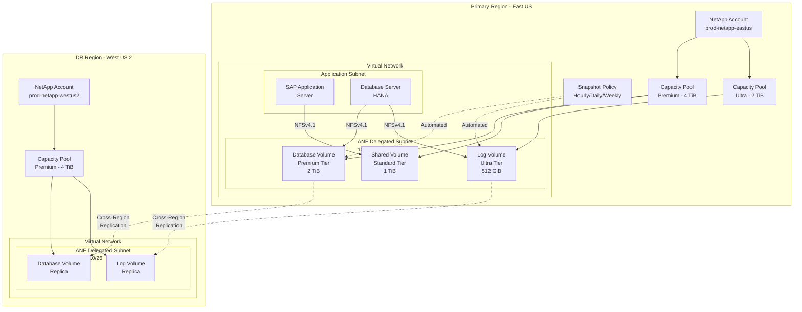
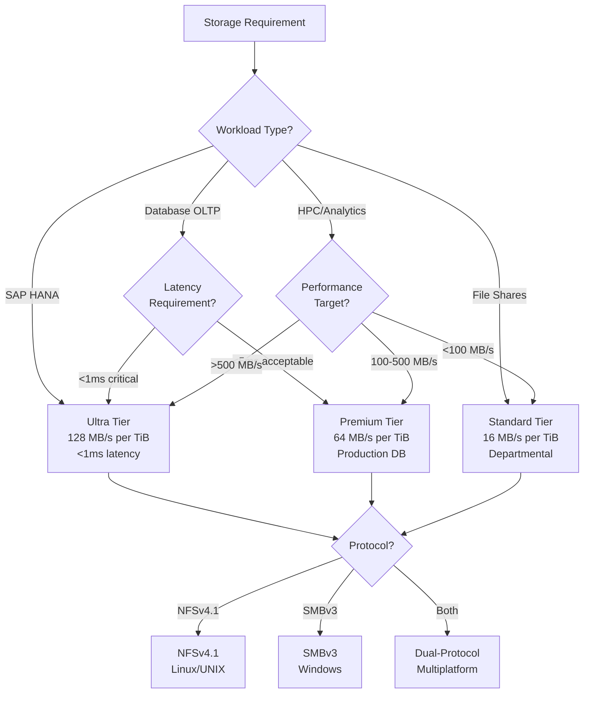
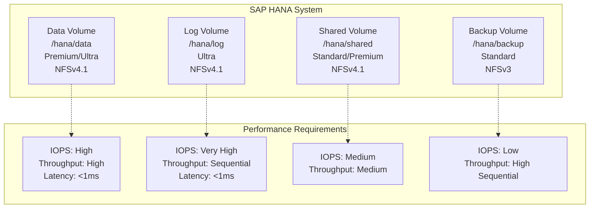

# Azure NetApp Files for Enterprise Workloads

**Author:** Randy Bordeaux  
**Date:** January 2026  
**Version:** 1.0  
**Azure Services:** Azure NetApp Files, Azure Virtual Network, Azure Private Endpoint, Azure Monitor, Log Analytics, Azure NetApp Files Backup, Azure Application Volume Group

## Executive Summary

Azure NetApp Files delivers enterprise-grade NAS storage as a fully managed Azure service, providing high-performance NFS, SMB, and dual-protocol file shares. Organizations running latency-sensitive workloads such as SAP HANA, Oracle databases, high-performance computing (HPC), and electronic design automation (EDA) require sub-millisecond latency and consistent IOPS that traditional cloud storage cannot deliver. Azure NetApp Files addresses these requirements through NetApp ONTAP technology integrated natively into Azure datacenters.

This whitepaper provides implementation guidance for deploying Azure NetApp Files using Terraform as the authoritative infrastructure-as-code mechanism. The architecture covers capacity pool provisioning, service level selection (Standard, Premium, Ultra), volume creation with appropriate protocols, snapshot policies, cross-region replication for disaster recovery, and integration with SAP and Oracle workloads.

All infrastructure is provisioned deterministically via Terraform with CI/CD-based execution. Security is embedded throughout with subnet delegation, network security groups, export policies for NFS, and comprehensive monitoring via Azure Monitor. The guidance targets experienced Azure engineers operating production enterprise applications where performance, reliability, and data protection are mandatory.

## Table of Contents

- [Executive Summary](#executive-summary)
- [Introduction](#introduction)
- [Problem Statement](#problem-statement)
- [Solution Overview](#solution-overview)
- [Technical Architecture](#technical-architecture)
- [Implementation Guide](#implementation-guide)
- [Best Practices](#best-practices)
- [Security Considerations](#security-considerations)
- [Cost Optimization](#cost-optimization)
- [Monitoring and Maintenance](#monitoring-and-maintenance)
- [Conclusion](#conclusion)
- [References](#references)
- [Appendices](#appendices)

## Introduction

### Scope and Assumptions

- Azure Commercial only
- Terraform (AzureRM provider) mandatory for all infrastructure
- NetApp account, capacity pools, and volumes as core resources
- Service level selection: Standard, Premium, or Ultra
- Protocol support: NFSv3, NFSv4.1, SMBv3, dual-protocol
- Cross-region replication for disaster recovery
- Integration with SAP HANA, Oracle, and HPC workloads
- Centralized monitoring via Log Analytics

### Architectural Principles

- Subnet delegation for Azure NetApp Files
- Service level aligned to workload performance requirements
- Snapshot policies for data protection
- Cross-region replication for disaster recovery
- Network security via NSGs and export policies
- Volume-level encryption
- Application-consistent backup integration

## Problem Statement

### Enterprise Storage Challenges

**On-Premises NetApp Limitations**
- High capital expenditure for hardware and licenses
- Data center space and power requirements
- Manual capacity expansion and scaling
- Complex SnapMirror replication configuration
- Hardware refresh cycles and maintenance windows
- Limited cloud integration

**Traditional Cloud Storage Inadequacy**
- High latency (>5ms) unsuitable for databases
- Inconsistent IOPS and throughput
- No native snapshot and cloning capabilities
- Limited protocol support (NFS/SMB)
- Inadequate for SAP HANA certification requirements
- Poor performance for HPC workloads

**Database Performance Requirements**
- Sub-millisecond latency for OLTP databases
- Consistent IOPS without throttling
- Large sequential I/O for data warehouse queries
- Snapshot-based backup without performance impact
- Rapid volume cloning for dev/test environments

**SAP HANA Specific Needs**
- TDI (Tailored Data Center Integration) certification
- Specific volume layout requirements
- Snapshot coordination with HANA backup
- Cross-region replication for DR
- Low latency for in-memory database operations

### Business Impact

- **Performance Degradation:** 50-80% slower database queries on inadequate storage
- **Downtime Risk:** Traditional backup methods require application quiesce
- **DR Complexity:** Manual replication and failover procedures increase RTO
- **Cost Inefficiency:** Over-provisioning IaaS storage to meet performance targets
- **Operational Overhead:** Managing file servers instead of focusing on applications

## Solution Overview

The solution establishes Azure NetApp Files as a high-performance, fully managed NAS service with native ONTAP capabilities. All infrastructure is provisioned via Terraform with capacity pools sized for performance requirements, volumes configured with appropriate service levels and protocols, and automated snapshots for data protection.

### Key Components

**NetApp Account**
- Regional boundary for capacity pools
- Delegated subnet for volume placement
- Active Directory integration for SMB

**Capacity Pool**
- Performance tier: Standard (16 MB/s per TiB), Premium (64 MB/s per TiB), Ultra (128 MB/s per TiB)
- QoS type: Auto (default) or Manual
- Minimum: 4 TiB per pool
- Maximum: 500 TiB per pool

**Volume**
- Protocol: NFSv3, NFSv4.1, SMBv3, dual-protocol
- Minimum: 100 GiB per volume
- Maximum: 100 TiB per volume
- Throughput calculated from service level and volume size

**Snapshot Policies**
- Hourly, daily, weekly, monthly schedules
- Retention counts per schedule
- Space-efficient snapshots via ONTAP technology

**Cross-Region Replication**
- Asynchronous replication between regions
- RPO based on replication schedule
- SnapMirror technology

### Success Criteria

- <1ms latency for database workloads
- Consistent IOPS without throttling
- Automated hourly snapshots with 48-hour retention
- Cross-region replication with RPO <15 minutes
- Zero downtime for snapshot-based backups
- SAP HANA TDI certification compliance

## Technical Architecture

### Azure NetApp Files Architecture



### Service Level Selection Decision Tree



### SAP HANA Volume Layout



## Implementation Guide

### Prerequisites

- Azure subscription with Contributor access
- Terraform 1.6+ with AzureRM provider 3.80+
- Virtual Network with dedicated subnet (minimum /26)
- Network Security Group rules for NFS/SMB
- Active Directory for SMB authentication (if using SMB)
- Log Analytics workspace
- Resource Provider registration: Microsoft.NetApp

### Step 1: NetApp Account and Capacity Pool

```hcl
# modules/azure-netapp-files/main.tf

# NetApp Account
resource "azurerm_netapp_account" "account" {
  name                = var.netapp_account_name
  resource_group_name = var.resource_group_name
  location            = var.location
  
  # Active Directory configuration for SMB
  active_directory {
    username            = var.ad_username
    password            = var.ad_password
    smb_server_name     = var.smb_server_name
    dns_servers         = var.dns_servers
    domain              = var.ad_domain
    organizational_unit = "OU=NetApp,OU=Servers,DC=contoso,DC=com"
  }
  
  tags = var.tags
}

# Premium capacity pool
resource "azurerm_netapp_pool" "premium" {
  name                = "${var.netapp_account_name}-premium-pool"
  resource_group_name = var.resource_group_name
  location            = var.location
  account_name        = azurerm_netapp_account.account.name
  
  service_level   = "Premium"  # 64 MB/s per TiB
  size_in_tb      = var.premium_pool_size_tb  # Minimum 4 TiB
  qos_type        = "Auto"  # Auto QoS based on volume size
  
  tags = var.tags
}

# Ultra capacity pool for critical workloads
resource "azurerm_netapp_pool" "ultra" {
  name                = "${var.netapp_account_name}-ultra-pool"
  resource_group_name = var.resource_group_name
  location            = var.location
  account_name        = azurerm_netapp_account.account.name
  
  service_level   = "Ultra"  # 128 MB/s per TiB
  size_in_tb      = var.ultra_pool_size_tb  # Minimum 4 TiB
  qos_type        = "Auto"
  
  tags = var.tags
}

# Standard capacity pool for non-critical workloads
resource "azurerm_netapp_pool" "standard" {
  name                = "${var.netapp_account_name}-standard-pool"
  resource_group_name = var.resource_group_name
  location            = var.location
  account_name        = azurerm_netapp_account.account.name
  
  service_level   = "Standard"  # 16 MB/s per TiB
  size_in_tb      = var.standard_pool_size_tb
  qos_type        = "Auto"
  
  tags = var.tags
}
```

### Step 2: Subnet Delegation

```hcl
# Delegate subnet to Microsoft.NetApp/volumes
resource "azurerm_subnet" "anf" {
  name                 = "anf-subnet"
  resource_group_name  = var.vnet_resource_group_name
  virtual_network_name = var.vnet_name
  address_prefixes     = ["10.0.1.0/26"]  # /26 minimum for ANF
  
  delegation {
    name = "netapp-delegation"
    
    service_delegation {
      name    = "Microsoft.NetApp/volumes"
      actions = [
        "Microsoft.Network/networkinterfaces/*",
        "Microsoft.Network/virtualNetworks/subnets/join/action"
      ]
    }
  }
}

# Network Security Group for ANF subnet
resource "azurerm_network_security_group" "anf" {
  name                = "anf-subnet-nsg"
  location            = var.location
  resource_group_name = var.resource_group_name
  
  tags = var.tags
}

# NSG rule: Allow NFS from application subnet
resource "azurerm_network_security_rule" "allow_nfs" {
  name                        = "AllowNFSFromAppSubnet"
  priority                    = 100
  direction                   = "Inbound"
  access                      = "Allow"
  protocol                    = "Tcp"
  source_port_range           = "*"
  destination_port_range      = "2049"  # NFS
  source_address_prefixes     = var.app_subnet_cidrs
  destination_address_prefix  = azurerm_subnet.anf.address_prefixes[0]
  resource_group_name         = var.resource_group_name
  network_security_group_name = azurerm_network_security_group.anf.name
}

# NSG rule: Allow SMB from application subnet
resource "azurerm_network_security_rule" "allow_smb" {
  name                        = "AllowSMBFromAppSubnet"
  priority                    = 110
  direction                   = "Inbound"
  access                      = "Allow"
  protocol                    = "Tcp"
  source_port_range           = "*"
  destination_port_ranges     = ["139", "445"]  # SMB
  source_address_prefixes     = var.app_subnet_cidrs
  destination_address_prefix  = azurerm_subnet.anf.address_prefixes[0]
  resource_group_name         = var.resource_group_name
  network_security_group_name = azurerm_network_security_group.anf.name
}

# Associate NSG with ANF subnet
resource "azurerm_subnet_network_security_group_association" "anf" {
  subnet_id                 = azurerm_subnet.anf.id
  network_security_group_id = azurerm_network_security_group.anf.id
}
```

### Step 3: Volume Creation (NFS)

```hcl
# NFS volume for database
resource "azurerm_netapp_volume" "database" {
  name                = "db-data-volume"
  resource_group_name = var.resource_group_name
  location            = var.location
  account_name        = azurerm_netapp_account.account.name
  pool_name           = azurerm_netapp_pool.premium.name
  volume_path         = "db-data"  # Unique within account
  service_level       = "Premium"
  subnet_id           = azurerm_subnet.anf.id
  protocols           = ["NFSv4.1"]
  storage_quota_in_gb = 2048  # 2 TiB
  
  # Security style for UNIX permissions
  security_style = "Unix"
  
  # Export policy for NFS access
  export_policy_rule {
    rule_index         = 1
    allowed_clients    = join(",", var.db_server_ips)  # Specific IPs only
    unix_read_only     = false
    unix_read_write    = true
    root_access_enabled = false  # No root squash
    protocols_enabled  = ["NFSv4.1"]
  }
  
  # Snapshot directory visible
  snapshot_directory_visible = true
  
  tags = var.tags
}

# NFS volume for transaction logs (Ultra for lowest latency)
resource "azurerm_netapp_volume" "logs" {
  name                = "db-log-volume"
  resource_group_name = var.resource_group_name
  location            = var.location
  account_name        = azurerm_netapp_account.account.name
  pool_name           = azurerm_netapp_pool.ultra.name
  volume_path         = "db-log"
  service_level       = "Ultra"
  subnet_id           = azurerm_subnet.anf.id
  protocols           = ["NFSv4.1"]
  storage_quota_in_gb = 512  # 512 GiB
  
  security_style = "Unix"
  
  export_policy_rule {
    rule_index         = 1
    allowed_clients    = join(",", var.db_server_ips)
    unix_read_only     = false
    unix_read_write    = true
    root_access_enabled = false
    protocols_enabled  = ["NFSv4.1"]
  }
  
  snapshot_directory_visible = true
  
  tags = var.tags
}
```

### Step 4: Volume Creation (SMB)

```hcl
# SMB volume for Windows workloads
resource "azurerm_netapp_volume" "smb_share" {
  name                = "win-file-share"
  resource_group_name = var.resource_group_name
  location            = var.location
  account_name        = azurerm_netapp_account.account.name
  pool_name           = azurerm_netapp_pool.standard.name
  volume_path         = "win-share"
  service_level       = "Standard"
  subnet_id           = azurerm_subnet.anf.id
  protocols           = ["CIFS"]  # SMB protocol
  storage_quota_in_gb = 1024
  
  # Security style for NTFS permissions
  security_style = "Ntfs"
  
  # SMB configuration
  smb_continuous_availability_enabled = true  # For Hyper-V, SQL Server
  smb_encryption_enabled              = true  # SMB 3.x encryption
  
  tags = var.tags
}
```

### Step 5: Snapshot Policy

```hcl
# Snapshot policy with multiple schedules
resource "azurerm_netapp_snapshot_policy" "policy" {
  name                = "production-snapshot-policy"
  resource_group_name = var.resource_group_name
  location            = var.location
  account_name        = azurerm_netapp_account.account.name
  enabled             = true
  
  # Hourly snapshots
  hourly_schedule {
    snapshots_to_keep = 48  # 48 hours
    minute            = 0   # Top of the hour
  }
  
  # Daily snapshots
  daily_schedule {
    snapshots_to_keep = 30  # 30 days
    hour              = 23  # 11 PM UTC
    minute            = 0
  }
  
  # Weekly snapshots
  weekly_schedule {
    snapshots_to_keep = 12  # 12 weeks
    days_of_week      = ["Sunday"]
    hour              = 23
    minute            = 0
  }
  
  # Monthly snapshots
  monthly_schedule {
    snapshots_to_keep = 12  # 12 months
    days_of_month     = [1]  # First of month
    hour              = 23
    minute            = 0
  }
  
  tags = var.tags
}

# Attach snapshot policy to volume
resource "azurerm_netapp_volume_snapshot_policy_attachment" "db_snapshot" {
  resource_group_name = var.resource_group_name
  account_name        = azurerm_netapp_account.account.name
  pool_name           = azurerm_netapp_pool.premium.name
  volume_name         = azurerm_netapp_volume.database.name
  snapshot_policy_id  = azurerm_netapp_snapshot_policy.policy.id
}
```

### Step 6: Cross-Region Replication

```hcl
# DR NetApp account in secondary region
resource "azurerm_netapp_account" "dr" {
  name                = "${var.netapp_account_name}-dr"
  resource_group_name = var.dr_resource_group_name
  location            = var.dr_location  # West US 2
  
  tags = var.tags
}

# DR capacity pool
resource "azurerm_netapp_pool" "dr_premium" {
  name                = "${var.netapp_account_name}-dr-premium-pool"
  resource_group_name = var.dr_resource_group_name
  location            = var.dr_location
  account_name        = azurerm_netapp_account.dr.name
  
  service_level   = "Premium"
  size_in_tb      = var.premium_pool_size_tb
  qos_type        = "Auto"
  
  tags = var.tags
}

# DR volume (replication destination)
resource "azurerm_netapp_volume" "dr_database" {
  name                = "db-data-volume-dr"
  resource_group_name = var.dr_resource_group_name
  location            = var.dr_location
  account_name        = azurerm_netapp_account.dr.name
  pool_name           = azurerm_netapp_pool.dr_premium.name
  volume_path         = "db-data-dr"
  service_level       = "Premium"
  subnet_id           = var.dr_anf_subnet_id
  protocols           = ["NFSv4.1"]
  storage_quota_in_gb = 2048
  
  security_style = "Unix"
  
  # Data protection configuration
  data_protection_replication {
    endpoint_type             = "Dst"  # Destination
    remote_volume_location    = var.location  # Source region
    remote_volume_resource_id = azurerm_netapp_volume.database.id
    replication_frequency     = "10minutes"  # Options: 10minutes, hourly, daily
  }
  
  tags = var.tags
}

# Authorize replication from source to destination
resource "azurerm_netapp_volume_replication" "db_replication" {
  name                                = "db-replication"
  location                            = var.location
  resource_group_name                 = var.resource_group_name
  account_name                        = azurerm_netapp_account.account.name
  pool_name                           = azurerm_netapp_pool.premium.name
  volume_name                         = azurerm_netapp_volume.database.name
  remote_volume_location              = var.dr_location
  remote_volume_resource_id           = azurerm_netapp_volume.dr_database.id
  replication_frequency               = "10minutes"
}
```

### Step 7: Monitoring and Diagnostics

```hcl
# Diagnostic settings for NetApp account
resource "azurerm_monitor_diagnostic_setting" "netapp" {
  name                       = "${var.netapp_account_name}-diagnostics"
  target_resource_id         = azurerm_netapp_account.account.id
  log_analytics_workspace_id = var.log_analytics_workspace_id
  
  enabled_log {
    category = "AuditLogs"
  }
  
  metric {
    category = "AllMetrics"
    enabled  = true
  }
}

# Alert on volume capacity
resource "azurerm_monitor_metric_alert" "volume_capacity" {
  name                = "${azurerm_netapp_volume.database.name}-capacity-alert"
  resource_group_name = var.resource_group_name
  scopes              = [azurerm_netapp_volume.database.id]
  description         = "Volume capacity exceeds 85%"
  
  criteria {
    metric_namespace = "Microsoft.NetApp/netAppAccounts/capacityPools/volumes"
    metric_name      = "VolumeLogicalSize"
    aggregation      = "Average"
    operator         = "GreaterThan"
    threshold        = azurerm_netapp_volume.database.storage_quota_in_gb * 0.85 * 1073741824  # 85% in bytes
  }
  
  frequency   = "PT5M"
  window_size = "PT15M"
  severity    = 2
}

# Alert on replication lag
resource "azurerm_monitor_metric_alert" "replication_lag" {
  name                = "db-replication-lag-alert"
  resource_group_name = var.resource_group_name
  scopes              = [azurerm_netapp_volume.database.id]
  description         = "Replication lag exceeds 30 minutes"
  
  criteria {
    metric_namespace = "Microsoft.NetApp/netAppAccounts/capacityPools/volumes"
    metric_name      = "ReplicationLagTime"
    aggregation      = "Average"
    operator         = "GreaterThan"
    threshold        = 1800  # 30 minutes in seconds
  }
  
  frequency   = "PT5M"
  window_size = "PT15M"
  severity    = 1
}
```

## Best Practices

### Service Level Selection

| Workload Type | Service Level | Throughput | Use Case |
|---------------|---------------|------------|----------|
| SAP HANA Data | Ultra | 128 MB/s per TiB | In-memory database, <1ms latency |
| SAP HANA Log | Ultra | 128 MB/s per TiB | Sequential writes, critical path |
| Oracle OLTP | Premium | 64 MB/s per TiB | Production database, <3ms latency |
| SQL Server | Premium | 64 MB/s per TiB | General purpose databases |
| File Shares | Standard | 16 MB/s per TiB | Departmental shares, home directories |
| Backup/Archive | Standard | 16 MB/s per TiB | Cold storage, infrequent access |

### Capacity Pool Sizing

**Throughput Calculation**
```
Total Throughput = Pool Size (TiB) × Service Level Throughput
Premium 10 TiB pool = 10 × 64 = 640 MB/s total
```

**Volume Throughput Allocation (Auto QoS)**
```
Volume Throughput = (Volume Size / Pool Size) × Pool Throughput
2 TiB volume in 10 TiB Premium pool = (2/10) × 640 = 128 MB/s
```

**Right-Sizing Strategy**
- Start with minimum pool size (4 TiB)
- Monitor volume throughput utilization
- Scale pool size if aggregate volume throughput approaches limit
- Migrate volumes between pools for workload optimization

### Volume Layout for SAP HANA

**Single-Node SAP HANA (≤2 TB RAM)**
| Volume | Mount Point | Size | Service Level | Protocol | Purpose |
|--------|-------------|------|---------------|----------|---------|
| Data | /hana/data | 1.2× RAM | Premium/Ultra | NFSv4.1 | Database files |
| Log | /hana/log | 0.5× RAM | Ultra | NFSv4.1 | Redo logs |
| Shared | /hana/shared | 1× RAM (min 1 TB) | Premium | NFSv4.1 | Shared files |
| Backup | /hanabackup | 2× (Data+Log) | Standard | NFSv3 | Backup staging |

**Multi-Node SAP HANA (>2 TB RAM)**
- Application volume group for optimized deployment
- Separate data volumes per node
- Shared log volume across nodes
- Manual placement groups for proximity

### Snapshot Management

**Snapshot Best Practices**
- Hourly snapshots: Short-term recovery (48 hours)
- Daily snapshots: Point-in-time restore (30 days)
- Weekly snapshots: Long-term reference (12 weeks)
- Monthly snapshots: Compliance retention (12 months)

**Snapshot Space Consumption**
```
Snapshot space = Changed blocks since snapshot creation
100 GB volume with 10% daily change = 10 GB per day
After 30 days = 300 GB snapshot space
```

**Snapshot Restore**
```bash
# Create volume from snapshot
az netappfiles volume create \
  --resource-group prod-rg \
  --account-name prod-netapp \
  --pool-name premium-pool \
  --name db-restored \
  --volume-path db-restored \
  --service-level Premium \
  --subnet-id /subscriptions/.../subnets/anf-subnet \
  --usage-threshold 2199023255552 \
  --snapshot-id /subscriptions/.../snapshots/hourly-2026-01-18-0800
```

### Protocol Selection Guidelines

**NFSv4.1 (Recommended)**
- Better performance than NFSv3
- Built-in security (Kerberos support)
- File locking improvements
- Required for SAP HANA on ANF

**NFSv3**
- Legacy application compatibility
- Simpler configuration (no Kerberos required)
- Use for backup volumes

**SMBv3**
- Windows workloads
- SQL Server FCI (Failover Cluster Instance)
- Hyper-V over SMB
- Continuous availability for application-level HA

**Dual-Protocol**
- Mixed Windows/Linux environments
- Security style determines permission model (NTFS or UNIX)
- Complex permission management

## Security Considerations

### Network Isolation

**Subnet Delegation**
- Dedicated subnet for ANF volumes
- Minimum /26 (64 addresses)
- Cannot be shared with other resources
- NSG rules to restrict access

**Export Policy (NFS)**
```hcl
export_policy_rule {
  rule_index         = 1
  allowed_clients    = "10.0.2.10,10.0.2.11,10.0.2.12"  # Specific IPs
  unix_read_only     = false
  unix_read_write    = true
  root_access_enabled = false  # No root squash
  protocols_enabled  = ["NFSv4.1"]
}

# Additional rule for backup server with read-only
export_policy_rule {
  rule_index         = 2
  allowed_clients    = "10.0.3.20"  # Backup server
  unix_read_only     = true
  unix_read_write    = false
  root_access_enabled = false
  protocols_enabled  = ["NFSv3"]  # NFSv3 for backup tools
}
```

**SMB Security**
```hcl
# Enable SMB encryption
smb_encryption_enabled = true

# Enable continuous availability
smb_continuous_availability_enabled = true

# Active Directory integration mandatory
active_directory {
  username            = var.ad_username
  password            = var.ad_password
  smb_server_name     = "ANF-SMB-01"
  dns_servers         = ["10.0.0.4", "10.0.0.5"]
  domain              = "contoso.com"
  organizational_unit = "OU=NetApp,OU=Servers,DC=contoso,DC=com"
}
```

### Encryption

**Encryption at Rest**
- Automatic encryption using platform-managed keys
- Customer-managed keys not currently supported
- FIPS 140-2 compliant

**Encryption in Transit**
- NFSv4.1: Kerberos encryption (krb5p)
- SMBv3: AES-256-GCM encryption
- Enforce encrypted connections via export policy or SMB settings

### Access Control

**UNIX Permissions (NFS)**
```bash
# Mount volume on Linux client
sudo mount -t nfs -o rw,hard,rsize=65536,wsize=65536,vers=4.1,tcp,sec=sys prod-netapp.volume-path:/db-data /mnt/db-data

# Set UNIX permissions
sudo chown oracle:dba /mnt/db-data
sudo chmod 750 /mnt/db-data
```

**NTFS Permissions (SMB)**
```powershell
# Mount SMB share on Windows
net use Z: \\prod-netapp.volume-path\win-share

# Configure NTFS ACLs
$acl = Get-Acl Z:\
$rule = New-Object System.Security.AccessControl.FileSystemAccessRule("CONTOSO\DBAdmins", "FullControl", "ContainerInherit,ObjectInherit", "None", "Allow")
$acl.AddAccessRule($rule)
Set-Acl Z:\ $acl
```

### Compliance and Audit

**Audit Logging**
```kusto
// ANF audit log query
AzureDiagnostics
| where ResourceProvider == "MICROSOFT.NETAPP"
| where Category == "AuditLogs"
| project TimeGenerated, OperationName, CallerIpAddress, ResourceId, ResultDescription
| order by TimeGenerated desc
```

**Regulatory Compliance**
- HIPAA compliant
- PCI DSS Level 1
- SOC 2 Type II
- ISO 27001, 27017, 27018
- GDPR compliant

## Cost Optimization

### Pricing Model (East US, January 2026)

**Standard Tier**
- Capacity: $0.000202/GiB/hour ($147/TiB/month)
- Throughput: 16 MB/s per TiB

**Premium Tier**
- Capacity: $0.000403/GiB/hour ($293/TiB/month)
- Throughput: 64 MB/s per TiB

**Ultra Tier**
- Capacity: $0.000672/GiB/hour ($488/TiB/month)
- Throughput: 128 MB/s per TiB

**Snapshots**
- $0.000049/GiB/hour ($36/TiB/month)
- Incremental storage only (changed blocks)

**Cross-Region Replication**
- Data transfer: $0.02/GB outbound
- Destination volume: Charged at standard capacity rate

### Cost Optimization Strategies

**1. Right-Size Capacity Pools**
```hcl
# Start with minimum pool size
resource "azurerm_netapp_pool" "optimized" {
  name          = "optimized-pool"
  service_level = "Premium"
  size_in_tb    = 4  # Minimum 4 TiB
  
  # Scale up as volumes grow
}

# Monitor pool utilization
# Expand pool only when approaching capacity limit
```

**2. Service Level Segregation**
```
Production databases → Premium/Ultra pools
Development/Test → Standard pools
Backup/Archive → Standard pools with manual snapshots
```

**3. Volume Cloning for Dev/Test**
```bash
# Clone production volume for dev/test (no additional data charge initially)
az netappfiles volume create \
  --resource-group dev-rg \
  --account-name dev-netapp \
  --pool-name standard-pool \
  --name db-dev-clone \
  --volume-path db-dev \
  --service-level Standard \
  --subnet-id /subscriptions/.../subnets/anf-subnet \
  --usage-threshold 2199023255552 \
  --snapshot-id /subscriptions/.../snapshots/prod-snapshot
```

**4. Snapshot Retention Optimization**
```hcl
# Reduce snapshot retention for non-production
hourly_schedule {
  snapshots_to_keep = 24  # 24 hours instead of 48
  minute            = 0
}

daily_schedule {
  snapshots_to_keep = 7  # 7 days instead of 30
  hour              = 23
  minute            = 0
}
```

**5. Cross-Region Replication Frequency**
```hcl
# Adjust replication frequency based on RPO requirements
data_protection_replication {
  endpoint_type             = "Dst"
  remote_volume_location    = var.location
  remote_volume_resource_id = azurerm_netapp_volume.source.id
  replication_frequency     = "hourly"  # Hourly for non-critical (vs 10minutes)
}
```

### Cost Monitoring

```kusto
// Monthly ANF cost breakdown
AzureCostManagement
| where TimeGenerated > ago(30d)
| where ServiceName == "Azure NetApp Files"
| summarize MonthlyCost = sum(CostInBillingCurrency) by MeterCategory, MeterSubCategory
| order by MonthlyCost desc
```

**Cost Comparison: ANF vs Alternatives**
| Solution | Monthly Cost (10 TiB) | Performance | Operational Overhead |
|----------|----------------------|-------------|---------------------|
| ANF Premium | $2,930 | 640 MB/s, <1ms | Minimal |
| Premium SSD (P50) | ~$4,500 | 250 MB/s, ~2ms | High (VM management) |
| Ultra Disk | ~$6,000 | Configurable | High (VM management) |
| On-Premises NetApp | $15,000-30,000 | Variable | Very High (hardware, DC) |

## Monitoring and Maintenance

### Key Metrics

**Volume Metrics**
- `VolumeLogicalSize`: Current volume consumption
- `VolumeSnapshotSize`: Snapshot space consumption
- `VolumeConsumedSize`: Total (logical + snapshot)
- `ReadIops`, `WriteIops`: IOPS performance
- `ReadThroughput`, `WriteThroughput`: MB/s performance
- `AverageReadLatency`, `AverageWriteLatency`: Latency in microseconds

**Pool Metrics**
- `PoolAllocatedSize`: Total volume allocation
- `PoolProvisionedThroughput`: Total pool throughput
- `PoolAllocatedToVolume`: Pool utilization percentage

**Replication Metrics**
- `ReplicationLagTime`: Seconds behind source
- `ReplicationLastTransferSize`: Last transfer size
- `ReplicationLastTransferDuration`: Last transfer time
- `ReplicationHealthy`: Replication status (0=unhealthy, 1=healthy)

### KQL Queries

**Latency Analysis**
```kusto
AzureMetrics
| where ResourceProvider == "MICROSOFT.NETAPP"
| where MetricName in ("AverageReadLatency", "AverageWriteLatency")
| where TimeGenerated > ago(1h)
| summarize Avg_Latency_us = avg(Average) by MetricName, bin(TimeGenerated, 5m)
| project TimeGenerated, MetricName, Avg_Latency_ms = Avg_Latency_us / 1000
| render timechart
```

**Throughput Utilization**
```kusto
AzureMetrics
| where ResourceProvider == "MICROSOFT.NETAPP"
| where MetricName in ("ReadThroughput", "WriteThroughput")
| where TimeGenerated > ago(24h)
| extend Volume = tostring(split(ResourceId, "/")[-1])
| summarize Total_Throughput_MBps = sum(Average) / 1048576 by Volume, bin(TimeGenerated, 15m)
| render timechart
```

**Snapshot Growth Rate**
```kusto
AzureMetrics
| where ResourceProvider == "MICROSOFT.NETAPP"
| where MetricName == "VolumeSnapshotSize"
| where TimeGenerated > ago(7d)
| extend Volume = tostring(split(ResourceId, "/")[-1])
| summarize Snapshot_Size_GiB = avg(Average) / 1073741824 by Volume, bin(TimeGenerated, 1d)
| render timechart
```

**Replication Health**
```kusto
AzureMetrics
| where ResourceProvider == "MICROSOFT.NETAPP"
| where MetricName == "ReplicationHealthy"
| where TimeGenerated > ago(24h)
| extend Volume = tostring(split(ResourceId, "/")[-1])
| summarize Health_Status = min(Average) by Volume, bin(TimeGenerated, 5m)
| where Health_Status == 0  // Unhealthy
```

### Alerting Strategy

```hcl
# Critical: Volume capacity exceeds 90%
resource "azurerm_monitor_metric_alert" "volume_critical" {
  name                = "volume-capacity-critical"
  resource_group_name = var.resource_group_name
  scopes              = [azurerm_netapp_volume.database.id]
  
  criteria {
    metric_namespace = "Microsoft.NetApp/netAppAccounts/capacityPools/volumes"
    metric_name      = "VolumeConsumedSizePercentage"
    aggregation      = "Average"
    operator         = "GreaterThan"
    threshold        = 90
  }
  
  frequency   = "PT5M"
  window_size = "PT15M"
  severity    = 0  # Critical
}

# Warning: Latency exceeds 5ms
resource "azurerm_monitor_metric_alert" "latency_warning" {
  name                = "volume-latency-warning"
  resource_group_name = var.resource_group_name
  scopes              = [azurerm_netapp_volume.database.id]
  
  dynamic_criteria {
    metric_namespace  = "Microsoft.NetApp/netAppAccounts/capacityPools/volumes"
    metric_name       = "AverageReadLatency"
    aggregation       = "Average"
    operator          = "GreaterThan"
    alert_sensitivity = "Medium"
  }
  
  frequency   = "PT5M"
  window_size = "PT15M"
  severity    = 2
}
```

### Maintenance Tasks

**Daily**
- Review volume capacity utilization
- Monitor replication health and lag
- Check snapshot schedules executed successfully

**Weekly**
- Analyze latency and throughput trends
- Review export policy and access controls
- Validate backup/restore procedures

**Monthly**
- Performance tuning based on workload patterns
- Capacity planning for pool expansion
- Review and optimize snapshot retention
- Audit security configurations

**Quarterly**
- Disaster recovery failover test
- Service level optimization review
- Cost optimization analysis
- Compliance audit

## Conclusion

Azure NetApp Files provides enterprise-grade NAS storage with sub-millisecond latency, consistent IOPS, and native ONTAP capabilities integrated into Azure. Organizations running latency-sensitive workloads such as SAP HANA, Oracle databases, and HPC applications achieve performance requirements that traditional cloud storage cannot deliver while eliminating the operational overhead of on-premises NetApp infrastructure.

The architecture presented in this whitepaper establishes Azure NetApp Files with appropriate service level selection (Standard, Premium, Ultra), protocol configuration (NFSv3, NFSv4.1, SMBv3), snapshot policies for data protection, and cross-region replication for disaster recovery. Terraform ensures deterministic infrastructure provisioning with capacity pools and volumes defined as code.

Integration with SAP HANA follows TDI certification requirements with optimized volume layout, appropriate service levels for data and log volumes, and application volume groups for multi-node deployments. Snapshot coordination with HANA backup provides application-consistent recovery points without performance impact.

Key outcomes from this architecture:
- **Performance:** <1ms latency, up to 4.5 GB/s per volume, 320,000 IOPS
- **Availability:** 99.99% SLA, cross-region replication for DR
- **Data Protection:** Space-efficient snapshots, point-in-time restore, volume cloning
- **Integration:** Native support for SAP HANA, Oracle, SQL Server, VMware
- **Cost:** Lower TCO vs on-premises NetApp, flexible service level migration

## References

1. Azure NetApp Files documentation: https://docs.microsoft.com/azure/azure-netapp-files/
2. SAP HANA on ANF: https://docs.microsoft.com/azure/azure-netapp-files/azure-netapp-files-solution-architectures#sap-hana
3. Performance considerations: https://docs.microsoft.com/azure/azure-netapp-files/azure-netapp-files-performance-considerations
4. Cross-region replication: https://docs.microsoft.com/azure/azure-netapp-files/cross-region-replication-introduction
5. Azure NetApp Files pricing: https://azure.microsoft.com/pricing/details/netapp/

## Appendices

### Appendix A: Service Level Comparison

| Service Level | Throughput | Typical Latency | Use Case |
|---------------|------------|-----------------|----------|
| Standard | 16 MB/s per TiB | 5-10ms | File shares, backup, archive |
| Premium | 64 MB/s per TiB | 1-3ms | Production databases, VMs |
| Ultra | 128 MB/s per TiB | <1ms | SAP HANA, Oracle RAC, HPC |

**Throughput Examples:**
- 1 TiB Standard volume: 16 MB/s
- 1 TiB Premium volume: 64 MB/s
- 1 TiB Ultra volume: 128 MB/s
- 10 TiB Ultra volume: 1,280 MB/s (1.25 GB/s)

### Appendix B: SAP HANA Certification

**TDI Requirements (ANF)**
- Service Level: Premium or Ultra
- Protocol: NFSv4.1
- Volume layout: Separate data, log, shared volumes
- Mount options: `rw,vers=4.1,hard,timeo=600,rsize=262144,wsize=262144,noatime,lock,_netdev,sec=sys`

**Certified VM SKUs for SAP HANA on ANF:**
- M-Series: M32ts, M32ls, M64ls, M64s, M128s
- E-Series: E20ds_v4, E32ds_v4, E48ds_v4, E64ds_v4
- Certified up to 12 TB RAM (single-node)

### Appendix C: Mount Commands

**NFSv4.1 Mount (Linux)**
```bash
# Create mount point
sudo mkdir -p /mnt/db-data

# Mount with recommended options
sudo mount -t nfs -o rw,hard,rsize=262144,wsize=262144,vers=4.1,tcp,timeo=600,_netdev prod-netapp.eastus.azure.com:/db-data /mnt/db-data

# Persistent mount via /etc/fstab
echo "prod-netapp.eastus.azure.com:/db-data /mnt/db-data nfs rw,hard,rsize=262144,wsize=262144,vers=4.1,tcp,timeo=600,_netdev 0 0" | sudo tee -a /etc/fstab

# Verify mount
df -h /mnt/db-data
mount | grep db-data
```

**SMB Mount (Windows)**
```powershell
# Mount SMB share
net use Z: \\prod-netapp.eastus.azure.com\win-share /persistent:yes

# Verify mount
Get-PSDrive Z
```

**NFSv4.1 with Kerberos (Secure)**
```bash
# Configure krb5.conf for Kerberos
sudo vi /etc/krb5.conf

# Mount with Kerberos encryption
sudo mount -t nfs -o sec=krb5p,vers=4.1,rw,hard,rsize=262144,wsize=262144 prod-netapp.eastus.azure.com:/db-data /mnt/db-data
```

### Appendix D: Disaster Recovery Procedures

**Failover to DR Volume**
```bash
# Break replication (DR region becomes read/write)
az netappfiles volume replication suspend \
  --resource-group prod-rg \
  --account-name prod-netapp \
  --pool-name premium-pool \
  --volume-name db-data-volume

# Authorize break
az netappfiles volume replication break \
  --resource-group dr-rg \
  --account-name prod-netapp-dr \
  --pool-name dr-premium-pool \
  --volume-name db-data-volume-dr

# DR volume now writable - mount on DR application servers
```

**Failback to Primary Region**
```bash
# Reverse replication direction
az netappfiles volume replication re-initialize \
  --resource-group dr-rg \
  --account-name prod-netapp-dr \
  --pool-name dr-premium-pool \
  --volume-name db-data-volume-dr

# After sync complete, break replication in DR
az netappfiles volume replication break \
  --resource-group prod-rg \
  --account-name prod-netapp \
  --pool-name premium-pool \
  --volume-name db-data-volume

# Primary volume now writable - resume normal operations
```

### Appendix E: Performance Tuning

**NFS Mount Options**
```bash
# SAP HANA recommended
mount -t nfs -o rw,vers=4.1,hard,timeo=600,rsize=262144,wsize=262144,noatime,lock,_netdev,sec=sys

# Database workloads
mount -t nfs -o vers=4.1,rsize=262144,wsize=262144,hard,timeo=600,retrans=2,_netdev

# Large file transfers
mount -t nfs -o vers=4.1,rsize=1048576,wsize=1048576,hard,_netdev
```

**Throughput Calculation**
```
Volume Throughput Limit = (Volume Quota / Pool Size) × Pool Throughput

Example:
- Pool: 10 TiB Premium (640 MB/s)
- Volume: 2 TiB
- Volume Throughput: (2/10) × 640 = 128 MB/s
```

**Pool Expansion for Performance**
```bash
# Expand capacity pool to increase aggregate throughput
az netappfiles pool update \
  --resource-group prod-rg \
  --account-name prod-netapp \
  --pool-name premium-pool \
  --size 20  # Expand from 10 TiB to 20 TiB

# New pool throughput: 20 × 64 = 1,280 MB/s
# Volume throughput now: (2/20) × 1280 = 128 MB/s (unchanged)
# But total pool throughput doubled for other volumes
```

---

**Last Updated:** January 2026  
**Review Schedule:** July 2026  
**Document Classification:** Internal Use
